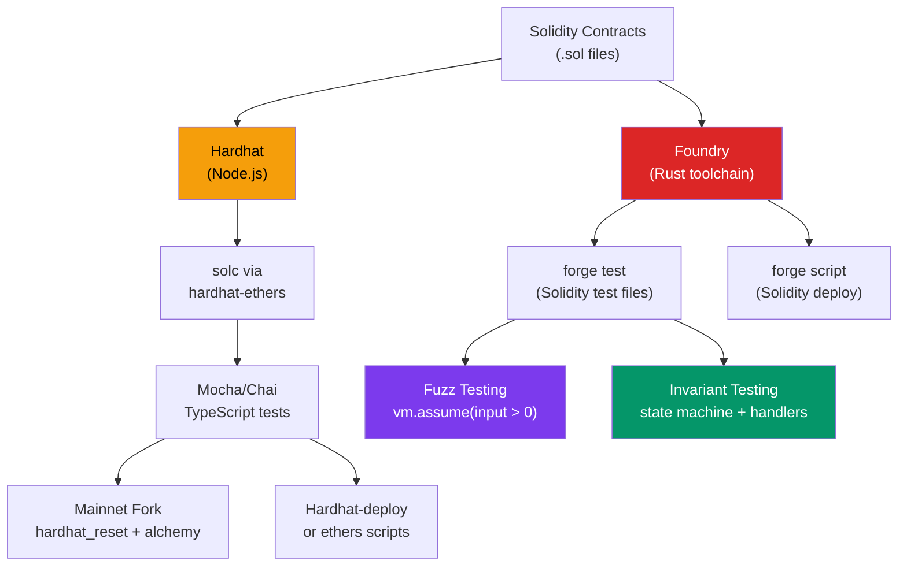

# 🔨 Hardhat and Foundry

> [!abstract] TL;DR
> **Hardhat** (Node.js, TypeScript) and **Foundry** (Rust, Solidity-native testing) are the two dominant smart contract development frameworks. Hardhat excels at integration testing with JavaScript/TypeScript, plugin ecosystem, and mainnet forking via `hardhat_reset`. Foundry excels at **fuzz testing** (provide random inputs, `vm.assume` to filter), **invariant testing** (state machine testing where handlers call random functions in random order and checkers verify protocol invariants after every call sequence), speed (Rust-based compilation + testing), and gas snapshots. `forge test --fork-url` enables mainnet state. `forge script` deploys with Solidity scripts. Both support the same `vm.prank/deal/warp` cheatcodes. Use Foundry for unit/fuzz/invariant tests; use Hardhat for integration tests with TypeScript tooling and frontend integration.

## Intuition — analogy FIRST
Testing a smart contract without a framework is like testing a bridge by driving a car across it every time you change a bolt. Foundry is a purpose-built load-testing machine that can throw millions of random configurations at the bridge in seconds and scream if any one breaks it. Hardhat is a workshop where engineers in TypeScript lab coats can precisely control the environment (simulate any block timestamp, impersonate any address, test interaction with deployed protocols on mainnet).

Fuzz testing specifically is like hiring 10,000 random users and telling each to try random things with your contract — any combination that causes unexpected behavior is immediately flagged. It finds edge cases humans never think to test: a 2^128 input that overflows, a 0-value transfer that breaks an invariant, a user who sends exactly the right token amount to expose a rounding error.

---

## How It Works



---

## Key Concepts / Details

### Foundry Suite
- **`forge`**: build, test, fuzz, invariant test, deploy
- **`cast`**: CLI for chain interaction (call functions, send tx, decode calldata)
- **`anvil`**: local Ethereum node (like Hardhat Network but Rust — 10× faster)
- **`chisel`**: interactive Solidity REPL

**Installation**:
```bash
curl -L https://foundry.paradigm.xyz | bash
foundryup
```

### Foundry Unit Tests
```solidity
// test/Token.t.sol
pragma solidity ^0.8.20;
import "forge-std/Test.sol";
import "../src/Token.sol";

contract TokenTest is Test {
    Token token;
    address alice = makeAddr("alice");
    address bob = makeAddr("bob");

    function setUp() public {
        token = new Token("Test", "TST", 18);
        token.mint(alice, 1000e18);
    }

    function test_Transfer() public {
        vm.prank(alice);           // next call from alice
        token.transfer(bob, 100e18);
        
        assertEq(token.balanceOf(alice), 900e18);
        assertEq(token.balanceOf(bob), 100e18);
    }

    function test_RevertWhen_InsufficientBalance() public {
        vm.prank(alice);
        vm.expectRevert();
        token.transfer(bob, 2000e18);  // alice only has 1000
    }
}
```

**Key cheatcodes** (`vm.*`):

| Cheatcode | Description |
|-----------|-------------|
| `vm.prank(addr)` | Next call from `addr` |
| `vm.startPrank(addr)` | All calls from `addr` until `stopPrank()` |
| `vm.deal(addr, amount)` | Set ETH balance |
| `vm.warp(timestamp)` | Set block timestamp |
| `vm.roll(blocknum)` | Set block number |
| `vm.expectRevert()` | Assert next call reverts |
| `vm.expectEmit()` | Assert event emitted |
| `vm.load(addr, slot)` | Read any storage slot |
| `vm.store(addr, slot, val)` | Write any storage slot |
| `vm.mockCall(addr, data, ret)` | Mock a specific call |
| `vm.createFork(url)` | Create mainnet fork |

### Foundry Fuzz Testing
```solidity
function testFuzz_Transfer(address to, uint256 amount) public {
    // Filter invalid inputs
    vm.assume(to != address(0));
    vm.assume(amount > 0 && amount <= 1000e18);  // alice's balance
    
    vm.prank(alice);
    token.transfer(to, amount);
    
    // Post-condition
    assertEq(token.totalSupply(), 1000e18);  // supply invariant
}
```

Run with: `forge test --fuzz-runs 10000 -vv`

Foundry's fuzzer uses property-based testing (similar to Hypothesis for Python). It generates random valid inputs, and the `vm.assume()` call discards invalid ones. After any failure, Foundry runs the **shrinking** algorithm to find the minimal failing case.

**vm.assume vs bound**:
- `vm.assume(x > 0)`: discard if condition fails (can be slow if many discards)
- `bound(x, min, max)`: map x into [min, max] range (no discards, more efficient)

```solidity
function testFuzz_Deposit(uint256 amount) public {
    amount = bound(amount, 1, type(uint128).max);  // efficient range binding
    // ...
}
```

### Foundry Invariant Testing
Invariant tests verify that a property holds across ALL possible sequences of function calls:

```solidity
// test/invariant/TokenInvariant.t.sol
contract TokenHandler is Test {
    Token token;
    
    constructor(Token _token) { token = _token; }
    
    // Handlers are the "actions" the fuzzer can call in any order
    function transfer(address to, uint256 amount) public {
        amount = bound(amount, 0, token.balanceOf(msg.sender));
        vm.prank(msg.sender);
        token.transfer(to, amount);
    }
    
    function mint(address to, uint256 amount) public {
        amount = bound(amount, 0, 1e30);
        token.mint(to, amount);
    }
}

contract TokenInvariantTest is Test {
    Token token;
    TokenHandler handler;
    
    function setUp() public {
        token = new Token(...);
        handler = new TokenHandler(token);
        
        // Tell foundry to call handler functions in random order
        targetContract(address(handler));
    }
    
    // These are CHECKED after every random function call sequence
    function invariant_totalSupplyMatchesSum() public {
        // Sum of all balances should equal totalSupply
        assertEq(
            token.balanceOf(alice) + token.balanceOf(bob) + ...,
            token.totalSupply()
        );
    }
}
```

Run: `forge test --match-contract Invariant --fuzz-runs 5000`

### Mainnet Forking
```solidity
// Foundry fork
function setUp() public {
    uint256 mainnetFork = vm.createFork("https://eth-mainnet.g.alchemy.com/v2/KEY");
    vm.selectFork(mainnetFork);
    // Now all contract addresses from mainnet are available
}
```

```typescript
// Hardhat fork (hardhat.config.ts)
networks: {
  hardhat: {
    forking: {
      url: "https://eth-mainnet.g.alchemy.com/v2/KEY",
      blockNumber: 20000000,  // pin to specific block for determinism
    },
  },
},
```

### Hardhat — Key Patterns
```typescript
// test/Token.ts
import { ethers } from "hardhat";
import { expect } from "chai";
import { loadFixture } from "@nomicfoundation/hardhat-toolbox/network-helpers";

async function deployFixture() {
  const [owner, alice, bob] = await ethers.getSigners();
  const Token = await ethers.getContractFactory("Token");
  const token = await Token.deploy("Test", "TST");
  return { token, owner, alice, bob };
}

describe("Token", () => {
  it("should transfer correctly", async () => {
    const { token, alice, bob } = await loadFixture(deployFixture);
    
    await token.transfer(alice.address, ethers.parseEther("100"));
    expect(await token.balanceOf(alice.address)).to.equal(ethers.parseEther("100"));
  });
  
  it("should revert on insufficient balance", async () => {
    const { token, alice, bob } = await loadFixture(deployFixture);
    
    await expect(
      token.connect(alice).transfer(bob.address, ethers.parseEther("1000"))
    ).to.be.revertedWithCustomError(token, "InsufficientBalance");
  });
});
```

### forge script — Deployment
```solidity
// script/Deploy.s.sol
pragma solidity ^0.8.20;
import "forge-std/Script.sol";
import "../src/Token.sol";

contract DeployScript is Script {
    function run() external {
        uint256 deployerPrivateKey = vm.envUint("PRIVATE_KEY");
        vm.startBroadcast(deployerPrivateKey);
        
        Token token = new Token("MyToken", "MTK", 18);
        console.log("Token deployed at:", address(token));
        
        vm.stopBroadcast();
    }
}
```

```bash
forge script script/Deploy.s.sol --rpc-url $MAINNET_RPC \
  --broadcast --verify --etherscan-api-key $ETHERSCAN_KEY
```

### Gas Snapshots
```bash
forge snapshot               # generate .gas-snapshot file
forge snapshot --diff        # compare with previous snapshot (CI use)
forge test --gas-report      # per-function gas stats
```

---

## Real-World Notes
- **Foundry dominates new projects**: as of 2025, ~60% of new Ethereum projects use Foundry exclusively; ~25% use both. Hardhat remains important for JavaScript-heavy frontends and older codebases.
- **Echidna** (Trail of Bits): alternative fuzzer for Solidity, property-based, can be more powerful than Foundry's fuzzer for specific invariant patterns.
- **Medusa**: another fuzzer with a focus on correctness and coverage.
- Foundry's `forge coverage` generates HTML coverage reports — use to ensure your invariant tests cover all code paths.
- **Slither** (Trail of Bits): static analysis tool that finds common vulnerability patterns (reentrancy, unsafe delegatecall, etc.) — run it alongside Foundry tests.

---

## Common Pitfalls
1. **Not pinning fork block number** — forking without a specific `blockNumber` fetches the latest block; this causes test non-determinism as the chain advances.
2. **Using `vm.assume` too aggressively** — if too many inputs are discarded, the fuzzer makes little progress. Prefer `bound()` for range constraints.
3. **Missing `setUp()` isolation** — each test in Foundry runs in an isolated EVM state; the `setUp()` function runs before each test. Stateful tests that modify storage affect later tests only if you explicitly call them in sequence.
4. **Not testing failure cases** — most test suites test the happy path; fuzz testing specifically finds failure cases. Always include `vm.expectRevert()` paths and invariant tests that check post-failure state consistency.

---

## Related Concepts
- [[_MOC_Web3_Development|↑ Web3 Development MOC]]
- [[Ethers_JS_and_Viem]] — Hardhat uses ethers.js v6; viem can also be used
- [[04_Ethereum_EVM/Upgradeable_Contracts|Upgradeable Contracts]] — hardhat-upgrades plugin validates upgrade safety
- [[04_Ethereum_EVM/Gas_and_Optimization|Gas & Optimization]] — forge gas snapshots track optimization improvements
- [[04_Ethereum_EVM/Solidity_Programming|Solidity Programming]] — test files import the same Solidity source

---

## Review Questions
1. You have a DeFi AMM contract. Design a set of invariants (at least 3) that should always hold regardless of what sequence of `swap`, `addLiquidity`, and `removeLiquidity` calls are made. Write them as Foundry invariant test functions.
2. A fuzz test discovers that `transferFrom(from, to, 0)` causes the contract to emit a Transfer event with amount 0 but doesn't reduce any balance — is this a bug? How would you use `vm.assume` and `bound` differently to target this edge case?
3. Compare the cost and complexity of: (a) a Hardhat integration test that tests an Uniswap v3 swap using a mainnet fork, (b) a Foundry unit test mocking the pool with `vm.mockCall`, and (c) a Foundry fork test using `vm.createFork`. When would you use each?

---

## Sources
- Foundry Book: book.getfoundry.sh
- Hardhat Documentation: hardhat.org/hardhat-runner/docs
- Trail of Bits — "Fuzzing Smart Contracts Using Foundry" (2022)
- OpenZeppelin — "Testing Smart Contracts" (2024)
- Paradigm — "Foundry: A fast, portable and modular toolkit for Ethereum" (2021)

#Blockchain #Web3Development #Hardhat #Foundry #Testing #SmartContractDev #Fuzzing
