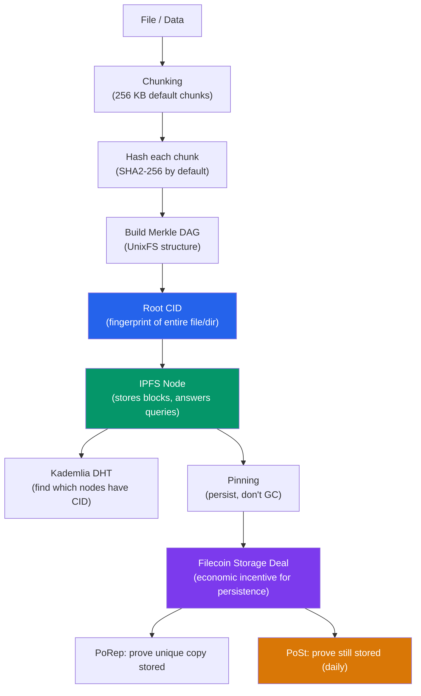

# 🗄️ IPFS and Filecoin

> [!abstract] TL;DR
> **IPFS (InterPlanetary File System)** is a peer-to-peer content-addressed file system where files are identified by their **CID (Content Identifier)** — a hash of the content itself — rather than location (URL). `CIDv1 = multibase(multicodec + multihash(content))`. Changing even one byte produces a different CID, making content tamper-evident. **Pinning** ensures a node keeps your content (otherwise IPFS garbage-collects it). **Filecoin** is a decentralized storage market built on IPFS: storage providers (miners) make verifiable cryptographic deals, proven via **PoRep** (Proof of Replication) and **PoSt** (Proof of Spacetime). NFT metadata stored on IPFS (`ipfs://CID/metadata.json`) is the standard for persistent decentralized metadata. Pinning services (Pinata, NFT.Storage, Web3.Storage) provide SLA-backed persistence without running your own node.

## Intuition — analogy FIRST
Traditional URLs are like home addresses: "the blue house on 123 Main Street." But if the house is demolished and rebuilt, the address is now wrong. IPFS uses **what** not **where**: each file's address is its own fingerprint (cryptographic hash). If you change one pixel in an image, it gets a completely new fingerprint — and you can always verify you received exactly what you asked for.

Filecoin turns this into a marketplace: storage providers bid to store your files, cryptographically prove they're still keeping them every day (like a monthly inspection visit), and get paid in FIL tokens for doing so. If they lose your files, the cryptographic proof fails and they're penalized.

---

## How It Works



---

## Key Concepts / Details

### Content Identifiers (CIDs)
A CID is a self-describing content address:

```
CIDv1 format:
<multibase><version><multicodec><multihash>

Example: bafybeigdyrzt5sfp7udm7hu76uh7y26nf3efuylqabf3oclgtqy55fbzdi

Breakdown:
b            = base32 (multibase prefix)
afy...       = CIDv1 (version 1)
beig...      = dag-pb (multicodec: Protobuf DAG)
dyrzt...     = sha2-256 (multihash algorithm: sha2-256) + 32-byte hash

CIDv0 format (older, backward compatible):
Qm...        = base58btc encoded sha2-256 multihash
              = implicitly dag-pb multicodec
```

**Why multihash?** The format is future-proof: if SHA-256 is broken, IPFS can upgrade to SHA-3 while still referencing old content. The algorithm is self-describing within the CID.

**Key properties**:
- **Content-addressed**: same content = same CID, anywhere in the world
- **Tamper-evident**: any modification produces a different CID
- **Self-certifying**: no trusted party needed to verify content integrity
- **Deduplication**: identical files share the same CID and storage

### IPFS Data Structures (UnixFS + Merkle DAG)
Files in IPFS are represented as a **DAG (Directed Acyclic Graph)** of blocks:

```
Large file (10 MB) → split into 256 KB chunks
Each chunk → one IPFS block with its own CID
Root block → links to all chunk CIDs + metadata
Root CID → the "address" of the complete file
```

For directories:
```
/my-nft/
├── metadata.json  → CID: Qmfile1...
├── image.png      → CID: Qmfile2...
└── ...

Directory CID: QmDir... → contains list of {name, CID} pairs
```

### IPFS Node Operations
```bash
# Initialize a local IPFS node
ipfs init
ipfs daemon &

# Add a file
ipfs add image.png
# → added QmHash... image.png

# Add a directory
ipfs add -r my-nft/
# → added QmDirHash... my-nft

# Retrieve content
ipfs cat QmHash...
ipfs get QmHash...

# Pin (persist) content
ipfs pin add QmHash...

# Check pinned content
ipfs pin ls

# Connect to HTTP gateway
curl https://ipfs.io/ipfs/QmHash...
curl https://cloudflare-ipfs.com/ipfs/QmHash...
```

**IPFS HTTP Gateways**: Public gateways (ipfs.io, cloudflare-ipfs.com, dweb.link) provide HTTP access to IPFS content. They cache popular content. Not decentralized — a single point of failure for public access.

### Pinning Services
Since IPFS has no built-in persistence (nodes GC unpinned content), **pinning services** maintain your content:

| Service | Free tier | Paid | NFT-focused |
|---------|----------|------|-------------|
| **Pinata** | 1 GB | $20/100GB/mo | Yes |
| **NFT.Storage** | Unlimited (backed by Filecoin) | Free | Yes |
| **Web3.Storage** (deprecated) | — | — | — |
| **Filebase** | S3-compatible | $0.0059/GB | No |

```typescript
// Pinata SDK
import { PinataSDK } from "pinata";

const pinata = new PinataSDK({ pinataJwt: process.env.PINATA_JWT });

// Upload file
const { IpfsHash } = await pinata.pinFileToIPFS(file, {
  pinataMetadata: { name: "MyNFT" },
});
console.log(`IPFS CID: ${IpfsHash}`);

// Upload JSON metadata
const { IpfsHash: metaCID } = await pinata.pinJSONToIPFS({
  name: "My NFT",
  description: "Description",
  image: `ipfs://${IpfsHash}`,
  attributes: [{ trait_type: "Rarity", value: "Rare" }],
});
```

### NFT Metadata Standard
EIP-721 requires `tokenURI()` to return a URL pointing to a JSON file. IPFS URLs are the standard:

```json
// ipfs://QmMetadataCID/metadata.json
{
  "name": "Cool NFT #42",
  "description": "A unique digital collectible",
  "image": "ipfs://QmImageCID/image.png",
  "attributes": [
    { "trait_type": "Background", "value": "Blue" },
    { "trait_type": "Eyes", "value": "Laser" }
  ]
}
```

**Why IPFS for NFTs**:
- `https://myserver.com/token/42` = server can change the image (rug pull)
- `ipfs://QmImageCID` = image is cryptographically bound to the CID — immutable

### Filecoin
Filecoin is an incentive layer on top of IPFS:

**Storage deal flow**:
1. Client negotiates deal with storage provider: `(data_CID, price_per_GiB, duration, start_epoch, end_epoch)`
2. Client pays upfront; funds escrowed in Filecoin smart contracts
3. Provider seals the data using PoRep (Proof of Replication):
   - **Commitment**: `CommD` (unsealed, hash of data), `CommR` (sealed, deterministic transform)
   - **Sealing**: data encoded into 32 GiB sectors using an encoding scheme that makes it hard to fake
4. Provider submits PoRep proof on-chain — proves they have a unique physical copy
5. Provider submits **WindowPoSt** (Proof of Spacetime) periodically (every ~24 hours):
   - Samples random leaf of sealed sector → must produce proof
   - Failure → slashed (sector marked "faulty")

**FVM (Filecoin Virtual Machine)**: Filecoin has an EVM-compatible VM — storage deals, retrieval markets, and DeFi on Filecoin all as smart contracts.

**Retrieval market**: After the initial free bandwidth, retrieval requires payment channels (similar to Lightning) or FIL micropayments.

### IPFS vs Other Storage Solutions

| Solution | Trust model | Persistence | Retrieval speed | Cost |
|----------|-------------|------------|-----------------|------|
| IPFS (no pinning) | Decentralized | No guarantee | Fast if cached | Free |
| IPFS + pinning service | Centralized (pinning service) | SLA-based | Fast | ~$1-20/GB/mo |
| Filecoin | Decentralized | Cryptographic | Minutes to hours | ~$0.02/GiB/mo |
| Arweave | Decentralized | Permanent (endowment) | Fast | One-time $0.50-5/MB |
| Swarm | Decentralized | Staked nodes | Medium | ~$0.01/GB/mo |
| Centralized (S3, GCP) | Centralized | SLA | Very fast | ~$0.023/GB/mo |

**Arweave**: Uses a one-time "storage endowment" model — pay once, stored for 200+ years (in theory). Popular for NFT metadata that must be truly permanent.

---

## Real-World Notes
- OpenSea's NFT metadata service experienced outages in 2021-2022 when NFTs linked to centralized servers — reinforcing the shift to IPFS.
- ENS (Ethereum Name Service) supports IPFS as a decentralization website hosting backend: set `content hash` of your ENS name to an IPFS CID and access via `myname.eth.limo`.
- Cloudflare's IPFS Gateway (`https://cloudflare-ipfs.com`) adds CDN caching, making popular IPFS content fast globally.
- `ipfs:// vs https://gateway.ipfs.io/ipfs/`: the native `ipfs://` protocol requires an IPFS node in the browser (Brave has this built-in); `https://` gateways are the HTTP fallback.
- Protocol Labs (IPFS/Filecoin creators) offers **NFT.Storage** — free IPFS + Filecoin storage for NFT metadata, no charge for reads.

---

## Common Pitfalls
1. **Storing mutable data on IPFS** — any change produces a new CID. Use **IPNS** (InterPlanetary Name System) — a mutable pointer that maps a key to a CID — for content that needs to update.
2. **Pinning only on one service** — if the pinning service shuts down, your data becomes unavailable. Use multiple pinning services or Filecoin for durability.
3. **Using HTTP gateway URLs in smart contracts** — `https://ipfs.io/ipfs/...` is centralized. Use `ipfs://CID` in token URIs.
4. **Not wrapping files in a directory** — if you upload a single file, its CID is the file's CID. If you later add more files, you need a directory. Upload directories from the start for extensibility.

---

## Related Concepts
- [[_MOC_Web3_Development|↑ Web3 Development MOC]]
- [[Ethers_JS_and_Viem]] — smart contracts reference IPFS CIDs in `tokenURI()` return values
- [[01_Blockchain_Fundamentals/Hash_Functions_and_Merkle_Trees|Hash Functions & Merkle Trees]] — CIDs use multihash (SHA-256 by default); IPFS data structure is a Merkle DAG
- [[Cross_Chain_Bridges]] — IPFS used for cross-chain messaging data storage
- [[04_Ethereum_EVM/ABI_and_Contract_Interaction|ABI & Contract Interaction]] — ERC-721 `tokenURI()` returns IPFS CID URL

---

## Review Questions
1. An NFT collection stores images at `https://myserver.com/nft/1.png` and the artist rug-pulls by replacing all images with blank squares. How would the NFT look different if the images were on IPFS, and what exactly prevents the rug pull?
2. You upload a 1 GB video to IPFS. Explain the chunking, Merkle DAG construction, and CID derivation process. How many CIDs are created, and which one do you share?
3. A Filecoin storage provider claims to store your data but you suspect they deleted it. Explain exactly how WindowPoSt makes it cryptographically impossible for them to fake continued storage without actually having the data.

---

## Sources
- IPFS documentation: docs.ipfs.tech
- CID specification: cid.ipfs.tech
- Filecoin documentation: docs.filecoin.io
- Protocol Labs — "IPFS: A Content-addressed, Versioned, P2P File System" (Benet, 2014)
- NFT.Storage: nft.storage
- Multiformats specification: multiformats.io

#Blockchain #Web3Development #IPFS #Filecoin #CID #DecentralizedStorage #ContentAddressing
