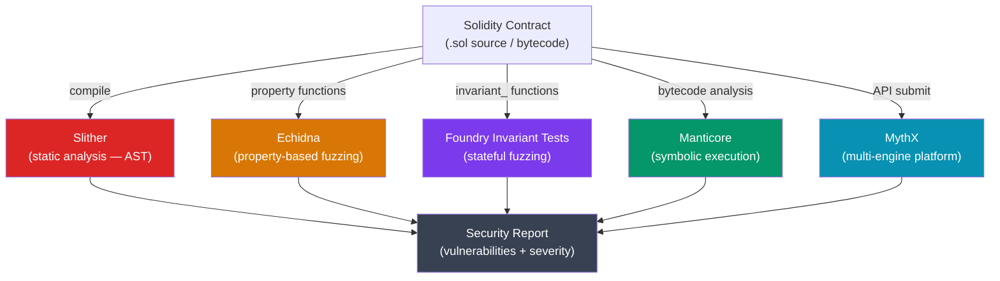

# Smart Contract Security Tools

> [!abstract] TL;DR
> Smart contract security tools fall into three categories: **static analysis** (Slither — reads the AST without execution, finds patterns like reentrancy, unchecked returns, and access control gaps in seconds), **fuzzing** (Echidna — generates random inputs to break property assertions; Foundry invariant tests — stateful fuzzing with Forge), and **symbolic execution** (Manticore, Halmos — explore all possible execution paths mathematically). MythX is a commercial platform that combines all three. No single tool catches everything — a production audit uses all approaches plus manual review. The Foundry suite (Forge + invariant tests) is the modern default for teams that want security testing integrated into their development workflow.

## Intuition — analogy FIRST

Auditing a smart contract with these tools is like inspecting a building:
- **Slither** is the building inspector reading the blueprints for obvious code violations — no need to enter the building, just read the drawings.
- **Echidna/Foundry fuzzing** is a chaos monkey who tries thousands of random actions (press every button, enter every door, connect random pipes) to see if the building's safety guarantees hold.
- **Manticore/Symbolic execution** is a mathematician who traces every possible path through the building's logic simultaneously — proving that no path leads to a collapse, or finding the exact sequence of steps that does.
- **Manual audit** is an experienced architect who reads the whole blueprint, talks to the builders, and applies judgment that no automated tool has.

---

## How It Works



---

## Key Concepts / Details

### Slither — Static Analysis

```bash
pip install slither-analyzer

# Basic run — prints all findings with severity
slither contracts/MyToken.sol

# Run with specific detectors
slither contracts/ --detect reentrancy-eth,unchecked-transfer,tx-origin

# Output as JSON for CI integration
slither contracts/ --json slither-report.json

# Print the contract's inheritance graph
slither contracts/ --print inheritance-graph

# Check for uninitialized variables
slither contracts/ --detect uninitialized-state

# Common findings and their severity
# High:   reentrancy-eth, reentrancy-no-eth, controlled-delegatecall
# Medium: unchecked-transfer, arbitrary-send-eth
# Low:    events-maths, missing-zero-address-validation
# Info:   solc-version, naming-convention
```

```solidity
// Example: Slither catches this reentrancy
contract Vulnerable {
    mapping(address => uint256) public balances;

    // Slither HIGH: reentrancy-eth — state update AFTER external call
    function withdraw() external {
        uint256 amount = balances[msg.sender];
        (bool success, ) = msg.sender.call{value: amount}("");  // ← external call first
        require(success);
        balances[msg.sender] = 0;  // ← state update after — reentrancy window!
    }
}

// Fix: Checks-Effects-Interactions pattern
function withdraw() external {
    uint256 amount = balances[msg.sender];
    balances[msg.sender] = 0;               // effect first
    (bool success, ) = msg.sender.call{value: amount}(""); // then interact
    require(success);
}
```

### Echidna — Property-Based Fuzzing

```solidity
// echidna_test.sol — properties Echidna tries to falsify
pragma solidity ^0.8.0;
import "./MyToken.sol";

contract EchidnaTest is MyToken {
    // Echidna calls functions randomly with random args
    // and checks that these "echidna_" functions always return true

    // Invariant: total supply never decreases (no burning)
    function echidna_total_supply_constant() public view returns (bool) {
        return totalSupply() == INITIAL_SUPPLY;
    }

    // Invariant: no address can have more than the total supply
    function echidna_no_overflow(address who) public view returns (bool) {
        return balanceOf(who) <= totalSupply();
    }

    // Invariant: owner cannot drain other users
    function echidna_owner_cannot_steal() public view returns (bool) {
        return balanceOf(address(this)) == 0;
    }
}
```

```bash
# Install: cargo install echidna (or use Docker)
echidna echidna_test.sol --contract EchidnaTest --config echidna.config.yaml

# echidna.config.yaml
# testLimit: 50000        # number of random transactions
# seqLen: 100             # max sequence length per test
# shrinkLimit: 5000       # reduce failing input to minimal case
# coverage: true          # track coverage
```

### Foundry Invariant Testing

```solidity
// test/Token.invariant.t.sol
pragma solidity ^0.8.0;
import "forge-std/Test.sol";
import "../src/MyToken.sol";

contract TokenHandler is Test {
    MyToken public token;
    address[] public actors;

    constructor(MyToken _token) {
        token = _token;
        actors = [address(1), address(2), address(3)];
    }

    // Handler functions — Foundry calls these with random args
    function transfer(uint256 actorSeed, uint256 amount) public {
        address from = actors[actorSeed % actors.length];
        address to   = actors[(actorSeed + 1) % actors.length];
        amount = bound(amount, 0, token.balanceOf(from));
        vm.prank(from);
        token.transfer(to, amount);
    }
}

contract TokenInvariantTest is Test {
    MyToken public token;
    TokenHandler public handler;

    function setUp() public {
        token = new MyToken(1_000_000e18);
        handler = new TokenHandler(token);
        // Tell Foundry to use handler as the target for random calls
        targetContract(address(handler));
    }

    // Invariant: sum of all balances == total supply
    function invariant_conservationOfTokens() public view {
        uint256 sum = token.balanceOf(address(1))
                    + token.balanceOf(address(2))
                    + token.balanceOf(address(3));
        assertEq(sum, token.totalSupply());
    }
}
```

```bash
forge test --match-contract TokenInvariantTest -vvv
# Foundry runs thousands of random call sequences
# and checks invariants after each one
```

### Manticore and MythX

```python
# Manticore — symbolic execution (Python API)
from manticore.ethereum import ManticoreEVM

m = ManticoreEVM()
with m.kill_timeout(90):
    owner = m.create_account(balance=1000)
    contract = m.solidity_create_contract(
        "Vulnerable.sol",
        owner=owner,
        balance=100
    )
    # Manticore explores all paths symbolically
    # and reports reachable states where properties fail

for state in m.all_states:
    print(state.platform.logs)
```

```bash
# MythX — commercial SaaS (free tier available)
pip install mythx-cli
mythx analyze contracts/MyToken.sol --mode deep
# Returns:  SWC registry IDs, severity, description, code location
# SWC-107: Reentrancy
# SWC-101: Integer Overflow and Underflow
```

### Audit Checklist

```markdown
## Pre-Audit Preparation
- [ ] All tests passing with >90% branch coverage (forge coverage)
- [ ] Slither run — all High/Medium findings addressed or documented
- [ ] Echidna / Foundry invariant tests written for core invariants
- [ ] NatSpec documentation complete for all external functions

## Access Control
- [ ] onlyOwner / onlyRole on all privileged functions
- [ ] No tx.origin for authentication (use msg.sender)
- [ ] Admin key is a multisig (Gnosis Safe), not an EOA

## Reentrancy
- [ ] Checks-Effects-Interactions pattern throughout
- [ ] ReentrancyGuard on functions handling ETH or token transfers
- [ ] No cross-function reentrancy (mutex covers all entry points)

## Integer Arithmetic
- [ ] Solidity 0.8+ (reverts on overflow) or SafeMath used
- [ ] Division before multiplication avoided (precision loss)
- [ ] Precision scaling factors documented

## External Calls
- [ ] Return values from low-level .call() checked
- [ ] Pull-over-push for ETH distribution
- [ ] Flash loan attack vectors considered (price manipulation)

## Upgradeability
- [ ] Storage layout preserved in upgrades (no slot collision)
- [ ] Initializers protected from re-initialization
- [ ] Proxy admin key is multisig

## Oracle Dependencies
- [ ] TWAP used instead of spot price for lending protocols
- [ ] Chainlink heartbeat + deviation threshold checked
- [ ] Circuit breaker for extreme price moves
```

### Tool Comparison

| Tool | Type | Speed | Coverage | Requires Recompile | False Positives |
|------|------|-------|----------|-------------------|----------------|
| Slither | Static analysis | Seconds | Syntactic patterns | No | Medium |
| Echidna | Fuzzing | Minutes–hours | Property space | Yes (annotations) | Low |
| Foundry invariant | Fuzzing | Minutes | Stateful sequences | Yes | Low |
| Manticore | Symbolic exec | Hours | Path coverage | No | Low |
| MythX | Multi-engine | Minutes | Combined | No | Medium |
| Manual audit | Human review | Days–weeks | Semantic understanding | N/A | None |

---

## Common Pitfalls

1. **Slither on uncompiled code**: Slither needs the Solidity compiler to be available and compatible with the `pragma` version. Version mismatches produce false "compilation failed" errors. Use `slither --solc-remaps` or `crytic-compile`.
2. **Echidna properties that are too weak**: Writing `echidna_balance_positive()` that checks `balance >= 0` for a `uint` (always true) gives 100% "passing" tests with zero security value. Write properties that could plausibly fail.
3. **Foundry `bound()` not used**: Without `bound(amount, 0, max)`, Foundry generates values like `2^256 - 1` that cause expected reverts, masking real issues. Always bound inputs to realistic ranges.
4. **Symbolic execution state explosion**: Manticore can time out on loops with dynamic bounds. Set `--timeout` and `--max-depth` limits. Use Manticore for targeted property checking, not full-contract exploration.
5. **Treating audit as the final gate**: Security tools and even manual audits miss bugs. Defense-in-depth: bug bounties (Immunefi), gradual rollout, TVL caps, and circuit breakers are production requirements.

---

## Related Concepts

- [[_MOC_Web3_Development|↑ Web3 Development MOC]]
- [[Hardhat_and_Foundry]] — Foundry test infrastructure that invariant tests run within
- [[Solidity_Programming]] — Solidity patterns and pitfalls that tools detect
- [[Upgradeable_Contracts]] — Storage layout issues that Slither and manual review catch
- [[OpenZeppelin_Contracts]] — ReentrancyGuard and AccessControl that prevent common findings

---

## Review Questions

1. What is the difference between static analysis (Slither) and fuzzing (Echidna)? What vulnerability class is each best suited for?
2. Write a Foundry invariant test for a simple vault contract where the invariant is "sum of user deposits equals the contract ETH balance."
3. Why is the Checks-Effects-Interactions pattern the primary defense against reentrancy? Trace through a reentrancy attack step by step.
4. What is symbolic execution and why does it suffer from "state explosion"? How do you mitigate this in practice?
5. An audit report rates a finding as "High severity." What does severity mean in the context of smart contract audits, and what additional factors determine remediation priority?

---

## Sources

- Slither GitHub — https://github.com/crytic/slither
- Echidna docs — https://github.com/crytic/echidna
- Foundry Book: Invariant Testing — https://book.getfoundry.sh/forge/invariant-testing
- SWC Registry — https://swcregistry.io/
- Trail of Bits: Building Secure Contracts — https://github.com/crytic/building-secure-contracts

#Blockchain #security #auditing #slither #echidna #foundry #solidity
