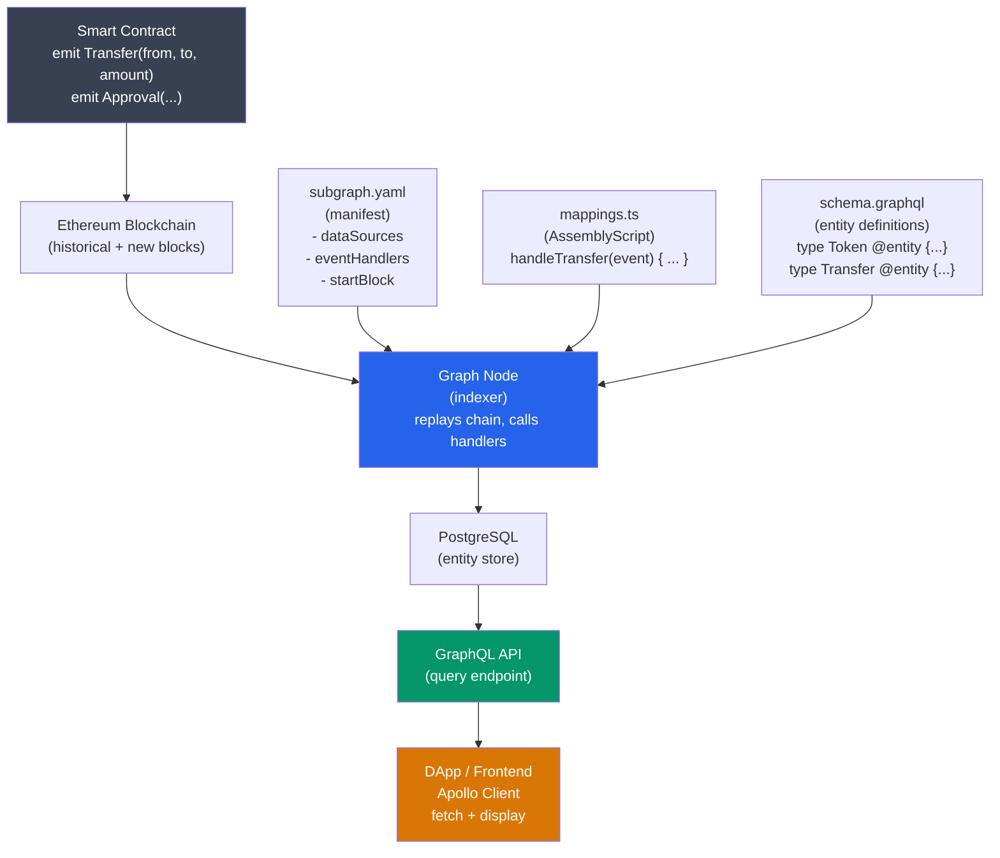

# 📊 The Graph Protocol

> [!abstract] TL;DR
> The Graph is a decentralized indexing protocol for blockchain data. **Subgraphs** define WHAT to index: a manifest (`subgraph.yaml`) specifies which contracts and events to watch, a GraphQL schema defines the entities stored, and **AssemblyScript mappings** transform raw events into those entities. The Graph's **indexing node** replays the chain, calling your mapping functions as events match. **Querying** uses GraphQL with cursor-based pagination (`first: 1000, skip: N`, or `id_gt` for reliable pagination). Economics: indexers stake **GRT** (Graph Token) to serve queries; curators signal which subgraphs to index; delegators stake GRT to indexers for share of rewards. Subgraphs on the decentralized network are hosted by 200+ indexers; the **Subgraph Studio** provides hosted development and Ethereum mainnet deployment.

## Intuition — analogy FIRST
Ethereum is like a warehouse with millions of transaction receipts in file folders, ordered only by date. To find all token transfers for a specific address, you'd have to read every single receipt. The Graph is like hiring a team of clerks who read every receipt as it arrives, extract key information (who transferred what to whom), and file it in multiple organized indexes: "by sender", "by recipient", "by token", "by date range." When you want to query "all transfers over $10,000 in the last week to this address," the Graph's indexes give you the answer in milliseconds instead of scanning millions of events.

The decentralized protocol ensures no single company controls the indexes: indexers compete to answer your queries, curators (like librarians) signal which indexes are valuable, and all participants are economically incentivized via GRT tokens.

---

## How It Works



---

## Key Concepts / Details

### Subgraph Components

**1. subgraph.yaml (Manifest)**
```yaml
specVersion: 0.0.5
schema:
  file: ./schema.graphql
dataSources:
  - kind: ethereum
    name: UniswapV3Pool
    network: mainnet
    source:
      address: "0x88e6A0c2dDD26FEEb64F039a2c41296FcB3f5640"  # USDC/ETH 0.05%
      abi: UniswapV3Pool
      startBlock: 12376729  # block the contract was deployed
    mapping:
      kind: ethereum/events
      apiVersion: 0.0.7
      language: wasm/assemblyscript
      entities:
        - Pool
        - Swap
        - Tick
      abis:
        - name: UniswapV3Pool
          file: ./abis/UniswapV3Pool.json
      eventHandlers:
        - event: Swap(indexed address,indexed address,int256,int256,uint160,uint128,int24)
          handler: handleSwap
        - event: Mint(address,indexed address,indexed int24,indexed int24,uint128,uint256,uint256)
          handler: handleMint
      file: ./src/mappings.ts
```

**2. schema.graphql**
```graphql
type Pool @entity {
  id: ID!                    # required — usually the contract address
  token0: Token!
  token1: Token!
  feeTier: Int!
  totalValueLockedUSD: BigDecimal!
  swaps: [Swap!]! @derivedFrom(field: "pool")  # auto-computed from Swap.pool
}

type Swap @entity {
  id: ID!                    # txHash + logIndex (unique per event)
  pool: Pool!
  sender: Bytes!
  recipient: Bytes!
  amount0: BigInt!
  amount1: BigInt!
  sqrtPriceX96: BigInt!
  timestamp: BigInt!
  blockNumber: BigInt!
}

type Token @entity {
  id: ID!                    # token address
  symbol: String!
  decimals: Int!
}
```

**3. AssemblyScript Mappings**
```typescript
// src/mappings.ts — AssemblyScript (similar to TypeScript but compiled to WASM)
import { BigInt, Bytes, log } from "@graphprotocol/graph-ts";
import { Swap as SwapEvent } from "../generated/UniswapV3Pool/UniswapV3Pool";
import { Swap, Pool } from "../generated/schema";  // generated from schema.graphql

export function handleSwap(event: SwapEvent): void {
  // Load or create Pool entity
  let pool = Pool.load(event.address.toHexString());
  if (!pool) {
    pool = new Pool(event.address.toHexString());
    pool.feeTier = 500;  // 0.05%
    pool.totalValueLockedUSD = BigDecimal.zero();
    pool.save();
  }
  
  // Create Swap entity
  let swap = new Swap(event.transaction.hash.toHex() + "-" + event.logIndex.toString());
  swap.pool = pool.id;
  swap.sender = event.params.sender;
  swap.recipient = event.params.recipient;
  swap.amount0 = event.params.amount0;
  swap.amount1 = event.params.amount1;
  swap.timestamp = event.block.timestamp;
  swap.blockNumber = event.block.number;
  swap.save();
  
  // Update pool TVL (simplified)
  pool.totalValueLockedUSD = pool.totalValueLockedUSD.plus(computeUSD(event));
  pool.save();
}
```

**AssemblyScript gotchas vs TypeScript**:
- No `null` — use `changetype<T | null>` or the `!` non-null assertion
- No closures / arrow functions in some contexts
- `BigInt` and `BigDecimal` are not native — use graph-ts helpers
- Strings use `String` class, not primitive `string`

### Querying with GraphQL

**Basic query**:
```graphql
query {
  swaps(
    first: 1000
    orderBy: timestamp
    orderDirection: desc
    where: { pool: "0x88e6a0c2ddd26feeb64f039a2c41296fcb3f5640" }
  ) {
    id
    amount0
    amount1
    timestamp
    sender
  }
}
```

**Cursor-based pagination** (`id_gt` — reliable for large datasets):
```graphql
# Fetch first batch
query getSwaps($lastId: ID) {
  swaps(
    first: 1000
    orderBy: id
    orderDirection: asc
    where: { id_gt: $lastId }
  ) {
    id
    amount0
    amount1
    timestamp
  }
}
```

```typescript
// Fetch all swaps with pagination
async function getAllSwaps() {
  let lastId = "";
  const allSwaps = [];
  
  while (true) {
    const result = await client.query({
      query: GET_SWAPS,
      variables: { lastId },
    });
    
    const swaps = result.data.swaps;
    if (swaps.length === 0) break;
    
    allSwaps.push(...swaps);
    lastId = swaps[swaps.length - 1].id;
  }
  return allSwaps;
}
```

**Warning**: `skip` + `first` pagination (offset-based) fails for large offsets (`skip > 5000` causes timeout). Always use cursor-based pagination (`id_gt`).

### The Graph Network Economics

| Role | What they do | Incentive |
|------|-------------|---------|
| **Indexers** | Run Graph nodes, index subgraphs, serve queries | Query fees + indexing rewards (GRT inflation) |
| **Curators** | Signal GRT on valuable subgraphs | Earn portion of query fees from signaled subgraphs |
| **Delegators** | Stake GRT to indexers | Share of indexer rewards (minus 15% cut) |
| **Consumers** | Pay query fees | Access to indexed data |

**Curation bonding curve**: Curators buy "shares" of a subgraph on a bonding curve. First curator pays less per share; price increases as more GRT is signaled. Curators are incentivized to find high-value subgraphs early.

### Subgraph Development Workflow

```bash
# Install Graph CLI
npm install -g @graphprotocol/graph-cli

# Initialize new subgraph
graph init --product subgraph-studio my-subgraph

# Generate types from schema + ABIs
graph codegen

# Build WASM output
graph build

# Test locally with graph-node docker
docker-compose up

# Deploy to Subgraph Studio (testnet/mainnet)
graph auth --studio DEPLOY_KEY
graph deploy --studio my-subgraph
```

**Local testing with Matchstick** (unit testing for mappings):
```typescript
// tests/mapping.test.ts
import { assert, describe, it, newMockEvent } from "matchstick-as";
import { handleSwap } from "../src/mappings";

describe("handleSwap", () => {
  it("creates a Swap entity", () => {
    const event = newMockEvent();  // create mock event
    // ... set params ...
    handleSwap(changetype<SwapEvent>(event));
    
    assert.entityCount("Swap", 1);
    assert.fieldEquals("Swap", "txHash-0", "amount0", "1000000");
  });
});
```

---

## Real-World Notes
- Uniswap's official subgraph (`uniswap/uniswap-v3`) is the most queried subgraph on The Graph network, handling millions of queries per day.
- **Hosted Service** (deprecated): The Graph originally offered a centralized hosted service. Migration to the decentralized network is complete (2024).
- **Substreams**: The Graph's new streaming data product. Instead of replaying events via the Graph Node, Substreams uses a Rust-based streaming runtime that is 100-1000× faster for initial sync. Ideal for large-scale analytics.
- Custom events are far cheaper to query than reconstructing state from function calls — design contracts to emit rich events for everything you'll want to index.
- The Graph's GRT token has a 3% annual inflation for indexing rewards (subject to governance change).

---

## Common Pitfalls
1. **Using `skip` for large pagination** — `skip > 5000` on the decentralized network often times out. Always use cursor-based pagination with `id_gt`.
2. **Not setting `startBlock`** — without `startBlock`, Graph Node indexes from genesis (block 0), which for popular contracts means weeks of sync time. Always set `startBlock` to the contract's deployment block.
3. **Mutable entity IDs** — if you use a mutable field (like transaction hash + log index) as the ID in a deterministic way, you're fine. But if entities need to be updated, load them by ID first and only save after modification.
4. **Large AssemblyScript string operations** — string concatenation in AssemblyScript is expensive; minimize it in hot paths.

---

## Related Concepts
- [[_MOC_Web3_Development|↑ Web3 Development MOC]]
- [[Ethers_JS_and_Viem]] — alternative for low-level `eth_getLogs`; The Graph is the scale solution
- [[04_Ethereum_EVM/Solidity_Programming|Solidity Programming]] — events emitted by contracts are what The Graph indexes
- [[04_Ethereum_EVM/ABI_and_Contract_Interaction|ABI & Contract Interaction]] — subgraph codegen parses ABI to generate TypeScript event types
- [[05_DeFi_Protocols/AMMs_and_Liquidity_Pools|AMMs & Liquidity Pools]] — DeFi analytics (TVL, volume) built on top of The Graph subgraphs

---

## Review Questions
1. You want to track all Uniswap v3 positions for a specific LP address across all pools. Design the schema (entities and fields) and describe the event handlers needed. What is the challenge with tracking `decreaseLiquidity` events?
2. A consumer queries a subgraph for "top 100 pools by TVL" with `orderBy: totalValueLockedUSD`. This is slow. Explain why ordered queries on non-indexed fields are slow and what you would change in the schema or query.
3. Your subgraph is 2 million blocks behind after deployment. What are the two approaches to speed up initial sync, and what are the tradeoffs of each?

---

## Sources
- The Graph Protocol Whitepaper (2018) — thegraph.com
- The Graph Documentation: thegraph.com/docs
- The Graph Academy: thegraph.academy
- Matchstick (unit testing): github.com/LimeChain/matchstick
- Substreams: thegraph.com/docs/en/substreams

#Blockchain #Web3Development #TheGraph #Subgraph #GraphQL #Indexing #AssemblyScript
