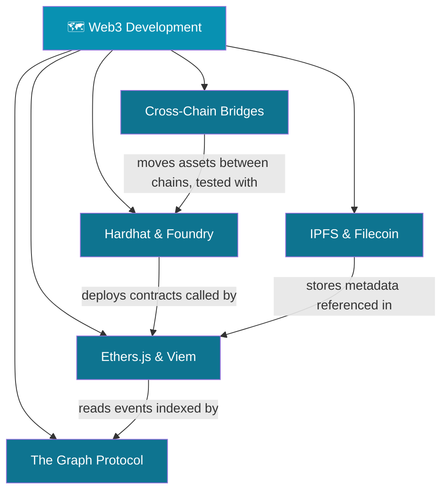

# 🗺️ Web3 Development — Map of Content

> [!abstract] What This Section Covers
> This section covers the practical toolchain every Web3 engineer uses in production: ethers.js and viem for interacting with nodes; Hardhat and Foundry for compiling, testing, and deploying contracts; The Graph Protocol for decentralized indexing and querying; IPFS and Filecoin for decentralized storage; and cross-chain bridges — including their architecture and the major exploits that have drained billions. These notes are production-focused and include real code patterns.

---

## Concept Map

---

## Learning Path

1. [[Hardhat_and_Foundry]] — Start with the dev/test toolchain: mainnet forking, fuzz testing, invariant testing, forge script.
2. [[Ethers_JS_and_Viem]] — Client interaction: provider/signer model, TypeChain, eth_getLogs pagination, gas estimation.
3. [[The_Graph_Protocol]] — Indexing: subgraph manifest, schema, AssemblyScript mappings, cursor pagination, GRT economics.
4. [[IPFS_and_Filecoin]] — Storage: CIDs (SHA2-256 multihash), pinning services, Filecoin deals, storage proofs.
5. [[Cross_Chain_Bridges]] — Interoperability: lock-and-mint, Wormhole/LayerZero/Axelar, ZK bridges, major exploits.

---

## All Notes at a Glance

| Note | Difficulty | What You'll Learn |
|------|-----------|-------------------|
| [[Ethers_JS_and_Viem]] | Intermediate | Provider/signer, TypeChain, event logs, multicall |
| [[Hardhat_and_Foundry]] | Intermediate | Fork testing, fuzz/invariant tests, forge script |
| [[The_Graph_Protocol]] | Intermediate | Subgraph deployment, AssemblyScript, GRT, querying |
| [[IPFS_and_Filecoin]] | Intermediate | CIDs, pinning, Filecoin deals, PoRep/PoSt |
| [[Cross_Chain_Bridges]] | Advanced | Bridge types, Wormhole exploit, ZK bridges |

---

## Key Questions This Section Answers

- What is the difference between a provider and a signer in ethers.js/viem?
- How does Foundry's fuzzing differ from Hardhat's unit testing?
- How does The Graph Protocol index events and serve queries without a centralized server?
- What is a CID and how does content-addressing differ from location-addressing?
- What is the fundamental security trust assumption difference between a multisig bridge and a ZK bridge?
- What vulnerability allowed the Wormhole exploit (320M loss) to occur?

---

## Related Sections

- [[_MOC_Blockchain_Master|↑ Blockchain Master MOC]]
- [[05_DeFi_Protocols/_MOC_DeFi_Protocols|← DeFi Protocols]]
- [[04_Ethereum_EVM/_MOC_Ethereum_EVM|← Ethereum & EVM]]

#MOC #Blockchain #Web3Development
