# ⛓️ Blockchain & Web3 — Master Map of Content

> [!abstract] About This Vault
> This vault contains ~37 notes across 6 sections covering the full Blockchain & Web3 engineering stack — from distributed ledger theory and cryptographic primitives through Bitcoin's UTXO/Lightning architecture, the EVM and Solidity, DeFi protocol mechanics, and production Web3 tooling (Hardhat/Foundry, The Graph, IPFS, cross-chain bridges). Notes are written for engineers who build, audit, and operate on-chain systems: each note leads with an analogy, includes a Mermaid diagram, real formulas, code snippets, and production pitfalls. The vault is cross-linked to System Design and AI-ML vaults where relevant.

---

## Vault Architecture

```mermaid
graph TD
    MASTER["⛓️ Blockchain Master MOC"]

    MASTER --> F01["01 Blockchain Fundamentals"]
    MASTER --> F02["02 Applied Cryptography"]
    MASTER --> F03["03 Bitcoin Protocol"]
    MASTER --> F04["04 Ethereum & EVM"]
    MASTER --> F05["05 DeFi Protocols"]
    MASTER --> F06["06 Web3 Development"]

    F01 --> N01["Distributed Ledgers & Trilemma"]
    F01 --> N02["Hash Functions & Merkle Trees"]
    F01 --> N03["Consensus Mechanisms"]
    F01 --> N04["P2P Network Architecture"]
    F01 --> N05["Cryptographic Primitives"]

    F02 --> N06["ECDSA & Digital Signatures"]
    F02 --> N07["Zero-Knowledge Proofs"]
    F02 --> N08["Commitment Schemes"]
    F02 --> N09["Multi-Party Computation"]
    F02 --> N10["Post-Quantum Cryptography"]

    F03 --> N11["UTXO Model"]
    F03 --> N12["Bitcoin Script"]
    F03 --> N13["Mining & Difficulty"]
    F03 --> N14["Lightning Network"]
    F03 --> N15["Taproot & SegWit"]

    F04 --> N16["EVM Architecture"]
    F04 --> N17["Solidity Programming"]
    F04 --> N18["Gas & Optimization"]
    F04 --> N19["ABI & Contract Interaction"]
    F04 --> N20["Upgradeable Contracts"]

    F05 --> N21["AMMs & Liquidity Pools"]
    F05 --> N22["Lending & Borrowing"]
    F05 --> N23["MEV & Arbitrage"]
    F05 --> N24["Oracles & Data Feeds"]
    F05 --> N25["Derivatives & Perpetuals"]

    F06 --> N26["Ethers.js & Viem"]
    F06 --> N27["Hardhat & Foundry"]
    F06 --> N28["The Graph Protocol"]
    F06 --> N29["IPFS & Filecoin"]
    F06 --> N30["Cross-Chain Bridges"]

    style MASTER fill:#7c3aed,color:#fff
    style F01 fill:#2563eb,color:#fff
    style F02 fill:#059669,color:#fff
    style F03 fill:#d97706,color:#fff
    style F04 fill:#dc2626,color:#fff
    style F05 fill:#7c3aed,color:#fff
    style F06 fill:#0891b2,color:#fff
```

---

## Sections at a Glance

| # | Section | Notes | Focus |
|---|---------|-------|-------|
| 01 | [[01_Blockchain_Fundamentals/_MOC_Blockchain_Fundamentals\|Blockchain Fundamentals]] | 5 | Ledgers, trilemma, hashing, consensus, P2P, crypto primitives |
| 02 | [[02_Applied_Cryptography/_MOC_Applied_Cryptography\|Applied Cryptography]] | 5 | ECDSA, ZKPs, commitments, MPC, post-quantum |
| 03 | [[03_Bitcoin_Protocol/_MOC_Bitcoin_Protocol\|Bitcoin Protocol]] | 5 | UTXO, Script, mining, Lightning, Taproot |
| 04 | [[04_Ethereum_EVM/_MOC_Ethereum_EVM\|Ethereum & EVM]] | 5 | EVM internals, Solidity, gas, ABI, upgrades |
| 05 | [[05_DeFi_Protocols/_MOC_DeFi_Protocols\|DeFi Protocols]] | 5 | AMMs, lending, MEV, oracles, derivatives |
| 06 | [[06_Web3_Development/_MOC_Web3_Development\|Web3 Development]] | 5 | ethers.js/viem, Hardhat/Foundry, Graph, IPFS, bridges |

---

## Learning Paths

### Path A — Smart Contract Engineer
> Goal: Write, test, deploy, and upgrade production Solidity contracts.

1. [[01_Blockchain_Fundamentals/Distributed_Ledgers_and_Trilemma|Distributed Ledgers & Trilemma]] — understand the foundation
2. [[01_Blockchain_Fundamentals/Cryptographic_Primitives_Blockchain|Cryptographic Primitives]] — keys, addresses, signing
3. [[02_Applied_Cryptography/ECDSA_and_Digital_Signatures|ECDSA & Digital Signatures]] — how tx auth works
4. [[04_Ethereum_EVM/EVM_Architecture|EVM Architecture]] — what your code actually runs on
5. [[04_Ethereum_EVM/Solidity_Programming|Solidity Programming]] — language deep dive
6. [[04_Ethereum_EVM/Gas_and_Optimization|Gas & Optimization]] — production cost management
7. [[04_Ethereum_EVM/ABI_and_Contract_Interaction|ABI & Contract Interaction]] — integration patterns
8. [[04_Ethereum_EVM/Upgradeable_Contracts|Upgradeable Contracts]] — proxy patterns
9. [[06_Web3_Development/Hardhat_and_Foundry|Hardhat & Foundry]] — testing toolchain
10. [[05_DeFi_Protocols/MEV_and_Arbitrage|MEV & Arbitrage]] — adversarial awareness

### Path B — Protocol / DeFi Researcher
> Goal: Understand DeFi mechanisms, audit protocol economics, and reason about attacks.

1. [[01_Blockchain_Fundamentals/Consensus_Mechanisms|Consensus Mechanisms]] — PoW/PoS/BFT
2. [[01_Blockchain_Fundamentals/Hash_Functions_and_Merkle_Trees|Hash Functions & Merkle Trees]] — data integrity
3. [[02_Applied_Cryptography/Zero_Knowledge_Proofs|Zero-Knowledge Proofs]] — ZK rollups & privacy
4. [[05_DeFi_Protocols/AMMs_and_Liquidity_Pools|AMMs & Liquidity Pools]] — x*y=k, IL, concentrated
5. [[05_DeFi_Protocols/Lending_and_Borrowing|Lending & Borrowing]] — health factors, flash loans
6. [[05_DeFi_Protocols/Oracles_and_Data_Feeds|Oracles & Data Feeds]] — Chainlink, TWAP
7. [[05_DeFi_Protocols/MEV_and_Arbitrage|MEV & Arbitrage]] — PBS/Flashbots
8. [[05_DeFi_Protocols/Derivatives_and_Perpetuals|Derivatives & Perpetuals]] — perp mechanics
9. [[06_Web3_Development/Cross_Chain_Bridges|Cross-Chain Bridges]] — bridge security

### Path C — Bitcoin / L2 Engineer
> Goal: Build on or audit Bitcoin's stack including Lightning and Taproot.

1. [[01_Blockchain_Fundamentals/Distributed_Ledgers_and_Trilemma|Distributed Ledgers & Trilemma]]
2. [[01_Blockchain_Fundamentals/Consensus_Mechanisms|Consensus Mechanisms]] — PoW Nakamoto
3. [[03_Bitcoin_Protocol/UTXO_Model|UTXO Model]] — coin selection, dust
4. [[03_Bitcoin_Protocol/Bitcoin_Script|Bitcoin Script]] — P2PKH → P2TR
5. [[03_Bitcoin_Protocol/Mining_and_Difficulty|Mining & Difficulty]] — SHA-256d, retarget
6. [[03_Bitcoin_Protocol/Taproot_and_SegWit|Taproot & SegWit]] — BIP340/341/342
7. [[03_Bitcoin_Protocol/Lightning_Network|Lightning Network]] — channels, HTLCs, routing

---

## Cross-Vault Links

| Other Vault | Relevant Connection |
|-------------|---------------------|
| [[../System Design/_MOC_SystemDesign_Master\|System Design]] | Distributed systems, CAP theorem, P2P networks, fault tolerance |
| [[../AI-ML/_MOC_AI_ML_Master\|AI-ML]] | ZK-ML (proving ML inference), on-chain AI, verifiable computation |
| [[../Database/_MOC_Database_Master\|Database]] | State tries (Merkle Patricia Tree), ACID vs. eventual consistency |

---

## Section MOC Index

- [[01_Blockchain_Fundamentals/_MOC_Blockchain_Fundamentals|01 — Blockchain Fundamentals MOC]]
- [[02_Applied_Cryptography/_MOC_Applied_Cryptography|02 — Applied Cryptography MOC]]
- [[03_Bitcoin_Protocol/_MOC_Bitcoin_Protocol|03 — Bitcoin Protocol MOC]]
- [[04_Ethereum_EVM/_MOC_Ethereum_EVM|04 — Ethereum & EVM MOC]]
- [[05_DeFi_Protocols/_MOC_DeFi_Protocols|05 — DeFi Protocols MOC]]
- [[06_Web3_Development/_MOC_Web3_Development|06 — Web3 Development MOC]]

---

#MOC #Blockchain #MasterMOC
