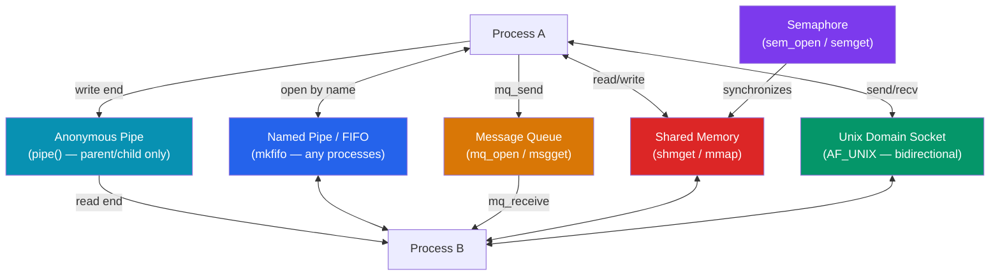

# C Inter-Process Communication

> [!abstract] TL;DR
> Inter-Process Communication (IPC) is the set of POSIX mechanisms that allow separate processes to exchange data and synchronize. The main mechanisms are: **anonymous pipes** (one-directional, parent↔child), **named pipes / FIFOs** (any two processes on the same host), **message queues** (typed message delivery, POSIX or SysV), **shared memory** (`shmget`/`mmap` — fastest, needs external synchronization with semaphores), and **Unix domain sockets** (bidirectional, stream or datagram, same-host only). Choose the mechanism based on the relationship between processes, the need for persistence, and performance requirements.

## Intuition — analogy FIRST

Think of processes as offices in a building that cannot share a whiteboard. IPC mechanisms are different ways they can communicate:
- **Pipe**: a physical tube connecting two offices — only works if they're adjacent (parent/child), and traffic flows one way.
- **FIFO**: a named tube installed in the hallway — any two offices can connect to it by name.
- **Message queue**: a formal mailroom with typed letter slots — messages are queued and retrieved by type.
- **Shared memory**: a shared digital screen both offices can read and write simultaneously — the fastest method, but they need a signal (semaphore) to avoid writing at the same time.
- **Unix socket**: a private telephone line in the hallway — bidirectional, reliable, connection-oriented.

---

## How It Works



---

## Key Concepts / Details

### Anonymous Pipes

```c
#include <unistd.h>
#include <stdio.h>
#include <string.h>

int main(void) {
    int pipefd[2];  // pipefd[0] = read end, pipefd[1] = write end
    if (pipe(pipefd) == -1) { perror("pipe"); return 1; }

    pid_t pid = fork();
    if (pid == 0) {
        /* Child: reads from pipe */
        close(pipefd[1]);                      // close unused write end
        char buf[128];
        ssize_t n = read(pipefd[0], buf, sizeof(buf) - 1);
        buf[n] = '\0';
        printf("Child received: %s\n", buf);
        close(pipefd[0]);
    } else {
        /* Parent: writes to pipe */
        close(pipefd[0]);                      // close unused read end
        const char *msg = "Hello from parent";
        write(pipefd[1], msg, strlen(msg));
        close(pipefd[1]);
        wait(NULL);
    }
    return 0;
}
```

Key: always close the unused end in each process. A pipe blocks on read until data arrives, and blocks on write when the buffer is full (~64 KB default).

### Named Pipes (FIFOs)

```c
#include <sys/stat.h>
#include <fcntl.h>
#include <unistd.h>

/* Writer process */
int main(void) {
    mkfifo("/tmp/myfifo", 0666);              // create FIFO in filesystem
    int fd = open("/tmp/myfifo", O_WRONLY);  // blocks until a reader opens
    write(fd, "hello via FIFO", 14);
    close(fd);
    unlink("/tmp/myfifo");                   // remove FIFO when done
}

/* Reader process (separate binary) */
int main(void) {
    int fd = open("/tmp/myfifo", O_RDONLY);  // blocks until a writer opens
    char buf[64];
    read(fd, buf, sizeof(buf));
    printf("Got: %s\n", buf);
    close(fd);
}
```

### POSIX Message Queues

```c
#include <mqueue.h>
#include <fcntl.h>
#include <stdio.h>
#include <string.h>
// Link with: -lrt

/* Sender */
int main(void) {
    struct mq_attr attr = { .mq_maxmsg = 10, .mq_msgsize = 256 };
    mqd_t mq = mq_open("/myqueue", O_CREAT | O_WRONLY, 0644, &attr);
    const char *msg = "priority message";
    mq_send(mq, msg, strlen(msg), 1);        // priority = 1
    mq_close(mq);
}

/* Receiver */
int main(void) {
    mqd_t mq = mq_open("/myqueue", O_RDONLY);
    char buf[256];
    unsigned int prio;
    mq_receive(mq, buf, sizeof(buf), &prio); // receive highest-priority first
    printf("Received (priority %u): %s\n", prio, buf);
    mq_close(mq);
    mq_unlink("/myqueue");                   // delete the queue
}
```

### Shared Memory (shmget — SysV) and mmap (POSIX)

```c
/* POSIX shared memory via mmap — preferred over SysV shmget */
#include <sys/mman.h>
#include <fcntl.h>
#include <unistd.h>
#include <string.h>

typedef struct { int counter; char data[256]; } SharedData;

/* Creator process */
int main(void) {
    int fd = shm_open("/myshm", O_CREAT | O_RDWR, 0666);
    ftruncate(fd, sizeof(SharedData));       // set size

    SharedData *shm = mmap(NULL, sizeof(SharedData),
                           PROT_READ | PROT_WRITE, MAP_SHARED, fd, 0);
    shm->counter = 42;
    strcpy(shm->data, "hello shared memory");

    munmap(shm, sizeof(SharedData));
    close(fd);
    // shm_unlink("/myshm") in the process that cleans up
}

/* Reader process */
int main(void) {
    int fd = shm_open("/myshm", O_RDONLY, 0);
    SharedData *shm = mmap(NULL, sizeof(SharedData),
                           PROT_READ, MAP_SHARED, fd, 0);
    printf("counter=%d data=%s\n", shm->counter, shm->data);
    munmap(shm, sizeof(SharedData));
    close(fd);
}
```

### Semaphores for Synchronization

```c
/* POSIX named semaphore — synchronize shared memory access */
#include <semaphore.h>
#include <fcntl.h>

sem_t *sem = sem_open("/mysem", O_CREAT, 0644, 1);  // initial value = 1

/* Critical section */
sem_wait(sem);    // decrement (blocks if 0 — "lock")
// ... access shared memory ...
sem_post(sem);    // increment (release "lock")

sem_close(sem);
sem_unlink("/mysem");  // cleanup
```

### Unix Domain Sockets (AF_UNIX)

```c
#include <sys/socket.h>
#include <sys/un.h>
#include <unistd.h>
#include <string.h>
#define SOCK_PATH "/tmp/myapp.sock"

/* Server */
int main(void) {
    int srv = socket(AF_UNIX, SOCK_STREAM, 0);
    struct sockaddr_un addr = { .sun_family = AF_UNIX };
    strncpy(addr.sun_path, SOCK_PATH, sizeof(addr.sun_path) - 1);
    unlink(SOCK_PATH);                      // remove stale socket
    bind(srv, (struct sockaddr *)&addr, sizeof(addr));
    listen(srv, 5);

    int client = accept(srv, NULL, NULL);
    char buf[128];
    recv(client, buf, sizeof(buf), 0);
    printf("Server received: %s\n", buf);
    send(client, "ACK", 3, 0);
    close(client); close(srv); unlink(SOCK_PATH);
}

/* Client */
int main(void) {
    int sock = socket(AF_UNIX, SOCK_STREAM, 0);
    struct sockaddr_un addr = { .sun_family = AF_UNIX };
    strncpy(addr.sun_path, SOCK_PATH, sizeof(addr.sun_path) - 1);
    connect(sock, (struct sockaddr *)&addr, sizeof(addr));
    send(sock, "hello server", 12, 0);
    char reply[64];
    recv(sock, reply, sizeof(reply), 0);
    printf("Client got: %s\n", reply);
    close(sock);
}
```

### IPC Mechanism Comparison

| Mechanism | Direction | Persistence | Speed | Synchronization | Best For |
|-----------|-----------|-------------|-------|----------------|---------|
| Pipe | Unidirectional | No (process lifetime) | Fast (kernel buffer) | Blocking read/write | Parent↔child streaming |
| FIFO | Unidirectional | Filesystem (until unlink) | Fast | Blocking | Unrelated processes, pipelines |
| Message queue | Unidirectional | Kernel (until unlink) | Fast | Built-in (mq_receive blocks) | Typed messages, priority |
| Shared memory | Bidirectional | Kernel (until unlink) | Fastest (no copies) | Requires semaphores | High-throughput, bulk data |
| Unix socket | Bidirectional | No | Fast | Stream / datagram | Full-duplex IPC, passing FDs |
| TCP socket | Bidirectional | No | Slower (network stack) | Stream | Cross-host communication |

---

## Common Pitfalls

1. **Pipe deadlock**: If both parent and child read from a pipe without anyone writing, both block forever. Always close unused pipe ends immediately after `fork()`.
2. **Zombie processes**: `fork()` without `wait()` leaves zombie processes in the process table. Always `wait(NULL)` or install a `SIGCHLD` handler.
3. **Shared memory without synchronization**: Two processes writing to shared memory simultaneously causes data races. Always protect access with semaphores or mutexes (use `pthread_mutexattr_setpshared` for in-shared-memory mutexes).
4. **FIFO blocking on open**: `open()` on a FIFO blocks until both a reader and writer have opened it. Use `O_NONBLOCK` to avoid deadlocks if only one side opens.
5. **Leftover semaphores/shmem on crash**: POSIX shared memory and named semaphores persist in the kernel until explicitly unlinked. A crashed process leaves them behind. Use a cleanup handler or `/dev/shm` inspection to recover.

---

## Review Questions

1. What is the difference between an anonymous pipe and a named FIFO? When would you choose each?
2. Why is shared memory the fastest IPC mechanism and what additional primitive is always required when using it?
3. A parent–child pair uses a pipe. The parent forgets to close its read end. What happens when the child finishes writing and closes its write end?
4. What is the difference between `SOCK_STREAM` and `SOCK_DGRAM` for Unix domain sockets?
5. A process crashes leaving a POSIX shared memory segment. How do you identify and clean it up?

---

#C #Cpp #IPC #POSIX #pipes #shared-memory #semaphores
