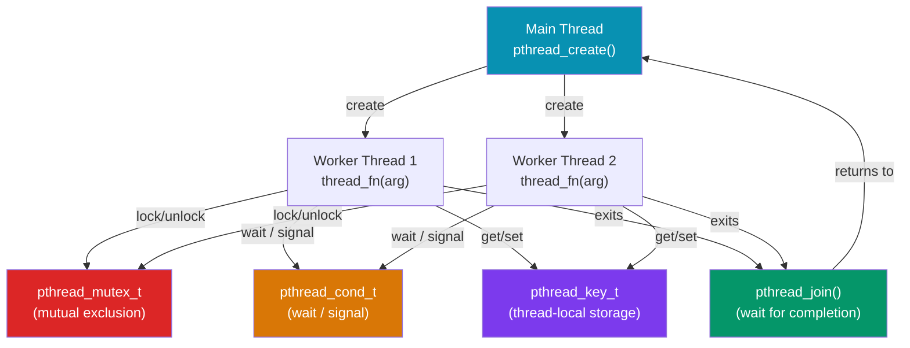

# POSIX Threads (pthreads)

> [!abstract] TL;DR
> POSIX Threads (pthreads) is the C-level threading API available on Linux, macOS, and BSDs. It provides `pthread_create`/`pthread_join` for thread lifecycle, `pthread_mutex_t` for mutual exclusion, `pthread_cond_t` for condition variables (blocking until a predicate is true), and `pthread_key_t` for thread-local storage (TLS). C++11's `std::thread`, `std::mutex`, and `std::condition_variable` are higher-level wrappers over pthreads on POSIX systems — they add RAII, type safety, and exception-safe locking but compile to the same OS primitives.

## Intuition — analogy FIRST

A process is a factory building. Threads are the workers inside that share the same floor (memory, file descriptors). `pthread_create` is "hire a new worker and give them a task sheet (function pointer)". A mutex is a key to a locked room — only one worker holds it at a time, and others wait outside. A condition variable is an intercom system: a worker waiting for inventory can sleep (releasing the key) and be woken up when inventory arrives (signal). Thread-local storage is each worker's private locker — visible only to them, even though the lockers are physically in the same building.

---

## How It Works



---

## Key Concepts / Details

### Thread Creation and Joining

```c
#include <pthread.h>
#include <stdio.h>
#include <stdlib.h>
// Compile: gcc -o prog prog.c -lpthread

typedef struct { int id; int result; } ThreadArg;

void *worker(void *arg) {
    ThreadArg *a = (ThreadArg *)arg;
    a->result = a->id * a->id;   // square the id
    printf("Thread %d computed %d\n", a->id, a->result);
    return NULL;   // or pthread_exit(NULL)
}

int main(void) {
    const int N = 4;
    pthread_t threads[N];
    ThreadArg args[N];

    for (int i = 0; i < N; i++) {
        args[i].id = i;
        // pthread_create(thread, attr, start_fn, arg)
        if (pthread_create(&threads[i], NULL, worker, &args[i]) != 0) {
            perror("pthread_create"); return 1;
        }
    }

    for (int i = 0; i < N; i++) {
        pthread_join(threads[i], NULL);   // wait for thread i to finish
        printf("Main: thread %d result = %d\n", i, args[i].result);
    }
    return 0;
}
```

### Mutex — Mutual Exclusion

```c
#include <pthread.h>
#include <stdio.h>

static int counter = 0;
static pthread_mutex_t mutex = PTHREAD_MUTEX_INITIALIZER;  // static init

void *increment(void *arg) {
    for (int i = 0; i < 100000; i++) {
        pthread_mutex_lock(&mutex);   // acquire; blocks if already locked
        counter++;
        pthread_mutex_unlock(&mutex); // release
    }
    return NULL;
}

int main(void) {
    pthread_t t1, t2;
    pthread_create(&t1, NULL, increment, NULL);
    pthread_create(&t2, NULL, increment, NULL);
    pthread_join(t1, NULL);
    pthread_join(t2, NULL);
    printf("counter = %d (expected 200000)\n", counter);
    // Without mutex: counter would be < 200000 due to data race

    pthread_mutex_destroy(&mutex);   // release resources
}
```

### Condition Variables — Wait for a Predicate

```c
#include <pthread.h>
#include <stdio.h>
#include <stdbool.h>

static bool item_ready = false;
static pthread_mutex_t mtx = PTHREAD_MUTEX_INITIALIZER;
static pthread_cond_t cond = PTHREAD_COND_INITIALIZER;

void *producer(void *arg) {
    pthread_mutex_lock(&mtx);
    item_ready = true;
    pthread_cond_signal(&cond);   // wake ONE waiting consumer
    // pthread_cond_broadcast(&cond) — wake ALL consumers
    pthread_mutex_unlock(&mtx);
    return NULL;
}

void *consumer(void *arg) {
    pthread_mutex_lock(&mtx);
    // ALWAYS use while loop — spurious wakeups are real on Linux
    while (!item_ready) {
        pthread_cond_wait(&cond, &mtx);  // atomically: release mtx, sleep
        // On return: mtx is re-acquired automatically
    }
    printf("Consumer: got the item!\n");
    pthread_mutex_unlock(&mtx);
    return NULL;
}

int main(void) {
    pthread_t p, c;
    pthread_create(&c, NULL, consumer, NULL);
    pthread_create(&p, NULL, producer, NULL);
    pthread_join(p, NULL);
    pthread_join(c, NULL);
    pthread_mutex_destroy(&mtx);
    pthread_cond_destroy(&cond);
}
```

### Thread-Local Storage (TLS)

```c
/* Method 1: pthread_key_t (C89 compatible) */
static pthread_key_t tls_key;

static void destructor(void *value) { free(value); }

void init_tls(void) {
    pthread_key_create(&tls_key, destructor);  // register destructor
}

void *worker(void *arg) {
    // Each thread gets its own private buffer
    char *buf = malloc(256);
    pthread_setspecific(tls_key, buf);          // store in this thread's slot
    snprintf(buf, 256, "thread %lu data", pthread_self());
    // ...
    char *my_buf = pthread_getspecific(tls_key);
    printf("%s\n", my_buf);
    return NULL;
    // destructor(buf) called automatically on thread exit
}

/* Method 2: __thread (GCC/Clang extension — simpler) */
__thread int thread_id = 0;  // each thread has its own thread_id variable

/* Method 3: C11 _Thread_local */
_Thread_local int errno_local = 0;
```

### Detached Threads

```c
pthread_t t;
pthread_attr_t attr;
pthread_attr_init(&attr);
pthread_attr_setdetachstate(&attr, PTHREAD_CREATE_DETACHED);
pthread_create(&t, &attr, worker, NULL);
pthread_attr_destroy(&attr);
// No pthread_join needed — resources freed on thread exit
// Cannot get return value from a detached thread
```

### pthreads vs C++ std::thread

```cpp
// C++ std::thread — RAII wrapper over pthreads on POSIX
#include <thread>
#include <mutex>
#include <condition_variable>

std::mutex mtx;
std::condition_variable cv;
bool ready = false;

// Thread creation — no function pointer juggling
std::thread t([&]() {
    std::unique_lock lock(mtx);
    cv.wait(lock, [&] { return ready; });  // spurious wakeup safe
    // do work
});

{
    std::lock_guard lock(mtx);
    ready = true;
    cv.notify_one();
}

t.join();   // RAII: if t is destroyed before join/detach → std::terminate
```

| Feature | pthreads (C) | std::thread (C++) |
|---------|-------------|------------------|
| Language | C | C++ |
| Lock management | Manual lock/unlock | RAII (`lock_guard`, `unique_lock`) |
| Spurious wakeup | `while()` loop required | `wait(lock, predicate)` handles it |
| Return values | Via argument struct | `std::async` → `std::future<T>` |
| TLS | `pthread_key_t` or `__thread` | `thread_local` keyword |
| Exception safety | None | RAII locks are exception-safe |
| Portability | POSIX (not Windows without MinGW) | Standard C++11 (cross-platform) |

---

## Common Pitfalls

1. **Forgetting `pthread_join` or detach**: An un-joined, non-detached thread leaks its stack and thread descriptor until the process exits. Either join or detach every thread.
2. **Spurious wakeups**: `pthread_cond_wait` can return without a signal on Linux. Always use a `while` loop checking the predicate, never `if`.
3. **Calling `pthread_mutex_lock` twice from the same thread**: A default mutex (`PTHREAD_MUTEX_DEFAULT`) deadlocks immediately. Use `PTHREAD_MUTEX_RECURSIVE` for re-entrant locking, or redesign to avoid it.
4. **Data race on non-atomic types**: Accessing a shared `int` from two threads without a mutex is undefined behavior in C11, even for reads. Use `_Atomic` types or a mutex.
5. **Stack corruption from thread stacks**: Default pthread stack size is typically 8 MB. Threads allocating large local arrays may silently overrun. Use `pthread_attr_setstacksize` to increase it.

---

## Review Questions

1. Why must `pthread_cond_wait` always be called inside a `while` loop, not an `if` statement?
2. What is the difference between `pthread_cond_signal` and `pthread_cond_broadcast`? When would you use each?
3. A program creates 100 threads and calls `pthread_join` on each. If thread 50 hangs, what happens to the join loop?
4. Explain the three methods of thread-local storage in C: `pthread_key_t`, `__thread`, and `_Thread_local`. What are the trade-offs?
5. What is the main safety advantage of C++'s `std::lock_guard` over manually calling `pthread_mutex_lock`/`pthread_mutex_unlock`?

---

#C #Cpp #pthreads #concurrency #POSIX #threading #mutex #condition-variables
