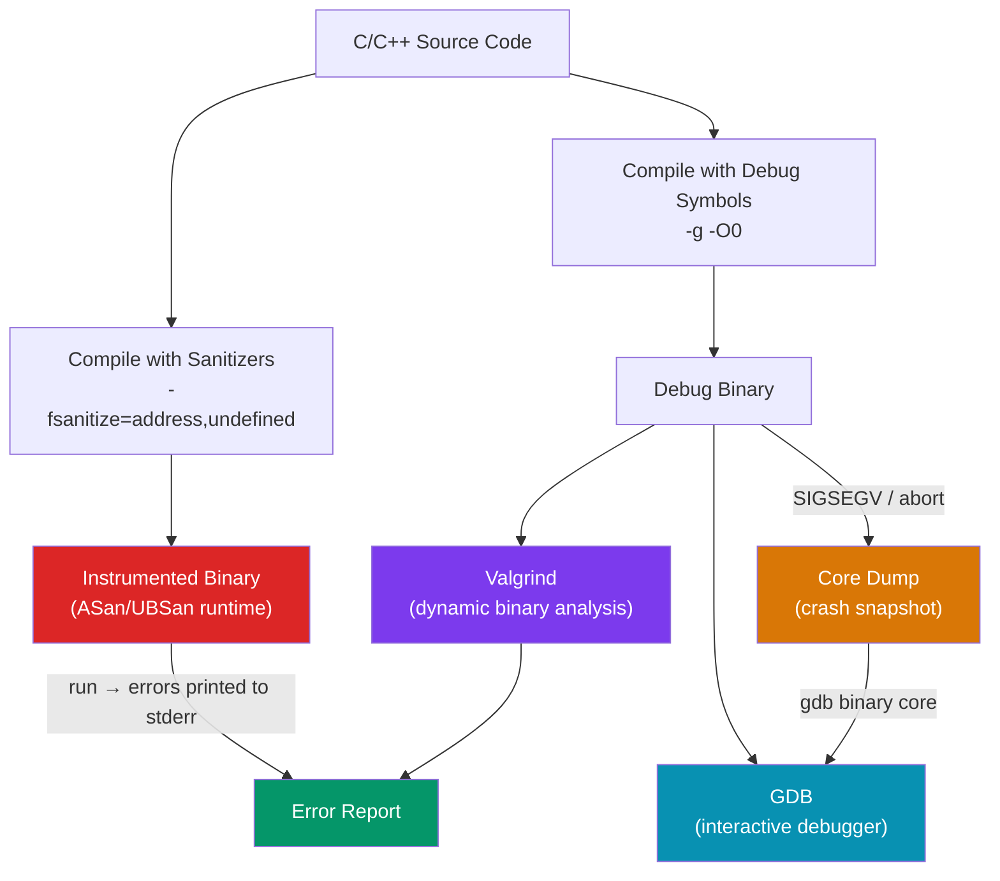

# C/C++ Debugging and Sanitizers

> [!abstract] TL;DR
> C/C++ debugging tools split into two categories: **compile-time instrumentation** (ASan, LSan, UBSan — inject checks into the binary itself, 2×–10× slowdown, best used in CI) and **post-compilation analysis** (Valgrind — interprets every instruction in a virtual CPU, 10×–100× slower but requires no recompilation). **GDB** is the interactive debugger for both. **Core dumps** allow post-mortem debugging of crashes in production. The modern workflow: develop with sanitizers enabled, profile with Valgrind Massif, investigate production crashes with GDB + core dumps.

## Intuition — analogy FIRST

Debugging C/C++ memory bugs is like finding a gas leak in a building. Sanitizers (ASan, UBSan) are like coating every pipe with a chemical that glows under UV light — the pipe itself tells you exactly where it is leaking as it runs. Valgrind is like bringing in a specialist with a sniffer device who re-traces every gas path manually — slower, but works on the original unmodified pipes. GDB is the inspector walking through the building room by room, checking pressure gauges (registers), reading pipe labels (symbols), and stopping the flow at a specific junction (breakpoint) to investigate.

---

## How It Works



---

## Key Concepts / Details

### AddressSanitizer (ASan)

ASan detects: heap buffer overflow, stack buffer overflow, heap use-after-free, use-after-return, use-after-scope, double-free, memory leaks (when combined with LSan).

```bash
# Compile with ASan
gcc -fsanitize=address -g -O1 -fno-omit-frame-pointer buggy.c -o buggy
# Clang: clang -fsanitize=address -g -O1 buggy.c -o buggy

./buggy
# Output if heap overflow:
# ==12345==ERROR: AddressSanitizer: heap-buffer-overflow on address 0x602000000014
# WRITE of size 4 at 0x602000000014
#     #0 main buggy.c:7
```

```c
// Example that triggers ASan
int main(void) {
    int *arr = malloc(10 * sizeof(int));
    arr[10] = 42;   // ← heap buffer overflow: index 10, size 10
    free(arr);
}
```

**ASan runtime options** (set via `ASAN_OPTIONS` env var):
```bash
ASAN_OPTIONS=detect_leaks=1:halt_on_error=0 ./buggy
# detect_leaks=1: enable leak detection (default on Linux)
# halt_on_error=0: continue after first error (report all)
# log_path=/tmp/asan.log: redirect output to file
```

### LeakSanitizer (LSan)

LSan is included in ASan (`-fsanitize=address`) on Linux. It can also run standalone:

```bash
gcc -fsanitize=leak -g buggy.c -o buggy
./buggy
# ==12345==ERROR: LeakSanitizer: detected memory leaks
# Direct leak of 40 bytes in 1 object(s) allocated from:
#     #0 malloc
#     #1 main buggy.c:3
```

```c
// Intentional leak — not freed
int main(void) {
    char *buf = malloc(40);
    // missing free(buf)
    return 0;
}
```

### UndefinedBehaviorSanitizer (UBSan)

UBSan detects: signed integer overflow, null pointer dereference, misaligned memory access, division by zero, invalid enum values, array out-of-bounds (for statically-sized arrays), type punning violations.

```bash
gcc -fsanitize=undefined -g -O1 buggy.c -o buggy
./buggy
# buggy.c:4: runtime error: signed integer overflow: 2147483647 + 1
# cannot be represented in type 'int'
```

```c
int main(void) {
    int x = INT_MAX;
    int y = x + 1;   // ← undefined behavior: signed overflow
    int *p = NULL;
    return *p;        // ← undefined behavior: null dereference
}
```

**Combine sanitizers** (most common CI setup):
```bash
gcc -fsanitize=address,undefined -g -O1 -fno-omit-frame-pointer prog.c -o prog
```

Note: ASan and ThreadSanitizer (TSan, `-fsanitize=thread`) cannot be combined — they use the same shadow memory region.

### Valgrind — memcheck, helgrind, massif

```bash
# Memcheck (default tool): memory errors and leaks
valgrind --leak-check=full --show-leak-kinds=all \
         --track-origins=yes --error-exitcode=1 \
         ./buggy
# Output: ==123== Invalid write of size 4 / definitely lost: 40 bytes

# Helgrind: thread race conditions and mutex ordering errors
valgrind --tool=helgrind ./threaded_prog
# Output: Thread 2 is writing to ... Thread 1 is also writing to ...

# Massif: heap memory profiler — shows peak allocation over time
valgrind --tool=massif --pages-as-heap=yes ./bigalloc
ms_print massif.out.123 | head -100
# Shows a timeline of heap usage with call stacks
```

Valgrind runs the binary in a synthetic CPU — no recompilation needed. Slowdown is 10×–100×. It catches bugs that sanitizers miss (e.g., use-after-free in third-party libraries not compiled with ASan).

### GDB Essentials

```bash
# Start GDB
gcc -g -O0 -o prog prog.c   # always use -g for symbols, -O0 for readable code
gdb ./prog

# Core commands (inside GDB)
(gdb) run                   # start the program
(gdb) run arg1 arg2         # with arguments
(gdb) break main            # breakpoint at function
(gdb) break prog.c:42       # breakpoint at line 42
(gdb) break *0x40123f       # breakpoint at address
(gdb) info breakpoints      # list breakpoints
(gdb) next (n)              # step over (don't enter functions)
(gdb) step (s)              # step into function
(gdb) finish                # run until current function returns
(gdb) continue (c)          # continue until next breakpoint
(gdb) print expr            # evaluate and print expression
(gdb) print *ptr            # dereference pointer
(gdb) x/10d arr             # examine 10 ints at address arr
(gdb) x/s str               # examine as string
(gdb) backtrace (bt)        # print call stack
(gdb) frame 2               # switch to stack frame 2
(gdb) info locals           # local variables in current frame
(gdb) info args             # function arguments
(gdb) watch var             # watchpoint: break when var changes
(gdb) catch throw           # break on C++ exception throw
(gdb) set var = 42          # modify a variable at runtime
(gdb) quit (q)
```

### Core Dumps — Post-Mortem Debugging

```bash
# Enable core dumps (disabled by default on many systems)
ulimit -c unlimited                 # shell session
echo "core.%p" | sudo tee /proc/sys/kernel/core_pattern  # Linux

# Run the crashing program
./buggy                             # crashes → writes core.12345

# Debug with GDB
gdb ./buggy core.12345
(gdb) bt                            # see the stack at crash time
(gdb) info locals                   # inspect local variables at crash
(gdb) frame 0                       # switch to crashing frame
(gdb) print *ptr                    # inspect the bad pointer
```

**In production** (systemd): `coredumpctl list` and `coredumpctl gdb` integrate with systemd-coredump to capture and analyze crashes.

### Sanitizer + Valgrind Quick Reference

| Tool | How to Enable | What It Finds | Overhead |
|------|--------------|--------------|---------|
| ASan | `-fsanitize=address` | Heap/stack OOB, use-after-free, double-free | ~2× |
| LSan | `-fsanitize=leak` | Memory leaks | ~2× |
| UBSan | `-fsanitize=undefined` | UB: overflow, null deref, misalign | ~1.5× |
| TSan | `-fsanitize=thread` | Data races, lock ordering | ~5×–15× |
| Valgrind memcheck | No recompile needed | All memory errors, leaks | ~20×–100× |
| Valgrind helgrind | No recompile needed | Thread races, mutex deadlock | ~20×–50× |
| Valgrind massif | No recompile needed | Heap profiling (peak/timeline) | ~20× |

---

## Common Pitfalls

1. **Optimizations hiding bugs**: Compile with `-O0` for debugging. With `-O2`, the compiler can eliminate variables and reorganize code, making backtraces misleading and some sanitizer reports disappear.
2. **Mixing ASan and TSan**: They cannot be used together. Run separate CI jobs: one with ASan+UBSan, one with TSan.
3. **False Valgrind positives from libc/OpenSSL**: Some system libraries intentionally use uninitialized memory in controlled ways. Use suppression files (`--suppressions=my.supp`) to silence known false positives.
4. **Core dumps not generated**: `ulimit -c 0` (default) silently disables core dumps. Always check `ulimit -c` before investigating a crash that "left no trace".
5. **`-g` not included in production builds**: Stripped binaries produce meaningless GDB backtraces (`?? ()` everywhere). Keep a copy of the unstripped binary or use separate debuginfo packages.

---

## Review Questions

1. What is the difference between ASan and Valgrind memcheck? When would you choose Valgrind over ASan?
2. Why can ASan and TSan not be used simultaneously? How do you test for both in CI?
3. A production server crashes with a SIGSEGV. You have the binary and a core dump. Walk through the GDB commands you would run to diagnose the crash.
4. What does UBSan's "signed integer overflow" diagnostic mean? Why is signed overflow undefined behavior in C/C++ but unsigned overflow is not?
5. What is a watchpoint in GDB and how does it differ from a breakpoint?

---

#C #Cpp #debugging #valgrind #asan #ubsan #gdb #sanitizers #memory
