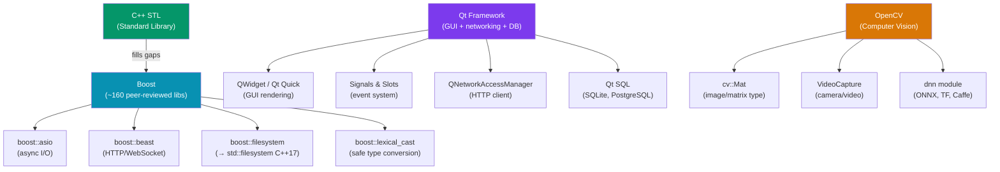

# C++ Popular Libraries

> [!abstract] TL;DR
> Three libraries dominate the C++ ecosystem beyond the STL: **Boost** is a peer-reviewed collection of ~160 libraries that fills STL gaps — key ones are `asio` (async I/O / networking), `filesystem` (now std::filesystem in C++17), `beast` (HTTP/WebSocket over Asio), and `lexical_cast`. **Qt** is a cross-platform application framework that bundles a GUI toolkit, an event loop, signals/slots, networking, databases, and more — it is the industry standard for desktop and embedded GUI development. **OpenCV** is the dominant computer vision library with a C++ API (`cv::Mat`, `VideoCapture`, feature detection, DNN module) and Python bindings. All three integrate via CMake's `find_package`.

## Intuition — analogy FIRST

The C++ STL is like a well-stocked kitchen with basic utensils (pots, knives, a stove). Boost is the professional chef's pantry extension — specialized tools that became so useful they were standardized or nearly so. Qt is a complete restaurant in a box — the kitchen, the dining room, the reservation system, the waitstaff training manual — for building full customer-facing applications. OpenCV is the specialist machine vision lab — a dedicated room full of cameras, lenses, and analysis instruments that the standard kitchen simply was not designed to host.

---

## How It Works



---

## Key Concepts / Details

### Boost — Key Libraries

#### boost::asio — Async I/O and Networking

```cpp
// Async TCP echo server with Boost.Asio
#include <boost/asio.hpp>
#include <iostream>
using namespace boost::asio;
using ip::tcp;

int main() {
    io_context ioc;
    tcp::acceptor acceptor(ioc, tcp::endpoint(tcp::v4(), 8080));

    // Synchronous accept (async_accept for production)
    tcp::socket socket(ioc);
    acceptor.accept(socket);

    // Read from client
    boost::system::error_code ec;
    std::string data;
    read_until(socket, dynamic_buffer(data), '\n', ec);
    std::cout << "Received: " << data;

    // Echo back
    write(socket, buffer(data), ec);
}
// Build: g++ -std=c++17 server.cpp -o server -lboost_system
```

Asio is the foundation of most C++ networking libraries. It uses the **proactor pattern**: you post async operations and provide completion handlers. `io_context::run()` drives the event loop.

#### boost::beast — HTTP and WebSocket

```cpp
#include <boost/beast.hpp>
#include <boost/asio.hpp>
namespace beast = boost::beast;
namespace http = beast::http;
namespace net = boost::asio;
using tcp = net::ip::tcp;

// Synchronous HTTP GET (simplified)
net::io_context ioc;
tcp::resolver resolver(ioc);
beast::tcp_stream stream(ioc);

auto const results = resolver.resolve("example.com", "80");
stream.connect(results);

http::request<http::string_body> req{http::verb::get, "/", 11};
req.set(http::field::host, "example.com");
req.set(http::field::user_agent, BOOST_BEAST_VERSION_STRING);
http::write(stream, req);

beast::flat_buffer buffer;
http::response<http::dynamic_body> res;
http::read(stream, buffer, res);
std::cout << res << std::endl;
```

#### boost::lexical_cast — Safe Type Conversion

```cpp
#include <boost/lexical_cast.hpp>
#include <string>

// Throws boost::bad_lexical_cast on failure (vs undefined behavior with atoi)
int port = boost::lexical_cast<int>("8080");
std::string num = boost::lexical_cast<std::string>(42);

try {
    int bad = boost::lexical_cast<int>("not_a_number"); // throws
} catch (const boost::bad_lexical_cast& e) {
    std::cerr << "Cast failed: " << e.what() << std::endl;
}

// C++17 alternative: std::from_chars (no exceptions, faster)
#include <charconv>
int val;
auto [ptr, ec] = std::from_chars(str.data(), str.data() + str.size(), val);
if (ec != std::errc{}) { /* error */ }
```

### Qt Framework

#### Qt Essentials

```cpp
// main.cpp — minimal Qt application
#include <QApplication>
#include <QPushButton>
#include <QLabel>
#include <QVBoxLayout>
#include <QWidget>

int main(int argc, char *argv[]) {
    QApplication app(argc, argv);  // QCoreApplication for non-GUI

    QWidget window;
    window.setWindowTitle("Qt Demo");

    QVBoxLayout *layout = new QVBoxLayout(&window);
    QLabel *label = new QLabel("Counter: 0");
    QPushButton *btn = new QPushButton("Increment");
    layout->addWidget(label);
    layout->addWidget(btn);

    int counter = 0;
    // Qt signals and slots — type-safe event connections
    QObject::connect(btn, &QPushButton::clicked, [&]() {
        label->setText(QString("Counter: %1").arg(++counter));
    });

    window.show();
    return app.exec();  // enters the Qt event loop
}
// CMake: find_package(Qt6 REQUIRED COMPONENTS Core Widgets)
//        target_link_libraries(myapp Qt6::Core Qt6::Widgets)
```

#### Qt Signals and Slots

```cpp
// mywidget.h — custom QObject with signals and slots
#include <QObject>

class Counter : public QObject {
    Q_OBJECT  // required macro for MOC (Meta Object Compiler)
public:
    explicit Counter(QObject *parent = nullptr) : QObject(parent) {}
    int value() const { return m_value; }

public slots:
    void setValue(int value) {
        if (value != m_value) {
            m_value = value;
            emit valueChanged(value);  // signal emission
        }
    }

signals:
    void valueChanged(int newValue);  // declared, not implemented by you

private:
    int m_value = 0;
};

// Connect two Counter objects — changing one drives the other
Counter a, b;
QObject::connect(&a, &Counter::valueChanged, &b, &Counter::setValue);
a.setValue(42);   // b.value() is now 42
```

Qt's MOC (Meta Object Compiler) runs as a build step and generates the signal/slot machinery from the `Q_OBJECT` macro — this is why Qt requires its own CMake integration.

### OpenCV — Computer Vision

#### Core Types and Basic Operations

```cpp
#include <opencv2/opencv.hpp>
using namespace cv;

int main() {
    // cv::Mat is the core type — n-dimensional dense matrix
    Mat img = imread("photo.jpg", IMREAD_COLOR);
    if (img.empty()) { std::cerr << "Cannot read image\n"; return 1; }

    std::cout << "Size: " << img.cols << "x" << img.rows
              << " Channels: " << img.channels() << "\n";

    // Color space conversion
    Mat gray, blurred;
    cvtColor(img, gray, COLOR_BGR2GRAY);
    GaussianBlur(gray, blurred, Size(5, 5), 0);

    // Edge detection
    Mat edges;
    Canny(blurred, edges, 100, 200);

    imwrite("edges.jpg", edges);
    imshow("Edges", edges);
    waitKey(0);    // wait for keypress (required to keep window open)
}
// CMake: find_package(OpenCV REQUIRED)
//        target_link_libraries(myapp ${OpenCV_LIBS})
```

#### Camera Capture and DNN Inference

```cpp
// Real-time webcam + DNN inference
VideoCapture cap(0);  // 0 = default camera
if (!cap.isOpened()) return 1;

// Load a pre-trained ONNX model
Net net = dnn::readNetFromONNX("model.onnx");
net.setPreferableBackend(dnn::DNN_BACKEND_CUDA);  // GPU if available
net.setPreferableTarget(dnn::DNN_TARGET_CUDA);

Mat frame;
while (cap.read(frame)) {
    // Preprocess: resize, normalize, create blob
    Mat blob = dnn::blobFromImage(frame, 1.0/255.0, Size(640, 640), Scalar(), true);
    net.setInput(blob);

    // Forward pass
    std::vector<Mat> outputs;
    net.forward(outputs, net.getUnconnectedOutLayersNames());

    // outputs contains detection results — post-process here
    imshow("Camera", frame);
    if (waitKey(1) == 27) break;  // ESC to quit
}
```

### CMake Integration

```cmake
cmake_minimum_required(VERSION 3.20)
project(MyApp CXX)
set(CMAKE_CXX_STANDARD 17)

# Boost
find_package(Boost 1.80 REQUIRED COMPONENTS system filesystem)

# Qt6
find_package(Qt6 REQUIRED COMPONENTS Core Widgets Network)
set(CMAKE_AUTOMOC ON)    # enables MOC for Q_OBJECT
set(CMAKE_AUTOUIC ON)    # enables UIC for .ui files
set(CMAKE_AUTORCC ON)    # enables RCC for .qrc files

# OpenCV
find_package(OpenCV REQUIRED)

add_executable(myapp main.cpp)
target_link_libraries(myapp
    Boost::system Boost::filesystem
    Qt6::Core Qt6::Widgets Qt6::Network
    ${OpenCV_LIBS}
)
```

---

## Trade-Offs

| Library | Strengths | Weaknesses |
|---------|-----------|------------|
| Boost | Peer-reviewed, header-only options, C++17 source | Large dependency, complex templates, long compile times |
| Qt | Complete ecosystem, cross-platform GUI, excellent tooling | MOC/build complexity, LGPL license considerations, heavyweight |
| OpenCV | Best-in-class CV algorithms, Python bindings, CUDA support | Large binary size, C API legacy, inconsistent C++ interface |

---

## Common Pitfalls

1. **Boost header-only vs compiled**: Some Boost libraries (asio, optional) are header-only. Others (filesystem pre-C++17, system, thread) require compiled components linked with `-lboost_system`. Check the docs for each library.
2. **Qt MOC not running**: If you add `Q_OBJECT` to a new class but forget `set(CMAKE_AUTOMOC ON)`, the signals/slots system silently breaks. Always enable AUTOMOC in CMake for Qt projects.
3. **OpenCV Mat ownership**: `Mat` uses reference-counted shallow copies by default. `Mat b = a;` shares data — modifying `b` modifies `a`. Use `a.clone()` for a deep copy.
4. **Asio event loop not running**: `io_context::run()` must be called to drive async operations. Common mistake: posting async work then forgetting to call `run()`.
5. **Qt event loop blocking**: Long computations on the main (GUI) thread freeze the UI. Use `QThread`, `QtConcurrent`, or `QFuture` to offload work.

---

## Review Questions

1. What is the proactor pattern and how does Boost.Asio implement it with `io_context`?
2. What is Qt's MOC (Meta Object Compiler) and why does it require the `Q_OBJECT` macro? What build step does it add?
3. What is the difference between `Mat b = a` and `Mat b = a.clone()` in OpenCV? When does this matter?
4. You need to make HTTP requests from a C++ application. Compare the approaches using Boost.Beast vs Qt's `QNetworkAccessManager`.
5. Why might you choose Boost.Asio over raw POSIX `epoll`/`kqueue` for a high-performance server?

---

#C #Cpp #boost #qt #opencv #libraries #networking
