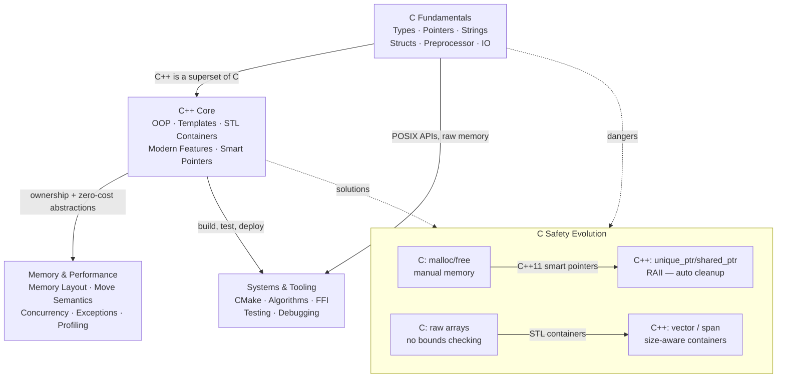

# C and C++ Master MOC

> [!abstract] About
> 25 notes across 4 sections covering C fundamentals and modern C++. Section 01 is pure C (the foundation); sections 02–04 are C++ building on that foundation. C++ includes C as a subset — every C concept carries forward, with C++ providing safer, higher-level alternatives for each dangerous C pattern (manual memory → smart pointers, raw arrays → STL containers, function pointers → lambdas/templates).

---

## Concept Map



---

## Sections

| # | Section | Notes | Focus |
|---|---------|-------|-------|
| 01 | [[C_Overview\|C Fundamentals]] | 7 | Pure C: types, memory, strings, structs, I/O, IPC |
| 02 | [[Cpp_Overview\|C++ Core]] | 6 | OOP, templates, STL, modern C++11-20 features |
| 03 | [[Memory_Management_Cpp\|Memory & Performance]] | 6 | Move semantics, concurrency, POSIX threads, exceptions, perf |
| 04 | [[CMake_Build_System\|Systems & Tooling]] | 6 | CMake, algorithms, FFI, testing, popular libraries, debugging |

---

## Section 01 — C Fundamentals

| Note | Key Concepts |
|------|-------------|
| [[C_Overview]] | History, compilation pipeline, standards (C89→C23), gcc/clang flags |
| [[C_Types_and_Operators]] | Primitives, sizeof, signed/unsigned, casting, bitwise ops, integer promotion |
| [[C_Pointers_and_Memory]] | Pointer arithmetic, malloc/calloc/realloc/free, stack vs heap, buffer overflow, valgrind |
| [[C_Strings_and_Arrays]] | Null-terminated strings, string.h (strcpy/strcmp/strstr), array decay, multidimensional arrays |
| [[C_Structs_and_Unions]] | Struct padding, union type-punning, typedef, bitfields, flexible array member |
| [[C_Preprocessor_and_IO]] | Macros, include guards, conditional compilation, printf format specifiers, file I/O |
| [[C_IPC]] | Pipes, FIFOs, message queues, shared memory (mmap/shmget), semaphores, Unix domain sockets |

---

## Section 02 — C++ Core

| Note | Key Concepts |
|------|-------------|
| [[Cpp_Overview]] | C++ editions, RAII principle, namespaces, build systems, C vs C++ differences |
| [[Cpp_OOP]] | Class/struct, Rule of Five, virtual/vtable, abstract classes, override/final, diamond problem |
| [[Cpp_Templates]] | Function/class templates, specialization, variadic templates, if constexpr, C++20 Concepts |
| [[Cpp_STL_Containers]] | vector, string/string_view, map/unordered_map, set, deque, array, span, iterator invalidation |
| [[Cpp_Modern_Features]] | auto, lambdas, structured bindings, optional/variant/any, fold expressions |
| [[Cpp_Smart_Pointers]] | unique_ptr, shared_ptr, weak_ptr, enable_shared_from_this, raw pointer use cases |

---

## Section 03 — Memory and Performance

| Note | Key Concepts |
|------|-------------|
| [[Memory_Management_Cpp]] | new/delete vs malloc/free, placement new, RAII + exceptions, memory layout, alignas/alignof |
| [[Move_Semantics]] | lvalue/rvalue, std::move, move ctor/assignment, perfect forwarding, RVO/NRVO |
| [[Cpp_Concurrency]] | std::thread, mutex/lock_guard, condition_variable, atomic, async/future, jthread (C++20) |
| [[Cpp_Exception_Handling]] | try/catch/throw, noexcept, safety guarantees (basic/strong/no-throw), exceptions in ctors |
| [[Cpp_Performance]] | Profiling (perf/gprof), SoA vs AoS, constexpr/consteval, LTO, PGO, sanitizers |
| [[POSIX_Threads]] | pthread_create/join, mutexes, condition variables, TLS (pthread_key_t / __thread), vs std::thread |

---

## Section 04 — Systems and Tooling

| Note | Key Concepts |
|------|-------------|
| [[CMake_Build_System]] | CMakeLists.txt, target_* commands, find_package, FetchContent, CTest, presets |
| [[Cpp_STL_Algorithms]] | `<algorithm>` (sort/find/transform/remove), `<numeric>`, C++20 Ranges & views, parallel policies |
| [[C_Cpp_Interop_and_FFI]] | extern "C", shared libraries (.so/.dll), dlopen/dlsym, ctypes (Python), CGO (Go), Rust FFI |
| [[C_Cpp_Testing_and_Debug]] | GDB commands, ASan/UBSan, Valgrind memcheck, Google Test, Catch2 |
| [[Cpp_Popular_Libraries]] | Boost (asio, beast, filesystem, lexical_cast), Qt framework (signals/slots, MOC), OpenCV (cv::Mat, DNN) |
| [[C_Cpp_Debugging]] | Valgrind (memcheck, helgrind, massif), ASan, LSan, UBSan, TSan, GDB essentials, core dumps |

---

## Learning Paths

### Path A — Systems / Embedded (C Focus)
Best for: OS development, firmware, embedded microcontrollers, performance-critical C codebases.

```
C_Overview → C_Types_and_Operators → C_Pointers_and_Memory → C_Strings_and_Arrays
→ C_Structs_and_Unions → C_Preprocessor_and_IO → CMake_Build_System
→ C_Cpp_Interop_and_FFI → C_Cpp_Testing_and_Debug
```

### Path B — C++ Developer
Best for: application developers, game developers, backend systems engineers.

```
C_Overview → Cpp_Overview → Cpp_OOP → Cpp_Smart_Pointers
→ Cpp_STL_Containers → Cpp_Modern_Features → Move_Semantics
→ Cpp_Exception_Handling → CMake_Build_System → C_Cpp_Testing_and_Debug
```

### Path C — Performance Engineering
Best for: high-frequency trading, game engines, scientific computing, real-time systems.

```
[Complete Path B first] → Memory_Management_Cpp → Move_Semantics
→ Cpp_Concurrency → Cpp_Performance → Cpp_Templates
→ Cpp_STL_Algorithms → C_Cpp_Interop_and_FFI
```

---

## Key Design Principles

| C Pattern | Risk | C++ Solution |
|-----------|------|-------------|
| `malloc`/`free` | Memory leaks, double-free | `std::unique_ptr` / `std::shared_ptr` |
| Raw arrays, `strcpy` | Buffer overflow (exploitable) | `std::vector`, `std::string`, `std::span` |
| `void *` | No type safety | Templates, `std::any`, `std::variant` |
| Manual error codes | Easy to ignore | Exceptions, `std::expected` (C++23) |
| `pthread_mutex_t` | Unlock on every path | `std::lock_guard`, `std::scoped_lock` |
| `for (i=0; i<n; i++)` | Off-by-one, bounds issues | Range-based for, STL algorithms |

> **Note:** C++ includes C as a subset. Section 01 is pure C — all those fundamentals apply unchanged in C++ programs. Sections 02–04 show the C++ mechanisms that address C's safety gaps while preserving (or improving) performance.

---

## Cross-Vault Links

- [[_MOC_DSA_Master]] — DSA algorithms implemented in C/C++
- [[_MOC_SystemDesign_Master]] — System design uses C++ at the infrastructure layer
- [[_MOC_Computer_Architecture_Master]] — Memory models, cache hierarchy, SIMD — directly affects C/C++ performance

---

#C #Cpp
