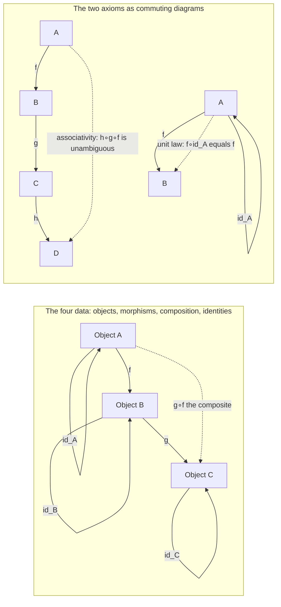

# 🕸️ Categories, Objects and Morphisms

> [!abstract] TL;DR
> A **category** is the minimal algebra of *arrows*: a collection of **objects**, a collection of **morphisms** (arrows) that each run from one object to another, a rule to **compose** compatible arrows, and an **identity** arrow on every object — subject to just two laws, **associativity** and the **unit laws**. Those two laws are the *entire* content of the definition, yet they capture the shared skeleton of sets-and-functions, groups-and-homomorphisms, spaces-and-continuous-maps, and types-and-programs all at once.

---

## Intuition

**Analogy — a map of one-way roads.** Picture a country as a network of cities joined by one-way roads. The **cities are objects**. The **roads are morphisms** — each road has a definite start city and end city. If a road runs `A → B` and another runs `B → C`, then you can make the whole trip `A → C`; that combined journey is the **composite** `g ∘ f` ("do `f`, then `g`"). Two common-sense rules keep the map sane:

1. **Associativity** — on a long trip through many cities, it does not matter how you *group* the legs into stages; the resulting journey is the same road-of-roads either way.
2. **Identity** — every city has a *do-nothing loop*, an `id` road that starts and ends there and changes nothing when you tack it onto the front or back of any trip.

That is the whole definition. Notice what we deliberately *forgot*: we never asked what a city *contains* or what a road is *made of*. A category remembers only how things connect, not what they are — and that forgetting is exactly where the power comes from.

---

## How It Works

### The four pieces of data

A category $\mathcal{C}$ is specified by four things:

1. **Objects** — a collection $\operatorname{ob}(\mathcal{C})$. Objects are opaque dots; there is nothing "inside" an object that the theory can see.
2. **Morphisms (arrows)** — for every ordered pair of objects $A, B$, a collection of arrows from $A$ to $B$, written $\operatorname{Hom}(A, B)$ and called the **hom-set**. An arrow $f \in \operatorname{Hom}(A, B)$ is written $f : A \to B$. Its **source** (domain) is $A$; its **target** (codomain) is $B$.
3. **Composition** — a rule that takes $f : A \to B$ and $g : B \to C$ and returns a single arrow $g \circ f : A \to C$. Composition is defined **only** when the target of the first arrow equals the source of the second — such arrows are **composable**. (Read $g \circ f$ right-to-left: "$g$ after $f$", matching function notation.)
4. **Identities** — for each object $A$, a distinguished arrow $\operatorname{id}_A : A \to A$.

### The two axioms — this is all of it

- **Associativity.** Whenever $f : A \to B$, $g : B \to C$, $h : C \to D$ are composable in a chain,
$$h \circ (g \circ f) = (h \circ g) \circ f.$$
So a long chain $h \circ g \circ f$ needs no parentheses — it is *unambiguous*.
- **Unit / identity laws.** For every $f : A \to B$,
$$\operatorname{id}_B \circ f = f = f \circ \operatorname{id}_A.$$
Identities are two-sided units for composition.

Everything else in category theory — functors, natural transformations, limits, adjunctions, the Yoneda lemma — is built on top of *only* these four data and these two laws. Nothing is hidden.

### Morphisms are abstract arrows, not necessarily functions

This is the conceptual leap. A morphism does **not** have to be a set-theoretic function:

- In a **poset-as-a-category** $(P, \le)$: the objects are the elements of $P$, and there is *exactly one* morphism $x \to y$ precisely when $x \le y$. Here a "morphism" is a *fact* (an inequality), not a map. Composition is transitivity of $\le$; identities are reflexivity $x \le x$.
- In a **monoid-as-a-category**: there is a *single* object $\star$, and the morphisms $\star \to \star$ are the *elements* of the monoid. Composition is the monoid's multiplication; the identity morphism is the monoid's unit. Here a "morphism" is an *element*, not a map.

Because morphisms are abstract, a category is best understood as **generalized algebra**: composition behaves like a partial multiplication and identities behave like units. In fact a category is exactly a **"monoid with many objects"** — a *typed* monoid, where you may only multiply arrows whose types (source/target) line up. A one-object category *is* a monoid; that special case is the origin of the slogan. The companion note *Examples of Categories* develops Set, Grp, Top, posets and monoids in detail.

### Size: small, large, locally small

The collections above may be genuinely huge. If $\operatorname{ob}(\mathcal{C})$ and all morphisms form honest *sets*, $\mathcal{C}$ is **small**. If the objects form a proper class (as with **Set**, the category of all sets), $\mathcal{C}$ is **large**. If merely *each* hom-collection $\operatorname{Hom}(A,B)$ is a set (even when the objects form a class), $\mathcal{C}$ is **locally small** — the usual working assumption. These size distinctions exist to sidestep Russell-style paradoxes; see [[Set_Theory_and_Relations]] for the underlying set/class issues.

### Flow / Architecture



The dashed arrows are *derived* paths that must **equal** the direct arrow — that "must equal" is the content of a **commuting diagram**, the visual language of the whole subject (see the companion note *Diagrams and Commutativity*). Reverse every arrow and swap the order of composition and you get a brand-new category, the **opposite category** $\mathcal{C}^{\mathrm{op}}$ — the seed of *duality* (companion note *Duality and the Opposite Category*), which lets every theorem be bought twice.

---

## Key Concepts

### 🟢 Secondary (intuitive)
- **Objects = dots, morphisms = labeled arrows.** A category is a network of arrows you are allowed to *chain*.
- **Composition = "follow one arrow, then the next."** You can only chain arrows when the head of one meets the tail of the next.
- **Identity = staying put.** Every dot has a do-nothing arrow.
- Two sanity rules: how you *group* a chain never matters, and the do-nothing arrow changes nothing.

### 🟡 Undergraduate (formal)
- **Precise definition:** objects, hom-sets $\operatorname{Hom}(A,B)$, composition respecting source/target, identities, plus **associativity** and the **unit laws**.
- **Source/target (domain/codomain):** composition $g \circ f$ is defined *iff* $\operatorname{tgt}(f) = \operatorname{src}(g)$.
- **Canonical examples:** **Set** (sets + functions), **Grp** (groups + homomorphisms — see [[Groups_and_Subgroups]]), **Top** (spaces + continuous maps), **Vect** (vector spaces + linear maps), any **poset** (arrow = $\le$), any **monoid** (one object, arrows = elements).
- **Morphisms are abstract** — not always functions. A category is *not* a set, and it is *more* than a directed graph: a graph has no composition rule and no laws.

### 🔴 Graduate (structural)
- **Size discipline:** small vs. large vs. **locally small**; proper classes; Grothendieck universes when one needs a "category of all (small) categories."
- **Category as a typed monoid / monoid object:** a one-object category is a monoid; internalizing this gives *monoid objects* and *internal categories* in any category with enough structure.
- **Duality principle:** every construction has a dual obtained in $\mathcal{C}^{\mathrm{op}}$; prove a statement once, get its co-statement free.
- **Where it goes next:** structure-preserving maps *between* categories are **functors**; maps between functors are **natural transformations**; representability culminates in the **Yoneda lemma** (see [[Category_Theory]] for the full arc). Special morphisms — mono, epi, iso, split maps — refine "arrow" into a taxonomy (companion note *Isomorphisms and Special Morphisms*).

---

## Python Demo

We implement the category axioms as an **executable checker**. A category is represented by its objects, its morphisms (each with a source and target), a designated identity per object, and a composition table. The checker verifies the three obligations — (1) composition respects source/target, (2) associativity, (3) the identity laws — then we run it on **valid** categories (a poset chain and a monoid) and on **broken** structures (a non-associative magma and a chain missing an identity), reporting exactly which axiom fails. Finally we visualize a small category as a directed graph.

```python
# Pure-stdlib category-axiom checker + matplotlib visualization.
# Convention: compose(g, f) means "g after f" = g∘f, defined iff tgt(f)==src(g).

import math
import matplotlib
matplotlib.use("Agg")  # headless-safe; writes PNGs
import matplotlib.pyplot as plt
from matplotlib.patches import FancyArrowPatch, Arc


class Category:
    def __init__(self, objects, morphisms, identities, comp):
        self.objects = list(objects)
        self.morphisms = dict(morphisms)     # name -> (src, tgt)
        self.identities = dict(identities)   # object -> identity morphism name
        self.comp = dict(comp)               # (g, f) -> name of g∘f

    def src(self, m): return self.morphisms[m][0]
    def tgt(self, m): return self.morphisms[m][1]


# ---- the three axiom checks: each returns (ok, [error messages]) ----

def check_composition_typing(cat):
    errs = []
    for f in cat.morphisms:
        for g in cat.morphisms:
            if cat.tgt(f) != cat.src(g):
                continue                     # not composable -> nothing required
            c = cat.comp.get((g, f))
            if c is None:
                errs.append(f"no composite for g∘f with f={f}, g={g}")
            elif c not in cat.morphisms:
                errs.append(f"composite {c} is not a declared morphism")
            elif cat.src(c) != cat.src(f) or cat.tgt(c) != cat.tgt(g):
                errs.append(f"g∘f={c} has wrong source/target for f={f}, g={g}")
    return (not errs, errs)


def check_identities_exist(cat):
    errs = []
    for o in cat.objects:
        idm = cat.identities.get(o)
        if idm is None:
            errs.append(f"object {o} has no identity morphism")
        elif idm not in cat.morphisms:
            errs.append(f"identity {idm} of {o} is not declared")
        elif cat.src(idm) != o or cat.tgt(idm) != o:
            errs.append(f"identity {idm} is not a loop on {o}")
    return (not errs, errs)


def check_identity_laws(cat):
    errs = []
    for f in cat.morphisms:
        a, b = cat.src(f), cat.tgt(f)
        ida, idb = cat.identities.get(a), cat.identities.get(b)
        if ida is None or idb is None:
            continue                          # missing-identity is caught elsewhere
        if cat.comp.get((idb, f)) != f:
            errs.append(f"id_B∘f != f for f={f}")
        if cat.comp.get((f, ida)) != f:
            errs.append(f"f∘id_A != f for f={f}")
    return (not errs, errs)


def check_associativity(cat):
    errs = []
    for f in cat.morphisms:
        for g in cat.morphisms:
            if cat.tgt(f) != cat.src(g):
                continue
            gf = cat.comp.get((g, f))
            if gf is None:
                continue
            for h in cat.morphisms:
                if cat.tgt(g) != cat.src(h):
                    continue
                hg = cat.comp.get((h, g))
                if hg is None:
                    continue
                left = cat.comp.get((h, gf))    # h∘(g∘f)
                right = cat.comp.get((hg, f))   # (h∘g)∘f
                if left != right:
                    errs.append(
                        f"h∘(g∘f)={left} vs (h∘g)∘f={right}  [f={f}, g={g}, h={h}]")
    # de-duplicate while preserving order
    seen, uniq = set(), []
    for e in errs:
        if e not in seen:
            seen.add(e); uniq.append(e)
    return (not uniq, uniq)


def run_checks(name, cat):
    print(f"\n=== {name} ===")
    checks = [
        ("(1) composition respects source/target", check_composition_typing),
        ("    identities exist", check_identities_exist),
        ("(2) associativity",     check_associativity),
        ("(3) identity/unit laws", check_identity_laws),
    ]
    all_ok = True
    for label, fn in checks:
        ok, errs = fn(cat)
        all_ok = all_ok and ok
        print(f"  {'PASS' if ok else 'FAIL'}  {label}")
        for e in errs[:3]:
            print(f"          - {e}")
    print(f"  >>> {'VALID CATEGORY' if all_ok else 'NOT A CATEGORY'}")
    return all_ok


# ---------------- constructors ----------------

def make_chain(n):
    """Poset 0 <= 1 <= ... <= n-1 as a category (a totally ordered chain)."""
    morphisms = {f"{i}->{j}": (i, j) for i in range(n) for j in range(i, n)}
    identities = {i: f"{i}->{i}" for i in range(n)}
    comp = {}
    for i in range(n):
        for j in range(i, n):
            for k in range(j, n):
                comp[(f"{j}->{k}", f"{i}->{j}")] = f"{i}->{k}"  # g∘f
    return Category(range(n), morphisms, identities, comp)


def make_cyclic_monoid(n):
    """Z/n under addition as a ONE-object category (a monoid = 1-object category)."""
    obj = "*"
    morphisms = {str(a): (obj, obj) for a in range(n)}
    identities = {obj: "0"}
    comp = {(str(b), str(a)): str((a + b) % n) for a in range(n) for b in range(n)}
    return Category([obj], morphisms, identities, comp)


def make_broken_magma():
    """One object; 'e' is a genuine identity but the product is NON-associative."""
    obj = "*"
    elems = ["e", "a", "b"]
    morphisms = {x: (obj, obj) for x in elems}
    identities = {obj: "e"}
    comp = {}
    for x in elems:                       # e acts as a two-sided identity
        comp[("e", x)] = x
        comp[(x, "e")] = x
    comp[("a", "a")] = "b"                 # tuned so a∘(a∘a) != (a∘a)∘a
    comp[("a", "b")] = "a"
    comp[("b", "a")] = "b"
    comp[("b", "b")] = "a"
    return Category([obj], morphisms, identities, comp)


def make_chain_missing_identity(n, drop):
    """A chain with the identity of object `drop` removed -> identity axioms fail."""
    cat = make_chain(n)
    del cat.identities[drop]               # object `drop` now has no identity
    return cat


# ---------------- visualization ----------------

def draw_category(cat, positions, title, filename):
    fig, ax = plt.subplots(figsize=(8, 5))
    for o, (x, y) in positions.items():
        ax.scatter([x], [y], s=1500, c="#2563eb", edgecolors="black", zorder=3)
        ax.text(x, y, str(o), color="white", ha="center", va="center",
                fontsize=13, fontweight="bold", zorder=4)
    for name, (s, t) in cat.morphisms.items():
        if s == t:                                            # identity loop
            x, y = positions[s]
            ax.add_patch(Arc((x, y + 0.30), 0.36, 0.36, theta1=300, theta2=210,
                             color="#16a34a", lw=1.6, zorder=2))
            ax.text(x, y + 0.55, name, ha="center", va="bottom",
                    fontsize=8, color="#16a34a")
        else:                                                 # ordinary arrow
            x1, y1 = positions[s]; x2, y2 = positions[t]
            far = abs(x2 - x1) + abs(y2 - y1) > 1.8
            rad = 0.28 if far else 0.0
            ax.add_patch(FancyArrowPatch((x1, y1), (x2, y2),
                         connectionstyle=f"arc3,rad={rad}", arrowstyle="-|>",
                         mutation_scale=16, color="#334155", lw=1.6,
                         shrinkA=22, shrinkB=22, zorder=2))
            mx, my = (x1 + x2) / 2, (y1 + y2) / 2 + (0.40 if far else 0.12)
            ax.text(mx, my, name, ha="center", va="bottom",
                    fontsize=8, color="#334155")
    ax.set_title(title)
    xs = [p[0] for p in positions.values()]
    ax.set_xlim(min(xs) - 1, max(xs) + 1); ax.set_ylim(-1, 1.6)
    ax.axis("off"); fig.tight_layout(); fig.savefig(filename, dpi=120)
    print(f"  saved diagram -> {filename}")


if __name__ == "__main__":
    run_checks("VALID: poset chain 0<=1<=2<=3", make_chain(4))
    run_checks("VALID: monoid Z/3 (one object)", make_cyclic_monoid(3))
    run_checks("BROKEN: non-associative magma", make_broken_magma())
    run_checks("BROKEN: chain missing id on object 1", make_chain_missing_identity(3, 1))

    draw_category(make_chain(3),
                  {0: (0, 0), 1: (1.6, 0), 2: (3.2, 0)},
                  "A small category: chain 0 -> 1 -> 2 (all morphisms shown)",
                  "category_chain.png")
```

**Expected output (abridged):**

```
=== VALID: poset chain 0<=1<=2<=3 ===
  PASS  (1) composition respects source/target
  PASS      identities exist
  PASS  (2) associativity
  PASS  (3) identity/unit laws
  >>> VALID CATEGORY

=== BROKEN: non-associative magma ===
  PASS  (1) composition respects source/target
  PASS      identities exist
  FAIL  (2) associativity
          - h∘(g∘f)=a vs (h∘g)∘f=b  [f=a, g=a, h=a]
  PASS  (3) identity/unit laws
  >>> NOT A CATEGORY

=== BROKEN: chain missing id on object 1 ===
  PASS  (1) composition respects source/target
  FAIL      identities exist
          - object 1 has no identity morphism
  ...
  >>> NOT A CATEGORY
```

The magma has a perfectly good identity and well-typed composition yet **fails associativity**, so it is *not* a category. The mutilated chain has fine composition but **no identity on object 1**. Each failure is localized to a single axiom — exactly the diagnostic power of stating the definition as a small list of laws.

---

## Real-World Applications

> **Example — Haskell and typed function composition.** In a statically typed functional language the category **is right there in the type system**: objects are **types**, morphisms are **functions** `f :: A -> B`, composition is the `(.)` operator (`(g . f) x = g (f x)`), and `id` is the identity function. The compiler *enforces* the composability rule — you literally cannot write `g . f` unless the output type of `f` matches the input type of `g` — and associativity/unit laws are theorems about `(.)` and `id`. This is the practical face of the companion note *Category Theory in Programming*, and it is why functors, applicatives, and monads carry over verbatim.

- **Databases (Spivak).** A schema is a small category (objects = tables, morphisms = foreign-key paths); an instance is a functor into **Set**; data migration is composition of functors.
- **Build systems & pipelines.** Any "stage `A` produces input for stage `B`" workflow with associative chaining and a no-op stage is a category; correctness reductions reuse the axioms.
- **Physics & quantum computation.** Processes composed in sequence form (monoidal) categories; string diagrams and the ZX-calculus are commuting-diagram reasoning made graphical.
- **Pure mathematics.** The definition is the common denominator of **Set**, **Grp**, **Top**, **Vect** — proving something "for any category" proves it in *all* of them simultaneously.

---

## Common Pitfalls

- **"Objects contain elements."** They do not — an object is an opaque dot. Anything you want to say about an object must be said through its *morphisms*. This "outside-in" stance is the whole game.
- **"Morphisms are functions."** Only in **Set**-like categories. In a poset a morphism is an inequality; in a monoid it is an element. Treating arrows as maps blinds you to most examples.
- **"A category is a set (or a graph)."** It is neither. It has *two* sorts of thing (objects and morphisms), and — unlike a graph — it carries a **composition operation** plus the **associativity and identity laws**. Drop the laws and you have merely a directed multigraph.
- **Composing non-composable arrows.** $g \circ f$ exists *only* when $\operatorname{tgt}(f) = \operatorname{src}(g)$. Forgetting the source/target check is the single most common beginner error; the demo's `check_composition_typing` exists precisely to catch it.
- **Reading $g \circ f$ left-to-right.** It means "$g$ **after** $f$" — apply $f$ first. The notation matches function application, not English word order.
- **Confusing "same object" with "isomorphic."** Two objects linked by an invertible morphism (an isomorphism) are interchangeable *for categorical purposes* but need not be identical; the taxonomy of such special morphisms is its own topic (companion note *Isomorphisms and Special Morphisms*).

---

## Related Concepts

- [[Category_Theory]] — the advanced overview this note is the on-ramp to: functors, natural transformations, adjunctions and the Yoneda lemma all sit atop the objects-morphisms-composition-identity definition given here.
- [[Groups_and_Subgroups]] — a group is a one-object category in which *every* morphism is invertible; a monoid drops the invertibility requirement, so "category" generalizes both by allowing many objects.
- [[Set_Theory_and_Relations]] — supplies **Set** (the prototype category of sets and functions), the poset/preorder examples where morphisms are order relations, and the set-vs-proper-class machinery behind small/large/locally small.

*Companion foundation notes to be created in this folder:* Category Theory Overview (motivation and roadmap), Examples of Categories (Set, Grp, Top, posets, monoids worked out), Diagrams and Commutativity (the visual proof language), Duality and the Opposite Category (reverse the arrows), Isomorphisms and Special Morphisms (mono/epi/iso), Functors (structure-preserving maps between categories), and Category Theory in Programming (types, functions, composition).

---

## Review Questions

**🟢 Foundational**
1. List the four data and the two axioms of a category. For arrows $f : A \to B$ and $g : C \to D$, exactly when is $g \circ f$ defined, and what are its source and target?

**🟡 Intermediate**
2. Explain in what precise sense "a monoid is a one-object category" and "a poset is a category with at most one arrow between any two objects." In each case, what do composition and identities correspond to?
3. Given a directed graph, what extra data and laws must you add to turn it into a category — and why is a category therefore *not* the same thing as a graph?

**🔴 Advanced**
4. A structure has objects, well-typed composition, and a two-sided identity on every object, but composition is **not** associative (like the demo's magma). Which categorical constructions (e.g., unambiguous chains, functoriality) break, and why is associativity — rather than identity — usually the hard axiom to satisfy in practice?
5. Define the opposite category $\mathcal{C}^{\mathrm{op}}$ from the four data of $\mathcal{C}$. Verify that reversing all arrows and swapping the order of composition again satisfies both axioms, and state what "duality" then buys you for any theorem proved about arbitrary categories.

---

## Sources

- Mac Lane, S. *Categories for the Working Mathematician*, 2nd ed., Springer (1998), Ch. I.1–I.2 — the standard definition of a category, small/large/locally small.
- Awodey, S. *Category Theory*, 2nd ed., Oxford University Press (2010), Ch. 1 — objects, arrows, composition, identity; monoids and posets as categories.
- Riehl, E. *Category Theory in Context*, Dover (2016), Ch. 1 — modern treatment with examples and size conventions. Free PDF: https://math.jhu.edu/~eriehl/context.pdf
- Leinster, T. *Basic Category Theory*, Cambridge University Press (2014), Ch. 1 — accessible definition with worked examples. arXiv:1612.09375
- Milewski, B. *Category Theory for Programmers* (2019), Ch. 1–3 — the types-as-objects, functions-as-morphisms viewpoint. https://bartoszmilewski.com/2014/10/28/category-theory-for-programmers-the-preface/

---

#category-theory #objects #morphisms #composition #identity
