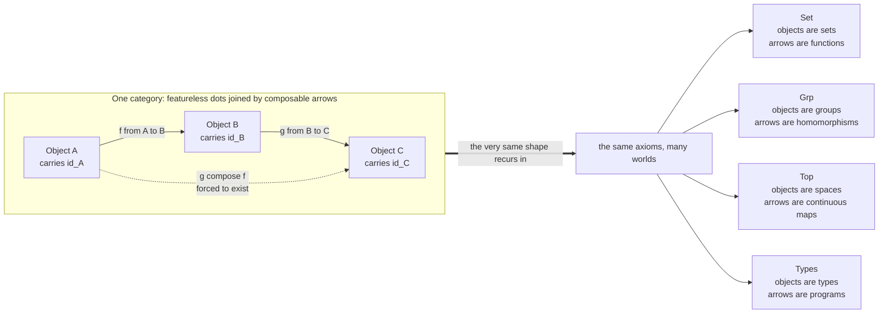

# 🕸️ Category Theory Overview

> [!abstract] TL;DR
> **Category theory** is the branch of mathematics that studies not *things* but the **arrows between things** and how those arrows **compose**. A **category** is a minimal, almost embarrassingly simple structure — objects (featureless dots), morphisms (arrows) with a source and target, an **associative composition**, and an **identity** arrow on every object — yet that structure is expressive enough to describe sets, groups, spaces, logics, and programs *in one language*. By treating objects as opaque and paying attention only to the web of relationships, the same patterns — products, sums, universal properties, **functors**, **natural transformations**, **adjunctions**, **monads** — reappear across every field of mathematics and computer science. This note opens the Category Theory vault: it is the map before the territory.

---

## Intuition

**Analogy — study the city by its roads, not its buildings.** Almost all of mathematics, as you first meet it, is about *what things are*: a number is a quantity, a group is a set with a multiplication, a topological space is points glued by open sets. Category theory makes a strange and powerful move: **forget what the objects are made of, and remember only how they connect.** Imagine a geographer who never enters a single building and never asks what any building *contains* — she studies a city purely through its roads and the journeys you can take along them: which places you can reach, how routes chain together, which round-trips get you nowhere. Astonishingly, that impoverished picture is *enough*. The road-network alone reveals a city's structure, and — this is the miracle — the *same* network shapes keep recurring whether the "city" is the universe of sets, the universe of groups, or the universe of computer programs.

In the technical domain, the "buildings" are **objects**, the "roads" are **morphisms** (structure-preserving maps), and "chaining journeys" is **composition**. Once you commit to describing everything through composition, you discover that concepts you thought were separate — the Cartesian product of sets, the direct product of groups, the product topology, the tuple type in a programming language — are literally *the same categorical shape* wearing different costumes. Category theory is the mathematics of **structure and relationship**, and it is why disparate corners of knowledge suddenly look like dialects of one grammar.

---

## How It Works

### The core shift

Traditional mathematics is **object-centric**: to understand a group you look *inside* it at its elements and its multiplication table. Category theory is **morphism-centric**: to understand an object you look *outside* it, at how it maps to and from every other object. The internal makeup is deliberately ignored; the **web of arrows is the whole content**. This "outside-in" stance is not a loss of information — the [[The_Yoneda_Lemma|Yoneda lemma]] (developed later in the vault) proves the shocking fact that **an object is completely determined, up to unique isomorphism, by its relationships alone.**

### A category, in brief

A **category** consists of exactly four ingredients, satisfying two laws:

1. **Objects** — a collection of dots, with no assumed internal structure. Call them `A, B, C, ...`
2. **Morphisms (arrows)** — for any objects `A` and `B`, a collection of arrows `f : A -> B`, each carrying a **source** `A` and a **target** `B`.
3. **Composition** — if `f : A -> B` and `g : B -> C` line up head-to-tail, there is a composite arrow `g after f : A -> C`. Journeys chain.
4. **Identities** — every object `A` has a **do-nothing** arrow `id_A : A -> A`.

subject to the **two axioms** that make it all cohere:

- **Associativity** — `h after (g after f) = (h after g) after f`. The order in which you *group* a chain of journeys never matters.
- **Identity (unit) law** — `f after id_A = f` and `id_B after f = f`. Doing nothing before or after a journey changes nothing.

That is the *entire* definition. Everything in the vault — functors, universal properties, the Yoneda lemma, adjunctions, monads — is built from these four ingredients and two laws. The details of objects and morphisms live in the sibling note **Categories_Objects_and_Morphisms**, and the visual language of chained equalities lives in **Diagrams_and_Commutativity**.

### The unifying power

The reason this minimal structure matters is that it is *everywhere*. The sibling note **Examples_of_Categories** shows the roll-call: **Set** (sets and functions), **Grp** (groups and homomorphisms), **Top** (spaces and continuous maps), **Vect** (vector spaces and linear maps), any **poset** (elements and `<=` arrows), any **monoid** (one object, elements as arrows), and — crucially for us — **types and programs**. Because they are all categories, any theorem proved about *categories in general* is simultaneously a theorem about sets, groups, spaces, and code. Constructions defined purely by their arrow-relationships — **products, coproducts (sums), and other universal properties** (see **Universal_Properties**) — instantiate to the Cartesian product, the disjoint union, the free product, and the tuple type, all at once.



---

## Key Concepts

### Secondary level — arrows and composition

- **A function is an arrow.** `double : Number -> Number` sends 3 to 6. The essential facts are its *source*, its *target*, and what it does — not its "insides".
- **Composition is following one journey after another.** If `double` turns 3 into 6 and `addOne` turns 6 into 7, then `addOne after double` turns 3 into 7 in a single step. This chaining is the heart of everything.
- **The identity does nothing.** `id : X -> X` leaves every input untouched; composing with it changes nothing — the arithmetic "1" of composition.
- **Same shape, different worlds.** Following roads in a city, composing functions, and stacking transformations all obey the *same* rules: chaining is associative and there is a neutral "stay put" move.

### Undergraduate level — the formal machinery

- **The category axioms** — objects, `Hom(A,B)` sets of morphisms, associative composition, identities as units. Verifying these axioms *is* checking you have a category (the Python demo below does exactly this).
- **Isomorphism, not equality** — two objects are "the same" categorically when there are arrows `f : A -> B`, `g : B -> A` with `g after f = id_A` and `f after g = id_B`. Category theory almost never asks whether things are *equal*, only whether they are *isomorphic*.
- **Duality** — reverse every arrow and you get the **opposite category** `C^op`. Every theorem comes free with a dual theorem (products dualise to coproducts, limits to colimits). One proof, two results.
- **[[Functors|Functors]]** — structure-preserving maps *between* categories: a functor `F : C -> D` sends objects to objects, arrows to arrows, and **respects composition and identities**. The forgetful functor `Grp -> Set` (throw away the multiplication) and the fundamental-group functor `Top -> Grp` are canonical examples. Developed in the sibling note **Functors**.
- **Commutative diagrams** — the working notation: a diagram *commutes* when all directed paths with the same endpoints are equal as composites. Diagram-chasing replaces pages of algebra with a picture.
- **[[Universal_Properties|Universal properties]]** — defining an object by a "best solution" property rather than a construction. The product `A x B` is *the* object with projections through which every competing candidate factors **uniquely**. Same template gives sums, quotients, limits, and colimits.

### Graduate level — the deep structure

- **[[Natural_Transformations|Natural transformations]]** — maps *between functors*, and the concept category theory was **invented to formalise**: Eilenberg and Mac Lane (1945) needed to make the word "natural" precise for isomorphisms in algebraic topology. A natural transformation `alpha : F => G` is a family of arrows `alpha_X : F(X) -> G(X)` making every **naturality square commute**. Developed in **Natural_Transformations**.
- **The Yoneda lemma** — the philosophical core: `Nat(Hom(A,-), F) ~ F(A)`, from which follows that **an object is fully determined by its morphisms**. Understand a thing by the totality of its relationships. Developed in **The_Yoneda_Lemma**.
- **Adjunctions** — the single most pervasive pattern in mathematics: `F -| G` when `Hom(F X, Y) ~ Hom(X, G Y)` naturally. Free-forgetful pairs, `product -| diagonal -| coproduct`, and currying (`Hom(A x B, C) ~ Hom(A, Hom(B,C))`) are all adjunctions. Mac Lane's slogan: "adjoint functors arise everywhere." Developed in **Adjunctions**.
- **[[Monads_and_Effects|Monads]]** — an endofunctor `T` with unit `eta` and multiplication `mu` obeying associativity and unit laws; every adjunction generates one. Monads package "structured computation" — and are exactly the `Monad` of Haskell. Developed categorically in **Monads_Categorically**.
- **Limits and colimits, enriched and higher categories, topoi** — the advanced-structures machinery that generalises products/sums to arbitrary diagrams and lets categories serve as **foundations for mathematics** (Lawvere's elementary topos as a universe of "variable sets").

---

## Python Demo

We treat a **finite category as plain data**: objects, morphisms with source/target, an explicit **composition table**, and identity morphisms. We then **verify the axioms directly** (typing, closure, identity, associativity), **compose a chain**, **draw the category** with matplotlib, and finally exhibit a **non-example** that the same verifier rejects.

```python
"""
Category Theory Overview -- a finite category as data.

We build the "walking commutative triangle": three objects A, B, C with
generating arrows f: A->B, g: B->C and their forced composite h = g after f.
Identity arrows are added automatically. We verify the category axioms straight
from the data, compose a chain, draw the category, then show a NON-example
(a bare graph with a missing composite) that fails an axiom.
Pure standard library + matplotlib.
"""

from dataclasses import dataclass
from itertools import product
import matplotlib.pyplot as plt


@dataclass(frozen=True)
class Morphism:
    name: str
    src: str
    tgt: str


class FiniteCategory:
    def __init__(self, objects, morphisms, identities, composites):
        self.objects = list(objects)
        self.mor = {m.name: m for m in morphisms}
        self.identities = dict(identities)          # object -> identity arrow name
        # Full composition table: comp[(g, f)] means "g after f"
        self.comp = {}
        for m in morphisms:                         # identity laws, built in
            self.comp[(m.name, self.identities[m.src])] = m.name   # m after id = m
            self.comp[(self.identities[m.tgt], m.name)] = m.name   # id after m = m
        self.comp.update(composites)                # the non-trivial composites

    def compose(self, g, f):
        """Name of 'g after f', or None if not composable / not defined."""
        if self.mor[f].tgt != self.mor[g].src:
            return None
        return self.comp.get((g, f))

    # -- each axiom check returns (ok, list_of_problems) --

    def check_typing(self):                          # composition respects src/tgt
        problems = []
        for (g, f), gf in self.comp.items():
            if self.mor[f].tgt != self.mor[g].src:
                problems.append(f"{g} after {f} listed but arrows do not line up")
            elif (self.mor[gf].src != self.mor[f].src
                  or self.mor[gf].tgt != self.mor[g].tgt):
                problems.append(f"{g} after {f} = {gf} has the wrong source/target")
        return (not problems, problems)

    def check_closure(self):                         # every composable pair composes
        problems = []
        for g, f in product(self.mor, repeat=2):
            if self.mor[f].tgt == self.mor[g].src and (g, f) not in self.comp:
                problems.append(f"no composite defined for {g} after {f}")
        return (not problems, problems)

    def check_identity(self):                        # identities are units
        problems = []
        for name, m in self.mor.items():
            left = self.compose(self.identities[m.tgt], name)   # id after m
            right = self.compose(name, self.identities[m.src])  # m after id
            if left != name or right != name:
                problems.append(f"identity law fails for {name}")
        return (not problems, problems)

    def check_associativity(self):                   # (h g) f == h (g f)
        problems = []
        for h, g, f in product(self.mor, repeat=3):
            gf, hg = self.compose(g, f), self.compose(h, g)
            if gf is None or hg is None:
                continue
            left = self.compose(h, gf)               # h after (g after f)
            right = self.compose(hg, f)              # (h after g) after f
            if left != right:
                problems.append(f"associativity fails on {h},{g},{f}: {left} != {right}")
        return (not problems, problems)

    def is_category(self, verbose=True):
        checks = {
            "source/target respected":  self.check_typing(),
            "composition is total":     self.check_closure(),
            "identities are units":     self.check_identity(),
            "composition associative":  self.check_associativity(),
        }
        ok = all(passed for passed, _ in checks.values())
        if verbose:
            for label, (passed, problems) in checks.items():
                print(f"  [{'PASS' if passed else 'FAIL'}] {label}")
                for p in problems:
                    print(f"          - {p}")
        return ok


def draw_category(cat, pos, title, path):
    fig, ax = plt.subplots(figsize=(6, 5))
    for obj, (x, y) in pos.items():                              # objects as dots
        ax.scatter([x], [y], s=1600, c="#2563eb", zorder=3, edgecolors="white")
        ax.text(x, y, obj, color="white", ha="center", va="center",
                fontsize=14, fontweight="bold", zorder=4)
        ax.text(x, y - 0.32, f"id_{obj}", color="#6b7280", ha="center",
                va="center", fontsize=8, style="italic", zorder=4)
    for name, m in cat.mor.items():                             # non-identity arrows
        if m.src == m.tgt:
            continue                                            # identities shown as labels
        (x0, y0), (x1, y1) = pos[m.src], pos[m.tgt]
        ax.annotate("", xy=(x1, y1), xytext=(x0, y0),
                    arrowprops=dict(arrowstyle="-|>", color="#7c3aed", lw=2,
                                    shrinkA=22, shrinkB=22,
                                    connectionstyle="arc3,rad=0.0"), zorder=2)
        ax.text((x0 + x1) / 2, (y0 + y1) / 2 + 0.15, name, color="#7c3aed",
                ha="center", va="center", fontsize=12, fontweight="bold", zorder=5)
    ax.set_title(title, fontsize=12)
    ax.set_xlim(-1, 5); ax.set_ylim(-1.3, 3.2); ax.axis("off")
    fig.tight_layout(); fig.savefig(path, dpi=150)
    print(f"  saved diagram to {path}")


# ---- the walking commutative triangle: a genuine category ----
objs = ["A", "B", "C"]
mors = [
    Morphism("id_A", "A", "A"), Morphism("id_B", "B", "B"), Morphism("id_C", "C", "C"),
    Morphism("f", "A", "B"),    Morphism("g", "B", "C"),    Morphism("h", "A", "C"),
]
ids = {"A": "id_A", "B": "id_B", "C": "id_C"}
comps = {("g", "f"): "h"}                    # g after f is forced to be h

triangle = FiniteCategory(objs, mors, ids, comps)
print("Is the walking triangle a category?")
assert triangle.is_category()

print("\nComposing a chain:")
gf = triangle.compose("g", "f")
print(f"  g after f = {gf}   with type "
      f"{triangle.mor[gf].src} -> {triangle.mor[gf].tgt}")

draw_category(triangle, {"A": (0, 0), "B": (2, 2.2), "C": (4, 0)},
              "The walking commutative triangle (a category)", "finite_category.png")

# ---- NON-example: a bare graph A -> B -> C with NO composite A -> C ----
print("\nNON-example: graph A -> B -> C with the composite g after f MISSING")
bad_mors = [
    Morphism("id_A", "A", "A"), Morphism("id_B", "B", "B"), Morphism("id_C", "C", "C"),
    Morphism("f", "A", "B"),    Morphism("g", "B", "C"),
]
bad = FiniteCategory(objs, bad_mors, ids, composites={})   # note: no ("g","f")
assert not bad.is_category()
print("  -> rejected: composition is not closed, so this is NOT a category.")
```

Running it prints four `PASS` lines for the triangle, reports `g after f = h` (type `A -> C`), writes `finite_category.png`, and then prints a `FAIL` for the bare graph — the verifier catches that `g after f` has nowhere to land. The lesson: **not every diagram of dots and arrows is a category; you must be closed under composition and satisfy the axioms.**

---

## Real-World Applications

- **Functional programming.** Haskell, Scala, and PureScript are organised around categorical vocabulary: `Functor`, `Applicative`, and `Monad` are the literal categorical notions. `map`/`fmap` is functoriality; `Maybe`, `List`, `State`, and `IO` are monads that structure effects and sequencing (see [[Monads_and_Effects]] and [[Functional_Programming_Foundations]]).
- **The logic-computation bridge.** Via the **Curry-Howard-Lambek correspondence**, **propositions are types are objects**, and **proofs are programs are morphisms**; typed lambda calculus corresponds to a **cartesian closed category** (see [[The_Curry_Howard_Correspondence]]). This is why proof assistants (Coq, Agda, Lean) are simultaneously programming languages.
- **Databases.** David Spivak models a database **schema as a category** and a database **instance as a functor** into **Set**; data migration between schemas becomes a functor, and query languages gain a compositional semantics.
- **Quantum computing and physics.** Symmetric monoidal categories model quantum processes; the graphical **ZX-calculus** rewrites quantum circuits as string diagrams — categorical composition made literally pictorial.
- **Applied category theory.** Baez, Fong, and Spivak use categories to give a **compositional** account of engineering systems: electrical circuits, chemical reaction networks, control systems, Petri nets, and even backpropagation-as-a-functor — building large systems by composing small pieces with guaranteed interface correctness.

---

## Common Pitfalls

- **Peeking inside objects.** The whole discipline is to treat objects as featureless dots and reason only through arrows. Reaching for "the elements of the object" usually means you have left category theory and gone back to set theory.
- **Confusing a category with "a set plus structure".** A category has **two** sorts of things (objects *and* morphisms), not one. A monoid has one sort; a category is not simply "a big set with extra operations".
- **Assuming any graph is a category.** Dots and arrows are not enough: you need **identities**, and you must be **closed under composition** and satisfy **associativity**. The Python non-example fails precisely because a required composite is missing.
- **Equality vs. isomorphism.** Newcomers ask whether two objects are *equal*; category theory almost always cares about *isomorphism* (and, higher up, equivalence). Insisting on equality is the wrong question and often meaningless.
- **Naturality is a condition, not a gift.** A natural transformation is not just any family of arrows `alpha_X`; the **naturality square must commute for every morphism**. Skipping that check is the most common error in constructing one.
- **Chasing "abstract nonsense" without examples.** The phrase **"abstract nonsense"** (coined affectionately, popularised by Grothendieck) describes arguments so general they seem to be about nothing — yet prove deep theorems uniformly (the five lemma, the snake lemma, that right adjoints preserve limits). Its power is genuine, but so is the critique: **generality untethered from concrete instances teaches nothing.** Always keep **Set**, **Grp**, and a poset in mind as touchstones.
- **Size issues.** The objects of **Set** form a proper class, not a set. Distinguishing *small*, *locally small*, and *large* categories (and invoking Grothendieck universes) matters once you build functor categories.

---

## A brief history

Category theory was born in **1945**, when **Samuel Eilenberg and Saunders Mac Lane** published *General Theory of Natural Equivalences* to make the word "natural" precise for isomorphisms arising in **algebraic topology** — they had to invent *natural transformations*, and to define those they first needed *functors*, and to define *those* they first needed *categories*. In the 1950s-60s **Alexander Grothendieck** rebuilt algebraic geometry on categorical foundations (abelian categories, sheaves, schemes, topoi), turning "abstract nonsense" into an engine of proof. **F. William Lawvere** then proposed categories as a **foundation for mathematics itself** (the elementary theory of the category of sets; functorial semantics; with Myles Tierney, elementary topos theory). **Mac Lane's** 1971 *Categories for the Working Mathematician* became the standard text. From the 1980s onward the ideas spread into computer science — **Lambek** tied cartesian closed categories to typed lambda calculus, **Moggi** (1991) introduced monads for computational effects, **Wadler** brought monads into Haskell — and, in the 2010s-2020s, into the interdisciplinary program of **applied category theory** (Baez, Fong, Spivak). This arc is developed in the sibling note **The_Reach_and_Future_of_Category_Theory**.

## The vault roadmap

This overview opens a six-section vault:

1. **01 Foundations** *(you are here)* — what a category is: **Categories_Objects_and_Morphisms**, **Examples_of_Categories**, **Diagrams_and_Commutativity**.
2. **Functors and Natural Transformations** — structure-preserving maps between categories (**Functors**) and maps between those maps (**Natural_Transformations**).
3. **Universal Constructions** — products, coproducts, limits, colimits, and the defining-by-relationship idea (**Universal_Properties**), culminating in **The_Yoneda_Lemma** and **Adjunctions**.
4. **Monads and Algebras** — structuring computation and algebraic structure (**Monads_Categorically**).
5. **Advanced Structures** — enriched, monoidal, and higher categories; topoi.
6. **Applications and Frontiers** — the CS/PLT connection (**Curry_Howard_Lambek_Correspondence**, **Category_Theory_in_Programming**) and **The_Reach_and_Future_of_Category_Theory**.

**Why learn it?** Category theory is a *lens*. Once you can see the same product, the same adjunction, the same functor recurring across logic, algebra, topology, and code, previously disconnected knowledge snaps into one connected picture. For a polymath, that is the ultimate payoff — the discipline that makes disparate fields speak a common grammar.

---

## Related Concepts

- [[Category_Theory]] — the graduate-level companion note in the Mathematics vault; this overview is the vault-opening, intuition-first entry point that it expands into.
- [[Set_Theory_and_Relations]] — **Set**, the category of sets and functions, is the prototypical example and the target of most representable functors.
- [[Mathematical_Logic_and_Set_Theory]] — categorical logic and topos theory recast set theory and logic in categorical terms; the "foundations" ambition traces here.
- [[Groups_and_Subgroups]] — groups and homomorphisms form **Grp**; a group is itself a one-object category with invertible arrows.
- [[Rings_and_Ideals]] — rings and modules furnish **Ring** and **R-Mod**, the home of abelian categories and homological algebra.
- [[Topological_Spaces]] — spaces and continuous maps form **Top**; the fundamental-group functor `Top -> Grp` is a canonical example of functoriality.
- [[The_Curry_Howard_Correspondence]] — extends to Curry-Howard-**Lambek**: logic = computation = **cartesian closed categories**.
- [[Monads_and_Effects]] — monads in programming *are* categorical monads; effects, sequencing, and `do`-notation are the applied face of this vault's monad section.
- [[Functional_Programming_Foundations]] — functors, applicatives, and monads as the everyday categorical toolkit of FP.
- [[_MOC_Mathematics_Master]] — the broader mathematics hub; category theory is the connective tissue linking its branches.

*(Sibling Category Theory notes — Categories_Objects_and_Morphisms, Examples_of_Categories, Diagrams_and_Commutativity, Functors, Natural_Transformations, Universal_Properties, The_Yoneda_Lemma, Adjunctions, Monads_Categorically, Curry_Howard_Lambek_Correspondence, Category_Theory_in_Programming, The_Reach_and_Future_of_Category_Theory — are referenced in prose above and will be wikilinked once created.)*

---

## Review Questions

**Secondary**
1. In plain terms, what does it mean to "compose" two arrows, and why does every object need a do-nothing (identity) arrow? Give an everyday example that is not about numbers.

**Undergraduate**
2. State the four ingredients and two axioms of a category. Then verify by hand that **Set** (sets as objects, functions as arrows, ordinary function composition) is a category — check associativity and the identity law explicitly.
3. Explain the difference between *equality* and *isomorphism* of objects, and why category theory prefers isomorphism. Give two objects that are isomorphic but not equal.

**Graduate**
4. A directed graph with three vertices `A -> B -> C` and no other edges is *not* a category as given. Exactly which axiom fails, and what must you add to generate the free category on this graph?
5. The Yoneda lemma is summarised as "an object is determined by its relationships." Explain, using representable functors `Hom(A,-)`, what this means, and why it justifies the entire "outside-in" methodology of category theory. Contrast this stance with the object-centric view of set theory.

---

## Sources

- Saunders Mac Lane, *Categories for the Working Mathematician*, 2nd ed., Springer, 1998 — the canonical reference; Chapters I-IV cover categories, functors, natural transformations, and adjunctions.
- Emily Riehl, *Category Theory in Context*, Dover, 2016 — modern, example-rich, and freely available from the author's site.
- Steve Awodey, *Category Theory*, 2nd ed., Oxford Logic Guides, 2010 — a gentle, logic-oriented introduction well suited to computer scientists.
- Brendan Fong and David I. Spivak, *An Invitation to Applied Category Theory: Seven Sketches in Compositionality*, Cambridge University Press, 2019 — the applied/CS entry point.
- Samuel Eilenberg and Saunders Mac Lane, "General Theory of Natural Equivalences," *Transactions of the American Mathematical Society* 58 (1945): 231-294 — the founding paper.

---

#category-theory #categories #composition #abstraction #mathematics
