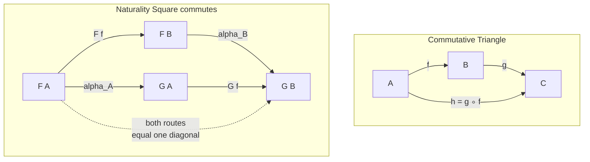

# 🔷 Diagrams and Commutativity

> [!abstract] TL;DR
> A **commutative diagram** is category theory's way of writing an *equation as a picture*: draw objects as nodes and morphisms as labelled arrows, and declare that the diagram **commutes** when **any two directed paths sharing the same start and end compose to the same morphism**. A commuting triangle `g ∘ f = h` and a commuting square are literally systems of equations rendered visually. Formally a diagram is a **functor from a shape (index) category into your category**, which is exactly why we can take limits *over* diagrams. Almost every categorical statement — products, limits, adjunctions, and especially **naturality** — reduces to "such-and-such diagram commutes," and the proof technique of **diagram chasing** deduces new equalities by walking arrows around known-commuting sub-pieces. Master diagrams and you have mastered the language of the subject.

---

## Intuition

**Analogy — the subway map that never lies.** Imagine a subway map with stations `A` and `B`. There may be a dozen routes between them — express, local, a transfer through `C` — but suppose the map guarantees one thing: *whichever route you ride, you step out at the exact same platform.* That guarantee is **commutativity**. The map is a *commutative diagram*: the stations are objects, each train line is a morphism, and "commutes" is the promise that **every path between two points delivers you to the identical destination**, so the route you pick never matters for where you end up.

Category theory writes its equations this way on purpose. Instead of the algebra `α_B ∘ F(f) = G(f) ∘ α_A` — a wall of composed symbols — it draws a square and says "this commutes." The picture makes the equation *visible and checkable*, and you prove theorems by **chasing** arrows around the diagram: start at one corner, follow a route, use the fact that a smaller sub-square already commutes, and land the equality you wanted. An equation you *see* is an equation you can reason about.

---

## How It Works

### What a diagram *is*

A **diagram** is a picture of some objects (drawn as nodes) and some morphisms between them (drawn as labelled arrows) inside a category `C`. It displays a *configuration of arrows* you care about — nothing more mysterious than a directed multigraph whose edges happen to be real morphisms.

The precise definition is deeper and pays off enormously: a **diagram of shape `J`** in `C` is a **functor** `D : J → C` from a small **index (shape) category** `J`. The shape `J` is a bare skeleton — "two objects and one arrow between them," or "a span `• ← • → •`," or "a square" — and the functor `D` *paints* that skeleton with actual objects and morphisms of `C`, preserving identities and composition. This is why **diagrams are functors**, and why it makes sense to speak of the **limit or colimit of a diagram**: a limit is a universal cone over the functor `D`, so limits are defined *over diagrams* because diagrams are precisely the functors you take limits of. (See the forthcoming sibling notes *Functors* and *Limits and Colimits*.)

### Commutativity: equations drawn as pictures

A diagram **commutes** when, for every pair of objects `X` and `Y`, **all directed paths from `X` to `Y` compose to one and the same morphism**. Two facts fall out immediately:

1. **A commuting triangle is the equation `g ∘ f = h`.** With `f : A → B`, `g : B → C`, and `h : A → C`, saying the triangle commutes *is* asserting `h = g ∘ f`. The picture and the equation are the same statement.
2. **A commuting square encodes `k ∘ f = g ∘ h`.** The two ways around the square — right-then-down versus down-then-right — must agree.

So commutativity is exactly *how category theory writes equations pictorially*: a diagram is a system of equations between composites, one equation per pair of parallel paths.

### Why diagrams beat formulas

Compose four or five arrows and the symbolic form `p ∘ o ∘ n ∘ m ∘ ℓ` becomes unreadable algebra with easy-to-lose bracketing. A diagram shows the whole configuration *at a glance*: objects sit in a layout, arrows point where they go, and each commuting cell is a checkable equation. This is why commutative diagrams are the **standard notation of modern mathematics** — they turn opaque strings of composites into a structure the eye can verify.

### Naturality — the single most important commuting square

A **natural transformation** `α : F ⇒ G` between functors `F, G : C → D` is *nothing but* a family of morphisms `α_X : F(X) → G(X)` such that for **every** morphism `f : X → Y` in `C`, the **naturality square commutes**:

`α_Y ∘ F(f) = G(f) ∘ α_X`.

That one square — "the transformation slides past every arrow the same way whether you map first or transform first" — is the most-drawn diagram in the whole subject. (See the sibling note *Natural Transformations*.)

### Universal properties = "unique arrow making the diagram commute"

Products, coproducts, limits, colimits, and adjunctions are all defined by a **universal property** phrased as a diagram: *for all* objects and arrows of some shape, *there exists a **unique** morphism* — drawn as a **dashed arrow** — *making the whole diagram commute*. The "dashed-arrow-exists-uniquely" pattern is the beating heart of the definition of a product `A × B`, of a limit, and of an adjunction. Commutative diagrams are literally the language in which universal properties are stated. (See the siblings *Universal Properties*, *Products and Coproducts*, *Limits and Colimits*.)

### Diagram chasing and pasting

**Diagram chasing** is the proof method: to show two composites are equal, or that an induced morphism exists, you *chase* elements (in a concrete category like abelian groups) or arrows around the diagram, invoking the commutativity of sub-diagrams to derive new equalities step by step. It is the workhorse of **homological algebra** — the **five lemma** and the **snake lemma** are proved almost entirely by chasing. The **pasting lemma** is its structural backbone: if two adjacent squares each commute, the outer **rectangle** obtained by gluing them commutes too, so big proofs assemble from small commuting tiles. (See the sibling *Abelian Categories and Homological Algebra*.)

### Reading conventions

- **Solid arrow** = given data; **dashed arrow** = the unique morphism *induced* by a universal property.
- **Hooked arrow** `↪` = monomorphism; **double-headed arrow** `↠` = epimorphism.
- A caption "for all `X`, there exists a unique `u` making the diagram commute" tells you which arrows are quantified and which is induced.



---

## Key Concepts

**Secondary (intuition first).**
- A commutative diagram is a "map where every route between two dots ends at the same dot."
- A **triangle** commuting means `h = g ∘ f`; a **square** commuting means the two ways around agree.
- Drawing beats writing: pictures make many-step equations readable.

**Undergraduate (working definitions).**
- A **diagram** is a configuration of objects and morphisms; two paths are **parallel** when they share source and target.
- **Commutes** = all parallel composite paths are *equal morphisms*.
- **Universal property**: an object characterised by a unique dashed arrow making a diagram commute (products, limits).
- **Naturality square**: `α_Y ∘ F(f) = G(f) ∘ α_X` for all `f`.
- Composition is associative and identities are units, so any *sub-path* can be replaced by its composite when chasing.

**Graduate (structural view).**
- A diagram of shape `J` is a **functor** `D : J → C`; the diagram commutes iff `D` is *well-defined on the quotient of `J` by the imposed relations* (the "walking equation" as a presented category).
- Commutativity is a set of **coherence equations**; a **limit** is a terminal cone over `D`, a **colimit** an initial cocone — these exist because diagrams are functors.
- **Diagram chasing** in an abelian category is legitimised by the embedding theorems (Freyd–Mitchell), so element-chasing arguments transfer to arrow-theoretic proofs; **pasting** is functoriality of composition of 2-cells.
- **String diagrams** are the Poincaré-dual 2D calculus for monoidal categories: objects become wires, morphisms become boxes, and commuting relations become planar isotopies. (See the sibling *String Diagrams and Graphical Calculus*.)

---

## Python Demo

A **commutativity checker** for finite categories. We represent a diagram as objects, labelled morphisms (edges), and a **composition table**. The checker enumerates *all directed paths* between each pair of objects, composes each path with the table, and verifies that **all parallel paths yield the same morphism**. We run it on a **commuting** naturality-style square and a **non-commuting** one, report the offending paths, and visualise both with matplotlib.

```python
# Commutativity checker for finite categories + matplotlib visualization.
# Pure standard library for the algorithm; matplotlib only for the picture.
from collections import defaultdict
import matplotlib.pyplot as plt


class FiniteCategory:
    """Objects, labelled morphisms (edges), and a composition table.

    comp[(g, f)] = name of  g ∘ f   where  f: A->B  and  g: B->C.
    A path [m1, m2, ...] is applied left-to-right (m1 first), so its
    composite is  ... ∘ m2 ∘ m1.
    """

    def __init__(self):
        self.objects = set()
        self.edges = []          # list of (morphism_name, source, target)
        self.comp = {}           # (later, earlier) -> composite_name

    def add_object(self, o):
        self.objects.add(o)

    def add_morphism(self, name, src, tgt):
        self.objects.update([src, tgt])
        self.edges.append((name, src, tgt))

    def set_composite(self, earlier, later, result):
        # result names the morphism  later ∘ earlier
        self.comp[(later, earlier)] = result

    def compose_path(self, path):
        """Fold a path of edge names into a single morphism name."""
        acc = path[0]
        for m in path[1:]:
            key = (m, acc)
            if key not in self.comp:
                raise KeyError(f"composite {m} ∘ {acc} is undefined")
            acc = self.comp[key]
        return acc


def all_simple_paths(edges, src, tgt):
    """Every simple directed path (list of edge names) from src to tgt."""
    adj = defaultdict(list)
    for name, s, t in edges:
        adj[s].append((name, t))
    results = []

    def dfs(node, visited, path):
        if node == tgt and path:
            results.append(list(path))
        for name, nxt in adj[node]:
            if nxt not in visited:
                visited.add(nxt)
                path.append(name)
                dfs(nxt, visited, path)
                path.pop()
                visited.remove(nxt)

    dfs(src, {src}, [])
    return results


def check_commutes(cat):
    """Return (commutes?, list of violations). A violation is a pair of
    parallel paths whose composites differ."""
    commutes = True
    violations = []
    for src in sorted(cat.objects):
        for tgt in sorted(cat.objects):
            paths = all_simple_paths(cat.edges, src, tgt)
            if len(paths) < 2:
                continue                     # nothing to compare
            buckets = defaultdict(list)
            for p in paths:
                buckets[cat.compose_path(p)].append(p)
            if len(buckets) > 1:             # paths disagreed
                commutes = False
                violations.append((src, tgt, dict(buckets)))
    return commutes, violations


def build_square(commuting):
    """Naturality-style square  F A -> F B -> G B  vs  F A -> G A -> G B."""
    cat = FiniteCategory()
    cat.add_morphism("F f", "FA", "FB")      # top
    cat.add_morphism("alpha_B", "FB", "GB")  # right
    cat.add_morphism("alpha_A", "FA", "GA")  # left
    cat.add_morphism("G f", "GA", "GB")      # bottom
    if commuting:
        cat.set_composite("F f", "alpha_B", "diag")   # alpha_B ∘ F f
        cat.set_composite("alpha_A", "G f", "diag")   # G f ∘ alpha_A
    else:
        cat.set_composite("F f", "alpha_B", "diag_1")
        cat.set_composite("alpha_A", "G f", "diag_2")
    return cat


def report(name, cat):
    ok, violations = check_commutes(cat)
    verdict = "COMMUTES" if ok else "DOES NOT COMMUTE"
    print(f"[{name}] {verdict}")
    for src, tgt, buckets in violations:
        print(f"  paths {src} -> {tgt} disagree:")
        for composite, paths in buckets.items():
            for p in paths:
                print(f"    {' ; '.join(p):26s} = {composite}")
    print()
    return ok


def draw_square(ax, commuting, title_ok):
    pos = {"FA": (0, 1), "FB": (1, 1), "GA": (0, 0), "GB": (1, 0)}
    labels = {"FA": "F A", "FB": "F B", "GA": "G A", "GB": "G B"}
    edges = [("FA", "FB", "F f", "tab:blue"),
             ("FB", "GB", "alpha_B", "tab:blue"),
             ("FA", "GA", "alpha_A", "tab:orange"),
             ("GA", "GB", "G f", "tab:orange")]
    for s, t, lab, col in edges:
        (x0, y0), (x1, y1) = pos[s], pos[t]
        ax.annotate("", xy=(x1, y1), xytext=(x0, y0),
                    arrowprops=dict(arrowstyle="-|>", color=col, lw=2.2,
                                    shrinkA=16, shrinkB=16))
        ax.text((x0 + x1) / 2, (y0 + y1) / 2, lab, color=col, fontsize=10,
                ha="center", va="center",
                bbox=dict(boxstyle="round,pad=0.2", fc="white", ec="none"))
    for n, (x, y) in pos.items():
        ax.scatter([x], [y], s=900, color="white", edgecolors="black", zorder=3)
        ax.text(x, y, labels[n], ha="center", va="center", fontsize=11, zorder=4)
    if commuting:
        center_txt = "top->right = diag\nleft->bottom = diag\nEQUAL"
        color = "green"
        head = "commutes"
    else:
        center_txt = "top->right = diag_1\nleft->bottom = diag_2\nDIFFERENT"
        color = "crimson"
        head = "does not commute"
    ax.text(0.5, 0.5, center_txt, ha="center", va="center", fontsize=9,
            color=color, transform=ax.transAxes)
    ax.set_title(f"{'commuting' if commuting else 'broken'} square\n({head})",
                 color=color, fontsize=11)
    ax.set_xlim(-0.4, 1.4)
    ax.set_ylim(-0.4, 1.4)
    ax.axis("off")


if __name__ == "__main__":
    good = build_square(commuting=True)
    bad = build_square(commuting=False)
    report("naturality square", good)      # -> COMMUTES
    report("broken square", bad)           # -> DOES NOT COMMUTE, prints paths

    fig, axes = plt.subplots(1, 2, figsize=(9, 4.5))
    draw_square(axes[0], commuting=True, title_ok=True)
    draw_square(axes[1], commuting=False, title_ok=False)
    fig.suptitle("Commutativity check: parallel paths must agree", fontsize=12)
    fig.tight_layout()
    fig.savefig("commuting_vs_noncommuting.png", dpi=120)
    print("saved commuting_vs_noncommuting.png")
```

Expected console output:

```
[naturality square] COMMUTES

[broken square] DOES NOT COMMUTE
  paths FA -> GB disagree:
    F f ; alpha_B             = diag_1
    alpha_A ; G f             = diag_2
```

The algorithm is the literal definition: enumerate parallel paths, compose each, and demand a single composite. The picture makes the disagreement visible — the two coloured routes around the broken square land on `diag_1` and `diag_2` instead of one shared diagonal.

---

## Real-World Applications

> **Example — functor and monad laws in production functional code.** Libraries such as Haskell's `base`, Scala's Cats, and Rust's iterator adapters must obey the **functor laws** `map(id) = id` and `map(g) ∘ map(f) = map(g ∘ f)`. That second law is a **commuting square**, and it is precisely the **map-fusion** optimisation a compiler performs: two traversals collapse into one. The **monad laws** (left identity, right identity, associativity) are likewise commuting diagrams; a rewrite engine that fuses `flatMap` chains is *chasing* those diagrams. See `[[Monads_and_Effects]]` and `[[Functional_Programming_Foundations]]`.

- **Homological algebra & topology.** The five lemma and snake lemma — the tools behind long exact sequences in (co)homology — are proved by diagram chasing; their conclusions are "this induced arrow exists and this square commutes."
- **Database migration correctness.** A schema migration is correct when the "migrate then query" path equals the "query then migrate" path — a commuting square over the migration functor. Data-integration and lens/`view-update` frameworks are stated exactly this way.
- **Compiler & refactoring correctness.** A semantics-preserving transformation says "compile-then-run equals refactor-then-compile-then-run," a commuting square linking syntax and semantics; this is the diagrammatic face of program equivalence in `[[Contextual_Equivalence_and_Reasoning]]`.
- **Concurrency & string diagrams.** Monoidal-category string diagrams (Petri nets, quantum circuits in the ZX-calculus) reduce equational reasoning about parallel processes to planar diagram rewriting.

---

## Common Pitfalls

- **Assuming a drawn diagram commutes.** Drawing arrows only *displays* a configuration; commutativity is an *extra assertion* you must state or prove. A diagram with two parallel paths is silent about equality until you say "this commutes."
- **Confusing "there is a path" with "the diagram commutes."** Existence of a route between objects says nothing; commutativity is about *all parallel routes agreeing*. The checker only compares pairs where two or more parallel paths exist.
- **Ignoring the direction of composition.** `g ∘ f` means "`f` first, then `g`." Writing the composite of a left-to-right path in the wrong order flips the equation and breaks the chase.
- **Treating the dashed arrow as given.** In a universal property the dashed arrow is *concluded* (exists uniquely), not assumed. Beginners often draw it as input data and lose the whole content of the definition.
- **Chasing a sub-diagram that was never shown to commute.** Diagram chasing is only valid when each sub-piece you rely on is itself known to commute — the pasting lemma needs *both* inner squares to commute before the outer rectangle does.
- **Forgetting naturality is "for all `f`."** A single commuting square does not make a transformation natural; the square must commute for *every* morphism `f` in the source category.

---

## Related Concepts

- [[Category_Theory]] — the parent overview: objects, morphisms, functors, and natural transformations, all of which this note renders as commuting diagrams.
- [[Monads_and_Effects]] — functor and monad *laws* are commuting squares; fusion optimisations are diagram chasing in disguise.
- [[Functional_Programming_Foundations]] — `map`/`fold` laws and referential transparency are exactly "these two computation paths agree," i.e. commuting diagrams over programs.
- [[Contextual_Equivalence_and_Reasoning]] — program-equivalence proofs and semantics-preserving refactorings are commuting squares linking syntax and behaviour.

*Forthcoming sibling notes in this vault (referenced above): Categories, Objects and Morphisms; Functors; Natural Transformations; Universal Properties; Products and Coproducts; Limits and Colimits; Abelian Categories and Homological Algebra; String Diagrams and Graphical Calculus.*

---

## Review Questions

1. **Conceptual.** Explain why a commuting triangle with `f : A → B`, `g : B → C`, `h : A → C` is *the same statement* as the equation `h = g ∘ f`. What does the phrase "the diagram commutes" add beyond drawing the three arrows?
2. **Scenario.** You are given two functors `F, G : C → D` and a family of morphisms `α_X : F(X) → G(X)`. You check the naturality square for one specific morphism and it commutes. A colleague concludes `α` is a natural transformation. Why is that conclusion premature, and exactly what must you verify?
3. **Trade-off / structural.** A limit is defined "over a diagram," and we say diagrams *are* functors `D : J → C`. Explain how the functorial view justifies taking limits over diagrams, and contrast diagrammatic (commuting-square) reasoning with raw symbolic manipulation of composites — when does each pay off, and what does diagram chasing buy you in a proof like the five lemma?

---

## Sources

- Saunders Mac Lane, *Categories for the Working Mathematician*, 2nd ed. (Springer, 1998) — diagrams, commutativity, naturality, and limits as cones over diagrams.
- Emily Riehl, *Category Theory in Context* (Dover, 2016) — freely available; commutative diagrams, functorial diagrams of shape `J`, and universal properties.
- Tom Leinster, *Basic Category Theory* (Cambridge University Press, 2014; arXiv:1612.09375) — accessible treatment of diagrams, naturality squares, and limits.
- Bartosz Milewski, *Category Theory for Programmers* (2019) — functor/monad laws as commuting diagrams with running code.
- nLab, "commutative diagram" and "diagram" entries (ncatlab.org) — the functor-from-shape-category definition and diagram-chasing conventions.

---

#category-theory #commutative-diagram #diagram-chasing #equations #naturality
