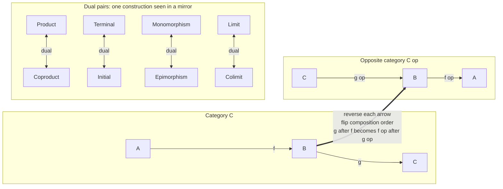

# 🪞 Duality and the Opposite Category

> [!abstract] TL;DR
> Reverse every arrow in a category $\mathcal{C}$ and you get its mirror image, the **opposite category** $\mathcal{C}^{\mathrm{op}}$ — same objects, every morphism $f\colon A \to B$ flipped to $f\colon B \to A$, and composition order reversed so that $(g \circ f)^{\mathrm{op}} = f^{\mathrm{op}} \circ g^{\mathrm{op}}$. The payoff is the **duality principle**: any theorem true in *all* categories stays true after you reverse every arrow, so proving one statement gives you its dual **for free**. This single trick pairs up half of category theory — product with coproduct, terminal with initial, limit with colimit, mono with epi — and is the reason the "co-" prefix exists.

---

## Intuition

**Analogy:** Hold any wiring diagram of one-way streets up to a mirror. Every street still connects the same two towns, but now runs the *other way*. That mirror image is the **opposite category**. Here is the magic: the laws of traffic are symmetric, so any true statement about the original road map — "there is exactly one town you can reach from everywhere" — becomes an equally true statement about the mirror — "there is exactly one town you can *leave* to reach everywhere." You proved a fact about towns-you-drive-*into* and got a free fact about towns-you-drive-*out-of*, without any new work.

In categorical terms: forget what objects *are* and remember only the arrows between them. If you systematically reverse all those arrows, every construction turns into its dual counterpart. A **product** (an object everything projects *out of*) becomes a **coproduct** (an object everything injects *into*); a **terminal** object (one arrow in from each object) becomes an **initial** object (one arrow out to each object); an **injection**-flavoured monomorphism becomes a **surjection**-flavoured epimorphism. You buy one concept and get its dual free. That is why so much of the subject comes in matched "X / co-X" pairs.

---

## How It Works

### Core Mechanics

Given any category $\mathcal{C}$ with objects, morphisms, identities, and composition, the **opposite (or dual) category** $\mathcal{C}^{\mathrm{op}}$ is defined by three moves:

1. **Same objects.** $\mathrm{ob}(\mathcal{C}^{\mathrm{op}}) = \mathrm{ob}(\mathcal{C})$. Nothing is added or removed. This is the point beginners miss — $\mathcal{C}^{\mathrm{op}}$ is not a "bigger" category, it is the *same dots* with the arrows turned around.
2. **Reverse every morphism.** For each $f\colon A \to B$ in $\mathcal{C}$ there is exactly one morphism, written $f^{\mathrm{op}}\colon B \to A$, in $\mathcal{C}^{\mathrm{op}}$. So $\mathrm{Hom}_{\mathcal{C}^{\mathrm{op}}}(A,B) = \mathrm{Hom}_{\mathcal{C}}(B,A)$.
3. **Reverse composition order.** If $g \circ f$ is defined in $\mathcal{C}$ (so $f\colon A\to B$, $g\colon B\to C$), then in $\mathcal{C}^{\mathrm{op}}$ we set
$$f^{\mathrm{op}} \circ_{\mathrm{op}} g^{\mathrm{op}} \;=\; (g \circ f)^{\mathrm{op}}, \qquad\text{equivalently}\qquad (g \circ f)^{\mathrm{op}} = f^{\mathrm{op}} \circ g^{\mathrm{op}}.$$
Identities are unchanged: $(\mathrm{id}_A)^{\mathrm{op}} = \mathrm{id}_A$.

**$\mathcal{C}^{\mathrm{op}}$ is a genuine category.** Associativity and the identity laws hold because they are *symmetric* statements about composition — reversing the order of a chain of composable arrows preserves associativity. And applying the construction twice restores the original exactly:
$$(\mathcal{C}^{\mathrm{op}})^{\mathrm{op}} = \mathcal{C}.$$
Reversing arrows is an involution, just like flipping a mirror image back through the mirror.

**The duality principle.** Because $\mathcal{C}^{\mathrm{op}}$ is always a valid category, any statement $S$ provable for *every* category is provable for $\mathcal{C}^{\mathrm{op}}$ too. Translate that back into statements about $\mathcal{C}$ and you get the **dual statement** $S^{\mathrm{op}}$: take $S$, reverse every arrow, and swap the order of every composite. If $S$ is a theorem of category theory, so is $S^{\mathrm{op}}$ — with a proof obtained mechanically by dualizing the original proof. One theorem, two results.

**The dual dictionary.** Dualizing definitions produces a systematic pairing. The "co-" prefix literally *means* "the dual of":

| Concept in $\mathcal{C}$ | Dual concept in $\mathcal{C}^{\mathrm{op}}$ | Rough intuition |
|---|---|---|
| Product $A \times B$ | Coproduct $A + B$ | "and / tuple" vs "or / tagged union" |
| Terminal object $1$ | Initial object $0$ | one arrow *in* from all vs one arrow *out* to all |
| Limit | Colimit | universal cone *over* vs universal cocone *under* |
| Monomorphism | Epimorphism | left-cancellable (injective-like) vs right-cancellable (surjective-like) |
| Pullback | Pushout | glue over a shared target vs glue over a shared source |
| Equalizer | Coequalizer | subobject where $f=g$ vs quotient forcing $f=g$ |
| Kernel | Cokernel | ker of a map vs coker of a map |
| Projective object | Injective object | lifting vs extension |

Every universal construction has a dual, obtained by the same reflex.

### Flow / Architecture



---

## Key Concepts

### Secondary — the mirror reflex

- **Flip the arrows.** $\mathcal{C}^{\mathrm{op}}$ keeps every object and turns every arrow around. That is the whole construction.
- **Free second theorem.** Whatever you prove about arrows-going-*in*, you also get for arrows-going-*out*. Prove once, harvest twice.
- **The "co-" habit.** When you meet a new word starting with "co-" (coproduct, colimit, cokernel, coequalizer), read it as "the arrow-reversed version of the thing without the co-."
- **Product vs sum.** A product is the "both / record" object; its dual, the coproduct, is the "either / choice" object. Same pattern, mirror image.

### Undergraduate — the formal machinery

- **Definition of $\mathcal{C}^{\mathrm{op}}$.** Objects unchanged; $\mathrm{Hom}_{\mathcal{C}^{\mathrm{op}}}(A,B) = \mathrm{Hom}_{\mathcal{C}}(B,A)$; composition $f \circ_{\mathrm{op}} g := g \circ f$; identities unchanged. Verify the axioms and confirm $(\mathcal{C}^{\mathrm{op}})^{\mathrm{op}} = \mathcal{C}$.
- **Dualizing a definition.** Terminal object: an object $1$ such that for every $X$ there is a *unique* $X \to 1$. Reverse the arrow: initial object $0$ has a unique $0 \to X$ for every $X$. These are the *same definition read in $\mathcal{C}^{\mathrm{op}}$*.
- **Mono / epi as dual cancellation.** $m$ is **monic** iff $m \circ f = m \circ g \Rightarrow f = g$ (left-cancellable, "injective-like"). Reverse everything and you get **epic**: $f \circ e = g \circ e \Rightarrow f = g$ (right-cancellable, "surjective-like"). In $\mathbf{Set}$ these really are injective and surjective functions.
- **Contravariance is just $\mathcal{C}^{\mathrm{op}}$.** A **contravariant functor** on $\mathcal{C}$ — one that reverses arrows, sending $f\colon A\to B$ to $F(f)\colon F(B)\to F(A)$ — is *exactly* an ordinary covariant functor $F\colon \mathcal{C}^{\mathrm{op}} \to \mathcal{D}$. The opposite category is the clean bookkeeping device that turns every arrow-reversing construction back into a normal functor.
- **The hom-into functor.** $\mathrm{Hom}(-, X)\colon \mathcal{C}^{\mathrm{op}} \to \mathbf{Set}$ is the canonical contravariant example: precomposition by $f\colon A\to B$ sends a map $B\to X$ to a map $A\to X$, reversing direction. The dual-space functor $V \mapsto V^{*}$ on vector spaces is the same idea.

### Graduate — duality as a structural theorem

- **Presheaves.** A **presheaf** on $\mathcal{C}$ is a functor $\mathcal{C}^{\mathrm{op}} \to \mathbf{Set}$ — i.e. a *contravariant* set-valued functor. The opposite category is not optional here; it is baked into the definition, and the Yoneda embedding $\mathcal{C} \hookrightarrow [\mathcal{C}^{\mathrm{op}}, \mathbf{Set}]$, $X \mapsto \mathrm{Hom}(-,X)$, lives entirely in this presheaf world. Getting the variance backwards breaks the Yoneda story.
- **Self-dual notions.** Some definitions equal their own dual. **Isomorphism** is self-dual: $f$ is iso in $\mathcal{C}$ iff $f^{\mathrm{op}}$ is iso in $\mathcal{C}^{\mathrm{op}}$. A **zero object** (both terminal and initial) is self-dual. A **biproduct** (product and coproduct coinciding) is self-dual.
- **Self-dual categories.** A category can be *equivalent to its own opposite*, $\mathcal{C} \simeq \mathcal{C}^{\mathrm{op}}$. The axioms of an **abelian category** are self-dual (kernels dualize to cokernels, monos to epis), which is precisely why homological algebra proofs so often come in matched pairs — dualize the diagram and the argument transfers. Finite-dimensional $\mathbf{Vect}_k$ is equivalent to its opposite via $V \mapsto V^{*}$, mirroring the finite-dimensional isomorphism $V \cong V^{**}$ that echoes $(\mathcal{C}^{\mathrm{op}})^{\mathrm{op}} = \mathcal{C}$.
- **Concrete dualities as equivalences $\mathcal{C} \simeq \mathcal{D}^{\mathrm{op}}$.** Many famous "duality theorems" in mathematics are exactly an equivalence between one category and the *opposite* of another, which is what makes two different-looking fields secretly the same:
  - **Stone duality:** Boolean algebras $\simeq$ (Stone spaces)$^{\mathrm{op}}$ — logic ↔ topology.
  - **Gelfand duality:** commutative $C^{*}$-algebras $\simeq$ (compact Hausdorff spaces)$^{\mathrm{op}}$ — algebra ↔ geometry, the foundation of "noncommutative geometry."
  - **Pontryagin duality:** locally compact abelian groups form a category anti-equivalent to itself via the dual-group functor — the abstract home of the Fourier transform.
  - **Grothendieck's algebra–geometry duality:** commutative rings $\simeq$ (affine schemes)$^{\mathrm{op}}$; a ring homomorphism *is* a map of spaces run backwards, which is why "geometry is opposite to algebra."
- **Dualizing a proof.** To dualize a theorem you reverse every arrow, swap every composite's order, and replace each concept by its dual (product $\to$ coproduct, mono $\to$ epi, and so on). The *structure* of the argument is untouched; only the direction changes. This is a genuine metatheorem, not a heuristic.

---

## Python Demo

```python
"""
Duality and the Opposite Category — runnable demonstration.

We build a small FINITE category C (the chain poset 0 <= 1 <= 2), construct
its OPPOSITE C^op by reversing every morphism's source/target and flipping
composition order, then:
  1. verify C^op satisfies the category axioms,
  2. verify the double-opposite (C^op)^op == C,
  3. show a TERMINAL object in C becomes an INITIAL object in C^op (duality),
  4. draw C and C^op side by side with every arrow reversed (matplotlib).

Pure standard library + matplotlib. No numpy required.
"""

from itertools import product
import matplotlib.pyplot as plt

# --- Define a finite category C: the chain poset 0 <= 1 <= 2 ----------------
# In a poset-as-category there is exactly ONE morphism x -> y whenever x <= y.
# We name that morphism "x->y". The x->x morphisms are the identities.
OBJECTS = ["0", "1", "2"]
LEQ = [("0", "0"), ("1", "1"), ("2", "2"),        # identities
       ("0", "1"), ("1", "2"), ("0", "2")]        # strict order arrows


class Category:
    """A finite category: objects, named morphisms, and a composition rule."""

    def __init__(self, name, objects, morphisms, comp):
        self.name = name
        self.objects = list(objects)
        self.morphisms = dict(morphisms)   # name -> (source, target)
        self._comp = comp                  # (self, g, f) -> name or None

    def src(self, m):
        return self.morphisms[m][0]

    def tgt(self, m):
        return self.morphisms[m][1]

    def compose(self, g, f):
        """Return the name of 'g after f', or None if not composable."""
        if self.tgt(f) != self.src(g):
            return None
        return self._comp(self, g, f)

    def identity(self, x):
        for m, (s, t) in self.morphisms.items():
            if s == x and t == x:
                return m
        return None


def poset_compose(cat, g, f):
    # In a poset there is a unique morphism src(f) -> tgt(g); find its name.
    s, t = cat.src(f), cat.tgt(g)
    for m, (ms, mt) in cat.morphisms.items():
        if ms == s and mt == t:
            return m
    return None


def opposite(cat):
    """Build C^op: same objects, every morphism reversed, composition flipped."""
    op_morphisms = {m: (t, s) for m, (s, t) in cat.morphisms.items()}

    def op_comp(_opcat, g, f):
        # Composition in the opposite is composition in the ORIGINAL with the
        # two arrows swapped:  (g o f)_op  ==  f_op o g_op.
        return cat.compose(f, g)

    return Category(cat.name + "^op", cat.objects, op_morphisms, op_comp)


def hom(cat, a, b):
    return [m for m in cat.morphisms if cat.src(m) == a and cat.tgt(m) == b]


def is_valid_category(cat):
    """Check identities, unit laws, and associativity of composition."""
    mors = list(cat.morphisms)
    for x in cat.objects:                                  # identities exist
        if cat.identity(x) is None:
            return False, f"no identity on {x}"
    for f in mors:                                         # unit laws
        if cat.compose(cat.identity(cat.tgt(f)), f) != f:
            return False, f"left-unit law fails on {f}"
        if cat.compose(f, cat.identity(cat.src(f))) != f:
            return False, f"right-unit law fails on {f}"
    for h, g, f in product(mors, repeat=3):               # associativity
        gf, hg = cat.compose(g, f), cat.compose(h, g)
        if gf is not None and hg is not None:
            if cat.compose(h, gf) != cat.compose(hg, f):
                return False, f"associativity fails at {h},{g},{f}"
    return True, "all category axioms hold"


def same_category(a, b):
    return set(a.objects) == set(b.objects) and a.morphisms == b.morphisms


def find_terminal(cat):
    # Terminal: exactly one arrow x -> t from EVERY object x.
    for t in cat.objects:
        if all(len(hom(cat, x, t)) == 1 for x in cat.objects):
            return t
    return None


def find_initial(cat):
    # Initial: exactly one arrow i -> x to EVERY object x (the dual property).
    for i in cat.objects:
        if all(len(hom(cat, i, x)) == 1 for x in cat.objects):
            return i
    return None


# --- Build C, its opposite, and the double opposite ------------------------
morphs = {f"{a}->{b}": (a, b) for (a, b) in LEQ}
C = Category("C", OBJECTS, morphs, poset_compose)
Cop = opposite(C)
Copop = opposite(Cop)

print("C   morphisms:", sorted(C.morphisms))
print("Cop morphisms:", {m: Cop.morphisms[m] for m in sorted(Cop.morphisms)})
print("C   is a valid category:", is_valid_category(C))
print("Cop is a valid category:", is_valid_category(Cop))
print("(C^op)^op == C          :", same_category(Copop, C))

# Composition really is reversed: 'b after a' in C is '0->2'; in the double
# opposite we recover the same composite.
print("compose(1->2, 0->1) in C      :", C.compose("1->2", "0->1"))
print("compose(1->2, 0->1) in (Cop)op:", Copop.compose("1->2", "0->1"))

# --- Duality in action: terminal <-> initial -------------------------------
tC, iC = find_terminal(C), find_initial(C)
tOp, iOp = find_terminal(Cop), find_initial(Cop)
print("terminal(C)  =", tC, "  initial(C)  =", iC)
print("terminal(Cop)=", tOp, "  initial(Cop)=", iOp)
print("DUALITY holds: terminal(C) == initial(C^op)?", tC == iOp)
print("DUALITY holds: initial(C)  == terminal(C^op)?", iC == tOp)

# --- Visualize C and C^op side by side (arrows reversed) -------------------
def draw(ax, cat, title, terminal, initial):
    pos = {"0": (0.0, 0.0), "1": (0.0, 1.4), "2": (0.0, 2.8)}
    for x, (px, py) in pos.items():
        color = ("#16a34a" if x == terminal else
                 "#f59e0b" if x == initial else "#2563eb")
        ax.scatter([px], [py], s=1700, c=color, zorder=3, edgecolors="black")
        ax.text(px, py, x, ha="center", va="center", color="white",
                fontsize=15, fontweight="bold", zorder=4)
    for m, (s, t) in cat.morphisms.items():
        if s == t:
            continue                                  # skip identity loops
        (x0, y0), (x1, y1) = pos[s], pos[t]
        rad = 0.42 if abs(y1 - y0) > 1.5 else 0.0     # curve the long 0-2 arrow
        ax.annotate("", xy=(x1, y1), xytext=(x0, y0),
                    arrowprops=dict(arrowstyle="-|>", color="#334155", lw=2.2,
                                    shrinkA=24, shrinkB=24,
                                    connectionstyle=f"arc3,rad={rad}"))
    ax.set_title(title, fontsize=11, fontweight="bold")
    ax.set_xlim(-1.3, 1.3)
    ax.set_ylim(-0.8, 3.6)
    ax.axis("off")


fig, axes = plt.subplots(1, 2, figsize=(9, 5))
draw(axes[0], C, "Category C   arrows go up  0 -> 1 -> 2", tC, iC)
draw(axes[1], Cop, "Opposite C^op   every arrow reversed", tOp, iOp)
fig.suptitle("green = terminal (all arrows IN)   orange = initial (all arrows OUT)",
             fontsize=10)
plt.tight_layout()
plt.savefig("opposite_category.png", dpi=120, bbox_inches="tight")
print("saved opposite_category.png")
```

Running it prints that both `C` and `C^op` satisfy the axioms, that `(C^op)^op == C`, and the punchline of duality: the **terminal** object `2` of `C` (everything maps *into* it) is exactly the **initial** object of `C^op` (everything maps *out of* it), and vice versa. The figure shows the same three dots with the arrows flipped.

---

## Real-World Applications

> **Example — sum types in every modern language:** In a programming language's type system (the category of types and functions), the **product** is the record/tuple/struct `(A, B)` and its **dual, the coproduct**, is the sum type — Rust `enum`, Haskell `Either`, TypeScript union, Swift `enum` with associated values. Pattern matching on a sum type is literally the universal property of the coproduct: to define a function *out of* `A + B` you give one function out of `A` and one out of `B`. Records and sums are not two unrelated features; they are one categorical idea seen in a mirror.

- **Data vs codata / call-by-value vs call-by-name.** In programming-language theory, products/records (data, defined by *constructors*) are dual to sums/objects (codata, defined by *observations*), and evaluation strategies exhibit a matching polarity duality (Filinski, Wadler's "call-by-value is dual to call-by-name"). Reasoning about one side transfers to the other by dualizing.
- **Logic and De Morgan.** In a Boolean lattice viewed as a category, AND is dual to OR and $\top$ is dual to $\bot$; De Morgan's laws are the arrow-reversing symmetry, and Stone duality upgrades this into a full equivalence between Boolean algebras and topological spaces — the backbone of semantics for logic and model checking.
- **Functional analysis and physics.** Gelfand duality (commutative $C^{*}$-algebras vs compact spaces) and Pontryagin duality (the abstract Fourier transform) let analysts and physicists move a hard problem into the dual world where it is easier, then transport the answer back.
- **Algebraic geometry.** Grothendieck's identification of commutative rings with the *opposite* of affine schemes means every geometric statement has an algebraic shadow and vice versa; whole proofs are ported across the duality.
- **Databases.** A schema is a category and data migration functors have adjoints; querying and co-querying, joins and their duals, are read off by reversing arrows.

---

## Common Pitfalls

- **Thinking $\mathcal{C}^{\mathrm{op}}$ has new objects.** It does not — same objects, only arrows reversed. If you find yourself "adding" objects to build the opposite, you have misread the definition.
- **Forgetting to reverse composition order.** The rule is $(g \circ f)^{\mathrm{op}} = f^{\mathrm{op}} \circ g^{\mathrm{op}}$, *not* $g^{\mathrm{op}} \circ f^{\mathrm{op}}$. Dropping the swap makes composition ill-typed and quietly breaks every downstream proof.
- **Confusing "dual" with "inverse" or "negation."** Duality is a purely formal arrow-reversal on the whole theory, not the opposite/negation of a single statement and not an inverse morphism. The dual of "product" is "coproduct," which need not be related to a product at all in a given category.
- **Assuming a category equals its opposite.** Duality gives you a free *theorem*, but $\mathcal{C}$ and $\mathcal{C}^{\mathrm{op}}$ are usually different categories — $\mathbf{Set}$ is **not** equivalent to $\mathbf{Set}^{\mathrm{op}}$. Self-duality (abelian categories, finite-dimensional $\mathbf{Vect}$) is a special, provable property, not a default.
- **Getting presheaf variance backwards.** Presheaves are functors $\mathcal{C}^{\mathrm{op}} \to \mathbf{Set}$ (contravariant). Writing them as $\mathcal{C} \to \mathbf{Set}$ inverts every naturality square and derails the Yoneda embedding.
- **Assuming the dual is always different.** Some notions are self-dual (isomorphism, zero object, biproduct). Dualizing them changes nothing — recognizing this saves wasted effort.

---

## Related Concepts

*Sibling notes planned for this `Category_Theory/` vault — Categories_Objects_and_Morphisms, Products_and_Coproducts, Limits_and_Colimits, Terminal_Initial_and_Zero_Objects, Isomorphisms_and_Special_Morphisms, Functors, Universal_Properties, Presheaves_and_Representables, The_Yoneda_Lemma, Abelian_Categories_and_Homological_Algebra, Category_Theory_in_Programming — are referenced by name above and should be wikilinked once created.*

Verified links in this vault:

- [[Category_Theory]] — the parent survey note; defines categories, functors, natural transformations, and Yoneda that this note dualizes.
- [[Logical_Connectives_and_Boolean_Algebra]] — De Morgan duality and the AND/OR, $\top$/$\bot$ symmetry are the propositional shadow of categorical duality; Stone duality upgrades it to an equivalence.
- [[Mathematical_Logic_and_Set_Theory]] — categorical logic, toposes, and Stone-style dualities between syntax and semantics.
- [[Set_Theory_and_Relations]] — $\mathbf{Set}$ is the target of presheaves $\mathcal{C}^{\mathrm{op}}\to\mathbf{Set}$; the running example category is a poset (a special relation).
- [[Vectors_and_Vector_Spaces]] — the dual space $V^{*}$ is the archetypal contravariant construction; $V \cong V^{**}$ in finite dimensions mirrors $(\mathcal{C}^{\mathrm{op}})^{\mathrm{op}} = \mathcal{C}$.
- [[Banach_Spaces]] / [[Hilbert_Spaces]] — continuous dual spaces and adjoint operators are analytic incarnations of arrow reversal.
- [[Topological_Spaces]] — Stone and Gelfand dualities relate algebraic categories to categories of spaces via $\mathcal{C} \simeq \mathcal{D}^{\mathrm{op}}$.
- [[Rings_and_Ideals]] / [[Groups_and_Subgroups]] — abelian groups and modules form self-dual abelian categories; commutative rings are the opposite of affine schemes.
- [[Algebraic_Geometry]] — Grothendieck's algebra–geometry duality (rings vs affine schemes) is the flagship example of an equivalence with an opposite category.

---

## Review Questions

1. **(Conceptual)** State precisely what changes and what stays the same when you pass from $\mathcal{C}$ to $\mathcal{C}^{\mathrm{op}}$, and explain why $(\mathcal{C}^{\mathrm{op}})^{\mathrm{op}} = \mathcal{C}$. Why does the identity law for $\mathcal{C}^{\mathrm{op}}$ follow "for free" from the identity law for $\mathcal{C}$?
2. **(Scenario)** You have just proved: "In any category, if a product $A \times B$ exists it is unique up to unique isomorphism." Without re-proving anything, write down the dual theorem and name the object it concerns. What single mechanical operation converts your original proof into the proof of the dual?
3. **(Trade-off / synthesis)** A colleague claims "duality means every category is the same as its opposite, so terminal and initial objects always coincide." Identify the two distinct errors in this claim, give a category where terminal and initial objects differ, and give a (non-trivial) category that genuinely *is* equivalent to its own opposite.

---

## Sources

- Emily Riehl, *Category Theory in Context* (2016), §1.2 (duality) and §3.1 — free from the author's site.
- Saunders Mac Lane, *Categories for the Working Mathematician* (2nd ed., 1998), §II.1 "The duality principle."
- Steve Awodey, *Category Theory* (2nd ed., 2010), §3.1 "Duality" and Ch. 2 on the opposite category.
- Tom Leinster, *Basic Category Theory* (2014), §1.3 and the "duality" discussion — arXiv:1612.09375.
- nLab, "opposite category" and "duality" — https://ncatlab.org/nlab/show/opposite+category

---

#category-theory #duality #opposite-category #dual-concepts #self-duality
