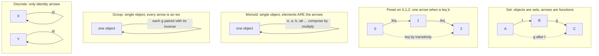

# 🖼️ Examples of Categories

> [!abstract] TL;DR
> The definition of a *category* — objects, arrows, associative composition, identities — is so undemanding that wildly different mathematical worlds all secretly ARE categories: sets with functions, groups with homomorphisms, spaces with continuous maps, but also a single ordered list, a single monoid, or a bare set of dots. Learning to *recognize* the categorical skeleton inside each of these is the "aha" that makes the whole subject click, because the moment you see "this is a category" you inherit every categorical theorem for free.

---

## Intuition

**Analogy:** A category is a game with exactly one rule. You have **dots**, **arrows** between dots, and whenever two arrows meet head-to-tail you must be able to **slide them into a single arrow**. That's the whole rulebook. The rule is so mild that things which look nothing alike all obey it:

- A pile of **sets** wired together by **functions** obeys it — chain two functions and you get a function.
- A **to-do list** where "task A must finish before task B" obeys it — the arrows are the "before" facts, and "before" chains transitively.
- A single **clock face** whose operations are "add 3 hours", "add 5 hours", … obeys it — do one then the other and you land on another "add k hours".

The first shock of category theory is realizing these are the *same* structure seen at different zoom levels. A category does not care *what* the dots are; it only remembers *how the arrows compose*. So the recipe "objects + their structure-preserving maps" and the recipe "a single algebraic gadget rewritten as arrows" both produce categories — and once you spot the skeleton, every theorem about categories applies to all of them at once.

The formal definition (objects, hom-sets, composition, identities, associativity, unit laws) is covered in the companion note *Categories, Objects, and Morphisms*; here we do the opposite of a definition — we build a **gallery** and watch the same axioms light up in each frame.

---

## How It Works

### Family 1 — categories of mathematical structures (the "large" ones)

The most common way a category arises: **fix a kind of structure, take those structures as objects, and take the structure-preserving maps as morphisms.** The recurring theme is literally *"objects + their homomorphisms = a category."*

| Category | Objects | Morphisms (structure-preserving maps) |
|----------|---------|----------------------------------------|
| $\mathbf{Set}$ | sets | all functions |
| $\mathbf{Grp}$ | groups | group homomorphisms |
| $\mathbf{Ring}$ | rings | ring homomorphisms |
| $\mathbf{Vect}_k$ | vector spaces over a field $k$ | linear maps |
| $\mathbf{Top}$ | topological spaces | continuous maps |
| $\mathbf{Pos}$ | posets | monotone (order-preserving) maps |

$\mathbf{Set}$ is the prototype and the one most people picture — but leaning on it too hard is a trap (see Pitfalls). Composition in every row is just "do one map, then the next", associativity is inherited from function composition, and each object's identity morphism is the identity map. Nothing here required cleverness; the categorical structure was already present the whole time.

### Family 2 — a category from a SINGLE structure (the eye-opening ones)

These build intuition precisely because they look nothing like "a universe of objects."

1. **A poset is a category.** Given a partial order $(P, \le)$, let the **elements be the objects** and put *exactly one* morphism $a \to b$ **iff $a \le b$**. Composition is **transitivity** ($a\le b$ and $b\le c$ give $a\le c$), and identities are **reflexivity** ($a \le a$). There is *at most one arrow between any two objects*.
2. **A preorder is a category with at most one arrow between any two objects** — same construction, dropping antisymmetry. Posets and preorders are exactly the "thin" categories.
3. **A monoid is a category with ONE object.** Take a single object $\star$; the **elements of the monoid ARE the morphisms** $\star \to \star$; **composition is the monoid operation**; the **identity morphism is the unit** $e$. So the slogan "a monoid is a one-object category" is literally an equation, not a metaphor. Example: the integers mod $n$ under addition become a one-object category with $n$ arrows.
4. **A group is a one-object category in which every morphism is an isomorphism** (a *groupoid* with one object). Invertibility of every arrow is exactly the group inverse.
5. **A discrete category is just a set.** Objects are the set's elements and the *only* morphisms are the identities — no non-trivial arrows at all.

Notice the flip in perspective: in Family 1 the arrows are maps *between* many objects; in Family 2 the arrows may be *order-facts* (poset) or *algebra-elements* (monoid) living around a handful of objects.

### Family 3 — small categories as *shapes*

Tiny finite categories are used as the **shapes of diagrams**: the category $\mathbf{1}$ (one object, one identity), $\mathbf{2}$ (two objects and one non-identity arrow — the "walking arrow"), $\mathbf{3}$ (a composable pair). A functor *out of* such a shape into $\mathcal C$ is exactly a diagram of that shape in $\mathcal C$ — the bridge to the companion note *Diagrams and Commutativity*.

### Family 4 — derived / constructed categories

From existing categories you build new ones, all still categories:

- **Opposite category $\mathcal C^{\mathrm{op}}$** — same objects, all arrows reversed; the engine of duality (see *Duality and the Opposite Category*).
- **Product category $\mathcal C \times \mathcal D$** — objects are pairs, arrows are pairs.
- **Slice / comma categories** — objects are arrows *into* (or out of) a fixed object.
- **Arrow category $\mathcal C^{\mathbf 2}$** and **functor categories $[\mathcal C, \mathcal D]$** — whose objects are functors and whose morphisms are natural transformations (see *Functor Categories and Naturality*).

### The gallery, side by side



**The key lesson:** the *same four axioms* describe sets, algebra, geometry, order, logic, and computation. That shared skeleton is why a categorical theorem, proved once, applies everywhere at once — and why the reflex "wait, this is a category" is one of the most powerful moves in mathematics.

---

## Key Concepts

### Secondary (dots-and-arrows intuition)

- A category is **dots and arrows you can chain**, plus a "do-nothing" arrow at each dot (the identity).
- Two everyday categories: a **dependency graph** (arrow = "must come before", chaining = transitivity) and a **calculator** with one memory cell where each button is an arrow you can press in sequence.
- The point of the examples: totally different-looking things follow the same rule.

### Undergraduate (structures and their maps)

- **Objects + structure-preserving maps = a category:** $\mathbf{Set}, \mathbf{Grp}, \mathbf{Ring}, \mathbf{Vect}_k, \mathbf{Top}, \mathbf{Pos}$. Verifying "it's a category" means checking composition is well-typed and associative and identities act as units — usually inherited from function composition.
- **Poset as a category:** objects $=$ elements, $\lvert \mathrm{Hom}(a,b)\rvert \le 1$, arrow present iff $a\le b$; composition $=$ transitivity; identity $=$ reflexivity.
- **Monoid as a category:** one object $\star$, $\mathrm{Hom}(\star,\star) = M$, composition $=$ multiplication, identity $=$ unit. A **group** is the special case where every arrow is invertible.
- **Discrete category:** a set with only identities; **preorder:** at most one arrow per ordered pair.
- **Size:** $\mathbf{Set}$ is **large** (its objects form a proper class); a poset or a finite monoid is **small**. A category is **locally small** if every $\mathrm{Hom}(X,Y)$ is a set.

### Graduate (constructions and caveats)

- **Derived categories:** $\mathcal C^{\mathrm{op}}$, $\mathcal C\times\mathcal D$, slice $\mathcal C/X$, comma $(F\downarrow G)$, arrow $\mathcal C^{\mathbf 2}$, functor $[\mathcal C,\mathcal D]$. Each inherits its axioms mechanically; recognizing them lets you reuse limits, adjunctions, and Yoneda-style arguments.
- **Concrete vs abstract:** a *concrete* category comes with a faithful functor to $\mathbf{Set}$ ("underlying-set" functor). Not every category is concrete — morphisms need not be functions at all (in a poset they are order-facts; in a monoid they are algebra-elements).
- **Different examples illuminate different concepts:** use $\mathbf{Set}$ for concrete intuition, **posets** for order/limit intuition (meets are products, joins are coproducts), **monoids/groups** for algebraic intuition. Over-relying on $\mathbf{Set}$ is the classic beginner distortion — many categorical facts that "feel obvious" are $\mathbf{Set}$-specific.
- **Forward connection:** *functors* are the structure-preserving maps *between* these categories, and natural transformations are maps between functors — the gallery is the raw material the rest of category theory operates on (see *Functors*, *Universal Properties*, *Category Theory Overview*).

---

## Python Demo

We build **four genuinely different categories from one common interface** — a finite `Category` object — then run the **same axiom-checker** on all of them. The point is visceral: identity laws and associativity hold for `FinSet`, a divisibility poset, the monoid $\mathbb{Z}/3\mathbb{Z}$, and a bare discrete category, because they are all the *same* structure. Finally we draw three of them side by side with matplotlib.

```python
# Construct four categories from ONE interface and verify the SAME axioms hold.
# Pure standard library for the algebra; matplotlib only for the picture.
import math
from itertools import product
import matplotlib.pyplot as plt


class Category:
    """A finite category given by explicit data.
    - objects   : list of hashable object ids
    - morphisms : list of hashable morphism ids
    - src, tgt  : morphism -> object (its source / target)
    - ident     : object   -> identity morphism at that object
    - comp      : (g, f)    -> the composite 'g after f', defined when tgt(f) == src(g)
    """
    def __init__(self, name, objects, morphisms, src, tgt, ident, comp):
        self.name = name
        self.objects = list(objects)
        self.morphisms = list(morphisms)
        self.morphset = set(morphisms)      # for fast closure checks
        self.src, self.tgt = src, tgt
        self.ident, self.comp = ident, comp


def check_axioms(C):
    """Verify the category axioms; raises AssertionError on any violation."""
    src, tgt, ident, comp, M = C.src, C.tgt, C.ident, C.comp, C.morphisms

    # (0) identities are correctly typed:  id_X : X -> X
    for X in C.objects:
        i = ident(X)
        assert src(i) == X and tgt(i) == X, "identity mis-typed"

    for f in M:
        # (1) unit laws:  id_tgt(f) . f == f == f . id_src(f)
        assert comp(ident(tgt(f)), f) == f, "left identity fails"
        assert comp(f, ident(src(f))) == f, "right identity fails"

        for g in M:
            if tgt(f) == src(g):                       # g after f is defined
                gf = comp(g, f)
                # (2) closure + typing:  g.f is a morphism  src(f) -> tgt(g)
                assert gf in C.morphset, "composite missing from category"
                assert src(gf) == src(f) and tgt(gf) == tgt(g), "composite mis-typed"
                for h in M:
                    if tgt(g) == src(h):               # (3) associativity
                        assert comp(h, comp(g, f)) == comp(comp(h, g), f), "not associative"
    return True


# --- (1) FinSet: finite sets as objects, ALL functions as morphisms ----------
def make_finset(named_sets):
    objs = list(named_sets)
    def all_functions(dom, cod):
        elems = named_sets[dom]
        return [(dom, cod, frozenset(zip(elems, imgs)))
                for imgs in product(named_sets[cod], repeat=len(elems))]
    morphs = [m for d in objs for c in objs for m in all_functions(d, c)]
    src = lambda m: m[0]
    tgt = lambda m: m[1]
    ident = lambda o: (o, o, frozenset((e, e) for e in named_sets[o]))
    def comp(g, f):                                     # g after f
        fmap, gmap = dict(f[2]), dict(g[2])
        return (f[0], g[1], frozenset((x, gmap[fmap[x]]) for x in named_sets[f[0]]))
    return Category("FinSet", objs, morphs, src, tgt, ident, comp)


# --- (2) Poset-as-category: one arrow a->b iff a divides b -------------------
def make_poset(elements, leq):
    objs = list(elements)
    morphs = [(a, b) for a in objs for b in objs if leq(a, b)]
    src = lambda m: m[0]
    tgt = lambda m: m[1]
    ident = lambda o: (o, o)                            # reflexivity a <= a
    comp = lambda g, f: (f[0], g[1])                    # transitivity a<=b<=c => a<=c
    return Category("Poset(divides)", objs, morphs, src, tgt, ident, comp)


# --- (3) Monoid-as-category: ONE object, elements = arrows -------------------
def make_monoid_Zn(n):
    star = "*"
    morphs = list(range(n))                             # elements of Z/nZ
    src = tgt = lambda m: star
    ident = lambda o: 0                                 # the unit is the identity arrow
    comp = lambda g, f: (g + f) % n                     # composition = the monoid op
    return Category("Monoid Z/%dZ" % n, [star], morphs, src, tgt, ident, comp)


# --- (4) Discrete category: only identity arrows ----------------------------
def make_discrete(elements):
    objs = list(elements)
    morphs = [("id", o) for o in objs]
    src = tgt = lambda m: m[1]
    ident = lambda o: ("id", o)
    comp = lambda g, f: f                               # id . id = id
    return Category("Discrete", objs, morphs, src, tgt, ident, comp)


categories = [
    make_finset({"A": ("a",), "B": ("x", "y")}),
    make_poset([1, 2, 3, 6], lambda a, b: b % a == 0),
    make_monoid_Zn(3),
    make_discrete(["X", "Y", "Z"]),
]

print("The SAME axiom-checker validates four different-looking categories:\n")
for C in categories:
    ok = check_axioms(C)
    print("  %-16s objects=%d  morphisms=%2d  axioms_hold=%s"
          % (C.name, len(C.objects), len(C.morphisms), ok))


# ---------------------- visualize three of them -----------------------------
def draw_node(ax, xy, label, color="#2563eb"):
    ax.add_patch(plt.Circle(xy, 0.11, color=color, zorder=3))
    ax.text(xy[0], xy[1], label, ha="center", va="center", color="white",
            fontsize=11, zorder=4)

def draw_arrow(ax, a, b):
    ax.annotate("", xy=b, xytext=a,
                arrowprops=dict(arrowstyle="->", color="#374151", lw=1.5,
                                shrinkA=13, shrinkB=13))

def draw_loop(ax, center, offset=(0.0, 0.22), r=0.11, label="", color="#7c3aed"):
    cx, cy = center; ox, oy = offset; n = 60
    pts = [(cx + ox + r * math.cos(0.35 + t * (2 * math.pi - 0.7) / (n - 1)),
            cy + oy + r * math.sin(0.35 + t * (2 * math.pi - 0.7) / (n - 1)))
           for t in range(n)]
    xs, ys = [p[0] for p in pts], [p[1] for p in pts]
    ax.plot(xs, ys, color=color, lw=1.4)
    ax.annotate("", xy=(xs[-1], ys[-1]), xytext=(xs[-2], ys[-2]),
                arrowprops=dict(arrowstyle="->", color=color))
    if label:
        ax.text(cx + ox, cy + oy + r + 0.05, label, ha="center", va="bottom", fontsize=9)

fig, axes = plt.subplots(1, 3, figsize=(13.5, 4.6))

# Poset (divisibility on 1,2,3,6) drawn as its Hasse diagram
ax = axes[0]
pos = {1: (0.5, 0.10), 2: (0.22, 0.60), 3: (0.78, 0.60), 6: (0.5, 1.05)}
for k, p in pos.items():
    draw_node(ax, p, str(k))
for a, b in [(1, 2), (1, 3), (2, 6), (3, 6)]:
    draw_arrow(ax, pos[a], pos[b])
ax.set_title("Poset: one arrow a -> b when a divides b\n(composition = transitivity)")

# Monoid Z/3Z as a one-object category with three self-loops
ax = axes[1]
draw_node(ax, (0.5, 0.5), "*")
draw_loop(ax, (0.5, 0.5), offset=(0.0, 0.24), label="0 = id")
draw_loop(ax, (0.5, 0.5), offset=(-0.30, 0.00), label="1")
draw_loop(ax, (0.5, 0.5), offset=(0.30, 0.00), label="2")
ax.set_title("Monoid Z/3Z: one object, elements are arrows\n(composition = add mod 3)")

# Discrete category: three objects, only identity arrows
ax = axes[2]
for k, p in {"X": (0.2, 0.5), "Y": (0.5, 0.5), "Z": (0.8, 0.5)}.items():
    draw_node(ax, p, k)
    draw_loop(ax, p, offset=(0.0, 0.20), label="id")
ax.set_title("Discrete category: only identity arrows\n(a bare set)")

for ax in axes:
    ax.set_xlim(-0.1, 1.1); ax.set_ylim(-0.15, 1.45); ax.axis("off")

plt.tight_layout()
plt.savefig("categories_gallery.png", dpi=120)
plt.show()
```

Expected console output:

```
The SAME axiom-checker validates four different-looking categories:

  FinSet           objects=2  morphisms= 8  axioms_hold=True
  Poset(divides)   objects=4  morphisms= 9  axioms_hold=True
  Monoid Z/3Z      objects=1  morphisms= 3  axioms_hold=True
  Discrete         objects=3  morphisms= 3  axioms_hold=True
```

One checker, four categories, all `True` — the skeleton really is identical.

---

## Real-World Applications

> **Example — functional programming (a "types and functions" category):** In a typed language you can model types as objects and pure functions as morphisms: `int`, `str`, `bool` are objects; `len : str -> int` is a morphism; composition is `g . f`, identity is `id`. This "Hask-like" category is why Haskell's `Functor`, `Applicative`, and `Monad` (see [[Monads_and_Effects]]) are the *literal* categorical constructs, and why type-driven refactoring feels like diagram-chasing.

- **Databases as categories (Spivak):** a schema is a small category, a database instance is a functor into $\mathbf{Set}$, and data migration is a functor between schemas — moving real ETL work into categorical language.
- **Build systems and scheduling:** a dependency DAG is (the free category on) a directed graph, and the associated reachability relation is a **poset-as-category** — "can A's output reach B?" is exactly "is there a morphism $A\to B$?".
- **Automata and state machines:** the transition monoid of a finite automaton is a **monoid-as-category**, so language-theoretic facts become one-object-category facts.
- **Physics and quantum computation:** processes compose in a (monoidal) category; the ZX-calculus is a graphical category of quantum operations.

---

## Common Pitfalls

- **Confusing objects with elements in the monoid picture.** In a monoid-as-category there is *one object*; the monoid's elements are the **arrows**, not the objects. Beginners often try to make each element an object — that destroys the construction.
- **Assuming every morphism is a function.** In a poset the morphisms are order-*facts* ($a\le b$), and in a monoid they are algebra-*elements*. Categories are not "sets with structure"; some are not concrete at all.
- **Over-relying on $\mathbf{Set}$ intuition.** In $\mathbf{Set}$, monos are injections and epis are surjections — but this is *not* general. In $\mathbf{Ring}$ the inclusion $\mathbb{Z}\hookrightarrow\mathbb{Q}$ is an **epimorphism that is not surjective**. Facts that feel obvious are often $\mathbf{Set}$-specific; test them in a poset or monoid.
- **Forgetting to check the axioms when you "build" a category.** A random collection of objects and arrows is only a category if composition is *closed*, *associative*, and identities *act as units*. The demo's `check_axioms` exists precisely to catch a half-baked "category" that silently breaks a law.
- **Mixing up size classes.** $\mathbf{Set}$ is **large** (its objects form a proper class), while a poset or finite monoid is **small**. Blurring this leads to genuine paradoxes when you form functor categories or try to talk about "the set of all objects".
- **Reversing composition order.** $g\circ f$ means "$f$ first, then $g$". In a monoid-as-category, `comp(g, f)` must match your chosen product convention (for a commutative monoid like $\mathbb{Z}/n\mathbb{Z}$ it is harmless, but it bites for non-commutative monoids).

---

## Related Concepts

- [[Set_Theory_and_Relations]] — the raw material for $\mathbf{Set}$ (sets + functions) and for posets/preorders (a set with an order relation).
- [[Groups_and_Subgroups]] — $\mathbf{Grp}$; and a *single* group is a one-object category in which every arrow is invertible (a groupoid).
- [[Rings_and_Ideals]] — $\mathbf{Ring}$, whose epimorphisms famously need not be surjective — a cure for $\mathbf{Set}$-only intuition.
- [[Fields_and_Field_Extensions]] — the base field $k$ over which $\mathbf{Vect}_k$ is defined.
- [[Vectors_and_Vector_Spaces]] and [[Linear_Transformations]] — objects and morphisms of $\mathbf{Vect}_k$.
- [[Topological_Spaces]] — objects of $\mathbf{Top}$, with continuous maps as morphisms.
- [[Graph_Theory]] — a directed graph generates a *free category*, and finite categories serve as the *shapes* of diagrams.
- [[Category_Theory]] — the graduate-level overview (functors, Yoneda, adjunctions, monads) this gallery feeds into.
- [[Type_Systems_Fundamentals]] and [[Monads_and_Effects]] — the "types and functions" category and its monads in programming.

*Planned Category_Theory siblings referenced above (not yet written): Categories, Objects, and Morphisms; Category Theory Overview; Duality and the Opposite Category; Diagrams and Commutativity; Functors; Functor Categories and Naturality; Universal Properties; Isomorphisms and Special Morphisms; Category Theory in Programming.*

---

## Review Questions

**Secondary.** Give two everyday situations that are secretly categories, and in each say what the dots are, what the arrows are, and what it means to chain two arrows.

**Undergraduate.** Take the divisibility order on $\{1,2,3,6\}$. Draw it as a category: list the objects, the morphisms (including identities), and verify that composition (transitivity) is associative and that reflexive arrows act as identities. How many morphisms are there in total?

**Graduate.** Explain precisely why "a group is a one-object category" and "a group is a category with one object in which every morphism is an isomorphism" say the same thing. Then exhibit a categorical statement that is true in $\mathbf{Set}$ but *false* in some other category from the gallery (hint: consider epimorphisms in $\mathbf{Ring}$ or products in a poset), and explain what this teaches about relying on $\mathbf{Set}$ intuition.

---

## Sources

- Emily Riehl, *Category Theory in Context*, Ch. 1 (free PDF) — https://math.jhu.edu/~eriehl/context.pdf
- Tom Leinster, *Basic Category Theory*, Ch. 1, arXiv:1612.09375 — https://arxiv.org/abs/1612.09375
- Steve Awodey, *Category Theory* (Oxford Logic Guides 52), Ch. 1 — Oxford University Press, 2010.
- Saunders Mac Lane, *Categories for the Working Mathematician* (GTM 5), Ch. 1 — Springer, 1998.
- nLab, "category" and "examples of categories" — https://ncatlab.org/nlab/show/category

---

#category-theory #examples #set-category #poset #monoid
