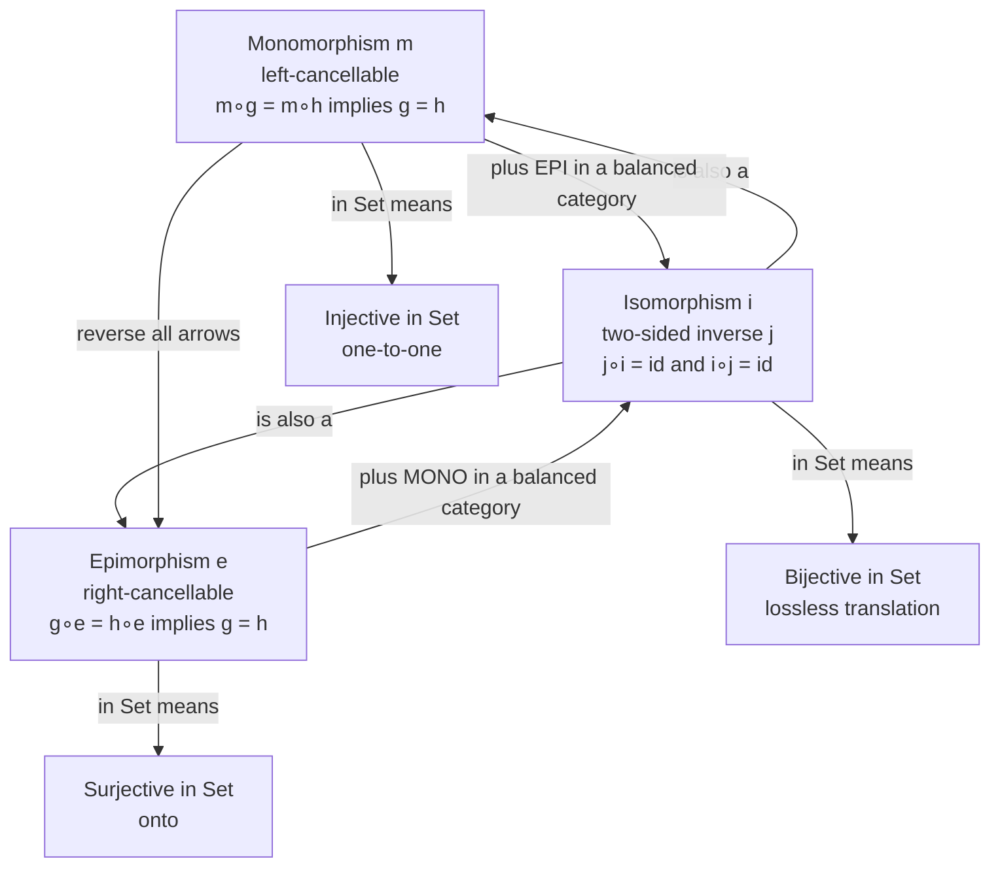

# 🪞 Isomorphisms and Special Morphisms

> [!abstract] TL;DR
> A **morphism** is not just a function — it is an *arrow*, and category theory classifies arrows **purely by how they compose**, without ever looking inside the objects. An **isomorphism** is an arrow with a two-sided inverse; when one exists we say `A ≅ B`, the objects are **interchangeable for every categorical purpose**, and this — not literal equality — is what "sameness" means. A **monomorphism** is *left-cancellable* (`f∘g = f∘h ⟹ g = h`), the element-free generalization of *injective*; an **epimorphism** is its dual, *right-cancellable* (the generalization of *surjective*). In **Set** these recover injective / surjective / bijective exactly, but in other categories they **diverge** — the sharpest lesson in category theory that structure lives in the **arrows**, not the elements.

---

## Intuition

**Analogy — when are two things "the same"?** You have a document in English and its French translation. They are not *equal* — different words, different alphabet, literally different bytes. Yet if there is a translator who can turn English into French **and** a translator who can turn the French back into the *exact* original English, then for every practical purpose the two documents carry the same information. Anything you could ask of one, you can answer through the other. That round-trip pair of translators — "there and back with nothing lost" — is an **isomorphism**.

Category theory takes this seriously as *the* definition of sameness. Two objects `A` and `B` are the same, written `A ≅ B`, not when they are equal but when there is an arrow `f : A → B` and a reverse arrow `g : B → A` that **undo each other**: `g∘f` leaves `A` untouched and `f∘g` leaves `B` untouched. The mantra is *"equality is too strong; isomorphism is the right notion of sameness."* Once you accept that, you also need finer, one-directional flavours of arrow: one that never merges two inputs (a **monomorphism**, injective-like) and its mirror image that never misses a target (an **epimorphism**, surjective-like). The radical part is that all three are defined **only by composition** — by which arrows cancel against which — so the definitions transfer to categories where "elements" do not even exist.

---

## How It Works

### Core mechanics

A morphism `f : A → B` is characterized by testing it against **other arrows**, never by inspecting points of `A` or `B`.

1. **Isomorphism (iso).** `f : A → B` is an *iso* if there exists `g : B → A` with `g∘f = id_A` **and** `f∘g = id_B`. The inverse `g` is unique when it exists, written `f⁻¹`. If some iso `A → B` exists, `A` and `B` are **isomorphic** (`A ≅ B`) and are interchangeable for all categorical purposes.
2. **Monomorphism (mono).** `f` is *left-cancellable*: for every pair `g, h` with `f∘g = f∘h`, we must have `g = h`. Cancel `f` off the **left**. This is the arrow-only version of *injective* — `f` never destroys the distinction between two incoming maps.
3. **Epimorphism (epi).** The **dual**: `f` is *right-cancellable*: `g∘f = h∘f ⟹ g = h`. Cancel `f` off the **right**. This is the arrow-only version of *surjective* — `f` never leaves room downstream for two maps to disagree.
4. **In Set they coincide with the familiar notions.** monos = injective functions, epis = surjective functions, isos = bijective functions. A category where **mono + epi ⟹ iso** is called **balanced**; Set is balanced.
5. **Splitting.** A **split mono** has an actual *left* inverse `r∘f = id` (`r` is a **retraction**); a **split epi** has a *right* inverse `f∘s = id` (`s` is a **section**). Something that is both split-mono and split-epi is an iso. Splittings connect to **idempotents**: `e = f∘r` satisfies `e∘e = e`.
6. **Self-arrows.** An **endomorphism** is an arrow `A → A`; an **automorphism** is an endomorphism that is also an iso. The automorphisms of one object form a **group** under composition — the **automorphism group** `Aut(A)` — the bridge back to classical [[Groups_and_Subgroups|group theory]].
7. **Groupoid.** A category in which **every** morphism is an iso. Groupoids generalize groups (a group is a one-object groupoid) and are central to modern geometry and to [[Homotopy_Type_Theory|Homotopy Type Theory]].

### The subtlety: mono/epi are NOT injective/surjective in general

The equivalences in step 4 hold **in Set**. Elsewhere they can fail. The famous counterexample: the inclusion `ℤ ↪ ℚ` is an **epimorphism in the category of (commutative) rings** even though it is *not* surjective — because any ring homomorphism out of `ℚ` is completely pinned down by what it does on `ℤ` (a fraction `a/b` is forced once integers are fixed), so right-cancellation holds despite most rationals being "missed." This proves epi is a genuinely **categorical**, arrow-relative notion, not the set-theoretic idea of "onto." Categories where the two notions come apart are **not balanced**; a poset is the cleanest example (see the Python demo).

### Why iso, not equality

Objects defined by a **universal property** — products, kernels, free constructions, limits — are never *unique* on the nose; they are **unique up to a unique isomorphism**. So mathematics runs on the **principle of equivalence**: never ask whether two objects are *equal*, only whether they are *isomorphic*, and treat isomorphic objects as the same. [[Homotopy_Type_Theory|HoTT]]'s **univalence axiom** takes the final step and makes *"isomorphic = equal"* a literal law.

### Flow / Architecture



---

## Key Concepts

### Secondary (intuitive)
- **Sameness vs equality.** Two things can be "the same" without being identical — as long as you can convert each into the other and back with **nothing lost**. That reversible round-trip is an isomorphism.
- **Bijection.** In everyday sets, an iso is just a **bijection**: a perfect pairing with no leftovers and no collisions.
- **One-directional flavours.** *Never merges anything* = injective-like (mono). *Never misses anything* = surjective-like (epi). Both together with reversibility = iso.

### Undergraduate
- **Formal definitions.** iso = two-sided inverse; mono = left-cancellable; epi = right-cancellable. All stated with arrows only, **no elements**.
- **Set correspondence.** In **Set**: mono ⇔ injective, epi ⇔ surjective, iso ⇔ bijective. Prove injective ⇒ mono using singleton test maps `1 → A`.
- **Split mono / split epi.** A retraction `r∘f = id` (left inverse) makes `f` a split mono; a section `f∘s = id` (right inverse) makes `f` a split epi. Split-mono `⟹` mono; split-epi `⟹` epi.
- **Automorphism group.** `Aut(A)` = self-isos of `A` under composition, a genuine group; e.g. `Aut` of a vector space is `GL(n)`, `Aut` of a set of size `n` is the symmetric group `Sₙ`. Links to [[Groups_and_Subgroups]].
- **Duality.** Reversing every arrow (passing to the **opposite category**) swaps mono and epi; iso is **self-dual**.

### Graduate
- **Regular / effective / strong monos.** Finer classes: a **regular mono** is an equalizer of some parallel pair; **effective** monos arise as kernels; these coincide with plain monos in nice categories but not all. Analogously **regular epis** = coequalizers.
- **Balanced categories.** A category is **balanced** when mono + epi ⟹ iso. **Set**, **Grp**, and every **abelian category** are balanced; **Top**, **Ring**, **Mon**, and posets are **not** — hence "continuous bijection need not be a homeomorphism," and `ℤ ↪ ℚ` is epi-not-surjective in **Ring**.
- **Splitting of idempotents.** An idempotent `e = e∘e` splits when `e = s∘r` with `r∘s = id`; the **Karoubi envelope / idempotent completion** formally adds these splittings, closely tied to retracts and to projectors.
- **Groupoids and the principle of equivalence.** A groupoid is a category of only isos; the **fundamental groupoid** of a space, group actions as action groupoids, and stacks all live here. Equivalence of categories, not equality, is the correct comparison — mirrored by **univalence** in [[Homotopy_Type_Theory]].
- **Element-free method.** Because mono/epi/iso are cancellation/universal properties, they are preserved by any construction that respects composition (functors preserve isos and split monos/epis; faithful functors reflect monos/epis). This is *why* the categorical vocabulary transports across all of mathematics.

---

## Python Demo

```python
"""
Arrow-theoretic tests for special morphisms -- defined by COMPOSITION alone.

    mono  = left-cancellable    f∘g = f∘h  =>  g = h     (injective in Set)
    epi   = right-cancellable   g∘f = h∘f  =>  g = h     (surjective in Set)
    iso   = has a two-sided inverse                        (bijective  in Set)

We (1) verify the Set equivalences empirically, then (2) exhibit a POSET
category where every arrow is mono AND epi yet almost none are iso -- proving
these are genuinely categorical, not element-based, notions.
Pure stdlib + matplotlib. No numpy required.
"""
from itertools import product
import matplotlib.pyplot as plt

# ----------------------------------------------------------------------
# FinSet: a morphism A -> B is a dict {a: f(a)}.  Composition (g∘f)(x)=g(f(x)).
# ----------------------------------------------------------------------
def compose(g, f):
    """g: B->C, f: A->B  =>  g∘f : A->C."""
    return {x: g[f[x]] for x in f}

def all_functions(dom, cod):
    """Every function dom -> cod, as a list of dicts."""
    dom, cod = list(dom), list(cod)
    return [dict(zip(dom, vals)) for vals in product(cod, repeat=len(dom))]

def identity(s):
    return {x: x for x in s}

# --- classical, element-peeking tests (the "cheat" we are trying to replace) ---
def is_injective(f):            return len(set(f.values())) == len(f)
def is_surjective(f, cod):      return set(f.values()) == set(cod)
def is_bijective(f, cod):       return is_injective(f) and is_surjective(f, cod)

# --- arrow-theoretic tests: NEVER inspect elements of A or B directly ---
def is_mono(f, dom, test_objects):
    """Left-cancellable against all g,h : C -> dom for small test objects C."""
    for C in test_objects:
        funcs = all_functions(C, dom)
        for g, h in product(funcs, repeat=2):
            if compose(f, g) == compose(f, h) and g != h:
                return False
    return True

def is_epi(f, cod, test_objects):
    """Right-cancellable against all g,h : cod -> D for small test objects D."""
    for D in test_objects:
        funcs = all_functions(cod, D)
        for g, h in product(funcs, repeat=2):
            if compose(g, f) == compose(h, f) and g != h:
                return False
    return True

def is_iso(f, dom, cod):
    """Return an explicit inverse g with g∘f=id_dom and f∘g=id_cod, else None."""
    for g in all_functions(cod, dom):
        if compose(g, f) == identity(dom) and compose(f, g) == identity(cod):
            return g
    return None

# In Set, a singleton detects injectivity and a 2-element set detects surjectivity.
TEST_OBJECTS = [{"*"}, {0, 1}]

EXAMPLES = [
    # name,                 f,                              dom,           cod
    ("injective, not onto", {"a": 0, "b": 1},               {"a", "b"},    {0, 1, 2}),
    ("onto, not injective", {"a": 0, "b": 1, "c": 1},       {"a","b","c"}, {0, 1}),
    ("bijection (iso)",     {"a": 0, "b": 1},               {"a", "b"},    {0, 1}),
]

def report_finset():
    print("== FinSet: arrow-theoretic tests match element-level tests ==")
    print(f"{'example':22} {'mono==inj':10} {'epi==surj':10} {'iso==bij':9}")
    for name, f, dom, cod in EXAMPLES:
        mono, inj = is_mono(f, dom, TEST_OBJECTS), is_injective(f)
        epi,  sur = is_epi(f, cod, TEST_OBJECTS), is_surjective(f, cod)
        iso,  bij = is_iso(f, dom, cod) is not None, is_bijective(f, cod)
        print(f"{name:22} {str(mono==inj):10} {str(epi==sur):10} {str(iso==bij):9}")
        assert (mono == inj) and (epi == sur) and (iso == bij)
    print("all equivalences hold in Set.\n")

# ----------------------------------------------------------------------
# A POSET as a category: exactly one arrow a->b iff a <= b (here: a divides b).
# Cancellation is automatic (<=1 arrow between objects) so EVERY arrow is mono
# AND epi -- yet an iso a->b needs an inverse b->a, i.e. a=b.  Not balanced!
# ----------------------------------------------------------------------
POSET = [1, 2, 3, 6]
def leq(a, b):            return b % a == 0          # divisibility order
def hom(a, b):           return [(a, b)] if leq(a, b) else []
def pcompose(outer, inner):
    (a, b), (b2, c) = inner, outer                    # inner:a->b, outer:b->c
    assert b == b2
    return (a, c)

def poset_is_mono(f):
    a, _ = f
    for c in POSET:
        arrows = hom(c, a)
        for g, h in product(arrows, repeat=2):
            if pcompose(f, g) == pcompose(f, h) and g != h:
                return False
    return True

def poset_is_epi(f):
    _, b = f
    for d in POSET:
        arrows = hom(b, d)
        for g, h in product(arrows, repeat=2):
            if pcompose(g, f) == pcompose(h, f) and g != h:
                return False
    return True

def poset_is_iso(f):
    a, b = f
    return bool(hom(b, a))                             # inverse exists iff b<=a iff a=b

def report_poset():
    print("== Poset category (divisibility on 1,2,3,6): mono & epi != iso ==")
    f = (2, 6)   # a non-identity arrow 2 -> 6
    print(f"arrow {f}: mono={poset_is_mono(f)}, epi={poset_is_epi(f)}, "
          f"iso={poset_is_iso(f)}")
    print("--> mono AND epi but NOT iso: a poset is not a balanced category.")
    print("--> 'injective/surjective' do not even apply -- only arrows do.\n")

# ----------------------------------------------------------------------
# Visualization: an isomorphism (with dashed inverse) vs a non-mono collapse.
# ----------------------------------------------------------------------
def draw_map(ax, A, B, mapping, inverse=None, title=""):
    A, B = list(A), list(B)
    posA = {a: (0.0, i) for i, a in enumerate(reversed(A))}
    posB = {b: (1.0, i) for i, b in enumerate(reversed(B))}
    for a, (x, y) in posA.items():
        ax.scatter([x], [y], s=650, color="#2563eb", zorder=3)
        ax.text(x, y, str(a), color="white", ha="center", va="center", zorder=4)
    for b, (x, y) in posB.items():
        ax.scatter([x], [y], s=650, color="#16a34a", zorder=3)
        ax.text(x, y, str(b), color="white", ha="center", va="center", zorder=4)
    for a in A:                                          # forward arrows (solid)
        x0, y0 = posA[a]; x1, y1 = posB[mapping[a]]
        ax.annotate("", xy=(x1 - 0.08, y1), xytext=(x0 + 0.08, y0),
                    arrowprops=dict(arrowstyle="->", color="#111827", lw=1.8))
    if inverse:                                          # inverse arrows (dashed red)
        for b in B:
            x0, y0 = posB[b]; x1, y1 = posA[inverse[b]]
            ax.annotate("", xy=(x1 + 0.08, y1), xytext=(x0 - 0.08, y0),
                        arrowprops=dict(arrowstyle="->", color="#dc2626",
                                        lw=1.3, linestyle="--"))
    ax.set_title(title, fontsize=10)
    ax.set_xlim(-0.5, 1.5); ax.set_ylim(-0.6, max(len(A), len(B)) - 0.4)
    ax.axis("off")

def make_figure():
    fig, (ax1, ax2) = plt.subplots(1, 2, figsize=(10, 4.5))
    draw_map(ax1, ["a", "b", "c"], ["x", "y", "z"],
             {"a": "x", "b": "y", "c": "z"},
             inverse={"x": "a", "y": "b", "z": "c"},
             title="Isomorphism: bijection\nsolid = f, dashed = inverse (lossless)")
    draw_map(ax2, ["a", "b", "c"], ["x", "y"],
             {"a": "x", "b": "x", "c": "y"},
             title="Not mono: f maps a,b -> x\nleft-cancellation fails (no inverse)")
    fig.suptitle("Special morphisms in FinSet", fontsize=13)
    fig.tight_layout()
    fig.savefig("special_morphisms.png", dpi=120)
    print("saved special_morphisms.png")

if __name__ == "__main__":
    report_finset()
    report_poset()
    make_figure()
```

Expected console output:

```
== FinSet: arrow-theoretic tests match element-level tests ==
example                mono==inj  epi==surj  iso==bij
injective, not onto    True       True       True
onto, not injective    True       True       True
bijection (iso)        True       True       True
all equivalences hold in Set.

== Poset category (divisibility on 1,2,3,6): mono & epi != iso ==
arrow (2, 6): mono=True, epi=True, iso=False
--> mono AND epi but NOT iso: a poset is not a balanced category.
--> 'injective/surjective' do not even apply -- only arrows do.
```

The demo proves the equivalences hold in **Set** *by cancellation, not by counting elements*, and then breaks them in a **poset**, making the categorical point concrete: mono, epi, and iso are about **arrows**.

---

## Real-World Applications

> **Type isomorphisms in programming.** In a typed language, `curry : ((A, B) -> C) -> (A -> B -> C)` and `uncurry` are mutual inverses, so `((A, B) -> C) ≅ (A -> B -> C)`. Likewise `(A, B) ≅ (B, A)` via swap, and `Either A Void ≅ A`. Recognizing such isos tells a compiler (and a programmer) that a refactor is **behaviour-preserving** — the categorical view underlies libraries like Haskell's `profunctors`/`lens` and Scala's `cats`. Explored further in the sibling note *Category Theory in Programming*.

- **Lossless data migration.** A schema change that ships with a *forward* and a *backward* converter that round-trip exactly is an **isomorphism of data models** — the formal guarantee that no information is lost.
- **Serialization round-trips.** `decode ∘ encode = id` (a **section**, split-epi) is the property property-based tests assert for JSON/Protobuf codecs; a true bijective codec is an iso.
- **Cryptography and coding.** Block ciphers and reversible encodings are **automorphisms** of the message space; decryptability *is* the two-sided-inverse condition.
- **Classification in algebra and topology.** "Classify all groups of order 8" means *up to isomorphism*; the whole subject of invariants exists to detect when `A ≅ B` fails.
- **Databases.** Two SQL queries are interchangeable when there is a natural iso between the functors they represent — the basis of query optimization and view equivalence.

---

## Common Pitfalls

- **"Epi means surjective."** Only in **Set** (and other balanced categories). In **Ring**, `ℤ ↪ ℚ` is epi without being onto. Always ask *which category* before translating epi as surjective.
- **"Mono + epi means iso."** True *only* in a **balanced** category. In **Top** a continuous bijection can be mono and epi yet fail to be a homeomorphism; in a **poset** every arrow is mono and epi but only identities are iso.
- **Confusing `≅` with `=`.** Isomorphic objects are **interchangeable**, not identical. Sloppily identifying them can hide the choice of iso, and *which* iso often matters (naturality). "Unique up to unique isomorphism" is the precise, safe phrasing.
- **Checking only one inverse equation.** An iso needs **both** `g∘f = id_A` **and** `f∘g = id_B`. A one-sided inverse gives only a **split mono** or **split epi**; e.g. an injection with a left inverse (retraction) is *not* iso unless the other side also holds.
- **Assuming inverses are unique before proving iso.** A morphism may have *many* one-sided inverses; a *two-sided* inverse, once it exists, is unique — do not conflate the two situations.
- **Peeking inside objects.** Reaching for "elements" to argue mono/epi defeats the purpose and gives wrong answers in element-free categories. Argue by **cancellation**.

---

## Related Concepts

- [[Category_Theory]] — the umbrella note (objects, morphisms, functors, natural transformations, Yoneda); special morphisms are the first refinement of "arrow" it introduces.
- [[Groups_and_Subgroups]] — the automorphisms of an object form a **group** `Aut(A)`; a group is exactly a **one-object groupoid**, i.e. a category where the single object's every arrow is an iso.
- [[Homotopy_Type_Theory]] — its **univalence axiom** promotes *isomorphism (equivalence)* to *equality*, the ultimate expression of "iso is the right notion of sameness," and reinterprets **groupoids** as types.

Not yet written in this vault (referenced in prose, to be linked later): *Categories, Objects and Morphisms* (the base definitions of arrow and composition), *Duality and the Opposite Category* (mono and epi are dual; iso is self-dual), *Universal Properties* (objects unique *up to iso*), *Examples of Categories* (Set, Top, Grp, Ring, posets — where balancedness varies), *The Yoneda Lemma* (an object is determined by its arrows up to iso), and *Category Theory in Programming* (type isomorphisms and safe refactoring).

---

## Review Questions

1. **(Secondary)** In plain terms, why do we say two objects are "the same" when an isomorphism exists between them, even though they are not literally equal? Give an everyday example of a reversible, lossless translation.
2. **(Undergraduate)** Prove, using only arrows, that an injective function in **Set** is a monomorphism. *(Hint: test `f` against two maps `g, h : {*} → A` out of a singleton and use left-cancellation.)* Then state the dual statement for epimorphisms.
3. **(Graduate)** Give a category and an explicit morphism that is **both** a monomorphism **and** an epimorphism but **not** an isomorphism. Explain what property of the category (its lack of "balance") permits this, and contrast with why **Set** cannot produce such an example.

---

## Sources

- Emily Riehl, *Category Theory in Context*, Dover (2016) — freely available: [math.jhu.edu/~eriehl/context.pdf](https://math.jhu.edu/~eriehl/context.pdf)
- Tom Leinster, *Basic Category Theory*, Cambridge Univ. Press (2014) — arXiv preprint: [arXiv:1612.09375](https://arxiv.org/abs/1612.09375)
- Saunders Mac Lane, *Categories for the Working Mathematician*, 2nd ed., Springer (1998).
- nLab, entries for [isomorphism](https://ncatlab.org/nlab/show/isomorphism), [monomorphism](https://ncatlab.org/nlab/show/monomorphism), [epimorphism](https://ncatlab.org/nlab/show/epimorphism), and [balanced category](https://ncatlab.org/nlab/show/balanced+category).
- The Univalent Foundations Program, *Homotopy Type Theory: Univalent Foundations of Mathematics* (2013) — [homotopytypetheory.org/book](https://homotopytypetheory.org/book/)

---

#category-theory #isomorphism #monomorphism #epimorphism #universal-property
