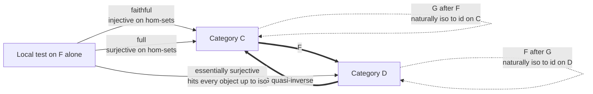

# 🔁 Equivalence of Categories

> [!abstract] TL;DR
> An **equivalence of categories** is the *correct* notion of "two categories are the same." It relaxes the too-strict demand of *isomorphism* — instead of requiring a functor that is a bijection on objects and morphisms with a strict inverse, an equivalence only asks that a round-trip returns you to where you started **up to natural isomorphism**. A functor is (half of) an equivalence exactly when it is **fully faithful** and **essentially surjective**. Category theory is invariant under equivalence, so this is the level of sameness at which all meaningful categorical facts live.

---

## Intuition

**Analogy — two libraries with the same books.** Imagine two libraries. Library A shelves one copy of every title. Library B has the *same collection* but keeps three identical copies of a few popular books, shelved on different floors. Are the libraries "the same"? If you demand they be **identical** — same number of physical volumes, matched one-to-one — the answer is no, because B has redundant duplicates. But that mismatch is *harmless*: any question about "which titles are available and how they cite each other" has the same answer in both. There is a perfect translation back and forth that recovers everything *up to the fact that a duplicate is interchangeable with its original*.

That relaxed notion of sameness is **equivalence of categories**. Two categories $\mathcal{C}$ and $\mathcal{D}$ are *equivalent* when a functor translates $\mathcal{C}$ into $\mathcal{D}$ and another translates back, and the round trip is not the identity *on the nose* but *naturally isomorphic* to it. Demanding categories be literally **isomorphic** — a bijection of objects and morphisms — is almost always too strict, because real categories are riddled with isomorphic copies of the "same" object (a duplicate volume). Insisting those copies be *equal* rather than merely *isomorphic* violates the whole point of category theory: only structure up to isomorphism should matter.

---

## How It Works

### From isomorphism to equivalence

An **isomorphism of categories** is a functor $F : \mathcal{C} \to \mathcal{D}$ that admits a strict two-sided inverse $G$ with $G \circ F = \mathrm{id}_{\mathcal{C}}$ and $F \circ G = \mathrm{id}_{\mathcal{D}}$ **as equalities of functors**. This forces $F$ to be a bijection on objects and, hom-set by hom-set, a bijection on morphisms. In practice this almost never happens, because most categories contain many isomorphic copies of "the same" object (think: every one-dimensional real vector space, or every singleton set). Counting those copies is an *evil* — a property that distinguishes structures which ought to be treated as identical.

An **equivalence of categories** fixes this by replacing the two equalities with **natural isomorphisms**:

$$
F : \mathcal{C} \to \mathcal{D}, \qquad G : \mathcal{D} \to \mathcal{C}, \qquad
G \circ F \;\cong\; \mathrm{id}_{\mathcal{C}}, \qquad
F \circ G \;\cong\; \mathrm{id}_{\mathcal{D}}.
$$

The round trip $G \circ F$ need not send an object $c$ back to $c$; it only needs to send it to something *naturally isomorphic* to $c$, coherently across all morphisms. When such a pair exists we say $\mathcal{C}$ and $\mathcal{D}$ are **equivalent**, written $\mathcal{C} \simeq \mathcal{D}$, and call $G$ a **quasi-inverse** of $F$. (This uses the sibling notions of a *functor* and a *natural transformation* — the natural isomorphisms are the whole point.)

### The local characterization (how you actually prove it)

Constructing a quasi-inverse $G$ by hand is painful — it typically requires the **axiom of choice** to pick, for each object of $\mathcal{D}$, a preimage and an isomorphism. The standard workaround is a purely *local* test on $F$ alone:

> A functor $F : \mathcal{C} \to \mathcal{D}$ is part of an equivalence **if and only if** it is **fully faithful** and **essentially surjective**.

The three ingredients:

1. **Faithful** — $F$ is *injective on each hom-set*: the map $\mathrm{Hom}_{\mathcal{C}}(A, B) \to \mathrm{Hom}_{\mathcal{D}}(FA, FB)$ is injective. No two distinct parallel morphisms are collapsed.
2. **Full** — $F$ is *surjective on each hom-set*: that same map is surjective. Every morphism $FA \to FB$ downstairs comes from a morphism $A \to B$ upstairs.
3. **Essentially surjective** — every object $d \in \mathcal{D}$ is *isomorphic* (not necessarily equal) to $F(c)$ for some $c \in \mathcal{C}$. The image hits every isomorphism class.

"Faithful + full" together = **fully faithful**, meaning $F$ restricts to a *bijection* on every hom-set, i.e. it embeds $\mathcal{C}$ as a **full subcategory** of $\mathcal{D}$. Add essential surjectivity and that full subcategory is *everything up to isomorphism* — which is exactly equivalence. This local check is why you almost never build the quasi-inverse explicitly.

### Skeletons — the minimal representative

A **skeleton** of $\mathcal{C}$ is a full subcategory containing *exactly one object per isomorphism class* — the library with the duplicates removed. Every category is equivalent to any of its skeletons, and two categories are equivalent **iff** their skeletons are isomorphic. So equivalence is precisely "isomorphism after deleting redundant copies." A category equal to its own skeleton (no two distinct objects are isomorphic) is called **skeletal**.

### The principle of equivalence

Equivalence is to *categories* what isomorphism is to *objects*. Category theory is **invariant under equivalence**: every genuinely categorical property — limits, colimits, adjoint functors, whether an object is a product — is preserved and reflected by equivalences. Properties that can *distinguish* equivalent categories, such as literally counting objects, are "evil" and are systematically avoided. This is the **principle of equivalence**, and it is why an equivalence between two whole theories acts as a *perfect dictionary* translating every theorem from one side to the other.



---

## Key Concepts

### Secondary
- **Two things can be "the same" without being identical.** Two maps of the same city drawn at different scales carry the same information; equivalence formalizes this for whole categories.
- **A functor is a translation between categories;** a *natural isomorphism* is a translation that can be perfectly undone, uniformly across every object.
- **Redundant copies are harmless.** Deleting duplicate isomorphic objects (passing to a *skeleton*) does not change any structural question.

### Undergraduate
- **Isomorphism of categories** demands a functor bijective on objects and morphisms with a strict inverse; **equivalence** only demands $G \circ F \cong \mathrm{id}_{\mathcal{C}}$ and $F \circ G \cong \mathrm{id}_{\mathcal{D}}$ as natural isomorphisms.
- **Fully faithful + essentially surjective** is the working definition. *Faithful* = injective on each $\mathrm{Hom}(A,B)$; *full* = surjective on each $\mathrm{Hom}(A,B)$; *essentially surjective* = image meets every isomorphism class of the target.
- **Example.** The category of finite-dimensional vector spaces over a field is equivalent — via the double-dual functor $V \mapsto V^{**}$ — to itself, with the natural isomorphism $V \cong V^{**}$; the point is that the iso is *natural*, whereas $V \cong V^{*}$ is not.
- **Skeleton:** one object per iso-class; every category is equivalent to any skeleton, and the skeleton is unique up to isomorphism.

### Graduate
- **Building the quasi-inverse needs the axiom of choice:** essential surjectivity gives, for each $d$, *some* $c$ with $F(c) \cong d$, and choosing these simultaneously (plus the isomorphisms) requires choice; without it, "fully faithful + essentially surjective" and "has a quasi-inverse" can diverge.
- **Adjoint equivalence.** Any equivalence can be *improved* to an **adjoint equivalence**, where the unit $\eta : \mathrm{id}_{\mathcal{C}} \Rightarrow G F$ and counit $\varepsilon : F G \Rightarrow \mathrm{id}_{\mathcal{D}}$ are natural isomorphisms satisfying the **triangle identities**. This links equivalences to the theory of *adjunctions*: an adjunction is an equivalence exactly when its unit and counit are isos.
- **Dualities are equivalences with an opposite.** A **duality** between $\mathcal{C}$ and $\mathcal{D}$ is an equivalence $\mathcal{C} \simeq \mathcal{D}^{\mathrm{op}}$ — Stone duality (Boolean algebras vs Stone spaces), Gelfand duality (commutative C*-algebras vs compact Hausdorff spaces), and Pontryagin duality (locally compact abelian groups) are the archetypes, tying to the *opposite category*.
- **Invariance.** A property $P$ of categories is *categorical* iff it is invariant under equivalence; the 2-category **Cat** treats equivalent categories as "the same" at the level of its 1-morphisms up to 2-isomorphism.

---

## Python Demo

We build two **different-sized** finite categories that are nonetheless **equivalent**, then verify the three tests (faithful, full, essentially surjective) on a functor between them and show it is *not* an isomorphism of categories.

- $\mathcal{C}$ = the *contractible groupoid* on two objects $\{0, 1\}$: there is a unique isomorphism $f : 0 \to 1$ with inverse $g : 1 \to 0$. Object $1$ is a **redundant duplicate** of object $0$.
- $\mathcal{D}$ = the *terminal category* $\{*\}$ with only its identity — a **skeleton** of $\mathcal{C}$.
- $F : \mathcal{C} \to \mathcal{D}$ collapses the duplicate. It is fully faithful and essentially surjective (an equivalence) but **not** a bijection on objects, so not an isomorphism.

```python
"""
Equivalence of Categories: witness an equivalence between two finite categories
via the local test (FAITHFUL + FULL + ESSENTIALLY SURJECTIVE), and contrast it
with a strict ISOMORPHISM of categories -- pure stdlib + matplotlib.
"""

from itertools import product
import matplotlib.pyplot as plt


class Category:
    def __init__(self, objects, morphisms, dom, cod, comp, ident):
        self.objects = list(objects)
        self.morphisms = list(morphisms)
        self.dom = dict(dom)      # morphism -> source object
        self.cod = dict(cod)      # morphism -> target object
        self.comp = dict(comp)    # (g, f) -> "g after f", when cod[f] == dom[g]
        self.ident = dict(ident)  # object -> its identity morphism

    def hom(self, a, b):
        """Every morphism a -> b (the hom-set)."""
        return [m for m in self.morphisms if self.dom[m] == a and self.cod[m] == b]

    def compose(self, g, f):
        return self.comp[(g, f)]

    def is_iso(self, m):
        """Does m have a two-sided inverse?"""
        a, b = self.dom[m], self.cod[m]
        return any(
            self.compose(n, m) == self.ident[a] and self.compose(m, n) == self.ident[b]
            for n in self.hom(b, a)
        )

    def objects_isomorphic(self, a, b):
        """Are objects a and b isomorphic in this category?"""
        return any(self.is_iso(m) for m in self.hom(a, b))


class Functor:
    def __init__(self, src, tgt, on_obj, on_mor):
        self.src, self.tgt = src, tgt
        self.on_obj = dict(on_obj)
        self.on_mor = dict(on_mor)

    def is_functor(self):
        """Sanity: preserves domains/codomains, identities, and composition."""
        for m in self.src.morphisms:
            if self.tgt.dom[self.on_mor[m]] != self.on_obj[self.src.dom[m]]:
                return False
            if self.tgt.cod[self.on_mor[m]] != self.on_obj[self.src.cod[m]]:
                return False
        for a in self.src.objects:
            if self.on_mor[self.src.ident[a]] != self.tgt.ident[self.on_obj[a]]:
                return False
        for (g, f), gf in self.src.comp.items():
            if self.on_mor[gf] != self.tgt.compose(self.on_mor[g], self.on_mor[f]):
                return False
        return True

    # ---- the three tests for an equivalence ----
    def is_faithful(self):
        """Injective on every hom-set."""
        for a, b in product(self.src.objects, repeat=2):
            images = [self.on_mor[m] for m in self.src.hom(a, b)]
            if len(images) != len(set(images)):
                return False
        return True

    def is_full(self):
        """Surjective on every hom-set."""
        for a, b in product(self.src.objects, repeat=2):
            images = {self.on_mor[m] for m in self.src.hom(a, b)}
            target = set(self.tgt.hom(self.on_obj[a], self.on_obj[b]))
            if images != target:
                return False
        return True

    def is_essentially_surjective(self):
        """Every object of the target is isomorphic to F(c) for some c."""
        reached = [self.on_obj[c] for c in self.src.objects]
        return all(
            any(self.tgt.objects_isomorphic(d, r) for r in reached)
            for d in self.tgt.objects
        )

    def is_equivalence(self):
        return self.is_faithful() and self.is_full() and self.is_essentially_surjective()

    def is_isomorphism_of_categories(self):
        """Strict: bijection on objects AND on morphisms."""
        obj_bij = (len(self.src.objects) == len(self.tgt.objects)
                   and len(set(self.on_obj.values())) == len(self.tgt.objects))
        mor_bij = (len(self.src.morphisms) == len(self.tgt.morphisms)
                   and len(set(self.on_mor.values())) == len(self.tgt.morphisms))
        return obj_bij and mor_bij


# ---- C: contractible groupoid on {0, 1}: f:0->1, g:1->0 mutually inverse ----
C = Category(
    objects=["0", "1"],
    morphisms=["id0", "id1", "f", "g"],
    dom={"id0": "0", "id1": "1", "f": "0", "g": "1"},
    cod={"id0": "0", "id1": "1", "f": "1", "g": "0"},
    comp={
        ("id0", "id0"): "id0", ("f", "id0"): "f",
        ("id1", "id1"): "id1", ("g", "id1"): "g",
        ("id1", "f"): "f",     ("g", "f"): "id0",   # g after f = id0
        ("id0", "g"): "g",     ("f", "g"): "id1",   # f after g = id1
    },
    ident={"0": "id0", "1": "id1"},
)

# ---- D: terminal category {*}, a SKELETON of C ----
D = Category(
    objects=["*"],
    morphisms=["id*"],
    dom={"id*": "*"},
    cod={"id*": "*"},
    comp={("id*", "id*"): "id*"},
    ident={"*": "id*"},
)

# ---- F: C -> D collapses the redundant duplicate object ----
F = Functor(
    src=C, tgt=D,
    on_obj={"0": "*", "1": "*"},
    on_mor={"id0": "id*", "id1": "id*", "f": "id*", "g": "id*"},
)

print("F is a well-formed functor        :", F.is_functor())
print("0 and 1 are isomorphic in C       :", C.objects_isomorphic("0", "1"))
print("F faithful  (inj. on hom-sets)    :", F.is_faithful())
print("F full      (surj. on hom-sets)   :", F.is_full())
print("F essentially surjective          :", F.is_essentially_surjective())
print("=> F is an EQUIVALENCE   C ~ D     :", F.is_equivalence())
print("F is an ISOMORPHISM of categories  :", F.is_isomorphism_of_categories())
print(f"|ob C| = {len(C.objects)},  |ob D| = {len(D.objects)}"
      "  ->  different sizes: NOT isomorphic, yet EQUIVALENT")

# ---- visualize C, D, and the collapsing functor F ----
fig, (axC, axD) = plt.subplots(1, 2, figsize=(11, 5))

posC = {"0": (0.0, 1.0), "1": (0.0, -1.0)}
for name, (x, y) in posC.items():
    axC.scatter([x], [y], s=1500, c="#2563eb", zorder=3)
    axC.text(x, y, name, color="white", ha="center", va="center", fontsize=18, zorder=4)
axC.annotate("", xy=(-0.18, -0.82), xytext=(-0.18, 0.82),
             arrowprops=dict(arrowstyle="-|>", color="#7c3aed", lw=2,
                             connectionstyle="arc3,rad=0.35"))
axC.text(-0.85, 0.0, "f", color="#7c3aed", fontsize=15)
axC.annotate("", xy=(0.18, 0.82), xytext=(0.18, -0.82),
             arrowprops=dict(arrowstyle="-|>", color="#7c3aed", lw=2,
                             connectionstyle="arc3,rad=0.35"))
axC.text(0.7, 0.0, "g", color="#7c3aed", fontsize=15)
axC.set_title("Category C\n0 and 1 isomorphic (1 is a redundant duplicate)", fontsize=11)

axD.scatter([0], [0], s=1500, c="#16a34a", zorder=3)
axD.text(0, 0, "*", color="white", ha="center", va="center", fontsize=20, zorder=4)
axD.set_title("Category D\nskeleton of C (one object per iso-class)", fontsize=11)

for ax in (axC, axD):
    ax.set_xlim(-1.6, 1.6)
    ax.set_ylim(-1.9, 1.9)
    ax.axis("off")

fig.suptitle("F: C -> D is fully faithful + essentially surjective  =>  C is EQUIVALENT to D\n"
             "but NOT isomorphic: 2 objects collapse onto 1", fontsize=11)
fig.text(0.5, 0.02, "F sends both 0 and 1 to *  (collapsing the harmless duplicate)",
         ha="center", fontsize=10, color="#444")
fig.tight_layout(rect=[0, 0.04, 1, 0.93])
fig.savefig("equivalence_of_categories.png", dpi=120)
print("\nSaved diagram to equivalence_of_categories.png")
```

Expected output:

```
F is a well-formed functor        : True
0 and 1 are isomorphic in C       : True
F faithful  (inj. on hom-sets)    : True
F full      (surj. on hom-sets)   : True
F essentially surjective          : True
=> F is an EQUIVALENCE   C ~ D     : True
F is an ISOMORPHISM of categories  : False
|ob C| = 2,  |ob D| = 1  ->  different sizes: NOT isomorphic, yet EQUIVALENT
```

The point: $F$ passes all three equivalence tests, yet fails the strict isomorphism test purely because it is not a bijection on objects — exactly the "harmless duplicate" the principle of equivalence is designed to ignore.

---

## Real-World Applications

- **Linear algebra (the double dual).** For a field $k$, the functor sending a finite-dimensional space to its double dual $V \mapsto V^{**}$ is an equivalence witnessed by the *natural* isomorphism $V \cong V^{**}$ — the canonical example of "same up to natural iso" and a staple of [[Vectors_and_Vector_Spaces|vector-space]] theory.
- **Representation theory.** Many theorems are stated as an equivalence between a category of representations and a category of modules over a group algebra; Morita equivalence says two rings have equivalent module categories exactly when they are "the same for all module-theoretic purposes," even if the rings themselves differ. See [[Representation_Theory]].
- **Dualities across mathematics.** Stone duality (Boolean algebras vs Stone spaces), Gelfand duality (commutative C*-algebras vs compact Hausdorff [[Topological_Spaces|spaces]]), and Pontryagin duality are all equivalences $\mathcal{C} \simeq \mathcal{D}^{\mathrm{op}}$ that let algebraic questions be answered geometrically and vice versa.
- **"Two fields are secretly the same."** Statements in [[Galois_Theory]] and [[Fields_and_Field_Extensions|field theory]] about when two structures carry identical theory are cleanly expressed as equivalences of their associated categories.
- **Programming and type theory.** Equivalences model when two type systems, data representations, or APIs are *interchangeable*: a refactoring or representation change that preserves all observable behavior is an equivalence, and categorical semantics is invariant under it — so proofs transport across the redesign for free.

---

## Common Pitfalls

- **Confusing equivalence with isomorphism of categories.** Isomorphism needs a bijection of objects *on the nose*; equivalence only needs natural isomorphisms after a round trip. Requiring the stronger notion is "evil" and almost never achievable in practice.
- **Forgetting essential surjectivity is "up to iso."** A functor need not hit an object $d$ *equal* to some $F(c)$; it suffices that $d$ is *isomorphic* to some $F(c)$. Checking equality instead of isomorphism wrongly rejects genuine equivalences.
- **Thinking "fully faithful" alone is enough.** A fully faithful functor is only an *embedding* as a full subcategory; without essential surjectivity it can miss whole iso-classes. Fully faithful + essentially surjective is the complete test.
- **Ignoring the axiom of choice.** The passage from "fully faithful + essentially surjective" to an explicit quasi-inverse $G$ requires choosing preimages and isomorphisms; in choice-free foundations these conditions can come apart.
- **Treating $V \cong V^{*}$ as an equivalence.** The single dual is isomorphic to $V$ (same dimension) but *not naturally* — no basis-free iso exists. Only the *double* dual gives a natural isomorphism, so naturality, not mere pointwise iso, is what matters.

---

## Related Concepts

- [[Category_Theory]] — the parent framework: objects, morphisms, functors, natural transformations, and the Yoneda lemma that equivalence rests on. (Dedicated notes on *Functors*, *Natural Transformations*, *Isomorphisms and Special Morphisms*, *Duality and the Opposite Category*, *Adjunctions*, and *The Yoneda Lemma* are siblings-in-progress in this Category Theory section.)
- [[Vectors_and_Vector_Spaces]] — finite-dimensional spaces are equivalent to their double duals via a natural isomorphism; the archetypal example.
- [[Linear_Transformations]] — morphisms in the vector-space category whose hom-sets the double-dual equivalence acts on bijectively.
- [[Representation_Theory]] — Morita equivalence and equivalences of representation categories are where this notion earns its keep.
- [[Galois_Theory]] — the Galois correspondence is a duality (order-reversing equivalence) between subfields and subgroups.
- [[Fields_and_Field_Extensions]] — "when two fields carry the same theory" is stated precisely as an equivalence of associated categories.
- [[Topological_Spaces]] — Stone and Gelfand dualities are equivalences $\mathcal{C} \simeq \mathcal{D}^{\mathrm{op}}$ between algebra and topology.
- [[Set_Theory_and_Relations]] — the axiom of choice underlies the construction of a quasi-inverse from the local equivalence test.
- [[Mathematical_Logic_and_Set_Theory]] — foundational stance ("evil" properties, invariance under equivalence, the principle of equivalence).

---

## Review Questions

1. **(Secondary)** In plain terms, why can two categories be "the same" without having the same number of objects? Give the library-with-duplicates picture and name the operation that removes the duplicates.
2. **(Undergraduate)** State the three conditions on a functor $F : \mathcal{C} \to \mathcal{D}$ that together are equivalent to $F$ being part of an equivalence. For the demo's $F$, verify by hand that it is faithful, full, and essentially surjective, and explain why it fails to be an isomorphism of categories.
3. **(Graduate)** Prove that if $F : \mathcal{C} \to \mathcal{D}$ is fully faithful and essentially surjective then it has a quasi-inverse, and identify exactly where the axiom of choice is used. Then explain why the double-dual functor on finite-dimensional vector spaces gives an equivalence while $V \mapsto V^{*}$ does not, framing the difference in terms of naturality.

---

## Sources

- Mac Lane, S. *Categories for the Working Mathematician*, 2nd ed., Springer, 1998 — Ch. IV (equivalence, adjoint equivalence).
- Riehl, E. *Category Theory in Context*, Dover, 2016 — Ch. 1.5 (equivalence, fully faithful, essentially surjective, skeletons).
- Awodey, S. *Category Theory*, 2nd ed., Oxford University Press, 2010 — Ch. 7-9 (natural isomorphism, equivalence, dualities).
- Leinster, T. *Basic Category Theory*, Cambridge University Press, 2014 — Ch. 1.3 (equivalence and the local characterization).
- nLab, "equivalence of categories" — https://ncatlab.org/nlab/show/equivalence+of+categories

---

#category-theory #equivalence-of-categories #fully-faithful #essentially-surjective #skeleton
