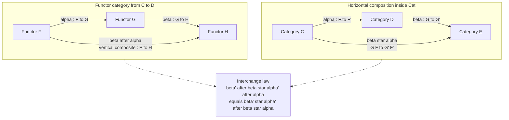

# 🔁 Functor Categories and Naturality

> [!abstract] TL;DR
> Given two categories $\mathcal{C}$ and $\mathcal{D}$, the **functor category** $[\mathcal{C}, \mathcal{D}]$ (also written $\mathcal{D}^{\mathcal{C}}$ or $\mathrm{Fun}(\mathcal{C},\mathcal{D})$) has **functors** $\mathcal{C} \to \mathcal{D}$ as its *objects* and **natural transformations** between them as its *morphisms*. The very recipe "objects + arrows + composition" is applied one level up — functors become the new points, naturality becomes the new arrows — and this self-similarity, formalized by the **interchange law** that makes $\mathbf{Cat}$ a **2-category**, is the engine of the entire subject.

---

## Intuition

**Analogy.** Imagine each functor $\mathcal{C} \to \mathcal{D}$ is a *translation* of one language into another — a consistent way of rewriting every word (object) and every sentence (morphism) of $\mathcal{C}$ in $\mathcal{D}$. A **natural transformation** is a *dictionary edit*: a rule that rewrites one whole translation into another, word by word, in a way that respects sentence structure. Now step back: you have a set of translations, and edits that turn one translation into another, and you can chain edits. That is *exactly* the "points-and-arrows" shape of a category again — you have built a **category of translations**.

The punchline is that the pattern eats itself. The same objects-and-arrows recipe that defined $\mathcal{C}$ and $\mathcal{D}$ now applies to *the functors between them*. Two translations are "the same" precisely when there is a reversible edit between them — a **natural isomorphism**, i.e. an isomorphism in $[\mathcal{C}, \mathcal{D}]$. This one level of climbing is the first rung of an infinite ladder ($\text{sets} \to \text{categories} \to \text{2-categories} \to \cdots$), and functor categories are how you take the first step.

---

## How It Works

### Core Mechanics: the construction of $[\mathcal{C}, \mathcal{D}]$

Fix categories $\mathcal{C}$ (small) and $\mathcal{D}$. Define $[\mathcal{C}, \mathcal{D}]$ by:

1. **Objects** = functors $F : \mathcal{C} \to \mathcal{D}$.
2. **Morphisms** $F \to G$ = natural transformations $\alpha : F \Rightarrow G$. A natural transformation is a family of components $\alpha_X : F(X) \to G(X)$, one per object $X \in \mathcal{C}$, such that for every morphism $f : X \to Y$ the **naturality square** commutes:
$$G(f)\circ \alpha_X \;=\; \alpha_Y \circ F(f).$$
3. **Composition** = **vertical composition**. Given $\alpha : F \Rightarrow G$ and $\beta : G \Rightarrow H$, define $\beta \circ \alpha : F \Rightarrow H$ **componentwise**:
$$(\beta \circ \alpha)_X \;=\; \beta_X \circ \alpha_X.$$
4. **Identities** = the **identity natural transformation** $\mathrm{id}_F$ with $(\mathrm{id}_F)_X = \mathrm{id}_{F(X)}$.

**This really is a category.** The identity and associativity axioms hold because they hold *componentwise* in $\mathcal{D}$: at each object $X$, vertical composition is just composition in $\mathcal{D}$, which is already associative and unital. The naturality condition is closed under composition (paste two commuting squares side by side to get a commuting rectangle), so $\beta \circ \alpha$ is again natural. Thus the pattern "objects + arrows + composition" **recurses one level up** — the same axioms that governed $\mathcal{C}$ now govern $[\mathcal{C}, \mathcal{D}]$.

### Two compositions of natural transformations

Natural transformations can be composed in **two independent directions**, and the tension between them is the heart of higher category theory.

- **Vertical composition** ($\circ$) stacks transformations between functors that share the *same* source and target categories: $F \overset{\alpha}{\Rightarrow} G \overset{\beta}{\Rightarrow} H$, all $\mathcal{C} \to \mathcal{D}$. This is the composition *inside* $[\mathcal{C}, \mathcal{D}]$.
- **Horizontal composition** ($\ast$) chains transformations *across* a sequence of categories: given $\alpha : F \Rightarrow F'$ (functors $\mathcal{C} \to \mathcal{D}$) and $\beta : G \Rightarrow G'$ (functors $\mathcal{D} \to \mathcal{E}$), it produces $\beta \ast \alpha : G\!\circ\!F \Rightarrow G'\!\circ\!F'$ with component
$$(\beta \ast \alpha)_X \;=\; G'(\alpha_X)\circ \beta_{F(X)} \;=\; \beta_{F'(X)}\circ G(\alpha_X),$$
the two expressions agreeing by naturality of $\beta$.

**Whiskering** is the special case where one of the two transformations is an identity. Whiskering a natural transformation $\alpha : F \Rightarrow F'$ on the left by a functor $G$ gives $G\alpha := \mathrm{id}_G \ast \alpha$ with components $G(\alpha_X)$; whiskering on the right by a functor $K$ gives $\alpha K := \alpha \ast \mathrm{id}_K$ with components $\alpha_{K(X)}$. Every horizontal composite is a vertical composite of two whiskerings.

### The interchange law and the 2-category $\mathbf{Cat}$

The two compositions are not independent lawlessly — they satisfy the **interchange law**, the single coherence condition
$$(\beta' \circ \beta) \ast (\alpha' \circ \alpha) \;=\; (\beta' \ast \alpha') \circ (\beta \ast \alpha).$$
Reading it: doing all the *vertical* composites first and then the *horizontal* one equals doing the *horizontal* composites first and then the *vertical* one. This is precisely what lets you draw a grid of natural transformations ("pasting diagram") and evaluate it in any order.

Interchange makes the collection of **categories** (objects / 0-cells), **functors** (1-morphisms / 1-cells) and **natural transformations** (2-morphisms / 2-cells) into a **2-category** called $\mathbf{Cat}$ — the prototypical example of higher category theory. Notice that for *fixed* $\mathcal{C}, \mathcal{D}$, the 1-cells $\mathcal{C} \to \mathcal{D}$ and 2-cells between them assemble into the *hom-category* $\mathbf{Cat}(\mathcal{C}, \mathcal{D}) = [\mathcal{C}, \mathcal{D}]$. So the functor category is nothing but a hom-object of $\mathbf{Cat}$, and the interchange law is what makes those hom-objects compose coherently.

### Flow / Architecture



---

## Key Concepts

### Secondary — the one-sentence-per-idea version
- A **functor category** is a category whose *points are functors* and whose *arrows are natural transformations*. You already know what a category is; here you just plug in fancier points and arrows.
- Two functors are "the same" when there is a **natural isomorphism** between them — an arrow in $[\mathcal{C}, \mathcal{D}]$ that has an inverse, i.e. an isomorphism *object-to-object* in the functor category.
- The whole point: you can now treat "**all structures of a given shape at once**" as a single mathematical object with its own internal geometry.

### Undergraduate — the working definition
- **Construction.** $[\mathcal{C}, \mathcal{D}]$: objects are functors $F : \mathcal{C}\to\mathcal{D}$; morphisms are natural transformations; composition is **vertical** ($(\beta\circ\alpha)_X = \beta_X\circ\alpha_X$); identity is $\mathrm{id}_F$. The category axioms hold because they hold componentwise in $\mathcal{D}$.
- **Natural isomorphism = isomorphism in $[\mathcal{C}, \mathcal{D}]$.** A natural transformation $\alpha$ is a natural iso iff every component $\alpha_X$ is an isomorphism in $\mathcal{D}$ (the inverse components are then automatically natural). An **equivalence of categories** $\mathcal{C} \simeq \mathcal{D}$ is a pair of functors $F, G$ with natural isos $GF \cong \mathrm{id}_\mathcal{C}$ and $FG \cong \mathrm{id}_\mathcal{D}$ — a statement phrased entirely in functor categories.
- **Presheaf categories** $[\mathcal{C}^{\mathrm{op}}, \mathbf{Set}]$: contravariant functors into $\mathbf{Set}$. This is the natural home of the **Yoneda lemma** and one of the richest universes in mathematics (it is a *topos*).
- **Diagram categories** $[\mathcal{J}, \mathcal{C}]$: objects are diagrams of shape $\mathcal{J}$ in $\mathcal{C}$. **Limits and colimits** are functors $[\mathcal{J}, \mathcal{C}] \to \mathcal{C}$ (right/left adjoint to the constant-diagram functor).
- **Whiskering**: pre/post-composing a natural transformation with a functor, the building block of horizontal composition.

### Graduate — the structural view
- **Horizontal composition** $\ast$ and the **interchange law** $(\beta'\circ\beta)\ast(\alpha'\circ\alpha) = (\beta'\ast\alpha')\circ(\beta\ast\alpha)$ upgrade categories–functors–naturals into the **2-category $\mathbf{Cat}$**; $[\mathcal{C}, \mathcal{D}]$ is exactly the hom-category $\mathbf{Cat}(\mathcal{C},\mathcal{D})$.
- **Categorification / self-similarity ladder.** $\mathbf{Set}$ (0-categories of a sort) sits inside $\mathbf{Cat}$ (1-categories with 2-cells) sits inside $2\text{-}\mathbf{Cat}$ ... up to $\infty$-categories. Functor categories are the *first* rung: replacing elements by objects and equations by isomorphisms.
- **Endofunctors and monads.** For a single category $\mathcal{C}$, the endofunctor category $[\mathcal{C}, \mathcal{C}]$ is **monoidal** under functor composition (the unit is $\mathrm{id}_\mathcal{C}$). A **monoid in this monoidal category is exactly a monad** — the famous slogan "a monad is a monoid in the category of endofunctors." Here the monoidal product is *composition*, not the categorical product.
- **Presheaf topos.** $\widehat{\mathcal{C}} = [\mathcal{C}^{\mathrm{op}}, \mathbf{Set}]$ is complete, cocomplete, cartesian closed, and an elementary topos — the free cocompletion of $\mathcal{C}$. This is where diagrams, group/quiver **representations** ($\mathrm{Rep}(G) = [\mathbf{B}G, \mathbf{Vect}]$), and models of theories live.
- **Enriched and higher variants.** When $\mathcal{D}$ is enriched (e.g. in abelian groups, chain complexes, or $\infty$-groupoids), $[\mathcal{C}, \mathcal{D}]$ inherits the enrichment, and the interchange law generalizes to the coherence data of higher categories.

---

## Python Demo

```python
"""
Functor categories, naturality, and the interchange law — pure stdlib + matplotlib.

We model tiny FINITE POSET CATEGORIES: a chain 0 <= 1 <= ... <= n-1.
In a poset there is a UNIQUE morphism i -> j exactly when i <= j, so a morphism
is just the pair (i, j) with i <= j, and composition is transitivity.

  * A FUNCTOR chain(C) -> chain(D) is a monotone map, stored as a tuple of images.
  * A NATURAL TRANSFORMATION F => G has a component F(c) -> G(c) at each object c.
    In a poset every naturality square commutes automatically, so a nat trans
    exists (uniquely) iff  F(c) <= G(c)  for all c. We store its components.

We (1) build the functor category [C, D] = [2, 3] and verify the category axioms,
(2) implement VERTICAL and HORIZONTAL composition, (3) verify the INTERCHANGE LAW,
and (4) visualize [2, 3] as a graph: functors = nodes, nat transs = arrows.
"""
from itertools import product
import matplotlib.pyplot as plt

# --- finite poset category: objects 0..n-1, morphism (i, j) iff i <= j ----------
def chain(n):
    return list(range(n))

def compose(g, f):
    """Compose f: a->b then g: b->c, giving a->c (unique in a poset)."""
    (a, b), (b2, c) = f, g
    assert b == b2, "non-composable morphisms"
    return (a, c)

def on_morph(t, m):
    """A functor t (tuple of object images) acts on a morphism (i, j)."""
    i, j = m
    return (t[i], t[j])

# --- objects of [C, D]: the monotone maps C -> D --------------------------------
def functors(C, D):
    out = []
    for t in product(D, repeat=len(C)):
        if all(t[i] <= t[i + 1] for i in range(len(C) - 1)):   # monotone
            out.append(t)
    return out

# --- morphisms of [C, D]: natural transformations F => G ------------------------
def nat_trans(F, G):
    if all(F[c] <= G[c] for c in range(len(F))):
        return tuple((F[c], G[c]) for c in range(len(F)))   # components
    return None

def identity_nat(F):
    return tuple((F[c], F[c]) for c in range(len(F)))

def src_functor(alpha):  # recover F from components of alpha: F => F'
    return tuple(a[0] for a in alpha)

def tgt_functor(alpha):  # recover F' from components of alpha: F => F'
    return tuple(a[1] for a in alpha)

# --- composition of natural transformations ------------------------------------
def vertical(beta, alpha):
    """beta . alpha : F => H, componentwise (alpha: F=>G first, then beta: G=>H)."""
    return tuple(compose(beta[c], alpha[c]) for c in range(len(alpha)))

def horizontal(beta, alpha):
    """
    beta * alpha : (G . F) => (G' . F'),  alpha: F=>F' in [C,D], beta: G=>G' in [D,E].
    Component at c:  G'(alpha_c) . beta_{F(c)}   ==   beta_{F'(c)} . G(alpha_c).
    """
    F, Fp = src_functor(alpha), tgt_functor(alpha)
    G, Gp = src_functor(beta), tgt_functor(beta)
    comps = []
    for c in range(len(F)):
        a_c = (F[c], Fp[c])                       # alpha_c : F(c) -> F'(c) in D
        path1 = compose(on_morph(Gp, a_c),        # G'(alpha_c)
                        (G[F[c]], Gp[F[c]]))      #   . beta_{F(c)}
        path2 = compose((G[Fp[c]], Gp[Fp[c]]),    # beta_{F'(c)}
                        on_morph(G, a_c))         #   . G(alpha_c)
        assert path1 == path2, "naturality of beta must make the two formulas agree"
        comps.append(path1)
    return tuple(comps)

# ============================ 1. BUILD [C, D] = [2, 3] ==========================
C, D = chain(2), chain(3)
objs = functors(C, D)                              # the FUNCTORS (objects of [C,D])
homs = {}                                          # (F, G) -> nat trans
for F in objs:
    for G in objs:
        nt = nat_trans(F, G)
        if nt is not None:
            homs[(F, G)] = nt

print(f"[2, 3] has {len(objs)} functors (objects) and "
      f"{len(homs)} natural transformations (morphisms incl. identities).")
for F in objs:
    print("   functor  0|->{}  1|->{}".format(F[0], F[1]))

# ============================ 2. VERIFY CATEGORY AXIOMS =========================
# (a) identity law: id acts as a unit for vertical composition
for (F, G), nt in homs.items():
    assert vertical(nt, identity_nat(F)) == nt
    assert vertical(identity_nat(G), nt) == nt
# (b) closure + (c) associativity of vertical composition
for (F, G), a in homs.items():
    for (G2, H), b in homs.items():
        if G2 != G:
            continue
        ba = vertical(b, a)
        assert homs.get((F, H)) == ba, "vertical composite must be a morphism of [2,3]"
        for (H2, K), c3 in homs.items():
            if H2 != H:
                continue
            left = vertical(c3, vertical(b, a))
            right = vertical(vertical(c3, b), a)
            assert left == right, "vertical composition must be associative"
print("Category axioms verified: [2, 3] is a category (identity, closure, assoc).")

# ============================ 3. INTERCHANGE LAW ===============================
# Chains C=2 -> D=3 -> E=4, with vertical chains of nat transs on both sides.
F,  Fp,  Fpp  = (0, 0),    (0, 1),    (1, 2)          # functors C -> D
G,  Gp,  Gpp  = (0, 0, 1), (0, 1, 2), (1, 2, 3)       # functors D -> E
alpha  = nat_trans(F,  Fp)                            # F  => F'
alphap = nat_trans(Fp, Fpp)                           # F' => F''
beta   = nat_trans(G,  Gp)                            # G  => G'
betap  = nat_trans(Gp, Gpp)                           # G' => G''

lhs = horizontal(vertical(betap, beta), vertical(alphap, alpha))   # (b'.b)*(a'.a)
rhs = vertical(horizontal(betap, alphap), horizontal(beta, alpha)) # (b'*a').(b*a)
print("\nInterchange law:")
print("   (b'.b) * (a'.a) =", lhs)
print("   (b'*a') . (b*a) =", rhs)
assert lhs == rhs, "interchange law must hold"
print("   -> interchange law VERIFIED.")

# ============================ 4. VISUALIZE [2, 3] ==============================
# Nodes = functors placed at (image of 0, image of 1); arrows = COVERING nat transs.
def covers(F, G):
    if F == G or nat_trans(F, G) is None:
        return False
    for Z in objs:                                   # no strict Z with F < Z < G
        if Z in (F, G):
            continue
        if nat_trans(F, Z) is not None and nat_trans(Z, G) is not None:
            return False
    return True

pos = {Fn: (Fn[0], Fn[1]) for Fn in objs}            # x = F(0), y = F(1)
fig, ax = plt.subplots(figsize=(7, 6))
for F in objs:
    for G in objs:
        if covers(F, G):
            ax.annotate("", xy=pos[G], xytext=pos[F],
                        arrowprops=dict(arrowstyle="-|>", color="#7c3aed",
                                        lw=1.8, shrinkA=20, shrinkB=20))
for F, (x, y) in pos.items():
    ax.scatter([x], [y], s=1500, color="#2563eb", zorder=3, edgecolors="white")
    ax.text(x, y, "0↦{}\n1↦{}".format(F[0], F[1]),
            ha="center", va="center", color="white", fontsize=9, zorder=4)

ax.set_title("Functor category [2, 3]\nnodes = functors, arrows = covering natural transformations")
ax.set_xlabel("image of object 0")
ax.set_ylabel("image of object 1")
ax.set_xlim(-0.6, 2.6); ax.set_ylim(-0.6, 2.6)
ax.set_aspect("equal"); ax.grid(True, ls=":", alpha=0.4)
plt.tight_layout()
plt.savefig("functor_category_2_3.png", dpi=130)
print("\nSaved visualization -> functor_category_2_3.png")
# plt.show()
```

**What it shows.** The functor category $[2,3]$ turns out to be a 6-element poset (the monotone maps $\{0,1\}\to\{0,1,2\}$ ordered pointwise). The script enumerates its objects and morphisms, proves it satisfies the category axioms by checking identity, closure, and associativity *componentwise*, then constructs an explicit interchange-law instance across three chains $2\to 3\to 4$ and verifies $(\beta'\circ\beta)\ast(\alpha'\circ\alpha) = (\beta'\ast\alpha')\circ(\beta\ast\alpha)$ numerically. The plot renders the functor category as a graph — a concrete picture of "functors as points, natural transformations as arrows."

---

## Real-World Applications

> **Example — Haskell / functional programming.** A `Functor` in Haskell is a functor $\mathbf{Hask} \to \mathbf{Hask}$; a natural transformation is a polymorphic function `type Nat f g = forall a. f a -> g a` (parametricity *is* the naturality condition). Vertical composition is ordinary function composition of these polymorphic maps, and the endofunctor category $[\mathbf{Hask}, \mathbf{Hask}]$ being monoidal under composition is exactly why **"a monad is a monoid in the category of endofunctors"** — `return` is the unit and `join` is the multiplication. Optics and profunctor libraries lean directly on horizontal composition and interchange.

- **Semantics of variable binding.** Presheaf categories $[\mathcal{C}^{\mathrm{op}}, \mathbf{Set}]$ model contexts and names; the Fiore–Plotkin–Turi account of abstract syntax with binding and nominal sets both live in functor categories, and they underpin the categorical semantics of dependent type theory.
- **Databases.** A schema is a small category $\mathcal{C}$; a database *instance* is a functor $\mathcal{C} \to \mathbf{Set}$; the category of all instances is the functor category $[\mathcal{C}, \mathbf{Set}]$, and data migration is functor composition (Spivak's functorial data model).
- **Representation theory.** Representations of a group $G$ are the objects of $[\mathbf{B}G, \mathbf{Vect}]$; representations of a quiver $Q$ are the functor category on the free category of $Q$. Limits, colimits, and (co)kernels in these are computed pointwise.
- **Diagrams and universal constructions.** Every limit or colimit is a functor out of a diagram category $[\mathcal{J}, \mathcal{C}]$; treating "all diagrams of shape $\mathcal{J}$" as one category is what makes (co)limits themselves functorial and adjoint to the constant-diagram functor.

---

## Common Pitfalls

- **Mixing up the two levels.** In $[\mathcal{C}, \mathcal{D}]$ the *objects are functors* and the *morphisms are natural transformations*. Do not confuse a natural transformation's component $\alpha_X$ (a morphism in $\mathcal{D}$) with $\alpha$ itself (a morphism in $[\mathcal{C}, \mathcal{D}]$).
- **Forgetting naturality is a condition, not a gift.** Vertical composition preserves naturality only because commuting squares paste; when your base category is *not* a poset you must actually verify $G(f)\circ\alpha_X = \alpha_Y\circ F(f)$ for every $f$. (In the poset demo it is free — that is why the demo is finite and checkable.)
- **Size issues.** $[\mathcal{C}, \mathcal{D}]$ is locally small / legitimate when $\mathcal{C}$ is *small*; for large $\mathcal{C}$ you may need Grothendieck universes. Presheaf categories $[\mathcal{C}^{\mathrm{op}}, \mathbf{Set}]$ are the well-behaved case.
- **Confusing vertical and horizontal composition.** $\beta\circ\alpha$ needs matching source/target categories (same $\mathcal{C}, \mathcal{D}$); $\beta\ast\alpha$ chains *across* categories $\mathcal{C}\to\mathcal{D}\to\mathcal{E}$. The interchange law is exactly what keeps a grid of both unambiguous — evaluate it in either order.
- **Wrong monoidal product for "monad = monoid in endofunctors."** The relevant tensor on $[\mathcal{C}, \mathcal{C}]$ is *functor composition*, not the cartesian product of functors. Using the product gives applicative/monoidal functors, a different notion.
- **Assuming pointwise-iso implies a natural iso exists.** You first need an actual natural transformation $\alpha$; only *then* is "every component is iso" equivalent to "$\alpha$ is an iso in $[\mathcal{C}, \mathcal{D}]$." A pointwise family of isos that is not natural is not a natural isomorphism at all.

---

## Related Concepts

Verified vault links:

- [[Category_Theory]] — the parent overview; this note zooms into its "categories of functors $[\mathcal{C}, \mathcal{D}]$" remark and the 2-categorical structure.
- [[Representation_Theory]] — representations of a group or quiver *are* objects of a functor category $[\mathbf{B}G, \mathbf{Vect}]$; $\mathrm{Rep}(G)$ is abelian because (co)limits are pointwise.
- [[Mathematical_Logic_and_Set_Theory]] — presheaf categories $[\mathcal{C}^{\mathrm{op}}, \mathbf{Set}]$ are elementary toposes, the categorical-logic models of higher-order and dependent type theory.
- [[Algebraic_Geometry]] — sheaves are presheaves (functors $\mathcal{O}(X)^{\mathrm{op}} \to \mathbf{Set}$) satisfying a gluing condition; functor categories are the ambient universe.
- [[Fundamental_Group]] — the classic functor example $\pi_1 : \mathbf{Top}_* \to \mathbf{Grp}$; comparing such functors is what natural transformations formalize.
- [[Groups_and_Subgroups]] — a group as a one-object category $\mathbf{B}G$ makes $[\mathbf{B}G, \mathcal{D}]$ its category of actions/representations; monoids reappear as monoids in endofunctor categories (monads).
- [[Linear_Transformations]] — the target $\mathbf{Vect}$ of representation functors; naturality squares are commuting diagrams of linear maps.

Sibling Category Theory notes (to be created / wired by vault-linker): **Functors**, **Natural_Transformations**, **Categories_Objects_and_Morphisms**, **Isomorphisms_and_Special_Morphisms**, **Equivalence_of_Categories**, **The_Yoneda_Lemma**, **Presheaves_and_Representables**, **Diagrams_and_Commutativity**, **Limits_and_Colimits**, **Enriched_and_Higher_Categories**, **Monads_Categorically**, **Monoids_and_Monoidal_Categories**, **Cartesian_Closed_and_Topos_Theory**, and **Categorical_Logic_and_Type_Theory**.

---

## Review Questions

**Secondary.**
1. In your own words, what are the *objects* and the *morphisms* of the functor category $[\mathcal{C}, \mathcal{D}]$? Why is it fair to call it "the same pattern one level up"?

**Undergraduate.**
2. Prove that $[\mathcal{C}, \mathcal{D}]$ satisfies the associativity and identity axioms, reducing each to a fact about composition *in $\mathcal{D}$*. Then show a natural transformation is an isomorphism in $[\mathcal{C}, \mathcal{D}]$ iff each of its components is an isomorphism in $\mathcal{D}$.
3. Given functors $\mathcal{C} \xrightarrow{F,F'} \mathcal{D} \xrightarrow{G,G'} \mathcal{E}$ with $\alpha : F\Rightarrow F'$ and $\beta : G\Rightarrow G'$, write out both formulas for $(\beta\ast\alpha)_X$ and explain which naturality square proves they coincide.

**Graduate.**
4. State and prove the interchange law, and explain precisely how it upgrades $(\text{categories},\text{functors},\text{naturals})$ into the 2-category $\mathbf{Cat}$ with $[\mathcal{C},\mathcal{D}] = \mathbf{Cat}(\mathcal{C},\mathcal{D})$. Then, using that $[\mathcal{C},\mathcal{C}]$ is monoidal under composition, explain the slogan "a monad is a monoid in the category of endofunctors" and identify the unit and multiplication.

---

## Sources

- Saunders Mac Lane, *Categories for the Working Mathematician*, 2nd ed., Ch. II (functor categories, vertical/horizontal composition, interchange).
- Emily Riehl, *Category Theory in Context*, §1.7 and §E (functor categories, 2-category $\mathbf{Cat}$, whiskering).
- Tom Leinster, *Basic Category Theory*, Ch. 1–4 (natural transformations, functor categories, presheaves).
- Steve Awodey, *Category Theory*, 2nd ed., Ch. 7–8 (naturality, functor categories).
- nLab, "functor category", "2-category Cat", and "interchange law" — https://ncatlab.org/nlab/show/functor+category

---

#category-theory #functor-category #natural-transformation #interchange-law #2-category
