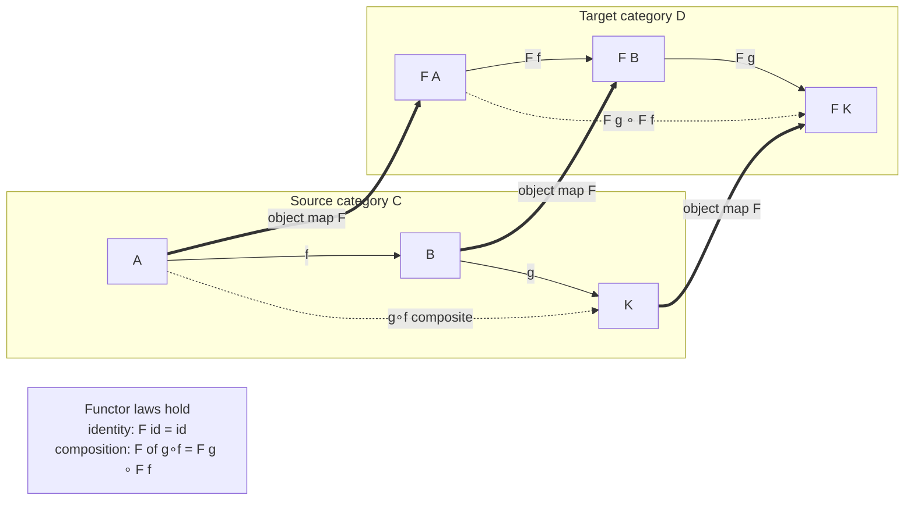

# 🔀 Functors

> [!abstract] TL;DR
> A **functor** `F : C → D` is a **structure-preserving map between categories** — the "morphism *of* categories," and one of the two central objects of category theory (natural transformations are the other). It is really two maps bundled together: an **object map** sending each object `A` of `C` to an object `F(A)` of `D`, and a **morphism map** sending each arrow `f : A → B` to an arrow `F(f) : F(A) → F(B)`. To count as a functor these must obey exactly **two laws**: it **preserves identities**, `F(id_A) = id_F(A)`, and it **preserves composition**, `F(g ∘ f) = F(g) ∘ F(f)`. That makes a functor a **homomorphism of categories** — a translation that respects the grammar of arrows, so patterns in `C` reappear intact in `D`. Functors are how we **transport a hard problem from one world into an easier one** (turn a topology question into an algebra question via `π₁`), and — under the names `Functor` and `fmap` — they are the everyday face of "mapping over a container" in Haskell, Scala, and Rust.

---

## Intuition

**Analogy — a faithful translator between two worlds.** Picture a category as a *world of objects joined by arrows*, and think of a functor as a **translator who moves you from one world to another without garbling the grammar**. A translator must do two things at once: render each *noun* (object) as a noun in the target language, and render each *verb/road* (morphism) as a road that starts and ends at the translated nouns. A good translation is not just a dictionary of words; it **preserves how sentences compose**. If in the source language "walk to the shop, then to the bank" is one journey, the translation of that combined journey must equal *translate-walk-to-shop, then translate-walk-to-bank*. And "stay put" (an identity) must translate to "stay put." A translator who honored the words but scrambled how they chained together would be useless — you could not trust any inference you made in the source world to survive.

That is exactly a functor. It maps objects to objects and arrows to arrows, and it is only *faithful to the structure* when **doing-nothing stays doing-nothing** (identities preserved) and **first-this-then-that stays first-this-then-that** (composition preserved). Because those two constraints hold, every commuting diagram, every equation between paths, every isomorphism in the source category is carried over intact — so you can reason in whichever world is easier and trust the answer in the other.

---

## How It Works

### Core mechanics

A functor `F : C → D` between two [[Category_Theory|categories]] `C` (the *source* or *domain*) and `D` (the *target* or *codomain*) is the data of **two maps plus two laws**.

**1. The object map.** To every object `A` of `C`, `F` assigns an object `F(A)` of `D`. Nothing is required of *how* it does this — it may collapse many objects to one, or hit only part of `D`.

**2. The morphism map.** To every morphism `f : A → B` of `C`, `F` assigns a morphism `F(f) : F(A) → F(B)` of `D`. The crucial constraint here is **on-the-nose typing**: the image arrow must run from `F(A)` to `F(B)`, the images of `f`'s own endpoints. A functor cannot send `f : A → B` to some random arrow of `D`; the source and target objects are pinned down by what `F` already did to `A` and `B`.

**3. Law one — preserves identities.** For every object `A`, `F(id_A) = id_F(A)`. The "do-nothing" arrow at `A` must become the "do-nothing" arrow at `F(A)`.

**4. Law two — preserves composition.** For every composable pair `f : A → B` and `g : B → C`, `F(g ∘ f) = F(g) ∘ F(f)`. Translating a composite equals composing the translations. This is the law that makes functors *interesting*: it forces `F` to respect the entire web of relationships, not just individual arrows.

Together these say a functor is a **homomorphism of categories** — precisely analogous to how a **group homomorphism** ([[Groups_and_Subgroups]]) preserves the identity element and the multiplication, or a continuous map preserves the topology. A category has *two* kinds of structure (objects and the composition of arrows), and a functor is the structure-preserving map for both at once.

### Covariant vs contravariant

The functor above is **covariant**: it *preserves arrow direction* (`f : A → B` becomes `F(f) : F(A) → F(B)`). A **contravariant functor** *reverses* every arrow: it sends `f : A → B` to `F(f) : F(B) → F(A)` and correspondingly flips the composition law to `F(g ∘ f) = F(f) ∘ F(g)`. The clean way to say this is that a contravariant functor on `C` is just an *ordinary covariant functor out of the **opposite category*** `C^op` (the category with all arrows reversed — the subject of the forthcoming **Duality_and_the_Opposite_Category** sibling). Contravariance is not exotic; it appears the moment something sits in an *input* position:

- The **hom-functor** `Hom(-, X) : C^op → Set` is contravariant: a map `f : A → B` induces *pre-composition* `Hom(B, X) → Hom(A, X)`, going backward.
- **Dual vector space** `V ↦ V*` and the **powerset-as-preimage** functor `X ↦ P(X)` with `f ↦ f⁻¹` are contravariant.
- In programming this is exactly **variance** ([[Subtyping_and_Variance]]): a container you only *read from* is covariant in its element type; a consumer/callback type `A → r` is **contravariant** in `A`.

The representable functors `Hom(A, -)` (covariant) and `Hom(-, A)` (contravariant) are the gateway to **The_Yoneda_Lemma** and **Presheaves_and_Representables** (forthcoming siblings).

### The diagram



*The double arrows are the object map; the solid arrows inside each box are morphisms. The dashed composite `g∘f` in `C` must land on `F(g) ∘ F(f)` in `D` — that equality is exactly the composition law.*

### Why functors matter

Functors are the **vehicle for comparing categories** and for **transporting problems** between them. The historically decisive example is the **fundamental-group functor** `π₁ : Top* → Grp`, which turns a pointed topological space into a group ([[Fundamental_Group]]). Because `π₁` is a functor, a continuous map of spaces becomes a group homomorphism, and *homeomorphic spaces get isomorphic groups* — so if the algebra differs, the spaces cannot be the same. This is how you prove a coffee mug's surface is not a sphere without ever "seeing" the hole: you translate the topology into algebra, where the question is decidable. Eilenberg and Mac Lane invented the *whole language* of categories, functors, and natural transformations in 1945 precisely to make this kind of "natural" translation rigorous — **category theory was born to define what a functor is.**

### Composition, endofunctors, and Cat

Functors **compose**: if `F : C → D` and `G : D → E`, then `G ∘ F : C → E` is a functor, composition is associative, and each category has an identity functor `Id_C`. So **categories and functors themselves form a category, `Cat`** — the pattern recurses one level up (functors between functor-categories are the theme of the forthcoming **Functor_Categories_and_Naturality**). A functor from a category *to itself*, `F : C → C`, is an **endofunctor**. Endofunctors are where the action is in programming and algebra: a **monad** is an endofunctor with extra structure ([[Monads_and_Effects]], and the forthcoming **Monads_Categorically**), and **F-algebras** — the semantics of recursive data types — live over an endofunctor (forthcoming **F_Algebras_and_Initial_Algebras**). The `List`, `Maybe`, and `Tree` type constructors are all endofunctors on the category of types.

### Classifying functors

Three properties describe *how tightly* a functor relates its source to its target, and they are the prelude to **Equivalence_of_Categories** (forthcoming):

- **Faithful** — injective on each hom-set `Hom(A, B) → Hom(F A, F B)` (loses no distinctions between parallel arrows).
- **Full** — surjective on each hom-set (hits every arrow between images).
- **Essentially surjective** — every object of `D` is isomorphic to some `F(A)`.

A functor that is full, faithful, and essentially surjective is an **equivalence of categories** — the "right" notion of two categories being the same.

---

## Key Concepts

**Secondary (explain to a curious beginner)**
- A functor is a **faithful translation between two worlds**: it renames the *things* and it re-routes the *arrows between them*, without breaking how arrows join up.
- Two rules make it faithful: **"stay put" translates to "stay put"** (identities) and **"do this then that" translates to "do the translation of this, then of that"** (composition).
- In everyday code, "**map over a list/box**" is a functor: `fmap f` applies `f` to every element and hands you back a container *of the same shape*.

**Undergraduate (a first algebra / FP course)**
- Formal definition: object map `A ↦ F(A)`, morphism map `f ↦ F(f)` with `F(f) : F(A) → F(B)`, subject to `F(id_A) = id_F(A)` and `F(g ∘ f) = F(g) ∘ F(f)`.
- A functor is a **homomorphism of categories** — the same idea as a group/ring homomorphism, one level up.
- **Covariant vs contravariant**; contravariant = covariant out of `C^op`; the hom-functors `Hom(A, -)` and `Hom(-, A)`.
- Canonical examples: **forgetful** `U : Grp → Set` (drop the structure, keep the underlying set), the **free** functor `Set → Grp` (build the free group on a set), the **powerset** functor, the **identity**, **constant**, and **diagonal** functors.
- Functors **compose** and form the category `Cat`; a functor `C → C` is an **endofunctor**.
- A **diagram of shape `J` in `C` is exactly a functor `J → C`** — functors formalize "a picture of a given shape" (forthcoming **Diagrams_and_Commutativity**, **Limits_and_Colimits**).

**Graduate (system-level / foundational)**
- **Faithful / full / essentially surjective**, and their combination as an **equivalence of categories**; fully faithful functors reflect isomorphisms.
- **Representable functors** `Hom(A, -)` and the Yoneda embedding `A ↦ Hom(-, A)` into presheaves `[C^op, Set]`.
- **Adjunctions**: the free–forgetful pair `Free ⊣ U` is the archetype (`Hom_Grp(Free S, G) ≅ Hom_Set(S, U G)`); every adjunction `F ⊣ G` yields a **monad** `T = G ∘ F` on the base category (forthcoming **Adjunctions**, **Monads_Categorically**).
- **Endofunctors** as the carriers of monads and F-algebras; `Free f` is the initial algebra of the syntax functor `f`.
- **Functoriality as naturality**: a construction being "functorial" is exactly the statement that it acts on morphisms coherently, which is what makes later comparisons by natural transformations possible.

---

## Python Demo

```python
# ======================================================================
# FUNCTORS, two faces of one idea.
#   PART 1 -- A functor between two FINITE categories, from scratch:
#             an OBJECT map + a MORPHISM map, and a checker that VERIFIES
#             the two functor laws (preserves IDENTITIES, preserves
#             COMPOSITION). We test a VALID functor and a BROKEN
#             "non-functor" that violates composition-preservation.
#   PART 2 -- The programming face: the LIST and MAYBE functors. `fmap`
#             lifts a plain function to act under the structure, and we
#             verify  fmap id = id  and  fmap (g . f) = fmap g . fmap f.
#   PART 3 -- VISUALIZE the object/morphism mapping between the two finite
#             categories, and the fmap composition law as a triangle.
# Pure standard library + matplotlib (no numpy needed).
# ======================================================================
from dataclasses import dataclass
from typing import Any, Dict, List, Tuple
import matplotlib.pyplot as plt

# ----------------------------------------------------------------------
# A small FINITE CATEGORY: objects, identities, and a composition table.
#   comp[(g, f)] = name of the arrow  g . f   (do f first, then g).
# ----------------------------------------------------------------------
@dataclass
class Category:
    name: str
    objects: List[str]
    src: Dict[str, str]                 # arrow name -> source object
    tgt: Dict[str, str]                 # arrow name -> target object
    ident: Dict[str, str]               # object     -> its identity arrow
    comp: Dict[Tuple[str, str], str]    # (g, f)      -> g . f

    def morphisms(self):
        return list(self.src.keys())

def build_category(name, objects, arrows, nontrivial):
    """arrows: {arrow: (src, tgt)} for NON-identity arrows.
       nontrivial: {(g, f): result} for the interesting composites."""
    src, tgt, ident = {}, {}, {}
    for o in objects:                       # every object gets an identity arrow
        i = "id" + o
        src[i] = tgt[i] = o
        ident[o] = i
    for m, (s, t) in arrows.items():
        src[m], tgt[m] = s, t
    comp = {}
    for m in list(src.keys()):              # identity laws populate the table
        comp[(ident[tgt[m]], m)] = m        #   id . m = m
        comp[(m, ident[src[m]])] = m        #   m . id = m
    comp.update(nontrivial)                 # the genuine composites
    return Category(name, objects, src, tgt, ident, comp)

# Source category C:  A --f--> B --g--> K,   with the composite  gf = g . f
C = build_category(
    "C", ["A", "B", "K"],
    {"f": ("A", "B"), "g": ("B", "K"), "gf": ("A", "K")},
    {("g", "f"): "gf"},
)
# Target category D:  X --u--> Y --v--> Z,   composite vu = v . u,
#                     PLUS a second, parallel arrow  w : X -> Z  (w != vu).
D = build_category(
    "D", ["X", "Y", "Z"],
    {"u": ("X", "Y"), "v": ("Y", "Z"), "vu": ("X", "Z"), "w": ("X", "Z")},
    {("v", "u"): "vu"},
)

# ----------------------------------------------------------------------
# A functor is an OBJECT map + a MORPHISM map. Check the two laws.
# ----------------------------------------------------------------------
def check_functor(C, D, obj, mor):
    problems = []
    # (0) well-typed: F(f) must run from F(src f) to F(tgt f)
    for m in C.morphisms():
        fm = mor[m]
        if D.src[fm] != obj[C.src[m]] or D.tgt[fm] != obj[C.tgt[m]]:
            problems.append(f"typing: F({m}) has wrong endpoints")
    # (1) preserves IDENTITIES:  F(id_A) = id_{F(A)}
    id_ok = True
    for o in C.objects:
        if mor[C.ident[o]] != D.ident[obj[o]]:
            id_ok = False
            problems.append(f"identity: F(id{o}) = {mor[C.ident[o]]} != id{obj[o]}")
    # (2) preserves COMPOSITION:  F(g . f) = F(g) . F(f)
    comp_ok = True
    for (g, f), gf in C.comp.items():
        left  = mor[gf]                          # F(g . f)
        right = D.comp[(mor[g], mor[f])]         # F(g) . F(f)
        if left != right:
            comp_ok = False
            problems.append(
                f"composition: F({g}.{f}) = {left}  !=  {mor[g]}.{mor[f]} = {right}")
    return id_ok, comp_ok, problems

# VALID functor:  A,B,K -> X,Y,Z  and  f,g,gf -> u,v,vu  (identities to identities)
F_obj = {"A": "X", "B": "Y", "K": "Z"}
F_mor = {"idA": "idX", "idB": "idY", "idK": "idZ",
         "f": "u", "g": "v", "gf": "vu"}

# BROKEN "non-functor": identical EXCEPT it sends the composite gf to w.
# It is still type-correct (w : X -> Z), so ONLY the composition law breaks.
B_obj = dict(F_obj)
B_mor = dict(F_mor); B_mor["gf"] = "w"

print("=== PART 1: functor between two finite categories ===")
for label, (obj, mor) in [("VALID   F", (F_obj, F_mor)),
                          ("BROKEN  B", (B_obj, B_mor))]:
    id_ok, comp_ok, problems = check_functor(C, D, obj, mor)
    verdict = "IS a functor" if (id_ok and comp_ok) else "is NOT a functor"
    print(f"  {label}: identities={id_ok}  composition={comp_ok}  ->  {verdict}")
    for p in problems:
        print(f"      violation -> {p}")

# ----------------------------------------------------------------------
# PART 2: the programming functors  LIST  and  MAYBE.
#   fmap lifts a plain function to act UNDER the structure.
# ----------------------------------------------------------------------
def identity(x):          return x
def compose(g, f):        return lambda x: g(f(x))      # (g . f)(x) = g(f(x))

def list_fmap(fn, xs):    return [fn(x) for x in xs]    # map over a list, same shape

@dataclass(frozen=True)
class Just:  value: Any
@dataclass(frozen=True)
class Nothing: pass

def maybe_fmap(fn, m):                                   # map "inside" a Maybe
    return Just(fn(m.value)) if isinstance(m, Just) else m

f_ = lambda x: x + 1
g_ = lambda x: x * 2                                     # (g . f)(x) = (x + 1) * 2

print("\n=== PART 2: the LIST and MAYBE functors (fmap) ===")
xs = [1, 2, 3, 4]
# Law 1: fmap id = id
list_id = (list_fmap(identity, xs) == xs)
# Law 2: fmap (g . f) = fmap g . fmap f
list_comp = (list_fmap(compose(g_, f_), xs)
             == list_fmap(g_, list_fmap(f_, xs)))
print(f"  List : fmap id == id            -> {list_id}")
print(f"  List : fmap (g.f) == fmap g . fmap f -> {list_comp}")
print(f"         [1,2,3,4] --fmap f--> {list_fmap(f_, xs)}"
      f" --fmap g--> {list_fmap(g_, list_fmap(f_, xs))}")

maybe_id = all(maybe_fmap(identity, m) == m for m in [Just(10), Nothing()])
maybe_comp = all(maybe_fmap(compose(g_, f_), m)
                 == maybe_fmap(g_, maybe_fmap(f_, m))
                 for m in [Just(10), Nothing()])
print(f"  Maybe: fmap id == id            -> {maybe_id}")
print(f"  Maybe: fmap (g.f) == fmap g . fmap f -> {maybe_comp}")
print(f"         Just(10) --fmap (g.f)--> {maybe_fmap(compose(g_, f_), Just(10))}"
      f" ;  Nothing() --fmap--> {maybe_fmap(compose(g_, f_), Nothing())}")

# ----------------------------------------------------------------------
# PART 3: VISUALIZE.  Left: the object/morphism map C -> D.
#                     Right: the fmap composition law as a triangle.
# ----------------------------------------------------------------------
fig, (axL, axR) = plt.subplots(1, 2, figsize=(14, 6))

def draw_arrow(ax, p, q, label, color, rad=0.0, style="-"):
    ax.annotate("", xy=q, xytext=p,
                arrowprops=dict(arrowstyle="-|>", color=color, lw=1.8,
                                linestyle=style,
                                connectionstyle=f"arc3,rad={rad}"))
    ax.text((p[0]+q[0])/2 + 0.10, (p[1]+q[1])/2 + 0.28*rad + 0.05,
            label, color=color, fontsize=9, ha="left", va="center")

posC = {"A": (0.0, 2.0), "B": (0.0, 1.0), "K": (0.0, 0.0)}
posD = {"X": (3.0, 2.0), "Y": (3.0, 1.0), "Z": (3.0, 0.0)}
for name, (x, y) in {**posC, **posD}.items():
    axL.plot(x, y, "o", ms=13, color="#2563eb", zorder=3)
    axL.text(x - 0.22, y, name, fontsize=12, ha="right", va="center", fontweight="bold")
# morphisms of C
draw_arrow(axL, posC["A"], posC["B"], "f", "#333")
draw_arrow(axL, posC["B"], posC["K"], "g", "#333")
draw_arrow(axL, posC["A"], posC["K"], "g.f", "#888", rad=-0.55, style=":")
# morphisms of D
draw_arrow(axL, posD["X"], posD["Y"], "u", "#333")
draw_arrow(axL, posD["Y"], posD["Z"], "v", "#333")
draw_arrow(axL, posD["X"], posD["Z"], "vu = v.u", "#059669", rad=-0.55, style=":")
draw_arrow(axL, posD["X"], posD["Z"], "w (extra)", "#C44E52", rad=0.55, style=":")
# the OBJECT MAP F: dashed horizontal arrows
for o in ["A", "B", "K"]:
    draw_arrow(axL, posC[o], posD[F_obj[o]], "F", "#7c3aed", style="--")
axL.set_title("A functor F : C -> D\nobjects to objects, arrows to arrows,\n"
              "composite g.f  ->  F(g).F(f) = vu (green, not w)")
axL.set_xlim(-1.2, 4.4); axL.set_ylim(-0.8, 2.8); axL.axis("off")

# Right: fmap composition-law triangle for the List functor.
xs1 = list_fmap(f_, xs)          # [2,3,4,5]
xs2 = list_fmap(g_, xs1)         # [4,6,8,10]
nodes = {"L0": (0.1, 0.75, str(xs)), "L1": (0.85, 0.75, str(xs1)),
         "L2": (0.85, 0.15, str(xs2))}
for _, (x, y, txt) in nodes.items():
    axR.text(x, y, txt, ha="center", va="center", fontsize=11,
             bbox=dict(boxstyle="round,pad=0.4", fc="#eef", ec="#2563eb"))
def rarrow(p, q, label, color, rad=0.0):
    axR.annotate("", xy=q, xytext=p, xycoords="axes fraction",
                 arrowprops=dict(arrowstyle="-|>", color=color, lw=2,
                                 connectionstyle=f"arc3,rad={rad}"))
    axR.text((p[0]+q[0])/2, (p[1]+q[1])/2 + 0.05, label,
             color=color, fontsize=10, ha="center")
rarrow((0.25, 0.78), (0.68, 0.78), "fmap f", "#333")
rarrow((0.85, 0.66), (0.85, 0.27), "fmap g", "#333")
rarrow((0.20, 0.70), (0.78, 0.22), "fmap (g.f)", "#059669", rad=-0.25)
axR.text(0.5, 0.02, "both paths give the SAME list  ->  "
                    "fmap (g.f) = fmap g . fmap f",
         ha="center", fontsize=10, color="#059669", fontweight="bold")
axR.set_title("The List functor obeys the composition law")
axR.axis("off")

fig.suptitle("Functors preserve identities and composition -- "
             "in a finite category and in code", fontsize=13)
fig.tight_layout()
plt.savefig("functors.png", dpi=130)
print("\nSaved figure to functors.png")
```

Running it confirms the theory in two registers. In Part 1 the **valid** functor passes both laws while the **broken** map is reported as *not a functor* — its only sin is sending the composite `gf` to the extra parallel arrow `w`, so `F(g ∘ f) = w` but `F(g) ∘ F(f) = v ∘ u = vu`, and the checker prints exactly that composition violation (identities and typing are fine). In Part 2 both the **List** and **Maybe** `fmap` satisfy `fmap id = id` and `fmap (g ∘ f) = fmap g ∘ fmap f` — the *same two laws* as the finite functor, now over type constructors. The figure shows the object/morphism map `C → D` (with the green composite `vu` as the *correct* image and the red `w` as the trap) and the List functor's composition law as a triangle whose two paths land on the identical list.

---

## Real-World Applications

> **Example — `π₁ : Top* → Grp`, the functor that founded algebraic topology (and category theory itself).** The **fundamental-group functor** takes a pointed topological space to its group of loops-up-to-deformation ([[Fundamental_Group]]), and — because it is a *functor* — takes a continuous map to a group homomorphism, with `π₁(g ∘ f) = π₁(g) ∘ π₁(f)`. That single property is what lets you *transport a hard topology problem into easy algebra*: to show a disk and a punctured plane are not homeomorphic, compare `π₁` (trivial vs `ℤ`); to prove Brouwer's fixed-point theorem, apply `π₁` to a hypothetical retraction and derive an impossible group map. Eilenberg and Mac Lane abstracted *exactly this pattern* in 1945, and the words "functor" and "natural transformation" were coined to make it precise.

Beyond topology, functors are everywhere structure is transported systematically:

- **Functional programming — the `Functor` typeclass.** In Haskell, `Functor f` with `fmap :: (a -> b) -> f a -> f b` and the two laws *is a functor on the category of types* ([[Functional_Programming_Foundations]]). `List`, `Maybe`, `Either e`, `IO`, `Map k`, and parser/future types are all functors; `fmap` "maps over the container without disturbing its shape." Scala's `Functor` (Cats), Rust's `Option::map` / `Result::map` / `Iterator::map`, and Java's `Optional.map` / `Stream.map` are the same idea. The whole **Functor → Applicative → Monad** hierarchy ([[Monads_and_Effects]]) starts here: a **monad is an endofunctor** carrying extra structure.
- **Free–forgetful adjunctions.** The **forgetful** functor `U : Grp → Set` (throw away the group operation, keep the underlying set) and its left adjoint **free** functor (build the free group/monoid on a set) are the archetype of an adjunction; `Free ⊣ U` is why `[a]` (the free monoid on a type) is the canonical "list." This pattern recurs for vector spaces, modules, and monads.
- **Categorical databases (Spivak).** A database *schema* is a category, a database *instance* is a functor `Schema → Set`, and **data migration** between schemas is functor composition — a rigorous foundation for ETL and schema evolution.
- **Optics and machine learning.** "Lenses" and the **backprop-as-functor** result (Fong–Spivak–Tuyéras) present gradient-based learning as a functor between categories of parametrized maps, giving a compositional account of how neural-network layers chain.

---

## Common Pitfalls

- **Forgetting the laws — "a map that reorders isn't a functor."** Supplying an object map and a morphism map is *not enough*; both laws must hold. A `map`-like operation that shuffles, drops, or duplicates elements (changing the *shape*) breaks `fmap id = id` and is not a functor. Always verify identity- and composition-preservation, as the demo does.
- **Mismatched endpoints (typing).** `F(f)` must run from `F(A)` to `F(B)`, not to some unrelated object. Once you fix what `F` does to objects, the source and target of `F(f)` are *determined*; a "functor" whose arrow images have the wrong endpoints is ill-defined before the laws even come up.
- **Confusing covariant and contravariant.** The moment a type sits in an *input/negative* position (`A → r`, a consumer, a `Hom(-, X)`), the functor **reverses** arrows and flips the composition law. This is precisely the variance rule for generics ([[Subtyping_and_Variance]]); getting it backward produces unsound subtyping. When unsure, ask "does a map `A → B` induce something `F(A) → F(B)` or `F(B) → F(A)`?"
- **Assuming every type constructor is a functor.** Many are, but a constructor that uses its type variable in *both* input and output positions (e.g. `a -> a`) is neither covariant nor contravariant, and some "wrappers" cannot be given a lawful `fmap` at all.
- **Name collision with ML "functors."** In Standard ML / OCaml a "functor" is a *module-to-module function*. It is spiritually related (a structure-preserving map) but is **not** the category-theoretic functor of this note; don't conflate the two.
- **Thinking a functor must be injective or surjective.** A functor may collapse many objects to one (the **constant** functor) or ignore most of the target. "Structure-preserving" constrains *how* it maps arrows, not *how much* of `D` it reaches — that is what faithful/full/essentially-surjective classify.

---

## Related Concepts

- [[Category_Theory]] — the umbrella: objects + arrows + composition, and where functors sit as the maps *between* categories; this note is the deep dive on the "Functors" section there.
- [[Fundamental_Group]] — `π₁ : Top* → Grp`, the historically decisive functor turning topology into algebra; the example that motivated the entire language.
- [[Groups_and_Subgroups]] — the target of the forgetful/free functors; a functor is to categories what a **group homomorphism** is to groups (preserve identity + operation).
- [[Functional_Programming_Foundations]] — the `Functor` typeclass and `map`/`fmap` as the everyday programming face of this concept; the start of the Functor/Applicative/Monad hierarchy.
- [[Monads_and_Effects]] — a **monad is an endofunctor** with unit and multiplication; `fmap` is the functor layer beneath `bind`, and effects are organized functorially.
- [[Subtyping_and_Variance]] — covariance and contravariance in type systems *are* the covariant/contravariant distinction for functors on the category of types.

*Forthcoming Category Theory siblings referenced above — to be wikilinked once written — are **Categories_Objects_and_Morphisms**, **Natural_Transformations** (the next concept: how you compare two functors), **Duality_and_the_Opposite_Category**, **The_Yoneda_Lemma**, **Presheaves_and_Representables**, **Adjunctions**, **Monads_Categorically**, **F_Algebras_and_Initial_Algebras**, **Diagrams_and_Commutativity**, **Limits_and_Colimits**, **Functor_Categories_and_Naturality**, and **Equivalence_of_Categories**.*

---

## Review Questions

1. **(Secondary)** Using the "faithful translator" analogy, explain in your own words what the two functor laws demand. Why would a translation that got the individual words right but scrambled how phrases *combine* be useless — and which functor law rules that out?
2. **(Undergraduate)** Give the full definition of a functor `F : C → D` (object map, morphism map, both laws). Then explain the difference between a **covariant** and a **contravariant** functor, state how the composition law changes for the contravariant case, and give one concrete contravariant example (from math or from a programming type). Why is a contravariant functor on `C` "the same as" a covariant functor on `C^op`?
3. **(Graduate)** The fundamental group `π₁ : Top* → Grp` is a functor. (a) Explain precisely which data of `π₁` is the object map and which is the morphism map, and what `π₁(g ∘ f) = π₁(g) ∘ π₁(f)` buys you. (b) Sketch how functoriality of `π₁` lets you prove there is no retraction of the disk onto its boundary circle. (c) An adjunction `F ⊣ G` always yields a monad `T = G ∘ F` on the base category; for the free–forgetful pair `Set ⇄ Mon`, what endofunctor on `Set` do you get, and what is its unit?

---

## Sources

- Eilenberg, S. and Mac Lane, S. "General Theory of Natural Equivalences." *Transactions of the AMS* 58 (1945): 231–294 — the founding paper that introduced categories, functors, and natural transformations.
- Mac Lane, S. *Categories for the Working Mathematician*. 2nd ed. Springer, 1998 — Chapter I ("Categories, Functors, and Natural Transformations") is the standard reference.
- Riehl, E. *Category Theory in Context*. Dover, 2016 — Chapter 1 develops functors, (co)variance, and functoriality with modern examples (freely available from the author).
- Awodey, S. *Category Theory*. 2nd ed. Oxford University Press, 2010 — Chapters 1–2, a logician's introduction to categories and functors.
- Milewski, B. *Category Theory for Programmers*. Blurb, 2019 — the `Functor` typeclass, `fmap`, and endofunctors from a programming standpoint.

---

#category-theory #functors #structure-preserving #covariant #fmap
