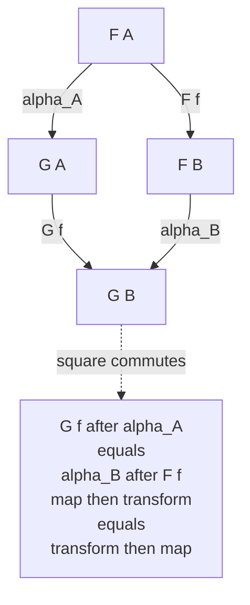

# ⇒ Natural Transformations

> [!abstract] TL;DR
> A **natural transformation** `α : F ⇒ G` is a *map between two functors* `F, G : C → D`: a whole **family** of component morphisms `α_A : F(A) → G(A)`, one for **every** object `A`, that fit together coherently — for every morphism `f : A → B` the **naturality square** `G(f) ∘ α_A = α_B ∘ F(f)` commutes. Category theory was *literally invented to define this concept*: Eilenberg and Mac Lane coined "category" and "functor" in 1945 only so they could make the informal phrase "**natural** / canonical / choice-free construction" precise. Naturality means the transformation uses **no arbitrary choices** — it works uniformly for all objects at once. In programming this is not an analogy but an *equality*: a **parametric polymorphic function** like `reverse : [a] → [a]` *is* a natural transformation, and its naturality square is Wadler's **free theorem** that it commutes with `map`.

---

## Intuition

**Analogy — two translations of the same book, and a consistent way to convert one into the other.** Suppose you have a single Chinese novel and two independent translators. Translator `F` renders it into English; translator `G` renders it into French. Each translator is a *functor*: they don't just translate the words (objects), they preserve the story's structure — every plot connection in the original (a morphism) survives in the translation. Now, a **natural transformation** `α : F ⇒ G` is a *systematic dictionary* that turns the English version into the French version — a component `α_A` for **each** chapter `A`, converting English-chapter into French-chapter.

What makes it **natural**? Consistency across the whole book at once, with **no arbitrary choices**. Whatever plot-link `f` connects chapter `A` to chapter `B`, you get the same French text whether you (i) follow the link in English and *then* convert to French, or (ii) convert chapter `A` to French *first* and then follow the corresponding French link. **Translate-then-convert equals convert-then-translate.** If your "dictionary" had to peek at *specific words* and make case-by-case decisions, it would break on some chapter — it would not be natural. Naturality is exactly the guarantee that a single uniform recipe works for every object simultaneously, because it never inspects the *contents*, only the *structure*.

The single most famous instance in mathematics: a finite-dimensional vector space `V` is **naturally** isomorphic to its **double dual** `V**` — the isomorphism `v ↦ (φ ↦ φ(v))` needs no choices at all. But `V` is only *un*-naturally isomorphic to its *single* dual `V*`: to build that iso you must **choose a basis**, an arbitrary act. Same dimension, "isomorphic" — yet one construction is canonical and the other is not. Naturality is the mathematics that tells these two situations apart.

---

## How It Works

### The definition

Fix two functors `F, G : C → D`. A **natural transformation** `α : F ⇒ G` (read "`α` from `F` to `G`") consists of:

1. **Components.** For each object `A` of the source category `C`, a morphism in the *target* category `D`
   $$α_A : F(A) → G(A).$$
   One arrow per object. Nothing yet forces these arrows to relate to each other.

2. **The naturality condition.** The components are *not* allowed to be arbitrary. For **every** morphism `f : A → B` in `C`, the following **naturality square** must commute:
   $$G(f) ∘ α_A \;=\; α_B ∘ F(f).$$

That equation is the entire content of the subject. Read it as **"map then transform equals transform then map."** Starting from `F(A)`, you can go *right* along the top with `α_A` and then *down* with `G(f)`, or go *down* the left with `F(f)` and then *right* along the bottom with `α_B` — and you must land on the **same** morphism into `G(B)`. The components are forced to "know about" all the morphisms; they must respect the structure **uniformly**, which is precisely why arbitrary, case-by-case, choice-laden families fail to be natural.

### Why category theory exists at all

This is not decoration — it is the origin story. In 1945 Samuel Eilenberg and Saunders Mac Lane wanted to make rigorous a phrase mathematicians had been using informally for decades: that some constructions are "**natural**" (the double-dual embedding) while others are merely "isomorphic after a choice" (the single dual). To *define* a natural transformation they first needed a source and target for `α`, which forced them to invent **functors**; and to define functors they first needed **categories**. The ladder was climbed *top-down*: **the goal was naturality, and categories and functors were the scaffolding required to state it.**

### The ladder of the whole subject

Natural transformations are one rung of a self-similar tower, where each level is a "morphism of the previous level":

- **objects** — the things.
- **morphisms** — maps between objects (inside one category).
- **functors** — maps between *categories* (structure-preserving).
- **natural transformations** — maps between *functors*.

The pattern does not stop: transformations of natural transformations give **2-morphisms**, and iterating generates **higher category theory** (2-categories, ∞-categories). Naturality is the seed of that entire hierarchy — this is developed in the forthcoming *Enriched and Higher Categories* note.

### The naturality square



### Composition of natural transformations

Natural transformations compose in **two independent directions**, and the way they interact is the deep structural fact.

- **Vertical composition.** Given `α : F ⇒ G` and `β : G ⇒ H` (same categories `C → D`), define `(β ∘ α) : F ⇒ H` **componentwise**: `(β ∘ α)_A = β_A ∘ α_A`. Each new square is two old squares stacked, so it commutes automatically. Under vertical composition the natural transformations `F ⇒ G` between fixed functors form the arrows of a **functor category** `[C, D]` (developed in the forthcoming *Functor Categories and Naturality* note): objects are functors, morphisms are natural transformations, and a **natural isomorphism** is just an isomorphism in that category.
- **Horizontal composition.** Given `α : F ⇒ G` (`C → D`) and `γ : F' ⇒ G'` (`D → E`), you can compose them "sideways" to get `γ ∗ α : F'F ⇒ G'G`. Together with vertical composition this makes categories, functors, and natural transformations into a **2-category** — the prototype of all higher structure.
- **The interchange law.** Where the two compositions meet they must agree: `(β' ∘ α') ∗ (β ∘ α) = (β' ∗ β) ∘ (α' ∗ α)`. This single coherence equation is what forces vertical and horizontal composition to live together consistently.

### Natural isomorphisms — the correct notion of "the same"

A natural transformation `α : F ⇒ G` is a **natural isomorphism** when *every* component `α_A` is an isomorphism in `D`. This is category theory's answer to "**when are two constructions canonically equivalent?**" — not merely "the same size" but "the same in a way that needs no choices." The inverses `α_A⁻¹` then automatically assemble into a natural transformation `G ⇒ F`. Two canonical examples:

- **Double dual:** the identity functor `Id ⇒ (−)**` on finite-dimensional vector spaces is a natural isomorphism; the single-dual `Id ≅ (−)*` is *not* natural (its components exist but do not commute with all linear maps without a chosen basis). See [[Linear_Transformations]].
- **Currying:** in a cartesian closed category there is a natural isomorphism `Hom(A × B, C) ≅ Hom(A, C^B)` — the mathematical heart of "a two-argument function is a one-argument function returning a function," treated in the forthcoming *Exponentials and Cartesian Closed Categories* note.

---

## Key Concepts

### Secondary (intuition-level)
- A functor turns one world into another while preserving connections; a **natural transformation** is a *consistent recipe* to convert one such world-translation into a second one, one piece at a time.
- The core picture is a **square with two paths**; "natural" means **both paths always give the same answer**, for every arrow, with no special-casing.
- "**Natural**" = **canonical** = **no arbitrary choices**. If your recipe ever has to say "well, for *this* object let me pick something," it is not natural.

### Undergraduate (formal core)
- **Definition:** `α : F ⇒ G` is a family `{α_A : F(A) → G(A)}` such that for all `f : A → B`, `G(f) ∘ α_A = α_B ∘ F(f)` (the **naturality square**).
- **Natural isomorphism:** every component is an iso; the honest meaning of "two functors are *the same*." Examples: `V ≅ V**`, currying `Hom(A×B,C) ≅ Hom(A,C^B)`.
- **Vertical composition** and the **functor category** `[C,D]`; a natural iso is an isomorphism there.
- **The determinant** `det : GL_n ⇒ (−)^×` is a natural transformation from the general-linear-group functor to the units-of-the-ring functor: `det(A·B) = det(A)·det(B)` naturally in the base ring — basis independence made structural. See [[Matrices_and_Determinants]].

### Graduate (structural / research-level)
- **Horizontal composition, the interchange law, and 2-categories:** natural transformations are the 2-cells of `Cat`.
- **The Yoneda lemma** is a theorem *about* natural transformations: `Nat(Hom(A,−), F) ≅ F(A)`, natural in both `A` and `F` — the culmination the whole subject builds toward (forthcoming *The Yoneda Lemma* note).
- **Adjunctions** are packaged by two natural transformations, the **unit** `η : Id ⇒ GF` and **counit** `ε : FG ⇒ Id`, satisfying the triangle identities (forthcoming *Adjunctions* note).
- **Monads** are exactly an endofunctor `T` with two natural transformations — **unit** `η : Id ⇒ T` and **multiplication** `μ : T² ⇒ T` — obeying coherence squares (forthcoming *Monads Categorically*; applied view in [[Monads_and_Effects]]).
- **Parametricity = naturality = dinaturality:** Reynolds' abstraction theorem interpreted via logical relations shows a parametric function is (di)natural; ends/coends make this precise.

---

## Python Demo

```python
"""
Natural transformations, verified in code.

A natural transformation  alpha : F => G  between functors F, G : C -> D
is a FAMILY of component morphisms  alpha_A : F(A) -> G(A), one per object A,
such that for EVERY morphism  f : A -> B  the NATURALITY SQUARE commutes:

        G(f) . alpha_A   ==   alpha_B . F(f)          ("map then transform
                                                        equals transform then map")

In programming, F and G are type constructors, the functor's action on
morphisms is fmap/map, and a component of a natural transformation is a
POLYMORPHIC function that never inspects the element VALUES -- only the
container SHAPE. Naturality is then precisely: the function COMMUTES WITH fmap.
That commuting square is Wadler's "free theorem".

We (1) build fmaps for List, Maybe and Const-Nat,
   (2) define three genuine natural transformations,
   (3) machine-check the naturality square over many f and many inputs,
   (4) exhibit a NON-natural family (sort) and watch the square break,
   (5) draw the commuting vs failing squares with matplotlib.
"""

import random
import matplotlib.pyplot as plt
from matplotlib.patches import FancyArrowPatch

# ---------------------------------------------------------------------------
# 1. Functor actions on MORPHISMS  (the "fmap" of each functor)
# ---------------------------------------------------------------------------
# List functor:   F(A) = list of A          F(f) = map f
def fmap_list(f, xs):
    return [f(x) for x in xs]

# Maybe functor:  G(A) = None | (x,)         model "Just x" as (x,), "Nothing" as None
def fmap_maybe(f, m):
    return None if m is None else (f(m[0]),)

# Const-Nat functor: K(A) = int (ignores A)  K(f) = identity  (a constant functor
# sends every morphism to the identity, so the "map" does nothing)
def fmap_const(f, n):
    return n

# ---------------------------------------------------------------------------
# 2. Candidate natural transformations -- each is ONE polymorphic function,
#    applied uniformly at every object (it is its own component everywhere).
# ---------------------------------------------------------------------------
def reverse(xs):        # reverse     : List => List
    return xs[::-1]

def length(xs):         # length      : List => Const-Nat
    return len(xs)

def head_option(xs):    # head_option : List => Maybe
    return None if not xs else (xs[0],)

def bad_sort(xs):       # sort        : List => List   -- NOT natural over Set!
    return sorted(xs)   # it must INSPECT and COMPARE values, so it depends on more
                        # than the shape; it is only natural over ordered maps.

# ---------------------------------------------------------------------------
# 3. The naturality-square checker:  G(f) . alpha  ==  alpha . F(f)  at value x
# ---------------------------------------------------------------------------
def naturality_at(alpha, fmap_F, fmap_G, f, x):
    left  = fmap_G(f, alpha(x))     # go RIGHT (alpha) then DOWN  (G f)
    right = alpha(fmap_F(f, x))     # go DOWN  (F f)  then RIGHT (alpha)
    return left == right, left, right

def check(name, alpha, fmap_F, fmap_G, morphisms, samples):
    ok = True
    for f in morphisms:
        for x in samples:
            passed, _, _ = naturality_at(alpha, fmap_F, fmap_G, f, x)
            ok = ok and passed
    print(f"  {name:14s} naturality holds for ALL tested f and x : {ok}")
    return ok

# ---------------------------------------------------------------------------
# 4. Run the checks
# ---------------------------------------------------------------------------
random.seed(1)
# a grab-bag of morphisms int -> (something). Genuine nat. transformations do not
# care whether the codomain type even matches the domain type.
morphisms = [
    lambda x: x * x,
    lambda x: -x,
    lambda x: x + 10,
    lambda x: str(x),          # int -> str : still fine, we only reshape structure
    lambda x: (x % 2 == 0),    # int -> bool
]
samples = [[random.randint(-9, 9) for _ in range(random.randint(0, 6))]
           for _ in range(200)]

print("Genuine natural transformations (commute with fmap):")
check("reverse",     reverse,     fmap_list, fmap_list,  morphisms, samples)
check("length",      length,      fmap_list, fmap_const, morphisms, samples)
check("head_option", head_option, fmap_list, fmap_maybe, morphisms, samples)

print("\nNon-natural family (sort) -- the square must break somewhere:")
neg = lambda x: -x
bad_ok = check("sort", bad_sort, fmap_list, fmap_list, [neg], samples)

# Show one explicit counterexample for sort with f = negate.
xs = [3, 1, 2]
_, path1, path2 = naturality_at(bad_sort, fmap_list, fmap_list, neg, xs)
print(f"    counterexample xs = {xs}, f = negate")
print(f"    G(f) . alpha_A(xs) = map(neg, sorted({xs})) = {path1}")
print(f"    alpha_B . F(f)(xs) = sorted(map(neg, {xs}))  = {path2}")
print(f"    equal? {path1 == path2}   -> sort is NOT a natural transformation")

# ---------------------------------------------------------------------------
# 5. Visualize the naturality squares with matplotlib
# ---------------------------------------------------------------------------
def draw_square(ax, title, tl, tr, bl, br, e_top, e_left, e_right, e_bot,
                commutes, br_alt=None):
    P = {"TL": (0.12, 0.82), "TR": (0.88, 0.82),
         "BL": (0.12, 0.18), "BR": (0.88, 0.18)}
    def node(pos, text, color="#1b2a4a"):
        ax.text(*P[pos], text, ha="center", va="center", fontsize=10,
                bbox=dict(boxstyle="round,pad=0.35", fc="#eef3fb", ec=color, lw=1.4))
    def arrow(a, b, label, dx=0.0, dy=0.0, color="#33475b"):
        pa, pb = P[a], P[b]
        ax.add_patch(FancyArrowPatch(pa, pb, arrowstyle="-|>", mutation_scale=16,
                                     shrinkA=20, shrinkB=20, color=color, lw=1.6))
        mx, my = (pa[0] + pb[0]) / 2 + dx, (pa[1] + pb[1]) / 2 + dy
        ax.text(mx, my, label, ha="center", va="center", fontsize=9,
                color=color, style="italic")
    node("TL", tl); node("TR", tr); node("BL", bl)
    arrow("TL", "TR", e_top, dy=0.05)
    arrow("TL", "BL", e_left, dx=-0.09)
    arrow("TR", "BR", e_right, dx=0.10)
    arrow("BL", "BR", e_bot, dy=-0.06)
    if commutes:
        node("BR", br, color="#1f8a4c")
        ax.text(0.5, 0.5, "commutes\nboth paths agree",
                ha="center", va="center", fontsize=10, color="#1f8a4c", weight="bold")
    else:
        # two conflicting bottom-right corners -> square fails
        ax.text(P["BR"][0], P["BR"][1] + 0.06, br, ha="center", va="center",
                fontsize=9, color="#c0392b",
                bbox=dict(boxstyle="round,pad=0.3", fc="#fdecea", ec="#c0392b"))
        ax.text(P["BR"][0], P["BR"][1] - 0.14, br_alt, ha="center", va="center",
                fontsize=9, color="#c0392b",
                bbox=dict(boxstyle="round,pad=0.3", fc="#fdecea", ec="#c0392b"))
        ax.text(0.5, 0.5, "DOES NOT commute\npaths disagree",
                ha="center", va="center", fontsize=10, color="#c0392b", weight="bold")
    ax.set_title(title, fontsize=11, weight="bold")
    ax.set_xlim(0, 1); ax.set_ylim(0, 1); ax.axis("off")

fig, (ax1, ax2) = plt.subplots(1, 2, figsize=(12, 5.4))

# LEFT: reverse : List => List with f = square, xs = [1,2,3]  (commutes)
draw_square(
    ax1, "reverse : List => List   (natural)",
    tl="F A = [1,2,3]", tr="G A = [3,2,1]",
    bl="F B = [1,4,9]", br="G B = [9,4,1]",
    e_top="alpha_A = reverse", e_left="F f = map sq",
    e_right="G f = map sq", e_bot="alpha_B = reverse",
    commutes=True)

# RIGHT: sort : List => List with f = negate, xs = [3,1,2]  (fails)
draw_square(
    ax2, "sort : List => List   (NOT natural)",
    tl="F A = [3,1,2]", tr="G A = [1,2,3]",
    bl="F B = [-3,-1,-2]", br="[-1,-2,-3]  (G f . alpha_A)",
    e_top="alpha_A = sort", e_left="F f = map neg",
    e_right="G f = map neg", e_bot="alpha_B = sort",
    commutes=False, br_alt="[-3,-2,-1]  (alpha_B . F f)")

fig.suptitle("Naturality squares:  G(f) . alpha_A  ==  alpha_B . F(f) ?",
             fontsize=13, weight="bold")
fig.tight_layout(rect=[0, 0, 1, 0.95])
fig.savefig("naturality_squares.png", dpi=130)
print("\nSaved figure -> naturality_squares.png")
```

**What the run shows.** `reverse`, `length`, and `head_option` pass the naturality square for **every** `f` and **every** input list — because none of them ever looks at the element *values*; they only rearrange or count *structure*, so they cannot help but commute with `map`. That commuting is not a coincidence you verified by luck; it is the **free theorem** guaranteed by the polymorphic type. `sort`, by contrast, must **compare** elements, so it depends on more than shape and its square breaks the instant you feed it a non-monotonic `f` such as negation: `map(neg, sorted([3,1,2])) = [-1,-2,-3]` while `sorted(map(neg,[3,1,2])) = [-3,-2,-1]`. `sort` is natural only over the *subcategory of order-preserving maps* — a precise diagnosis that naturality hands you for free.

---

## Real-World Applications

> **Example — parametric polymorphism and "theorems for free" (Haskell, Rust, GHC).** A function with signature `∀a. [a] → [a]` *is literally* a natural transformation `List ⇒ List`, and its naturality square is the theorem `g (map h xs) = map h (g xs)` — provable **from the type alone**, no code inspection. Compilers exploit exactly this: GHC's list-fusion rewrite rules (`foldr/build`) and stream fusion are justified by naturality, letting the optimizer delete intermediate lists because it *knows* the transformation commutes with `map`. This is the deep bridge developed in [[Polymorphism_and_System_F]] and [[Contextual_Equivalence_and_Reasoning]].

- **Monads and effect systems.** A monad's `return`/`pure` (unit `η : Id ⇒ T`) and `join` (multiplication `μ : T² ⇒ T`) are natural transformations; the monad laws are their coherence squares. Every `do`-block and effect handler rests on this ([[Monads_and_Effects]]).
- **Adjunctions everywhere.** Free/forgetful pairs, currying, Galois connections, and `Maybe`/exception handling are all adjunctions, packaged by the unit and counit *natural* transformations and their triangle identities.
- **Lenses and traversals (functional data access).** The van Laarhoven encoding of optics defines a `Traversable` structure by *naturality laws*; libraries like Haskell's `lens` and Scala's `Monocle` are correct precisely because these transformations are natural.
- **Determinant and characteristic classes (mathematics/physics).** `det : GL_n ⇒ (−)^×` being a natural transformation is why the determinant is basis-independent; the same pattern (natural transformations of functors) defines characteristic classes in topology.
- **The Yoneda lemma in practice.** CPS transforms, the Codensity monad, and "representable functor" tricks in probabilistic and differentiable programming are applications of the fact that natural transformations *out of a hom-functor* are just elements — the Yoneda lemma.

---

## Common Pitfalls

- **Confusing a component with the transformation.** `α_A` is *one* arrow at *one* object; the natural transformation `α` is the *entire coherent family plus the naturality condition*. A random collection of arrows `F(A) → G(A)` is almost never natural.
- **Forgetting the square must hold for EVERY morphism.** It is easy to define components object-by-object and declare victory. Naturality is a condition on *arrows*, not objects — you must check `G(f) ∘ α_A = α_B ∘ F(f)` for *all* `f`, and this is exactly where non-canonical, choice-laden constructions fail.
- **Thinking `V ≅ V*` is natural.** It is not — the iso to the *single* dual requires **choosing a basis** and does not commute with all linear maps. Only the **double** dual `V ≅ V**` is a natural isomorphism. Blurring these is the classic error the whole theory was built to prevent (see [[Linear_Transformations]]).
- **Assuming every polymorphic-looking function is natural.** If it inspects element *values* (needs `Eq`, `Ord`, `Hashable`, or pattern-matches on data), it is only natural over a *subcategory*. `sort`, `nub`, `group` are the standard traps — natural over order-/equality-preserving maps only.
- **Mixing up "isomorphic" and "naturally isomorphic" functors.** Components can all be isos *pointwise* while still failing to assemble into a natural iso if they do not commute with morphisms. Pointwise-iso is necessary, not sufficient.
- **Conflating vertical and horizontal composition.** They are different operations with different types; the **interchange law** is what relates them. Sloppiness here produces nonsense in 2-categorical arguments.

---

## Related Concepts

- [[Polymorphism_and_System_F]] — parametric polymorphism *is* naturality; a `∀a. [a]→[a]` function is a natural transformation and its free theorem is its naturality square.
- [[Contextual_Equivalence_and_Reasoning]] — logical relations / parametricity are the semantic machinery proving polymorphic functions are natural (dinatural).
- [[Monads_and_Effects]] — a monad's unit `η : Id ⇒ T` and multiplication `μ : T² ⇒ T` are natural transformations; the monad laws are their coherence squares.
- [[Functional_Programming_Foundations]] — functors and `fmap`/`map` are the setting in which "commutes with fmap" (= naturality) is stated and used.
- [[Linear_Transformations]] — the canonical example: `V ≅ V**` is natural, `V ≅ V*` is not (it needs a chosen basis).
- [[Matrices_and_Determinants]] — the determinant `det : GL_n ⇒ (−)^×` is a natural transformation, which is why it is basis-independent.

*Forthcoming Category_Theory siblings this note anchors to (to be linked once written):* **Functors** (source and target of every natural transformation), **Functor Categories and Naturality** (where natural transformations become the *arrows*), **Diagrams and Commutativity** (the naturality square is the paradigmatic commuting diagram), **Isomorphisms and Special Morphisms** (natural *isomorphism* as canonical equivalence), **Exponentials and Cartesian Closed Categories** (the currying natural iso `Hom(A×B,C) ≅ Hom(A,C^B)`), **Adjunctions** (unit and counit), **Monads Categorically** (`η` and `μ`), **The Yoneda Lemma** (a theorem *about* natural transformations), and **Enriched and Higher Categories** (horizontal composition, interchange, 2-categories).

---

## Review Questions

1. **(Conceptual)** State the naturality condition for `α : F ⇒ G` in words and in symbols, and explain precisely what goes wrong for the "isomorphism" `V ≅ V*` that makes it *not* a natural isomorphism, whereas `V ≅ V**` *is*. Why does "needs a chosen basis" translate into "the naturality square fails"?

2. **(Scenario)** You are handed a Haskell function `mystery :: forall a. [a] -> [a]` as a black box (you cannot see its source). Without running it on any concrete type, what theorem can you *prove* about how it interacts with `map`, and why does its **type alone** entail it? Then explain why the same guarantee does **not** apply to `sort :: Ord a => [a] -> [a]`, and identify the exact subcategory over which `sort` *is* natural.

3. **(Trade-off / proof)** Vertical composition of natural transformations is defined componentwise, `(β ∘ α)_A = β_A ∘ α_A`. Prove that `β ∘ α` satisfies the naturality condition, given that `α` and `β` each do. Then explain what *additional* structure horizontal composition adds, what the interchange law asserts, and why these two compositions together are what make categories, functors, and natural transformations into a 2-category.

---

## Sources

- [Eilenberg, S. & Mac Lane, S., "General Theory of Natural Equivalences", *Trans. AMS* 58 (1945)](https://www.ams.org/journals/tran/1945-058-00/S0002-9947-1945-0013131-6/) — the founding paper that introduced categories and functors *in order to* define natural transformations.
- [Mac Lane, S., *Categories for the Working Mathematician* (2nd ed., 1998), Ch. I §4](https://link.springer.com/book/10.1007/978-1-4757-4721-8) — the standard reference definition, functor categories, and interchange.
- [Riehl, E., *Category Theory in Context* (2016)](https://math.jhu.edu/~eriehl/context.pdf) — modern, free textbook treatment of natural transformations, natural isomorphisms, and Yoneda.
- [Wadler, P., "Theorems for Free!", *FPCA* (1989)](https://homepages.inf.ed.ac.uk/wadler/topics/parametricity.html) — establishes parametric polymorphism = naturality; the free theorem is the naturality square.
- [Milewski, B., "Natural Transformations", *Category Theory for Programmers* (2015)](https://bartoszmilewski.com/2015/04/07/natural-transformations/) — programmer-facing exposition connecting naturality to `fmap` and parametricity.
- [nLab, "natural transformation"](https://ncatlab.org/nlab/show/natural+transformation) — reference article with vertical/horizontal composition and 2-categorical structure.

---

#category-theory #natural-transformation #naturality #functor #polymorphism
