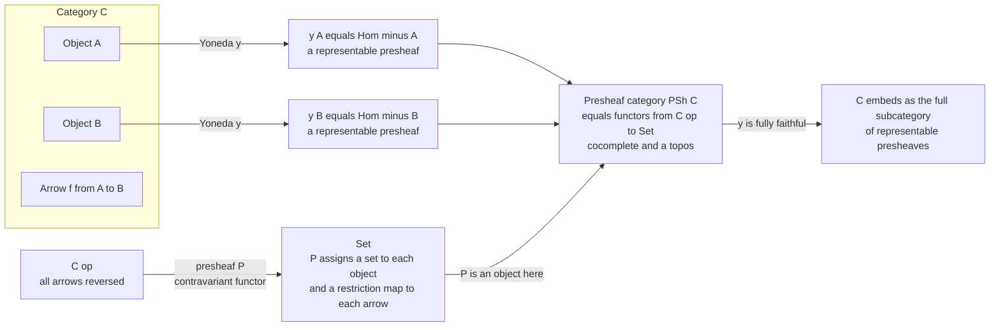

# 🌐 Presheaves and Representables

> [!abstract] TL;DR
> A **presheaf** on a category `C` is a **contravariant functor** `P: C^op -> Set` — it assigns a *set* to every object and, to each arrow `f: A -> B`, a **restriction map** `P(f): P(B) -> P(A)` running *backward*, functorially. Presheaves are "structured data laid over a shape that restricts consistently along arrows." The most fundamental ones are the **representables** `y(A) = Hom(-, A)` — the shadow an object casts by recording every arrow *into* it. The **Yoneda embedding** `y: C -> PSh(C)` places each object inside the presheaf category as its representable and is **fully faithful**, so *every category lives inside its presheaf category*. `PSh(C)` is the **free cocompletion** of `C` (every presheaf is a canonical colimit of representables) and is always an **elementary topos** — a universe of "generalized sets" with its own internal logic. Presheaves are the technical heart connecting objects to their functors-of-points, and the home of sheaf theory, categorical logic, and homotopy theory.

---

## Intuition

**Analogy — a weather map.** Imagine a region carved into overlapping patches, and to *each* patch you attach the set of all weather readings that could hold *there*. Over a big patch you record temperature-and-wind for the whole area; over a small patch tucked inside it, only the readings for that smaller area. The essential move is **restriction**: whenever a small patch sits inside a large one, there is a rule that takes any reading over the large patch and *cuts it down* to the corresponding reading over the small patch. Restriction runs *opposite* to inclusion — the arrow of geometry points small-into-large, but data flows large-down-to-small. That backward flow is exactly what "**contravariant**" means, and a presheaf is precisely this disciplined assignment of *data-sets to shapes plus consistent restriction maps*.

The technical picture generalizes this from "patches of a map" to "objects of any category `C`." A presheaf is **structured data indexed by a shape** `C`. And among all such data-assignments, the simplest and most important are the ones an object of `C` builds *about itself*: fix an object `A` and, over each object `U`, record the **set of arrows `U -> A`**. That is the **representable presheaf** `y(A) = Hom(-, A)` — the complete catalogue of how everything in `C` maps *into* `A`, i.e. the *shadow `A` casts across the whole category*. The Yoneda lemma will say this shadow is a *perfect likeness*: an object is fully determined by the representable it generates.

---

## How It Works

### Core mechanics

1. **A presheaf is a contravariant set-valued functor.** `P: C^op -> Set` gives:
   - to each object `A`, a set `P(A)` (its **sections** over `A`);
   - to each morphism `f: A -> B` in `C`, a **restriction** `P(f): P(B) -> P(A)` — note the reversal;
   - subject to **functoriality**: `P(id_A) = id_{P(A)}` and, contravariantly, `P(g o f) = P(f) o P(g)` (composites reverse order).
2. **The presheaf category.** All presheaves on `C`, with **natural transformations** as morphisms, form the functor category `PSh(C) = [C^op, Set]`. A map of presheaves `P => Q` is a family `α_A: P(A) -> Q(A)` commuting with every restriction (a naturality square).
3. **Representables.** For a fixed object `A`, the presheaf `y(A) = Hom(-, A)` sends `U` to the hom-set `Hom(U, A)` and sends `f: U -> V` to **precomposition** `(h: V -> A) |-> (h o f: U -> A)`. This is automatically a valid presheaf; precomposition is contravariant because `f` is fed in on the *left* of the input arrow.
4. **A presheaf is representable** if it is *naturally isomorphic* to some `y(A)`; that `A` is its **representing object**, unique up to isomorphism.
5. **The Yoneda embedding.** `y: C -> PSh(C)`, `A |-> Hom(-, A)`, sends a morphism `g: A -> B` to the natural transformation `y(g)` given by *postcomposition* `(h: U -> A) |-> (g o h: U -> B)`. The **Yoneda lemma** — `Nat(Hom(-, A), P) ≅ P(A)` — forces `y` to be **fully faithful**, so `C` sits inside `PSh(C)` as the full subcategory of representables (details in the *Yoneda Lemma* sibling note).
6. **`PSh(C)` is huge and well-behaved.** It has **all** small limits and colimits (computed pointwise in `Set`) even when `C` has none, and it is an **elementary topos** — cartesian closed with a subobject classifier.

### Sheaf motivation

Presheaves are the *underlying data* of **sheaves**. On a topological space `X`, take `C = Open(X)`, the poset of open sets (an arrow `U -> V` for `U ⊆ V`). A presheaf `F: Open(X)^op -> Set` assigns to each open `U` its set of **sections** `F(U)` — think continuous functions on `U`, or vector fields on `U` — with restriction `F(V) -> F(U)` for `U ⊆ V`. A **sheaf** adds a **gluing axiom**: sections that agree on overlaps glue uniquely to a section on the union. Presheaves record the local data; sheaves impose the locality-to-globality law. The whole language was born here, in geometry (see [[Topological_Spaces]]).

### Free cocompletion, topos, and the functor of points

- **Free cocompletion.** `PSh(C)` is the *universe of formal colimits* of `C`. The **co-Yoneda / density formula** says every presheaf `P` is a canonical colimit of representables — `P ≅ colim( y(A) )` over the category of elements of `P`. So `PSh(C)` is what you get by freely adjoining all colimits to `C`.
- **Topos.** Being an elementary topos, `PSh(C)` has an **internal logic** and behaves like a generalized set theory. Kripke models, variable binding, and much of categorical logic *live* inside presheaf toposes (the *Cartesian Closed and Topos Theory* and *Categorical Logic and Type Theory* siblings develop this).
- **Functor of points (Grothendieck).** Study a space or scheme through the presheaf it *represents* — its **functor of points**. An object is understood via the arrows into it; this is the modern foundation of algebraic geometry (see [[Algebraic_Geometry]]).



---

## Key Concepts

### Secondary (intuition level)
- **Presheaf = data over a shape.** Attach a *set of possible values* to every object, plus a rule that *cuts values down* along each arrow. Weather readings over patches of a map is the canonical picture.
- **Restriction runs backward.** Geometry points small-into-large; data restricts large-down-to-small. That reversal is all "contravariant" means here.
- **Representable = an object's shadow.** For a chosen object `A`, record over every object `U` the collection of arrows `U -> A`. That catalogue *is* the representable presheaf of `A`.

### Undergraduate (working definitions)
- **Contravariant functor.** `P: C^op -> Set` with `P(id) = id` and `P(g o f) = P(f) o P(g)`. Equivalent to an ordinary functor out of the **opposite category** (the *Duality and the Opposite Category* sibling).
- **Presheaf category.** `PSh(C) = [C^op, Set]`; objects are presheaves, morphisms are natural transformations. This is a special **functor category** (the *Functor Categories and Naturality* sibling).
- **The two Yoneda maps.** For `y(A) = Hom(-, A)`: restriction of the *presheaf* is **precomposition** `h |-> h o f`; the action of `y` on a *morphism* `g: A -> B` is **postcomposition** `h |-> g o h`. Keep the sides straight.
- **Representability.** `P` is representable iff `P ≅ Hom(-, A)` for some `A`; interpret this as "`P` is answered by a *universal object*." Many universal properties are literally the statement "a certain presheaf is representable."
- **Examples to hold in mind.**
  - **G-sets** are presheaves on a one-object category `BG` (a group `G` seen as a category): a set with a `G`-action, restriction = the action (see [[Groups_and_Subgroups]]).
  - **Directed graphs** are presheaves on the two-object category `. => .` (a set of edges, a set of vertices, two maps source/target); this ties to [[Graph_Theory]].
  - **Database instances** are presheaves/functors on a schema category: tables = sets over objects, foreign keys = restriction maps.

### Graduate (structure and theorems)
- **Yoneda lemma.** `Nat(Hom(-, A), P) ≅ P(A)`, natural in both `A` and `P`. Corollary: `y` is fully faithful, so `Hom_C(A, B) ≅ Nat(y(A), y(B))` — the category embeds on the nose.
- **Density / co-Yoneda.** Every `P ∈ PSh(C)` is a canonical colimit of representables indexed by its **category of elements** `∫ P`. Hence `PSh(C)` is the **free cocompletion** of `C`: for any cocomplete `D`, functors `C -> D` extend essentially uniquely to *colimit-preserving* functors `PSh(C) -> D`.
- **Bicompleteness.** `PSh(C)` has all small limits and colimits, computed **pointwise** in `Set`.
- **Cartesian closedness + subobject classifier.** `PSh(C)` is an **elementary topos**. The subobject classifier is the presheaf `Ω` of **sieves**; exponentials exist. This underwrites the internal logic and semantics of variable binding (Kripke-Joyal semantics).
- **Simplicial sets** are presheaves on the simplex category `Δ` — the combinatorial models of spaces at the center of homotopy theory and of [[Homotopy_Type_Theory]] via the model-categorical `sSet`.
- **Sheaves as a subcategory.** Sheaves on a site are presheaves satisfying a gluing (descent) condition; the sheaf topos is a **left-exact localization** of `PSh(C)`. Presheaf toposes are the ambient universe from which sheaf toposes are carved.

---

## Python Demo

```python
"""
Presheaves and Representables on tiny finite categories.

We (1) implement a finite category, (2) build a PRESHEAF as a contravariant
functor P: C^op -> Set with a restriction map per morphism and verify
functoriality CONTRAVARIANTLY, (3) construct the REPRESENTABLE presheaf
y(A) = Hom(-, A) and confirm it is a valid presheaf, (4) illustrate the
YONEDA EMBEDDING -- isomorphic objects give isomorphic representables while
non-isomorphic objects give non-isomorphic ones, (5) VISUALIZE a presheaf
(sets over a shape plus restriction maps) with matplotlib.

Pure standard library + matplotlib. No numpy required.
"""

from itertools import product
import matplotlib.pyplot as plt


# ----------------------------------------------------------------------
# 1. A minimal finite category
# ----------------------------------------------------------------------
class FiniteCategory:
    def __init__(self, objects, dom, cod, comp, ident):
        self.objects = list(objects)
        self.dom = dict(dom)        # morphism -> source object
        self.cod = dict(cod)        # morphism -> target object
        self.comp = dict(comp)      # (g, f) -> g o f, where f: a->b, g: b->c
        self.ident = dict(ident)    # object -> its identity morphism
        self.morphisms = list(dom.keys())

    def hom(self, a, b):
        "All morphisms a -> b."
        return [m for m in self.morphisms
                if self.dom[m] == a and self.cod[m] == b]

    def compose(self, g, f):
        "g after f."
        assert self.cod[f] == self.dom[g], "arrows are not composable"
        return self.comp[(g, f)]


# ----------------------------------------------------------------------
# 2. A presheaf is a pair (on_obj, on_mor); verify it CONTRAVARIANTLY
# ----------------------------------------------------------------------
def is_presheaf(cat, on_obj, on_mor):
    """
    on_obj: object -> frozenset  (the set P(A))
    on_mor: morphism f:A->B -> dict mapping P(B) -> P(A)  (restriction, BACKWARD)
    """
    # (a) identities act as identity: P(id_U) = id on P(U)
    for U in cat.objects:
        Pid = on_mor[cat.ident[U]]
        if any(Pid[x] != x for x in on_obj[U]):
            return False
    # (b) contravariance: for f:a->b, g:b->c we need P(g o f) = P(f) o P(g)
    for f in cat.morphisms:
        for g in cat.morphisms:
            if cat.cod[f] != cat.dom[g]:
                continue
            gf = cat.compose(g, f)          # gf : a -> c, so P(gf): P(c) -> P(a)
            P_gf = on_mor[gf]
            P_g = on_mor[g]                 # P(c) -> P(b)
            P_f = on_mor[f]                 # P(b) -> P(a)
            for x in on_obj[cat.cod[g]]:    # x ranges over P(c)
                if P_gf[x] != P_f[P_g[x]]:
                    return False
    return True


# ----------------------------------------------------------------------
# 3. The representable presheaf y(A) = Hom(-, A)
# ----------------------------------------------------------------------
def representable(cat, A):
    """y(A)(U) = Hom(U, A); on f:U->V it is precomposition h |-> h o f."""
    on_obj = {U: frozenset(cat.hom(U, A)) for U in cat.objects}
    on_mor = {}
    for f in cat.morphisms:
        U, V = cat.dom[f], cat.cod[f]                    # f: U -> V
        # y(A)(f): Hom(V, A) -> Hom(U, A), h |-> h o f
        on_mor[f] = {h: cat.compose(h, f) for h in cat.hom(V, A)}
    return on_obj, on_mor


def size_profile(cat, on_obj):
    "A computable invariant of a presheaf: the tuple of |P(U)| over objects."
    return tuple(len(on_obj[U]) for U in cat.objects)


def isomorphic_objects(cat, A, B):
    "Search for u:A->B and v:B->A with v o u = id_A and u o v = id_B."
    for u in cat.hom(A, B):
        for v in cat.hom(B, A):
            if (cat.compose(v, u) == cat.ident[A]
                    and cat.compose(u, v) == cat.ident[B]):
                return True
    return False


# ----------------------------------------------------------------------
# 4a. A category with an ISOMORPHISM: X ~= Y, plus a separate object Z
#     Morphisms: i:X->Y, j:Y->X (mutually inverse), f:X->Z, g=f o j:Y->Z
# ----------------------------------------------------------------------
def make_iso_category():
    objects = ["X", "Y", "Z"]
    dom = {"idX": "X", "idY": "Y", "idZ": "Z",
           "i": "X", "j": "Y", "f": "X", "g": "Y"}
    cod = {"idX": "X", "idY": "Y", "idZ": "Z",
           "i": "Y", "j": "X", "f": "Z", "g": "Z"}
    ident = {"X": "idX", "Y": "idY", "Z": "idZ"}
    comp = {}
    # identity laws
    for m in dom:
        comp[(ident[cod[m]], m)] = m
        comp[(m, ident[dom[m]])] = m
    # non-trivial composites (g after f notation)
    comp[("j", "i")] = "idX"   # j o i : X -> X
    comp[("i", "j")] = "idY"   # i o j : Y -> Y
    comp[("f", "j")] = "g"     # f o j : Y -> Z  (this DEFINES g)
    comp[("g", "i")] = "f"     # g o i = f o j o i = f o idX = f
    return FiniteCategory(objects, dom, cod, comp, ident)


# ----------------------------------------------------------------------
# 4b. The poset category of OPEN sets of X = {1, 2}  (sheaf-flavoured)
#     Arrow U -> V whenever U is a subset of V; a presheaf restricts along it.
# ----------------------------------------------------------------------
def make_open_poset():
    opens = [frozenset(), frozenset({1}), frozenset({2}), frozenset({1, 2})]
    dom, cod, ident = {}, {}, {}
    for U in opens:
        for V in opens:
            if U <= V:
                m = (U, V)              # the inclusion U -> V
                dom[m] = U
                cod[m] = V
                if U == V:
                    ident[U] = m
    comp = {}
    for f in dom:
        for g in dom:
            if cod[f] == dom[g]:        # f: U->V, g: V->W  =>  U->W
                comp[(g, f)] = (f[0], g[1])
    return FiniteCategory(opens, dom, cod, comp, ident)


def open_name(U):
    return "{" + ",".join(str(x) for x in sorted(U)) + "}" if U else "{}"


def bit_presheaf_on_opens(poset):
    """
    The presheaf of {0,1}-valued 'readings': a section over an open U is an
    assignment of a bit to each point of U (a string indexed by sorted(U)).
    Restriction along U subset V simply forgets the points outside U.
    """
    on_obj = {}
    for U in poset.objects:
        k = len(U)
        on_obj[U] = frozenset("".join(bits) for bits in product("01", repeat=k))

    def restrict(section_on_V, Vpts, Upts):
        index = {p: k for k, p in enumerate(Vpts)}
        return "".join(section_on_V[index[p]] for p in Upts)

    on_mor = {}
    for m in poset.morphisms:
        U, V = poset.dom[m], poset.cod[m]          # m: U -> V, so U subset V
        Vpts, Upts = sorted(V), sorted(U)
        on_mor[m] = {sV: restrict(sV, Vpts, Upts) for sV in on_obj[V]}
    return on_obj, on_mor


# ----------------------------------------------------------------------
# 5. Visualization: sets over the shape + restriction arrows
# ----------------------------------------------------------------------
def visualize_presheaf(on_obj, filename="presheaf_visualization.png"):
    pos = {
        frozenset({1, 2}): (0.50, 0.90),
        frozenset({1}):    (0.15, 0.50),
        frozenset({2}):    (0.85, 0.50),
        frozenset():       (0.50, 0.10),
    }
    # restriction edges point from the LARGER open down to the smaller one
    edges = [
        (frozenset({1, 2}), frozenset({1})),
        (frozenset({1, 2}), frozenset({2})),
        (frozenset({1}),    frozenset()),
        (frozenset({2}),    frozenset()),
    ]
    fig, ax = plt.subplots(figsize=(8, 6))
    for U, (x, y) in pos.items():
        contents = ", ".join(sorted(on_obj[U])) or "*"
        ax.scatter([x], [y], s=2600, color="#c7d2fe",
                   edgecolors="#3730a3", linewidths=1.8, zorder=3)
        ax.text(x, y + 0.055, open_name(U), ha="center", va="center",
                fontsize=11, fontweight="bold", zorder=4)
        ax.text(x, y - 0.02, "{" + contents + "}", ha="center", va="center",
                fontsize=8, zorder=4)
    for src, dst in edges:
        x1, y1 = pos[src]
        x2, y2 = pos[dst]
        ax.annotate("", xy=(x2, y2), xytext=(x1, y1),
                    arrowprops=dict(arrowstyle="-|>", color="#b91c1c",
                                    lw=1.8, shrinkA=30, shrinkB=30), zorder=2)
        ax.text((x1 + x2) / 2 + 0.03, (y1 + y2) / 2, "res",
                color="#b91c1c", fontsize=9, fontstyle="italic", zorder=5)
    ax.set_title("Presheaf on the opens of X = {1,2}:  sets P(U) + restriction maps",
                 fontsize=12)
    ax.set_xlim(-0.05, 1.05)
    ax.set_ylim(0.0, 1.0)
    ax.axis("off")
    plt.tight_layout()
    plt.savefig(filename, dpi=130)
    print(f"[saved figure] {filename}")


# ----------------------------------------------------------------------
# Run everything
# ----------------------------------------------------------------------
if __name__ == "__main__":
    # --- Representables + Yoneda on the iso-category ---
    C = make_iso_category()
    print("Objects of C:", C.objects)
    print("X is isomorphic to Y :", isomorphic_objects(C, "X", "Y"))
    print("X is isomorphic to Z :", isomorphic_objects(C, "X", "Z"))
    print()

    reps = {}
    for A in C.objects:
        on_obj, on_mor = representable(C, A)
        assert is_presheaf(C, on_obj, on_mor), f"y({A}) failed presheaf laws!"
        reps[A] = on_obj
        prof = dict(zip(C.objects, size_profile(C, on_obj)))
        print(f"y({A}) = Hom(-, {A})  is a valid presheaf;  |y({A})(U)| = {prof}")

    print()
    pX, pY, pZ = (size_profile(C, reps[A]) for A in ("X", "Y", "Z"))
    print("Yoneda embedding checks (size profile is a necessary iso-invariant):")
    print(f"  X ~= Y  and  profile(y(X)) == profile(y(Y)) ? "
          f"{isomorphic_objects(C,'X','Y')} / {pX == pY}  -> isomorphic representables")
    print(f"  X not~= Z and profile(y(X)) != profile(y(Z)) ? "
          f"{not isomorphic_objects(C,'X','Z')} / {pX != pZ} -> distinct representables")

    # --- A genuine (non-representable) presheaf on the open-set poset ---
    print()
    P = make_open_poset()
    on_obj, on_mor = bit_presheaf_on_opens(P)
    print("Bit-valued presheaf on opens of {1,2} is a valid presheaf :",
          is_presheaf(P, on_obj, on_mor))
    for U in sorted(P.objects, key=lambda s: (len(s), sorted(s))):
        print(f"  P({open_name(U)}) = {{{', '.join(sorted(on_obj[U])) or '*'}}}")

    visualize_presheaf(on_obj)
```

Expected output (abridged):

```
X is isomorphic to Y : True
X is isomorphic to Z : False

y(X) = Hom(-, X)  is a valid presheaf;  |y(X)(U)| = {'X': 1, 'Y': 1, 'Z': 0}
y(Y) = Hom(-, Y)  is a valid presheaf;  |y(Y)(U)| = {'X': 1, 'Y': 1, 'Z': 0}
y(Z) = Hom(-, Z)  is a valid presheaf;  |y(Z)(U)| = {'X': 1, 'Y': 1, 'Z': 1}

  X ~= Y  and  profile(y(X)) == profile(y(Y)) ? True / True  -> isomorphic representables
  X not~= Z and profile(y(X)) != profile(y(Z)) ? True / True -> distinct representables

Bit-valued presheaf on opens of {1,2} is a valid presheaf : True
```

The isomorphic objects `X ≅ Y` produce representables with *identical* section-size profiles (they are genuinely naturally isomorphic, by Yoneda), while the non-isomorphic `Z` produces a representable that differs already at the level of this invariant — a hands-on glimpse of "`y` is fully faithful."

---

## Real-World Applications

- **Algebraic geometry (functor of points).** Grothendieck's schemes are studied through the presheaf `Hom(-, S)` they represent on the category of rings/schemes. Moduli problems are posed as "is this presheaf representable?" — representability *is* the existence of a moduli space (see [[Algebraic_Geometry]]).
- **Homotopy theory and type theory.** **Simplicial sets** — presheaves on the simplex category `Δ` — are the standard combinatorial models of spaces and `∞`-groupoids, and the semantic backbone behind [[Homotopy_Type_Theory]].
- **Sheaf-based systems.** Sensor fusion, distributed data consistency, and geographic information systems formalize "local data that must agree on overlaps" as (pre)sheaves on a space or cover; presheaves are the raw layer before gluing (see [[Topological_Spaces]]).
- **Functorial / categorical databases.** A schema is a category, an instance is a presheaf/functor into `Set`, and data migration is composition with a functor between schemas. Representable presheaves act as **queries/probes** — "the set of ways to point into a record."
- **Names and binding in PL semantics.** The **Schanuel topos** (sheaves over finite name-sets) and **nominal sets** model variable binding, fresh-name generation, and `α`-equivalence as presheaf-style varying sets — the semantics of syntax with binders.

---

## Common Pitfalls

- **Getting the variance backward.** A presheaf is *contra*variant: an arrow `f: A -> B` yields `P(f): P(B) -> P(A)`. If your restriction maps go forward, you have written a covariant functor `C -> Set` (a "copresheaf"), not a presheaf. In the sheaf picture: inclusions go small-into-large, restriction goes large-down-to-small.
- **Confusing the two Yoneda directions.** In `y(A) = Hom(-, A)`, restriction of the *presheaf* is **precomposition** `h |-> h o f`; the action of the embedding on a *morphism* `g: A -> B` is **postcomposition** `h |-> g o h`. Mixing them breaks functoriality or naturality.
- **Thinking every presheaf is representable.** Representables are special (they have a representing object and a universal element). Most presheaves are *colimits* of representables, not representables themselves — that is the whole point of the density formula.
- **"Isomorphic sizes implies isomorphic presheaves."** Equal section-size profiles are only a *necessary* condition. Two presheaves can agree on all `|P(U)|` yet fail to be naturally isomorphic because no family of bijections commutes with restriction. (For representables, Yoneda upgrades object-iso to a *genuine* natural iso — that direction is safe.)
- **Forgetting naturality in maps of presheaves.** A morphism `P => Q` is not just a choice of `P(A) -> Q(A)` per object; every restriction square must commute. Skipping this yields a family that is not a natural transformation.
- **Size / smallness.** `PSh(C)` is "large"; for the Yoneda lemma and cocompletion to behave, `C` must be **locally small**. Ignoring this invites set-theoretic paradoxes (Grothendieck universes are the usual fix).

---

## Related Concepts

- [[Category_Theory]] — the parent framework: objects, arrows, functors, natural transformations, and the Yoneda lemma stated in brief; this note zooms into the presheaf universe.
- [[Homotopy_Type_Theory]] — its intended semantics runs through simplicial sets, i.e. presheaves on `Δ`; univalence lives in presheaf/`∞`-toposes.
- [[Topological_Spaces]] — the geometric origin: presheaves and sheaves of sections over the open-set poset `Open(X)`.
- [[Algebraic_Geometry]] — the functor-of-points method: a scheme is understood through the presheaf it represents; moduli = representability.
- [[Graph_Theory]] — directed graphs are exactly presheaves on the two-object "edge over vertex" category, a clean first example of `PSh(C)`.
- [[Groups_and_Subgroups]] — `G`-sets are presheaves on a group viewed as a one-object category; the group action *is* the restriction.
- [[Set_Theory_and_Relations]] — `Set` is the target of every presheaf and the prototypical topos that `PSh(C)` generalizes.
- [[Mathematical_Logic_and_Set_Theory]] — presheaf categories are elementary toposes with an internal higher-order logic; Kripke models are presheaves on a poset.

*(Forthcoming Category_Theory siblings referenced in prose above, to be wikilinked once created: The Yoneda Lemma, Functors, Duality and the Opposite Category, Functor Categories and Naturality, Limits and Colimits, Cartesian Closed and Topos Theory, Categorical Logic and Type Theory, Categorical Databases and Systems.)*

---

## Review Questions

**Secondary.**
1. Using the weather-map analogy, explain in your own words why a presheaf's restriction maps run *opposite* to the inclusion of patches. What does "contravariant" mean here?
2. What set does the representable presheaf `y(A)` assign to an object `U`, and why is `A`'s own identity arrow always an element of `y(A)(A)`?

**Undergraduate.**
3. Write out the presheaf structure of a **directed graph** as a functor on the category `. => .` (two objects, two parallel non-identity arrows). What are the two sets and the two maps, and which way do the maps go?
4. Show directly that `y(A) = Hom(-, A)` satisfies the contravariant functor laws: check `y(A)(id_U) = id` and `y(A)(g o f) = y(A)(f) o y(A)(g)` using precomposition.
5. Give a presheaf on some small `C` that is **not** representable, and justify why no single object represents it.

**Graduate.**
6. State the Yoneda lemma and deduce that `y: C -> PSh(C)` is fully faithful. Explain precisely why this makes "isomorphic objects yield isomorphic representables" and conversely.
7. Explain the sense in which `PSh(C)` is the **free cocompletion** of `C`. Sketch how the density (co-Yoneda) formula writes an arbitrary presheaf as a colimit of representables.
8. `PSh(C)` is an elementary topos. Describe its subobject classifier `Ω` in terms of **sieves**, and explain how sheaves arise as a left-exact localization of `PSh(C)`.

---

## Sources

- Saunders Mac Lane, *Categories for the Working Mathematician*, 2nd ed., Springer (1998) — Ch. III (Yoneda) and Ch. V (limits, presheaves).
- Saunders Mac Lane and Ieke Moerdijk, *Sheaves in Geometry and Logic: A First Introduction to Topos Theory*, Springer (1992) — presheaf toposes, sheafification, subobject classifier.
- Emily Riehl, *Category Theory in Context*, Dover (2016) — Ch. 2 (Yoneda), Ch. 6 (density, cocompletion); freely available from the author.
- Steve Awodey, *Category Theory*, 2nd ed., Oxford (2010) — Ch. 8 on the Yoneda embedding and presheaf categories.
- nLab, "presheaf" and "representable functor" — https://ncatlab.org/nlab/show/presheaf and https://ncatlab.org/nlab/show/representable+functor.

---

#category-theory #presheaf #representable-functor #yoneda-embedding #topos
