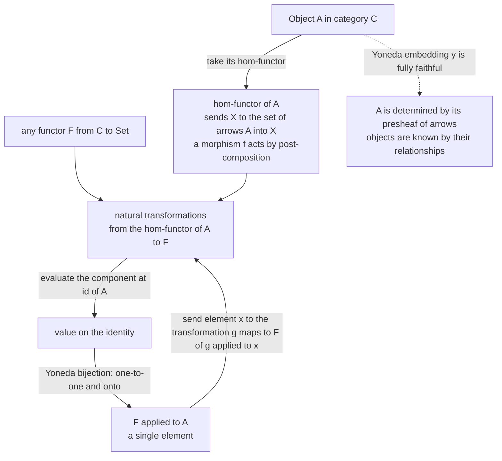

# 🕸️ The Yoneda Lemma

> [!abstract] TL;DR
> The **Yoneda lemma** is the deepest and most-quoted theorem in category theory: an object is *completely determined, up to isomorphism, by the entire web of morphisms into (or out of) it* — nothing about it is hidden from the arrows. Formally, for any functor $F: \mathcal{C} \to \mathbf{Set}$ and any object $A$, natural transformations from the hom-functor $\operatorname{Hom}(A,-)$ to $F$ are in **bijection** with the *elements* of $F(A)$: $\operatorname{Nat}(\operatorname{Hom}(A,-),\,F) \cong F(A)$, the bijection sending a transformation to its value on $\operatorname{id}_A$. Its corollary — the **Yoneda embedding** $\mathcal{C} \hookrightarrow [\mathcal{C}^{\operatorname{op}}, \mathbf{Set}]$ is fully faithful — makes "universal properties determine an object" rigorous, and it is why category theory can define things *externally* by relationships rather than *internally* by construction.

---

## Intuition

**Analogy — you are your relationships.** Suppose you want to know someone *completely*, but you are forbidden from dissecting them or looking inside. What can you do? You can watch how they relate to *everyone else*: who they call, how they respond to each person, how a message routed through them comes out the other side. The Yoneda lemma is the mathematical promise that this is *enough* — if you know the full pattern of every relationship an object participates in, and how those relationships transform when you change the "other person," then you know the object down to the last bit. There is nothing left over that the relationships cannot see.

Category theory takes this literally. An object $A$ in a category is surrounded by **arrows**: for every other object $X$ there is a set $\operatorname{Hom}(X, A)$ of morphisms into $A$ (or $\operatorname{Hom}(A, X)$ out of it — see [[Categories_Objects_and_Morphisms]]). Bundle all of those sets together, along with the rule for how they change as $X$ changes, and you get $A$'s "social profile." The Yoneda lemma says two objects with the same social profile are the same object, up to unique isomorphism. **You are known by your relationships; nothing is invisible to the morphisms.**

---

## How It Works

### The hom-functor: an object's profile of relationships

Fix an object $A$ in a (locally small) category $\mathcal{C}$. The **covariant hom-functor**

$$\operatorname{Hom}(A, -): \mathcal{C} \to \mathbf{Set}$$

sends each object $X$ to the *set* of morphisms $\operatorname{Hom}(A, X)$ ("all the ways out of $A$ into $X$"), and sends each morphism $f: X \to Y$ to the **post-composition** map

$$f \circ (-): \operatorname{Hom}(A, X) \to \operatorname{Hom}(A, Y), \qquad g \mapsto f \circ g.$$

The **contravariant** version $\operatorname{Hom}(-, A): \mathcal{C}^{\operatorname{op}} \to \mathbf{Set}$ instead records morphisms *into* $A$ and acts by pre-composition. Either is a genuine functor (see [[Functors]]) that packages up the *whole web* of $A$'s relationships as a set-valued functor. A functor of this form is called **representable**, and $A$ is its **representing object** ([[Presheaves_and_Representables]]).

### The statement

> **Yoneda Lemma.** For every functor $F: \mathcal{C} \to \mathbf{Set}$ and every object $A \in \mathcal{C}$, there is a bijection
> $$\operatorname{Nat}\big(\operatorname{Hom}(A,-),\, F\big) \;\cong\; F(A),$$
> **natural** in both $A$ and $F$. The bijection sends a natural transformation $\alpha$ to its value on the identity, $\alpha_A(\operatorname{id}_A) \in F(A)$.

The astonishing content: a natural transformation (see [[Natural_Transformations]]) *out of a representable functor is determined by a single element* — the image of the one identity morphism. Everything else is forced.

**Why the inverse works (proof sketch).** Given an element $u \in F(A)$, define a transformation $\alpha^u$ by
$$\alpha^u_X : \operatorname{Hom}(A, X) \to F(X), \qquad g \mapsto F(g)(u).$$
Naturality is exactly functoriality of $F$: for $f: X \to Y$, both routes around the naturality square send $g \mapsto F(f\circ g)(u)$. Conversely, given a natural transformation $\alpha$, the naturality square for an arbitrary $g: A \to X$ applied to $\operatorname{id}_A \in \operatorname{Hom}(A,A)$ forces $\alpha_X(g) = F(g)\big(\alpha_A(\operatorname{id}_A)\big)$. So $\alpha$ is entirely recovered from $u = \alpha_A(\operatorname{id}_A)$, and the two constructions are mutually inverse. $\;\blacksquare$

### The Yoneda embedding and its corollary

Applying the lemma with $F = \operatorname{Hom}(B, -)$ yields
$$\operatorname{Nat}\big(\operatorname{Hom}(A,-),\, \operatorname{Hom}(B,-)\big) \cong \operatorname{Hom}(B, A).$$
This says the assignment $A \mapsto \operatorname{Hom}(-, A)$ — the **Yoneda embedding** $y: \mathcal{C} \to [\mathcal{C}^{\operatorname{op}}, \mathbf{Set}]$ into the presheaf category (see [[Functor_Categories_and_Naturality]]) — is **fully faithful**: morphisms between objects correspond *exactly* to natural transformations between their representable presheaves. Consequently:

- Every category is (up to equivalence) a **full subcategory of a presheaf topos** — "every category sits inside a category of set-valued functors."
- **Yoneda principle:** if $\operatorname{Hom}(A,-) \cong \operatorname{Hom}(B,-)$ naturally, then $A \cong B$ (an isomorphism in the sense of [[Isomorphisms_and_Special_Morphisms]]). Objects are pinned down, up to unique isomorphism, by their hom-functors. This is precisely why **universal properties** determine objects: a universal property specifies a representable functor, and Yoneda then delivers the representing object uniquely ([[Universal_Properties]]).



---

## Key Concepts

### Secondary (intuition first)
- **An object is its relationships.** To know $A$, collect every arrow touching $A$ and watch how those arrows behave — that data alone identifies $A$.
- **Hom-set** $\operatorname{Hom}(X, A)$ = the *set of all morphisms* from $X$ to $A$. Sweeping $X$ over every object gives $A$'s complete "relationship profile."
- **Slogan:** *You are known by your relationships; nothing is hidden from the morphisms.*

### Undergraduate (the machinery)
- **Hom-functor** $\operatorname{Hom}(A,-): \mathcal{C} \to \mathbf{Set}$: objects $\mapsto$ hom-sets, morphisms $\mapsto$ post-composition. Contravariant twin $\operatorname{Hom}(-,A)$ acts by pre-composition.
- **Representable functor:** a functor naturally isomorphic to some $\operatorname{Hom}(A,-)$; $A$ is the **representing object**. Products, coproducts, limits, colimits, and adjoints are all defined by representability.
- **Natural transformation** $\alpha: \operatorname{Hom}(A,-) \Rightarrow F$: a family $\alpha_X$ whose naturality square commutes for *every* morphism.
- **The lemma:** $\operatorname{Nat}(\operatorname{Hom}(A,-), F) \cong F(A)$; a transformation out of a representable is determined by one element, $\alpha_A(\operatorname{id}_A)$, the **universal element**.

### Graduate (structure and reach)
- **Naturality in both variables:** the bijection is a natural isomorphism of functors $\mathcal{C} \times [\mathcal{C}, \mathbf{Set}] \to \mathbf{Set}$; fixing either $A$ or $F$ still yields naturality.
- **Yoneda embedding:** $y: \mathcal{C} \hookrightarrow [\mathcal{C}^{\operatorname{op}}, \mathbf{Set}]$, $A \mapsto \operatorname{Hom}(-,A)$, is fully faithful (and **dense**: every presheaf is a colimit of representables — the *density / co-Yoneda* theorem; see [[Limits_and_Colimits]]).
- **Ends formulation:** $\operatorname{Nat}(\operatorname{Hom}(A,-), F) = \int_X \mathbf{Set}\big(\operatorname{Hom}(A,X), F(X)\big) \cong F(A)$.
- **Enriched Yoneda:** the same statement in any well-behaved $\mathcal{V}$-enriched category, with $\operatorname{Nat}$ replaced by an enriched hom.
- **Functor of points (Grothendieck):** in algebraic geometry a scheme *is* its functor of points $\operatorname{Hom}(-, X)$ on rings; Yoneda guarantees no information is lost by this outside-in viewpoint (see [[Algebraic_Geometry]]).

---

## Python Demo

We build a genuine finite category — the full subcategory of $\mathbf{FinSet}$ on three objects — so composition is *real* function composition (associativity and identities come for free). We then (1) **enumerate** all natural transformations $\operatorname{Hom}(A,-) \Rightarrow F$ by brute force over component functions filtered by naturality, and check their count and identity-values match $F(A)$ exactly (the Yoneda bijection); and (2) verify the embedding is **fully faithful** — hom-functors are naturally isomorphic *iff* the objects are isomorphic. Finally we visualize both facts.

```python
"""
Empirical verification of the Yoneda Lemma on a small finite category.

Category C = full subcategory of FinSet on three objects:
    P = {0}       (a 1-element set)
    Q = {1, 2}    (a 2-element set)
    R = {3, 4}    (a 2-element set, isomorphic to Q but with DIFFERENT labels)
Morphisms = ALL functions between underlying sets, with real function
composition -> associativity and identities are guaranteed.

We verify:
  (1) Nat(Hom(A,-), F)  is in BIJECTION with  F(A)     -- the Yoneda lemma
  (2) the Yoneda embedding is FULLY FAITHFUL:
      hom-functors are naturally isomorphic  iff  the objects are isomorphic.
Then we visualize the correspondence with matplotlib.
"""

from itertools import product, permutations
from collections import namedtuple
import matplotlib
matplotlib.use("Agg")          # headless-safe backend
import matplotlib.pyplot as plt

# ---- objects: each is a sorted tuple of its underlying elements -------------
P, Q, R = (0,), (1, 2), (3, 4)
OBJECTS = [P, Q, R]
NAMES = {P: "P", Q: "Q", R: "R"}

# ---- morphisms: a function X -> Y encoded by the tuple of images -----------
# Mor.images[i] is the image of the i-th element of Mor.src (src is sorted).
Mor = namedtuple("Mor", ["src", "tgt", "images"])

def apply(m, x):
    return m.images[m.src.index(x)]

def hom(X, Y):
    "All functions X -> Y (the hom-set)."
    return [Mor(X, Y, imgs) for imgs in product(Y, repeat=len(X))]

def identity(X):
    return Mor(X, X, X)                 # images == X, so apply(id, x) == x

def compose(g, f):
    "g after f: (g . f)(x) = g(f(x)).  Requires f.tgt == g.src."
    assert f.tgt == g.src
    return Mor(f.src, g.tgt, tuple(apply(g, apply(f, x)) for x in f.src))

ALL_MORS = [m for X in OBJECTS for Y in OBJECTS for m in hom(X, Y)]

# ---- the functor F : C -> Set  (here: the inclusion / forgetful functor) ---
# F(X) = underlying set of X ;  F(f) = f itself, as a function on elements.
def F_obj(X):        return list(X)
def F_mor(f):        return lambda x: apply(f, x)

# ---- (1) enumerate natural transformations  Hom(A,-) => F ------------------
def is_natural(A, alpha, Fmor):
    # naturality: for every f:X->Y and every h in Hom(A,X):
    #     alpha_Y(f . h) == F(f)( alpha_X(h) )
    for f in ALL_MORS:
        X, Y = f.src, f.tgt
        for h in hom(A, X):
            if alpha[Y][compose(f, h)] != Fmor(f)(alpha[X][h]):
                return False
    return True

def natural_transformations(A, Fobj, Fmor):
    # each component alpha_X : Hom(A,X) -> F(X) is a dict; enumerate all families
    per_obj = []
    for X in OBJECTS:
        dom, cod = hom(A, X), Fobj(X)
        funcs = [dict(zip(dom, imgs)) for imgs in product(cod, repeat=len(dom))]
        per_obj.append((X, funcs))
    valid = []
    for choice in product(*[fs for _, fs in per_obj]):
        alpha = {X: comp for (X, _), comp in zip(per_obj, choice)}
        if is_natural(A, alpha, Fmor):
            valid.append(alpha)
    return valid

A = Q                                     # pick the object A
nats   = natural_transformations(A, F_obj, F_mor)
FA     = F_obj(A)
values = [al[A][identity(A)] for al in nats]      # Yoneda map: alpha |-> alpha_A(id_A)

print(f"A = {NAMES[A]},   F = inclusion functor C -> Set")
print(f"|Nat(Hom(A,-), F)| = {len(nats)}")
print(f"|F(A)|             = {len(FA)}")
print(f"values at id_A     = {sorted(values)}   (should equal F(A) = {sorted(FA)})")
bijection = sorted(values) == sorted(FA) and len(set(values)) == len(values)
print(f"Yoneda bijection holds: {bijection}\n")

# ---- (2) fully faithful: hom-functor iso  <=>  object iso ------------------
def phi_natural(A, B, phi):
    for f in ALL_MORS:
        X, Y = f.src, f.tgt
        for h in hom(A, X):
            if phi[Y][compose(f, h)] != compose(f, phi[X][h]):
                return False
    return True

def homfunctors_naturally_iso(A, B):
    "Is Hom(A,-) naturally ISOMORPHIC to Hom(B,-)?  (search bijective families)"
    per_obj = []
    for X in OBJECTS:
        dom, cod = hom(A, X), hom(B, X)
        if len(dom) != len(cod):
            return False                  # a bijection is impossible
        per_obj.append((X, [dict(zip(dom, p)) for p in permutations(cod)]))
    for choice in product(*[bs for _, bs in per_obj]):
        phi = {X: comp for (X, _), comp in zip(per_obj, choice)}
        if phi_natural(A, B, phi):
            return True
    return False

def iso_in_C(A, B):
    for f in hom(A, B):
        for g in hom(B, A):
            if compose(g, f) == identity(A) and compose(f, g) == identity(B):
                return True
    return False

print("Yoneda embedding is fully faithful  (hom-functor iso  <=>  object iso):")
for A2 in OBJECTS:
    for B2 in OBJECTS:
        hf, iso = homfunctors_naturally_iso(A2, B2), iso_in_C(A2, B2)
        print(f"  {NAMES[A2]} vs {NAMES[B2]}: "
              f"hom-functors iso = {str(hf):5} | objects iso = {str(iso):5} "
              f"| agree = {hf == iso}")

# ---- visualization ---------------------------------------------------------
fig, (ax1, ax2) = plt.subplots(1, 2, figsize=(13, 5))

# left: the Yoneda bijection  Nat(Hom(A,-),F)  <->  F(A)
n = len(nats)
ax1.set_title(f"Yoneda bijection for A = {NAMES[A]}\nNat(Hom(A,-), F)  <->  F(A)")
for i, v in enumerate(values):
    y = n - i
    ax1.scatter(0, y, s=2600, color="#7c3aed", zorder=3)
    ax1.text(0, y, f"nat\ntransf\n#{i+1}", ha="center", va="center",
             color="white", fontsize=9)
    ax1.scatter(2, y, s=2600, color="#2563eb", zorder=3)
    ax1.text(2, y, str(v), ha="center", va="center", color="white", fontsize=13)
    ax1.annotate("", xy=(1.72, y), xytext=(0.28, y),
                 arrowprops=dict(arrowstyle="->", lw=2, color="#111"))
    ax1.text(1.0, y + 0.16, "evaluate at id_A", ha="center", fontsize=8, color="#444")
ax1.text(0, n + 0.9, "Nat(Hom(A,-), F)", ha="center", fontweight="bold")
ax1.text(2, n + 0.9, "F(A)", ha="center", fontweight="bold")
ax1.set_xlim(-0.8, 2.8); ax1.set_ylim(0.3, n + 1.4); ax1.axis("off")

# right: hom-functor "shape" (functor of points) -- equal shape <=> isomorphic
ax2.set_title("Hom-functor shape:  |Hom(A, Y)| across objects Y\n"
              "(equal shape  <=>  isomorphic objects)")
xidx, w = range(len(OBJECTS)), 0.25
for k, obj in enumerate(OBJECTS):
    sizes = [len(hom(obj, Y)) for Y in OBJECTS]
    ax2.bar([x + (k - 1) * w for x in xidx], sizes, width=w,
            label=f"Hom({NAMES[obj]},-)")
ax2.set_xticks(list(xidx)); ax2.set_xticklabels([NAMES[Y] for Y in OBJECTS])
ax2.set_xlabel("object Y"); ax2.set_ylabel("number of morphisms"); ax2.legend()

plt.tight_layout()
out = "yoneda_correspondence.png"
plt.savefig(out, dpi=150)
print(f"\nSaved visualization to {out}")
```

**Expected output.** With $A = Q$ and $F$ the inclusion functor, there are exactly **2** natural transformations $\operatorname{Hom}(Q,-) \Rightarrow F$, their identity-values are exactly the 2 elements of $F(Q) = \{1, 2\}$ — the Yoneda bijection — and the fully-faithful table shows `hom-functors iso` agrees with `objects iso` on all nine pairs: `Q` and `R` are isomorphic with identical hom-functor shapes $[1,4,4]$, while `P` (shape $[1,2,2]$) is isomorphic to neither.

---

## Real-World Applications

- **Defining objects by universal properties.** Products, coproducts, limits, colimits, exponentials, tensor products, and free constructions are all *representing objects* of hom-functors. Yoneda guarantees each is unique up to unique isomorphism — the everyday justification behind "*the* product," "*the* free group" (see [[Universal_Properties]], [[Limits_and_Colimits]]).
- **Adjunctions and representability.** An adjunction $F \dashv G$ is precisely a natural iso $\operatorname{Hom}(F A, B) \cong \operatorname{Hom}(A, G B)$; recognizing one side as representable is the standard route to constructing adjoints (the *adjoint functor theorems*), and Yoneda underwrites the correspondence. (The dedicated *Adjunctions* note for this folder is planned.)
- **Algebraic geometry — the functor of points.** Grothendieck's insight is that a scheme *is* its functor of points $R \mapsto \operatorname{Hom}(\operatorname{Spec} R, X)$; moduli spaces are *defined* by the functor they should represent, and Yoneda says representing it recovers a genuine geometric object with no loss (see [[Algebraic_Geometry]]).
- **Programming — an object is its API.** In functional programming the CoYoneda and profunctor forms power **lens/optics** libraries (Haskell's `lens`, `profunctors`); "double-negation" / continuation-passing encodings and **free theorems** from parametricity are Yoneda-style "an object equals how it interacts with everything" arguments (see [[Monads_and_Effects]], [[Polymorphism_and_System_F]]). A dedicated *Category Theory in Programming* note is planned for this folder.
- **Program semantics.** The observational / behavioral view — "two programs are equal iff no context can tell them apart" — is the computer-science echo of Yoneda: a value is determined by all its observations (see [[Contextual_Equivalence_and_Reasoning]]).

---

## Common Pitfalls

- **Forgetting that the bijection sends $\alpha \mapsto \alpha_A(\operatorname{id}_A)$.** The magic is that a natural transformation out of a representable is fixed by a *single* value; students often try to specify all components independently and violate naturality.
- **Treating naturality as optional.** $\operatorname{Nat}$ counts *natural* transformations only. In the demo, most of the enumerated component-families fail the naturality square; the lemma is exactly about how few survive.
- **Confusing covariant and contravariant embeddings.** The Yoneda *embedding* uses the **presheaf** $\operatorname{Hom}(-, A)$ (contravariant), landing in $[\mathcal{C}^{\operatorname{op}}, \mathbf{Set}]$. The *lemma* is usually stated with the covariant $\operatorname{Hom}(A,-)$ against $F: \mathcal{C} \to \mathbf{Set}$. Mixing the variances flips arrows and breaks proofs.
- **Ignoring "locally small."** The lemma needs each $\operatorname{Hom}(A, X)$ to be an honest *set*, not a proper class. Presheaf categories $[\mathcal{C}^{\operatorname{op}}, \mathbf{Set}]$ can require care with size (Grothendieck universes).
- **"Naturally isomorphic" is stronger than "isomorphic at each object."** The Yoneda principle needs a *natural* isomorphism of hom-functors; matching cardinalities pointwise is necessary but not sufficient, which is why the demo brute-forces the naturality of the bijective family.

---

## Related Concepts

- [[Category_Theory_Overview]] — the folder's entry point: the categorical method of defining things by relationships, which Yoneda makes rigorous.
- [[Functors]] — the hom-functor $\operatorname{Hom}(A,-)$ is the central construction; Yoneda studies maps *out of* it.
- [[Natural_Transformations]] — the lemma counts natural transformations from a representable; naturality is its entire content.
- [[Presheaves_and_Representables]] — representable functors, universal elements, and the presheaf category the embedding lands in.
- [[Universal_Properties]] — Yoneda is *why* a universal property (a representable functor) determines its object up to unique isomorphism.
- [[Functor_Categories_and_Naturality]] — the codomain $[\mathcal{C}^{\operatorname{op}}, \mathbf{Set}]$ of the Yoneda embedding and its natural transformations.
- [[Isomorphisms_and_Special_Morphisms]] — the corollary "isomorphic hom-functors imply isomorphic objects" is an isomorphism statement.
- [[Categories_Objects_and_Morphisms]] — the "objects are known by their morphisms" slogan originates here.
- [[Limits_and_Colimits]] — limits are defined by representability; density expresses every presheaf as a colimit of representables.
- [[Category_Theory]] — the Mathematics-vault survey (adjunctions, monads, abelian categories) that places Yoneda in the wider landscape.
- [[Algebraic_Geometry]] — Grothendieck's functor-of-points viewpoint: a scheme *is* its representable functor.
- [[Monads_and_Effects]] — the CS reading; CoYoneda and profunctor optics rest on the lemma.
- [[Polymorphism_and_System_F]] — parametricity and "free theorems," the type-theoretic cousin of "known by all interactions."
- [[Contextual_Equivalence_and_Reasoning]] — observational equivalence: a program is known by all its contexts, the semantic echo of Yoneda.

---

## Review Questions

**Undergraduate.** State the Yoneda lemma precisely, then use it to prove that if $\operatorname{Hom}(A,-) \cong \operatorname{Hom}(B,-)$ naturally, then $A \cong B$. Where exactly is naturality used?

**Graduate.** Show the inverse map $u \mapsto \big(g \mapsto F(g)(u)\big)$ genuinely defines a natural transformation, and verify it is inverse to $\alpha \mapsto \alpha_A(\operatorname{id}_A)$. Then explain why this makes the Yoneda embedding $y: \mathcal{C} \to [\mathcal{C}^{\operatorname{op}}, \mathbf{Set}]$ *fully faithful*.

**Applied / scenario.** You are told a functor $F: \mathbf{Ring} \to \mathbf{Set}$ "should" be represented by some ring $A$ (i.e. $F \cong \operatorname{Hom}(A,-)$). Using the lemma, describe the **universal element** you must exhibit to prove representability, and explain why finding it pins down $A$ up to unique isomorphism. How does this mirror "defining a scheme by its functor of points"?

---

## Sources

- Riehl, Emily. *Category Theory in Context*, §2.2–2.3 (freely available). [emilyriehl.github.io/files/context.pdf](https://emilyriehl.github.io/files/context.pdf)
- Leinster, Tom. *Basic Category Theory*, Ch. 4 (arXiv preprint). [arxiv.org/abs/1612.09375](https://arxiv.org/abs/1612.09375)
- nLab contributors. "Yoneda lemma." [ncatlab.org/nlab/show/Yoneda+lemma](https://ncatlab.org/nlab/show/Yoneda+lemma)
- Mac Lane, Saunders. *Categories for the Working Mathematician*, 2nd ed., Ch. III.2 (the Yoneda lemma). Springer, 1998.
- Awodey, Steve. *Category Theory*, 2nd ed., Ch. 8 (representables, presheaves, Yoneda). Oxford University Press, 2010.

---

#category-theory #yoneda-lemma #representable-functor #yoneda-embedding #hom-functor
