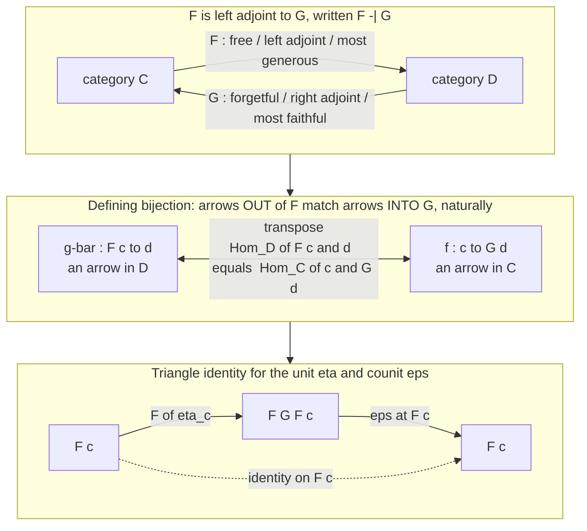

# ⚖️ Adjunctions

> [!abstract] TL;DR
> An **adjunction** `F ⊣ G` is the category theorist's precise notion of **"best-matched pair of translations"** between two categories `C` and `D`: a functor `F : C → D` (the **left adjoint**) and a functor `G : D → C` (the **right adjoint**) locked together by a **natural bijection** `Hom_D(F c, d) ≅ Hom_C(c, G d)` — *arrows out of `F` correspond exactly to arrows into `G`*. Equivalently the pair is given by a **unit** `η : Id_C ⇒ G∘F` and a **counit** `ε : F∘G ⇒ Id_D` satisfying the **triangle (zig-zag) identities**. The left adjoint is the "freest / most generous" construction, the right adjoint the "most faithful / most constrained," and the archetype is **free ⊣ forgetful** (free group, free vector space = basis, free monoid = lists). Adjunctions are the **unifying idea of the subject**: limits and colimits are adjoints to the diagonal functor, products/coproducts are adjoints, currying `(−×A) ⊣ (−)^A` is an adjunction, every adjunction generates a **monad** `G∘F`, and an adjunction between posets is exactly a **Galois connection**. Recognising an adjunction instantly reveals the *canonical/optimal* solution to a mapping problem and hands you preservation theorems for free (**RAPL: right adjoints preserve limits**). Mac Lane's slogan: *"adjoint functors arise everywhere."* If you learn one advanced categorical concept, learn this one.

---

## Intuition

**Analogy — the best-match currency exchange.** Two worlds keep different books. World `C` speaks in one currency (say, "loose items"); world `D` speaks in another (say, "structured assemblies"). They do not line up perfectly — you cannot losslessly turn every assembly back into loose items, nor every pile of items into a canonical assembly. But there are two *best-effort* conversions locked together by a fair rule. The **left adjoint** `F` is the **most generous** conversion `C → D`: it builds the *freest* assembly from your loose items, adding **no more structure than forced** and never throwing anything away. The **right adjoint** `G` is the **most faithful** conversion `D → C`: it reads off exactly the underlying items an assembly is made of, **losing structure but inventing nothing**. The "fair exchange rate" is the punchline: **a deal that starts with the generously-converted goods (`F c → d`) is worth exactly the same as the corresponding deal stated in the original currency (`c → G d`)** — and this equivalence is *natural*, holding uniformly as you vary either side. That perfect, uniform correspondence of deals *is* the adjunction.

Translate the picture into the technical world and it snaps into focus. "Loose items" is a **set**; "structured assembly" is a **group / vector space / monoid**; the generous conversion `F` is the **free construction** (free group, basis-generated vector space, list of symbols); the faithful conversion `G` is the **forgetful functor** that remembers only the underlying set. The exchange rate — *a homomorphism out of the free thing is the same data as an arbitrary function on the generators* — is the **universal property of "free," reborn as a bijection of hom-sets that is natural in both variables**. An adjunction is a universal property that has been made **uniform and two-sided**: one canonical best-approximation from each direction, glued by a bijection ([[Universal_Properties]]).

---

## How It Works

### Definition 1 — the hom-set bijection

Let `C` and `D` be categories and `F : C → D`, `G : D → C` functors. We say **`F` is left adjoint to `G`** (and `G` right adjoint to `F`), written **`F ⊣ G`**, when there is a bijection

`Φ : Hom_D(F c, d) ≅ Hom_C(c, G d)`

for **all** objects `c ∈ C` and `d ∈ D`, and this family of bijections is **natural in both variables**. Read it as the master slogan: *arrows **out of** `F` are in one-to-one correspondence with arrows **into** `G`.* The left adjoint sits on the **source** side of the left hom-set; the right adjoint on the **target** side of the right hom-set. Given `ḡ : F c → d` its image `Φ(ḡ) : c → G d` is the **transpose** (or "adjunct"); the two are called *mates*.

**Naturality is not optional** — it is the entire content ([[Natural_Transformations]], [[Functor_Categories_and_Naturality]]). It says the bijection commutes with **precomposition in `c`** and **postcomposition in `d`**: transposing and then reindexing along any `h : c' → c` or `k : d → d'` gives the same result either order. Drop naturality and you have a coincidence of set sizes; keep it and you have a *structural* correspondence that determines `F` from `G` (and vice versa) **up to unique natural isomorphism** — adjoints, when they exist, are essentially unique.

### Definition 2 — unit and counit with the triangle identities

Equivalently, an adjunction is two natural transformations:

- the **unit** `η : Id_C ⇒ G∘F`, with components `η_c : c → G F c` — the **best approximation of `c` from inside `C`** by the round-trip through `D`; for free ⊣ forgetful it **inserts the generators**;
- the **counit** `ε : F∘G ⇒ Id_D`, with components `ε_d : F G d → d` — the **best approximation of `d`** by the round-trip through `C`; for free ⊣ forgetful it **evaluates / multiplies-out** a free expression back down into the structure.

subject to the **triangle (zig-zag) identities**, which say the two round-trips cancel:

`ε_{F c} ∘ F(η_c) = id_{F c}`  and  `G(ε_d) ∘ η_{G d} = id_{G d}`.

The two definitions are **inter-derivable**. From the bijection: `η_c = Φ(id_{F c})` (transpose the identity on `F c`) and `ε_d = Φ⁻¹(id_{G d})`. Back the other way, the transpose of `ḡ : F c → d` is `Φ(ḡ) = G(ḡ) ∘ η_c`, and its inverse is `Φ⁻¹(f) = ε_d ∘ F(f)`. The triangle identities are exactly what make these mutually inverse. Use whichever presentation is convenient: **the hom-bijection is best for *recognising* an adjunction; the unit/counit is best for *computing* with it.**



### The archetype: free ⊣ forgetful

Almost every **forgetful functor** `U` — `Grp → Set`, `Vect → Set`, `Mon → Set`, `Ring → Set`, `Top → Set` — that strips structure down to a bare set (or space) has a **left adjoint `F` that builds the free structure**:

| Right adjoint `U` (forget) | Left adjoint `F` (free) | Unit `η` inserts generators as |
|---|---|---|
| `Grp → Set` | free group on a set | words in the generators |
| `Vect → Set` | free vector space | a **basis** |
| `Mon → Set` | free monoid = **lists / `A*`** | one-letter words |
| `Top → Set` | **discrete** space on a set | points |
| `Set → Set` (trivial) | identity | — |

"**Free is left adjoint to forgetful.**" The bijection `Hom_Grp(F S, H) ≅ Hom_Set(S, U H)` is the universal property of the free group *verbatim*: **a homomorphism out of the free group is exactly a free choice of where the generators go.** The unit `η_S : S → U F S` inserts the generators; the counit `ε_H : F U H → H` takes a formal word of elements of `H` and *multiplies it out* in `H`. This is the deep meaning of "**free**": the **most efficient, most general** way to add structure with **no relations beyond the forced ones** ([[Examples_of_Categories]]).

### Adjoints as optimisation / best approximation

A left adjoint is the **best approximation from the left/below**, a right adjoint the **best approximation from the right/above** — the categorical face of "best fit." This is literal in the poset case (below): `F(c)` is the *least* element whose image dominates, `G(d)` the *greatest* element that fits underneath. Because an adjoint solves a **universal problem optimally**, it is **unique up to natural isomorphism** whenever it exists. This is why we may say "**the** free group," "**the** left adjoint": the optimum is canonical.

### Adjunctions subsume the universal constructions

Nearly every construction in category theory *is* an adjunction:

- **Products and coproducts.** The diagonal functor `Δ : C → C×C`, `c ↦ (c,c)`, has the **product** as its **right adjoint** and the **coproduct** as its **left adjoint**: `Hom(c, a×b) ≅ Hom(c,a)×Hom(c,b) = Hom_{C×C}(Δ c, (a,b))` ([[Products_and_Coproducts]]).
- **Limits and colimits.** More generally, `lim` is right adjoint and `colim` is left adjoint to the constant-diagram functor `Δ : C → [J, C]` — *every* limit and colimit is an adjunction ([[Limits_and_Colimits]]).
- **Exponentials — currying IS an adjunction.** In a cartesian closed category, `(−)×A ⊣ (−)^A`, i.e. `Hom(X×A, B) ≅ Hom(X, B^A)`. **Currying is the transpose of this adjunction** — the categorical root of function types and functional programming ([[Exponentials_and_Cartesian_Closed_Categories]]).
- **Free/cofree, (co)completions, Stone-type dualities** are all adjunctions.

That is Mac Lane's *"adjoint functors arise everywhere"* — one pattern, endlessly instantiated ([[The_Yoneda_Lemma]] supplies the uniqueness engine behind it all).

### RAPL — Right Adjoints Preserve Limits (and left adjoints preserve colimits)

A single theorem pays for the whole abstraction. **Right adjoints preserve limits** (RAPL) and, dually, **left adjoints preserve colimits** (LAPC). Concretely: the **underlying set of a product is the product of the underlying sets** — because the forgetful functor `U : Grp → Set` is a right adjoint, so it *preserves products, equalizers, all limits*. And free functors, being left adjoints, preserve coproducts and colimits (the free monoid on a disjoint union is the coproduct of free monoids). The proof is a two-line hom-set chase: `Hom(c, G lim d_j) ≅ Hom(F c, lim d_j) ≅ lim Hom(F c, d_j) ≅ lim Hom(c, G d_j) ≅ Hom(c, lim G d_j)`, then invoke Yoneda. The converse existence questions are governed by **Freyd's adjoint functor theorems**: a limit-preserving functor between nice categories *has* a left adjoint if it satisfies a smallness ("solution set") condition ([[Limits_and_Colimits]]).

### Adjunctions and monads — the two-way link

**Every adjunction `F ⊣ G` induces a monad** `T = G∘F` on `C` (unit = the adjunction's `η`, multiplication `μ = G ε F`) and dually a **comonad** `F∘G` on `D`. The triangle identities become the monad coherence laws. **Conversely, every monad arises from an adjunction** — in fact from *many*, forming a category whose **initial** object is the **Kleisli** resolution and whose **terminal** object is the **Eilenberg–Moore** category of algebras. This tight correspondence is *the* generator of monads in practice: List is `G∘F` for free-monoid ⊣ forgetful; the state monad, the powerset monad, and the free monad all descend from adjunctions ([[Monads_Categorically]]; the resolutions live in the forthcoming *Kleisli Categories and Algebras* sibling).

### Galois connections — adjunctions between posets

View a **poset** `(P, ≤)` as a category (objects = elements, a unique arrow `x → y` iff `x ≤ y`). Then an adjunction between two posets is exactly a **Galois connection**: a pair of **monotone** maps `f : P → Q` (lower/left adjoint) and `g : Q → P` (upper/right adjoint) with

`f(x) ≤ y  ⟺  x ≤ g(y)`.

The hom-set bijection degenerates to this **iff**, because each hom-set is either empty or a single arrow. The unit becomes `x ≤ g(f(x))` and the counit `f(g(y)) ≤ y`. Galois connections are ubiquitous: the original **Galois theory** correspondence between subgroups and subfields ([[Galois_Theory]]); **abstract interpretation** in program analysis (a Galois connection between a concrete and an abstract domain, [[Effect_Systems_and_Program_Analysis]]); **formal concept analysis**; and **Lawvere's** insight that **quantifiers are adjoints** — substitution has `∃` as left adjoint and `∀` as right adjoint (`∃ ⊣ substitution ⊣ ∀`). *"Adjunctions are generalised Galois connections."*

### Why it matters — the unifying idea

Free constructions, limits, colimits, exponentials, monads, Galois connections, and the syntax–semantics dualities of logic and programming are **all adjunctions**. Spotting one instantly tells you (a) that you have found the **canonical/optimal** solution to a mapping problem, (b) that it is **unique up to iso**, and (c) — via RAPL/LAPC — **which structures it preserves**, for free. Currying is an adjunction (`×A ⊣ (−)^A`), the free/forgetful pattern pervades functional programming (free monads, `pure`/`flatMap`), abstract interpretation is a Galois connection, and categorical logic reads quantifiers as adjoints. This is the sense in which adjunctions are *"the idea that makes category theory worth studying."*

---

## Key Concepts

**Secondary (intuition first).**
- An adjunction is a **best-matched pair of translations** `F : C → D` and `G : D → C` between two worlds that don't line up exactly.
- `F` (**left adjoint**) is the **most generous** direction — it builds the **free** thing, adding no unforced structure; `G` (**right adjoint**) is the **most faithful** — it **forgets** structure, inventing nothing.
- The pair is glued by a **fair exchange rate**: a map **out of** the free thing (`F c → d`) is the *same data* as a map in the original world (`c → G d`).

**Undergraduate (working definitions).**
- **`F ⊣ G` via hom-sets:** a bijection `Hom_D(F c, d) ≅ Hom_C(c, G d)` **natural in `c` and `d`**; the images of each other are **transposes / mates**.
- **`F ⊣ G` via unit/counit:** `η : Id_C ⇒ G F` (`η_c = Φ(id_{Fc})`, inserts generators) and `ε : F G ⇒ Id_D` (`ε_d = Φ⁻¹(id_{Gd})`, evaluates), satisfying the **triangle identities** `ε_{Fc}∘F η_c = id` and `G ε_d ∘ η_{Gd} = id`.
- **Transpose formulas:** `Φ(ḡ) = G(ḡ)∘η_c`,  `Φ⁻¹(f) = ε_d∘F(f)`.
- **Archetype:** **free ⊣ forgetful** — `U : Grp/Vect/Mon → Set` has a left adjoint building the free group / free vector space (basis) / free monoid (lists).

**Graduate (structural view).**
- **Uniqueness:** adjoints are **unique up to unique natural isomorphism**; `F ⊣ G` iff there is a **universal arrow** `η_c : c → G F c` for every `c` (an adjunction is a *natural* family of universal properties).
- **Adjoints and (co)limits:** **RAPL / LAPC** — right adjoints preserve limits, left adjoints preserve colimits; **Freyd's adjoint functor theorems** give existence via the solution-set condition.
- **Adjoints and monads:** `T = G∘F` is a monad; every monad is `G∘F` for some adjunction, with **Kleisli** (initial) and **Eilenberg–Moore** (terminal) resolutions.
- **Posetal case:** an adjunction of posets is a **Galois connection** `f(x) ≤ y ⟺ x ≤ g(y)`; **closure operators** `g∘f` and **kernel operators** `f∘g` arise from the (co)unit; **quantifiers as adjoints** (`∃ ⊣ subst ⊣ ∀`) give Lawvere's hyperdoctrines.
- **Cartesian closure:** `(−)×A ⊣ (−)^A` (currying); adjoint strings and idempotent adjunctions (reflective/coreflective subcategories) capture (co)completions and localisations.

---

## Python Demo

We exhibit **two** adjunctions concretely and **verify their defining correspondences**. First, the paradigm **free ⊣ forgetful** for monoids over `Set`: the free monoid on a set `A` is `A*` (finite words / lists), the forgetful functor takes a monoid to its underlying set, and we verify the natural bijection `Hom_Mon(A*, M) ≅ Hom_Set(A, U M)` — *a monoid homomorphism out of the free monoid is determined by, and freely specified by, an arbitrary function on the generators*. We exhibit the **unit** `η_A : A → U(A*)` (insert generators) and check a **triangle identity** on a small word. Second, an **order-theoretic** adjunction — a **Galois connection** `f(n)=k·n ⊣ g(m)=⌊m/k⌋` between posets — to show adjunctions are *generalised* Galois connections. Finally we **visualise** the hom-set bijection, the unit/counit triangle, and the Galois connection with matplotlib. Pure standard library plus matplotlib.

```python
"""
Two adjunctions, made concrete and verified.

  (1) FREE  -|  FORGETFUL     between  Mon  and  Set
      F(A) = A*   (finite words / lists over A)  -- the FREE monoid (left adjoint)
      U(M) = underlying set of the monoid M      -- FORGETFUL (right adjoint)
      Adjunction:   Hom_Mon(A*, M)  ~=  Hom_Set(A, U M)
      A monoid homomorphism OUT of the free monoid is DETERMINED by, and
      FREELY specified by, an arbitrary function on the generators.

  (2) A GALOIS CONNECTION between posets = an order-theoretic adjunction:
      fix k > 0;  f(n) = k*n  (lower/left adjoint),  g(m) = floor(m/k) (upper/right).
      f(n) <= m   iff   n <= g(m).

Verifies the defining hom-set bijection, exhibits the unit eta and counit eps,
checks a triangle identity, and visualizes both adjunctions with matplotlib.
"""
import math
import random
from itertools import product
import matplotlib.pyplot as plt

# ===========================================================================
# PART 1.  Monoids, the free monoid, and the free -| forgetful adjunction.
# ===========================================================================

class Monoid:
    """A finite monoid: a set of elements, a binary op, and an identity.
    (elements may be None for the free monoid A*, which is infinite.)"""
    def __init__(self, elements, op, e, name=""):
        self.elements = None if elements is None else list(elements)
        self.op = op          # op(x, y) -> element
        self.e = e            # identity element
        self.name = name

def free_multiply(word, M):
    """eps_M / 'evaluate': multiply a word of M-elements out in M, left to right."""
    acc = M.e
    for x in word:
        acc = M.op(acc, x)
    return acc

def induced_hom(g, M):
    """
    From a function on generators  g : A -> U(M)  build the UNIQUE monoid
    homomorphism  g_hat : A* -> M  with  g_hat(()) = e  and
    g_hat((x1, ..., xn)) = g[x1] . g[x2] . ... . g[xn].
    This map -- transpose of g under the adjunction -- is Phi^{-1}(g).
    """
    def g_hat(word):
        acc = M.e
        for a in word:
            acc = M.op(acc, g[a])
        return acc
    return g_hat

def eta(a):
    """Unit  eta_A : A -> U(F A) = U(A*),   a |-> the one-letter word (a,)."""
    return (a,)

def restrict_to_generators(h, A):
    """U(h) . eta_A : A -> U(M).  Restrict a hom A* -> M to the generators.
    This is Phi(h): the transpose of a homomorphism h."""
    return {a: h(eta(a)) for a in A}

def is_hom(h, A, M, trials=300):
    """Check h : A* -> M preserves the identity and concatenation on random words."""
    if h(()) != M.e:
        return False
    letters = list(A)
    for _ in range(trials):
        w1 = tuple(random.choice(letters) for _ in range(random.randint(0, 4)))
        w2 = tuple(random.choice(letters) for _ in range(random.randint(0, 4)))
        if h(w1 + w2) != M.op(h(w1), h(w2)):
            return False
    return True

def same_on_words(A, h1, h2, trials=200):
    for _ in range(trials):
        w = tuple(random.choice(A) for _ in range(random.randint(0, 5)))
        if h1(w) != h2(w):
            return False
    return True

if __name__ == "__main__":
    random.seed(0)

    A = ["a", "b"]                                           # two generators
    Z2 = Monoid([0, 1], lambda x, y: (x + y) % 2, 0, "Z2")   # a small monoid

    # ---- Verify the bijection  Hom_Mon(A*, M) ~= Hom_Set(A, U M) -----------
    all_gen_functions = [dict(zip(A, vals))
                         for vals in product(Z2.elements, repeat=len(A))]
    print("== Free -| Forgetful:  Hom_Mon(A*, M) ~= Hom_Set(A, U M) ==")
    print("Hom_Set(A, U M): functions on generators =", len(all_gen_functions),
          f"= |U M|^|A| = {len(Z2.elements)}^{len(A)}")

    # forward Phi^{-1}: each generator-function induces a GENUINE hom out of A*
    homs = [induced_hom(g, Z2) for g in all_gen_functions]
    print("every induced g_hat is a monoid homomorphism :",
          all(is_hom(h, A, Z2) for h in homs))

    # one side of the bijection:  restrict . induce == id  on Hom_Set(A, U M)
    round_trip_gen = all(restrict_to_generators(h, A) == g
                         for g, h in zip(all_gen_functions, homs))
    print("Phi . Phi^{-1} == id  (restrict of induced recovers g) :", round_trip_gen)

    # other side (freeness / universal property): every hom equals the induced
    # hom of its own restriction -> a hom out of A* is DETERMINED by generators.
    round_trip_hom = all(
        same_on_words(A, h, induced_hom(restrict_to_generators(h, A), Z2))
        for h in homs)
    print("Phi^{-1} . Phi == id  (induce of restriction recovers h) :", round_trip_hom)
    print("=> the correspondence is a BIJECTION: a hom out of A* is exactly a")
    print("   FREE choice of where the generators go.")

    # the count |Hom_Mon(A*, Z_n)| = |U M|^|A| for a few monoids
    for n in (2, 3, 4):
        cnt = len(list(product(range(n), repeat=len(A))))
        print(f"   |Hom_Mon(A*, Z{n})| = {cnt} = {n}^{len(A)}")

    # ---- Unit eta and a TRIANGLE IDENTITY on a small example --------------
    #   Triangle for the LEFT adjoint F:   eps_{F A} . F(eta_A) = id_{F A}.
    #   For a word w in A*, F(eta_A)(w) maps eta over w (a word of one-letter
    #   words); eps_{A*} multiplies that out IN A* (= concatenation) back to w.
    FreeA = Monoid(None, lambda x, y: x + y, (), "A*")   # the free monoid on A
    w = ("a", "b", "b", "a")
    F_eta_w = tuple(eta(a) for a in w)          # in F(U(F A)) = (A*)*
    back = free_multiply(F_eta_w, FreeA)        # eps_{A*}: multiply out in A*
    print("\n== Unit and a triangle identity ==")
    print("  unit  eta_A('a')          =", eta("a"), " (insert generator a)")
    print("  w                         =", w)
    print("  F(eta)(w)                 =", F_eta_w)
    print("  eps_{A*}(F eta w)         =", back, " == w :", back == w,
          " (triangle identity holds)")

    # ===================================================================
    # PART 2.  A GALOIS CONNECTION = an adjunction between posets.
    #   f(n) = k*n   (lower / left adjoint)     g(m) = floor(m/k) (upper / right)
    #   Defining bijection degenerates to an iff:  f(n) <= m  iff  n <= g(m).
    # ===================================================================
    k = 3
    f = lambda n: k * n
    g = lambda m: math.floor(m / k)
    Rng = range(-6, 7)
    galois_ok = all((f(n) <= m) == (n <= g(m)) for n in Rng for m in Rng)
    unit_ok   = all(n <= g(f(n)) for n in Rng)     # unit:   n <= g(f(n))
    counit_ok = all(f(g(m)) <= m for m in Rng)     # counit: f(g(m)) <= m
    print("\n== Galois connection  f(n)=k*n  -|  g(m)=floor(m/k),  k =", k, "==")
    print("  f(n) <= m  iff  n <= g(m)   for all n, m :", galois_ok)
    print("  unit  n <= g(f(n)) :", unit_ok, " |  counit  f(g(m)) <= m :", counit_ok)

    # ===================================================================
    # 3.  VISUALIZE: (A) hom-set bijection, (B) unit/counit triangle,
    #                (C) the Galois connection.
    # ===================================================================
    fig, axes = plt.subplots(1, 3, figsize=(18, 6))

    # ---- Panel A: the hom-set bijection as a 1-1 matching ----
    ax = axes[0]; ax.axis("off")
    ax.set_title("Hom_Set(A, U M)  ~=  Hom_Mon(A*, M)\n"
                 "a hom out of the free monoid = a free choice on generators",
                 fontweight="bold", fontsize=10)
    npairs = len(all_gen_functions)
    for i, (gfun, h) in enumerate(zip(all_gen_functions, homs)):
        y = 1 - (i + 0.5) / npairs
        left_lab = ",  ".join(f"{a}->{gfun[a]}" for a in A)
        right_lab = f"g_hat(a,b,b) = {h(('a', 'b', 'b'))}"
        ax.text(0.03, y, left_lab, ha="left", va="center", fontsize=10,
                bbox=dict(boxstyle="round,pad=0.25", fc="#eaf3ea", ec="#1f8a4c"))
        ax.text(0.97, y, right_lab, ha="right", va="center", fontsize=10,
                bbox=dict(boxstyle="round,pad=0.25", fc="#eaeef7", ec="#2c3e6b"))
        ax.plot([0.42, 0.58], [y, y], "-", color="#c0392b", lw=1.8)
    ax.text(0.20, 1.03, "function on generators", ha="center", color="#1f8a4c",
            fontweight="bold", fontsize=9)
    ax.text(0.80, 1.03, "monoid homomorphism A* -> M", ha="center", color="#2c3e6b",
            fontweight="bold", fontsize=9)
    ax.set_xlim(0, 1); ax.set_ylim(0, 1.07)

    # ---- Panel B: the triangle identity for the left adjoint F ----
    ax = axes[1]; ax.axis("off")
    ax.set_title("Triangle identity (left adjoint F):\n"
                 "eps_{F c} . F(eta_c) = id_{F c}", fontweight="bold", fontsize=10)
    P = {"L": (0.15, 0.32), "T": (0.5, 0.85), "R": (0.85, 0.32)}
    def tri_node(key, txt, ec="#2c3e6b"):
        ax.text(*P[key], txt, ha="center", va="center", fontsize=11,
                bbox=dict(boxstyle="round,pad=0.35", fc="#eef3fb", ec=ec, lw=1.6))
    def tri_arr(a, b, lab, dx=0, dy=0, dashed=False, color="#33475b"):
        pa, pb = P[a], P[b]
        ax.annotate("", xy=pb, xytext=pa,
                    arrowprops=dict(arrowstyle="-|>", color=color, lw=1.8,
                                    ls="--" if dashed else "-",
                                    shrinkA=26, shrinkB=26))
        ax.text((pa[0] + pb[0]) / 2 + dx, (pa[1] + pb[1]) / 2 + dy, lab,
                ha="center", va="center", fontsize=10, color=color, style="italic")
    tri_node("L", "F c", ec="#1f8a4c")
    tri_node("T", "F G F c")
    tri_node("R", "F c", ec="#1f8a4c")
    tri_arr("L", "T", "F eta_c", dx=-0.07, dy=0.03)
    tri_arr("T", "R", "eps at F c", dx=0.09, dy=0.03)
    tri_arr("L", "R", "identity on F c", dy=-0.06, dashed=True, color="#1f8a4c")
    ax.text(0.5, 0.10, "w = (a,b,b,a):  F(eta)(w) = ((a,),(b,),(b,),(a,))\n"
                       "multiply out in A*  ->  (a,b,b,a) = w",
            ha="center", fontsize=8.5, color="#1f8a4c")
    ax.set_xlim(0, 1); ax.set_ylim(0, 1)

    # ---- Panel C: the Galois connection f(n)=k n  -|  g(m)=floor(m/k) ----
    ax = axes[2]
    ax.set_title("Galois connection = adjunction of posets\n"
                 "blue square: f(n)<=m   red dot: n<=g(m)   (they coincide)",
                 fontweight="bold", fontsize=10)
    ns = list(range(-4, 5))
    ms = list(range(-9, 10))
    for nn in ns:
        for mm in ms:
            if f(nn) <= mm:
                ax.plot(nn, mm, "s", color="#cfe3f7", ms=12, zorder=1)
            if nn <= g(mm):
                ax.plot(nn, mm, ".", color="#c0392b", ms=4, zorder=3)
    ax.plot(ns, [f(nn) for nn in ns], "-o", color="#1f8a4c", lw=2, zorder=4,
            label="f(n) = k n  (left adjoint)")
    ax.plot(ns, [g(nn) for nn in ns], "-o", color="#8e44ad", lw=2, zorder=4,
            label="g(n) = floor(n/k)  (right adjoint)")
    ax.axhline(0, color="black", lw=0.5); ax.axvline(0, color="black", lw=0.5)
    ax.set_xlabel("n"); ax.set_ylabel("m")
    ax.set_xlim(-4.6, 4.6); ax.set_ylim(-9.6, 9.6)
    ax.legend(fontsize=8, loc="upper left"); ax.grid(True, alpha=0.3)

    fig.suptitle("Adjunctions: free -| forgetful  and  the Galois connection",
                 fontsize=14, fontweight="bold")
    fig.tight_layout(rect=[0, 0, 1, 0.94])
    plt.show()   # or: fig.savefig("adjunctions.png", dpi=120)
```

**What the run shows.** For generators `A = {a, b}` and the monoid `Z2`, there are exactly `|U M|^|A| = 2² = 4` functions on generators, and each induces a genuine monoid homomorphism `A* → M` — verified to preserve the identity and concatenation over hundreds of random words. Restricting an induced homomorphism recovers its generating function (one side of the bijection), and inducing from a homomorphism's restriction recovers the homomorphism on every test word (the other side, which *is* the universal property of "free"): so `Hom_Mon(A*, M) ≅ Hom_Set(A, U M)` is confirmed to be a **genuine bijection**. The count `|Hom| = n^{|A|}` is checked for `Z2, Z3, Z4`. The unit `η_A(a) = (a,)` is exhibited and the **triangle identity** `ε_{A*} ∘ F(η) = id` is verified on `w = (a,b,b,a)` — mapping `η` over the word and multiplying back out returns `w` unchanged. Finally the **Galois connection** `f(n)=3n ⊣ g(m)=⌊m/3⌋` satisfies `f(n) ≤ m ⟺ n ≤ g(m)` for all tested `n, m`, with the unit `n ≤ g(f(n))` and counit `f(g(m)) ≤ m` both holding. The figure shows the hom-set bijection as a one-to-one matching, the unit/counit triangle collapsing to the identity, and the Galois connection as two adjoint staircases whose "`f(n) ≤ m`" (blue squares) and "`n ≤ g(m)`" (red dots) regions coincide exactly.

---

## Real-World Applications

> **Currying in functional programming is literally an adjunction.** The isomorphism `(A × B) → C  ≅  A → (B → C)` that lets a two-argument function be applied one argument at a time is the transpose of the **cartesian-closed adjunction** `(−)×B ⊣ (−)^B`. Haskell's `curry`/`uncurry`, ML's automatic currying, and every partial application you write are *this* adjunction's bijection in action. The same structure makes function types `A → B` first-class (exponentials) and underpins the semantics of the typed lambda calculus ([[Exponentials_and_Cartesian_Closed_Categories]], [[Simply_Typed_Lambda_Calculus]]).

- **The free/forgetful pattern pervades software.** "Free monoids = lists," "free monads over a functor," and the `pure`/`return` (unit) plus `flatMap`/`join` machinery that every effect library exposes are the categorical free ⊣ forgetful adjunction and its induced monad. Building an interpreter DSL as a *free monad* and then giving it an interpreter is exactly *choosing an Eilenberg–Moore algebra* for the adjunction-born monad ([[Monads_Categorically]]).
- **Abstract interpretation / static analysis = a Galois connection.** A program analyser relates a **concrete** domain (exact program states) to an **abstract** domain (e.g. intervals, signs) by a Galois connection `α ⊣ γ` (abstraction ⊣ concretisation). Soundness *is* the counit inequality; the analyser computes best over-approximations because `α` is a left adjoint. This is the theoretical backbone of tools like Astrée and modern optimising compilers ([[Effect_Systems_and_Program_Analysis]]).
- **Databases and schema mappings.** Data migration between schemas is modelled by adjoint functors (`Δ ⊣ Σ` and `Δ ⊣ Π`, pullback with its left/right Kan-extension adjoints); joins are pullbacks (limits) and are therefore *preserved* by the right-adjoint side — a direct application of RAPL to query planning.
- **Logic and type theory — quantifiers as adjoints.** Lawvere's hyperdoctrines read `∃` and `∀` as the left and right adjoints of substitution (`∃ ⊣ subst ⊣ ∀`), so introduction/elimination rules for quantifiers are unit/counit laws. This is the categorical semantics behind proof assistants and the **syntax–semantics adjunction** (free theory ⊣ underlying model).
- **Classical Galois theory.** The original correspondence between subgroups of a Galois group and intermediate fields is an (order-reversing) Galois connection — the historical seed from which the whole abstract notion grew ([[Galois_Theory]]).

---

## Common Pitfalls

- **Swapping left and right.** The left adjoint is the **source** of the left hom-set (`Hom_D(F c, d)`) — arrows go *out of* `F`; the right adjoint is the **target** of the right hom-set (`Hom_C(c, G d)`) — arrows go *into* `G`. **Free is left, forgetful is right.** Getting the sides backwards flips every downstream fact (which functor preserves limits vs colimits).
- **Forgetting that the bijection must be natural.** A bare bijection `Hom_D(F c, d) ≅ Hom_C(c, G d)` for each pair is *not* an adjunction — the family must be **natural in both variables** ([[Natural_Transformations]]). Naturality is the whole structural content; a size-coincidence of hom-sets proves nothing.
- **Mixing up the two triangle identities.** The identities are `ε_{Fc}∘F(η_c) = id_{Fc}` (about `F`) and `G(ε_d)∘η_{Gd} = id_{Gd}` (about `G`). Applying the counit or unit at the wrong object, or whiskering on the wrong side, silently breaks the proof. Track *which functor's identity* each triangle establishes.
- **Assuming adjoints always exist.** Not every functor has an adjoint. Existence is governed by **Freyd's adjoint functor theorems** and requires (co)completeness plus a solution-set/smallness condition. "It ought to have a left adjoint" is a hypothesis to check, not a given.
- **Confusing an adjoint with an inverse.** `F ⊣ G` does **not** make `F` and `G` mutually inverse (that would be an *equivalence*). The round-trips `G∘F` and `F∘G` are only *approximated* by identities via the unit and counit — inequalities/comparisons, not equalities. Adjunction is a **best-approximate inverse**, weaker and far more common than equivalence.
- **Reading RAPL the wrong way.** *Right* adjoints preserve *limits*; *left* adjoints preserve *colimits*. A left adjoint need not preserve limits (the free group on a product is **not** the product of free groups). Using the theorem in the wrong direction produces false "preservation" claims.
- **Overlooking the Galois-connection special case.** In a poset every hom-set is empty or a singleton, so the "bijection" collapses to an **iff** and the triangle identities to two **inequalities** `x ≤ g(f(x))`, `f(g(y)) ≤ y`. Beginners look for extra data that isn't there; the order *is* the adjunction.

---

## Related Concepts

- [[Universal_Properties]] — an adjunction is a **universal property made natural in a parameter**: `F ⊣ G` iff there is a universal arrow `η_c : c → G F c` for every `c`; free ⊣ forgetful is the paradigm.
- [[Functors]] — the two ingredients of an adjunction are functors `F : C → D` and `G : D → C`; the composites `G∘F` and `F∘G` are the round-trips the (co)unit measures.
- [[Natural_Transformations]] — the unit `η` and counit `ε` are natural transformations, and the **naturality** of the hom-set bijection is the entire structural content of the definition.
- [[Functor_Categories_and_Naturality]] — naturality "in both variables" lives in the functor/hom-functor categories where the adjunction bijection is a natural isomorphism.
- [[Limits_and_Colimits]] — limits are right adjoints and colimits left adjoints to the diagonal functor; **RAPL/LAPC** and Freyd's adjoint functor theorems govern preservation and existence.
- [[Products_and_Coproducts]] — the product is the right adjoint and the coproduct the left adjoint of the diagonal `Δ : C → C×C`.
- [[Exponentials_and_Cartesian_Closed_Categories]] — **currying is an adjunction** `(−)×A ⊣ (−)^A`; the transpose is exactly `curry`/`uncurry`.
- [[Monads_Categorically]] — every adjunction `F ⊣ G` induces the monad `T = G∘F` (and a comonad `F∘G`); conversely every monad is adjoint-induced with Kleisli and Eilenberg–Moore resolutions.
- [[The_Yoneda_Lemma]] — the uniqueness of adjoints "up to unique natural iso" is a Yoneda argument on representable hom-functors; adjunctions and representability are two faces of one idea.
- [[Examples_of_Categories]] — `Grp`, `Vect`, `Mon`, `Top` and their forgetful functors supply the free ⊣ forgetful adjunctions used throughout.
- [[Duality_and_the_Opposite_Category]] — reversing arrows swaps left and right adjoints, limits and colimits, unit and counit; each adjunction fact has a free dual.
- [[Terminal_Initial_and_Zero_Objects]] — a universal arrow (hence an adjoint) is an initial/terminal object in a comma category, the barest universal property behind the free construction.
- [[Presheaves_and_Representables]] — an adjunction says a hom-functor is representable in a parametrised way; free-cocompletion (presheaves) is itself an adjunction.
- [[Galois_Theory]] — the classical subgroup–subfield correspondence is the order-theoretic Galois connection that the abstract notion of adjunction generalises.
- [[Effect_Systems_and_Program_Analysis]] — abstract interpretation is a Galois connection `α ⊣ γ` between concrete and abstract domains; soundness is the counit inequality.
- [[Simply_Typed_Lambda_Calculus]] — its categorical semantics is a cartesian closed category, where currying `(−)×A ⊣ (−)^A` interprets function types.
- [[Groups_and_Subgroups]] — the **free group** on a set is the left adjoint of the forgetful functor `Grp → Set`; a homomorphism out of it is a free choice of generator images.

*Forthcoming Category_Theory siblings referenced in prose (not yet written, so not linked): Kleisli Categories and Algebras (the initial/terminal resolutions of the induced monad) and Category Theory in Programming (the Haskell/Scala face of currying, free monads, and the free-forgetful pattern).*

---

## Review Questions

1. **(Conceptual)** State both definitions of an adjunction `F ⊣ G` — the natural hom-set bijection `Hom_D(F c, d) ≅ Hom_C(c, G d)` and the unit/counit-with-triangle-identities form — and give the formulas translating between them (`η_c = Φ(id_{Fc})`, `ε_d = Φ⁻¹(id_{Gd})`, `Φ(ḡ) = G(ḡ)∘η_c`). Explain precisely *why naturality in both variables* is essential and what goes wrong if you keep only a bijection for each fixed pair.

2. **(Scenario)** You are told the forgetful functor `U : Vect_k → Set` has a left adjoint `F`. (a) Describe `F(S)` concretely and say what the unit `η_S : S → U F S` does. (b) Write down the adjunction bijection for `Vect` and read it as the universal property of a **basis**. (c) Use **RAPL** to conclude — with no vector-space computation — that the underlying set of a product of vector spaces is the product of the underlying sets, and explain why the *free* functor does **not** send products to products.

3. **(Trade-off / structural)** (a) Show that an adjunction between two posets is exactly a Galois connection `f(x) ≤ y ⟺ x ≤ g(y)`, and identify what the unit and counit become. (b) Explain how abstract interpretation packages a static analysis as such a connection `α ⊣ γ` and which inequality expresses soundness. (c) Every adjunction induces a monad `G∘F`; describe the monad the free ⊣ forgetful adjunction for monoids induces, and contrast working in its **Kleisli** category versus its **Eilenberg–Moore** category of algebras. What does recognising a construction as an adjunction *buy* you that a bare definition does not?

---

## Sources

- [Mac Lane, S., *Categories for the Working Mathematician* (2nd ed., Springer, 1998), Ch. IV](https://link.springer.com/book/10.1007/978-1-4757-4721-8) — the canonical treatment: hom-set and unit/counit definitions, triangle identities, "adjoints arise everywhere," and adjunctions ↔ monads.
- [Riehl, E., *Category Theory in Context* (Dover, 2016; free PDF), Ch. 4–5](https://math.jhu.edu/~eriehl/context.pdf) — modern development of adjunctions, universal arrows, RAPL, adjoint functor theorems, and the monad connection.
- [Awodey, S., *Category Theory* (2nd ed., Oxford University Press, 2010), Ch. 9](https://global.oup.com/academic/product/category-theory-9780199237180) — adjoints as universal mapping properties, free ⊣ forgetful, cartesian closure and currying.
- [Leinster, T., *Basic Category Theory* (Cambridge University Press, 2014; arXiv:1612.09375), Ch. 2](https://arxiv.org/abs/1612.09375) — clean, example-driven account of adjunctions, units/counits, and the triangle identities.
- [nLab, "adjoint functor"](https://ncatlab.org/nlab/show/adjoint+functor) — reference article covering the equivalent definitions, Galois connections as posetal adjunctions, and quantifiers as adjoints.
- [Milewski, B., "Adjunctions", *Category Theory for Programmers*](https://bartoszmilewski.com/2016/04/18/adjunctions/) — programmer-facing derivation with currying `(−)×A ⊣ (−)^A` and free ⊣ forgetful in code.

---

#category-theory #adjunctions #free-forgetful #unit-counit #galois-connection
