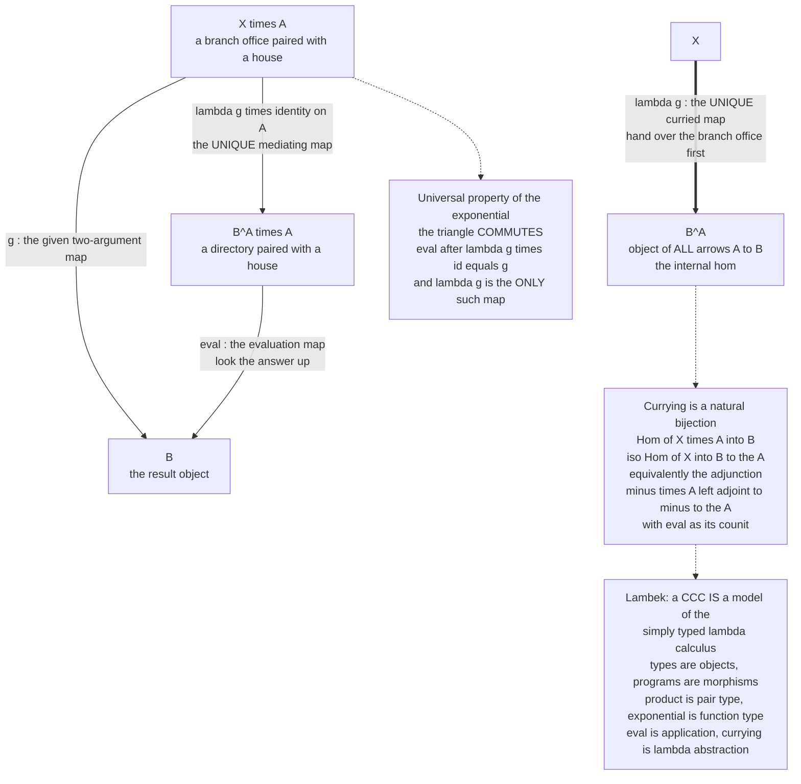

# 🏹 Exponentials and Cartesian Closed Categories

> [!abstract] TL;DR
> An **exponential object** `B^A` (also written `[A, B]` or `A ⇒ B`) is the categorical answer to "what is a *function type*?" — it is the **object of all arrows from `A` to `B`**, so that functions stop being mere morphisms between objects and become **first-class objects you can point arrows at**. It is pinned down by a single **universal property** built on the **evaluation map** `eval : B^A × A → B`: for every object `X` and every two-argument map `g : X × A → B` there is a **unique** curried map `λg : X → B^A` with `eval ∘ (λg × id_A) = g`. That universal property is exactly **currying** — the natural bijection `Hom(X × A, B) ≅ Hom(X, B^A)`, which says a two-argument function *is the same thing as* a function returning a function, and which is precisely the **adjunction** `(− × A) ⊣ (−)^A`. A category with a **terminal object, all binary products, and all exponentials** is a **cartesian closed category (CCC)** — the setting where "functions are objects" and currying always works. `Set` is the archetypal CCC (`B^A` = the set of all functions `A → B`, with `|B^A| = |B|^{|A|}`, the source of the name). The landmark payoff is **Lambek's theorem**: **cartesian closed categories are exactly the models of the simply typed lambda calculus** — objects are types, morphisms are programs, products are pair types, exponentials are function types, `eval` is application, and currying is lambda abstraction. This is the third leg of the **Curry–Howard–Lambek** correspondence (logic ↔ types ↔ categories), where `B^A` reads as the implication `A → B`. Exponentials are the single most important bridge between category theory and computer science.

---

## Intuition

**Analogy — a phone book turns "reaching people" into a thing you can hold.** Think of `A` as a set of houses and `B` as a set of people. A *morphism* `A → B` is a rule "who lives where" — an ordinary arrow in the category. Now compile every possible such rule into a single **directory**: one thick book whose entries are complete assignments of a person to each house. That directory is a *thing*, an object in its own right — you can put it on a shelf, mail it, or point other arrows at it. **The exponential `B^A` is that directory: the object whose "elements" are all the arrows `A → B`.** The magic accompanying gadget is the **look-up desk**: hand the desk *a directory and a house* and it returns *the person* — that is the **evaluation map** `eval : B^A × A → B`. Turning functions into objects only earns its keep if you can still *use* them, and `eval` is exactly the "use it" operation.

The deep move is **currying**, and it is the most everyday thing in the world once you see it. Suppose you have a two-input procedure `g(x, a)` — say, "given a *branch office* `x` and a *house* `a`, tell me the *assigned person* `b`." You can hand the whole two-argument job over in one shot (`X × A → B`), *or* you can hand over just the branch office `x` first and get back a **personalized directory** for that branch — a single-argument function `a ↦ b`, i.e. an element of `B^A` — which you consult later. **These two ways of packaging the same information are in perfect bijection.** "A function of two arguments" *is* "a function returning a function." That is Curry's insight, it is what your `add(x)(y)` curried code does, and — read categorically — it is the *definition* of the exponential. A universe where this repackaging always works, for every pair of objects, is a **cartesian closed category**, and Lambek's astonishing theorem is that such a universe is *the same thing* as the typed lambda calculus written in a different alphabet.

---

## How It Works

### The exponential object, by its universal property

Fix a category `C` that already has (binary) **products** `× ` — pairs. We want an object that deserves to be called "the object of morphisms `A → B`." Rather than describe its *elements* (categories forbid peeking inside objects), we describe it by **how maps interact with it** — a **universal property**, the same discipline that defines products, terminal objects, and limits generally (the forthcoming **Universal_Properties** and **Products_and_Coproducts** siblings).

The exponential `B^A` is an object equipped with one distinguished morphism, the **evaluation map**
```
eval : B^A × A → B
```
subject to this **universal (couniversal) property**:

> For **every** object `X` and **every** morphism `g : X × A → B`, there exists a **unique** morphism `λg : X → B^A` — the **transpose** or **curry** of `g` — such that
> ```
> eval ∘ (λg × id_A) = g .
> ```

Read it slowly. The map `λg × id_A : X × A → B^A × A` transforms the first coordinate by `λg` and leaves the `A` coordinate alone; then `eval` looks the answer up. The equation says: *currying `g` into `λg`, pairing with the untouched argument, and evaluating, recovers `g` exactly*. **Uniqueness** is the whole force of the property — it makes `λg` genuinely *determined* by `g`, so currying is a well-defined operation, not a choice. Because the object is characterized by a universal property, `B^A` is **unique up to unique isomorphism** whenever it exists, and the defining diagram **commutes** ([[Diagrams_and_Commutativity]]).

The exponential thus **internalizes the hom-set**: where the *external* hom `Hom_C(A, B)` is a set living in the meta-theory, `B^A` is an *object of `C` itself* that represents those arrows — an "**internal hom**." In `Set` the two coincide, `B^A = Hom_Set(A, B)`, but in richer categories the internal hom carries extra structure (a topology, an order, a type).

### Currying as a natural isomorphism — and as an adjunction

The universal property says every `g : X × A → B` has a **unique** transpose `λg : X → B^A`, and this operation is invertible (**uncurry** sends `h : X → B^A` back to `eval ∘ (h × id_A) : X × A → B`). So currying is a **bijection of hom-sets**, natural in `X` and in `B`:
```
Hom(X × A, B)  ≅  Hom(X, B^A) .
```
This is *Curry's currying* made into an isomorphism. Naturality (in the sense of [[Natural_Transformations]]) means the bijection commutes with pre- and post-composition — it is not an accidental same-size coincidence but a *coherent* correspondence. Stated at the level of functors, it is precisely the statement that

> **the product functor `(− × A)` is left adjoint to the exponential functor `(−)^A`,**  written `(− × A) ⊣ (−)^A`,

the **product–exponential adjunction** (the forthcoming **Adjunctions** sibling). `eval` is the **counit** of this adjunction and currying is the adjunction's hom-set bijection. This single adjunction is the categorical heart of higher-order functions.

### Cartesian closed categories

A category `C` is **cartesian closed** (a **CCC**) when it has **all three** of:

1. a **terminal object** `1` — the empty product, the categorical "unit"/`True` (the forthcoming **Terminal_Initial_and_Zero_Objects** sibling);
2. **all binary products** `A × B`;
3. **all exponentials** `B^A` — for every pair of objects the internal hom exists.

Equivalently: `C` has finite products and the functor `(− × A)` has a right adjoint for every `A`. In a CCC, **"functions are objects" and currying always works**, uniformly. Examples abound: **`Set`** (the archetype, `B^A` = all functions, [[Examples_of_Categories]]); any **topos**, e.g. presheaf categories `[C^op, Set]` ([[Presheaves_and_Representables]]); the category of **posets** and monotone maps; **CPO**s and continuous maps (the semantics of recursion, [[Denotational_Semantics]]); the category of **small categories** `Cat`. Crucially, **not every category is closed** — the category of *all* topological spaces is famously **not** cartesian closed (you must restrict to compactly generated spaces to get a well-behaved internal hom), which is exactly why function spaces in topology are subtle.

### The diagram



*The solid triangle is the universal property: any `g : X × A → B` factors uniquely through `eval` via `λg × id`. The double arrow is the transpose `λg : X → B^A`. A cartesian closed category is one with a terminal object, all products, and this construction for every pair of objects — and by Lambek's theorem that is exactly the typed lambda calculus.*

### Lambek's theorem — the CCC ↔ lambda-calculus correspondence

The landmark result (Joachim Lambek, 1970s) is that **cartesian closed categories are precisely the categorical models of the simply typed lambda calculus** ([[Simply_Typed_Lambda_Calculus]]). The dictionary is exact:

| Simply typed lambda calculus | Cartesian closed category |
|---|---|
| Type | Object |
| Term / program `M : A` | Morphism `1 → A` (or `Γ → A` in context) |
| Typing context `Γ` | Product of the objects in `Γ` |
| Product / pair type `A × B` | Product object `A × B` |
| Unit type `1` | Terminal object `1` |
| Function type `A → B` | **Exponential `B^A`** |
| Application `M N` | `eval ∘ ⟨M, N⟩` |
| Lambda abstraction `λx. M` | **Currying** `λ(−)` |
| `βη`-equality of terms | Equality of morphisms |

More than a table, this is an **equivalence of categories**: the *internal language* of any CCC **is** the typed lambda calculus, and the CCC freely generated by a lambda theory is its **term model**. So one can *compute inside a category* by writing lambda terms, and *reason about programs* by chasing categorical diagrams. This is the third leg of **Curry–Howard–Lambek** (the forthcoming **Curry_Howard_Lambek_Correspondence** sibling): **logic ↔ types ↔ categories**.

### The logical reading — a CCC models intuitionistic logic

Compose Lambek with **Curry–Howard** ([[The_Curry_Howard_Correspondence]]) and the categorical structure becomes *logic*:

- **exponential `B^A` = implication `A → B`**, with `eval` as **modus ponens** and currying as **implication introduction** (deduction theorem);
- **product `A × B` = conjunction `A ∧ B`**;
- **coproduct `A + B` = disjunction `A ∨ B`** (the forthcoming **Products_and_Coproducts** sibling);
- **terminal `1` = `True`**; **initial `0` = `False`** (`0` is the empty type / absurdity);
- an arrow `A → B` **is a proof** that `A` entails `B`.

A CCC therefore models the `{→, ∧, ⊤}` fragment of **intuitionistic propositional logic** ([[Intuitionistic_Logic_and_Constructive_Proofs]]); a **bi-cartesian closed category** (a CCC with finite *coproducts* as well) models the full connective set `{→, ∧, ∨, ⊤, ⊥}`. The logic is *intuitionistic*, not classical — there is no morphism realizing Peirce's law or double-negation elimination, exactly mirroring the lambda calculus.

### Exponential laws are type isomorphisms

Because `B^A` behaves like exponentiation on cardinalities (`|B^A| = |B|^{|A|}` in `Set`), the schoolbook **laws of exponents hold as canonical isomorphisms** — the "algebra of types" made precise (the forthcoming **Category_Theory_in_Programming** sibling):

```
C^(A × B) ≅ (C^B)^A          -- currying: two args ≅ nested single args
(B × C)^A ≅ B^A × C^A        -- a function returning a pair ≅ a pair of functions
A^1       ≅ A                -- a function from the unit is just a value
A^0       ≅ 1                -- there is exactly one function out of the empty type
1^A       ≅ 1                -- the only function into the unit is the constant
```

Every functional programmer has *used* these (`(A, B) -> C` refactored to `A -> B -> C`, or a record of functions swapped for a function returning a record) without naming them; they are theorems in any CCC.

### Closed monoidal generalizations

Cartesian closure uses the **product** `×` as its "context-forming" operation. Replacing `×` by a general **tensor** `⊗` gives a **monoidal closed category**: the tensor has a right adjoint **internal-hom**, `Hom(A ⊗ B, C) ≅ Hom(A, [B, C])` (the forthcoming **Monoids_and_Monoidal_Categories** sibling). When the tensor is *not* the cartesian product — so you *cannot* freely copy or discard resources — the resulting logic is **linear logic**, whose implication `⊸` is modelled by this monoidal internal-hom ([[Linear_Logic_and_Resource_Types]]). Cartesian closed is the special case where `⊗ = ×` and resources may be duplicated and dropped at will.

### The topos connection

An **elementary topos** is a cartesian closed category with a bit more — finite limits and a **subobject classifier** `Ω` (an object of "truth values"). Exponentials are therefore the **first step toward topos theory** and categorical logic: once you have "functions as objects," adding a classifier gives you internal *sets and logic*, and the internal language jumps from the simply typed lambda calculus to full higher-order intuitionistic type theory (the forthcoming **Cartesian_Closed_and_Topos_Theory** and **Categorical_Logic_and_Type_Theory** siblings).

### Why it matters

Exponentials and CCCs are **where category theory, type theory, and logic meet**. A CCC is the **semantic universe of typed functional programming**: the category of a language's types is (approximately) cartesian closed, **denotational semantics** interprets each program as a morphism in a CCC ([[Denotational_Semantics]]), and **currying, uncurrying, and higher-order functions are the exponential's universal property in action** ([[Functional_Programming_Foundations]]). It is the single most consequential CT ↔ CS bridge.

---

## Key Concepts

**Secondary (explain to a curious beginner)**
- An **exponential `B^A`** is the "**directory of all functions from `A` to `B`**," turned into a *single object* you can point arrows at — functions become first-class things.
- The **evaluation map** `eval` is the "look-up desk": give it a function and an input, it returns the output.
- **Currying**: a two-argument function `g(x, a)` is the *same information* as a one-argument function that returns a function, `x ↦ (a ↦ g(x, a))`. Your `add(x)(y)` curried code *is* this.
- A **cartesian closed category** is any world where this repackaging always works — and it turns out to be exactly the typed lambda calculus in disguise.

**Undergraduate (a first category-theory / types course)**
- **Universal property**: `B^A` with `eval : B^A × A → B` such that every `g : X × A → B` factors as `g = eval ∘ (λg × id_A)` for a **unique** `λg`; hence `B^A` is unique up to unique isomorphism.
- **Currying isomorphism**: `Hom(X × A, B) ≅ Hom(X, B^A)`, natural in `X` and `B` — currying/uncurrying are mutually inverse.
- **CCC definition**: terminal object `1` + all binary products + all exponentials. `Set` is the archetype with `|B^A| = |B|^{|A|}`.
- **Exponential laws** as isomorphisms: `C^{A×B} ≅ (C^B)^A`, `(B×C)^A ≅ B^A × C^A`, `A^1 ≅ A`, `A^0 ≅ 1`.
- **Curry–Howard–Lambek**: `B^A` = implication, `×` = conjunction, `+` = disjunction, `1` = true, `0` = false; a CCC models intuitionistic propositional logic; a bi-CCC adds disjunction/false.

**Graduate (foundational / semantic)**
- **Adjunction view**: `(− × A) ⊣ (−)^A`; `eval` is the **counit**, currying is the hom-set adjunction bijection; the exponential functor is the right adjoint's action.
- **Lambek's theorem**: the 2-categorical equivalence between CCCs (with cartesian-closed functors) and simply typed lambda theories; the **internal language** of a CCC is the STLC; free CCCs are term models; `βη`-equality ↔ equality of morphisms.
- **Enrichment / internal hom**: `B^A` internalizes `Hom(A, B)`; in a **monoidal closed** category the internal hom is right adjoint to `⊗`, modelling linear implication `⊸`.
- **Toposes**: an elementary topos = CCC + finite limits + subobject classifier `Ω`; its internal language is higher-order intuitionistic type theory; sheaf and presheaf toposes are the leading examples.
- **Failure of closure**: `Top` is not cartesian closed; compactly generated / convenient categories restore an exponential — a recurring theme wherever "function space" is delicate.

---

## Python Demo

```python
# ======================================================================
# EXPONENTIALS AND CARTESIAN CLOSURE IN FinSet, FROM SCRATCH.
#   * Build the EXPONENTIAL object  B^A  = the SET OF ALL FUNCTIONS A -> B
#     for finite sets A, B, and confirm the "exponential" name:
#         |B^A| = |B| ** |A|.
#   * Define the EVALUATION map   eval : B^A x A -> B.
#   * Implement CURRY / UNCURRY and verify the natural isomorphism
#         Hom(X x A, B)  ~=  Hom(X, B^A)
#     is a genuine BIJECTION (curry and uncurry are mutual inverses,
#     matching cardinalities |B|^(|X||A|) on both sides).
#   * Check the universal-property law   eval(curry(g)(x), a) = g(x, a).
#   * Connect to PROGRAMMING currying: add(x, a)  ~=  add(x)(a).
#   * VISUALIZE the currying correspondence (a g : X x A -> B grid read
#     row-by-row as elements of B^A) and the matching cardinalities.
# Pure standard library + matplotlib (no numpy needed).
# ======================================================================
import sys
from itertools import product
import matplotlib.pyplot as plt
from matplotlib.patches import Rectangle, FancyArrowPatch

try:                                    # print unicode safely on any console
    sys.stdout.reconfigure(encoding="utf-8")
except Exception:
    pass

# ----------------------------------------------------------------------
# A finite function A -> B is stored as a FROZEN tuple of (x, f(x)) pairs,
# sorted by input. That makes functions hashable, comparable, and lets us
# put them inside a set -- because B^A is itself just a (finite) SET.
# ----------------------------------------------------------------------
def all_functions(dom, cod):
    """Every function dom -> cod. This IS the exponential object cod^dom;
       there are |cod| ** |dom| of them."""
    dom = tuple(dom)
    return [tuple(zip(dom, outs)) for outs in product(cod, repeat=len(dom))]

def apply(f, x):
    """Evaluation on ONE function: look x up in the (input, output) pairs."""
    for a, b in f:
        if a == x:
            return b
    raise KeyError(x)

def eval_map(pair):
    """The EVALUATION map  eval : B^A x A -> B,  eval(f, a) = f(a)."""
    f, a = pair
    return apply(f, a)

# ----------------------------------------------------------------------
# CURRY / UNCURRY : the isomorphism  Hom(X x A, B) ~= Hom(X, B^A).
#   g : X x A -> B      (stored as pairs keyed by (x, a))
#   curry(g) : X -> B^A  sends x to the function  a |-> g(x, a).
# ----------------------------------------------------------------------
def curry(g, X, A):
    gd = dict(g)
    return tuple((x, tuple((a, gd[(x, a)]) for a in A)) for x in X)

def uncurry(h, X, A):
    hd = dict(h)
    out = []
    for x in X:
        fx = dict(hd[x])
        for a in A:
            out.append(((x, a), fx[a]))
    return tuple(out)

# ----------------------------------------------------------------------
# A small concrete example.  Keep sets tiny so we can enumerate EVERYTHING.
# ----------------------------------------------------------------------
X = ("x0", "x1")            # a 2-element set
A = ("a", "b")              # a 2-element set
B = ("0", "1")              # a 2-element set
XA = list(product(X, A))    # the PRODUCT object X x A : four pairs

# --- the exponential B^A and the "exponential" name -------------------
BpowA = all_functions(A, B)                       # B^A : all functions A -> B
print("=== The exponential object  B^A = all functions A -> B ===")
print(f"  |A| = {len(A)}, |B| = {len(B)}  ->  |B^A| = {len(BpowA)}"
      f"   and  |B|^|A| = {len(B)}**{len(A)} = {len(B)**len(A)}")
assert len(BpowA) == len(B) ** len(A)             # |B^A| = |B|^|A|
for f in BpowA:
    print("    B^A element:  " + ",  ".join(f"{a} |-> {b}" for a, b in f))

# --- the evaluation map ----------------------------------------------
f0 = BpowA[1]                                     # some particular function
print("\n=== The evaluation map  eval : B^A x A -> B ===")
for a in A:
    print(f"  eval( f0 , {a} ) = {eval_map((f0, a))}   "
          f"where f0 = {dict(f0)}")

# --- currying is a BIJECTION Hom(X x A, B) ~= Hom(X, B^A) -------------
HomXA_B     = all_functions(XA, B)                # |B|^(|X||A|)  = 16
HomX_BpowA  = all_functions(X, BpowA)             # (|B|^|A|)^|X| = 16
print("\n=== Currying is a natural iso  Hom(X x A, B) ~= Hom(X, B^A) ===")
print(f"  |Hom(X x A, B)| = {len(HomXA_B)}   (that is |B|^(|X|*|A|) = "
      f"{len(B)}**{len(X)*len(A)})")
print(f"  |Hom(X, B^A)|   = {len(HomX_BpowA)}   (that is (|B|^|A|)^|X| = "
      f"{len(BpowA)}**{len(X)})")

curried_images = {curry(g, X, A) for g in HomXA_B}
assert curried_images == set(HomX_BpowA)                       # ONTO
assert len(curried_images) == len(HomXA_B)                     # ONE-TO-ONE
assert all(uncurry(curry(g, X, A), X, A) == g for g in HomXA_B)      # left inv
assert all(curry(uncurry(h, X, A), X, A) == h for h in HomX_BpowA)   # right inv
print(f"  curry is a BIJECTION: sizes match ({len(HomXA_B)} = {len(HomX_BpowA)})"
      f", and curry/uncurry are mutual inverses.  [verified]")

# --- the universal-property law  eval(curry(g)(x), a) = g(x, a) -------
g0 = (( ("x0", "a"), "1"), (("x0", "b"), "0"),
      (("x1", "a"), "1"), (("x1", "b"), "1"))     # a chosen g : X x A -> B
g0d, cg0 = dict(g0), dict(curry(g0, X, A))
assert all(eval_map((cg0[x], a)) == g0d[(x, a)] for x in X for a in A)
print("  universal property  eval(curry(g)(x), a) = g(x, a):  [verified]")

# --- the programming face of currying --------------------------------
def add(x, a):        return x + a                # X x A -> B  (uncurried)
def add_curried(x):   return lambda a: x + a      # X -> B^A    (curried)
assert add(3, 4) == add_curried(3)(4) == 7
print("  programming currying:  add(3, 4) == add_curried(3)(4) ==",
      add_curried(3)(4))

# ----------------------------------------------------------------------
# VISUALIZE.  Left: a g : X x A -> B as a coloured grid, read ROW BY ROW
#             as elements of B^A (currying = 'hand over x first').
#             Right: the matching cardinalities of the currying bijection.
# ----------------------------------------------------------------------
fig, (axL, axR) = plt.subplots(1, 2, figsize=(13.5, 5.6),
                               gridspec_kw={"width_ratios": [1.15, 1]})
val = {"0": 0, "1": 1}
cmap = {0: "#e3f2fd", 1: "#1e88e5"}

# --- left: the currying grid -----------------------------------------
for i, x in enumerate(X):
    for j, a in enumerate(A):
        b = g0d[(x, a)]
        axL.add_patch(Rectangle((j, len(X) - 1 - i), 1, 1,
                                facecolor=cmap[val[b]], edgecolor="#37474f"))
        axL.text(j + 0.5, len(X) - 0.5 - i, b, ha="center", va="center",
                 fontsize=15, color="white" if val[b] else "#0d47a1",
                 fontweight="bold")
    # bracket: this ROW is one element of B^A (the curried function at x)
    y = len(X) - 0.5 - i
    axL.annotate("", xy=(len(A) + 0.85, y), xytext=(len(A) + 0.05, y),
                 arrowprops=dict(arrowstyle="-|>", color="#c62828", lw=2))
    fx = ",  ".join(f"{a}|->{g0d[(x, a)]}" for a in A)
    axL.text(len(A) + 0.95, y, f"curry(g)({x}) = ({fx})",
             va="center", fontsize=9, color="#c62828")
for j, a in enumerate(A):
    axL.text(j + 0.5, len(X) + 0.18, f"a = {a}", ha="center", fontsize=10)
for i, x in enumerate(X):
    axL.text(-0.15, len(X) - 0.5 - i, f"x = {x}", ha="right", va="center",
             fontsize=10)
axL.text(len(A) / 2, -0.55, "g : X x A -> B  (a two-argument map)",
         ha="center", fontsize=11, fontweight="bold")
axL.set_xlim(-1.6, len(A) + 5.2); axL.set_ylim(-0.9, len(X) + 0.6)
axL.set_aspect("equal"); axL.axis("off")
axL.set_title("Currying: read the grid ROW BY ROW\n"
              "each row = a curried function, an element of B^A", fontsize=11)

# --- right: the currying bijection as matching cardinalities ----------
labels = ["|B^A|\n= |B|^|A|", "|Hom(X x A, B)|\n= |B|^(|X||A|)",
          "|Hom(X, B^A)|\n= (|B|^|A|)^|X|"]
counts = [len(BpowA), len(HomXA_B), len(HomX_BpowA)]
colors = ["#8e24aa", "#00897b", "#00897b"]
bars = axR.bar(range(3), counts, color=colors, width=0.6)
for r, c in zip(bars, counts):
    axR.text(r.get_x() + r.get_width() / 2, c + 0.3, str(c),
             ha="center", fontsize=13, fontweight="bold")
axR.set_xticks(range(3)); axR.set_xticklabels(labels, fontsize=9)
axR.set_ylim(0, max(counts) + 3)
axR.set_ylabel("number of morphisms")
axR.annotate("EQUAL: currying is a bijection",
             xy=(1.5, counts[1] + 0.3), xytext=(1.5, counts[1] + 2.4),
             ha="center", fontsize=10, color="#00695c", fontweight="bold",
             arrowprops=dict(arrowstyle="-[, widthB=5.4", color="#00695c",
                             lw=1.6))
axR.set_title("Hom(X x A, B)  ~=  Hom(X, B^A)\n"
              "the product-exponential adjunction, counted", fontsize=11)

fig.suptitle("The exponential B^A in FinSet: functions become an object, "
             "and currying is a natural bijection", fontsize=12.5)
fig.tight_layout()
plt.savefig("exponentials_ccc.png", dpi=130)
print("\nSaved figure to exponentials_ccc.png")
```

Running it confirms every claim in code. The exponential `B^A` is literally built as the **set of all four functions** `A → B`, and the assertion `|B^A| = |B|^{|A|}` (`4 = 2^2`) shows *why the object is called an exponential*. The `eval` map applies a chosen function to each input. The two hom-sets `Hom(X × A, B)` and `Hom(X, B^A)` are both enumerated in full (16 morphisms each), and the code proves `curry` is a genuine **bijection** — it is onto (`curried_images == set(HomX_BpowA)`), injective (sizes match), and `curry`/`uncurry` are verified mutual inverses — the concrete face of the natural isomorphism and of the adjunction `(− × A) ⊣ (−)^A`. The universal-property equation `eval(curry(g)(x), a) = g(x, a)` holds, and `add(3, 4) == add_curried(3)(4)` ties it to everyday programming currying. The figure shows a two-argument map `g` as a colored grid whose **rows are exactly the curried functions** (each an element of `B^A`), beside a bar chart in which the two hom-set cardinalities coincide — currying, made visible as counting.

---

## Real-World Applications

> **Example — the typed core of Haskell/ML *is* (approximately) a cartesian closed category, and the compiler exploits it.** In a functional language the **types are objects**, **functions are morphisms**, the **pair/tuple type is the product**, `()` is the **terminal object**, and the **function type `a -> b` is the exponential `b^a`** — so `curry :: ((a, b) -> c) -> (a -> b -> c)` and `uncurry` are the *literal* transpose isomorphism `Hom(a × b, c) ≅ Hom(a, c^b)`, and function application is `eval`. This is not a metaphor: GHC's rewrite rules, point-free refactorings, and the `Category`/`Arrow` abstractions are cartesian-closed reasoning, and **denotational semantics** ([[Denotational_Semantics]]) interprets each program as a morphism in a CCC of domains so that two programs are equal exactly when their morphisms are.

Beyond language cores:

- **Proof assistants and dependent type theory.** Coq, Agda, and Lean rest on type theories whose categorical models generalize CCCs (locally cartesian closed categories, toposes). By **Curry–Howard–Lambek** ([[The_Curry_Howard_Correspondence]]), checking a program has type `A → B` *is* checking a proof of the implication `A ⊃ B`; `eval` is modus ponens, currying is the deduction theorem.
- **Categorical / point-free compilation.** Conal Elliott's "**Compiling to Categories**" reinterprets a Haskell lambda term as a morphism in *any* CCC the user supplies — the same source term then targets hardware circuits, automatic derivatives, or interval analysis. The lambda-to-CCC translation is Lambek's theorem run as a compiler pass.
- **Automatic differentiation and machine learning.** Differentiable programming frames networks as morphisms in a cartesian (closed) category of parametrized maps; currying/uncurrying is how higher-order layers and partial application of parameters are given a compositional semantics.
- **Databases and query languages.** Nested-relational and comprehension-based query languages are modelled in cartesian closed (indeed topos-like) categories; function-valued columns and higher-order queries are exponentials.
- **Semantics of programming languages generally.** Any time a language has **first-class functions**, closures, or higher-order functions, the exponential object is the mathematical object being implemented; a closure is a point of `B^A`, and calling it is `eval`.

---

## Common Pitfalls

- **Assuming every category with products has exponentials.** Products are necessary but *not sufficient* for closure. **`Top` (all topological spaces) is not cartesian closed** — there is no topology on `C(X, Y)` making evaluation and currying continuous for all spaces. Closure is a genuine extra hypothesis; "has products" ≠ "is a CCC."
- **Confusing the internal hom `B^A` with the external hom-set `Hom(A, B)`.** They coincide in `Set`, which lulls beginners into treating them as identical. In general `Hom(A, B)` is a *set in the meta-theory* while `B^A` is an *object of the category itself* — the exponential *represents* the hom-set as an object. The whole point of "closed" is that this representation exists inside `C`.
- **Getting the exponent/base direction backwards.** The exponential of "arrows `A → B`" is written `B^A` (base `B`, exponent `A`) — the *codomain* is the base. `eval` is `B^A × A → B`, and `|B^A| = |B|^{|A|}`. Writing `A^B` or `eval : A^B × A → B` inverts everything; anchor yourself on the cardinality mnemonic.
- **Forgetting the *uniqueness* clause of the universal property.** Existence of *some* map `λg` with `eval ∘ (λg × id) = g` is not enough; **uniqueness** is what makes `λg` well-defined and what forces `B^A` to be unique up to unique isomorphism. Drop uniqueness and you have a weak, non-canonical gadget, not an exponential.
- **Thinking currying is "just" syntax sugar.** In a CCC currying is a **natural isomorphism / adjunction**, not a notational convenience. Its naturality is what guarantees the refactoring `(A, B) -> C` ⇝ `A -> B -> C` is *semantics-preserving*, and it is why the exponential laws (`C^{A×B} ≅ (C^B)^A`, etc.) are theorems rather than coincidences.
- **Expecting a CCC to model *classical* logic.** Via Lambek + Curry–Howard a CCC models **intuitionistic** propositional logic. There is no morphism for Peirce's law or double-negation elimination — mirroring the absence of `call/cc`-style control in the pure lambda calculus. Classical reasoning needs extra structure, not a plain CCC.
- **Conflating cartesian closed with monoidal closed.** Cartesian closure copies and discards freely because `×` is the product (with diagonal and projections). **Monoidal closed** categories use a tensor `⊗` with *no* free duplication/deletion — their internal hom models **linear** implication ([[Linear_Logic_and_Resource_Types]]). Using cartesian intuitions in a linear/resource setting is a classic error.

---

## Related Concepts

- [[Category_Theory]] — the umbrella: objects, morphisms, products, and universal properties; this note is the universal construction that turns *morphisms* into *objects*.
- [[Functors]] — the exponential `(−)^A` is a **functor** (right adjoint to `(− × A)`), and `B^A` internalizes the hom-**functor** `Hom(A, −)` as an object.
- [[Natural_Transformations]] — currying `Hom(X × A, B) ≅ Hom(X, B^A)` is a **natural** isomorphism; `eval` is the counit of the adjunction, a natural transformation.
- [[Examples_of_Categories]] — `Set` is the archetypal CCC with `B^A` = all functions and `|B^A| = |B|^{|A|}`; the concrete home of the demo.
- [[Diagrams_and_Commutativity]] — the defining equation `eval ∘ (λg × id) = g` is a **commuting** triangle; universal properties are stated as commuting diagrams.
- [[Isomorphisms_and_Special_Morphisms]] — the exponential is unique up to **unique isomorphism**, and currying is an **iso** of hom-sets.
- [[The_Yoneda_Lemma]] — universal properties (including the exponential's) are representability statements; `B^A` represents the functor `X ↦ Hom(X × A, B)`.
- [[Presheaves_and_Representables]] — presheaf categories `[C^op, Set]` are cartesian closed (indeed toposes), a leading source of CCCs beyond `Set`.
- [[Simply_Typed_Lambda_Calculus]] — **Lambek's theorem**: CCCs are exactly the models of the STLC; function types are exponentials, application is `eval`, abstraction is currying.
- [[The_Curry_Howard_Correspondence]] — the logical leg: `B^A` = implication, `×` = conjunction, `1` = true; a CCC models intuitionistic propositional logic.
- [[Intuitionistic_Logic_and_Constructive_Proofs]] — the exact logic a (bi-)CCC models; morphisms are constructive proofs, `eval` is modus ponens.
- [[Linear_Logic_and_Resource_Types]] — the **monoidal closed** generalization: replace the cartesian product by a tensor with no copy/discard, and the internal hom models linear implication `⊸`.
- [[Denotational_Semantics]] — programs interpreted as morphisms in a CCC of domains; the semantic payoff of cartesian closure.
- [[Functional_Programming_Foundations]] — `curry`/`uncurry`, closures, and higher-order functions *are* the exponential's universal property in everyday code.
- [[Monads_and_Effects]] — monads live on **endofunctors** in these categories; effectful function types and Kleisli categories build atop the exponential structure.
- [[The_Lambda_Calculus]] — the untyped calculus whose *typed* discipline the CCC models; abstraction/application prefigure currying/`eval`.

*Forthcoming Category Theory siblings referenced above — to be wikilinked once written — are **Products_and_Coproducts**, **Universal_Properties**, **Terminal_Initial_and_Zero_Objects**, **Adjunctions**, **Monoids_and_Monoidal_Categories**, **Curry_Howard_Lambek_Correspondence**, **Cartesian_Closed_and_Topos_Theory**, **Categorical_Logic_and_Type_Theory**, and **Category_Theory_in_Programming**.*

---

## Review Questions

1. **(Conceptual)** Using the "phone-book directory" analogy, explain what the exponential object `B^A` *is* and what the evaluation map `eval : B^A × A → B` does. Then state, in one sentence each, (a) why `eval` is needed for the exponential to be useful and (b) what the *uniqueness* half of the universal property buys you that mere existence would not.
2. **(Scenario)** You are designing the type system / semantics of a small functional language and you want the guarantee that refactoring `f :: (A, B) -> C` into `g :: A -> (B -> C)` never changes meaning, and that higher-order functions have a principled interpretation. (a) Which categorical property must your category of types have, and what are its three ingredients? (b) Which specific isomorphism justifies the `(A, B) -> C ≅ A -> B -> C` refactor, and what adjunction is it an instance of? (c) By Lambek's theorem, what *is* your category of types, up to equivalence?
3. **(Trade-off / significance)** State the Curry–Howard–Lambek correspondence as a three-column dictionary (logic ↔ types ↔ categories) for at least four constructs including the exponential. Then answer: (a) why does a plain CCC model *intuitionistic* rather than classical logic — name one classically-valid proposition with no corresponding morphism; (b) what must you add to a CCC to model disjunction and falsity; and (c) what changes if you replace the cartesian product `×` by a non-cartesian tensor `⊗`, and which logic results?

---

## Sources

- Lambek, J. and Scott, P. J. *Introduction to Higher-Order Categorical Logic*. Cambridge University Press, 1986 — the definitive treatment of cartesian closed categories, the internal language, and the CCC ↔ typed lambda calculus equivalence (Lambek's theorem).
- Mac Lane, S. *Categories for the Working Mathematician*. 2nd ed. Springer, 1998 — exponentials, adjunctions, and the product–exponential adjunction (Ch. IV) as the standard reference.
- Awodey, S. *Category Theory*. 2nd ed. Oxford University Press, 2010 — Ch. 6 develops exponentials, cartesian closed categories, and their logical reading for a logician/computer-scientist audience.
- Pierce, B. C. *Basic Category Theory for Computer Scientists*. MIT Press, 1991 — a concise CS-oriented account of CCCs and their link to the lambda calculus.
- Lambek, J. "From Lambda-Calculus to Cartesian Closed Categories." In *To H. B. Curry: Essays on Combinatory Logic, Lambda Calculus and Formalism*, Academic Press, 1980 — the original correspondence result.
- Milewski, B. *Category Theory for Programmers*. Blurb, 2019 — exponentials, currying, and the product–exponential adjunction from a programming standpoint.

---

#category-theory #exponential-object #cartesian-closed-category #currying #lambda-calculus
