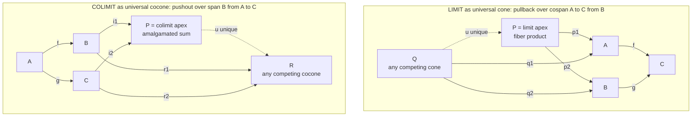

# 🔻 Limits and Colimits

> [!abstract] TL;DR
> A **limit** is the single best *summary from above* of a whole diagram of objects: the most efficient object that maps consistently **into** every object at once, so that **every** other such object factors through it *uniquely*. Products, terminal objects, intersections, kernels, equalizers, and **pullbacks** (fiber products) are all limits. A **colimit** is the exact dual — the best *summary from below* that everything maps **out to**, gluing the diagram together: coproducts, initial objects, unions, quotients, coequalizers, and **pushouts** (amalgamated sums) are all colimits. Limits **combine**; colimits **glue**. One universal-property theory subsumes nearly every construction in mathematics, and because it is defined by a universal property it **dualizes for free**.

---

## Intuition

**Analogy — the group photo versus the family reunion.** Suppose you have a sprawling diagram of related objects and you want *one* object that faithfully captures all of them.

- A **limit** is the perfect **group photo taken from above**. It is the single vantage point that "sees" every object at once through a consistent set of sightlines (one map *into* each object), and its sightlines respect every relationship drawn in the diagram. Crucially it is the *most efficient* such vantage point: any other object that also sees the whole diagram consistently must be looking *through* the limit — it factors through it by a **unique** map. A limit **combines** many objects into their tightest joint summary. Products ("all pairs"), intersections ("the elements common to both"), and pullbacks ("the pairs that agree over a shared target") are all this shape of combining.

- A **colimit** is the dual: the perfect **family reunion**, the smallest gathering *below* the diagram into which every object files itself, **gluing** overlapping pieces together wherever the diagram says they should be identified. Everything maps *out to* it, and any other gathering that also collects the diagram must receive the colimit first — again a **unique** factoring map. Sums (disjoint unions), unions (glued along overlaps), and quotients (identify related elements) are all this shape of gluing.

Limits are terminal (best receiver of maps *from* candidates), colimits are initial (best source of maps *to* candidates) — the same idea, viewed in a mirror.

---

## How It Works

### The setup: diagrams, cones, and cocones

Everything starts with a **diagram**. A diagram of *shape* `J` in a category `C` is a **functor** `D : J → C` from a small "index" or "shape" category `J` — a bare skeleton such as "two objects and no arrows," "a parallel pair `• ⇉ •`," or "a cospan `• → • ← •`." The functor `D` paints that skeleton with real objects and morphisms of `C`. (See `[[Diagrams_and_Commutativity]]`: a diagram *is* a functor, which is exactly why we can take limits *over* diagrams.)

A **cone** over the diagram `D` is an **apex** object `L` together with a *compatible family* of morphisms `π_j : L → D(j)`, one leg to every object in the diagram, where **compatible** means every triangle induced by an arrow `u : j → k` of the shape commutes: `D(u) ∘ π_j = π_k`. The apex "sees" the whole diagram and its sightlines respect the diagram's own arrows. Dually, a **cocone** flips every arrow: a **nadir** object `N` with maps `ι_j : D(j) → N` *from* every object, compatible in the same commuting sense.

Formally a cone is precisely a **natural transformation** from the constant functor `Δ_L` (everything sent to `L`) to `D`; a cocone is a natural transformation `D ⇒ Δ_N`. (See `[[Natural_Transformations]]`.)

### The limit: the universal (terminal) cone

The **limit** of `D`, written `lim D`, is the **universal cone** — the **terminal object in the category of all cones** over `D`. Concretely: it is a cone `(L, π_j)` such that for **every** other cone `(Q, q_j)` there is a **unique** mediating morphism `u : Q → L` with `π_j ∘ u = q_j` for all `j`. Every cone factors through the limit uniquely; the limit is the "best" apex, summarizing the diagram *from above*. Like all universal constructions it is **unique up to a unique isomorphism** (see `[[Isomorphisms_and_Special_Morphisms]]`).

### The colimit: the universal (initial) cocone

The **colimit** `colim D` is the exact dual: the **universal cocone** — the **initial object among cocones**. It is a cocone `(L, ι_j)` such that every other cocone `(R, r_j)` receives a **unique** `u : L → R` with `u ∘ ι_j = r_j`. The colimit summarizes the diagram *from below* by gluing. Because colimit is just "limit in the opposite category" `C^op`, every theorem about limits gives a colimit theorem *for free* — this is the payoff of `[[Duality_and_the_Opposite_Category]]`.

### The key special cases (one table, both mirrors)

| Shape `J` | Limit | Colimit (dual) |
|---|---|---|
| empty | **terminal** object `1` | **initial** object `0` |
| discrete (no arrows) | **product** `∏ A_i` | **coproduct** `∐ A_i` |
| parallel pair `• ⇉ •` | **equalizer** `{x : f x = g x}` | **coequalizer** `B/(f∼g)` |
| cospan `A → C ← B` | **pullback** / fiber product | — |
| span `B ← A → C` | — | **pushout** / amalgamated sum |

A **product** is the limit of a *discrete* diagram; a **terminal object** is the limit of the *empty* diagram; an **equalizer** is the sub-object where two parallel maps agree; a **pullback** `A ×_C B` is the limit of a cospan — the pairs that agree over `C` (intersections, preimages, fibered constructions). Dually the **coproduct**, **initial object**, **coequalizer** (quotient by a relation), and **pushout** (glue two objects along a shared part — the amalgamated sum, the van Kampen gluing of spaces). See `[[Products_and_Coproducts]]` and `[[Terminal_Initial_and_Zero_Objects]]` (forthcoming siblings) for the two simplest cases.

### Completeness, and how limits are assembled

A category is **complete** if it has *all small limits* and **cocomplete** if it has all small colimits. `Set`, `Grp`, `Top`, and every **presheaf category** are complete *and* cocomplete. A crucial structure theorem: **all limits are built from products and equalizers** (and dually all colimits from coproducts and coequalizers), so a category with those two ingredients has them all.

### Computing them in `Set` (the concrete recipes)

- **Limits are subsets of products.** `lim D` is the set of *compatible tuples* `(x_j)_j ∈ ∏_j D(j)` satisfying `D(u)(x_j) = x_k` for every arrow `u : j → k`. A **pullback** is thus the **fiber product** `{(a,b) : f(a) = g(b)}`; an **equalizer** is the subset `{x : f(x) = g(x)}`.
- **Colimits are quotients of coproducts.** `colim D` is the *disjoint union* `∐_j D(j)` **quotiented** by the smallest equivalence relation forced by the diagram's arrows. A **pushout** is the **amalgamated union** `(B ⊔ C)/∼` gluing `f(a) ∼ g(a)`; a **coequalizer** is `B` quotiented by `f(a) ∼ g(a)`.

### Diagram: cones, cocones, and the pullback / pushout squares



### Preservation, creation, and continuity

Which functors respect these constructions? The single most useful theorem: **right adjoints preserve limits (RAPL)** and **left adjoints preserve colimits (LAPC)**. A functor preserving all limits is called **continuous**; preserving colimits, **cocontinuous**. This instantly explains why forgetful functors (usually right adjoints) preserve products and pullbacks, while free functors (left adjoints) preserve coproducts and pushouts. (See the forthcoming sibling *Adjunctions*.)

### Filtered colimits and directed systems

A **filtered** (in particular **directed**) colimit is a colimit over a diagram where every finite sub-family has an upper bound — an *increasing system* of objects and inclusions. These **inductive / direct limits** formalize "the limit of an increasing sequence": the union of a chain of sets, the completion of a metric space, the stalk of a sheaf. This is exactly the categorical face of a **directed supremum** in domain theory — the least upper bound of a chain of approximations — which is how recursive definitions acquire meaning as fixed points. (See `[[Domain_Theory_and_Fixed_Points]]`.)

---

## Key Concepts

**Secondary (intuition first).**
- A **limit** is the best object that maps *into* a whole diagram at once; a **colimit** is the best object everything maps *out to*.
- Limits **combine** (products, intersections, "pairs that agree"); colimits **glue** (sums, unions, quotients).
- **Pullback** = "pairs `(a,b)` with `f(a) = g(b)`"; **pushout** = "glue two things along a shared part."

**Undergraduate (working definitions).**
- A **cone** over `D : J → C` is an apex `L` with legs `π_j : L → D(j)` commuting with every diagram arrow; a **cocone** flips the arrows.
- The **limit** is the *terminal* cone (every cone factors through it uniquely); the **colimit** is the *initial* cocone.
- Special cases: terminal/initial (empty diagram), product/coproduct (discrete), equalizer/coequalizer (parallel pair), pullback/pushout (cospan/span).
- In `Set`: limits = compatible tuples inside a product; colimits = quotients of a disjoint union.
- **Complete** = has all small limits; **cocomplete** = all small colimits. `Set`, `Grp`, `Top` are both.

**Graduate (structural view).**
- A cone is a natural transformation `Δ_L ⇒ D`; the limit represents the functor `C → Set`, `X ↦ Cone(X, D) = Nat(Δ_X, D)`, so `lim D` is a **representing object** (density/`Hom`-preservation: `Hom(X, lim D) ≅ lim Hom(X, D-)`).
- **Existence:** limits reduce to products + equalizers; a category with all products and equalizers is complete.
- **Preservation:** **right adjoints preserve limits, left adjoints preserve colimits**; representable functors `Hom(X, -)` are continuous. **Creation** of limits (as opposed to mere preservation) is what makes monadic forgetful functors reflect algebraic structure.
- **Filtered colimits** commute with finite limits in `Set`; **presheaf categories** `[C^op, Set]` are complete and cocomplete and computed *pointwise*, and every presheaf is a colimit of representables (the **co-Yoneda / density** formula). (See the forthcoming sibling *Presheaves and Representables*.)
- Recursive/inductive data types are **initial algebras** (colimits of a chain `0 → F0 → F²0 → …`); coinductive types are **terminal coalgebras** (limits) — see the forthcoming sibling *F-Algebras and Initial Algebras*.

---

## Python Demo

We compute **limits and colimits in `FinSet`** (finite sets and functions) directly from their universal properties, and *verify* each universal property by constructing the **unique mediating (co)cone map** and checking every triangle commutes. We do a **pullback** (fiber product) and an **equalizer** on the limit side, then dually a **coequalizer** and a **pushout** on the colimit side, and finally **visualize** the pullback square and pushout square with the computed apex using matplotlib.

```python
# Limits and colimits in FinSet, built by their universal properties, with the
# unique mediating (co)cone arrow verified. Pure stdlib for the math;
# matplotlib only for the picture. (numpy not required.)
from itertools import product
import matplotlib.pyplot as plt


# ---- tiny union-find: quotients are how colimits glue ------------------
class UnionFind:
    def __init__(self, items):
        self.parent = {x: x for x in items}

    def find(self, x):
        root = x
        while self.parent[root] != root:
            root = self.parent[root]
        while self.parent[x] != root:          # path compression
            self.parent[x], x = root, self.parent[x]
        return root

    def union(self, a, b):
        self.parent[self.find(a)] = self.find(b)

    def classes(self):
        buckets = {}
        for x in self.parent:
            buckets.setdefault(self.find(x), []).append(x)
        return [sorted(c, key=str) for c in buckets.values()]


# ============================ LIMITS ====================================
def pullback(A, B, f, g):
    """Limit of the cospan  A --f--> C <--g-- B.
    Fiber product P = {(a,b) : f(a) = g(b)} with projections p1, p2."""
    P = [(a, b) for a, b in product(A, B) if f[a] == g[b]]
    p1 = {ab: ab[0] for ab in P}
    p2 = {ab: ab[1] for ab in P}
    return P, p1, p2


def pullback_mediating(P, p1, p2, Q, q1, q2):
    """Universal cone: for any cone (Q, q1:Q->A, q2:Q->B) with f q1 = g q2,
    the UNIQUE u:Q->P is u(x) = (q1 x, q2 x)."""
    u = {x: (q1[x], q2[x]) for x in Q}
    assert all(u[x] in P for x in Q),            "cone must land in pullback"
    assert all(p1[u[x]] == q1[x] for x in Q),    "triangle p1 . u = q1 broke"
    assert all(p2[u[x]] == q2[x] for x in Q),    "triangle p2 . u = q2 broke"
    return u


def equalizer(A, f, g):
    """Limit of a parallel pair f,g:A->B. E = {a : f a = g a}, inclusion."""
    E = [a for a in A if f[a] == g[a]]
    incl = {a: a for a in E}
    return E, incl


def equalizer_mediating(E, incl, Q, m):
    """For any m:Q->A with f m = g m, the UNIQUE u:Q->E with incl . u = m."""
    u = {x: m[x] for x in Q}
    assert all(u[x] in E for x in Q),            "arrow must factor through E"
    assert all(incl[u[x]] == m[x] for x in Q),   "triangle incl . u = m broke"
    return u


# ============================ COLIMITS ==================================
def coequalizer(A, B, f, g):
    """Colimit of a parallel pair f,g:A->B. Quotient B/~ with f(a) ~ g(a)."""
    uf = UnionFind(B)
    for a in A:
        uf.union(f[a], g[a])
    q = {b: uf.find(b) for b in B}               # quotient map B -> B/~
    return uf.classes(), q


def coequalizer_mediating(q, B, R, h):
    """For any h:B->R with h f = h g, the UNIQUE u:(B/~)->R with u . q = h."""
    u = {}
    for b in B:
        cls = q[b]
        if cls in u:
            assert u[cls] == h[b], "h not constant on a glued class"
        else:
            u[cls] = h[b]
    assert all(u[q[b]] == h[b] for b in B),      "triangle u . q = h broke"
    return u


def pushout(A, B, C, f, g):
    """Colimit of the span  B <--f-- A --g--> C.
    Amalgamated sum (B (+) C)/~ with (B, f a) ~ (C, g a); injections i1, i2."""
    tagged = [("B", b) for b in B] + [("C", c) for c in C]
    uf = UnionFind(tagged)
    for a in A:
        uf.union(("B", f[a]), ("C", g[a]))
    i1 = {b: uf.find(("B", b)) for b in B}
    i2 = {c: uf.find(("C", c)) for c in C}
    return uf.classes(), i1, i2


def pushout_mediating(i1, i2, B, C, R, r1, r2):
    """For any cocone (R, r1:B->R, r2:C->R) with r1 f = r2 g, the UNIQUE
    u:P->R with u i1 = r1 and u i2 = r2."""
    u = {}

    def assign(cls, val):
        if cls in u:
            assert u[cls] == val, "cocone not constant on a glued class"
        else:
            u[cls] = val

    for b in B:
        assign(i1[b], r1[b])
    for c in C:
        assign(i2[c], r2[c])
    assert all(u[i1[b]] == r1[b] for b in B),    "triangle u . i1 = r1 broke"
    assert all(u[i2[c]] == r2[c] for c in C),    "triangle u . i2 = r2 broke"
    return u


# ---- pretty-printing of finite-set apexes ------------------------------
def fmt(items):
    parts = []
    for it in items:
        if isinstance(it, tuple):
            parts.append("(" + ",".join(map(str, it)) + ")")
        elif isinstance(it, list):
            parts.append("{" + ",".join(map(str, it)) + "}")
        else:
            parts.append(str(it))
    return "{" + ", ".join(parts) + "}"


# ---- matplotlib: draw the two universal squares ------------------------
def _draw_square(ax, pos, lab, edges, corner, title):
    for s, t, name in edges:
        (x0, y0), (x1, y1) = pos[s], pos[t]
        ax.annotate("", xy=(x1, y1), xytext=(x0, y0),
                    arrowprops=dict(arrowstyle="-|>", color="tab:blue",
                                    lw=2, shrinkA=26, shrinkB=26))
        ax.text((x0 + x1) / 2, (y0 + y1) / 2, name, color="tab:blue",
                fontsize=11, ha="center", va="center",
                bbox=dict(boxstyle="round,pad=0.2", fc="white", ec="none"))
    for n, (x, y) in pos.items():
        apex = (n == corner)
        ax.scatter([x], [y], s=3200 if apex else 1500,
                   color="#ffe6c2" if apex else "white",
                   edgecolors="black", zorder=3)
        ax.text(x, y, lab[n], ha="center", va="center",
                fontsize=8 if apex else 12, zorder=4)
    ax.set_title(title, fontsize=11)
    ax.set_xlim(-0.6, 1.6)
    ax.set_ylim(-0.6, 1.6)
    ax.axis("off")


def draw_pullback(ax, P):
    pos = {"P": (0, 1), "B": (1, 1), "A": (0, 0), "C": (1, 0)}
    lab = {"P": "P = pullback\n" + fmt(P), "B": "B", "A": "A", "C": "C"}
    edges = [("P", "B", "p2"), ("P", "A", "p1"),
             ("A", "C", "f"), ("B", "C", "g")]
    _draw_square(ax, pos, lab, edges, corner="P",
                 title="PULLBACK / fiber product\nf p1 = g p2  (universal cone)")


def draw_pushout(ax, P):
    pos = {"A": (0, 1), "C": (1, 1), "B": (0, 0), "P": (1, 0)}
    lab = {"A": "A", "C": "C", "B": "B", "P": "P = pushout\n" + fmt(P)}
    edges = [("A", "C", "g"), ("A", "B", "f"),
             ("B", "P", "i1"), ("C", "P", "i2")]
    _draw_square(ax, pos, lab, edges, corner="P",
                 title="PUSHOUT / amalgamated sum\ni1 f = i2 g  (universal cocone)")


if __name__ == "__main__":
    # ---- PULLBACK: cospan  A --f--> C <--g-- B ----
    A = ["a1", "a2", "a3"]
    B = ["b1", "b2"]
    f = {"a1": "c1", "a2": "c1", "a3": "c2"}
    g = {"b1": "c1", "b2": "c2"}
    P, p1, p2 = pullback(A, B, f, g)
    assert all(f[a] == g[b] for a, b in P)         # the cone commutes
    print("PULLBACK  P = {(a,b) : f a = g b}")
    print("  P =", P)
    Q = ["w1", "w2"]                                # a competing cone
    q1, q2 = {"w1": "a1", "w2": "a3"}, {"w1": "b1", "w2": "b2"}
    u = pullback_mediating(P, p1, p2, Q, q1, q2)
    print("  unique mediating u:", u, "-> both triangles commute\n")

    # ---- EQUALIZER: parallel pair on S,  f = id,  g = square mod 4 ----
    S = [0, 1, 2, 3]
    fe = {x: x for x in S}
    ge = {x: (x * x) % 4 for x in S}
    E, incl = equalizer(S, fe, ge)
    print("EQUALIZER E = {x : x = x*x mod 4}")
    print("  E =", E)
    ue = equalizer_mediating(E, incl, ["t"], {"t": 1})
    print("  unique mediating u:", ue, "\n")

    # ---- COEQUALIZER: glue x ~ y in B ----
    Ac, Bc = ["r"], ["x", "y", "z"]
    fc, gc = {"r": "x"}, {"r": "y"}
    cls, qmap = coequalizer(Ac, Bc, fc, gc)
    print("COEQUALIZER of f,g : quotient B by  x ~ y")
    print("  classes =", cls)
    uc = coequalizer_mediating(qmap, Bc, {0, 1}, {"x": 0, "y": 0, "z": 1})
    print("  unique mediating u on classes:", uc, "\n")

    # ---- PUSHOUT: span  B <--f-- A --g--> C, glue b1 ~ c1 ----
    Ap, Bp, Cp = ["a"], ["b1", "b2"], ["c1", "c2"]
    fp, gp = {"a": "b1"}, {"a": "c1"}
    Ppo, i1, i2 = pushout(Ap, Bp, Cp, fp, gp)
    assert all(i1[fp[a]] == i2[gp[a]] for a in Ap)  # the cocone commutes
    print("PUSHOUT  (B (+) C)/~  gluing  b1 ~ c1")
    print("  classes =", Ppo)
    r1, r2 = {"b1": 10, "b2": 20}, {"c1": 10, "c2": 30}
    upo = pushout_mediating(i1, i2, Bp, Cp, {10, 20, 30}, r1, r2)
    print("  unique mediating u:", upo, "\n")

    # ---- VISUALIZE the two universal squares ----
    fig, axes = plt.subplots(1, 2, figsize=(11, 5))
    draw_pullback(axes[0], P)
    draw_pushout(axes[1], Ppo)
    fig.suptitle("Universal squares in FinSet: pullback (limit) vs pushout (colimit)")
    fig.tight_layout()
    fig.savefig("limits_colimits_squares.png", dpi=120)
    print("saved limits_colimits_squares.png")
```

Expected console output:

```
PULLBACK  P = {(a,b) : f a = g b}
  P = [('a1', 'b1'), ('a2', 'b1'), ('a3', 'b2')]
  unique mediating u: {'w1': ('a1', 'b1'), 'w2': ('a3', 'b2')} -> both triangles commute

EQUALIZER E = {x : x = x*x mod 4}
  E = [0, 1]
  unique mediating u: {'t': 1}

COEQUALIZER of f,g : quotient B by  x ~ y
  classes = [['x', 'y'], ['z']]
  unique mediating u on classes: {...: 0, ...: 1}

PUSHOUT  (B (+) C)/~  gluing  b1 ~ c1
  classes = [[('B', 'b1'), ('C', 'c1')], [('B', 'b2')], [('C', 'c2')]]
  unique mediating u: {...: 10, ...: 20, ...: 30}
```

The point is not the sets themselves but the **`assert`s**: every construction is verified to be a *universal* (co)cone — the mediating map exists, is forced (unique), and makes every triangle commute. The fiber product `{(a,b) : f(a) = g(b)}` is literally the limit recipe; the amalgamated quotient is literally the colimit recipe.

---

## Real-World Applications

> **Example — typed database joins and pattern-matching as pullbacks.** A SQL **inner join** `R ⋈ S ON R.k = S.k` is exactly the **pullback** (fiber product) of the two key-projection maps `R → K ← S`: the rows kept are precisely the pairs that *agree over the shared column* `K`. This is not an analogy — categorical-database systems (the CQL / algebraic-data-integration line of work) *define* joins as pullbacks and data merges as pushouts, so schema mappings compose with provable correctness. `[[Categorical_Databases_and_Systems]]` (forthcoming sibling) develops this.

- **Unification in type inference and Prolog.** The most-general unifier of two terms is a **pullback / pushout** in a category of substitutions: pattern-matching "make these two agree" is a universal construction, which is why unifiers are unique up to renaming.
- **Gluing spaces in topology.** The **pushout** builds new spaces by amalgamating along a shared subspace — CW-complexes, connected sums, and the **Seifert–van Kampen** theorem (the fundamental group of a union is a pushout of groups). Sheaves reassemble global data from local pieces via colimits.
- **Recursive & coinductive data types.** A recursive type `List a = 1 + a × List a` is an **initial algebra** — a colimit of the chain `0 → F0 → F²0 → …`; infinite/streaming types are **terminal coalgebras** (limits). Compilers and total-functional languages reason about `fold`/`unfold` through these (co)limits. See `[[Domain_Theory_and_Fixed_Points]]` and `[[F_Algebras_and_Initial_Algebras]]` (forthcoming sibling).
- **Configuration and build systems.** Merging feature branches or configuration overlays that share a common ancestor is a **pushout** (amalgamated sum) — precisely the three-way-merge shape `theirs ← base → ours`.

---

## Common Pitfalls

- **Forgetting the compatibility/commuting condition.** A cone is *not* just "an apex with some maps"; the legs must commute with **every** arrow of the diagram. Drop that and a pullback degenerates into a mere product, losing the "agree over `C`" content.
- **Assuming existence.** Not every diagram has a limit or colimit in every category. `Set` is complete and cocomplete, but a general category may lack pullbacks or pushouts; always check the category is (co)complete for the shape you need.
- **Confusing uniqueness of the object with uniqueness of the map.** The limit is unique *up to unique isomorphism* (the object is only pinned down abstractly), while the **mediating map** from each competing cone is unique *on the nose*. Both matter, but they are different statements.
- **Mixing up which side "combines" and which "glues."** Limits (products, pullbacks, equalizers) **restrict/combine** — they carve out compatible tuples. Colimits (coproducts, pushouts, coequalizers) **quotient/glue** — they identify elements. Reaching for a product when you meant a quotient is the classic beginner error.
- **Expecting functors to preserve everything.** A functor need not preserve limits *or* colimits. The reliable rule is **right adjoints preserve limits, left adjoints preserve colimits** — use it instead of hoping. A forgetful functor that is not a right adjoint can destroy pullbacks.
- **Filtered vs arbitrary colimits.** "Take the limit of an increasing sequence" means a **filtered/directed colimit**, which has special properties (e.g. commutes with finite limits in `Set`). Arbitrary colimits do not enjoy these, so do not transfer intuition from directed unions to all pushouts.

---

## Related Concepts

- [[Diagrams_and_Commutativity]] — a diagram is a functor `J → C`; a cone/cocone is that diagram plus a commuting apex, so limits and colimits are literally *taken over* commutative diagrams.
- [[Duality_and_the_Opposite_Category]] — a colimit is exactly a limit in `C^op`; every limit theorem dualizes into a colimit theorem for free, which is why the two halves of this note are mirror images.
- [[Natural_Transformations]] — a cone is a natural transformation from the constant functor `Δ_L` to the diagram `D`; the limit is the universal such transformation.
- [[Isomorphisms_and_Special_Morphisms]] — limits and colimits are unique up to unique isomorphism, and monos/epis interact with pullbacks/pushouts (pullback of a mono is a mono).
- [[Examples_of_Categories]] — `Set`, `Grp`, and `Top` are the standard complete-and-cocomplete categories where the concrete tuple/quotient recipes live.
- [[Domain_Theory_and_Fixed_Points]] — directed/filtered colimits are the categorical form of directed suprema; recursive definitions get meaning as (co)limits of approximation chains.
- [[Monads_and_Effects]] — algebraic/free constructions and recursive types are built as colimits; monadic forgetful functors *create* limits.
- [[Functional_Programming_Foundations]] — product and sum types are the product/coproduct (simplest limit/colimit), and `fold` over recursive data is the universal map out of an initial algebra.

*Forthcoming sibling notes in this vault (referenced above): Universal Properties; Products and Coproducts; Terminal, Initial and Zero Objects; Adjunctions; Presheaves and Representables; F-Algebras and Initial Algebras; Categorical Databases and Systems.*

---

## Review Questions

1. **Conceptual.** Explain, without formulas, why a pullback of `A → C ← B` is "the object of pairs that agree over `C`," and why the *terminal-cone* (universal) requirement is what forces it to be the fiber product `{(a,b) : f(a) = g(b)}` rather than just some object with two projections. What would go wrong if you dropped the commuting condition on the cone?
2. **Scenario.** You need to merge two configuration files that were both edited from a common base version. Argue that the correct construction is a **pushout** of the span `theirs ← base → ours`, identify what the "gluing along the shared part" achieves, and describe one situation (a merge conflict) where the naive pushout in `Set` fails to be well-defined and what the universal property tells you must be true for it to succeed.
3. **Trade-off / structural.** State the theorem "right adjoints preserve limits, left adjoints preserve colimits." Given a forgetful functor `U : Grp → Set` (a right adjoint to the free-group functor), predict which of {products, coproducts, equalizers, pushouts} `U` preserves, and explain the practical consequence: why the underlying set of a product of groups is the product of the underlying sets, but the underlying set of a coproduct (free product) of groups is *not* the disjoint union.

---

## Sources

- Saunders Mac Lane, *Categories for the Working Mathematician*, 2nd ed. (Springer, 1998) — Chapter III/V: cones, limits, colimits, completeness, and preservation by adjoints.
- Emily Riehl, *Category Theory in Context* (Dover, 2016; free from the author's site) — Chapter 3: limits and colimits as terminal/initial (co)cones, computed in `Set`.
- Tom Leinster, *Basic Category Theory* (Cambridge University Press, 2014; arXiv:1612.09375) — Chapter 5: limits, the product-plus-equalizer construction, and preservation.
- Steve Awodey, *Category Theory*, 2nd ed. (Oxford University Press, 2010) — pullbacks, pushouts, and their universal properties with worked `Set` examples.
- nLab, "limit," "colimit," "pullback," and "pushout" entries (ncatlab.org) — the universal-cone definition, duality, and the fiber-product / amalgamated-sum recipes.

---

#category-theory #limits #colimits #pullback #pushout
