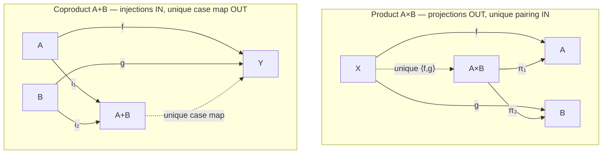

# 🔀 Products and Coproducts

> [!abstract] TL;DR
> A **product** $A \times B$ bundles two objects so you can always **project back out** either one; a **coproduct** $A + B$ is its exact mirror image and offers a tagged **choice** — either an $A$ or a $B$. Neither is defined by *how it is built*: each is pinned down by a **universal property**. The product is the *most efficient* object mapping **out to** both $A$ and $B$ (two projections $\pi_1, \pi_2$, and from any $X$ a **unique** pairing $\langle f, g\rangle$); the coproduct is what you get by **reversing every arrow** — the most efficient object receiving maps **in from** $A$ and $B$ (two injections $\iota_1, \iota_2$, and to any $Y$ a **unique** case map $[f,g]$). This one duality is the categorical meaning of "**and**" versus "**or**", and it is the beating heart of type theory: the product is the **tuple/record** type, the coproduct is the **sum / tagged-union / `Either`** type, and their universal properties are exactly the introduction and elimination rules.

---

## Intuition

**Analogy — a bundle versus a labelled choice.** Think of a `(name, age)` pair. A **product** is that bundle: you hand over one packaged thing, and from it you can always **project** back out *either* the name *or* the age — nothing is lost, both are recoverable. Now flip it. A **coproduct** is a labelled box that contains *either* a name *or* an age, but never both, with a tag on the outside telling you which. From a product you *extract*; into a coproduct you *inject*. Product says "**both, projectable**"; coproduct says "**either, tagged**."

The subtle, beautiful part is that neither is defined by its guts. We do not say "a product is a set of pairs." We say: a product is **whatever object** does the job of mapping efficiently *out to* both $A$ and $B$, so cleanly that **any** other object trying to map to both must route through it by exactly **one** map. That "for all... there exists a unique..." phrasing is the **universal property** (see [[Universal_Properties]]), and it defines the product *up to unique isomorphism* without ever peeking inside. Reverse the direction of every arrow in that definition and you get the coproduct for free — the single sharpest illustration of **duality** in all of mathematics (see [[Duality_and_the_Opposite_Category]]).

---

## How It Works

### The product and its universal property

A **product** of objects $A$ and $B$ is an object $A \times B$ equipped with two **projections**
$$\pi_1 \colon A \times B \to A, \qquad \pi_2 \colon A \times B \to B,$$
satisfying this **universal property**: for **any** object $X$ with maps $f \colon X \to A$ and $g \colon X \to B$, there exists a **unique** morphism $\langle f, g\rangle \colon X \to A \times B$ — the **pairing** or **mediating map** — such that both **projection triangles commute**:
$$\pi_1 \circ \langle f, g\rangle = f \qquad\text{and}\qquad \pi_2 \circ \langle f, g\rangle = g.$$

Read it as an efficiency claim: $A \times B$ is the *most efficient* object mapping to both $A$ and $B$. Any competitor $X$ that maps to both is *forced* to factor through $A \times B$, and in only **one** way. The word *unique* is doing all the work — existence alone would be cheap; uniqueness is what makes the product a genuine *definition*. This is the "unique dashed arrow making the diagram commute" pattern of every universal property (see [[Diagrams_and_Commutativity]]).

### The coproduct: reverse every arrow

The **coproduct** is the **exact dual** — take the product's definition and flip the direction of every arrow. A coproduct of $A$ and $B$ is an object $A + B$ with two **injections**
$$\iota_1 \colon A \to A + B, \qquad \iota_2 \colon B \to A + B,$$
such that for **any** object $Y$ with maps $f \colon A \to Y$ and $g \colon B \to Y$, there is a **unique** morphism $[f, g] \colon A + B \to Y$ — the **case map** (case analysis) — with both triangles commuting:
$$[f, g] \circ \iota_1 = f \qquad\text{and}\qquad [f, g] \circ \iota_2 = g.$$

Where the product was the most efficient object mapping *out to* $A$ and $B$, the coproduct is the most efficient object receiving maps *in from* $A$ and $B$. The pairing $\langle f, g\rangle$ dualizes to the case map $[f, g]$; projections dualize to injections. Nothing new was invented — arrows were reversed.

### Same universal property, many categories

The definitions never mention elements, so they instantiate across every category, each time producing the "right" construction (see [[Examples_of_Categories]]):

| Category | Product $A \times B$ | Coproduct $A + B$ |
|---|---|---|
| **Set** | cartesian product with `fst`/`snd` | **disjoint (tagged) union** |
| **Grp** | direct product $G \times H$ | **free product** $G * H$ |
| **Vect** | direct sum $V \oplus W$ | direct sum $V \oplus W$ (**same!**) |
| **Top** | product space (product topology) | disjoint-union space |
| **Poset** | **meet / infimum** $a \wedge b$ | **join / supremum** $a \vee b$ |

The poset case is striking: a partial order is a category with at most one arrow $a \to b$ (meaning $a \le b$), and there the product *is* the greatest lower bound and the coproduct *is* the least upper bound. One universal property, radically different concrete forms.

### Duality made visible

Products and coproducts are the textbook illustration of **duality**: $A + B$ in $\mathcal{C}$ is precisely $A \times B$ computed in the opposite category $\mathcal{C}^{\mathrm{op}}$. Every theorem you prove about products yields a dual theorem about coproducts for free, by mechanically reversing arrows — projections $\leftrightarrow$ injections, pairing $\leftrightarrow$ case-analysis, "maps out" $\leftrightarrow$ "maps in" (see [[Duality_and_the_Opposite_Category]]).

### $n$-ary and empty: terminal and initial

Products extend to any finite (or infinite) family: $A_1 \times \cdots \times A_n$ has $n$ projections and a unique tupling map. The **empty product** — a product over *no* objects — is the **terminal object** $\mathbf{1}$ (one arrow *into* it from every object). Dually the **empty coproduct** is the **initial object** $\mathbf{0}$ (one arrow *out of* it to every object). In **Set**, $\mathbf{1}$ is a one-element set and $\mathbf{0}$ is the empty set; these are the base cases of the whole hierarchy (a not-yet-written sibling *Terminal, Initial and Zero Objects* covers them).

### Products as limits, coproducts as colimits

Both are the simplest **limits** and **colimits**. Take a *discrete diagram* — just the objects $A, B$ with no arrows between them. A cone over it is exactly a pair of maps $X \to A$, $X \to B$; the **limit** (terminal cone) is the **product**. Reverse everything: a cocone under the discrete diagram is a pair $A \to Y$, $B \to Y$, and the **colimit** (initial cocone) is the **coproduct**. Products/coproducts are limits/colimits over the emptiest possible shape, which is why they are the first universal constructions everyone learns (see [[Limits_and_Colimits]]).

### The CS heart: product and sum types

This is where category theory becomes concrete programming. In a typed language:

- The **product** $A \times B$ is the **pair / tuple / record** type. Its two projections are `fst`/`snd` (field access); the pairing $\langle f, g\rangle$ is "compute both fields from one input." The universal property *is* the **introduction rule** (build a pair) plus **elimination rules** (project).
- The **coproduct** $A + B$ is the **sum / tagged-union / `Either` / enum** type. Its injections are the constructors `Left`/`Right` (or `inl`/`inr`); the case map $[f, g]$ is **pattern matching**. Again the universal property *is* the intro rule (inject with a tag) plus the elimination rule (match).

So **algebraic data types literally are products and coproducts**. Under the **Curry–Howard** reading, propositions are types and this dictionary continues: the product is logical **AND** (conjunction — a proof of $A \wedge B$ is a *pair* of proofs), and the coproduct is logical **OR** (disjunction — a proof of $A \vee B$ is a *tagged choice*). See [[The_Curry_Howard_Correspondence]], [[Type_Systems_Fundamentals]], and [[Simply_Typed_Lambda_Calculus]]. (The three-way Curry–Howard–**Lambek** correspondence, which adds "and category theory," is a not-yet-written sibling.)

### The algebra of types

Because products and coproducts obey the same laws as multiplication and addition, **types form a semiring**, and the isomorphisms mirror ordinary school algebra:

$$A \times \mathbf{1} \cong A, \qquad A \times B \cong B \times A, \qquad A + \mathbf{0} \cong A,$$
$$A \times (B + C) \cong (A \times B) + (A \times C) \quad\text{(distributivity)}.$$

Here $\mathbf{1}$ (terminal, the unit type) plays the role of $1$ and $\mathbf{0}$ (initial, `Void`) the role of $0$. This "algebra of types" is not a cute analogy — it justifies real refactors: a record with an `Either` field is *isomorphic* to a tagged union of two records, exactly as $A(B+C) = AB + AC$. A category where product distributes over coproduct like this is called **distributive**.

### Biproducts and additive categories

In some categories the product and coproduct **coincide**: in **Vect**, $V \oplus W$ is simultaneously the direct product *and* the direct sum. Such a self-dual construction is a **biproduct**, the defining feature of **additive** and **abelian** categories (where a not-yet-written sibling *Abelian Categories and Homological Algebra* takes over). In **Set** the two are wildly different ($|A \times B| = |A|\cdot|B|$ versus $|A + B| = |A| + |B|$), which is exactly why "and" and "or" feel so different there.

### Flow / Architecture



The two panels are the same picture with **every arrow reversed**: swap $X \leftrightarrow Y$, $A \times B \leftrightarrow A + B$, projections $\leftrightarrow$ injections, and the dashed *pairing* becomes the dashed *case map*.

---

## Key Concepts

### Secondary (intuitive)
- **Product = bundle you can unpack.** Package two things so you can always project either one back out — like a `(name, age)` pair.
- **Coproduct = tagged choice.** Hold *either* one thing *or* another, with a label saying which — like "this box has a name" versus "this box has an age."
- **Not built, but characterized.** We do not describe *what a product is made of*; we describe *what it must do*: be the tidiest object that maps to both pieces.

### Undergraduate (working definitions)
- **Product.** Object $A \times B$ with projections $\pi_1, \pi_2$; every $X$ with $f, g$ factors *uniquely* via $\langle f, g\rangle$ making $\pi_i \circ \langle f, g\rangle$ equal $f, g$.
- **Coproduct.** The dual: object $A + B$ with injections $\iota_1, \iota_2$; every $Y$ receiving $f, g$ is hit *uniquely* via $[f, g]$ with $[f, g] \circ \iota_i = f, g$.
- **Uniqueness up to iso.** Any two products of $A$ and $B$ are isomorphic by a *unique* isomorphism commuting with projections (see [[Isomorphisms_and_Special_Morphisms]]); the same for coproducts.
- **Empty cases.** Empty product $=$ terminal object $\mathbf{1}$; empty coproduct $=$ initial object $\mathbf{0}$.
- **Type-theory reading.** Product $=$ tuple/record with `fst`/`snd`; coproduct $=$ `Either`/enum with constructors and pattern matching.

### Graduate (structural view)
- **Limits/colimits.** Product $=$ limit of a discrete two-object diagram; coproduct $=$ its colimit. Everything generalizes to arbitrary index categories (see [[Limits_and_Colimits]]).
- **Representability.** The product represents the functor $X \mapsto \mathrm{Hom}(X, A) \times \mathrm{Hom}(X, B)$; the natural isomorphism $\mathrm{Hom}(X, A \times B) \cong \mathrm{Hom}(X, A) \times \mathrm{Hom}(X, B)$ *is* the universal property (see [[Natural_Transformations]]).
- **Distributivity and biproducts.** Distributive categories satisfy $A \times (B + C) \cong A\times B + A\times C$; in additive/abelian categories the two constructions merge into a **biproduct** $A \oplus B$.
- **Semiring of types.** Objects under $(\times, +, \mathbf{1}, \mathbf{0})$ form a **rig/semiring** up to iso; this "algebra of types" underlies generic programming and combinatorial species.
- **Curry–Howard–Lambek.** Product $\leftrightarrow$ conjunction $\leftrightarrow$ tuple; coproduct $\leftrightarrow$ disjunction $\leftrightarrow$ sum; the intro/elim rules are the universal properties, and the exponential $B^A$ (function type) completes the picture in a cartesian closed category.

---

## Python Demo

We build the **product** and **coproduct** in **FinSet** *strictly by their universal properties*, verify the commuting triangles, **brute-force the uniqueness clause**, show the two are **dual** (reverse the arrows), and then exhibit that these are exactly the **product (tuple)** and **sum (`Either`) types** of ordinary programming. Finally we visualize both universal diagrams with matplotlib. Pure standard library plus matplotlib; no numpy.

```python
"""
Products and Coproducts in FinSet, defined by their UNIVERSAL PROPERTIES.

  PRODUCT   A x B : object with projections fst/snd such that any X with
                    f:X->A, g:X->B factors UNIQUELY through <f,g>:X->A x B.
  COPRODUCT A + B : the exact DUAL (reverse every arrow) -- the tagged union
                    with injections inl/inr such that any Y receiving
                    f:A->Y, g:B->Y is hit UNIQUELY by the case map [f,g].

These are precisely the PRODUCT (tuple/record) and SUM (Either/tagged-union)
types of programming. Pure stdlib + matplotlib.
"""
from itertools import product as cartesian     # cartesian power, for uniqueness search
import matplotlib.pyplot as plt

# A morphism in FinSet is a dict {x: f(x)}.  Composition is (g o f)(x) = g(f(x)).
def compose(g, f):
    return {x: g[f[x]] for x in f}


# =====================================================================
# PRODUCT  A x B  -- pairs, with projections fst = pi_1, snd = pi_2
# =====================================================================
def product_object(A, B):
    return [(a, b) for a in A for b in B]

def fst(A, B):
    return {(a, b): a for a in A for b in B}        # pi_1 : A x B -> A

def snd(A, B):
    return {(a, b): b for a in A for b in B}        # pi_2 : A x B -> B

def pairing(f, g):
    """<f,g> : X -> A x B, the UNIQUE mediating map. dom(f) == dom(g) == X."""
    return {x: (f[x], g[x]) for x in f}

def check_product(A, B, X, f, g):
    p1, p2 = fst(A, B), snd(A, B)
    mediating = pairing(f, g)                        # <f,g>
    # (1) projection triangles commute:  pi_1 o <f,g> = f  and  pi_2 o <f,g> = g
    assert compose(p1, mediating) == f
    assert compose(p2, mediating) == g
    # (2) UNIQUENESS: any u:X->A x B with pi_1 o u = f and pi_2 o u = g equals <f,g>
    AxB = product_object(A, B)
    count = 0
    for vals in cartesian(AxB, repeat=len(X)):
        u = dict(zip(X, vals))
        if compose(p1, u) == f and compose(p2, u) == g:
            assert u == mediating                    # forced to be the pairing
            count += 1
    assert count == 1                                # exactly one mediating map
    return mediating


# =====================================================================
# COPRODUCT  A + B  -- tagged/disjoint union, injections inl = i_1, inr = i_2
# =====================================================================
def coproduct_object(A, B):
    return [("inl", a) for a in A] + [("inr", b) for b in B]

def inl(A):
    return {a: ("inl", a) for a in A}                # i_1 : A -> A + B

def inr(B):
    return {b: ("inr", b) for b in B}                # i_2 : B -> A + B

def casing(f, g):
    """[f,g] : A + B -> Y, the UNIQUE co-mediating map = pattern match on tag."""
    out = {}
    for a in f:                                      # left branch
        out[("inl", a)] = f[a]
    for b in g:                                      # right branch
        out[("inr", b)] = g[b]
    return out

def check_coproduct(A, B, Y, f, g):
    i1, i2 = inl(A), inr(B)
    comediating = casing(f, g)                       # [f,g]
    # (1) injection triangles commute:  [f,g] o inl = f  and  [f,g] o inr = g
    assert compose(comediating, i1) == f
    assert compose(comediating, i2) == g
    # (2) UNIQUENESS: any u:A + B -> Y with u o inl = f and u o inr = g equals [f,g]
    ApB = coproduct_object(A, B)
    count = 0
    for vals in cartesian(Y, repeat=len(ApB)):
        u = dict(zip(ApB, vals))
        if compose(u, i1) == f and compose(u, i2) == g:
            assert u == comediating
            count += 1
    assert count == 1
    return comediating


# =====================================================================
# DUALITY -- the coproduct is the product with every arrow reversed.
# For product the given data are maps X->A, X->B (mapping OUT of X);
# for coproduct they are maps A->Y, B->Y (mapping INTO Y).
# The mediating arrow flips direction: X -> A x B    vs    A + B -> Y.
# =====================================================================
def show_duality():
    print("DUALITY (reverse every arrow):")
    print("  product:   X --f--> A ,  X --g--> B    give unique  X --<f,g>--> A x B")
    print("  coproduct: A --f--> Y ,  B --g--> Y    give unique  A + B --[f,g]--> Y")
    print("  projections pi_i  <-->  injections i_i ;  pairing <f,g>  <-->  case [f,g]\n")


# =====================================================================
# SAME THING IN ORDINARY PYTHON TYPES
#   product type = tuple (projections = indexing, pairing = build the tuple)
#   sum type     = Either / tagged union (case map = pattern match)
# =====================================================================
def show_types():
    # ---- PRODUCT type: a tuple ----
    f = lambda x: x * 2            # X -> A
    g = lambda x: x + 100         # X -> B
    pair = lambda x: (f(x), g(x)) # <f,g> : X -> A x B
    x = 7
    a, b = pair(x)                # fst / snd  == pi_1 / pi_2
    assert (a, b) == (f(x), g(x)) # projection triangles hold at the value level

    # ---- SUM type: Either encoded as ("Left", a) / ("Right", b) == inl / inr ----
    from_a = lambda a: f"A:{a}"   # f : A -> Y
    from_b = lambda b: f"B:{b}"   # g : B -> Y
    def case(e):                  # [f,g] : A + B -> Y  (this IS pattern matching)
        tag, v = e
        return from_a(v) if tag == "Left" else from_b(v)
    assert case(("Left", 3)) == "A:3"     # [f,g] o inl = f
    assert case(("Right", 9)) == "B:9"    # [f,g] o inr = g
    print("product type = tuple, sum type = Either: universal properties hold "
          "at the value level.\n")


# =====================================================================
# VISUALIZATION -- the two universal diagrams, drawn as mirror images.
# =====================================================================
def _node(ax, xy, label, color="#1f2937"):
    ax.scatter([xy[0]], [xy[1]], s=1500, color="white",
               edgecolors=color, linewidths=1.8, zorder=3)
    ax.text(xy[0], xy[1], label, ha="center", va="center",
            fontsize=11, zorder=4)

def _arrow(ax, p, q, label, color="#111827", dashed=False, off=0.14):
    import math
    dx, dy = q[0] - p[0], q[1] - p[1]
    d = math.hypot(dx, dy)
    ux, uy = dx / d, dy / d
    p2 = (p[0] + ux * off, p[1] + uy * off)
    q2 = (q[0] - ux * off, q[1] - uy * off)
    ax.annotate("", xy=q2, xytext=p2,
                arrowprops=dict(arrowstyle="-|>", color=color, lw=2.0,
                                linestyle="--" if dashed else "-",
                                shrinkA=0, shrinkB=0))
    mx, my = (p2[0] + q2[0]) / 2, (p2[1] + q2[1]) / 2
    ax.text(mx, my, label, color=color, fontsize=10, ha="center", va="center",
            bbox=dict(boxstyle="round,pad=0.15", fc="white", ec="none"))

def draw():
    fig, (axP, axC) = plt.subplots(1, 2, figsize=(11, 5))

    # --- PRODUCT: X on top, A x B in the middle, A and B at the bottom ---
    X  = (0.5, 1.0); P = (0.5, 0.5); A = (0.05, 0.0); B = (0.95, 0.0)
    _node(axP, X, "X"); _node(axP, P, "A x B"); _node(axP, A, "A"); _node(axP, B, "B")
    _arrow(axP, X, P, "<f,g>", color="#dc2626", dashed=True)   # unique pairing IN
    _arrow(axP, X, A, "f", color="#6b7280")
    _arrow(axP, X, B, "g", color="#6b7280")
    _arrow(axP, P, A, "pi_1", color="#2563eb")                 # projections OUT
    _arrow(axP, P, B, "pi_2", color="#2563eb")
    axP.set_title("PRODUCT  A x B\nprojections OUT, unique pairing IN", fontsize=11)

    # --- COPRODUCT: mirror image -- Y on the bottom, A and B on top ---
    Y  = (0.5, 0.0); C = (0.5, 0.5); Ac = (0.05, 1.0); Bc = (0.95, 1.0)
    _node(axC, Y, "Y"); _node(axC, C, "A + B"); _node(axC, Ac, "A"); _node(axC, Bc, "B")
    _arrow(axC, Ac, C, "inl", color="#2563eb")                # injections IN
    _arrow(axC, Bc, C, "inr", color="#2563eb")
    _arrow(axC, Ac, Y, "f", color="#6b7280")
    _arrow(axC, Bc, Y, "g", color="#6b7280")
    _arrow(axC, C, Y, "[f,g]", color="#dc2626", dashed=True)  # unique case map OUT
    axC.set_title("COPRODUCT  A + B\ninjections IN, unique case map OUT", fontsize=11)

    for ax in (axP, axC):
        ax.set_xlim(-0.2, 1.2); ax.set_ylim(-0.25, 1.25); ax.axis("off")
    fig.suptitle("Products and Coproducts are DUAL: reverse every arrow", fontsize=13)
    fig.tight_layout()
    fig.savefig("products_and_coproducts.png", dpi=120)
    print("saved products_and_coproducts.png")


if __name__ == "__main__":
    # Concrete finite sets and maps.
    A = ["a0", "a1"]
    B = ["b0", "b1", "b2"]
    X = ["x0", "x1"]
    Y = ["y0", "y1"]
    f_prod = {"x0": "a0", "x1": "a1"}      # f : X -> A
    g_prod = {"x0": "b2", "x1": "b0"}      # g : X -> B
    f_cop  = {"a0": "y0", "a1": "y1"}      # f : A -> Y
    g_cop  = {"b0": "y1", "b1": "y0", "b2": "y1"}  # g : B -> Y

    pm = check_product(A, B, X, f_prod, g_prod)
    print("PRODUCT verified.  <f,g> =", pm)
    cm = check_coproduct(A, B, Y, f_cop, g_cop)
    print("COPRODUCT verified. [f,g] =", cm, "\n")

    show_duality()
    show_types()
    draw()
```

Expected console output (abridged):

```
PRODUCT verified.  <f,g> = {'x0': ('a0', 'b2'), 'x1': ('a1', 'b0')}
COPRODUCT verified. [f,g] = {('inl', 'a0'): 'y0', ('inl', 'a1'): 'y1', ('inr', 'b0'): 'y1', ('inr', 'b1'): 'y0', ('inr', 'b2'): 'y1'}

DUALITY (reverse every arrow):
  product:   X --f--> A ,  X --g--> B    give unique  X --<f,g>--> A x B
  coproduct: A --f--> Y ,  B --g--> Y    give unique  A + B --[f,g]--> Y
  ...
product type = tuple, sum type = Either: universal properties hold at the value level.
saved products_and_coproducts.png
```

The `assert count == 1` in each check is the whole point: existence of a mediating map is easy, but **uniqueness** is what the universal property demands, and the brute-force search confirms there is exactly one. The `show_types` block shows the identical structure living in a plain tuple and a plain tagged union.

---

## Real-World Applications

> **Example — algebraic data types in Rust, Haskell, TypeScript, and Swift.** Every `struct`/record is a **product** and every `enum`/`Either`/tagged-union is a **coproduct**. Rust's `Result<T, E>` *is* the coproduct `T + E`; matching on it with `match` *is* the case map `[f, g]`. The compiler's **exhaustiveness check** on a `match` is enforcing the universal property — you must define the mediating map on *both* injections or the case map is undefined. Swift `enum`, Haskell `data`, and TypeScript discriminated unions are the same construction with different syntax.

- **Type-directed refactoring via the algebra of types.** The isomorphism $A \times (B + C) \cong A\times B + A\times C$ tells a programmer that a record with an `Either` field can be split into two variants of a tagged union with **no loss of information** — a mechanical, correctness-preserving transformation used by tools that normalize data models.
- **Serialization and schema formats.** Protocol Buffers `message` (product of fields) and `oneof` (coproduct/tagged choice), JSON Schema `allOf`-style records versus `oneOf` unions, and GraphQL objects versus unions are the product/coproduct split made into wire formats.
- **Error handling and validation.** Railway-oriented programming and the `Either`/`Result` monad thread a coproduct "success $+$ failure" through a pipeline; pattern matching (the case map) collapses it at the end. See [[Monads_and_Effects]].
- **Databases and joins.** A cartesian product underlies SQL cross joins and composite keys (product), while a `UNION ALL` of tagged rows models a coproduct; class-table inheritance is a coproduct of subtype tables.
- **Direct sums in numerics and ML.** Block-diagonal matrices and concatenated feature vectors are direct sums $V \oplus W$ — the **biproduct** where product and coproduct coincide in a vector-space category.

---

## Common Pitfalls

- **Confusing "and" with "or."** A product holds **both** ($|A \times B| = |A|\cdot|B|$); a coproduct holds **exactly one, tagged** ($|A + B| = |A| + |B|$). Reaching for a product when you mean a choice (or vice versa) is the single most common data-modelling error — it is the difference between a record and an enum.
- **Forgetting the tag on the coproduct.** The coproduct in **Set** is the *disjoint* union, not the ordinary union. If $A$ and $B$ overlap, an unlabeled union loses which side an element came from and *fails* the universal property; the tags (`inl`/`inr`) are mandatory.
- **Dropping the uniqueness clause.** A universal property requires the mediating map to exist **and be unique**. An object with projections through which everything merely *factors somehow* is not a product; without uniqueness, the construction is not determined up to iso.
- **Non-exhaustive case maps.** To build $[f, g]$ you must supply *both* $f$ on $A$ and $g$ on $B$ — matching only one constructor leaves the case map undefined. This is exactly the compiler error for a non-exhaustive `match`.
- **Assuming product $\ne$ coproduct always.** In **Vect** and every additive category they *coincide* as a biproduct. Do not carry **Set** intuition ("they are totally different") into linear-algebraic or abelian settings.
- **Thinking the product "is" the set of pairs.** The cartesian product is *a* model of the universal property in **Set**, but the product is only defined *up to unique isomorphism*. In **Grp**, **Top**, or a poset the concrete construction is entirely different, yet it is the same universal property.

---

## Related Concepts

- [[Universal_Properties]] — products and coproducts are the first and cleanest universal constructions; this note is where the "for all... unique..." pattern first bites.
- [[Duality_and_the_Opposite_Category]] — products and coproducts are the flagship dual pair; the coproduct is literally the product in $\mathcal{C}^{\mathrm{op}}$, so every product theorem dualizes for free.
- [[Limits_and_Colimits]] — the product is the limit and the coproduct the colimit of a discrete two-object diagram; the general theory subsumes both.
- [[Examples_of_Categories]] — the same universal property yields cartesian product in **Set**, direct product in **Grp**, product space in **Top**, and meet/join in a poset.
- [[Diagrams_and_Commutativity]] — the universal property is stated as a "unique dashed arrow making the triangles commute"; this note is that pattern's first concrete instance.
- [[Isomorphisms_and_Special_Morphisms]] — products and coproducts are unique *up to a unique isomorphism*, the exact sense in which universal objects are "the same."
- [[Natural_Transformations]] — the universal property is the natural isomorphism $\mathrm{Hom}(X, A\times B) \cong \mathrm{Hom}(X,A) \times \mathrm{Hom}(X,B)$ (and dually for the coproduct).
- [[The_Curry_Howard_Correspondence]] — product $=$ logical **AND** (conjunction), coproduct $=$ logical **OR** (disjunction); the intro/elim rules are the universal properties.
- [[Type_Systems_Fundamentals]] — product types (tuples/records) and sum types (tagged unions) are these constructions; typing rules mirror projections, pairing, injections, and case analysis.
- [[Simply_Typed_Lambda_Calculus]] — the term-level formation and elimination rules for pairs and sums realize the categorical product and coproduct.
- [[Functional_Programming_Foundations]] — algebraic data types *are* products and coproducts; folds and pattern matches are mediating maps.
- [[Groups_and_Subgroups]] — the direct product $G \times H$ and free product $G * H$ are the product and coproduct in **Grp**.
- [[Homotopy_Type_Theory]] — dependent pair (product) and sum types carry the same universal structure into type theory.

*Not yet written in this vault (referenced in prose): Terminal Initial and Zero Objects, Exponentials and Cartesian Closed Categories, Category Theory in Programming, Curry–Howard–Lambek Correspondence, Abelian Categories and Homological Algebra.*

---

## Review Questions

1. **(Secondary)** In everyday terms, what is the difference between a **product** and a **coproduct**? Give one everyday example of each, and explain why a coproduct needs a *tag* while a product does not.
2. **(Undergraduate)** State the universal property of the product $A \times B$ with a commuting diagram, then obtain the coproduct's universal property by **reversing every arrow**. In **Set**, identify the concrete construction of each and confirm the cardinalities $|A\times B| = |A||B|$ and $|A+B| = |A|+|B|$.
3. **(Graduate)** Products and coproducts are limits and colimits of a discrete diagram, and in **Vect** they coincide as a **biproduct**. Explain (a) why the empty product is the terminal object and the empty coproduct is the initial object, and (b) what structural feature of an additive category forces product and coproduct to merge, whereas in **Set** they stay distinct. Then interpret the isomorphism $A \times (B+C) \cong A\times B + A\times C$ both as an algebra-of-types law and as a data-model refactor.

---

## Sources

- Saunders Mac Lane, *Categories for the Working Mathematician*, 2nd ed. (Springer, 1998) — products and coproducts as limits/colimits of discrete diagrams; universal properties.
- Emily Riehl, *Category Theory in Context* (Dover, 2016; freely available at math.jhu.edu/~eriehl/context.pdf) — products, coproducts, and their universal properties across categories.
- Steve Awodey, *Category Theory*, 2nd ed., Oxford Logic Guides (Oxford University Press, 2010) — clear treatment of products, coproducts, terminal/initial objects, and duality.
- Bartosz Milewski, *Category Theory for Programmers* (2019) — products and coproducts as product and sum types, with running code and the algebra of types.
- Tom Leinster, *Basic Category Theory* (Cambridge University Press, 2014; arXiv:1612.09375) — accessible development of universal properties, products, and coproducts.
- nLab, entries for [product](https://ncatlab.org/nlab/show/product) and [coproduct](https://ncatlab.org/nlab/show/coproduct) — general definitions, examples, and the duality.

---

#category-theory #product #coproduct #product-types #sum-types
