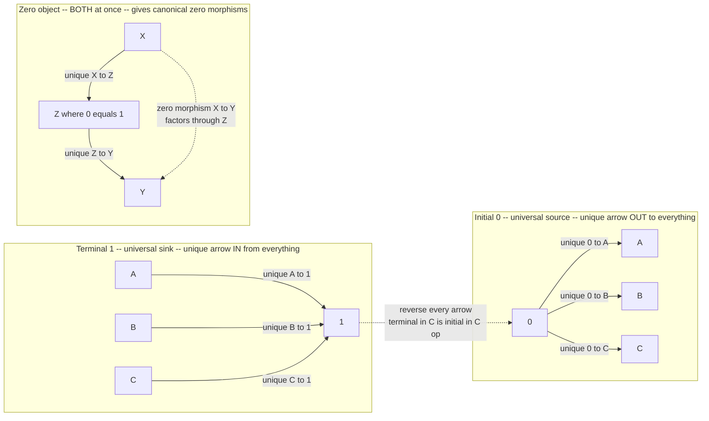

# 🎯 Terminal, Initial and Zero Objects

> [!abstract] TL;DR
> Some objects are special not because of what is *inside* them but because of a **counting fact about arrows**. A **terminal object** $1$ is the universal *destination*: from **every** object $X$ there is **exactly one** arrow $X \to 1$ — everything collapses to a single point (in $\mathbf{Set}$, any one-element set; in $\mathbf{Grp}$, the trivial group; in a poset, the top $\top$). An **initial object** $0$ is the dual, the universal *source*: to every object there is exactly one arrow $0 \to X$ (in $\mathbf{Set}$, the **empty set** and its empty function; in a poset, the bottom $\bot$). A **zero object** is one that is **both** (the trivial group, the zero vector space). These "unique-arrow" conditions are the **simplest universal properties** — the base cases of limits and colimits, the categorical **unit and void types**, and the trick that recovers *elements* as arrows $1 \to X$. Everything else in the universal-property machinery grows from here.

---

## Intuition

**Analogy — one road in, one road out.** Picture a country's road network where towns are objects and one-way roads are arrows. A **terminal** town is a place that *every* town can reach by **exactly one** route — a universal drain where all traffic ends up, no choices along the way, everything funnels to a single point. An **initial** town is the mirror image: a single origin from which there is **exactly one** route *out* to every other town — a universal spring that seeds the whole map. A town that is *both* a universal drain and a universal spring at once is a **zero** town.

Notice what makes these towns special: not their size, not their scenery, but a pure **counting fact about arrows** — "exactly one route in from everywhere" or "exactly one route out to everywhere." This is the very first "define an object by a **mapping property**" you meet in category theory, and it is deliberately the simplest: a *single* uniqueness condition. Products, coproducts, limits, kernels — the entire universal-property toolkit — are elaborations of this one idea. Even the notion of an *element* comes back this way: an element of $X$ is just **an arrow from the point**, $1 \to X$, a single road leading into $X$ that picks out where you land.

---

## How It Works

### Core Mechanics

Fix a category $\mathcal{C}$. All three notions are stated purely with arrows and a "there exists a **unique**" clause.

1. **Terminal object.** An object $1$ (also written $\ast$, $T$, or $\top$) is **terminal** if for **every** object $X$ there is **exactly one** morphism $\,!_X : X \to 1$. It is the universal *sink*. The lone arrow $X \to 1$ is the "**discard**" or "**ignore**" map — whatever $X$ was, it is forgotten.
2. **Initial object.** An object $0$ (also $\bot$) is **initial** if for **every** object $X$ there is **exactly one** morphism $\,?_X : 0 \to X$. It is the universal *source*. This is the exact **dual** of terminal — reverse every arrow (pass to $\mathcal{C}^{\mathrm{op}}$) and "terminal in $\mathcal{C}$" becomes "initial in $\mathcal{C}^{\mathrm{op}}$."
3. **Zero object.** An object that is **both** initial and terminal (so $0 \cong 1$). It exists precisely when the unique-source and unique-sink objects **coincide**. Examples: the trivial group $\{e\}$ in $\mathbf{Grp}$, the zero space $\{0\}$ in $\mathbf{Vect}$, the zero module.

**Canonical examples.**

| Category | Terminal $1$ | Initial $0$ | Zero object? |
|---|---|---|---|
| $\mathbf{Set}$ | any singleton $\{\ast\}$ | the empty set $\varnothing$ | **no** ($\varnothing \not\cong \{\ast\}$) |
| $\mathbf{Grp}$ | trivial group | trivial group | **yes** (they coincide) |
| $\mathbf{Vect}_k$ | zero space $0$ | zero space $0$ | **yes** |
| poset $(P,\le)$ | greatest element $\top$ | least element $\bot$ | yes iff $\top = \bot$ |
| $\mathbf{Ring}$ (unital) | zero ring $0$ | $\mathbb{Z}$ | **no** |

**Why the empty set is initial (not terminal).** A function $\varnothing \to X$ has an empty graph — there is nothing to specify, so there is **exactly one** such "empty function" for every $X$. That makes $\varnothing$ **initial**. Meanwhile a function $X \to \{\ast\}$ must send everything to the single point, so there is exactly one — that makes the singleton **terminal**. The count of functions $A \to B$ is $|B|^{|A|}$; then $|X|^{0} = 1$ (initial) and $1^{|X|} = 1$ (terminal) is the whole story.

**Uniqueness up to *unique* isomorphism (the prototype argument).** Terminal objects are not unique on the nose — every singleton is terminal in $\mathbf{Set}$ — but any two are joined by a **unique** isomorphism, so we speak of *"the"* terminal object. The proof is two lines and is the template for **every** universal-property uniqueness result:

> Let $T$ and $T'$ both be terminal. Terminality of $T'$ gives a unique $f : T \to T'$; terminality of $T$ gives a unique $g : T' \to T$. Then $g \circ f : T \to T$ lies in $\mathrm{Hom}(T,T)$, which — because $T$ is terminal — has **exactly one** element, namely $\mathrm{id}_T$; hence $g \circ f = \mathrm{id}_T$. Symmetrically $f \circ g = \mathrm{id}_{T'}$. So $f$ is an isomorphism, and it is the *only* arrow $T \to T'$, hence the *unique* iso. $\square$

**As empty (co)limits.** The terminal object is the **limit of the empty diagram** and the initial object is the **colimit of the empty diagram** — the base cases from which the whole limit/colimit theory is built. Correspondingly, $1$ is the **empty product** $\prod_{\varnothing}$ and $0$ is the **empty coproduct** $\coprod_{\varnothing}$, which is why a nullary product is "the one-element thing" and a nullary sum is "the empty thing."

**Zero morphisms.** In a category *with* a zero object $0$, every hom-set $\mathrm{Hom}(X,Y)$ has a canonical **zero morphism** obtained by factoring through $0$:
$$0_{X,Y} \;=\; \big(X \xrightarrow{\;!_X\;} 0 \xrightarrow{\;?_Y\;} Y\big).$$
These zero maps are absorbing under composition and are the seed of **kernels, cokernels, and all of homological algebra** (a kernel is an equalizer of $f$ with the zero morphism). A category equipped with such basepoints is a **pointed category**.

**Global elements / points.** Maps *from* the terminal object, $1 \to X$, are the **global elements** (or **points**) of $X$. In $\mathbf{Set}$ they biject exactly with the members of $X$ — this is how category theory recovers "element" **from arrows alone**, with no set membership. The slogan: *"an element of $X$ is a map from the point."* In topos theory this becomes the *definition* of an internal element.

### Flow / Architecture



---

## Key Concepts

### Secondary — the intuitive core
- **Universal destination vs universal source.** Terminal $=$ the one place everything flows *into* by a single route; initial $=$ the one place everything flows *out of* by a single route.
- **Collapse and seed.** The unique arrow $X \to 1$ **discards** all of $X$; the unique arrow $0 \to X$ **vacuously seeds** $X$ (there is nothing to choose, so it is forced).
- **Zero $=$ both.** When the universal source and the universal sink are the same object, you have a zero object — a single hub that is both spring and drain.
- **Points are arrows.** An element of $X$ is nothing more than a road from the point into $X$: a map $1 \to X$.

### Undergraduate — the formal machinery
- **Definitions.** $1$ terminal $\iff |\mathrm{Hom}(X,1)| = 1$ for all $X$; $0$ initial $\iff |\mathrm{Hom}(0,X)| = 1$ for all $X$. A zero object satisfies both.
- **Worked examples.** Singleton is terminal in $\mathbf{Set}$; $\varnothing$ is initial in $\mathbf{Set}$ (unique empty function). The trivial group is **both** in $\mathbf{Grp}$ — a zero object. In a poset, terminal $= \top$ and initial $= \bot$.
- **Uniqueness up to unique iso.** The two-line proof above; this is *why* we say "the" terminal object and treat the choice of singleton as irrelevant. It is the smallest instance of "objects defined by a mapping property are unique up to unique isomorphism."
- **Empty (co)limits.** $1$ is the limit of the empty diagram / the empty product; $0$ is the colimit of the empty diagram / the empty coproduct. Base cases of the limit machinery.
- **Global elements.** $\mathrm{Hom}(1, X)$ is the set of points of $X$; in $\mathbf{Set}$ this *is* $X$. The functor $\mathrm{Hom}(1,-)$ is the **global sections / points functor**.

### Graduate — structure and subtleties
- **Zero morphisms and pointed categories.** With a zero object, $0_{X,Y} = ?_Y \circ !_X$ is the canonical zero map; it is absorbing ($f \circ 0 = 0 = 0 \circ g$) and independent of intermediate route. This makes **kernels** (equalizer of $f$ and $0$) and **cokernels** definable — the entry point to **abelian categories and homological algebra**.
- **Well-pointedness.** In $\mathbf{Set}$ two maps agreeing on all points $1 \to X$ are equal — the category is **well-pointed**, so global elements *determine* morphisms. In a general topos or presheaf category this **fails**: an object can have very few (or no) global points yet be nontrivial, which is why one passes to **generalized elements** $A \to X$ (arrows from an arbitrary "stage" $A$).
- **Curry–Howard–Lambek / type theory.** Under the correspondence, the terminal object is the **unit type** `1` (exactly one value, `()`), and the initial object is the **empty / void type** `0` (no values — the type of a function that never returns). The unique map to $1$ is `discard`/`ignore`; the unique map from $0$ is `absurd`/`ex falso`. Logically $1 = \top$ (trivially provable) and $0 = \bot$ (unprovable); a value of type $X$ is a map $1 \to X$. A **biproduct** structure (product $=$ coproduct) forces a zero object, as in $\mathbf{Vect}$.
- **Existence is not automatic.** Many categories lack one or both. The category of **nonempty** sets has no initial object; the category of **fields** has neither initial nor terminal object; $\mathbf{Ring}$ has initial $\mathbb{Z}$ and terminal the zero ring but **no** zero object.
- **Enriched / internal viewpoint.** In a Cartesian-closed category or topos, the terminal object is the unit for the monoidal product $\times$, and $\mathrm{Hom}(1,-)$ underlies the internal-language notion of element on which topos-theoretic semantics is built.

---

## Python Demo

```python
"""
Terminal, Initial and Zero Objects -- runnable demonstration.

Sections
  A. Generic search over a FINITE (preorder) category for TERMINAL and INITIAL
     objects, using ONLY the unique-arrow condition.
  B. FinSet: a one-element set is TERMINAL (unique collapse X -> 1), the EMPTY
     set is INITIAL (unique empty function 0 -> X), and the "points" of X are
     exactly the maps 1 -> X.
  C. Uniqueness up to UNIQUE isomorphism: two terminal objects are joined by a
     single iso whose composites are forced to be identities.
  D. A ZERO object in a POINTED category (pointed sets Set_*), and the induced
     zero morphisms that factor through it.
  E. matplotlib picture: a small lattice category with terminal/initial
     highlighted, plus the "points = maps 1 -> X" picture.

Pure standard library + matplotlib.  numpy not required.
"""

from itertools import product
import matplotlib.pyplot as plt


# =====================================================================
# A. Finite category as a PREORDER: at most one arrow a->b, present iff a<=b.
#    Posets/preorders are the simplest categories to search over by hand.
# =====================================================================
class Preorder:
    def __init__(self, name, objects, leq_relation):
        self.name = name
        self.objects = list(objects)
        self.leq_set = set(leq_relation)      # assumed reflexive + transitive

    def leq(self, a, b):
        return (a, b) in self.leq_set

    def hom(self, a, b):
        # exactly one arrow a->b when a<=b, none otherwise
        return [(a, b)] if self.leq(a, b) else []

    def compose(self, g, f):
        (a, b), (b2, c) = f, g            # f: a->b, g: b->c  =>  a->c
        assert b == b2 and self.leq(a, c)
        return (a, c)


def reflexive_transitive_closure(objects, base_pairs):
    rel = {(x, x) for x in objects} | set(base_pairs)
    changed = True
    while changed:
        changed = False
        for (a, b) in list(rel):
            for (c, d) in list(rel):
                if b == c and (a, d) not in rel:
                    rel.add((a, d))
                    changed = True
    return rel


def find_terminal(cat):
    """Objects t with EXACTLY ONE arrow x -> t from every object x."""
    return [t for t in cat.objects
            if all(len(cat.hom(x, t)) == 1 for x in cat.objects)]


def find_initial(cat):
    """Objects i with EXACTLY ONE arrow i -> x to every object x."""
    return [i for i in cat.objects
            if all(len(cat.hom(i, x)) == 1 for x in cat.objects)]


# The "diamond" bounded lattice:  bottom -> {a, b} -> top
DIAMOND_OBJ = ["bottom", "a", "b", "top"]
DIAMOND = Preorder("Diamond", DIAMOND_OBJ,
                   reflexive_transitive_closure(
                       DIAMOND_OBJ,
                       [("bottom", "a"), ("bottom", "b"),
                        ("a", "top"), ("b", "top")]))


def section_A():
    print("== A. Search a finite category for terminal / initial objects ==")
    print("Diamond lattice  bottom -> {a, b} -> top")
    print("  terminal (unique arrow IN from all):", find_terminal(DIAMOND))
    print("  initial  (unique arrow OUT to all) :", find_initial(DIAMOND))
    print()


# =====================================================================
# B. FinSet:  singleton is terminal, empty set is initial, points = maps 1->X.
# =====================================================================
def all_functions(dom, cod):
    """Every function dom -> cod, as a list of dicts.  Empty dom -> one map {}."""
    dom, cod = list(dom), list(cod)
    return [dict(zip(dom, vals)) for vals in product(cod, repeat=len(dom))]


def section_B():
    print("== B. FinSet: terminal singleton, initial empty set, points ==")
    one, empty = {"*"}, set()
    for X in [set(), {"a"}, {"a", "b"}, {"a", "b", "c"}]:
        into_one = all_functions(X, one)          # X -> 1  should be unique
        out_of_empty = all_functions(empty, X)    # 0 -> X  the empty function
        points = all_functions(one, X)            # 1 -> X  = elements of X
        print(f"  |X|={len(X)}:  maps X->1 = {len(into_one)}"
              f"   maps 0->X = {len(out_of_empty)}"
              f"   points 1->X = {len(points)}  (= |X|)")
        assert len(into_one) == 1                 # singleton is TERMINAL
        assert len(out_of_empty) == 1             # empty set is INITIAL
        assert len(points) == len(X)              # points recover elements
    # show the actual points of a 3-element set: each map 1->X picks one element
    X = {"a", "b", "c"}
    print("  the points of X = {a,b,c} are the maps 1->X:")
    for f in all_functions({"*"}, X):
        print("    * |->", f["*"])
    print()


# =====================================================================
# C. Uniqueness up to UNIQUE isomorphism.  Build a preorder with TWO terminal
#    objects t1, t2 and exhibit the forced, unique iso between them.
# =====================================================================
TWO_OBJ = ["a", "t1", "t2"]
TWO = Preorder("TwoTerminals", TWO_OBJ,
               reflexive_transitive_closure(
                   TWO_OBJ,
                   [("a", "t1"), ("a", "t2"),
                    ("t1", "t2"), ("t2", "t1")]))   # t1, t2 mutually below


def unique_iso(cat, x, y):
    """If x, y are terminal, the arrows x->y and y->x are forced to be inverse."""
    fs, gs = cat.hom(x, y), cat.hom(y, x)
    if len(fs) == 1 and len(gs) == 1:
        f, g = fs[0], gs[0]
        if cat.compose(g, f) == (x, x) and cat.compose(f, g) == (y, y):
            return f, g            # g o f = id_x and f o g = id_y  => iso
    return None


def section_C():
    print("== C. Terminal object is unique up to UNIQUE isomorphism ==")
    terminals = find_terminal(TWO)
    print("  terminal objects:", terminals, " (both t1 and t2 qualify)")
    t1, t2 = "t1", "t2"
    iso = unique_iso(TWO, t1, t2)
    f, g = iso
    print(f"  unique iso t1->t2 = {f}, inverse t2->t1 = {g}")
    print(f"  g o f = {TWO.compose(g, f)} = id_t1 ;  "
          f"f o g = {TWO.compose(f, g)} = id_t2")
    print("  => any two terminal objects are THE SAME up to one canonical iso.\n")


# =====================================================================
# D. ZERO object in the POINTED category Set_* (pointed sets).
#    Objects: (elements, basepoint).  Morphisms: basepoint-preserving functions.
#    The one-point pointed set is BOTH initial and terminal -> a zero object.
# =====================================================================
class PointedSet:
    def __init__(self, elements, base):
        assert base in elements
        self.elements, self.base = list(elements), base


def pointed_maps(S, T):
    """All basepoint-preserving functions S -> T (must send S.base to T.base)."""
    non_base = [x for x in S.elements if x != S.base]
    maps = []
    for vals in product(T.elements, repeat=len(non_base)):
        f = {S.base: T.base}
        f.update(dict(zip(non_base, vals)))
        maps.append(f)
    return maps


def compose(g, f):
    return {x: g[f[x]] for x in f}


def section_D():
    print("== D. Zero object and zero morphisms in pointed sets Set_* ==")
    ZERO = PointedSet(["0"], "0")                 # the one-point pointed set
    S = PointedSet(["s0", "s1", "s2"], "s0")
    T = PointedSet(["t0", "t1"], "t0")
    print("  maps ZERO -> S :", len(pointed_maps(ZERO, S)), " (initial: unique)")
    print("  maps S -> ZERO :", len(pointed_maps(S, ZERO)), " (terminal: unique)")

    # zero morphism S -> T built by FACTORING through the zero object
    into_zero = pointed_maps(S, ZERO)[0]          # unique S -> 0
    out_of_zero = pointed_maps(ZERO, T)[0]        # unique 0 -> T
    zero_via_factor = compose(out_of_zero, into_zero)
    zero_direct = {x: T.base for x in S.elements}  # constant map to basepoint
    print("  zero morphism S->T via 0 :", zero_via_factor)
    print("  constant-to-basepoint    :", zero_direct)
    assert zero_via_factor == zero_direct
    print("  => factoring through the zero object gives the canonical zero map.\n")


# =====================================================================
# E. Visualization.
# =====================================================================
def draw_lattice(ax):
    pos = {"bottom": (0.0, 0.0), "a": (-1.1, 1.3),
           "b": (1.1, 1.3), "top": (0.0, 2.6)}
    color = {"top": "#16a34a", "bottom": "#f59e0b"}   # green terminal, orange init
    edges = [("bottom", "a"), ("bottom", "b"), ("a", "top"),
             ("b", "top"), ("bottom", "top")]
    for s, t in edges:
        (x0, y0), (x1, y1) = pos[s], pos[t]
        rad = 0.45 if (s, t) == ("bottom", "top") else 0.0
        ax.annotate("", xy=(x1, y1), xytext=(x0, y0),
                    arrowprops=dict(arrowstyle="-|>", color="#334155", lw=2.0,
                                    shrinkA=20, shrinkB=20,
                                    connectionstyle=f"arc3,rad={rad}"))
    for name, (px, py) in pos.items():
        ax.scatter([px], [py], s=1700, zorder=3, edgecolors="black",
                   c=color.get(name, "#2563eb"))
        ax.text(px, py, name, ha="center", va="center", color="white",
                fontsize=10, fontweight="bold", zorder=4)
    ax.set_title("Diamond lattice as a category\n"
                 "green = terminal (top), orange = initial (bottom)", fontsize=10)
    ax.set_xlim(-2.1, 2.1); ax.set_ylim(-0.7, 3.4); ax.axis("off")


def draw_points(ax):
    ax.scatter([0], [1.0], s=1700, c="#16a34a", zorder=3, edgecolors="black")
    ax.text(0, 1.0, "1", ha="center", va="center", color="white",
            fontsize=13, fontweight="bold", zorder=4)
    ys = [0.0, 1.0, 2.0]
    for lbl, y in zip(["x1", "x2", "x3"], ys):
        ax.scatter([2.2], [y], s=1300, c="#2563eb", zorder=3, edgecolors="black")
        ax.text(2.2, y, lbl, ha="center", va="center", color="white",
                fontsize=11, fontweight="bold", zorder=4)
        ax.annotate("", xy=(2.2, y), xytext=(0, 1.0),
                    arrowprops=dict(arrowstyle="-|>", color="#dc2626", lw=1.8,
                                    shrinkA=22, shrinkB=22,
                                    connectionstyle="arc3,rad=0.12"))
    ax.set_title("Global elements: the points of X\nare exactly the maps 1 -> X",
                 fontsize=10)
    ax.set_xlim(-0.8, 3.2); ax.set_ylim(-0.7, 2.7); ax.axis("off")


def make_figure():
    fig, (ax1, ax2) = plt.subplots(1, 2, figsize=(11, 4.8))
    draw_lattice(ax1)
    draw_points(ax2)
    fig.suptitle("Terminal, initial, and points-as-arrows", fontsize=13)
    fig.tight_layout()
    fig.savefig("terminal_initial_zero.png", dpi=120, bbox_inches="tight")
    print("saved terminal_initial_zero.png")


if __name__ == "__main__":
    section_A()
    section_B()
    section_C()
    section_D()
    make_figure()
```

Expected console output (abridged):

```
== A. Search a finite category for terminal / initial objects ==
Diamond lattice  bottom -> {a, b} -> top
  terminal (unique arrow IN from all): ['top']
  initial  (unique arrow OUT to all) : ['bottom']

== B. FinSet: terminal singleton, initial empty set, points ==
  |X|=0:  maps X->1 = 1   maps 0->X = 1   points 1->X = 0  (= |X|)
  |X|=1:  maps X->1 = 1   maps 0->X = 1   points 1->X = 1  (= |X|)
  |X|=2:  maps X->1 = 1   maps 0->X = 1   points 1->X = 2  (= |X|)
  |X|=3:  maps X->1 = 1   maps 0->X = 1   points 1->X = 3  (= |X|)
  ...

== C. Terminal object is unique up to UNIQUE isomorphism ==
  terminal objects: ['t1', 't2']  (both t1 and t2 qualify)
  unique iso t1->t2 = ('t1', 't2'), inverse t2->t1 = ('t2', 't1')
  g o f = ('t1', 't1') = id_t1 ;  f o g = ('t2', 't2') = id_t2

== D. Zero object and zero morphisms in pointed sets Set_* ==
  maps ZERO -> S : 1  (initial: unique)
  maps S -> ZERO : 1  (terminal: unique)
  ...  => factoring through the zero object gives the canonical zero map.
```

The demo turns each abstract clause into a **check on arrow counts**: terminal/initial are found by counting hom-sets, FinSet confirms the singleton/empty-set roles and that points $=$ maps $1 \to X$, the two-terminal preorder shows the *forced* unique iso, and pointed sets exhibit a genuine zero object whose factoring recovers the zero morphism.

---

## Real-World Applications

> **Example — the unit and void types in every typed language.** In the category of types and functions, the **terminal object is the unit type** (`()` in Rust/Haskell, `void`-returning-something, `unit` in ML) — it has exactly one value, so the unique map `X -> ()` is precisely the compiler's "**discard the result**." The **initial object is the empty / never type** (`Void` in Haskell's `Data.Void`, `!` the *never* type in Rust, `never` in TypeScript) — it has *no* values, so the unique map `absurd :: Void -> a` is the function that *can* return any type because it can never actually be called. These are the same categorical facts a compiler relies on to typecheck "unreachable" code.

- **Curry–Howard logic.** Under proofs-as-programs, the terminal type $1$ is the proposition $\top$ (**True**, trivially provable — its unique inhabitant is the trivial proof) and the initial type $0$ is $\bot$ (**False**, unprovable — a value of it would let you derive anything via `absurd`). Proof assistants (Coq, Lean, Agda) bake in `unit`/`True` and `Empty`/`False` exactly this way.
- **Homological algebra and computer algebra.** Zero objects and zero morphisms are the foundation of **kernels, cokernels, exact sequences, and chain complexes**. Systems like SageMath, GAP, and Lean's `mathlib` formalize abelian categories on top of a zero object so that "the kernel of $f$" means "the equalizer of $f$ and the zero map."
- **Databases and schema defaults.** A terminal object models a table/type with a single canonical row (a **unit / singleton**), and the unique map into it is the categorical "select nothing / count" collapse used in functorial data-migration frameworks.
- **Pointed spaces in topology and homotopy.** Basepoints (`(X, x0)`) make $\mathbf{Top}_\ast$ a pointed category with a zero object (the point), which is what makes homotopy groups $\pi_n$, loop spaces, and spectra well-defined — every construction that needs "a distinguished trivial map" uses the zero morphism.
- **Recovering elements without set membership.** Topos-based systems (and categorical semantics generally) define "an element of $X$" as a **map $1 \to X$**, so that logic and elementhood can be expressed with arrows only — the mechanism behind categorical models of set theory and of higher-order logic.

---

## Common Pitfalls

- **Swapping initial and terminal.** *Terminal* $=$ arrows come **in** from everything (a sink); *initial* $=$ arrows go **out** to everything (a source). In $\mathbf{Set}$ the **singleton** is terminal and the **empty set** is initial — beginners routinely flip these because "one element" feels more like a starting point than "no elements."
- **Assuming the empty set is terminal.** It is **initial** — the empty function $\varnothing \to X$ is the unique arrow *out*. There are *no* functions $X \to \varnothing$ for nonempty $X$ (you cannot land anywhere), so $\varnothing$ is emphatically not terminal.
- **Believing "the" terminal object is literally unique.** It is unique **only up to a unique isomorphism**. Every singleton is terminal in $\mathbf{Set}$; the article "the" is shorthand for "canonically the same." Forgetting this hides a choice that occasionally matters.
- **Confusing "has both" with "has a zero object."** A zero object requires the initial and terminal objects to **coincide** ($0 \cong 1$). $\mathbf{Set}$ has both a terminal and an initial object, but they differ, so $\mathbf{Set}$ has **no** zero object — hence no canonical zero morphisms.
- **Expecting them to always exist.** The category of **fields** has neither; the category of **nonempty sets** has no initial object; $\mathbf{Ring}$ has terminal (zero ring) and initial ($\mathbb{Z}$) but no zero object. Universal objects can simply fail to exist.
- **Over-trusting global elements.** In $\mathbf{Set}$, maps $1 \to X$ determine everything (well-pointedness), but in a general topos or presheaf category an object is **not** pinned down by its global points — you must use **generalized elements** $A \to X$. Reasoning "pointwise" silently assumes well-pointedness.
- **Mixing up `unit` and `void` in code.** `()`/`unit` (one value, terminal) is not the empty/`never` type (no values, initial). A function returning `unit` succeeds and yields nothing useful; a function typed to return the empty type can **never** return at all.

---

## Related Concepts

- [[Duality_and_the_Opposite_Category]] — terminal and initial are exact **duals**: reverse every arrow and "terminal in $\mathcal{C}$" becomes "initial in $\mathcal{C}^{\mathrm{op}}$"; a **zero object is self-dual**.
- [[Isomorphisms_and_Special_Morphisms]] — the "**unique up to unique isomorphism**" proof here is the prototype for every universal-property uniqueness argument, and uses iso as the right notion of sameness.
- [[Diagrams_and_Commutativity]] — a universal property is a **commuting-diagram** condition; the terminal/initial object is the limit/colimit of the **empty diagram**, the base case of that theory.
- [[Examples_of_Categories]] — where these objects live and differ: $\mathbf{Set}$, $\mathbf{Grp}$, $\mathbf{Vect}$, $\mathbf{Ring}$, and posets, each with its own terminal/initial/zero situation.
- [[Type_Systems_Fundamentals]] — the **unit type** (terminal) and **void/never type** (initial); `discard` and `absurd` are the unique maps.
- [[The_Curry_Howard_Correspondence]] — logically $1 = \top$ (True, trivially provable) and $0 = \bot$ (False, unprovable); a value of type $X$ is a map $1 \to X$.
- [[Homotopy_Type_Theory]] — the unit type `1` and empty type `0`, and **pointed types** (types with a distinguished basepoint) mirror terminal/initial and zero objects.
- [[Groups_and_Subgroups]] — the **trivial group** is a zero object of $\mathbf{Grp}$: initial and terminal coincide.
- [[Vectors_and_Vector_Spaces]] — the **zero vector space** is a zero object of $\mathbf{Vect}$, the reason $\mathbf{Vect}$ has biproducts and zero morphisms.
- [[Set_Theory_and_Relations]] — in $\mathbf{Set}$ the singleton is terminal and $\varnothing$ initial; points of $X$ are the maps from the singleton.
- [[Logical_Connectives_and_Boolean_Algebra]] — a Boolean lattice as a category has $\top$ as terminal and $\bot$ as initial, the order-theoretic shadow of these objects.
- [[Category_Theory]] — the umbrella note on objects, morphisms, functors, and universal constructions this note specializes.

*Sibling notes planned for this `Category_Theory/` vault — **Universal Properties** (the general "define by a mapping property" method this is the simplest case of), **Products and Coproducts** ($1$ is the empty product, $0$ the empty coproduct), **Limits and Colimits** (terminal/initial are the empty (co)limits), **Cartesian Closed and Topos Theory** (internal elements $1 \to X$, well-pointedness), **Category Theory in Programming**, **Curry–Howard–Lambek Correspondence**, and **Abelian Categories and Homological Algebra** (zero morphisms, kernels, cokernels) — are referenced by name above and should be wikilinked once created.*

---

## Review Questions

1. **(Secondary)** In plain language, what is the difference between a terminal and an initial object? Explain why, in $\mathbf{Set}$, a **one-element** set is terminal but the **empty** set is initial — and why these two roles cannot be played by the same object in $\mathbf{Set}$.
2. **(Undergraduate)** Prove that any two terminal objects are isomorphic by a **unique** isomorphism, using only the defining "exactly one arrow" property. Then explain in what sense the terminal object is "the **empty product**," and state the dual fact for the initial object.
3. **(Graduate)** Give a category that has a terminal object but **no** zero object, and a category that has a genuine **zero object**; in the latter, define the **zero morphism** $0_{X,Y}$ and show it does not depend on the route taken through $0$. Finally, describe what "**global elements** $1 \to X$" recover in $\mathbf{Set}$ and give one category where they fail to determine an object (i.e. that is **not well-pointed**).

---

## Sources

- Emily Riehl, *Category Theory in Context* (Dover, 2016), §1.6 and §3.1 — terminal/initial objects as limits/colimits of the empty diagram. Free: [math.jhu.edu/~eriehl/context.pdf](https://math.jhu.edu/~eriehl/context.pdf)
- Steve Awodey, *Category Theory*, 2nd ed. (Oxford, 2010), §2.2 (initial and terminal objects) and the duality discussion in Ch. 3.
- Saunders Mac Lane, *Categories for the Working Mathematician*, 2nd ed. (Springer, 1998), §III.3 and the treatment of zero objects and zero morphisms.
- Tom Leinster, *Basic Category Theory* (Cambridge, 2014), §5.1 — limits, including terminal/initial as empty (co)limits. [arXiv:1612.09375](https://arxiv.org/abs/1612.09375)
- Bartosz Milewski, *Category Theory for Programmers* (2019), "Terminal and Initial Objects" — the unit/void type reading. [github.com/hmemcpy/milewski-ctfp-pdf](https://github.com/hmemcpy/milewski-ctfp-pdf)
- nLab, "[terminal object](https://ncatlab.org/nlab/show/terminal+object)", "[initial object](https://ncatlab.org/nlab/show/initial+object)", and "[zero object](https://ncatlab.org/nlab/show/zero+object)".

---

#category-theory #terminal-object #initial-object #zero-object #global-elements
