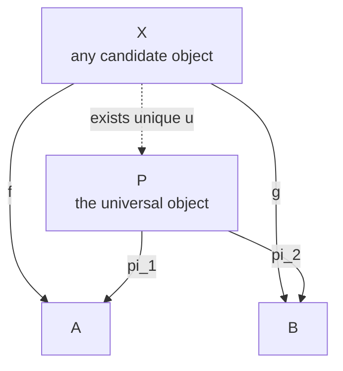

# ⭐ Universal Properties

> [!abstract] TL;DR
> A **universal property** defines an object not by *building* it out of elements but by the **unique job it does best** among all candidates: it names a canonical morphism and demands that for **every** other candidate there is **exactly one** morphism factoring through it and making a diagram commute — the "there exists a **unique** dashed arrow" pattern. The payoff theorem is that any two objects satisfying the *same* universal property are **isomorphic, and canonically/uniquely so**, which is why we say **"the"** product, **"the"** free group, **"the"** terminal object. Every construction in the subject — products, coproducts, limits, colimits, exponentials, free objects, quotients, tensor products, adjunctions — is a universal property, and each one is secretly an **initial or terminal object** in a cone/comma category, secretly a statement that some **functor is representable**, and hence (by Yoneda) unique up to iso. Learn the pattern once; apply it everywhere.

---

## Intuition

**Analogy — the best meeting point.** Suppose three friends must pick a place to meet before a trip. You could *describe a place by its coordinates* — "42nd and 5th, third floor" — an internal, arbitrary construction. Or you could **describe it by the job it does**: *"the spot from which each friend has exactly one natural route to where they each need to go, and any other workable meeting spot routes through it."* That second description never mentions coordinates, yet it **pins the place down exactly** — any two spots fitting the description are the same place reached by a unique detour. A **universal property** is that second kind of description: it characterises an object by a task it performs **uniquely-and-optimally** relative to everything else, and that task alone determines the object up to a unique isomorphism.

Category theory prefers this style on principle. Instead of saying "the product `A × B` *is* the set of ordered pairs" (a construction that leaks arbitrary choices — why pairs and not triples-with-a-dummy?), it says "`A × B` is **the** object with projections through which every pair of maps `X → A`, `X → B` factors **uniquely**." The internal recipe is forgotten; only the object's **web of relationships to everything else** remains — and that web is enough. This is the **element-free philosophy**: describe an object purely by its morphisms, never by peeking inside.

---

## How It Works

### The core idea: characterise, don't construct

To **construct** an object you assemble it element-by-element and then check it has the properties you wanted. To give a **universal property** you flip this around: you state a **mapping condition** that the object must satisfy relative to *all* other objects, and prove that this condition alone determines the object. The universal property is always a sentence of the shape:

> There is a **canonical morphism** (or a canonical family of them), and for **every** competing candidate equipped with the same kind of data, there exists a **unique** morphism factoring through the canonical one so that the resulting diagram **commutes**.

The two quantifiers are the whole game: **"for all candidates, there exists a unique arrow."** That unique arrow is drawn **dashed** (it is *concluded*, never assumed — see [[Diagrams_and_Commutativity]]), and its uniqueness is exactly what makes the property *universal* rather than merely *existential*.

### The two flavours: terminal-style and initial-style

Universal properties come in two dual shapes, and *every* example is one or the other.

- A **terminal-style** (or "limiting") property: the universal object receives a **unique arrow *from* every candidate**. Products, limits, and terminal objects live here. `A × B` is *final* among "objects that map to both `A` and `B`."
- An **initial-style** (or "colimiting") property: the universal object sends a **unique arrow *to* every candidate**. Coproducts, colimits, free objects, and initial objects live here. The free group `F(S)` is *initial* among "groups containing a copy of `S`."

The cleanest incarnations are the two simplest objects in any category:

- An **initial object** `0` has, for every object `X`, **exactly one** morphism `0 → X`.
- A **terminal object** `1` has, for every object `X`, **exactly one** morphism `X → 1`.

These *are* universal properties with the extra data stripped away — nothing but "unique arrow to/from everything." The unifying theorem is that **every** universal property can be recast as an initial or terminal object in an auxiliary **cone / comma category**: a product `A × B` is precisely the *terminal object* in the category of "spans over `A` and `B`," and a colimit is the *initial object* in a category of cocones. So the whole zoo collapses to one idea: *a universal object is an initial or terminal object in the right category of candidates.* (See the forthcoming sibling notes *Terminal, Initial and Zero Objects*, *Products and Coproducts*, and *Limits and Colimits*.)

### The universal-property shape as a diagram

The picture below is the archetype for the **terminal-style** case, using the binary product. `P` is the universal object with its two canonical projections; `X` is an *arbitrary* candidate carrying a map to each factor; the theorem asserts a **unique** dashed `u` making **both** triangles commute.



Read it as: *for all* `X` with maps `f : X -> A` and `g : X -> B`, *there exists a unique* `u : X -> P` such that `pi_1` after `u` equals `f` **and** `pi_2` after `u` equals `g`. Flip every arrow and you get the **initial-style** (coproduct) diagram for free — universal properties **dualise automatically**, which is why proving a fact about products gives the coproduct fact gratis (see the forthcoming *Duality and the Opposite Category*).

### The payoff: uniqueness up to unique isomorphism

Here is the theorem that makes universal properties worth their weight, proved by pure "abstract nonsense."

> **Theorem.** If `P` and `Q` both satisfy the *same* universal property, then there is a **unique isomorphism** `P ≅ Q` compatible with the canonical data.

**Proof sketch (terminal-style).** Because `P` is universal, the candidate `Q` (with its own canonical maps) factors through `P` via a unique arrow `v : Q → P`. Symmetrically, because `Q` is universal, `P` factors through `Q` via a unique `u : P → Q`. Now `u ∘ v : Q → Q` is a mediating arrow for `Q` *as a candidate for itself* — but the **identity** `id_Q` is also such an arrow, and the universal property allows **only one**, so `u ∘ v = id_Q`. Symmetrically `v ∘ u = id_P`. Hence `u` and `v` are mutually inverse: `P ≅ Q`, and the iso is *forced*, i.e. unique. ∎

This is why we license the definite article: **"the"** product, **"the"** free monoid, **"the"** tensor product. The object is not literally unique — the set of pairs and the set of "boxed pairs" are different sets — but they are the *same up to a canonical, choice-free isomorphism*, so no theorem can tell them apart. Compare ordinary uniqueness in [[Diagrams_and_Commutativity]]; here uniqueness is upgraded to **uniqueness of the comparison isomorphism itself**.

### Representability and the Yoneda connection

There is a third view that unifies the previous two. A universal property says exactly that a certain **functor is representable**. For the product, define the functor `X ↦ Hom(X, A) × Hom(X, B)` sending each object to its "pairs of maps into `A` and `B`." The universal property says this functor is **naturally isomorphic** to `Hom(X, P)` — i.e. it is *represented* by the object `P`:

`Hom(X, A × B) ≅ Hom(X, A) × Hom(X, B)`, naturally in `X`.

The **Yoneda lemma** then does the uniqueness work automatically: a representing object is **unique up to unique isomorphism**, because a natural iso of representable functors comes from a unique iso of representing objects. So *universal property*, *representable functor*, and *Yoneda* are **three views of one idea** — the naturality of that hom-set bijection is exactly the commuting-square content of [[Natural_Transformations]]. (See the forthcoming *The Yoneda Lemma* and *Presheaves and Representables*.)

### Free constructions and adjunctions

**Free** objects are the flagship initial-style examples. The **free group on a set `S`** is defined universally: it is the group `F(S)` with an inclusion `S → F(S)` such that *any* function from `S` into *any* group `G` extends **uniquely** to a group homomorphism `F(S) → G`. "Free" means "no relations beyond the forced ones" — the **most general** structure of its kind. Because such a universal factorisation exists for every construction-vs-forgetful pair, "free = **left adjoint** to the forgetful functor," and **every adjunction** is a pair of universal properties glued together (a universal arrow at each object). This is the sense in which products, free objects, and adjunctions are *the same phenomenon* at different magnifications (see the forthcoming *Adjunctions* and *Monoids and Monoidal Categories*).

### How to *use* a universal property — the two-step technique

A universal property is not just a definition; it is a **proof machine** with two moves:

1. **Existence → build maps.** To *construct* a morphism *into* a product (or *out of* a coproduct/free object), you never handcraft it — you supply the required cone data and let the universal property **hand you the unique arrow**. This is how `⟨f, g⟩ : X → A × B` and how "define a homomorphism out of a free group by choosing where the generators go" both work.
2. **Uniqueness → prove equalities.** To show two morphisms `A × B → A × B` are equal, show they *both* satisfy the same mediating condition; uniqueness forces them equal. Whole theorems (associativity of products, functoriality, the iso above) fall out with **no element-chasing at all**.

State it, use existence to *make* arrows, use uniqueness to *equate* arrows: that rhythm is the categorical method in miniature.

---

## Key Concepts

**Secondary (intuition first).**
- A universal property describes a thing by **the job it uniquely does best**, not by what it is made of ("the best meeting point," not "42nd and 5th").
- The signature phrase is **"for every candidate there is exactly one arrow"** making the picture commute.
- Because the job pins the object down, we say **"the"** product / **"the"** free group — any two winners are the same up to one canonical iso.

**Undergraduate (working definitions).**
- **Terminal-style** UMP: a unique arrow *into* the universal object from every candidate (products, limits). **Initial-style** UMP: a unique arrow *out of* it (coproducts, colimits, free objects).
- **Initial object** `0`: unique `0 → X` for all `X`. **Terminal object** `1`: unique `X → 1` for all `X`. These are universal properties in their barest form.
- **Uniqueness up to unique iso**: the defining theorem — same UMP implies a canonical isomorphism, proved by the `u ∘ v = id` argument.
- **Mediating (universal) arrow**: the dashed morphism the property *produces*; drawn dashed because it is concluded, not given.

**Graduate (structural view).**
- Every universal property is an **initial or terminal object in a comma category** `(X ↓ G)` or `(F ↓ X)`; a *universal arrow* from `X` to `G` is an initial object of `(X ↓ G)`.
- A universal property is precisely the statement that a functor `C^op → Set` (or `C → Set`) is **representable**; the representing object is unique up to unique iso by **Yoneda**, and the universal element is the image of `id` under the Yoneda bijection.
- **Adjunctions** package a universal property naturally in a parameter: `F ⊣ G` iff there is a universal arrow `η_X : X → G F X` for every `X`; **free ⊣ forgetful** is the paradigm. Limits and colimits are right/left adjoints to the diagonal functor.
- Universal constructions are **preserved by equivalences of categories** and **dualise** under `(-)^op`, so each theorem proved universally comes with a free dual and transports across equivalences.

---

## Python Demo

We make a universal property **concrete** in **FinSet** (the category of finite sets and functions). We build the **product** `A × B` *purely from its universal property*: an object `P` with projections `pi_1, pi_2` such that for **any** object `X` with maps `f : X → A`, `g : X → B` there is a **unique** mediating map `u : X → P` with `pi_1 ∘ u = f` and `pi_2 ∘ u = g`. We (1) **construct** the mediator, (2) **verify uniqueness** by brute-force search over *all* functions `X → P`, and (3) build a **second, differently-built product** `Q` and derive the **unique isomorphism** `P ≅ Q` straight from the universal property — demonstrating "determined **up to unique isomorphism**." Then we **visualise** the universal cone and the canonical iso with matplotlib.

```python
# Universal property of the product in FinSet, verified and visualized.
# Pure standard library for the mathematics; matplotlib only for the picture.
from itertools import product as cartesian

# A finite set is a Python set. A morphism f: X -> Y is a dict {x: y}.

def compose(g, f):
    """(g . f)(x) = g(f(x)); f: X->Y, g: Y->Z."""
    return {x: g[f[x]] for x in f}

def identity(S):
    return {s: s for s in S}

def all_functions(X, T):
    """Every function X -> T, as dicts (finite, so we can enumerate)."""
    Xs, Ts = list(X), list(T)
    for image in cartesian(Ts, repeat=len(Xs)):
        yield dict(zip(Xs, image))

# ---- The product, built AND characterized by its universal property ----

def build_product(A, B):
    """Underlying object plus the two canonical projections."""
    P = set(cartesian(A, B))            # object
    pi1 = {p: p[0] for p in P}          # projection to A
    pi2 = {p: p[1] for p in P}          # projection to B
    return P, pi1, pi2

def mediator_into(T, tA, tB, X, f, g):
    """The UNIQUE u: X -> T with tA.u = f and tB.u = g, for ANY object T
    that is a product of A and B (i.e. t -> (tA[t], tB[t]) is a bijection)."""
    back = {(tA[t], tB[t]): t for t in T}     # (a,b) -> the T-element over it
    u = {x: back[(f[x], g[x])] for x in X}
    assert compose(tA, u) == f, "left triangle must commute"
    assert compose(tB, u) == g, "right triangle must commute"
    return u

def uniqueness_by_search(P, pi1, pi2, X, f, g):
    """Brute force: exactly ONE function X -> P satisfies both triangles."""
    winners = [u for u in all_functions(X, P)
               if compose(pi1, u) == f and compose(pi2, u) == g]
    return winners

if __name__ == "__main__":
    A = {0, 1}
    B = {"x", "y", "z"}
    X = {"p", "q"}                       # a candidate cone
    f = {"p": 0, "q": 1}                 # f: X -> A
    g = {"p": "y", "q": "z"}             # g: X -> B

    # 1) Construct the mediating map from the universal property.
    P, pi1, pi2 = build_product(A, B)
    u = mediator_into(P, pi1, pi2, X, f, g)
    print("product P has", len(P), "elements:", sorted(P))
    print("mediating u : X -> P  =", u)
    print("pi1 . u == f :", compose(pi1, u) == f)
    print("pi2 . u == g :", compose(pi2, u) == g)

    # 2) Uniqueness: search ALL 6**2 = 36 functions X -> P; exactly one works.
    winners = uniqueness_by_search(P, pi1, pi2, X, f, g)
    print("functions X->P satisfying both triangles:", len(winners),
          "->", "UNIQUE" if winners == [u] else "NOT UNIQUE")

    # 3) A DIFFERENT construction of the same product: string-tagged pairs.
    #    Q is also a product of A and B, built with no ordered pairs at all.
    Q = {f"<{a}|{b}>" for a in A for b in B}
    qA = {q: int(q[1:q.index("|")]) for q in Q}          # projection to A
    qB = {q: q[q.index("|") + 1:-1] for q in Q}          # projection to B

    # Derive the canonical iso P <-> Q purely from the universal property:
    #   v : P -> Q is the mediator of the cone (pi1, pi2) into Q,
    #   w : Q -> P is the mediator of the cone (qA,  qB ) into P.
    v = mediator_into(Q, qA, qB, P, pi1, pi2)            # P -> Q
    w = mediator_into(P, pi1, pi2, Q, qA, qB)            # Q -> P
    iso_PP = compose(w, v) == identity(P)                # w.v = id_P
    iso_QQ = compose(v, w) == identity(Q)                # v.w = id_Q
    print("canonical iso P ~= Q :", iso_PP and iso_QQ,
          "-> determined UP TO UNIQUE ISOMORPHISM")

    # ---- Visualization: universal cone + the canonical iso ----
    import matplotlib.pyplot as plt

    def arrow(ax, s, t, pos, label, color, dashed=False, curve=0.0):
        x0, y0 = pos[s]; x1, y1 = pos[t]
        ax.annotate("", xy=(x1, y1), xytext=(x0, y0),
                    arrowprops=dict(arrowstyle="-|>", color=color, lw=2.0,
                                    ls="--" if dashed else "-",
                                    shrinkA=18, shrinkB=18,
                                    connectionstyle=f"arc3,rad={curve}"))
        ax.text((x0 + x1) / 2 + (0.10 if curve else 0), (y0 + y1) / 2,
                label, color=color, fontsize=10, ha="center", va="center",
                bbox=dict(boxstyle="round,pad=0.2", fc="white", ec="none"))

    def node(ax, name, pos, text):
        x, y = pos[name]
        ax.scatter([x], [y], s=1500, color="white", edgecolors="black", zorder=3)
        ax.text(x, y, text, ha="center", va="center", fontsize=10, zorder=4)

    fig, axes = plt.subplots(1, 2, figsize=(11, 5))

    # Panel 1: the universal cone with the unique factoring arrow.
    pos1 = {"X": (0.5, 1.0), "P": (0.5, 0.5), "A": (0.0, 0.0), "B": (1.0, 0.0)}
    ax = axes[0]
    arrow(ax, "X", "P", pos1, "exists! u", "crimson", dashed=True)
    arrow(ax, "X", "A", pos1, "f", "tab:blue")
    arrow(ax, "X", "B", pos1, "g", "tab:blue")
    arrow(ax, "P", "A", pos1, "pi_1", "tab:green")
    arrow(ax, "P", "B", pos1, "pi_2", "tab:green")
    for n, t in {"X": "X", "P": "A x B", "A": "A", "B": "B"}.items():
        node(ax, n, pos1, t)
    ax.set_title("Universal cone:\nfor all X, a UNIQUE u makes both triangles commute")
    ax.set_xlim(-0.35, 1.35); ax.set_ylim(-0.35, 1.3); ax.axis("off")

    # Panel 2: two products P and Q, canonically isomorphic.
    pos2 = {"P": (0.25, 1.0), "Q": (0.75, 1.0), "A": (0.0, 0.0), "B": (1.0, 0.0)}
    ax = axes[1]
    arrow(ax, "P", "Q", pos2, "v", "crimson", dashed=True, curve=0.25)
    arrow(ax, "Q", "P", pos2, "w", "purple", dashed=True, curve=0.25)
    arrow(ax, "P", "A", pos2, "pi_1", "tab:green")
    arrow(ax, "P", "B", pos2, "pi_2", "tab:green")
    arrow(ax, "Q", "A", pos2, "qA", "tab:orange")
    arrow(ax, "Q", "B", pos2, "qB", "tab:orange")
    for n, t in {"P": "P", "Q": "Q", "A": "A", "B": "B"}.items():
        node(ax, n, pos2, t)
    ax.text(0.5, 0.5, "w . v = id_P\nv . w = id_Q\nP ~= Q  (unique iso)",
            ha="center", va="center", fontsize=9, color="crimson")
    ax.set_title("Same universal property =>\ndetermined up to UNIQUE isomorphism")
    ax.set_xlim(-0.35, 1.35); ax.set_ylim(-0.35, 1.3); ax.axis("off")

    fig.suptitle("The universal property of the product in FinSet", fontsize=13)
    fig.tight_layout()
    fig.savefig("universal_property_product.png", dpi=120)
    print("saved universal_property_product.png")
```

Expected console output:

```
product P has 6 elements: [(0, 'x'), (0, 'y'), (0, 'z'), (1, 'x'), (1, 'y'), (1, 'z')]
mediating u : X -> P  = {'p': (0, 'y'), 'q': (1, 'z')}
pi1 . u == f : True
pi2 . u == g : True
functions X->P satisfying both triangles: 1 -> UNIQUE
canonical iso P ~= Q : True -> determined UP TO UNIQUE ISOMORPHISM
```

The search over all `36` functions `X → P` finding **exactly one** winner *is* the uniqueness half of the universal property, verified computationally; and the fact that a completely different construction `Q` (string-tagged, no ordered pairs) is forced by the property into a **unique isomorphism** with `P` is the "there is only one product, up to unique iso" theorem, made concrete.

---

## Real-World Applications

> **Example — data types are defined by their universal properties.** In every typed language a **product type** `(A, B)` is specified not by a memory layout but by its universal property: two projections `fst`, `snd` and a **pairing** operation such that for any `X` with maps `X → A` and `X → B` there is a **unique** `X → (A, B)`. That "unique pairing" is exactly the `⟨f, g⟩` combinator. Dually, a **sum type** `Either A B` is a *coproduct*: two injections plus **case-analysis**, with a unique map *out* for any pair of handlers. A **function type** `A → B` is an **exponential**, defined by the universal property of **currying** `Hom(X × A, B) ≅ Hom(X, A → B)`. Defining a type by its universal property is precisely giving its **introduction and elimination rules** — the categorical face of Curry–Howard–Lambek (see [[Type_Systems_Fundamentals]], [[The_Curry_Howard_Correspondence]], and the forthcoming *Category Theory in Programming*, *Exponentials and Cartesian Closed Categories*).

- **Compiler correctness and refactoring.** Since a product is *the* unique mediating map, optimisations like tuple-fusion and the equational laws `fst ⟨f,g⟩ = f` are theorems from the universal property, not ad-hoc rewrites — see [[Functional_Programming_Foundations]] and [[Monads_and_Effects]] (the free monad is the *universal* monad over a functor).
- **Databases and schema design.** Joins are **pullbacks** (a limit / universal property) and disjoint unions are **pushouts**; query optimisers exploit their universal factorisations, and data-migration functors preserve them.
- **Abstract algebra across fields.** Free groups, polynomial rings (free commutative algebras), tensor products, quotient groups, completions, and localisations are *all* single universal properties — one proof pattern reused, which is why the same "up to unique iso" argument recurs verbatim in group theory, topology, and linear algebra.
- **Machine-checked mathematics.** Proof assistants (Lean's `mathlib`, Coq, Agda) encode products, limits, and adjunctions by their universal properties precisely because the mediating arrow's **uniqueness** gives free, automation-friendly equality proofs.

---

## Common Pitfalls

- **Confusing the object with its construction.** `A × B` is *not* "the set of ordered pairs" — that is merely *one* model. The universal property is the definition; ordered pairs are an implementation. Reasoning from the pairs (peeking inside) forfeits the element-free power and breaks when you change models.
- **Treating the dashed arrow as given data.** The mediating morphism is **concluded** (exists uniquely), never assumed. Drawing it as an input erases the entire content of the property — the classic beginner error also flagged in [[Diagrams_and_Commutativity]].
- **Proving existence but forgetting uniqueness.** An object with *a* factoring arrow for every candidate but not a *unique* one is **not** universal, and the "up to unique iso" theorem collapses — you can no longer say "**the**" object. Uniqueness is doing the real work.
- **Mixing up the two flavours (direction of the arrows).** Products/limits are terminal-style (unique arrow *in*); coproducts/colimits/free objects are initial-style (unique arrow *out*). Point the mediating arrow the wrong way and you have defined the **dual** object by mistake.
- **Expecting literal, on-the-nose uniqueness.** Universal properties give uniqueness **up to a canonical isomorphism**, not equality of underlying data. Two products are genuinely different sets; they are merely *indistinguishable* categorically.
- **Choosing an isomorphism by hand.** The whole point is that the comparison iso is **forced and unique**. If your argument requires *picking* an iso arbitrarily, you have not used the universal property correctly.

---

## Related Concepts

- [[Diagrams_and_Commutativity]] — universal properties are stated as "a **unique dashed arrow** makes the diagram commute"; this note supplies the diagram language that universal properties speak in.
- [[Natural_Transformations]] — a universal property is a **natural** isomorphism of hom-functors; the naturality square is the representability condition behind Yoneda.
- [[Category_Theory]] — the parent overview (objects, functors, adjunctions, Yoneda); universal properties are the methodology that ties those pieces together.
- [[Type_Systems_Fundamentals]] — product, sum, and function **types are defined by their universal properties**, i.e. by introduction/elimination rules rather than representations.
- [[The_Curry_Howard_Correspondence]] — proofs-as-programs-as-morphisms; "define a type by its universal property" is the categorical (Lambek) leg of the correspondence.

*Forthcoming siblings in this vault referenced above (in prose only, not yet written): Category Theory Overview; Categories, Objects and Morphisms; Products and Coproducts; Limits and Colimits; Terminal, Initial and Zero Objects; Adjunctions; The Yoneda Lemma; Presheaves and Representables; Exponentials and Cartesian Closed Categories; Isomorphisms and Special Morphisms; Duality and the Opposite Category; Monoids and Monoidal Categories; Category Theory in Programming; Curry–Howard–Lambek Correspondence.*

---

## Review Questions

1. **Conceptual.** State the universal property of the binary product `A × B` in full, marking clearly which arrows are quantified "for all" and which one is "there exists a unique." Then explain why this characterisation contains *strictly more* information than the assertion "`A × B` is the set of ordered pairs."
2. **Scenario.** You are handed two objects `P` and `Q`, each claimed to be a product of the same `A` and `B`, built by different teams (one uses ordered pairs, one uses tagged records). Without inspecting their internals, prove there is an isomorphism `P ≅ Q`, and argue why it is **unique**. Which half of the universal property forces uniqueness of the iso, and where exactly does the `u ∘ v = id` step come from?
3. **Trade-off / structural.** Explain the claim "every universal property is a representable functor, and hence unique up to iso by Yoneda." Then recast the product's universal property as a **terminal object** in a suitable cone category, and use that reformulation to explain why *products, free groups, colimits, and adjunctions are all instances of one pattern.* What do you gain, and what do you give up, by defining an object universally instead of by construction?

---

## Sources

- Saunders Mac Lane, *Categories for the Working Mathematician*, 2nd ed. (Springer, 1998) — universal arrows, comma categories, and "every adjunction is a universal arrow at each object."
- Emily Riehl, *Category Theory in Context* (Dover, 2016; free PDF) — universal properties, representability, the Yoneda lemma, and uniqueness up to unique iso.
- Tom Leinster, *Basic Category Theory* (Cambridge University Press, 2014; arXiv:1612.09375) — clean development of universal properties and initial/terminal reformulations.
- Bartosz Milewski, *Category Theory for Programmers* (Millington/Blurb, 2019) — products/coproducts as universal properties with running code and the type-theoretic reading.
- Steve Awodey, *Category Theory*, 2nd ed. (Oxford University Press, 2010) — universal mapping properties, initial/terminal objects, and free constructions as adjoints.

---

#category-theory #universal-property #uniqueness-up-to-iso #initial-terminal #representability
