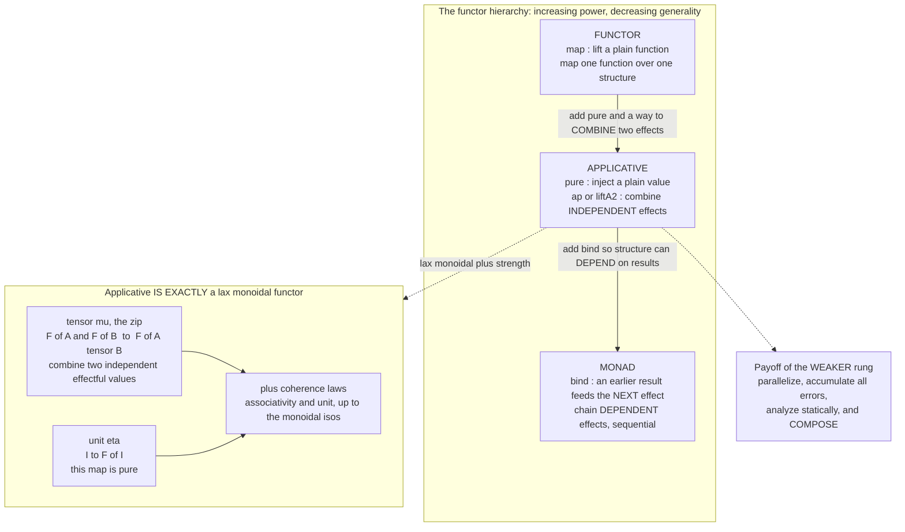

# 🔗 Applicative and Lax Monoidal Functors

> [!abstract] TL;DR
> Between a plain **functor** (map one function over one structure) and a full **monad** (chain effectful steps where each depends on the last) sits the **applicative functor** — the sweet spot for combining *several independent* effectful values *"run these three computations and merge their results"* without ever letting a later step depend on an earlier result. An applicative is a functor equipped with **`pure` : `A → F A`** (inject a pure value) and a way to **combine** effects — either **`ap` : `F(A→B) → F A → F B`** or, equivalently, the lax-monoidal **`zip` : `F A × F B → F(A×B)`** and **`liftA2`**. Categorically it is **exactly a lax monoidal functor**: a functor between monoidal categories with a natural transformation `F A ⊗ F B → F(A⊗B)` and a unit `I → F I` obeying coherence. Because the effects are **independent of each other's results**, applicatives can **parallelize**, **accumulate** (collect *all* validation errors, not short-circuit at the first), be **statically analyzed**, and — crucially — **compose**, where monads do not. Every monad is an applicative, but not vice versa: choosing the *weaker* structure that still does the job is a core API-design skill — "constraints liberate."

---

## Intuition

**Analogy — three lab tests you can run in parallel vs a diagnosis that branches.** Imagine a doctor ordering a **blood test, an X-ray, and a urine test** for a patient. None of the three depends on the others' outcomes — you can send all three off to different labs *at the same time*, and when every result is back you **merge** them into one chart. That is the **applicative** pattern: the *set of computations is fixed up front* (three tests, decided before any result exists), each may independently "fail" (a lab loses a sample), and at the end you gather everything — including **every failure at once** ("blood sample clotted **and** X-ray overexposed"). Contrast this with a **treatment protocol**: *"run the biopsy; **if** it is malignant, order a PET scan of that specific region; **else** discharge."* Here the *second* step does not even exist until the first result is known — the structure **branches on the result**. That is the **monad** pattern (`bind`), and it is strictly more powerful: you cannot decide *which* test to run next until you have seen an earlier answer, so you cannot fire them all off in parallel or know the full test-set in advance.

Technically: a functor lets you `map` one function over one wrapped value; a monad's `bind` lets a *later* effectful step be *computed from* an *earlier* result (dynamic, sequential, short-circuiting). The applicative is the rung between — it can **combine several wrapped values whose effects are independent of each other's results** (static, parallelizable, accumulating), and nothing more. Less power than a monad, more structure than a functor, and — the payoff — it **composes and parallelizes where monads don't**.

---

## How It Works

### The functor hierarchy: Functor ⊂ Applicative ⊂ Monad

There are three tiers of "computing inside a context `F`", each strictly more powerful — and strictly *less general* — than the last. Knowing **which rung you actually need** is the design skill this note is about.

| Tier | Core operation | Type (informal) | Can do | Cannot do |
|---|---|---|---|---|
| **Functor** ([[Functors]]) | `map` / `fmap` | `(A → B) → F A → F B` | Apply a pure function *inside* one structure, shape untouched | Combine *two* wrapped values at all |
| **Applicative** | `pure` + `ap` / `liftA2` | `F(A→B) → F A → F B` | Combine **independent** effectful values; both effects run; structure fixed up front | Let a later step's **structure depend on** an earlier **result** |
| **Monad** ([[Monads_and_Effects]]) | `bind` / `>>=` | `F A → (A → F B) → F B` | **Sequence** effects where each step's effect and value depend on the previous result | (top of this hierarchy) |

The decisive line is between applicative and monad. `bind`'s second argument is a function `A → F B` that **produces a new context from the unwrapped value** — so a monad can express *"if the file opened, read from that specific handle"*, an effect that literally does not exist until the first produced a result. An applicative's `ap` receives **both effects already built**; it can only glue together structure that was decided in advance. This is the whole power/analysis trade-off: **applicatives forbid result-dependency, and are rewarded with parallelism, accumulation, static analysis, and composition.**

### Applicative functors — McBride & Paterson

An **applicative functor** (McBride & Paterson, 2008) is a functor `F` with two extra operations:

1. **`pure` : `A → F A`** — inject a pure value into the context with **no effect** (present-not-absent, empty log, no failures). This is the *unit*.
2. A way to **combine** two effectful values, in either of two inter-derivable forms:
   - **`ap`** (written `<*>`): `F(A→B) → F A → F B` — given an effectful *function* and an effectful *argument*, run both effects and apply.
   - **`liftA2`** / the lax-monoidal **`zip`**: `liftA2 : (A → B → C) → F A → F B → F C`, or equivalently the tensor `F A × F B → F(A×B)`. From `zip` and `map` you recover `ap`, and vice versa — they are the same structure in two costumes.

The **applicative laws** (four of them) make `pure`/`ap` coherent, exactly as the three monad laws make `return`/`bind` coherent:

```
Identity:      ap(pure(id), v)              == v
Homomorphism:  ap(pure(f), pure(x))         == pure(f x)
Interchange:   ap(u, pure(y))               == ap(pure(\f -> f y), u)
Composition:   ap(ap(ap(pure(.), u), v), w) == ap(u, ap(v, w))
```

The **key property** these buy you: you can combine **several effectful computations whose effects are independent of each other's *results*** — and gather everything at the end. That is what the humble medical-tests analogy formalizes, and it is what a monad's `bind` *cannot* do without giving up parallelism and accumulation.

### Lax monoidal functors — the categorical identity

The clean categorical characterization: **an applicative functor is exactly a lax monoidal functor (plus strength).** A **monoidal category** is a category with a tensor product `⊗` and a unit object `I` (the subject of the forthcoming **Monoids_and_Monoidal_Categories** sibling). A **lax monoidal functor** `F` between monoidal categories comes equipped with:

- a **natural transformation** `μ_{A,B} : F A ⊗ F B → F(A⊗B)` (the "combine two independent effects" map — the tensor / `zip`), and
- a **unit map** `η : I → F I` (this is `pure` at the unit),

satisfying **coherence** (associativity and left/right unit) with the monoidal isomorphisms. "Lax" means `μ` and `η` are merely *maps* (not isomorphisms); if they were isomorphisms you would have a *strong* monoidal functor. On the cartesian-closed category of types, adding **strength** (a canonical `A ⊗ F B → F(A⊗B)`) makes lax-monoidal and applicative-with-`pure`/`ap` **equivalent presentations of the same thing**. So `μ` (the naturality is a plain [[Natural_Transformations|natural transformation]]) *is* `zip`, and `η` *is* `pure` — "applicative = lax monoidal functor."

### Monad vs applicative — the crucial difference

A **monad's `bind`** lets a later computation **depend on an earlier result** — dynamic, sequential, result-driven. An **applicative combines effects whose structure is fixed independent of results** — static. From that single distinction, everything follows:

- **Applicatives can parallelize** — with no result-dependency, all effects can fire concurrently (this is how Facebook's **Haxl** batches independent data fetches).
- **Applicatives can accumulate** — combine two failures into *both* failures (collect **all** validation errors); a monad's `bind` **short-circuits** at the first `Nothing`/`Left`.
- **Applicatives can be analyzed statically** — because the shape is known before running, an applicative parser can compute its grammar / first-set without executing.
- **Every monad is an applicative** (`ap = liftM2 id` via `bind`), **but not vice versa** — there are lawful applicatives with *no* lawful monad (error-accumulating validation is the canonical one).

### Diagram — the hierarchy and the lax-monoidal structure



### Why the weaker structure wins: composition and choice

Two structural facts make applicatives a *practical* win, not just an elegant one:

- **Applicatives compose; monads do not.** The composition `F ∘ G` of two applicatives is always an applicative, for free. Two monads have **no generic composition** — you need bespoke **monad transformers** (`StateT`, `ExceptT`) with load-bearing stack ordering (see [[Monads_and_Effects]]). The weaker the structure, the more it composes — a recurring theme.
- **Alternative — a monoid on applicatives for choice.** Many applicatives also carry an `Alternative`/`empty`+`<|>` structure: a monoid capturing **failure and choice**, which is the backbone of **parser combinators** (try this parser, or that one). This connects applicatives to embedded DSLs and parsing ([[Domain_Specific_Languages]]).

Between applicative and monad live finer rungs — **selective functors** (Mokhov et al.) allow *limited* static-plus-dynamic mixing (a known set of branches, only one taken), and **arrows** generalize in another direction. The lesson is that the categorical hierarchy is a **design space of effect abstractions**, and picking the weakest one that expresses your dependency structure is what buys you parallelism, analyzability, and composition.

---

## Key Concepts

**Secondary (explain to a curious beginner)**
- An **applicative** is the middle setting between "map over one box" and "chain boxes where each step decides the next." It **combines several boxes at once** — like running three lab tests in parallel and merging the results.
- Its two moves are **`pure`** (put a plain value in a box) and **combine** (`ap`/`liftA2`: merge the contents of several boxes with a function).
- The headline trick: it can **collect *all* the errors** from many independent checks (every bad form field at once), which the "chaining" style cannot — that one stops at the first error.

**Undergraduate (a first FP / algebra course)**
- **Functor ⊂ Applicative ⊂ Monad**: `map` transforms inside a fixed shape; `pure`/`ap` combine **independent** effects; `bind` **sequences** effects where each step depends on the previous result.
- Two presentations of applicative: **`pure` + `ap`** (`F(A→B) → F A → F B`) or **`pure` + `liftA2`/`zip`** (`F A × F B → F(A×B)`); they are inter-derivable.
- The **four applicative laws**: identity, homomorphism, interchange, composition — the analogue of the three monad laws.
- **Validation** (accumulate all errors) is a lawful applicative that is **not** a monad, because a lawful `bind` would be forced to short-circuit — the canonical "applicative but not monad" example.
- **Applicatives compose**; monads generally do not (needing transformers) — a concrete advantage of the weaker structure.

**Graduate (categorical / system-level)**
- An applicative functor **is exactly a lax monoidal functor** `(F, μ, η)` between monoidal categories, with `μ_{A,B} : F A ⊗ F B → F(A⊗B)` a natural transformation and `η : I → F I` the unit, obeying associativity/unit coherence — plus **strength** on a closed category to recover `ap` from `zip`.
- `μ` is `zip`/`liftA2`, `η` is `pure`; the applicative laws are precisely the lax-monoidal coherence conditions.
- **Traversable** functors are the categorical account of *"map with effects, then collect"*: `traverse : (A → F B) → T A → F(T B)` sequences an applicative `F` through a structure `T`; `sequenceA` = `traverse id`. This *requires* applicative (not just functor) and does **not** need monad — a signature use of the middle rung.
- Every **monad** yields an applicative (`ap = ` monadic `liftM2 id`); the converse fails. **Selective functors** and **arrows** refine the space between applicative and monad, trading expressive power for static structure.
- **`Alternative`** is a monoid object in the category of applicatives (an `empty` and an associative `<|>`), modeling choice/failure — the algebra behind parser combinators.

---

## Python Demo

```python
# ======================================================================
# APPLICATIVE (= LAX MONOIDAL) FUNCTORS, from scratch.
#   PART 1 -- Two applicatives via  pure + ap  (and the lax-monoidal
#             zip / liftA2):  VALIDATION that ACCUMULATES all errors,
#             and LIST for cartesian-product combination.
#   PART 2 -- Combine SEVERAL INDEPENDENT computations: validate a form's
#             fields collecting ALL errors -- then contrast with the
#             MONADIC version whose short-circuiting bind reports only the
#             FIRST error. Applicative is WEAKER but ACCUMULATES.
#   PART 3 -- Verify the FOUR applicative / lax-monoidal LAWS
#             (identity, homomorphism, interchange, composition).
#   PART 4 -- VISUALIZE the Functor->Applicative->Monad hierarchy and the
#             independent-effect combination (all-errors vs first-error,
#             and the List cartesian product).
# Pure standard library + matplotlib (no numpy needed).
# ======================================================================
from dataclasses import dataclass
from typing import Any, Callable, Tuple
import matplotlib.pyplot as plt
import matplotlib.patches as mpatches

# ----------------------------------------------------------------------
# VALIDATION applicative: like Either, but the FAILURE side is a MONOID
# (a tuple of errors) so ap can COMBINE two failures into BOTH failures.
# ----------------------------------------------------------------------
@dataclass(frozen=True)
class Success:
    value: Any
@dataclass(frozen=True)
class Failure:
    errors: Tuple[str, ...]        # a monoid under tuple concatenation

def v_pure(x):                     # pure / unit :: a -> Validation a
    return Success(x)

def v_map(f, v):                   # functor map (fmap)
    return Success(f(v.value)) if isinstance(v, Success) else v

def v_ap(vf, vx):                  # ap :: F(a->b) -> F a -> F b, ACCUMULATING
    if isinstance(vf, Success) and isinstance(vx, Success):
        return Success(vf.value(vx.value))
    if isinstance(vf, Failure) and isinstance(vx, Failure):
        return Failure(vf.errors + vx.errors)     # <-- collect BOTH sides
    return vf if isinstance(vf, Failure) else vx  # exactly one failed

# The LAX-MONOIDAL face: zip (the tensor) and liftA2, derived from map + ap.
def v_zip(va, vb):                 # tensor mu :: F a x F b -> F (a, b)
    return v_ap(v_map(lambda a: (lambda b: (a, b)), va), vb)
def v_liftA2(f, va, vb):           # liftA2 :: (a->b->c) -> F a -> F b -> F c
    return v_ap(v_map(lambda a: (lambda b: f(a, b)), va), vb)

# Fold pure+ap over N independent validations (the "applicative style").
def v_apply(f_curried, *vs):
    acc = v_pure(f_curried)
    for v in vs:
        acc = v_ap(acc, v)         # each field's effect is INDEPENDENT
    return acc

# ----------------------------------------------------------------------
# LIST applicative: pure = singleton, ap = cartesian product.
# ----------------------------------------------------------------------
def l_pure(x):    return [x]
def l_map(f, xs): return [f(x) for x in xs]
def l_ap(fs, xs): return [f(x) for f in fs for x in xs]   # all combinations

# ======================================================================
# PART 2: combine SEVERAL INDEPENDENT computations -- form validation.
# ======================================================================
@dataclass(frozen=True)
class User:
    name: str
    age: int
    email: str

def validate_name(s):
    return Success(s) if s.strip() else Failure(("name: must not be empty",))
def validate_age(a):
    ok = isinstance(a, int) and 0 < a < 130
    return Success(a) if ok else Failure(("age: must be an integer in 1..129",))
def validate_email(e):
    return Success(e) if "@" in e else Failure(("email: must contain @",))

def make_user(n):                  # curried constructor for applicative style
    return lambda a: lambda e: User(n, a, e)

def validate_applicative(name, age, email):
    # independent effects -> ap accumulates EVERY failure
    return v_apply(make_user, validate_name(name),
                              validate_age(age),
                              validate_email(email))

def v_bind(m, f):                  # MONADIC bind: SHORT-CIRCUITS on first Failure
    return f(m.value) if isinstance(m, Success) else m

def validate_monadic(name, age, email):
    # bind chains -> stops dead at the FIRST failing field
    return v_bind(validate_name(name), lambda n:
           v_bind(validate_age(age),  lambda a:
           v_bind(validate_email(email), lambda e: v_pure(User(n, a, e)))))

good = ("Ada Lovelace", 36, "ada@analytical.engine")
bad  = ("", -5, "not-an-email")            # THREE fields wrong at once

app_good = validate_applicative(*good)
app_bad  = validate_applicative(*bad)
mon_bad  = validate_monadic(*bad)

app_errors = app_bad.errors if isinstance(app_bad, Failure) else ()
mon_errors = mon_bad.errors if isinstance(mon_bad, Failure) else ()

print("=== PART 2: independent-effect combination (form validation) ===")
print(f"  applicative, valid input : {app_good}")
print(f"  applicative, bad input   : {len(app_errors)} errors -> ACCUMULATED all")
for e in app_errors:
    print(f"       - {e}")
print(f"  MONADIC bind, bad input  : {len(mon_errors)} error  -> SHORT-CIRCUITED")
for e in mon_errors:
    print(f"       - {e}   (later fields never checked)")

# The List applicative: combine independent choices into every combination.
sizes  = ["S", "M", "L"]
colors = ["red", "blue"]
combos = l_ap(l_map(lambda s: (lambda c: (s, c)), sizes), colors)
print(f"\n  List applicative: {len(sizes)} sizes x {len(colors)} colors "
      f"= {len(combos)} combos -> {combos}")
# lax-monoidal cross-check: liftA2 and ap agree
assert v_liftA2(lambda a, b: a + b, v_pure(2), v_pure(40)) == Success(42)
assert v_zip(v_pure(1), v_pure(2)) == Success((1, 2))

# ======================================================================
# PART 3: verify the FOUR applicative / lax-monoidal LAWS.
# ======================================================================
def applicative_laws(pure, ap, eq):
    compose = lambda f: lambda g: lambda x: f(g(x))   # (.) for the composition law
    f = lambda n: n + 1
    g = lambda n: n * 2
    idf = lambda a: a
    v = pure(7)          # an applicative VALUE
    u = pure(f)          # an applicative-of-FUNCTION
    w = pure(g)          # another applicative-of-FUNCTION
    x, y = 10, 5
    identity     = eq(ap(pure(idf), v), v)
    homomorphism = eq(ap(pure(f), pure(x)), pure(f(x)))
    interchange  = eq(ap(u, pure(y)), ap(pure(lambda fn: fn(y)), u))
    composition  = eq(ap(ap(ap(pure(compose), u), w), v), ap(u, ap(w, v)))
    return identity, homomorphism, interchange, composition

list_laws = applicative_laws(l_pure, l_ap, lambda a, b: a == b)
val_laws  = applicative_laws(v_pure, v_ap, lambda a, b: a == b)
print("\n=== PART 3: applicative laws (identity/homomorphism/interchange/composition) ===")
print(f"  List       : {list_laws}")
print(f"  Validation : {val_laws}")

# ======================================================================
# PART 4: VISUALIZE.
# ======================================================================
fig, axes = plt.subplots(2, 2, figsize=(14, 10))

# Panel A: the Functor < Applicative < Monad hierarchy as nested rings.
ax = axes[0, 0]; ax.axis("off")
bands = [
    (0.04, 0.04, 0.92, 0.92, "#dbeafe", "#1e3a8a", 0.90,
     "MONAD:  bind : a-result -> next effect\nchain DEPENDENT effects (sequential)"),
    (0.13, 0.15, 0.74, 0.62, "#bfdbfe", "#1e40af", 0.70,
     "APPLICATIVE = LAX MONOIDAL:  pure + ap / zip\ncombine INDEPENDENT effects"),
    (0.24, 0.31, 0.52, 0.28, "#93c5fd", "#1d4ed8", 0.45,
     "FUNCTOR:  map\nmap over structure"),
]
for x, y, w, h, fc, ec, ty, label in bands:
    ax.add_patch(mpatches.FancyBboxPatch((x, y), w, h, boxstyle="round,pad=0.006",
                                         fc=fc, ec=ec, lw=1.8))
    ax.text(x + w / 2, ty, label, ha="center", va="center", fontsize=8.5)
ax.set_xlim(0, 1); ax.set_ylim(0, 1)
ax.set_title("Functor < Applicative < Monad\n(increasing power, decreasing generality)")

# Panel B: independent-effect combination -- ALL errors vs FIRST error.
ax = axes[0, 1]
methods = ["Applicative\n(accumulate)", "Monad bind\n(short-circuit)"]
counts  = [len(app_errors), len(mon_errors)]
bars = ax.bar(methods, counts, color=["#55A868", "#C44E52"])
for b, c in zip(bars, counts):
    ax.text(b.get_x() + b.get_width() / 2, c + 0.04, str(c),
            ha="center", fontweight="bold")
ax.set_ylim(0, max(counts) + 1)
ax.set_ylabel("form errors reported (of 3 bad fields)")
ax.set_title("Same 3-bad-field form:\napplicative reports ALL, monad stops at the FIRST")

# Panel C: List applicative = cartesian product grid.
ax = axes[1, 0]
cmap = {"red": "#C44E52", "blue": "#4C72B0"}
for i, s in enumerate(sizes):
    for j, c in enumerate(colors):
        ax.scatter(j, i, s=1600, color=cmap[c], zorder=2)
        ax.text(j, i, f"{s},{c[0]}", ha="center", va="center",
                color="white", fontsize=10, fontweight="bold", zorder=3)
ax.set_xticks(range(len(colors))); ax.set_xticklabels(colors)
ax.set_yticks(range(len(sizes)));  ax.set_yticklabels(sizes)
ax.set_xlim(-0.5, len(colors) - 0.5); ax.set_ylim(-0.5, len(sizes) - 0.5)
ax.set_title(f"List applicative = cartesian product\n"
             f"{len(sizes)} sizes x {len(colors)} colors = {len(combos)} independent combos")

# Panel D: law verdicts + the design lesson.
ax = axes[1, 1]; ax.axis("off")
li, lh, lin, lc = list_laws
vi, vh, vin, vc = val_laws
lines = [
    "applicative / lax-monoidal laws verified:",
    "",
    f"  List        identity={li}  homo={lh}",
    f"              interchange={lin}  composition={lc}",
    f"  Validation  identity={vi}  homo={vh}",
    f"              interchange={vin}  composition={vc}",
    "",
    "every monad is an applicative;",
    "Validation is applicative but NOT a monad",
    "(a lawful bind would be forced to short-circuit).",
    "",
    "CONSTRAINTS LIBERATE: forbidding result-",
    "dependency buys parallelism, accumulation,",
    "static analysis, and free composition.",
]
ax.text(0.02, 0.96, "\n".join(lines), va="top", family="monospace", fontsize=9.5)
ax.set_title("Laws hold; the weaker rung pays off")

fig.suptitle("Applicative = lax monoidal functor: combine INDEPENDENT effects, "
             "accumulate, compose", fontsize=13)
fig.tight_layout()
plt.savefig("applicative_and_lax_monoidal_functors.png", dpi=130)
print("\nSaved figure to applicative_and_lax_monoidal_functors.png")
```

Running it makes the theory concrete. In **Part 2** the *same three field validators* are combined two ways: the **applicative** `ap`-fold reports **all three** errors at once (`name`, `age`, **and** `email`), while the **monadic** `bind`-chain, over the identical validators, reports **only the first** and never even checks the later fields — the mechanical proof that error accumulation is an *applicative* capability a monad's short-circuiting `bind` structurally cannot provide. The List applicative combines two independent choice-sets into their full **cartesian product**. **Part 3** confirms all **four applicative laws** hold for both the List and Validation applicatives, and the `assert`s confirm the lax-monoidal `zip`/`liftA2` agree with `ap`. The figure shows the nested **Functor ⊂ Applicative ⊂ Monad** rings, the stark all-errors-vs-first-error bar chart, the cartesian-product grid, and the law verdicts with the design lesson: *the weaker rung pays off.*

---

## Real-World Applications

> **Example — `Validated` in Scala's Cats (and `Validation` in Haskell's `validation`).** The canonical production use is **form / config validation that reports every error at once.** Cats provides two error-carrying types with the *same* shape but different algebra: `Either`/`EitherT` is a **monad** whose `flatMap` **short-circuits** at the first `Left`, while **`Validated`** (and its `ValidatedNel`) is deliberately **only an applicative** — its `mapN`/`ap` **accumulates** errors into a `NonEmptyList`. When you validate a sign-up form, `(validateName, validateAge, validateEmail).mapN(User.apply)` collects *all* invalid fields in one pass, so the user sees "name required, age out of range, email malformed" together rather than fixing one error only to discover the next. Cats exposes exactly this as a **design choice per call site**: reach for the applicative `Validated` when fields are independent, the monad `Either` when a later check depends on an earlier result ([[Scala_Error_Handling_FP]], [[Cats_and_ZIO_Overview]], [[Scala_Typeclasses]]).

- **Traversable / `traverse` — "map with effects, then collect."** `traverse : (A → F B) → T A → F(T B)` sequences an **applicative** effect through a structure — validate a *list* of records and get back either the whole validated list or *all* accumulated errors; run an effect over a tree and collect. This is the single most common industrial use of the applicative interface and needs **no monad** ([[Functional_Programming_Foundations]], [[Scala_Advanced_FP]]).
- **Parser combinators.** Applicative parsers (`<*>`, `*>`, `<*`) have **static structure** — because the shape is fixed independent of results, the library can compute first-sets, detect ambiguity, and optimize *before* running. Monadic parsers are more expressive (context-sensitive grammars) but lose that static analyzability; `Alternative`'s `<|>` supplies choice ([[Domain_Specific_Languages]]).
- **Parallel / batched effects — Haxl and `ApplicativeDo`.** Facebook's **Haxl** exploits exactly the independence guarantee: `(<*>)` marks two fetches as independent, so the runtime **batches and parallelizes** them into one round-trip. GHC's **`ApplicativeDo`** extension automatically desugars the *independent* parts of a `do`-block to `<*>` (parallelizable) and only the *dependent* parts to `>>=`, recovering applicative parallelism from monadic-looking code.
- **`liftA2` everywhere in typed FP.** Combining two optional/validated/async results with a binary function — `liftA2(_+_, ma, mb)` — is the daily face of the applicative in Haskell, Scala, PureScript, and Kotlin's Arrow.

---

## Common Pitfalls

- **Using a monad where an applicative suffices — and losing parallelism/accumulation.** If your steps are independent, `bind`/`flatMap` forces sequential, short-circuiting execution and throws away the ability to batch or collect all errors. Reach for the **weakest** interface that expresses your dependency structure; use `Validated`/`mapN`/`traverse` when there is no result-dependency ([[Monads_and_Effects]]).
- **Expecting `Either`/`Option` to accumulate errors.** They are **monads**; their `flatMap` **must** short-circuit (a lawful `bind` cannot see the second failure — it never runs the second step). Error accumulation requires the *applicative-only* `Validated`; do not try to bolt it onto `Either`.
- **Assuming `Validated` is a monad.** It is a lawful applicative with **no** lawful `Monad` instance — a `flatMap` that saw the first error's value to decide the next step would contradict accumulation. This is the textbook "applicative but not monad." Forcing a monad instance on it breaks the accumulation you wanted.
- **Confusing the two effect orderings in `ap`.** `ap` runs *both* effects; with an accumulating applicative, `f <*> a <*> b` gathers errors from **all** arguments, but the *order* of a fixed effect (e.g. `*>` vs `<*` sequencing, or which log lines come first) still matters. `ap` fixes structure up front — it does not make effects commute.
- **Reinventing `ap` from `bind` and calling it applicative.** If you *define* `ap` via `bind` (`ap mf mx = bind mf (\f -> map f mx)`), you inherit the monad's **short-circuiting** — so your "applicative" will *not* accumulate. Genuine accumulation needs an `ap` that is **independent of `bind`** (as the Validation demo's `v_ap` is).
- **Forgetting that applicatives compose but monads don't — then reaching for transformers unnecessarily.** If both layers are applicatives, `Compose F G` is applicative for free; you do not need a transformer stack. Transformers are the tax you pay only for *monadic* composition.

---

## Related Concepts

- [[Functors]] — the rung **below**: an applicative *is* a functor (`map`) plus `pure` and the combine operation; every applicative law refines the functor laws.
- [[Monads_and_Effects]] — the rung **above**: `bind` adds result-dependency (dynamic, sequential, short-circuiting); every monad is an applicative, but not conversely, and monads don't compose while applicatives do.
- [[Natural_Transformations]] — the lax-monoidal structure map `μ : F A ⊗ F B → F(A⊗B)` (the `zip`) and the unit `η : I → F I` (`pure`) are **natural transformations**; naturality is what makes the combine operation coherent.
- [[Category_Theory]] — the umbrella: monoidal categories, tensor `⊗`, unit `I`, and lax monoidal functors are the setting in which "applicative = lax monoidal functor" is a theorem.
- [[Functional_Programming_Foundations]] — the `Functor`/`Applicative`/`Monad` typeclass hierarchy, `liftA2`, `traverse`, and applicative style as everyday functional programming.
- [[Domain_Specific_Languages]] — applicative **parser combinators** with static structure, and `Alternative`'s choice, as embedded DSLs that can be analyzed before running.
- [[Scala_Error_Handling_FP]] — Cats `Validated`/`ValidatedNel`, the production error-accumulation pattern that is applicative-not-monadic.
- [[Cats_and_ZIO_Overview]] — `Applicative`/`Validated`/`parMapN` and parallel effect combination in the Scala effect ecosystem.
- [[Scala_Typeclasses]] — `Applicative`, `Semigroupal` (the `zip`/tensor face), and `Traverse` as type classes.
- [[Scala_Advanced_FP]] — `Traverse`/`sequence`, applicative style, and the finer effect hierarchy in practice.

*Forthcoming Category Theory siblings referenced above in prose — to be wikilinked once written — are **Monads_Categorically** (the endofunctor-with-`η`-and-`μ` account of the rung above), **Monoids_and_Monoidal_Categories** (the tensor `⊗`/unit `I` structure that makes "lax monoidal" meaningful), and **Category_Theory_in_Programming** (the Functor/Applicative/Monad hierarchy as an API-design discipline).*

---

## Review Questions

1. **(Secondary)** Using the "three lab tests vs a branching treatment protocol" analogy, explain the difference between an **applicative** and a **monad**. Why can the three independent tests be run in parallel and their failures reported *all at once*, while the branching protocol cannot? Which everyday feature — reporting *every* invalid form field instead of just the first — is the applicative one, and why can't the chaining style do it?
2. **(Undergraduate)** Give the applicative interface in both presentations: **`pure` + `ap`** and **`pure` + `liftA2`/`zip`**, with their types, and show how to derive `ap` from `map` and `zip`. Then explain precisely why a **monad's `bind`** can express *"open a file, then read from that handle"* but an applicative's `ap` cannot — and, conversely, why an **accumulating validation** applicative can collect *all* errors but a monad's `bind` structurally cannot. State the four applicative laws.
3. **(Graduate)** *"An applicative functor is exactly a lax monoidal functor."* (a) Give the definition of a **lax monoidal functor** `(F, μ, η)` between monoidal categories and identify which piece is `zip`/`liftA2` and which is `pure`. (b) Explain what "strength" adds and why it is needed to recover `ap` on the category of types. (c) `Traverse` requires only an **applicative** effect, not a monad — state the type of `traverse`, explain why applicative (and not merely functor) is exactly the right power, and give one reason `sequenceA = traverse id` benefits from the fact that applicatives *compose* where monads do not.

---

## Sources

- Conor McBride and Ross Paterson, "Applicative Programming with Effects," *Journal of Functional Programming* 18(1), 2008 — the paper that introduced applicative functors (idioms), `pure`/`<*>`, and `traverse`.
- Sam Lindley, Philip Wadler, and Jeremy Yallop, "Idioms are Oblivious, Arrows are Meticulous, Monads are Promiscuous," *ENTCS* 229(5), 2011 — the precise expressive-power comparison of applicatives, arrows, and monads.
- Ross Paterson, "Constructing Applicative Functors," *MPC 2012* — composition of applicatives and the lax-monoidal characterization.
- Andrey Mokhov, Georgy Lukyanov, Simon Marlow, and Jeremie Dimino, "Selective Applicative Functors," *ICFP 2019* — the modern rung between applicative and monad (limited static-plus-dynamic effects).
- Bartosz Milewski, *Category Theory for Programmers*, 2019 — monoidal categories, lax monoidal functors, and the applicative-as-lax-monoidal-functor account from a programming standpoint.

---

#category-theory #applicative-functor #lax-monoidal #functor-hierarchy #independent-effects
