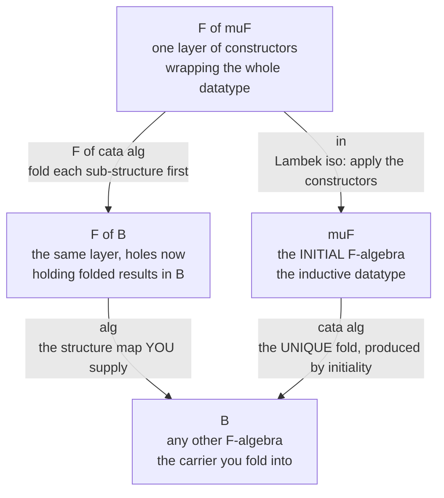

# 🍌 F-Algebras and Initial Algebras

> [!abstract] TL;DR
> Fix an **endofunctor** `F : C → C` that encodes the *signature* of a datatype — the shape of "one layer of constructors." An **F-algebra** is any object `A` (the **carrier**) together with a **structure map** `alg : F(A) → A` that says how to *fold one layer* into an `A`. These algebras form a category, and its **initial object** — the **initial F-algebra** — is exactly the **inductive data type** built from those constructors: the naturals, lists, binary trees, and abstract syntax trees are each the initial algebra of a suitable polynomial functor. **Lambek's lemma** says the initial algebra's structure map `in : F(μF) → μF` is an **isomorphism**, so `μF` is literally the **least fixed point** solving `X ≅ F(X)`. And because it is *initial*, there is one and only one F-algebra homomorphism from it to **any** other algebra — that unique map is the **catamorphism**, the **fold**. `length`, `sum`, `evaluate`, `pretty-print`, and `compile` are all folds; the universal property is *why* fold is canonical and *why* fusion laws hold. This is the single cleanest place category theory explains a bread-and-butter programming idea: **inductive types, structural recursion, and folds all fall out of one initial object.**

---

## Intuition

**Analogy — a factory recipe versus running the factory.** Think of how you *describe* a natural number to a child: "a number is either **zero**, or it is **one more than** some number you already have." A list is described the same way: "a list is either **empty**, or it is a **head glued onto** a list you already have." A binary tree: "either a **leaf**, or a **branch** joining two trees you already have." Every inductive type is a little grammar with exactly this shape — a fixed menu of ways to build a bigger thing out of smaller things *of the same kind*. That menu is the **signature**, and packaging the menu as a single mathematical object is the endofunctor `F`.

Now separate two jobs that are usually tangled together. The **first job** is to *state the recipe* — list the constructors and where the "recursive holes" go. That is `F`. The **second job** is to *interpret the recipe on a specific material* — decide what "zero" and "one-more" should *mean* if the answers live in some carrier `A`. Choosing an interpretation `F(A) → A` is choosing an **F-algebra**: for numbers, interpret `zero ↦ 0` and `succ n ↦ n + 1` in `A = ℤ`, or interpret `zero ↦ True` and `succ n ↦ not n` to get parity. The **initial** F-algebra is the one interpretation that commits to *nothing* beyond the recipe itself — it is the raw syntax trees, the datatype, the "term algebra." And here is the punchline: because it commits to nothing, there is a **unique** structure-respecting way to translate it into *any* other interpretation. That unique translation — "run the recipe once for every constructor, bottom-up" — is the **fold**. So `μF` is the free datatype and `cata` is the universal way to consume it.

---

## How It Works

### The signature functor F

An endofunctor `F : C → C` ([[Functors]]) is a "shape with holes." Read `F(X)` as *"one layer of constructors, whose recursive sub-positions are filled with `X`."* Three canonical examples, all **polynomial functors** built from `+` (coproduct) and `×` (product) ([[Products_and_Coproducts]]):

- **Naturals.** `F(X) = 1 + X`. One layer is *either* the point `1` (read: `zero`) *or* a single hole `X` (read: `succ` applied to a predecessor). An F-algebra `1 + A → A` is precisely **a chosen point plus a self-map** — exactly the data of a Peano interpretation.
- **Lists of `N`.** `F(X) = 1 + N × X`. One layer is *either* `nil` *or* a pair of a head `N` and a tail-hole `X` (`cons`). An algebra `1 + N × A → A` interprets the two list constructors.
- **Binary trees / expressions.** `F(X) = N + X × X` (leaf-or-branch), or `F(X) = int + X×X + X×X` for an add/multiply expression grammar. An algebra says what a leaf becomes and how to combine two already-processed subtrees.

The functor's **action on morphisms**, `F(h) : F(X) → F(Y)`, is the crucial half: it applies `h` *inside the recursive holes only*, leaving the constructor tags and the non-recursive payload untouched. This is what lets a fold "recurse on the children first."

### F-algebras and their homomorphisms

An **F-algebra** is a pair `(A, alg)` with `alg : F(A) → A`. A **homomorphism** of F-algebras `(A, a) → (B, b)` is a carrier map `h : A → B` that **commutes with the structure maps**:

`h ∘ a = b ∘ F(h)`   — *fold the layer with `a` then translate, equals translate the sub-holes then fold with `b`.*

That equation is a commuting square ([[Diagrams_and_Commutativity]]). Identities are homomorphisms and homomorphisms compose, so **F-algebras form a category** `Alg(F)`.

### The initial F-algebra = the inductive datatype

The **initial F-algebra** `(μF, in)` is the **initial object** of `Alg(F)` ([[Terminal_Initial_and_Zero_Objects]], [[Universal_Properties]]): the algebra with a *unique* homomorphism *out* to every other algebra. Concretely `μF` is the datatype of all finite syntax trees over the signature — the "smallest" carrier that supports the constructors and adds no extra elements or equations.

**Lambek's lemma.** The structure map of an initial algebra is an **isomorphism**: `in : F(μF) → μF` has an inverse. Hence `μF ≅ F(μF)` — the initial algebra is a genuine **fixed point** of the functor (the *least* fixed point). This is the categorical meaning of the informal equation "a list is either empty or a head-plus-a-list": the type *equals* one layer of its own constructors. Proof idea: build the algebra `(F(μF), F(in))`; initiality gives a unique map `μF → F(μF)`, and a short diagram chase shows it is a two-sided inverse of `in`.

### Catamorphisms = folds

Because `μF` is **initial**, for *any* F-algebra `(B, alg)` there is **exactly one** homomorphism `cata alg : μF → B` — the **catamorphism** (Greek *kata*, "downward"), the **fold**. It is characterised by the commuting square below, which unrolls into the executable recursion `cata alg = alg ∘ F(cata alg) ∘ in⁻¹`:



Read the square as the defining law: **translate-then-fold equals fold-the-holes-then-apply-your-algebra.** Uniqueness is the entire payoff — it means `cata alg` is *forced* once you name `alg`, so a fold is completely determined by *what each constructor does*. `sum`, `length`, `depth`, `evaluate`, and `compile` differ only in the algebra plugged in; the recursion is identical and canonical. Uniqueness is also what licenses the **fusion law** `h ∘ cata alg = cata alg'` whenever `h` is a homomorphism `(B,alg) → (B',alg')`, the algebraic basis of deforestation and map/fold optimisation.

### The recursion-schemes program and the coalgebraic dual

Catamorphisms are one member of the **"Bananas, Lenses, Envelopes and Barbed Wire"** family (Meijer–Fokkinga–Paterson, 1991): **anamorphisms** (unfolds — the dual, building a structure from a seed), **hylomorphisms** (unfold-then-fold with no intermediate structure), and **paramorphisms** (folds with access to the original sub-term). Turning the arrows around ([[Duality_and_the_Opposite_Category]]) exchanges F-algebras for **F-coalgebras** `A → F(A)`, initial for **final**, induction for **coinduction**, and folds for **unfolds** — the theory of *infinite/observational* data (streams, processes). That coalgebraic mirror is developed in [[F_Coalgebras_and_Coinduction]]; monads and their Eilenberg–Moore algebras (a *different*, monad-indexed notion of algebra) live in [[Monads_Categorically]] and [[Kleisli_Categories_and_Algebras]].

### Why it matters

An **algebraic data type is nothing but the initial algebra of a polynomial functor.** The `data` declaration lists the constructors — that *is* `F`; the constructors bundled together *are* the structure map `in`; pattern-matching-and-recursing *is* invoking the universal property. This gives the **induction principle** and **structural recursion** a precise categorical footing (soundness of induction = initiality) that underlies dependently-typed data declarations and the semantics of inductive definitions in proof assistants ([[Type_Systems_Fundamentals]], [[Functional_Programming_Foundations]], the forthcoming *Category Theory in Programming* sibling). In compilers, the AST is `μF` for an expression functor and every pass — type-checking, constant-folding, code generation, an interpreter — is literally a catamorphism ([[Abstract_Syntax_Trees_and_Parser_Design]], PLT [[Simply_Typed_Lambda_Calculus]]).

---

## Key Concepts

### Secondary (intuition-level)
- A datatype is a **recipe**: "a number is zero or one-more-than-a-number," "a list is empty or head-plus-a-list." The recipe with its holes is the functor `F`.
- An **F-algebra** is one *interpretation* of the recipe: say what each constructor does, landing in some answer type.
- The **fold** runs an interpretation bottom-up over the whole structure; changing the interpretation is the *only* thing that changes what a fold computes.

### Undergraduate (formal core)
- **F-algebra:** carrier `A` plus **structure map** `alg : F(A) → A`. **Homomorphism:** `h` with `h ∘ a = b ∘ F(h)` (a commuting square). These form the category `Alg(F)`.
- **Initial algebra `(μF, in)`:** the initial object of `Alg(F)`; unique homomorphism out to every algebra. It is the inductive datatype / term algebra.
- **Lambek's lemma:** `in : F(μF) → μF` is an **iso**, so `μF ≅ F(μF)` is the **least fixed point** of `F`.
- **Catamorphism:** `cata alg : μF → B`, the unique homomorphism; computationally `cata alg = alg ∘ F(cata alg) ∘ in⁻¹`. `foldr` is `cata` for `F(X) = 1 + A×X`.

### Graduate (structural / research-level)
- **Existence.** For `Set` (and more generally an `ω`-cocomplete category), the initial algebra of an `ω`-cocontinuous `F` is the colimit of the chain `0 → F(0) → F²(0) → …` (Adámek's theorem) — the "limit of finite approximations." Polynomial functors are always such; datatypes with a `data` declaration always have an initial algebra.
- **Bialgebras and recursion schemes.** The banana-split and fusion laws, and generalised schemes (**histomorphisms**, **futumorphisms**, and the recursion/corecursion of *bialgebras* over a distributive law) systematise structured recursion; hylomorphisms `= cata ∘ ana` witness divide-and-conquer without materialising the call tree.
- **Duality.** `Alg(F)` versus `CoAlg(F)`: initial algebra (induction, folds, *least* fixed point) is dual to final coalgebra (coinduction, unfolds, *greatest* fixed point). In `Set` these can differ (finite lists vs. possibly-infinite streams); Freyd's characterisation relates them.
- **Semantics.** Initial-algebra semantics (Goguen–Thatcher–Wagner) gives datatypes their meaning; parametricity (the free theorem for the fold) yields fusion; in domain-theoretic settings the least fixed point coincides with the initial algebra ([[Domain_Theory_and_Fixed_Points]]).

---

## Python Demo

We implement **F-algebras** and the **catamorphism** for the signature functor of arithmetic expression trees, `F(X) = Lit(int) + Add(X, X) + Mul(X, X)`. The **initial algebra** is represented as the recursive datatype built from the constructors (Lambek's iso `in` is the identity on the representation). We define one **generic `cata`**: given *any* structure map `alg : F(B) → B`, it produces the **unique** fold `μF → B`. We instantiate several algebras — `evaluate`, `size` (node count / "length"), `depth`, `leaf-sum`, and `pretty-print` — and confirm one recursion computes them all. We then **verify the universal property**: the fold makes the algebra square commute, and it is **unique** (an independently written direct-recursive evaluator, being another homomorphism into the same algebra, must coincide with it). A compact second demo shows `cata` over the **list functor** `1 + N×X` *is* `foldr`. Finally we **visualise** the fold collapsing one tree bottom-up under two different algebras. Pure standard library plus matplotlib.

```python
"""
F-ALGEBRAS and the CATAMORPHISM (fold) over the INITIAL algebra.

Signature functor (expression trees):
    F(X) = Lit(int)  +  Add(X, X)  +  Mul(X, X)

An F-ALGEBRA is a carrier B with a STRUCTURE MAP  alg : F(B) -> B  that folds
ONE layer of constructors (whose holes already hold B's) into a B.
The INITIAL F-algebra is the datatype of expression trees; its structure map
`in` assembles a node from its parts and is an ISO (Lambek's lemma), so the
datatype is the least fixed point  muF ~ F(muF).
CATA(alg) is the UNIQUE F-algebra homomorphism  muF -> B  --- the fold.
"""
import random
import matplotlib.pyplot as plt

# ---------------------------------------------------------------------------
# 1. The signature functor F.  fmap applies g to the RECURSIVE positions only
#    (constructor tags and non-recursive payload are left untouched).
# ---------------------------------------------------------------------------
def fmap(g, fx):
    tag = fx[0]
    if tag == "Lit": return ("Lit", fx[1])                 # no recursive holes
    if tag == "Add": return ("Add", g(fx[1]), g(fx[2]))    # two holes
    if tag == "Mul": return ("Mul", g(fx[1]), g(fx[2]))    # two holes
    raise ValueError(tag)

# Constructors of the INITIAL algebra (its structure map `in`, an iso).
def Lit(n):    return ("Lit", n)
def Add(a, b): return ("Add", a, b)
def Mul(a, b): return ("Mul", a, b)

# ---------------------------------------------------------------------------
# 2. The CATAMORPHISM.  For ANY algebra alg : F(B) -> B, the UNIQUE fold muF->B:
#        cata(alg) = alg . F(cata(alg))     (fold the holes, then apply alg)
# ---------------------------------------------------------------------------
def cata(alg):
    def fold(t):
        return alg(fmap(fold, t))       # fmap(fold, t) recurses on sub-trees
    return fold

# ---------------------------------------------------------------------------
# 3. A GALLERY of F-algebras: each is JUST a structure map F(B) -> B.
#    The recursion never changes -- only the algebra does.
# ---------------------------------------------------------------------------
def alg_eval(fx):                       # B = int : evaluate the expression
    t = fx[0]
    if t == "Lit": return fx[1]
    if t == "Add": return fx[1] + fx[2]
    if t == "Mul": return fx[1] * fx[2]

def alg_size(fx):                       # B = int : count nodes  ("length")
    return 1 if fx[0] == "Lit" else 1 + fx[1] + fx[2]

def alg_depth(fx):                      # B = int : height of the tree
    return 1 if fx[0] == "Lit" else 1 + max(fx[1], fx[2])

def alg_sum(fx):                        # B = int : sum of the leaf literals
    return fx[1] if fx[0] == "Lit" else fx[1] + fx[2]

def alg_pretty(fx):                     # B = str : pretty-print
    t = fx[0]
    if t == "Lit": return str(fx[1])
    if t == "Add": return "(" + fx[1] + " + " + fx[2] + ")"
    if t == "Mul": return "(" + fx[1] + " * " + fx[2] + ")"

evaluate = cata(alg_eval)
size     = cata(alg_size)
depth    = cata(alg_depth)
leafsum  = cata(alg_sum)
show     = cata(alg_pretty)

# sample tree:  (2 * 3) + (4 + 1)
expr = Add(Mul(Lit(2), Lit(3)), Add(Lit(4), Lit(1)))

print("== one datatype, many folds ==")
print("  expression      :", show(expr))
print("  evaluate (fold) :", evaluate(expr))   # 11
print("  size     (fold) :", size(expr))       # 7 nodes
print("  depth    (fold) :", depth(expr))      # 3
print("  leaf sum (fold) :", leafsum(expr))    # 2+3+4+1 = 10

# ---------------------------------------------------------------------------
# 4. THE UNIVERSAL PROPERTY.
#    (a) COMMUTING SQUARE:  cata(alg) . in  ==  alg . F(cata(alg))
#    (b) UNIQUENESS: any homomorphism h with h.in = alg.F(h) MUST equal cata.
# ---------------------------------------------------------------------------
def in_(s):        # initial structure map `in`: assemble a node from its parts;
    return s       # identified with the identity on the representation (Lambek)

def random_tree(rng, p_leaf=0.5):
    if rng.random() < p_leaf:
        return Lit(rng.randint(0, 9))
    op = rng.choice([Add, Mul])
    return op(random_tree(rng, min(p_leaf + 0.15, 0.95)),
              random_tree(rng, min(p_leaf + 0.15, 0.95)))

rng = random.Random(1)
trees = [random_tree(rng) for _ in range(500)]

# (a) The eval-fold makes the algebra square commute on every input:
square_ok = all(
    cata(alg_eval)(in_(t)) == alg_eval(fmap(cata(alg_eval), t))
    for t in trees)

# (b) An INDEPENDENT direct-recursive evaluator is ALSO a homomorphism into the
#     eval-algebra; the universal property forces it to EQUAL the fold. Agreement
#     on every tree witnesses uniqueness.
def eval_direct(t):
    tag = t[0]
    if tag == "Lit": return t[1]
    if tag == "Add": return eval_direct(t[1]) + eval_direct(t[2])
    if tag == "Mul": return eval_direct(t[1]) * eval_direct(t[2])

unique_ok = all(evaluate(t) == eval_direct(t) for t in trees)

print("\n== universal property (over 500 random trees) ==")
print("  square commutes  cata.in == alg.F(cata) :", square_ok)
print("  fold is UNIQUE   cata == any homomorph.  :", unique_ok)

# ---------------------------------------------------------------------------
# 5. The SAME machinery for LISTS:  G(X) = 1 + N x X.  cata over G IS foldr.
# ---------------------------------------------------------------------------
def gmap(g, fx):
    return ("Nil",) if fx[0] == "Nil" else ("Cons", fx[1], g(fx[2]))

def gcata(alg):
    def fold(xs):
        return alg(gmap(fold, xs))
    return fold

def from_list(xs):
    acc = ("Nil",)
    for v in reversed(xs):
        acc = ("Cons", v, acc)
    return acc

g_sum = lambda fx: 0 if fx[0] == "Nil" else fx[1] + fx[2]
g_len = lambda fx: 0 if fx[0] == "Nil" else 1 + fx[2]
g_prd = lambda fx: 1 if fx[0] == "Nil" else fx[1] * fx[2]

xs = from_list([3, 1, 4, 1, 5, 9])
print("\n== list functor  G(X) = 1 + N x X   (cata = foldr) ==")
print("  sum     :", gcata(g_sum)(xs))     # 23
print("  length  :", gcata(g_len)(xs))     # 6
print("  product :", gcata(g_prd)(xs))     # 540

# ---------------------------------------------------------------------------
# 6. VISUALIZE the fold collapsing the tree bottom-up under two algebras.
#    Red number at each node = the algebra value of THAT subtree.
# ---------------------------------------------------------------------------
def layout(t, depth=0, counter=None):
    if counter is None: counter = [0]
    if t[0] == "Lit":
        x = counter[0]; counter[0] += 1
        return {"t": t, "x": x, "y": -depth, "kids": []}
    L = layout(t[1], depth + 1, counter)
    R = layout(t[2], depth + 1, counter)
    return {"t": t, "x": (L["x"] + R["x"]) / 2, "y": -depth, "kids": [L, R]}

SYM = {"Add": "+", "Mul": "x"}

def draw(ax, node, alg, title):
    fold = cata(alg)
    def edges(nd):
        for k in nd["kids"]:
            ax.plot([nd["x"], k["x"]], [nd["y"], k["y"]], "-",
                    color="#8a97a8", lw=1.5, zorder=1)
            edges(k)
    def nodes(nd):
        val = fold(nd["t"])                     # algebra value AT this subtree
        tag = nd["t"][0]
        label = str(nd["t"][1]) if tag == "Lit" else SYM[tag]
        color = "#cfe8d4" if tag == "Lit" else "#dfe4f7"
        ax.scatter([nd["x"]], [nd["y"]], s=1300, color=color,
                   edgecolors="#2c3e6b", lw=1.6, zorder=2)
        ax.text(nd["x"], nd["y"] + 0.11, label, ha="center", va="center",
                fontsize=13, fontweight="bold", zorder=3)
        ax.text(nd["x"], nd["y"] - 0.15, str(val), ha="center", va="center",
                fontsize=10, color="#c0392b", fontweight="bold", zorder=3)
        for k in nd["kids"]:
            nodes(k)
    edges(node); nodes(node)
    ax.set_title(title, fontweight="bold")
    ax.margins(0.15); ax.axis("off")

root = layout(expr)
fig, axes = plt.subplots(1, 2, figsize=(14, 6))
draw(axes[0], root, alg_eval, "fold with EVAL algebra  ->  root value 11")
draw(axes[1], root, alg_size, "fold with SIZE algebra  ->  root node-count 7")
fig.suptitle("One tree, two F-algebras: the catamorphism collapses it bottom-up\n"
             "(red number at each node = the algebra value of that subtree)",
             fontsize=13, fontweight="bold")
fig.tight_layout(rect=[0, 0, 1, 0.93])
plt.show()   # or: fig.savefig("f_algebra_catamorphism.png", dpi=120)
```

**What the run shows.** A *single* `cata` recursion computes `evaluate = 11`, `size = 7`, `depth = 3`, and `leaf-sum = 10` over the same tree — the *only* thing that changed is the F-algebra plugged in, which is the whole point: a fold is determined by "what each constructor does." The universal-property section confirms the algebra square commutes on 500 random trees and that an independently coded direct-recursive evaluator (a second homomorphism into the eval-algebra) coincides with the fold on every one — the computational witness of **uniqueness**. The list demo shows `cata` over `1 + N×X` reproducing `foldr` exactly (`sum`, `length`, `product`). The figure renders the same tree collapsing bottom-up under two algebras, each node annotated in red with the value that subtree folds to — a fold made visible.

---

## Real-World Applications

> **Compilers and interpreters fold the AST.** In a real compiler the abstract syntax tree is the initial algebra `μF` of an expression/statement functor `F` ([[Abstract_Syntax_Trees_and_Parser_Design]]). A **tree-walking interpreter** is the catamorphism into a value algebra; a **type checker** is a fold into a type-or-error algebra; **constant folding** and **pretty-printing** are folds into an AST algebra and a string algebra respectively; a naive **code generator** is a fold into an instruction-list algebra. Writing each pass as `cata alg` — rather than an ad-hoc recursive traversal — makes the structure uniform, lets **fusion laws** merge consecutive passes into one traversal, and separates *what each node means* (the algebra) from *how to walk the tree* (the fixed `cata`). This is the initial-algebra semantics of datatypes doing daily work.

- **Recursion-schemes libraries.** Haskell's `recursion-schemes`, Scala's Droste/Matryoshka, and Kotlin's arrow-recursion expose `cata`, `ana`, `hylo`, and `para` directly; you define the base functor `F` once and get every fold/unfold for free, with fusion optimisations the compiler can trust because the schemes are law-abiding.
- **Algebraic data types are initial algebras.** Every `data`/`enum`/`sealed` declaration in Haskell, Rust, OCaml, or Scala *is* the initial algebra of a polynomial functor: constructors are the structure map, and `match`/pattern-matching-with-recursion is invoking the universal property ([[Type_Systems_Fundamentals]], [[Functional_Programming_Foundations]]).
- **Proof assistants and dependent types.** Coq/Agda/Lean generate the **induction principle** for each inductive definition directly from its initial-algebra character; induction is *sound* precisely because the datatype is initial, and elaboration compiles structural recursion to the fold.
- **Big-data aggregation.** Tree/`GROUP BY` aggregations and parallel `reduce` are catamorphisms over a rose-tree or list functor; associativity of the algebra is exactly what lets a fold be re-associated and run in parallel (map-reduce), the same fusion story at scale.

---

## Common Pitfalls

- **Confusing the two "algebra" notions.** An **F-algebra** `F(A) → A` (this note) is indexed by a plain *functor* and captures inductive datatypes. An **Eilenberg–Moore algebra** `T(A) → A` is indexed by a *monad* and captures models of an equational theory ([[Monads_Categorically]], [[Kleisli_Categories_and_Algebras]]). They look alike but do different jobs; only the monadic ones carry laws forcing `T`'s unit/multiplication to interact well.
- **Forgetting Lambek's iso.** `μF ≅ F(μF)` means the datatype *equals* one layer of its own constructors; the iso `in` and its inverse (the "unwrap") are what make `cata alg = alg ∘ F(cata alg) ∘ in⁻¹` type-check. Beginners implement fold without realising they are silently using `in⁻¹` to expose the top constructor.
- **Assuming initial = final.** In `Set`, the **initial** algebra of `1 + A×X` is *finite* lists (least fixed point, folds/induction), while the **final coalgebra** is *possibly-infinite* streams (greatest fixed point, unfolds/coinduction). They coincide only in special settings; conflating them breaks on infinite data ([[F_Coalgebras_and_Coinduction]], [[Duality_and_the_Opposite_Category]]).
- **Non-strictly-positive functors have no initial algebra.** A "datatype" whose recursive occurrence sits to the left of an arrow, e.g. `F(X) = (X → Bool)`, is *not* a polynomial functor and generally has **no** initial algebra — a cardinality/Lambek argument rules it out. This is why languages restrict `data` to strictly positive definitions.
- **Writing bespoke recursion instead of an algebra.** Hand-rolled traversals lose the universal property: you forfeit uniqueness reasoning, fusion, and the guarantee that "same algebra ⇒ same result." Factor the *meaning* into `alg : F(B) → B` and reuse one `cata`.
- **Missing that `foldr` is a catamorphism, not `foldl`.** `foldr` is the cata for `1 + A×X` and respects the initial-algebra structure; `foldl` is a different (accumulator-threading) beast whose relation to the fold is via a higher-order algebra. Reaching for `foldl` when you want the structural fold muddies fusion laws.

---

## Related Concepts

- [[Functors]] — the **signature** of a datatype *is* an endofunctor `F`; `F`'s action on morphisms is what lets `cata` recurse on the sub-holes.
- [[Universal_Properties]] — the initial algebra is defined by a **universal property** (initial object of `Alg(F)`); the fold is the unique mediating arrow, determined up to nothing.
- [[Terminal_Initial_and_Zero_Objects]] — `μF` is the **initial object** of the algebra category; the whole construction is that one idea specialised.
- [[Products_and_Coproducts]] — polynomial functors are built from `+` and `×`; an algebra `1 + A → A` unpacks into a point and a self-map exactly by the coproduct universal property.
- [[Diagrams_and_Commutativity]] — a homomorphism of algebras *is* a **commuting square**; the catamorphism law is that square.
- [[F_Coalgebras_and_Coinduction]] — the exact **dual**: final coalgebras, unfolds/anamorphisms, coinduction, and possibly-infinite data (streams, processes).
- [[Duality_and_the_Opposite_Category]] — reverse every arrow and F-algebras/initial/folds become F-coalgebras/final/unfolds; this note supplies the duality machinery.
- [[Kleisli_Categories_and_Algebras]] — the *other* algebra notion: Eilenberg–Moore algebras of a **monad**, plus the free monad built from initial algebras of syntax functors.
- [[Monads_Categorically]] — contrast: monad-indexed models `T(A)→A`; the free monad on a functor is assembled from initial algebras of syntax functors.
- [[Type_Systems_Fundamentals]] — algebraic data types **are** initial algebras of polynomial functors; constructors = structure map, pattern-match-and-recurse = the universal property.
- [[Functional_Programming_Foundations]] — `foldr` and the whole fold family are catamorphisms; this note is their categorical explanation.
- [[Abstract_Syntax_Trees_and_Parser_Design]] — the AST is `μF`; interpreters, type-checkers, and codegen passes are folds over it.

*Referenced in prose (not yet written): the forthcoming Category_Theory sibling **Category Theory in Programming** (the Haskell/Scala face of folds and recursion schemes). PLT bridge: [[Simply_Typed_Lambda_Calculus]] and [[Domain_Theory_and_Fixed_Points]] (least-fixed-point semantics).*

---

## Review Questions

1. **(Conceptual)** Fix `F(X) = 1 + X`. (a) Spell out precisely what data an F-algebra `1 + A → A` consists of, and give the initial one. (b) State Lambek's lemma for this `F` and explain, in words, what "`μF ≅ F(μF)`" is asserting about the natural numbers. (c) Given the algebra that sends `zero ↦ 0` and `succ n ↦ n + 1` into `A = ℤ`, describe the catamorphism it induces and why it is the *only* homomorphism from `μF` to that algebra.

2. **(Scenario)** You maintain a compiler whose AST is the initial algebra of `F(X) = Lit(int) + Add(X,X) + Mul(X,X)`. You already have `evaluate` and `pretty` written as separate recursive functions and want to add a `constant-fold` pass that also collects the number of `Mul` nodes. (a) Recast each pass as an F-algebra `F(B) → B`, naming the carrier `B` in every case. (b) Explain how the **fusion law** lets you run `evaluate ∘ constantFold` in a single traversal, and what property of the algebras you must check for the fusion to be valid. (c) Why does expressing the passes as folds give you a correctness guarantee that hand-written mutually-recursive functions do not?

3. **(Trade-off / structural)** (a) In `Set`, contrast the **initial algebra** and the **final coalgebra** of `F(X) = 1 + A×X`; what does each one *contain*, and which supports folds versus unfolds? (b) Explain why a "datatype" defined by `F(X) = (X → Bool)` has no initial algebra, referencing strict positivity and Lambek's iso. (c) Adámek's theorem builds `μF` as the colimit of `0 → F(0) → F²(0) → …`. Interpret this chain concretely for lists and say what the `n`-th stage represents and why the colimit is exactly the finite lists.

---

## Sources

- [Meijer, Fokkinga & Paterson, "Functional Programming with Bananas, Lenses, Envelopes and Barbed Wire", FPCA 1991](https://research.utwente.nl/en/publications/functional-programming-with-bananas-lenses-envelopes-and-barbed-w) — the founding recursion-schemes paper (catamorphisms, anamorphisms, hylomorphisms, paramorphisms).
- [Bird & de Moor, *Algebra of Programming* (Prentice Hall, 1997)](https://www.cs.ox.ac.uk/publications/books/algebra/) — initial algebras, catamorphisms, and the calculus of program derivation with fusion laws.
- [Lambek, J., "A fixpoint theorem for complete categories", *Mathematische Zeitschrift* 103 (1968)](https://doi.org/10.1007/BF01110627) — the original proof that an initial algebra's structure map is an isomorphism.
- [nLab, "initial algebra of an endofunctor"](https://ncatlab.org/nlab/show/initial+algebra+of+an+endofunctor) — reference article: definition, Lambek's lemma, Adámek's construction, and the coalgebraic dual.
- [Milewski, B., "Understanding F-Algebras", *Category Theory for Programmers* (2017)](https://bartoszmilewski.com/2017/02/28/f-algebras/) — programmer-facing derivation of F-algebras, initial algebras, and folds with Haskell code.

---

#category-theory #f-algebra #initial-algebra #catamorphism #inductive-types
