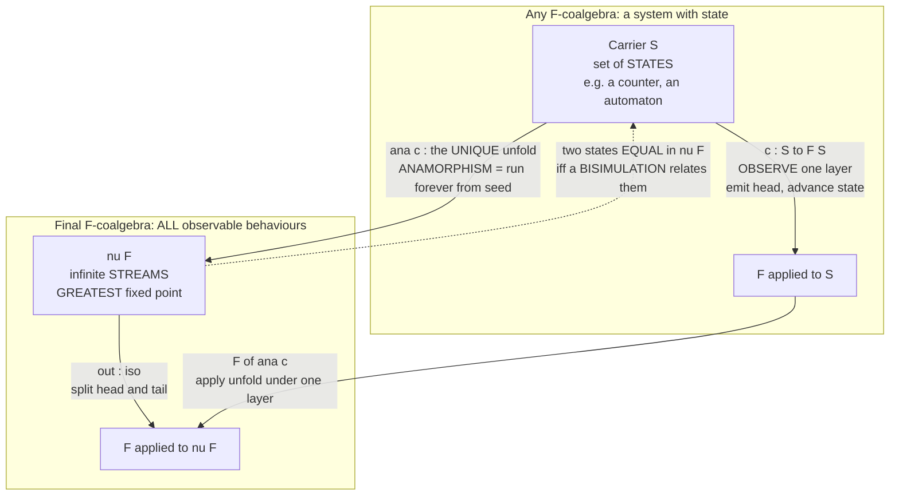

# 🔭 F-Coalgebras and Coinduction

> [!abstract] TL;DR
> Turn the theory of inductive data **inside-out**. An **F-algebra** answers *"how is this finite structure BUILT?"* — a map `F(A) → A` that consumes one layer of constructors, whose universal endpoint is the **initial algebra** (`μF`, the least fixed point, the world of **folds/catamorphisms**). Reverse every arrow (that is the whole trick — [[Duality_and_the_Opposite_Category]]) and you get an **F-coalgebra**: a carrier `S` with an **observation map** `c : S → F(S)` answering *"how does this thing BEHAVE when I OBSERVE one step?"* Its universal endpoint is the **final coalgebra** (`νF`, the **greatest fixed point**), the type of all possible **behaviours** — **infinite streams**, lazy lists, infinite trees, the runs of a state machine. From *any* coalgebra there is a **unique** map into `νF`, the **anamorphism** (`unfold`), which lazily generates an infinite structure from a seed — the exact dual of `fold`. And the reasoning principle flips too: where induction proves facts about finite data, **coinduction** proves two behaviours **equal** by exhibiting a **bisimulation** — a relation closed under observation. This single duality organises all of recursive-versus-corecursive programming (**data vs codata**), gives streams, state, and reactive systems a precise universal-property meaning, and unifies stream equality, automata equivalence, and process-calculus bisimulation into one idea.

---

## Intuition

**Analogy — a blueprint you assemble versus a machine you watch run.** Think about the two opposite ways you can know a LEGO castle. The first way is the **blueprint**: a finite recipe of *constructors* — "snap this brick onto that, then this turret onto the wall" — that you follow to the end and hold a finished, bounded object in your hands. That is the world of **inductive data**: everything is built from the ground up in finitely many steps, and you understand it by understanding how it was *assembled* (an F-**algebra**, whose reasoning tool is induction).

Now turn the picture inside-out. Instead of a thing you *build*, imagine a thing you *watch*: a vending machine, a ticking clock, a river of water flowing past you. You can never "hold all of it" — it may run **forever** — and it has no final assembled form. The only thing you can ever do is **observe one step**: press the button and see *what comes out now* and *what state the machine is in next*; glance at the river and see *this drop* and *the river that remains behind it*. A **coalgebra** captures exactly this stance: not *"how is it built?"* but *"what do I see when I probe it once, and what is left to probe afterward?"* Infinite data — a **stream** that always offers a next element, a **state machine** you can always step, the endless **behaviour** of a running server — all live here. And the deep payoff: since you can never inspect the whole infinite thing, the only sensible notion of "these two machines are the same" is **they produce the same observations forever, no matter how you probe them** — even if their guts are wired completely differently. That is **coinduction**, and the witness that two behaviours coincide is a **bisimulation**.

---

## How It Works

### Core mechanics: reverse the arrows of the algebra story

Fix an endofunctor `F : C → C` describing "one layer of structure." The two dual worlds are built from the *same* `F` by pointing the structure map the opposite way:

| | **F-algebra** (construction) | **F-coalgebra** (observation) |
|---|---|---|
| Structure map | `α : F(A) → A` (an **in**-map: consume a layer) | `c : S → F(S)` (an **out**-map: expose a layer) |
| Reading | "given the pieces, **build** the whole" | "given the whole, **destructure/observe** one step" |
| Homomorphism `h` | `h ∘ α = β ∘ F(h)` | `d ∘ h = F(h) ∘ c` |
| Universal object | **initial** algebra `μF` (no arrows in, one out) | **final** coalgebra `νF` (one arrow in, none out) |
| Fixed point | **least** fixed point of `F` | **greatest** fixed point of `F` |
| Canonical map | **catamorphism** = `fold` (unique map *out of* `μF`) | **anamorphism** = `unfold` (unique map *into* `νF`) |
| Data flavour | finite **inductive data** | possibly-infinite **coinductive codata** |
| Proof principle | **induction** | **coinduction** / **bisimulation** |

A **coalgebra** for `F` is thus a pair `(S, c)` where `S` is the **carrier** (think: the set of *states*) and `c : S → F(S)` is the **observation** map that "unfolds one layer." A **coalgebra homomorphism** `h : (S, c) → (T, d)` is a map on carriers that **preserves observations**: `F(h) ∘ c = d ∘ h`. Observing then translating equals translating then observing — `h` is a *behaviour-preserving* map of state spaces.

### The stream functor, made concrete

The running example is the **stream functor** `F(X) = A × X` for a fixed alphabet `A`. A coalgebra `c : S → A × X` sends each state to a pair `(head, next-state)`: *what you emit now* and *where you go next*. Then:

- A coalgebra is exactly a **Moore/Mealy-style machine**: a state set plus "emit-and-advance."
- The **final coalgebra** `νF` for `F(X) = A × X` is `Aᵂ`, the set of **infinite streams** over `A`, with observation `out : Aᵂ → A × Aᵂ` splitting a stream into `(head, tail)` — a canonical isomorphism.
- The **anamorphism** `ana c : S → Aᵂ` runs the machine forever from a seed, producing the infinite stream of everything it ever emits.

Different functors give different codata: `F(X) = 1 + A × X` yields **finite-or-infinite (lazy) lists**; `F(X) = A × X × X` yields **infinite binary trees**; `F(X) = 𝒫(A × X)` (powerset) yields **labelled transition systems** — the coalgebraic model of nondeterministic processes.

### The final coalgebra is the greatest fixed point

The final coalgebra is the **terminal object** in the category of `F`-coalgebras ([[Terminal_Initial_and_Zero_Objects]], [[Universal_Properties]]) — dual, arrow-for-arrow, to the initial algebra being the initial object. **Lambek's lemma** (dualised) says the final coalgebra's structure map `out : νF → F(νF)` is an **isomorphism**, so `νF ≅ F(νF)`: `νF` is a **fixed point** of `F`, and terminality forces it to be the **greatest** one. Where the initial algebra `μF` is the *least* fixed point (finite trees, reached from below), the final coalgebra `νF` is the *greatest* (adds all the infinite/limit behaviours). In domain-theoretic terms this is the same least-vs-greatest split seen in [[Domain_Theory_and_Fixed_Points]]: `μF` is `lfp F`, `νF` is `gfp F`.

### Anamorphisms and coinduction as universal properties

Finality gives the definition principle for free: for **any** coalgebra `(S, c)` there is a **unique** coalgebra homomorphism `ana c : S → νF` into the final coalgebra. That unique map *is* the **unfold** — to **define** an element of a coinductive type, you need only supply a coalgebra (a seed plus an observation rule), and corecursion does the rest. This is precisely dual to: to **consume** an element of an inductive type, supply an algebra and `fold` does the rest.

Uniqueness is the engine of **coinduction as a proof principle**. To show two states are **equal in `νF`** (i.e. behave identically forever), you do not unroll to infinity — you exhibit a **bisimulation** `R`: a relation on states such that whenever `p R q`, they emit the same head **and** their next-states are again related (`R` is closed under observation). By finality, bisimilar states are mapped to the *same* element of `νF`, so **bisimilar = equal**. That is the whole method: replace "prove an infinite equality" with "find a finite invariant relation and check one local step."

### Flow / architecture



---

## Key Concepts

### Secondary (intuition-level)
- **Data vs codata.** Some things you **build** and finish (a list of 5 numbers); some things you **watch** and never finish (the ticking of a clock). Coalgebras are the maths of the second kind.
- **Observe, do not construct.** A coalgebra never asks "how was this made?" — only "what do I see now, and what is left to see next?"
- **Same-forever = same.** Two machines with different insides count as *the same* if you can never tell them apart by watching their outputs. Proving that is finding a **bisimulation**.

### Undergraduate (formal core)
- **F-coalgebra:** a carrier `S` with `c : S → F(S)`; a **homomorphism** satisfies `F(h) ∘ c = d ∘ h` (preserve observations).
- **Final coalgebra `νF`:** the terminal coalgebra; by (dual) Lambek, `out : νF ≅ F(νF)`, so `νF` is the **greatest fixed point** of `F`. For `F(X)=A×X`, `νF` = infinite streams.
- **Anamorphism / unfold:** the *unique* homomorphism `ana c : S → νF` from any coalgebra into `νF`; the categorical definition of **corecursion**. Dual to the catamorphism `fold` out of the **initial** algebra `μF`.
- **Bisimulation:** a relation `R` closed under observation; **coinduction** says `p R q ⟹ p = q` in `νF`. This is how you prove stream/automaton equality without infinite unrolling.

### Graduate (structural / research-level)
- **Universal coalgebra (Rutten).** A *general theory of systems*: automata, transition systems, Markov chains (`F(X)=𝒟(A×X)` with `𝒟` a distribution functor), and stateful objects are all `F`-coalgebras; behavioural equivalence is coalgebraic bisimilarity, and the final coalgebra is the space of behaviours / the fully-abstract semantics.
- **Bisimulation as a span/relation lifting.** A bisimulation on `(S,c),(T,d)` is a relation `R ⊆ S×T` carrying a coalgebra structure making the projections homomorphisms; equivalently `R ⊆ (c×d)⁻¹(Rel(F)(R))` for the relation lifting `Rel(F)`. Aczel–Mendler bisimulations, and the coalgebraic Hennessy–Milner correspondence (modal logic characterises behaviour), live here.
- **Existence of `νF`.** For `Set`-endofunctors that are **bounded/accessible** (e.g. polynomial functors), `νF` exists and is the limit of the terminal sequence `1 ← F1 ← F²1 ← …`; the "final coalgebra theorem" gives conditions. Contrast the initial-algebra colimit `0 → F0 → F²0 → …`.
- **Comonads and coalgebras.** Coalgebras relate to **comonads** exactly as algebras relate to monads ([[Monads_Categorically]]): a comonad `(W, ε, δ)` has **Eilenberg–Moore coalgebras** `S → W(S)`; context-dependent / streaming computation (`Store`, `Stream`, `Env` comonads) is the corecursive dual of monadic effects.
- **Guarded corecursion & productivity.** For `ana` to be well-defined the coalgebra must be **productive** — each observation makes finite progress. Proof assistants (Coq's `CoFixpoint`, Agda's copatterns / sized types) enforce a **guardedness** condition so corecursive definitions never "get stuck" trying to compute an infinite object all at once.

---

## Python Demo

We build **F-coalgebras** and the **anamorphism (`unfold`)** for the stream functor `F(X) = A × X` — a carrier `S` with an observation `obs : S → (A, S)` giving `(head, next-state)`. We (1) unfold the **naturals**, **Fibonacci**, and a **state machine** lazily from seeds and take finitely many observations; (2) implement **bisimulation** and prove a **2-state** toggle machine and a **4-state** cycle machine are behaviourally **equal** (same `0,1,0,1,…` forever) despite different internals, by exhibiting a bisimulation and checking one local step; and (3) **visualise** the unfold-as-conveyor and the bisimulation between the two machines with matplotlib. Pure standard library plus matplotlib.

```python
"""
F-COALGEBRAS and the ANAMORPHISM (unfold) -- the dual of F-algebras/fold.

A coalgebra for the STREAM functor  F(X) = A x X  is:
    carrier (state set)  S
    observation map      obs : S -> (A, S)     -- (head emitted now, next state)
The FINAL coalgebra is the set of INFINITE STREAMS over A; from ANY coalgebra
there is a UNIQUE map into it -- the ANAMORPHISM 'ana' (unfold) -- lazily
generating an infinite stream from a seed. BISIMULATION then proves two
differently-wired coalgebras produce the SAME observations forever, by a
finite local check instead of infinite unrolling (that is coinduction).
"""
from itertools import islice
import matplotlib.pyplot as plt
import matplotlib.patches as mpatches

# ===========================================================================
# 1. The ANAMORPHISM (unfold).  Given a coalgebra obs : S -> (A, S) and a seed,
#    'ana' lazily unfolds the UNIQUE stream of observations into the final
#    coalgebra.  Dual of fold: fold DESTROYS finite data; unfold BUILDS
#    infinite codata one guarded/productive step at a time.
# ===========================================================================
def ana(obs, seed):
    """Unfold coalgebra obs : S -> (A, S) from 'seed' into an infinite stream."""
    s = seed
    while True:
        head, s = obs(s)      # observe ONE layer: emit head, advance to next state
        yield head            # laziness: we never materialise the whole infinity

def take(stream, n):
    """Finitely many observations of a possibly-infinite behaviour."""
    return list(islice(stream, n))

# ===========================================================================
# 2. Three coalgebras (S, obs) unfolded from seeds.
# ===========================================================================
# (a) Naturals:      state = n in Z,  obs(n) = (n, n+1)
nat_obs  = lambda n: (n, n + 1)
# (b) Fibonacci:     state = (a, b),  obs = (a, (b, a+b))   -- state hides the pair
fib_obs  = lambda ab: (ab[0], (ab[1], ab[0] + ab[1]))
# (c) A state machine: 3-state cycle emitting the word "COW" forever
cow_next = {"c": "o", "o": "w", "w": "c"}
cow_emit = {"c": "C", "o": "O", "w": "W"}
cow_obs  = lambda s: (cow_emit[s], cow_next[s])

print("== Anamorphism (unfold): finitely many observations of infinite codata ==")
print("  naturals   :", take(ana(nat_obs, 0), 10))
print("  fibonacci  :", take(ana(fib_obs, (0, 1)), 10))
print("  'COW' run  :", "".join(take(ana(cow_obs, "c"), 9)))

# ===========================================================================
# 3. BISIMULATION.  Two DIFFERENTLY-wired coalgebras, both emitting 0,1,0,1,...
#    Machine A: 2 states (a toggle).       Machine B: 4 states (a cycle).
#    Same behaviour, different internal state -- prove it WITHOUT unrolling.
# ===========================================================================
# Machine A -- 2 states
A_emit = {"a0": 0, "a1": 1}
A_next = {"a0": "a1", "a1": "a0"}
A_obs  = lambda s: (A_emit[s], A_next[s])

# Machine B -- 4 states, a longer cycle that emits the SAME word
B_emit = {"b0": 0, "b1": 1, "b2": 0, "b3": 1}
B_next = {"b0": "b1", "b1": "b2", "b2": "b3", "b3": "b0"}
B_obs  = lambda s: (B_emit[s], B_next[s])

def is_bisimulation(R, emit1, next1, emit2, next2):
    """R : set of pairs (p, q).  Checks the TWO coinductive conditions:
         (1) related states emit EQUAL heads,
         (2) their NEXT-states are again related.
       If both hold for every pair, R is a bisimulation => bisimilar = equal."""
    for (p, q) in R:
        if emit1[p] != emit2[q]:
            return False                       # observation differs now
        if (next1[p], next2[q]) not in R:
            return False                       # successors escape the relation
    return True

# Proposed bisimulation relating A's 2 states to B's 4 states
R = {("a0", "b0"), ("a1", "b1"), ("a0", "b2"), ("a1", "b3")}
bisim_ok = is_bisimulation(R, A_emit, A_next, B_emit, B_next)

# Sanity: the two streams really do coincide for the first 16 observations
A_stream = take(ana(A_obs, "a0"), 16)
B_stream = take(ana(B_obs, "b0"), 16)

print("\n== Bisimulation: 2-state toggle  vs  4-state cycle ==")
print("  candidate relation R =", sorted(R))
print("  R is a bisimulation (local one-step check) :", bisim_ok)
print("  A first 16 observations :", A_stream)
print("  B first 16 observations :", B_stream)
print("  observationally equal    :", A_stream == B_stream,
      "  => bisimilar => EQUAL in the final coalgebra")

# ===========================================================================
# 4. VISUALISE:  (A) the unfold conveyor;  (B) the bisimulation between machines.
# ===========================================================================
fig, axes = plt.subplots(1, 2, figsize=(16, 6.5))

# ---- Panel A: the anamorphism as a conveyor: seed --obs--> (head, next) ----
ax = axes[0]; ax.axis("off")
ax.set_title("Anamorphism: unfold a seed into an infinite stream",
             fontweight="bold")
seq = take(ana(nat_obs, 0), 6)
n_steps = len(seq)
y_state, y_head = 0.62, 0.20
for i in range(n_steps):
    x = 0.08 + i * 0.15
    # state box
    ax.add_patch(mpatches.FancyBboxPatch((x - 0.045, y_state - 0.05), 0.09, 0.10,
                 boxstyle="round,pad=0.01", fc="#dfe9f7", ec="#2c3e6b", lw=2))
    ax.text(x, y_state, f"s={seq[i]}", ha="center", va="center", fontweight="bold")
    # emitted head below
    ax.add_patch(mpatches.Circle((x, y_head), 0.032, fc="#9ec1e6", ec="#2c3e6b", lw=1.5))
    ax.text(x, y_head, str(seq[i]), ha="center", va="center", fontweight="bold")
    ax.annotate("", xy=(x, y_head + 0.05), xytext=(x, y_state - 0.055),
                arrowprops=dict(arrowstyle="-|>", lw=1.6, color="#c0392b"))
    if i < n_steps - 1:                         # advance-state arrow
        ax.annotate("", xy=(x + 0.105, y_state), xytext=(x + 0.045, y_state),
                    arrowprops=dict(arrowstyle="-|>", lw=2.0, color="#33475b"))
ax.text(0.5, 0.90, "obs(s) = (head s, next s)   applied forever, lazily",
        ha="center", fontweight="bold", color="#2c3e6b")
ax.text(0.5, 0.05, "emitted stream:  " + ", ".join(map(str, seq)) + ", ...",
        ha="center", fontweight="bold", color="#c0392b")
ax.set_xlim(0, 1); ax.set_ylim(0, 1)

# ---- Panel B: two bisimilar machines + the relation R ----------------------
ax = axes[1]; ax.axis("off")
ax.set_title("Bisimulation: 2-state toggle  =  4-state cycle", fontweight="bold")
posA = {"a0": (0.20, 0.80), "a1": (0.20, 0.35)}
posB = {"b0": (0.80, 0.88), "b1": (0.80, 0.63),
        "b2": (0.80, 0.38), "b3": (0.80, 0.13)}
def draw_node(pos, label, emit, fc):
    ax.add_patch(mpatches.Circle(pos, 0.055, fc=fc, ec="#2c3e6b", lw=2))
    ax.text(pos[0], pos[1], f"{label}\n!{emit}", ha="center", va="center",
            fontsize=9, fontweight="bold")
for s in posA: draw_node(posA[s], s, A_emit[s], "#f4d9a6")
for s in posB: draw_node(posB[s], s, B_emit[s], "#bfe3c6")
def transition(pos, nxt, color):
    ax.annotate("", xy=nxt, xytext=pos,
                arrowprops=dict(arrowstyle="-|>", lw=1.8, color=color,
                                connectionstyle="arc3,rad=0.35"))
for s in posA: transition(posA[s], posA[A_next[s]], "#b9770e")
for s in posB: transition(posB[s], posB[B_next[s]], "#1f8a4c")
for (p, q) in R:                                # the bisimulation, dashed
    ax.plot([posA[p][0] + 0.055, posB[q][0] - 0.055],
            [posA[p][1], posB[q][1]], ls="--", lw=1.4, color="#7f4fbf")
ax.text(0.20, 0.95, "Machine A (2 states)", ha="center", fontweight="bold",
        color="#b9770e")
ax.text(0.80, 0.99, "Machine B (4 states)", ha="center", fontweight="bold",
        color="#1f8a4c")
ax.text(0.5, 0.03,
        "dashed = bisimulation R  (related states emit the same, step to related)",
        ha="center", fontsize=9, color="#7f4fbf", fontweight="bold")
ax.set_xlim(0, 1); ax.set_ylim(0, 1)

fig.suptitle("F-coalgebras: observe-one-step (obs), unfold (ana), and prove equal by bisimulation",
             fontsize=14, fontweight="bold")
fig.tight_layout(rect=[0, 0, 1, 0.95])
plt.show()   # or: fig.savefig("f_coalgebras_and_coinduction.png", dpi=120)
```

**What the run shows.** The single generic `ana` unfolds three unrelated coalgebras — the naturals `0,1,2,…`, the Fibonacci stream `0,1,1,2,3,5,…`, and a 3-state machine spelling `COWCOWCOW` — purely from a seed and an observation rule, taking as many observations as we ask for without ever building an infinite object. The bisimulation section then proves that a **2-state** toggle and a **4-state** cycle denote the *same* infinite stream `0,1,0,1,…`: not by comparing infinitely many outputs, but by a **finite** local check that the proposed relation `R` is closed under observation. That is coinduction in action — bisimilar states are *equal* in the final coalgebra. The figure renders the unfold as a conveyor (each state emits a head and advances) and draws the two machines side-by-side with the bisimulation as dashed links, making "different guts, identical behaviour" visible.

---

## Real-World Applications

> **Coq and Agda coinductive types.** Coq's `CoInductive`/`CoFixpoint` and Agda's coinductive records with **copatterns** and **sized types** are the final-coalgebra construct made into a proof language. `Stream A`, infinite processes, and non-terminating server loops are *defined* by anamorphisms and *reasoned about* by bisimulation; the compiler's **guardedness/productivity** check is exactly the well-definedness condition for corecursion. This is how the CompCert-style verification world proves properties of programs that never halt.

- **Lazy infinite data in Haskell.** `Data.Stream`, `repeat`, `iterate`, `unfoldr`, and every self-referential `fibs = 0 : 1 : zipWith (+) fibs (tail fibs)` are anamorphisms into a final coalgebra; Haskell's non-strict evaluation *is* codata semantics (call-by-name/need ↔ codata, dual to call-by-value/data).
- **Reactive and dataflow programming (FRP).** Signals, event streams, and behaviours in FRP libraries and in reactive UIs are coalgebraic: a signal is a state with "current value + next signal." Streaming frameworks (`RxJS`, `Akka Streams`, `fs2`) manipulate exactly these observe-and-advance structures.
- **Automata & model checking.** DFAs/NFAs, Kripke structures, and labelled transition systems are `F`-coalgebras; **bisimilarity** is the equivalence used to *minimise* automata (Hopcroft's algorithm computes the bisimulation quotient) and to check that an implementation refines a specification.
- **Concurrency semantics.** In process calculi ([[Concurrency_and_Process_Calculi]]) two processes are "the same" iff **bisimilar** — CCS/CSP/π-calculus equivalence, weak/strong/branching bisimulation, and Hennessy–Milner modal characterisation are all instances of coalgebraic behavioural equivalence.
- **Object-oriented state.** Rutten's universal coalgebra reads an *object* as a coalgebra `S → F(S)` whose observations are its methods/getters; two objects are behaviourally equal iff bisimilar — a precise semantics for "encapsulated state you can only probe through its interface."
- **Probabilistic systems.** Markov chains and probabilistic transition systems are coalgebras for a distribution functor `F(X)=𝒟(A×X)`; probabilistic bisimulation (Larsen–Skou) measures behavioural equivalence of stochastic processes.

---

## Common Pitfalls

- **Confusing `μF` (initial algebra) with `νF` (final coalgebra).** They coincide only in trivial/degenerate cases. For `F(X)=1+A×X`, `μF` = **finite** lists, `νF` = **finite-or-infinite (lazy)** lists. Reaching for `fold` when the object is genuinely infinite (or `unfold` when it must terminate) is the root confusion — pick the tool by whether the data is *built* or *observed*.
- **Trying to prove stream/behaviour equality by induction.** Induction is for finite structures reached from constructors; infinite codata has no base case in that direction. The correct tool is **coinduction** — find a **bisimulation** and check the one-step condition. Attempting a structural induction on a stream simply does not typecheck as a proof.
- **Non-productive corecursion.** A `CoFixpoint`/`unfold` that must inspect *infinitely much* of its output before emitting anything (e.g. `filter` on a stream with no matching elements, or `x = tail x`) is **unguarded** and diverges. Every corecursive step must emit at least one constructor of finite progress; this is the productivity/guardedness requirement.
- **Thinking bisimilarity = equal state sets.** Bisimilar machines can have *wildly* different internal state (2 vs 4 vs infinitely many states in the demo). Behavioural equivalence quotients away the internal representation; only the observations matter. Comparing state counts or internal structure is the wrong question.
- **Forgetting bisimulation is a *coinductive* (greatest) fixed point.** Bisimilarity is the **largest** relation closed under observation, so any bisimulation you exhibit is a *witness* contained in it; you do not need the largest one, just *some* relation containing your two states. Confusing "a bisimulation" with "the bisimilarity relation" trips up first proofs.
- **Assuming the final coalgebra always exists / is a set.** For "too large" functors (e.g. the full covariant powerset `𝒫`) there is no final coalgebra in `Set` (a size/cardinality obstruction, dual to the initial-algebra size condition). Existence needs boundedness/accessibility of `F`.
- **Overlooking laziness/evaluation strategy.** Codata needs non-strict evaluation to be usable; forcing a whole infinite structure (e.g. `list(ana(...))` without `islice`) hangs. In the demo, `take`/`islice` is what keeps the infinite unfold finite and observable.

---

## Related Concepts

- [[Duality_and_the_Opposite_Category]] — the entire subject **is** the algebra story with every arrow reversed; `F`-coalgebra = `F`-algebra in `Cᵒᵖ`, final = initial dualised, unfold = fold dualised, coinduction = induction dualised.
- [[Universal_Properties]] — the final coalgebra is defined by a **universal property** (terminal in `Coalg(F)`); the anamorphism is the *unique* mediating map it guarantees.
- [[Terminal_Initial_and_Zero_Objects]] — `νF` is the **terminal** object among coalgebras exactly as `μF` is the **initial** object among algebras.
- [[Monads_Categorically]] — **comonads** relate to coalgebras as monads to algebras; Eilenberg–Moore *coalgebras* model context-dependent/streaming computation (the corecursive dual of monadic effects).
- [[Functors]] — the endofunctor `F` specifies "one observable layer"; the same `F` drives both the algebra and the coalgebra story.
- [[Natural_Transformations]] — coalgebra homomorphisms and the naturality of `out`/`ana` are stated as commuting squares of morphisms.
- [[Limits_and_Colimits]] — `νF` is built as the **limit** of the terminal sequence `1 ← F1 ← F²1 ← …`, dual to `μF` as a colimit `0 → F0 → F²0 → …`.
- [[Domain_Theory_and_Fixed_Points]] — `νF = gfp F` (greatest fixed point) versus `μF = lfp F` (least); the least/greatest split of denotational recursion.
- [[Concurrency_and_Process_Calculi]] — process equivalence *is* bisimulation; CCS/CSP/π-calculus behavioural equivalence is coalgebraic bisimilarity over a transition-system functor.
- [[Contextual_Equivalence_and_Reasoning]] — bisimulation is the coinductive method for **observational/behavioural equivalence**; final-coalgebra semantics is fully abstract "same observations ⇒ equal."
- [[Type_Systems_Fundamentals]] — the **data vs codata** distinction (inductive types with constructors/folds vs coinductive types with observers/unfolds) is a first-class type-system feature.

*Anchored to forthcoming Category_Theory siblings (referenced in prose, to be linked once written):* **F-Algebras and Initial Algebras** (the dual half — construction, folds, least fixed points) and **Category Theory in Programming** (the Haskell/Scala/Coq face of data-vs-codata and (co)recursion schemes).

---

## Review Questions

1. **(Conceptual)** Define an `F`-coalgebra and an `F`-coalgebra homomorphism, then state precisely how the whole notion is the dual of an `F`-algebra. For the stream functor `F(X) = A × X`, describe the final coalgebra, its observation isomorphism `out`, and explain why (dual) Lambek's lemma forces `νF ≅ F(νF)` and hence makes `νF` the **greatest** fixed point of `F`.

2. **(Scenario)** You must define the infinite stream `1, 1/2, 1/4, 1/8, …` and prove it equals the stream produced by "start at `1`, and at each step emit the current value then halve it," even though a colleague defines it as "the `n`-th element is `2⁻ⁿ`." (a) Give a coalgebra `(S, obs)` and the seed whose anamorphism produces the stream. (b) Sketch a **bisimulation** proving the two definitions denote the same stream, and state the *one-step* condition you must check. (c) Explain why an inductive proof is the *wrong* tool here.

3. **(Trade-off / structural)** Consider `F(X) = 1 + A × X`. Its **initial algebra** `μF` is finite lists; its **final coalgebra** `νF` is finite-or-infinite lazy lists. (a) Give one operation that is naturally a **catamorphism** on `μF` and one that is naturally an **anamorphism** into `νF`, and say why each fits its side. (b) In a call-by-value language, which fixed point does a plain `List` type correspond to, and what changes under call-by-name/need? (c) Why can the covariant powerset functor `𝒫` have an initial algebra story but **no** final coalgebra in `Set` — what is the obstruction, and what does it say about "the set of all behaviours"?

---

## Sources

- [Rutten, J.J.M.M., "Universal Coalgebra: A Theory of Systems", *Theoretical Computer Science* 249(1), 2000](https://www.sciencedirect.com/science/article/pii/S0304397500000566) — the foundational paper: coalgebras as the general theory of state-based/dynamical systems, bisimulation, and final semantics.
- [Jacobs, B., *Introduction to Coalgebra: Towards Mathematics of States and Observation*, Cambridge University Press, 2016](https://www.cs.ru.nl/B.Jacobs/CLG/JacobsCoalgebraIntro.pdf) — the standard textbook on coalgebra, coinduction, bisimulation, and applications.
- [Meijer, Fokkinga, Paterson, "Functional Programming with Bananas, Lenses, Envelopes and Barbed Wire", FPCA 1991](https://research.utwente.nl/en/publications/functional-programming-with-bananas-lenses-envelopes-and-barbed-wi) — catamorphisms/folds and **anamorphisms/unfolds** as recursion schemes; the programming face of (co)algebras.
- [Sangiorgi, D., *Introduction to Bisimulation and Coinduction*, Cambridge University Press, 2011](https://www.cambridge.org/core/books/introduction-to-bisimulation-and-coinduction/) — bisimulation and coinduction as proof principles, with the process-calculus perspective.
- [nLab, "coalgebra for an endofunctor"](https://ncatlab.org/nlab/show/coalgebra+for+an+endofunctor) — reference article: coalgebras, final coalgebras, Lambek's lemma, and the duality with algebras.
- [Milewski, B., "F-Algebras" and "Coalgebras", *Category Theory for Programmers*](https://bartoszmilewski.com/2017/02/28/f-algebras/) — programmer-facing derivation of (co)algebras, folds/unfolds, and fixed points.

---

#category-theory #coalgebra #coinduction #final-coalgebra #anamorphism
