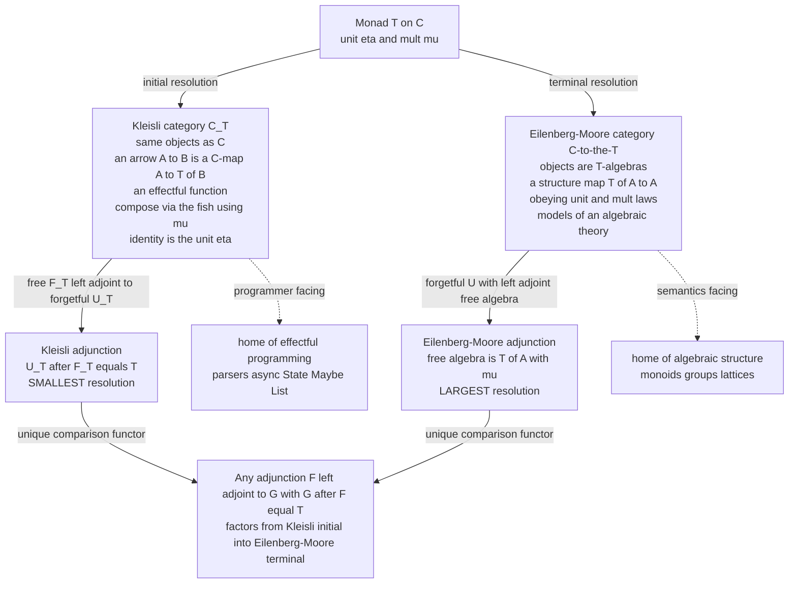

# 🐟 Kleisli Categories and Algebras

> [!abstract] TL;DR
> A single **monad** `(T, η, μ)` on a category `C` gives birth to **two** new categories, and they are the reason monads matter in practice. The **Kleisli category** `C_T` keeps the *same objects* but redefines an arrow `A → B` to be a `C`-morphism `A → T(B)` — an **"effectful function"** — with composition being **Kleisli composition** (the "fish" `>=>`) built from `μ`, and the identity being the monad **unit** `η`. This is the categorical home of *effectful programming*: parser combinators, `async` pipelines, and `Maybe`/`List`/`State` workflows are Kleisli composition. The **Eilenberg–Moore category** `C^T` instead keeps richer objects: a **`T`-algebra** is a carrier `A` with a **structure map** `T(A) → A` obeying unit and multiplication laws. Algebras of the list monad are exactly **monoids**, algebras of the free-group monad are **groups** — a monad *presents an algebraic theory* and its algebras are the *models*. Both categories realize `T` as coming from an **adjunction** `F ⊣ U` with `T = U∘F`: the Kleisli adjunction is the **initial** resolution, the Eilenberg–Moore one the **terminal** resolution, and every other resolution sits between them. Kleisli and Eilenberg–Moore are the two faces of one idea — effectful arrows versus structured models — and together they prove that **monads and adjunctions are the same thing** seen from two directions.

---

## Intuition

**Analogy — a "with-effects" phone line versus a "fully-wired appliance."** A monad `T` hides a *context*: `Maybe` hides possible failure, `List` hides nondeterminism (many possible answers), `State` hides a background store, `IO` hides interaction with the world. Now imagine two very different jobs you can do with that context.

The first job is **programming inside the context**. You do not want to keep manually opening and re-boxing the effect; you want to write functions that *take a plain `A` and return a `B`, but possibly with the effect attached* — a function `A → T(B)`. Chaining a partial computation ("look up the user, then fetch their cart, then compute a total") is exactly stringing such functions together, letting the effect (a failure, a set of possibilities, a state thread) flow through automatically. That world — where an arrow *is* an effectful function and "and then" is built in — is the **Kleisli category**. It is the programmer's category.

The second job is **being a target the context can act on**. Instead of producing effects, a `T`-**algebra** is a structure that knows how to *consume* a whole `T`-worth of values and *collapse* them into one: a map `T(A) → A`. A monoid `(M, ·, e)` is precisely a set that can consume a *list* of its elements and multiply them into a single answer — so monoids are exactly the algebras of the list monad. Groups are the algebras of the free-group monad. This world — where objects are *models of an algebraic theory* — is the **Eilenberg–Moore category**. It is the mathematician's category. One monad, two categories: one to *compute with effects*, one to *interpret them into structure*.

---

## How It Works

### 1. The Kleisli category `C_T` — effectful arrows

Start with a monad `(T, η, μ)` on `C` (recall the categorical definition and the monoid-in-endofunctors slogan from [[Monads_Categorically]]). The **Kleisli category** `C_T` is built as follows.

1. **Objects.** Exactly the objects of `C`. Nothing new.
2. **Morphisms.** A Kleisli morphism `A ⇝ B` is *defined to be* an ordinary `C`-morphism `A → T(B)`. Read it as *"a computation that takes an `A` and produces a `B`, possibly wrapped in the effect `T`."* These are the **Kleisli arrows**, and they are exactly the functions that "return a monadic value."
3. **Identity.** The identity Kleisli arrow on `A` is the monad **unit** `η_A : A → T(A)` — "produce your input, with no extra effect."
4. **Composition (the fish).** Given `f : A → T(B)` and `g : B → T(C)`, their Kleisli composite `g ∘_T f : A → T(C)` is
   `g ∘_T f  =  μ_C ∘ T(g) ∘ f`.
   In words: run `f` to get a `T(B)`; map `g` over it with the functor action to get a `T(T(C))`; then **flatten** with `μ`. This is precisely `bind` / `flatMap`, so Kleisli composition *is* the **fish operator** `>=>` written `g <=< f = λa. bind(f a, g)`.

The two category axioms — associativity of `∘_T` and `η` being a two-sided identity — are **not extra assumptions**; they fall out *exactly* from the three monad laws:

| Kleisli category axiom | Monad law that gives it |
|---|---|
| `η` is a left identity: `f ∘_T η = f` | left unit `μ ∘ Tη = id` |
| `η` is a right identity: `η ∘_T f = f` | right unit `μ ∘ ηT = id` |
| `∘_T` is associative | associativity `μ ∘ Tμ = μ ∘ μT` |

That correspondence is *why* the monad laws are stated the way they are: they are the category axioms for `C_T` in disguise. This is also the applied-programming view — Kleisli composition is what `do`-notation desugars to, and parser combinators, `async` pipelines, and `State`/`Maybe`/`List` workflows all live here ([[Monads_and_Effects]]).

### 2. The Eilenberg–Moore category `C^T` — algebras

The **Eilenberg–Moore category** `C^T` keeps *structured* objects instead of bare ones. A **`T`-algebra** is a pair `(A, a)` where `A` is a `C`-object and `a : T(A) → A` is a **structure map** ("how to interpret / collapse a `T`-worth of `A`s into one `A`") satisfying two coherence laws:

- **Unit law.** `a ∘ η_A = id_A` — injecting a plain value and then interpreting gives it back unchanged.
- **Multiplication (associativity) law.** `a ∘ μ_A = a ∘ T(a)` — a doubly-nested `T(T(A))` can be interpreted either by flattening first (`μ`) or by interpreting the inner layer first (`T(a)`), with the same result.

A morphism of algebras `(A, a) → (B, b)` is a `C`-map `h : A → B` that *respects the structure*: `h ∘ a = b ∘ T(h)`. The prize: **algebras of the list (free-monoid) monad are exactly monoids** — the structure map `T(A) → A` is "fold with the monoid operation," the unit law forces `alg([x]) = x`, and the multiplication law forces associativity of the fold. Likewise, **algebras of the free-group monad are groups**, algebras of the powerset monad are complete join-semilattices, and algebras of the ultrafilter monad are compact Hausdorff spaces. A monad **presents an algebraic theory**, and its Eilenberg–Moore algebras are the **models** (this is the categorical cousin of initial `F`-algebras and folds developed in the forthcoming *F-Algebras and Initial Algebras* sibling).

### 3. Every monad comes from an adjunction — twice

The deep theorem (see the forthcoming *Adjunctions* sibling) is that **every** monad arises from an adjunction `F ⊣ U` as `T = U∘F`, and the resolutions of a fixed `T` form a category with two extremes:

- **Kleisli = INITIAL resolution.** There is a free functor `F_T : C → C_T` and a forgetful `U_T : C_T → C` with `F_T ⊣ U_T` and `U_T ∘ F_T = T`. This is the *smallest* / initial way to factor `T` through an adjunction.
- **Eilenberg–Moore = TERMINAL resolution.** The forgetful functor `U^T : C^T → C` (send `(A, a) ↦ A`) has a left adjoint `F^T` building the **free `T`-algebra** on an object, with `U^T ∘ F^T = T`. This is the *largest* / terminal resolution. The free `T`-algebra on `A` is `(T(A), μ_A)` — which is exactly how "free monoid on a set = list," "free group on a set" arise: monads are the abstract essence of **"free ⊣ forgetful."**

Every resolution `F ⊣ U` inducing `T` factors *uniquely* through both extremes: a comparison functor `C_T → D` from the initial one and `D → C^T` into the terminal one. So `C_T` and `C^T` bracket *all* the ways `T` can be realized — Kleisli at the bottom (effectful arrows), Eilenberg–Moore at the top (semantic models).



### 4. Kleisli versus Eilenberg–Moore, and why both are useful

The **Kleisli** category is *thin and programmer-facing*: its arrows are effectful functions and you almost never leave it when writing monadic code — `bind`-based pipelines implicitly compute in `C_T`. The **Eilenberg–Moore** category is *fat and semantics-facing*: its objects carry structure, so it is where you go to *interpret* effects, to talk about **folds** and **handlers**, and to prove that a monad's models are a known algebraic category (Beck's **monadicity theorem** characterizes exactly when a forgetful functor is "essentially `U^T`"). The two are linked by a comparison functor `C_T → C^T` that sends `A ↦ (T(A), μ_A)` — the free algebra — exhibiting Kleisli as the *full subcategory of free algebras* inside Eilenberg–Moore.

### 5. Why monads do not compose — distributive laws

Because a Kleisli category is built from `μ`, stacking two monads `S` and `T` into one requires knowing how their effects interleave. This is a **distributive law** `λ : T∘S ⇒ S∘T` satisfying four coherence conditions; when it exists, `S∘T` is a monad and you get a combined Kleisli category. When it does **not**, there is *no* canonical composite — which is the categorical explanation for the notorious **monad-transformer** composition problem and a chief motivation for **algebraic effects and handlers** ([[Effect_Systems_and_Program_Analysis]]).

---

## Key Concepts

### Secondary (intuition-level)
- One monad `T` spins off **two** categories: one for **computing with effects** (Kleisli) and one for **structures that absorb the effect** (algebras).
- A **Kleisli arrow** is just "a function that returns a `Maybe`/`List`/`Future`" — an effectful function; the **fish** `>=>` glues two of them so the effect flows through automatically.
- A **`T`-algebra** is a thing that knows how to *fold a whole `T` of values into one value* — a monoid is exactly a set that can fold a *list*.

### Undergraduate (formal core)
- **Kleisli category `C_T`:** same objects as `C`; `Hom_{C_T}(A, B) = Hom_C(A, T(B))`; identity `= η_A`; composition `g ∘_T f = μ ∘ T(g) ∘ f = bind(f, g)`. Its three axioms are the three monad laws.
- **`T`-algebra:** `(A, a : T(A) → A)` with `a ∘ η = id` and `a ∘ μ = a ∘ T(a)`; algebra maps commute with structure maps; these form `C^T`.
- **List monad ⇒ monoids:** `alg([x]) = x` (unit) and `alg(concat(xss)) = alg([alg(xs) …])` (associativity) is exactly a monoid fold; free-group monad ⇒ groups.
- **Two adjunctions:** `F_T ⊣ U_T` (Kleisli) and `F^T ⊣ U^T` (Eilenberg–Moore) both give `U∘F = T`; free `T`-algebra on `A` is `(T(A), μ_A)`.

### Graduate (structural / research-level)
- **Universal resolutions:** the category `Res(T)` of adjunctions inducing `T` has Kleisli **initial** and Eilenberg–Moore **terminal** ([[Universal_Properties]], [[Terminal_Initial_and_Zero_Objects]]); comparison functors are the unique mediating maps.
- **Kleisli as free algebras:** the comparison `C_T ↪ C^T`, `A ↦ (T(A), μ_A)`, is fully faithful with image the free algebras; `C_T ≃` full subcategory of `C^T`.
- **Monadicity (Beck):** precise conditions under which `U : D → C` is equivalent to some `U^T` — i.e. `D ≃ C^T`; this is how one *proves* "groups/rings/etc. are monadic over Set."
- **Finitary monads on Set ≃ Lawvere theories:** algebras = models of the theory; monads *present* equational algebraic theories.
- **Distributive laws & composition:** `λ : TS ⇒ ST` for composing monads; the categorical account of monad-transformer stacking and its failure modes; strong monads, enriched Kleisli categories, and Freyd categories for effect semantics ([[Denotational_Semantics]]).

---

## Python Demo

We construct the **Kleisli category** of a monad, **program in it**, and **verify it is a category**; then we build a **`T`-algebra** and check the algebra laws. We use two monads — **Maybe** (partiality) and **List** (nondeterminism) — define **Kleisli arrows** `A → T(B)`, implement **Kleisli composition** (the fish, via `bind`), and check **associativity** and that the **unit `η` is the identity** Kleisli arrow. We then chain a pipeline of **partial functions** and a set of **nondeterministic transitions**, showing clean composition. Finally we exhibit a **list-algebra** (`sum` and string-concatenation, i.e. a monoid fold) and verify the two algebra laws, contrasting it with a map that *fails* them. A three-panel matplotlib figure visualizes Kleisli branching, the algebra fold, and the algebra-law diagrams. Pure standard library plus matplotlib.

```python
"""
The KLEISLI CATEGORY of a monad, and an EILENBERG-MOORE ALGEBRA, in pure Python.

A monad T (here Maybe and List) provides fmap / eta / mu / bind. From it:

  KLEISLI ARROW       f : A -> T(B)                       "an effectful function"
  KLEISLI COMPOSITION (g <=< f)(a) = bind(f(a), g)        the FISH operator >=>
  IDENTITY            eta : A -> T(A)                      the monad UNIT

These form a CATEGORY C_T:  the fish is associative and eta is a two-sided unit.

A T-ALGEBRA is a carrier A with a STRUCTURE MAP  alg : T(A) -> A  obeying
  unit law :  alg(eta(a)) == a
  mult law :  alg(mu(tta)) == alg(fmap(alg, tta))
List-algebras are exactly MONOIDS (alg = fold with the monoid operation).
"""
import math
import random
import matplotlib.pyplot as plt
import matplotlib.patches as mpatches

# ===========================================================================
# 1. Two monads as (fmap, eta, mu, bind).  Maybe: None = Nothing, (x,) = Just x.
# ===========================================================================
# ---- Maybe monad ----
def mb_fmap(f, m): return None if m is None else (f(m[0]),)
def mb_eta(x):     return (x,)
def mb_mu(mm):     return None if mm is None else mm[0]     # flatten Maybe(Maybe A)
def mb_bind(m, f): return None if m is None else f(m[0])    # mu . fmap f

# ---- List monad ----
def li_fmap(f, xs): return [f(x) for x in xs]
def li_eta(x):      return [x]
def li_mu(xss):     return [x for xs in xss for x in xs]    # concat
def li_bind(m, f):  return [y for x in m for y in f(x)]     # mu . fmap f

# ===========================================================================
# 2. KLEISLI COMPOSITION (the fish) is defined purely from bind.
#    Given the monad's bind, compose(g, f) is the Kleisli arrow  g <=< f.
# ===========================================================================
def make_fish(bind):
    def fish(g, f):                      # (g <=< f) : A -> T(C)
        return lambda a: bind(f(a), g)
    return fish

mb_fish = make_fish(mb_bind)
li_fish = make_fish(li_bind)

# ===========================================================================
# 3. VERIFY C_T IS A CATEGORY: eta is the identity, fish is associative.
# ===========================================================================
def check_kleisli_category(name, eta, fish, arrows, inputs):
    f, g, h = arrows
    # identity:  eta <=< f == f   and   f <=< eta == f
    left_id  = all(fish(f, eta)(a) == f(a) for a in inputs)     # f after eta
    right_id = all(fish(eta, f)(a) == f(a) for a in inputs)     # eta after f
    # associativity:  (h <=< g) <=< f  ==  h <=< (g <=< f)
    lhs = fish(fish(h, g), f)
    rhs = fish(h, fish(g, f))
    assoc = all(lhs(a) == rhs(a) for a in inputs)
    print(f"== Kleisli category of {name} ==")
    print(f"  eta is left  identity  (eta <=< f == f) : {left_id}")
    print(f"  eta is right identity  (f <=< eta == f) : {right_id}")
    print(f"  fish is associative                     : {assoc}")
    return left_id and right_id and assoc

# Maybe Kleisli arrows  A -> Maybe B
mb_f = lambda x: (x + 1,)
mb_g = lambda x: None if x % 4 == 0 else (x * 2,)
mb_h = lambda x: (str(x),)
check_kleisli_category("Maybe", mb_eta, mb_fish,
                       (mb_f, mb_g, mb_h), inputs=list(range(20)))

# List Kleisli arrows  A -> List B
li_f = lambda x: [x, -x]
li_g = lambda x: [x, x + 1] if x >= 0 else []
li_h = lambda x: [x * 10]
check_kleisli_category("List", li_eta, li_fish,
                       (li_f, li_g, li_h), inputs=list(range(6)))

# ===========================================================================
# 4. PROGRAM IN THE KLEISLI CATEGORY.
#    (a) Maybe: a pipeline of PARTIAL functions composed with the fish.
# ===========================================================================
def parse_pos(s):    # str -> Maybe int   (fails on non-int or non-positive)
    try:
        n = int(s)
    except ValueError:
        return None
    return (n,) if n > 0 else None
def recip(n):        # int -> Maybe float  (fails on 0, already excluded)
    return (1.0 / n,)
def to_pct(x):       # float -> Maybe str
    return (f"{100 * x:.2f}%",)

pipeline = mb_fish(to_pct, mb_fish(recip, parse_pos))   # str -> Maybe str
print("\n== Maybe Kleisli pipeline  parse_pos >=> recip >=> to_pct ==")
for s in ["4", "0", "-3", "banana", "8"]:
    print(f"  {s!r:>8}  ->  {pipeline(s)}")

# (b) List: nondeterministic TRANSITIONS composed with the fish.
graph = {"A": ["B", "C"], "B": ["C", "D"], "C": ["D"], "D": ["A"]}
step = lambda s: graph[s]                       # State -> List State  (Kleisli arrow)
two_steps   = li_fish(step, step)               # reachable in exactly 2 hops
three_steps = li_fish(step, two_steps)
print("\n== List Kleisli transitions (nondeterminism) ==")
print(f"  1 hop from A : {step('A')}")
print(f"  2 hops from A: {two_steps('A')}")
print(f"  3 hops from A: {three_steps('A')}")

# ===========================================================================
# 5. EILENBERG-MOORE: a T-ALGEBRA is a structure map  alg : T(A) -> A.
#    List-algebras are MONOIDS.  Verify the two algebra laws.
# ===========================================================================
def check_list_algebra(name, alg, samples_A, samples_TTA):
    # unit law:  alg(eta(a)) == a        i.e.  alg([a]) == a
    unit_ok = all(alg(li_eta(a)) == a for a in samples_A)
    # mult law:  alg(mu(tta)) == alg(fmap(alg, tta))
    mult_ok = all(alg(li_mu(tta)) == alg(li_fmap(alg, tta)) for tta in samples_TTA)
    print(f"  {name:<24} unit_law={unit_ok}   mult_law={mult_ok}")
    return unit_ok and mult_ok

random.seed(1)
As   = [random.randint(0, 9) for _ in range(50)]
TTAs = [[[random.randint(0, 9) for _ in range(random.randint(0, 3))]
         for _ in range(random.randint(0, 3))] for _ in range(50)]

print("\n== List-algebras are monoids: verifying alg : T(A) -> A ==")
check_list_algebra("sum  (int, +, 0)",      sum,                     As, TTAs)   # valid
check_list_algebra("product (int, *, 1)",   lambda xs: math.prod(xs), As, TTAs)  # valid
# string monoid under concatenation
strAs   = [chr(97 + random.randint(0, 5)) for _ in range(50)]
strTTAs = [[[chr(97 + random.randint(0, 5)) for _ in range(random.randint(0, 3))]
            for _ in range(random.randint(0, 3))] for _ in range(50)]
check_list_algebra('"".join (free monoid)', lambda xs: "".join(xs), strAs, strTTAs)
# a NON-algebra: len fails the unit law  (len([a]) == 1 != a)
print("  ---- a map that is NOT a T-algebra ----")
check_list_algebra("len  (breaks unit)",    len,                     As, TTAs)

# ===========================================================================
# 6. VISUALIZE: (A) Kleisli fish branching, (B) the algebra fold,
#               (C) the two T-algebra laws as commuting diagrams.
# ===========================================================================
fig, axes = plt.subplots(1, 3, figsize=(19, 6.2))

# ---- Panel A: Kleisli composition g <=< f as nondeterministic branching -----
ax = axes[0]; ax.axis("off")
ax.set_title("Kleisli fish  g <=< f  (chain effectful steps)", fontweight="bold")
def box(ax, x, y, txt, fc="#dfe9f7", ec="#2c3e6b"):
    ax.add_patch(mpatches.FancyBboxPatch((x - 0.05, y - 0.045), 0.10, 0.09,
                 boxstyle="round,pad=0.01", fc=fc, ec=ec, lw=1.6, zorder=3))
    ax.text(x, y, txt, ha="center", va="center", fontweight="bold", zorder=4)
def arrow(ax, p, q, color="#33475b"):
    ax.add_patch(mpatches.FancyArrowPatch(p, q, arrowstyle="-|>", mutation_scale=13,
                 shrinkA=10, shrinkB=10, color=color, lw=1.5, zorder=2))
# f : a -> [b1, b2] ; g : b -> list
gC = {"b1": ["c1", "c2"], "b2": ["c3"]}
box(ax, 0.10, 0.5, "a", fc="#f7e6cf", ec="#a9691f")
ys_b = {"b1": 0.72, "b2": 0.28}
for b, yb in ys_b.items():
    box(ax, 0.45, yb, b, fc="#9ec1e6")
    arrow(ax, (0.10, 0.5), (0.45, yb), color="#c0392b")
yc = {"c1": 0.85, "c2": 0.62, "c3": 0.28}
for b, cs in gC.items():
    for c in cs:
        box(ax, 0.83, yc[c], c, fc="#bfe6c4", ec="#1f8a4c")
        arrow(ax, (0.45, ys_b[b]), (0.83, yc[c]), color="#1f8a4c")
ax.text(0.10, 0.62, "A", ha="center", color="#a9691f", fontweight="bold")
ax.text(0.275, 0.93, "f : A -> T(B)", ha="center", color="#c0392b", fontweight="bold")
ax.text(0.64, 0.97, "g : B -> T(C)", ha="center", color="#1f8a4c", fontweight="bold")
ax.text(0.47, 0.06, "bind flattens T(T(C)) into one T(C)  =  g <=< f",
        ha="center", fontsize=9, color="#2c3e6b", style="italic")
ax.set_xlim(0, 1); ax.set_ylim(0, 1)

# ---- Panel B: the algebra structure map alg : T(A) -> A (a fold) ------------
ax = axes[1]; ax.axis("off")
ax.set_title("T-algebra  alg : T(A) -> A   (here alg = sum)", fontweight="bold")
lst = [2, 5, 1, 3]
ax.add_patch(mpatches.FancyBboxPatch((0.12, 0.62), 0.76, 0.20,
             boxstyle="round,pad=0.01", fc="#dfe9f7", ec="#2c3e6b", lw=2))
for j, v in enumerate(lst):
    ax.text(0.22 + j * 0.18, 0.72, str(v), ha="center", va="center",
            fontweight="bold", fontsize=13)
ax.text(0.5, 0.90, "T(A)  =  a list of A", ha="center", fontweight="bold",
        color="#2c3e6b")
ax.annotate("", xy=(0.5, 0.32), xytext=(0.5, 0.58),
            arrowprops=dict(arrowstyle="-|>", lw=2.6, color="#c0392b"))
ax.text(0.57, 0.45, "alg = fold with (+, 0)", color="#c0392b", fontweight="bold")
ax.add_patch(mpatches.Circle((0.5, 0.20), 0.075, fc="#bfe6c4", ec="#1f8a4c", lw=2))
ax.text(0.5, 0.20, str(sum(lst)), ha="center", va="center", fontweight="bold",
        fontsize=15, color="#1f8a4c")
ax.text(0.5, 0.05, "A  =  a single value   (a monoid absorbs the whole list)",
        ha="center", fontweight="bold", color="#2c3e6b")
ax.set_xlim(0, 1); ax.set_ylim(0, 1)

# ---- Panel C: the two algebra laws as commuting diagrams -------------------
ax = axes[2]; ax.axis("off")
ax.set_title("Algebra laws:  alg.eta == id   and   alg.mu == alg.T(alg)",
             fontweight="bold")
def node(ax, pos, txt, ec="#2c3e6b"):
    ax.text(*pos, txt, ha="center", va="center", fontsize=10,
            bbox=dict(boxstyle="round,pad=0.32", fc="#eef3fb", ec=ec, lw=1.5))
def darr(ax, pa, pb, lab, dx=0, dy=0, color="#33475b", dashed=False):
    ax.add_patch(mpatches.FancyArrowPatch(pa, pb, arrowstyle="-|>", mutation_scale=15,
                 shrinkA=20, shrinkB=20, color=color, lw=1.6,
                 linestyle="--" if dashed else "-"))
    ax.text((pa[0]+pb[0])/2+dx, (pa[1]+pb[1])/2+dy, lab, ha="center", va="center",
            fontsize=9, color=color, style="italic")
# unit triangle (top half):  A --eta--> T(A) --alg--> A ,  diagonal = id
pA, pTA, pA2 = (0.14, 0.90), (0.60, 0.90), (0.60, 0.62)
node(ax, pA, "A", ec="#1f8a4c"); node(ax, pTA, "T(A)"); node(ax, pA2, "A", ec="#1f8a4c")
darr(ax, pA, pTA, "eta", dy=0.04)
darr(ax, pTA, pA2, "alg", dx=0.07)
darr(ax, pA, pA2, "id", dx=-0.02, dy=-0.02, color="#1f8a4c", dashed=True)
# mult square (bottom half): T(T(A)) --mu--> T(A) ; --T(alg)--> T(A) --alg--> A
q11, q12 = (0.14, 0.40), (0.60, 0.40)
q21, q22 = (0.14, 0.12), (0.60, 0.12)
node(ax, q11, "T(T(A))"); node(ax, q12, "T(A)")
node(ax, q21, "T(A)"); node(ax, q22, "A", ec="#1f8a4c")
darr(ax, q11, q12, "mu", dy=0.04)
darr(ax, q11, q21, "T(alg)", dx=-0.09)
darr(ax, q12, q22, "alg", dx=0.06)
darr(ax, q21, q22, "alg", dy=-0.04)
ax.set_xlim(0, 1); ax.set_ylim(0, 1)

fig.suptitle("One monad, two categories: Kleisli (effectful arrows) and "
             "Eilenberg-Moore (algebras)", fontsize=15, fontweight="bold")
fig.tight_layout(rect=[0, 0, 1, 0.94])
plt.show()   # or: fig.savefig("kleisli_and_algebras.png", dpi=120)
```

**What the run shows.** For both the Maybe and List monads, the Kleisli axioms print `True`: the unit `η` is a two-sided identity for the fish and the fish is associative — i.e. `C_T` really is a category, *proved* from the monad laws. The Maybe pipeline `parse_pos >=> recip >=> to_pct` composes three partial functions so that any failure short-circuits (`"0"`, `"-3"`, `"banana"` yield `None`) while valid input flows through — clean effectful composition with no manual unwrapping. The List transitions show nondeterministic reachability computed by fishing `step` with itself. On the algebra side, `sum`, `product`, and string `join` each satisfy both algebra laws (they are genuine list-algebras = monoids), while `len` fails the unit law (`len([a]) = 1 ≠ a`), confirming it is *not* a `T`-algebra. The figure renders Kleisli composition as branching effect flow, the algebra structure map as a fold collapsing a list to one value, and the two algebra laws as the commuting unit triangle and multiplication square.

---

## Real-World Applications

> **Haskell's `Control.Monad` fish `>=>` and `Kleisli` newtype.** The operator `(>=>) :: (a -> m b) -> (b -> m c) -> a -> m c` is literally Kleisli composition, and `Control.Arrow`'s `Kleisli m` wraps `a -> m b` so that effectful functions become first-class arrows you can compose, fan out, and pipe. Every `do`-block is sugar for a chain of Kleisli arrows glued by `>=>`/`>>=`. This is the Kleisli category of the note surfaced as a standard-library type.

- **Parser combinators (Parsec, megaparsec, nom).** A parser `String → m (a, String)` is a Kleisli arrow of a `State`+`Maybe`/`List` monad; `p >>= q` sequences "parse this, then, depending on the result, parse that." The *context-sensitivity* a bare functor cannot express but a monad can is exactly what Kleisli composition buys.
- **Async / effect pipelines.** `Promise.then` (JS), `Future.flatMap` (Scala), `Task`/`IO` chains, and Rust's `and_then` on `Result`/`Option`/futures are Kleisli composition; `await` desugars to `bind`. A chain of asynchronous, fallible steps *is* a Kleisli pipeline.
- **Scala Cats / ZIO.** `Kleisli[F, A, B]` is a named type; `Monad[F].flatMap` is `bind`, `for`-comprehensions compose Kleisli arrows, and law-checked instances guarantee the category axioms hold ([[Cats_and_ZIO_Overview]]).
- **Eilenberg–Moore as interpreters and folds.** A `T`-algebra `T(A) → A` is exactly a **fold / interpreter**: the free-monad-plus-algebra pattern separates an effect's *syntax* (a free monad) from its *interpretation* (an algebra / handler), the basis of tagless-final and **algebraic effects and handlers** ([[Effect_Systems_and_Program_Analysis]]).
- **Monadicity in universal algebra.** Beck's monadicity theorem *proves* that groups, rings, modules, and compact Hausdorff spaces are Eilenberg–Moore algebras over `Set` (or `Top`), giving a uniform "free ⊣ forgetful" account of dozens of algebraic categories.

---

## Common Pitfalls

- **Reversing the fish.** `g <=< f` means "`f` first, then `g`" (data flows right-to-left in the symbol, like ordinary composition `g ∘ f`), but the left-to-right `f >=> g` flips it. Mixing the two silently reorders effects. Pick one convention and state the types.
- **Thinking Kleisli objects are `T(A)`.** In `C_T` the objects are the *plain* objects of `C`; the `T` lives only in the *hom-sets* (`Hom(A, B) = C(A, T(B))`). Newcomers wrongly picture objects as `T(A)` and get the composition types wrong.
- **Forgetting `η` is the identity.** The identity Kleisli arrow is `η`, *not* the plain `id_A` — `id_A : A → A` is not even a Kleisli arrow (its codomain must be `T(A)`). The right-unit monad law is precisely what makes `η` behave as an identity.
- **Building an "algebra" that violates a law.** A structure map `T(A) → A` must satisfy *both* the unit law (`alg ∘ η = id`) and the multiplication law (`alg ∘ μ = alg ∘ T(alg)`). Ad-hoc collapses like `length` or "take the first element" break one of them and are *not* `T`-algebras — the demo's `len` case shows this.
- **Confusing `T`-algebras with `F`-algebras.** An **`F`-algebra** (for a plain endofunctor `F`) is a map `F(A) → A` with *no* laws, and its *initial* one powers folds/catamorphisms. A **`T`-algebra** (for a *monad*) additionally obeys unit and multiplication laws. They are related but distinct; see the forthcoming *F-Algebras and Initial Algebras* sibling.
- **Expecting monads to compose freely.** There is no generic composite of two monads, so you cannot always merge two Kleisli categories. Composition needs a **distributive law**; its frequent absence is why monad *transformers* and algebraic effects exist.
- **Assuming Kleisli = Eilenberg–Moore.** Kleisli is only the **free algebras** sitting inside Eilenberg–Moore, not the whole thing. Reasoning about *all* models (arbitrary algebras) requires the full `C^T`; staying in `C_T` sees only the free ones.

---

## Related Concepts

- [[Monads_Categorically]] — supplies `(T, η, μ)` and the monad laws; this note builds the two categories those laws generate and shows the laws *are* the Kleisli category axioms.
- [[Functors]] — Kleisli composition uses the functor action `T(g)` inside `μ ∘ T(g) ∘ f`; the free and forgetful maps between `C`, `C_T`, `C^T` are functors.
- [[Natural_Transformations]] — `η` (the Kleisli identity) and `μ` (used in the fish) are natural transformations; algebra structure maps interact with them via the coherence laws.
- [[Universal_Properties]] — Kleisli is the **initial** resolution of `T` and Eilenberg–Moore the **terminal** one; both are universal constructions.
- [[Terminal_Initial_and_Zero_Objects]] — makes precise "initial resolution" (Kleisli) versus "terminal resolution" (Eilenberg–Moore) in the category of adjunctions inducing `T`.
- [[Diagrams_and_Commutativity]] — the algebra unit triangle and multiplication square, and the Kleisli associativity, are commuting diagrams.
- [[Monads_and_Effects]] — the applied PLT face: `return`/`bind`, `do`-notation, and transformers are Kleisli composition; this note is its categorical skeleton.
- [[Effect_Systems_and_Program_Analysis]] — algebraic effects and handlers descend from Eilenberg–Moore algebras (handlers as algebras) and from the distributive-law account of monad composition.
- [[Denotational_Semantics]] — Moggi's Kleisli category is the category of *effectful maps* giving side effects a uniform meaning; algebras are the semantic models.
- [[Functional_Programming_Foundations]] — where `flatMap`/`>>=` pipelines, the practical face of Kleisli composition, are used day to day.
- [[Cats_and_ZIO_Overview]] — Scala's explicit `Kleisli[F, A, B]` type and law-checked `Monad[F]` instances realize `C_T` in production code.

*Forthcoming Category_Theory siblings referenced in prose (to be linked once written):* **Adjunctions** (every monad is `U∘F`; Kleisli/Eilenberg–Moore as its two universal resolutions), **F-Algebras and Initial Algebras** (lawless `F(A) → A`, folds, and how `T`-algebras differ), and **Category Theory in Programming** (the Haskell/Scala rendering of Kleisli arrows and the fish).

---

## Review Questions

1. **(Conceptual)** Define the Kleisli category `C_T` of a monad `(T, η, μ)`: its objects, its hom-sets, its identities, and its composition. Then prove that the three category axioms (left identity, right identity, associativity of the fish) follow *exactly* from the three monad laws. Which monad law gives which axiom?

2. **(Scenario)** You are told that algebras of the list (free-monoid) monad are exactly monoids. (a) Given a monoid `(M, ·, e)`, write down the structure map `alg : List(M) → M` and check it satisfies the unit law `alg ∘ η = id` and the multiplication law `alg ∘ μ = alg ∘ T(alg)`. (b) Conversely, given any list-algebra `alg : List(M) → M`, recover the binary operation and unit and argue associativity and unit laws hold. (c) Explain why `length : List(ℤ) → ℤ` is *not* a `ℤ`-algebra of the list monad.

3. **(Trade-off / structural)** Every monad `T` arises from an adjunction, and the resolutions of `T` form a category with the **Kleisli** category as the *initial* object and the **Eilenberg–Moore** category as the *terminal* object. (a) Describe the free/forgetful adjunction in each case and confirm both give `U∘F = T`. (b) What is the comparison functor `C_T → C^T`, and why does it identify Kleisli with the *free* `T`-algebras? (c) When you write ordinary `bind`-based effectful code, which category are you implicitly working in, and what extra power would you gain by moving to arbitrary Eilenberg–Moore algebras (think: interpreters and handlers)?

---

## Sources

- [Mac Lane, S., *Categories for the Working Mathematician* (2nd ed., 1998), Ch. VI](https://link.springer.com/book/10.1007/978-1-4757-4721-8) — monads, Kleisli and Eilenberg–Moore categories, algebras, and the two resolutions.
- [Riehl, E., *Category Theory in Context* (2016), Ch. 5](https://math.jhu.edu/~eriehl/context.pdf) — free modern account of Kleisli, Eilenberg–Moore, adjunctions, and monadicity.
- [Moggi, E., "Notions of Computation and Monads", *Information and Computation* 93(1), 1991](https://www.sciencedirect.com/science/article/pii/0890540191900524) — the Kleisli category as the category of effectful maps; effects as monads.
- [nLab, "Kleisli category"](https://ncatlab.org/nlab/show/Kleisli+category) and [nLab, "Eilenberg–Moore category"](https://ncatlab.org/nlab/show/Eilenberg-Moore+category) — reference articles: definitions, the initial/terminal resolutions, and comparison functors.
- [Awodey, S., *Category Theory* (2nd ed., 2010), Ch. 10](https://global.oup.com/academic/product/category-theory-9780199237180) — adjunctions, monads, algebras, and the free/forgetful perspective.

---

#category-theory #kleisli-category #eilenberg-moore #monad-algebras #effectful-composition
