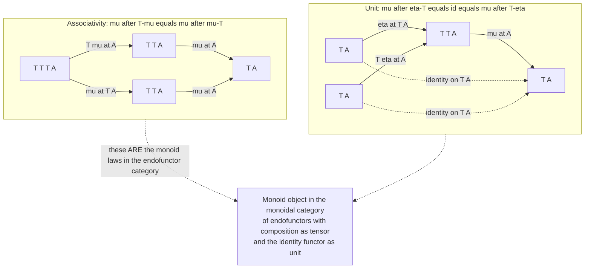

# ♾️ Monads Categorically

> [!abstract] TL;DR
> A **monad** on a category `C` is an **endofunctor** `T : C → C` bundled with two **natural transformations** — a **unit** `η : Id ⇒ T` (put a plain value into the context) and a **multiplication** `μ : T∘T ⇒ T` (flatten a doubly-wrapped context into one) — subject to two coherence laws: **associativity** `μ ∘ Tμ = μ ∘ μT` and the **unit laws** `μ ∘ Tη = id_T = μ ∘ ηT`. Stare at those laws and you are looking at the axioms of a **monoid** — `μ` is the multiply, `η` is the identity element — except the "elements" are functors and the "multiplication" is functor *composition*. That is the famous slogan made literally true: **a monad is a monoid in the category of endofunctors** `[C, C]`, which is monoidal under `∘`. This one compact structure is where category theory, universal algebra, the denotational semantics of side effects, and functional programming all meet: the categorical `(T, η, μ)` is *exactly equivalent* to the programmer's `return`/`bind` (`bind f = μ ∘ T(f)`), so `join + return` in Haskell and `flatMap + pure` in Scala are the same thing that a mathematician calls a monad. Every monad also arises from an **adjunction**, and its dual — flip the arrows — is a **comonad** modelling context-dependent computation.

---

## Intuition

**Analogy — nesting boxes, and one rule for un-nesting them.** Imagine a shipping company with exactly one kind of box, `T`. You can do two elementary things with these boxes and *nothing else*. First, given any loose item `x`, there is a standard way to **put it in a box**: `η(x)` is "the item, boxed" — this is the unit. Second, if you ever end up holding a **box that contains boxes** — a pallet of boxes, `T(T(x))` — there is a standard way to **collapse it into a single box** of items: `μ` is the "un-nest," "flatten," or "consolidate" operation. A monad is just this pair of moves together with the obvious sanity conditions: (1) it does not matter *which order* you consolidate three layers of nesting — flatten the inner pallets first or the outer ones first, you get the same single box (**associativity**); and (2) boxing an already-boxed thing and then flattening gets you back exactly where you started, whether you added the extra box on the *inside* or the *outside* (**unit laws**).

Now translate the analogy into its technical home and something surprising happens. The "box" `T` is not a container of data but an **endofunctor** — a structure-preserving self-map of a whole category. "Put in a box" and "flatten" are not ad-hoc functions but **natural transformations** — uniform families that never inspect the contents, only the shape ([[Natural_Transformations]]). And the two sanity conditions — *flattening is associative, boxing is a two-sided unit for it* — are precisely the axioms of a **monoid**, only lifted from a set of elements to the category of endofunctors, with functor composition `∘` playing the role of "multiply." The category theorist's joke, *"a monad is just a monoid in the category of endofunctors, what's the problem?"*, is not a joke: it is the definition, read out loud.

---

## How It Works

### The categorical definition

Fix a category `C`. A **monad** on `C` is a triple `(T, η, μ)` where:

1. **`T : C → C` is an endofunctor** — a functor from `C` to *itself* ([[Functors]]). It assigns to each object `A` an object `T(A)` and to each morphism `f : A → B` a morphism `T(f) : T(A) → T(B)`, preserving identities and composition. Think `T = List`, `T = Maybe`, `T = Powerset`, `T = State`.

2. **`η : Id ⇒ T` is the unit** — a natural transformation from the identity functor to `T`. Its component `η_A : A → T(A)` injects an object into the `T`-context "trivially." Programmers call it `return` or `pure`.

3. **`μ : T∘T ⇒ T` is the multiplication** — a natural transformation from `T` composed with itself to `T`. Its component `μ_A : T(T(A)) → T(A)` **flattens** one layer of nesting. Programmers call it `join` or `flatten`.

These data must make two families of **coherence diagrams** commute ([[Diagrams_and_Commutativity]]):

- **Associativity.** `μ ∘ Tμ = μ ∘ μT` as natural transformations `T³ ⇒ T`. Given three layers of nesting, collapsing the inner two first (`Tμ`, then `μ`) equals collapsing the outer two first (`μT`, then `μ`).
- **Left and right unit.** `μ ∘ ηT = id_T = μ ∘ Tη` as natural transformations `T ⇒ T`. Wrapping a `T`-value in one *more* layer — either from the outside (`ηT`) or the inside (`Tη`) — and then flattening returns the original value untouched.

Here `Tμ`, `μT`, `Tη`, `ηT` are **whiskerings**: `Tμ` means "apply `T`'s morphism-map to `μ`'s components" (`T(μ_A)`), while `μT` means "take `μ`'s component at the object `T(A)`" (`μ_{T(A)}`). The distinction between "act with `T` on the inside" versus "instantiate at `T` on the outside" is the entire subtlety, and it is exactly the difference that the associativity square reconciles.

### The slogan made precise: a monoid in the endofunctor category

Why call this a *monad* and why is it a *monoid*? Because the definition above is nothing but a **monoid object** transplanted into a new setting. Recall a monoid `(M, ·, e)` in `Set` is a set with an associative binary operation `· : M × M → M` and a two-sided unit `e : 1 → M`. Abstract that: a **monoid object in a monoidal category** `(V, ⊗, I)` is an object `M` with a multiply `m : M ⊗ M → M` and a unit `u : I → M` satisfying associativity and unit laws drawn with `⊗`.

Now take the **functor category** `[C, C]` — objects are endofunctors of `C`, morphisms are natural transformations between them ([[Functor_Categories_and_Naturality]]). This category is **monoidal** with a twist: the tensor product is **functor composition** `∘`, and the unit object is the **identity functor** `Id`. A monoid object in `([C, C], ∘, Id)` is therefore an endofunctor `T` equipped with:

- a multiply `μ : T ⊗ T = T∘T ⇒ T`, and
- a unit `η : I = Id ⇒ T`,

satisfying the monoidal associativity and unit laws. Compare that to the previous section: **it is character-for-character the definition of a monad.** The monad's `μ` is the monoid's multiply; the monad's `η` is the monoid's unit; the monad laws *are* the monoid laws. The one genuinely tricky point — why the composition tensor is only *weakly* associative and why `Tμ` versus `μT` matters — is exactly why the slogan feels mysterious, but the payoff is that dozens of computational patterns collapse into a single algebraic idea.

### The coherence diagrams



### The bridge to programming: `(T, η, μ)` equals `return`/`bind`

The categorical form and the Haskell/Scala form are **two presentations of one structure** (a *Kleisli triple*), inter-derivable:

- From categorical to programming: define **`return = η`** and **`bind(m, f) = μ ∘ T(f)` applied to `m`**, i.e. `bind(m, f) = μ_B(T(f)(m))`. In words: map `f : A → T(B)` over the value `m : T(A)` using the functor action `T(f)`, producing a *doubly-wrapped* `T(T(B))`, then **flatten** it with `μ`. This is precisely `flatMap` / `>>=`.
- From programming to categorical: recover **`T(f) = bind(-, return ∘ f)`** on morphisms and **`μ = join = bind(-, id)`** (flatten by binding with the identity continuation).

Under this dictionary the three **programming monad laws** correspond *exactly* to the categorical laws:

| Programming law | Categorical law |
|---|---|
| Left identity: `bind(return a, f) = f a` | right-unit whisker `μ ∘ ηT = id` |
| Right identity: `bind(m, return) = m` | left-unit whisker `μ ∘ Tη = id` |
| Associativity: `bind(bind(m,f),g) = bind(m, x → bind(f x, g))` | `μ ∘ Tμ = μ ∘ μT` |

This is what makes rigorous the slogan that `bind` is a **"programmable semicolon"**: the associativity law is *why* you may reassociate a chain of effectful statements, and the unit laws are *why* `return` is a genuine "do nothing." The applied-programming perspective, with `do`-notation, transformers, and effect systems, lives in [[Monads_and_Effects]]; the note you are reading supplies its categorical skeleton.

### Where monads come from: adjunctions

Monads are not exotic — **every adjunction generates one, and every monad is generated by an adjunction.** Given an adjunction `F ⊣ G` with `F : C → D`, `G : D → C`, unit `η : Id_C ⇒ G∘F` and counit `ε : F∘G ⇒ Id_D`, set:

- `T = G∘F` (an endofunctor on `C`),
- monad unit = the adjunction unit `η`,
- monad multiplication `μ = G ε F` (whisker the counit between `G` and `F`).

The triangle identities of the adjunction become exactly the monad's coherence laws. A monad thus **packages the round-trip** `C → D → C` of an adjoint pair, remembering only what happens back home in `C`. The converse is the deep theorem: **every** monad `(T, η, μ)` arises from *some* adjunction, and the adjunctions inducing a fixed `T` form a category with two extremes — the **Kleisli category** (the *initial* resolution, morphisms `A → T(B)`) and the **Eilenberg–Moore category** of `T`-algebras (the *terminal* resolution, objects `T(A) → A` that "interpret" the effect). These universal endpoints ([[Universal_Properties]]) are developed in the forthcoming *Kleisli Categories and Algebras* sibling; the adjunction machinery in the forthcoming *Adjunctions* sibling.

### A gallery of monads

Each is an endofunctor with its own `join`/`return`:

- **List / free-monoid monad.** `T(A) = ` finite lists of `A`; `η(a) = [a]`; `μ = concat`. This is the *free monoid* functor — models nondeterminism and is the engine behind list comprehensions.
- **Maybe / partiality monad.** `T(A) = A + 1`; `η(a) = Just a`; `μ` collapses `Just (Just a) ↦ Just a`, anything with a `Nothing ↦ Nothing`. Models failure.
- **Powerset monad.** `T(A) = 𝒫(A)`; `η(a) = {a}`; `μ = ⋃` (union of a set of sets). Nondeterminism in `Set`; its Eilenberg–Moore algebras are complete join-semilattices.
- **State monad.** `T(A) = (S → A × S)`; threads a store `S`. Models mutable state purely.
- **Free monad on a functor `F`.** `T(A) = ` the initial `F`-algebra of "syntax trees of operations over `A`" — turns any signature of effect operations into a monad; the basis of embedded effect DSLs.
- **Continuation / double-dual monad.** `T(A) = (A → R) → R`. Models control flow (early exit, coroutines); the algebraic shadow of double negation.
- **Ultrafilter monad.** `T(A) = ` set of ultrafilters on `A`; its Eilenberg–Moore algebras are exactly **compact Hausdorff spaces** — a monad from *topology*, proof that the concept reaches far beyond computer science.

### Monads as models of theories, and comonads as the dual

**Moggi's insight (1989–91)** was that a monad `T` on a suitable category is a **notion of computation**: a value of "computation type `A`" denotes an element of `T(A)`, and different monads capture different *side effects* — partiality, exceptions, state, nondeterminism, I/O, probability. This gave denotational semantics a *uniform* account of effects ([[Denotational_Semantics]]). In parallel, **Lawvere theories** and **finitary monads** on `Set` are two equivalent ways to *present an algebraic structure by operations and equations*; the Eilenberg–Moore algebras of the monad are the models of the theory. The modern **algebraic-effects-and-handlers** movement is the direct descendant, separating an effect's *operations* from its *interpretation* ([[Effect_Systems_and_Program_Analysis]]).

Flip every arrow and you get the **dual** notion. A **comonad** `(W, ε, δ)` is an endofunctor with a **counit** `ε : W ⇒ Id` (*extract* a value from a context) and a **comultiplication** `δ : W ⇒ W∘W` (*duplicate* / expose the surrounding context), obeying the dual coherence laws. Where a monad models "computation that *produces* effects," a comonad models "computation that *depends on* context": streams, cellular automata, image convolutions, spreadsheets, and dataflow. Comonads are coalgebraic cousins ([[Duality_and_the_Opposite_Category]]) and are elaborated with coinduction in the forthcoming *F-Coalgebras and Coinduction* sibling.

---

## Key Concepts

### Secondary (intuition-level)
- A monad is **one kind of box** with two moves: **box a loose item** (`η` / `return`) and **flatten a box-of-boxes into one box** (`μ` / `join`).
- The only rules are common sense: flattening three layers gives the same answer regardless of order, and boxing-then-flattening changes nothing.
- Those two moves, chained, give you a **programmable "and then"** — the reason `Optional` chaining, error handling, and `async/await` all feel the same.

### Undergraduate (formal core)
- **Definition:** a monad is `(T, η, μ)` with `T : C → C` an endofunctor, `η : Id ⇒ T`, `μ : T² ⇒ T` natural, satisfying `μ ∘ Tμ = μ ∘ μT` (associativity) and `μ ∘ Tη = id = μ ∘ ηT` (units).
- **Kleisli-triple equivalence:** `bind(m, f) = μ ∘ T(f)` and `μ = bind(-, id)`; the three programming monad laws map bijectively onto the three categorical laws.
- **Whiskering matters:** `Tμ = T(μ_A)` acts *inside*, `μT = μ_{T(A)}` instantiates *outside*; the associativity square is the statement that these two ways of collapsing agree.
- **Canonical examples:** List (`concat`), Maybe, Powerset (`⋃`), State, Writer, Reader — each an endofunctor with its own flatten.

### Graduate (structural / research-level)
- **Monoid in `[C, C]`:** the endofunctor category is monoidal under `(∘, Id)`; a monoid object there *is* a monad. The slogan is a definition, and it lifts to *monads on 2-categories* / *monoids in bicategories*.
- **Every monad is adjoint-induced:** `T = G∘F` for `F ⊣ G`; the category of resolutions has the **Kleisli** category as initial object and the **Eilenberg–Moore** category of `T`-algebras as terminal object.
- **Algebra side:** finitary monads on `Set` ≃ Lawvere theories; Eilenberg–Moore algebras = models; monadicity theorems (Beck) characterize which forgetful functors are of the form `EM(T) → C`.
- **Effect semantics:** Moggi's computational monads; strong monads on cartesian-closed categories; the Kleisli category as the category of effectful maps; algebraic effects/handlers as the operational successor.
- **Dual:** comonads `(W, ε, δ)`, their Eilenberg–Moore coalgebras, and the comonad induced by any adjunction on the *other* side (`F∘G`).

---

## Python Demo

We build a monad **in its categorical `(T, η, μ)` form** — an endofunctor `T` with a morphism-map `fmap`, a **unit** `eta`, and a **multiplication** `mu` (flatten) — for the **List** functor (with a compact **Maybe** repeat). We then **machine-verify the three coherence laws as commuting diagrams** over hundreds of random inputs, **derive `bind = μ ∘ T(f)`** and confirm it equals `flatMap`, and finally **visualize** the flatten operation and the associativity/unit squares with matplotlib. Pure standard library plus matplotlib.

```python
"""
A MONAD in the categorical (T, eta, mu) form, verified as commuting diagrams,
and connected to the programmer's return/bind.

T    : endofunctor           -- fmap is T's action on MORPHISMS
eta  : Id => T   (unit)      -- put a value into the context           return/pure
mu   : T.T => T  (mult)      -- FLATTEN one layer of nesting           join/flatten

Laws (as commuting diagrams of natural transformations):
    associativity :  mu . T mu  ==  mu . mu T          on  T T T
    left  unit    :  mu . T eta ==  id                 on  T
    right unit    :  mu . eta T ==  id                 on  T

Bridge to programming:   bind(m, f) = mu(fmap(f, m))   ( = mu . T(f) )
"""
import random
import matplotlib.pyplot as plt
import matplotlib.patches as mpatches

# ===========================================================================
# 1. The LIST endofunctor T, with its unit eta and multiplication mu.
# ===========================================================================
def fmap(f, xs):                 # T on morphisms:  T(f) = map f
    return [f(x) for x in xs]

def eta(x):                      # unit  eta_A : A -> T A          x |-> [x]
    return [x]

def mu(xss):                     # mult  mu_A : T(T A) -> T A       flatten one layer
    return [x for xs in xss for x in xs]

# ===========================================================================
# 2. The whiskered transformations that appear in the laws.
#    T mu  = fmap(mu, -)   acts on the INSIDE ;  mu T = mu(-)  instantiates OUTSIDE.
# ===========================================================================
def T_mu(xsss):  return fmap(mu, xsss)   # T(mu) : T T T A -> T T A   (inner collapse)
def mu_T(xsss):  return mu(xsss)         # mu_{T A} : T T T A -> T T A (outer collapse)
def T_eta(xs):   return fmap(eta, xs)    # T(eta) : T A -> T T A
def eta_T(xs):   return eta(xs)          # eta_{T A} : T A -> T T A

# ===========================================================================
# 3. Verify the three monad laws as COMMUTING DIAGRAMS over random inputs.
# ===========================================================================
def rand_list(depth, width=3, lo=0, hi=9):
    """Random nested list: depth 1 = [int], depth 2 = [[int]], depth 3 = [[[int]]]."""
    n = random.randint(0, width)
    if depth == 1:
        return [random.randint(lo, hi) for _ in range(n)]
    return [rand_list(depth - 1, width, lo, hi) for _ in range(n)]

random.seed(0)
samples3 = [rand_list(3) for _ in range(400)]   # elements of  T T T
samples1 = [rand_list(1) for _ in range(400)]   # elements of  T

assoc_ok = all(mu(T_mu(x)) == mu(mu_T(x)) for x in samples3)   # mu.T mu == mu.mu T
lunit_ok = all(mu(T_eta(x)) == x           for x in samples1)   # mu.T eta == id
runit_ok = all(mu(eta_T(x)) == x           for x in samples1)   # mu.eta T == id

print("== List monad, laws as commuting diagrams ==")
print(f"  associativity  mu.T mu == mu.mu T : {assoc_ok}")
print(f"  left  unit     mu.T eta == id     : {lunit_ok}")
print(f"  right unit     mu.eta T == id     : {runit_ok}")

# ===========================================================================
# 4. bind = mu . T(f).  Show it equals flatMap and that the programming
#    monad laws follow from the categorical ones.
# ===========================================================================
def bind(m, f):                  # bind(m, f) = mu(fmap(f, m))  =  mu . T(f)  at m
    return mu(fmap(f, m))

# a couple of Kleisli arrows  a -> T b
f = lambda x: [x, x + 1]
g = lambda x: [x * 10] if x % 2 == 0 else []

m = [1, 2, 3]
print("\n== bind = mu . T(f) equals flatMap ==")
print(f"  m               = {m}")
print(f"  fmap(f, m)      = {fmap(f, m)}    (a doubly-wrapped T T b)")
print(f"  bind(m, f)      = {bind(m, f)}    (flattened by mu)")
print(f"  flatMap(m, f)   = {[y for x in m for y in f(x)]}  (matches)")

left_id  = bind(eta(5), f) == f(5)
right_id = bind(m, eta) == m
assoc    = (bind(bind(m, f), g)
            == bind(m, lambda x: bind(f(x), g)))
print(f"  left identity   bind(eta a, f) == f a          : {left_id}")
print(f"  right identity  bind(m, eta)   == m            : {right_id}")
print(f"  associativity   bind(bind(m,f),g) == ...       : {assoc}")

# ===========================================================================
# 5. Repeat compactly for the MAYBE endofunctor to show T is interchangeable.
#    Model Just x as (x,) and Nothing as None.
# ===========================================================================
def mb_fmap(f, m): return None if m is None else (f(m[0]),)
def mb_eta(x):     return (x,)
def mb_mu(mm):     return None if mm is None else mm[0]   # flatten Maybe(Maybe A)

def mb_rand(depth):
    if random.random() < 0.35:
        return None
    if depth == 1:
        return (random.randint(0, 9),)
    return (mb_rand(depth - 1),)

mb3 = [mb_rand(3) for _ in range(400)]
mb1 = [mb_rand(1) for _ in range(400)]
mb_assoc = all(mb_mu(mb_fmap(mb_mu, x)) == mb_mu(mb_mu(x)) for x in mb3)
mb_lunit = all(mb_mu(mb_fmap(mb_eta, x)) == x for x in mb1)
mb_runit = all(mb_mu(mb_eta(x)) == x for x in mb1)
print("\n== Maybe monad, same three laws ==")
print(f"  assoc={mb_assoc}  left_unit={mb_lunit}  right_unit={mb_runit}")

# ===========================================================================
# 6. VISUALIZE:  (A) mu flattening,  (B) associativity square,  (C) unit squares.
# ===========================================================================
fig, axes = plt.subplots(1, 3, figsize=(18, 6))

# ---- Panel A: the flatten operation mu : T T A -> T A ----------------------
ax = axes[0]; ax.axis("off")
ax.set_title("mu : T(T A) -> T A   (flatten one layer)", fontweight="bold")
nested = [[1, 2], [3], [4, 5, 6]]
flat   = mu(nested)
# draw outer box containing inner boxes
ax.add_patch(mpatches.FancyBboxPatch((0.05, 0.55), 0.9, 0.35,
             boxstyle="round,pad=0.01", fc="#dfe9f7", ec="#2c3e6b", lw=2))
x0 = 0.12
for grp in nested:
    w = 0.06 * len(grp) + 0.06
    ax.add_patch(mpatches.FancyBboxPatch((x0, 0.62), w, 0.2,
                 boxstyle="round,pad=0.01", fc="#9ec1e6", ec="#2c3e6b"))
    for j, v in enumerate(grp):
        ax.text(x0 + 0.06 + j * 0.06, 0.72, str(v), ha="center", va="center",
                fontweight="bold")
    x0 += w + 0.03
ax.text(0.5, 0.95, "T T A  (a box of boxes)", ha="center", fontweight="bold",
        color="#2c3e6b")
ax.annotate("", xy=(0.5, 0.30), xytext=(0.5, 0.52),
            arrowprops=dict(arrowstyle="-|>", lw=2.5, color="#c0392b"))
ax.text(0.56, 0.41, "mu = concat", color="#c0392b", fontweight="bold")
# flattened result
ax.add_patch(mpatches.FancyBboxPatch((0.20, 0.10), 0.6, 0.2,
             boxstyle="round,pad=0.01", fc="#9ec1e6", ec="#2c3e6b", lw=2))
for j, v in enumerate(flat):
    ax.text(0.27 + j * 0.09, 0.20, str(v), ha="center", va="center", fontweight="bold")
ax.text(0.5, 0.03, "T A  (a single box)", ha="center", fontweight="bold", color="#2c3e6b")

# ---- Panel B: associativity as a commuting square --------------------------
ax = axes[1]; ax.axis("off")
ax.set_title("Associativity: mu.T mu == mu.mu T", fontweight="bold")
P = {"TL": (0.15, 0.82), "TR": (0.85, 0.82), "BL": (0.15, 0.18), "BR": (0.85, 0.18)}
def node(pos, txt, ec="#2c3e6b"):
    ax.text(*P[pos], txt, ha="center", va="center", fontsize=11,
            bbox=dict(boxstyle="round,pad=0.35", fc="#eef3fb", ec=ec, lw=1.5))
def arr(a, b, lab, dx=0, dy=0, color="#33475b"):
    pa, pb = P[a], P[b]
    ax.add_patch(mpatches.FancyArrowPatch(pa, pb, arrowstyle="-|>", mutation_scale=16,
                 shrinkA=22, shrinkB=22, color=color, lw=1.7))
    ax.text((pa[0]+pb[0])/2+dx, (pa[1]+pb[1])/2+dy, lab, ha="center", va="center",
            fontsize=10, color=color, style="italic")
node("TL", "T T T A"); node("TR", "T T A"); node("BL", "T T A"); node("BR", "T A", ec="#1f8a4c")
arr("TL", "TR", "T mu", dy=0.05)
arr("TL", "BL", "mu T", dx=-0.08)
arr("TR", "BR", "mu", dx=0.06)
arr("BL", "BR", "mu", dy=-0.06)
sample = [[[1, 2], [3]], [[4]]]
ax.text(0.5, 0.5, f"both paths on\n{sample}\ngive {mu(T_mu(sample))}",
        ha="center", va="center", fontsize=10, color="#1f8a4c", fontweight="bold")

# ---- Panel C: the two unit triangles ---------------------------------------
ax = axes[2]; ax.axis("off")
ax.set_title("Unit: mu.T eta == id == mu.eta T", fontweight="bold")
Q = {"L": (0.15, 0.5), "M": (0.5, 0.85), "R": (0.85, 0.5), "B": (0.5, 0.15)}
def qnode(pos, txt, ec="#2c3e6b"):
    ax.text(*Q[pos], txt, ha="center", va="center", fontsize=11,
            bbox=dict(boxstyle="round,pad=0.35", fc="#eef3fb", ec=ec, lw=1.5))
def qarr(a, b, lab, dx=0, dy=0, style="-|>", color="#33475b"):
    pa, pb = Q[a], Q[b]
    ax.add_patch(mpatches.FancyArrowPatch(pa, pb, arrowstyle=style, mutation_scale=16,
                 shrinkA=24, shrinkB=24, color=color, lw=1.7,
                 linestyle="--" if style == "-" else "-"))
    ax.text((pa[0]+pb[0])/2+dx, (pa[1]+pb[1])/2+dy, lab, ha="center", va="center",
            fontsize=10, color=color, style="italic")
qnode("L", "T A", ec="#1f8a4c"); qnode("M", "T T A"); qnode("R", "T A", ec="#1f8a4c")
qarr("L", "M", "eta T", dx=-0.05, dy=0.04)
qarr("R", "M", "T eta", dx=0.05, dy=0.04)
qarr("M", "B", "mu", dx=0.05)
ax.add_patch(mpatches.FancyArrowPatch(Q["L"], Q["B"], arrowstyle="-|>", mutation_scale=14,
             shrinkA=24, shrinkB=24, color="#1f8a4c", lw=1.4, linestyle="--"))
ax.add_patch(mpatches.FancyArrowPatch(Q["R"], Q["B"], arrowstyle="-|>", mutation_scale=14,
             shrinkA=24, shrinkB=24, color="#1f8a4c", lw=1.4, linestyle="--"))
ax.text(0.5, 0.02, "diagonal = identity: wrap then flatten changes nothing",
        ha="center", fontsize=9, color="#1f8a4c", fontweight="bold")

fig.suptitle("A monad (T, eta, mu): flatten + unit obey the monoid laws in [C, C]",
             fontsize=15, fontweight="bold")
fig.tight_layout(rect=[0, 0, 1, 0.95])
plt.show()   # or: fig.savefig("monads_categorically.png", dpi=120)
```

**What the run shows.** The List functor's `concat` (as `μ`) and singleton (as `η`) satisfy all three coherence laws over 400 random triply/singly-nested inputs — associativity, left unit, and right unit each print `True` — and the identical checks pass for the Maybe functor, demonstrating that "monad" is a property of the *`(T, η, μ)` package*, not of any particular container. The bridge section confirms `bind(m, f) = μ(fmap(f, m))` reproduces `flatMap` exactly, and that the programmer's three laws hold *as a consequence* of the categorical ones. The figure makes `μ` visible as boxes-collapsing-into-a-box, and renders associativity as a genuinely commuting square and the unit laws as two triangles whose diagonals are the identity — the same diagrams drawn abstractly in the Mermaid figure above.

---

## Real-World Applications

> **Haskell's `Monad` type class and `do`-notation.** The class *is* the categorical definition surfaced as an interface: `return = η`, `join = μ`, and `>>= ` is `bind = μ ∘ T(f)`. Every `do`-block desugars to a chain of `>>=`, and it is *sound* only because the associativity law `μ ∘ Tμ = μ ∘ μT` lets the compiler reassociate the chain and the unit laws let `return` be a no-op. `IO`, `Maybe`, `[]`, `State`, and `Reader` are the List/Maybe/State/Reader monads of this note made executable. This is the single most visible case of category theory shaping a mainstream language.

- **Scala Cats / ZIO.** The `Monad[F]` typeclass provides `pure` (`η`) and `flatMap` (`bind`); `flatten` is literally `μ`. `for`-comprehensions are `do`-notation; Cats Effect's `IO` and ZIO's effect type are production monads with law-checked instances ([[Cats_and_ZIO_Overview]]).
- **Parser combinators.** A parser is a monad (`State` + `Maybe`/`List`): `bind` sequences "parse this, then, depending on the result, parse that." The context-sensitivity that a functor cannot express and a monad can is exactly what parsing needs.
- **Async and futures.** `Promise.then` (JS), `Future.flatMap` (Scala), and `async/await` are the Continuation/Future monad; `await` is `bind` desugaring. Chained asynchronous steps *are* Kleisli composition.
- **Denotational semantics of effects.** Compilers and verifiers model partiality, state, exceptions, and nondeterminism as Moggi monads so that effectful programs get a uniform mathematical meaning ([[Denotational_Semantics]]); algebraic effects generalize this to composable handlers ([[Effect_Systems_and_Program_Analysis]]).
- **Comonadic streaming and UI.** Comonads (`Store`, `Stream`, `Env`) model spreadsheets, cellular automata, image processing, and dataflow/FRP UIs — "computation that reads its surrounding context" — the dual pattern that powers streaming and reactive systems.

---

## Common Pitfalls

- **Confusing `Tμ` with `μT` (whiskering direction).** `Tμ = T(μ_A)` collapses the *inner* two layers; `μT = μ_{T(A)}` collapses the *outer* two. They have the *same* type `T³ ⇒ T²` but are different morphisms; the associativity law is precisely the claim that after a final `μ` they agree. Getting this backwards is the classic error when first writing the diagrams.
- **Thinking a monad is a container of data.** `State`, `Reader`, `Continuation`, and `IO` are *functions*, not boxes; the box analogy leaks. The faithful definition is the *interface* `(T, η, μ)` plus the laws — reach for the box picture to build intuition, then discard it.
- **Assuming `μ` can be any flattening.** `μ` must be a *natural* transformation (uniform in `A`) *and* satisfy the coherence laws. An ad-hoc "flatten" that inspects values or reorders effects breaks associativity and silently makes `do`-desugaring unsound.
- **"Monoid in endofunctors" treated as a mere quip.** It is the literal definition: the tensor is composition `∘`, the unit object is `Id`, and the monad laws *are* the monoid laws. Dismissing the slogan as a joke means missing the cleanest way to see *why* the laws take the shape they do.
- **Forgetting the adjunction origin.** Believing monads are ad-hoc obscures that each `T = G∘F` and that Kleisli/Eilenberg–Moore are its two universal resolutions. This is where the free/forgetful, "free monoid = List," "free algebra = free monad" intuitions come from.
- **Monads do not compose.** There is no generic way to combine two monads into one; that is why monad *transformers* and *algebraic effects* exist. Newcomers expecting `Maybe ∘ State` to be a monad get stuck.
- **Ignoring the dual.** Comonads are not a curiosity — for context-dependent computation (streams, convolutions, UI) the comonad `(W, ε, δ)`, not the monad, is the right structure. Trying to force everything into a monad misfits these problems.

---

## Related Concepts

- [[Functors]] — a monad's carrier `T` is an **endofunctor**; `fmap` is `T`'s action on morphisms and appears inside `bind = μ ∘ T(f)`.
- [[Natural_Transformations]] — `η : Id ⇒ T` and `μ : T² ⇒ T` are natural transformations; the monad laws are their coherence squares.
- [[Functor_Categories_and_Naturality]] — the endofunctor category `[C, C]` is the **monoidal** category (tensor = composition, unit = `Id`) in which a monad is a monoid object.
- [[Diagrams_and_Commutativity]] — the associativity and unit laws are the paradigmatic **commuting diagrams**.
- [[Universal_Properties]] — the Kleisli (initial) and Eilenberg–Moore (terminal) resolutions of a monad are universal constructions.
- [[Duality_and_the_Opposite_Category]] — a **comonad** `(W, ε, δ)` is a monad in `C^op`: reverse every arrow.
- [[Monads_and_Effects]] — the applied/PLT view: `return`/`bind`, `do`-notation, transformers, and effects; this note is its categorical skeleton (`bind = μ ∘ T(f)`).
- [[Denotational_Semantics]] — Moggi's monads give a uniform denotational meaning to side effects: a computation of type `A` denotes an element of `T(A)`.
- [[Effect_Systems_and_Program_Analysis]] — algebraic effects and handlers, the modern successor to monadic effect modelling.
- [[Cats_and_ZIO_Overview]] — production Scala monads (`Monad[F]`, `flatMap = bind`, `flatten = μ`, `pure = η`) with law-checked instances.

*Forthcoming Category_Theory siblings this note anchors to (referenced in prose, to be linked once written):* **Monoids and Monoidal Categories** (the monoid-object framework the slogan quotes), **Kleisli Categories and Algebras** (the initial resolution and Eilenberg–Moore algebras), **Adjunctions** (every monad is `G∘F`), **F-Coalgebras and Coinduction** (comonads and coalgebras), and **Category Theory in Programming** (the Haskell/Scala face of all of this).

---

## Review Questions

1. **(Conceptual)** State the categorical definition of a monad `(T, η, μ)` and its two coherence laws. Then explain, with the tensor and unit spelled out, why the slogan "a monad is a monoid in the category of endofunctors" is a *literal restatement* of that definition rather than an analogy. What plays the role of the multiply, the unit element, and the monoid's associativity law?

2. **(Scenario)** You are given a `Monad` instance in code that provides `return` and `bind` but no explicit `join`. (a) Recover `μ` (`join`) and the functor action `T(f)` from `bind` and `return`. (b) Show that `bind(m, f) = μ(T(f)(m))`. (c) Translate the *left identity* programming law `bind(return a, f) = f a` into the corresponding *whiskered* categorical unit law, and say which of `μ ∘ Tη` and `μ ∘ ηT` it is — justify the direction.

3. **(Trade-off / structural)** Every monad arises from an adjunction `F ⊣ G` as `T = G∘F`, and the adjunctions inducing a fixed `T` have the **Kleisli** category as the *initial* one and the **Eilenberg–Moore** category of algebras as the *terminal* one. (a) Explain what the Kleisli category's morphisms are and why composing them is Kleisli composition. (b) Explain what a `T`-algebra `T(A) → A` "does" and why the Powerset monad's algebras are complete join-semilattices. (c) In practical functional programming terms, which resolution does everyday `bind`-based code implicitly live in, and what would you gain by working with algebras instead?

---

## Sources

- [Mac Lane, S., *Categories for the Working Mathematician* (2nd ed., 1998), Ch. VI](https://link.springer.com/book/10.1007/978-1-4757-4721-8) — the definitive treatment of monads, algebras, and the monoid-in-endofunctors formulation.
- [Moggi, E., "Notions of Computation and Monads", *Information and Computation* 93(1), 1991](https://www.sciencedirect.com/science/article/pii/0890540191900524) — effects as monads; the bridge to denotational semantics.
- [Riehl, E., *Category Theory in Context* (2016), Ch. 5](https://math.jhu.edu/~eriehl/context.pdf) — free modern account of monads, adjunctions, Kleisli, and Eilenberg–Moore.
- [Wadler, P., "Monads for Functional Programming", *Advanced Functional Programming*, LNCS 925, 1995](https://homepages.inf.ed.ac.uk/wadler/topics/monads.html) — the `return`/`bind` formulation and its equivalence to `η`/`μ`.
- [nLab, "monad"](https://ncatlab.org/nlab/show/monad) — reference article: definition, monoid-object viewpoint, Kleisli/Eilenberg–Moore, and comonads.
- [Milewski, B., "Monads Categorically", *Category Theory for Programmers*](https://bartoszmilewski.com/2016/12/27/monads-categorically/) — programmer-facing derivation of `join`/`return` from `μ`/`η`.

---

#category-theory #monad #monoid-in-endofunctors #unit-multiplication #kleisli
