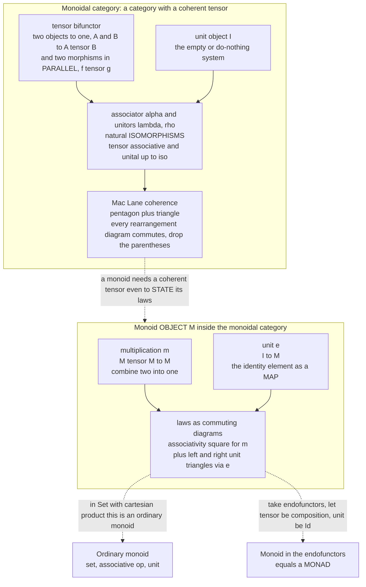

# 🧵 Monoids and Monoidal Categories

> [!abstract] TL;DR
> A **monoid** `(M, ·, e)` is the simplest interesting algebra of *combining*: a set with an **associative** binary operation `· : M × M → M` and a two-sided **unit** `e`. Numbers under `+` or `×`, strings under concatenation, lists under append, functions under composition, matrices under multiplication — they are all the same skeleton, and "a monoid is a **one-object category**" (its elements *are* the endomorphisms of that single object). A **monoidal category** `(𝒞, ⊗, I)` **categorifies** this: it equips a whole category with a **tensor** bifunctor `⊗` and a **unit object** `I`, so you can "multiply" not just elements but *objects and morphisms in parallel*, with associativity and unit holding **up to coherent natural isomorphism** (the associator `α` and unitors `λ, ρ`) rather than on the nose. **Mac Lane's coherence theorem** — pentagon + triangle — guarantees every diagram built from these isos commutes, so you may safely **drop the parentheses**. A **monoid object** inside `(𝒞, ⊗, I)` is then an object `M` with maps `m : M ⊗ M → M` and `e : I → M` satisfying the monoid laws *as commuting diagrams*; ordinary monoids are the monoid objects in `(Set, ×, 1)`. Push the tensor to be **functor composition** on the category of endofunctors and a monoid object becomes a **monad** — the famous slogan. Monoidal categories are the natural home of **tensor products, parallelism, resources, and quantum processes**, and the graphical calculus of **string diagrams** makes reasoning about them a 2D visual art.

---

## Intuition

**Analogy — a "combine" button that has a "do-nothing" default.** A monoid is *anything you can combine two-at-a-time, associatively, with a neutral element that changes nothing.* Concatenate two strings and the empty string is the do-nothing default: `"" + s = s`. Add two numbers and `0` is the default; multiply and `1` is. Glue two to-do lists end to end and the empty list is the default. Compose two functions and the identity function is the default. In every case the **order of grouping does not matter** — `(a·b)·c = a·(b·c)` — so you can hand a long chain `a·b·c·d·e` to *any* set of workers, let each combine an arbitrary contiguous chunk, and merge the partial results; you get the same answer. That single property, associativity plus a unit, is *the* license for **parallel and incremental aggregation**, which is why the humble monoid is the mathematical soul of map-reduce, `foldMap`, and running counters.

Now lift the whole idea up one level. A **monoidal category** is a category that itself has a "combine" button — but instead of combining *elements of a set*, it combines *objects and morphisms of a category*. Its tensor `A ⊗ B` puts two objects **side by side in parallel** (two independent wires, two independent resources, two systems evolving at once), and its unit object `I` is the "empty system" that changes nothing when you tensor with it. Where a monoid says "combining is associative and unital on the nose," a monoidal category says "combining is associative and unital *up to a coherent, reversible rearrangement*" — because in a category `(A ⊗ B) ⊗ C` and `A ⊗ (B ⊗ C)` are genuinely different objects that merely happen to be canonically isomorphic. This is exactly the setting you need to talk about **tensor products of vector spaces, parallel processes, quantum systems, and resource-sensitive logic**, and — once the tensor is composition of functors — about **monads**.

---

## How It Works

### Monoids: the algebra of combining

A **monoid** is a triple `(M, ·, e)`:

1. a set `M` (the carrier),
2. an **associative** binary operation `· : M × M → M` — `(a·b)·c = a·(b·c)` for all `a, b, c`,
3. a **two-sided unit** (identity) `e ∈ M` — `e·a = a = a·e` for all `a`.

Drop nothing else; a monoid is *not* required to have inverses (that would make it a **group**, see [[Groups_and_Subgroups]]) or to be commutative. Examples are everywhere: `(ℕ, +, 0)`, `(ℕ, ×, 1)`, `(Strings, concat, "")`, `(Lists, append, [])`, `(𝒞(A,A), ∘, id_A)` — the endomorphisms of any object under composition — and `(n×n matrices, ×, I)`. The last two are non-commutative; the free monoid on an alphabet is exactly *strings under concatenation* (this "free" universal property is a [[Universal_Properties|universal construction]]).

**"A monoid is a one-object category."** Take any monoid `(M, ·, e)` and build a category with a *single* object `★`, whose morphisms `★ → ★` are the elements of `M`, whose composition is `·`, and whose identity morphism is `e`. The category axioms — associativity of composition and identity laws ([[Categories_Objects_and_Morphisms]]) — are *precisely* the monoid axioms. Conversely, any one-object category *is* a monoid. So a monoid is not merely *like* a category; it *is* one, with the arrows reinterpreted as "things you combine" ([[Examples_of_Categories]]).

### Monoidal categories: categorifying the tensor

A **monoidal category** `(𝒞, ⊗, I, α, λ, ρ)` is a category `𝒞` together with:

- a **tensor product** `⊗ : 𝒞 × 𝒞 → 𝒞`, a **bifunctor** ([[Functors]]) — it acts on objects (`A, B ↦ A ⊗ B`) *and* on morphisms (`f : A → A′`, `g : B → B′` give `f ⊗ g : A ⊗ B → A′ ⊗ B′`), respecting identities and composition, so `(f′ ⊗ g′) ∘ (f ⊗ g) = (f′ ∘ f) ⊗ (g′ ∘ g)` — this **interchange law** is what lets you slide parallel and sequential composition past each other;
- a **unit object** `I` (the "empty" or "do-nothing" object);
- three **natural isomorphisms** ([[Natural_Transformations]]) expressing that `⊗` is associative and unital *only up to coherent iso*:
  - the **associator** `α_{A,B,C} : (A ⊗ B) ⊗ C ≅ A ⊗ (B ⊗ C)`,
  - the **left unitor** `λ_A : I ⊗ A ≅ A`, and the **right unitor** `ρ_A : A ⊗ I ≅ A`.

Because these are only *isomorphisms*, not equalities, they could in principle be assembled in incompatible ways. Mac Lane's axioms rule that out by demanding two **coherence diagrams** commute:

- the **pentagon**, relating the five ways to reassociate `((A ⊗ B) ⊗ C) ⊗ D`, and
- the **triangle**, relating the associator to the unitors around `(A ⊗ I) ⊗ B`.

**Mac Lane's coherence theorem** then delivers the payoff: *every* diagram built solely from `α`, `λ`, `ρ`, their inverses, identities, and `⊗` **commutes automatically**. In practice this means you may write `A ⊗ B ⊗ C ⊗ D` with **no parentheses** and never worry that a rearrangement changed anything — exactly the "grouping does not matter" freedom of a plain monoid, now certified at the categorical level. A category is **strict monoidal** if `α, λ, ρ` are literal identities (parentheses genuinely do not exist); coherence says every monoidal category is *equivalent* to a strict one, which is why practitioners reason strictly and string-diagrammatically without loss.

### Monoid objects: monoids that live anywhere

Fix a monoidal category `(𝒞, ⊗, I)`. A **monoid object** (internal monoid) in it is an object `M` equipped with two morphisms

- a **multiplication** `m : M ⊗ M → M`, and
- a **unit** `e : I → M`,

such that the following **commute** (drawn with `⊗`, using `α, λ, ρ` to line up the objects — [[Diagrams_and_Commutativity]]):

- **Associativity square:** `m ∘ (m ⊗ id_M) = m ∘ (id_M ⊗ m)` as maps `(M ⊗ M) ⊗ M → M` (up to `α`).
- **Unit triangles:** `m ∘ (e ⊗ id_M) = λ_M` and `m ∘ (id_M ⊗ e) = ρ_M` as maps `I ⊗ M → M` and `M ⊗ I → M`.

This is the *same data* as a monoid, but stated with **maps and diagrams instead of elements** — so it makes sense in *any* monoidal category, even one whose objects have no "elements" to speak of. Specializing recovers the familiar:

- In `(Set, ×, 1)` (the **cartesian** monoidal structure, tensor = [[Products_and_Coproducts|cartesian product]], unit = one-point set), a monoid object is *exactly an ordinary monoid*: `m : M × M → M` is the binary op, `e : 1 → M` picks the unit.
- In `(Ab, ⊗_ℤ, ℤ)` a monoid object is a **ring** (multiplication distributing over the abelian-group addition).
- In `(Vect, ⊗, k)` a monoid object is an **algebra** over the field `k`.
- In `([𝒞, 𝒞], ∘, Id)` — endofunctors under composition — a monoid object is a **monad** (see below).

### Diagram — tensor, unit, coherence, and the monoid object inside



### Symmetric and braided: when parallel order can be swapped

Plain monoidal categories say nothing about swapping `A ⊗ B` and `B ⊗ A`. Adding a swap gives finer structure:

- A **braided** monoidal category has a natural iso `β_{A,B} : A ⊗ B ≅ B ⊗ A` (the **braiding**) obeying two hexagon coherence axioms. Braidings need not be self-inverse: `β_{B,A} ∘ β_{A,B}` can be a *nontrivial* automorphism. Braided categories model **2-dimensional / topological** phenomena — the braiding is literally "wire `A` crosses *over* wire `B`," and the two hexagons are the Reidemeister moves of knot theory. This is the mathematics of **anyons** and topological quantum computation.
- A **symmetric** monoidal category is a braided one where the swap is an involution: `β_{B,A} ∘ β_{A,B} = id` (crossing twice undoes itself — over/under does not matter). Symmetric monoidal categories model **classical parallel resources**: `Set` with `×`, `Vect` with `⊗`, `Rel` (sets and relations), and the category of **cobordisms** used in topological quantum field theory are all symmetric.

The difference is exactly *"can two parallel wires be swapped, and does swapping twice get you back?"* — trivially yes in the classical/symmetric world, subtly no in the braided/topological one.

### Cartesian vs non-cartesian: the license to copy and delete

A monoidal structure is **cartesian** when its tensor *is* the categorical product `×` and its unit is the terminal object `1` ([[Products_and_Coproducts]]). This is a strong, special condition. In a cartesian monoidal category every object carries **canonical** maps

- a **copy / diagonal** `Δ_A : A → A ⊗ A` (duplicate), and
- a **delete / terminal** `!_A : A → I` (discard),

that are *natural and coherent*. So in `(Set, ×, 1)` you may freely duplicate and throw away data — the normal state of classical computing.

**Non-cartesian** monoidal categories deliberately lack these. In `(Vect, ⊗, k)` there is **no natural linear map** `V → V ⊗ V` copying a vector, and no natural `V → k` deleting one; the tensor genuinely mixes two spaces rather than pairing two independent choices. This "you cannot copy or delete" is not a defect — it is the *point*. It is the categorical semantics of **linear logic**, where each hypothesis (resource) must be used **exactly once** ([[Linear_Logic_and_Resource_Types]]), and it is the abstract shadow of the **quantum no-cloning theorem**: an unknown quantum state cannot be duplicated ([[Measurement_and_the_No_Cloning_Theorem]]). *Cartesian = classical, copyable, deletable; non-cartesian = linear, resource-sensitive, quantum.* The presence or absence of `Δ` and `!` is the deepest structural fork in this whole subject.

### The punchline: a monad is a monoid in endofunctors

Take the **functor category** `[𝒞, 𝒞]` whose objects are endofunctors of `𝒞` and whose morphisms are natural transformations ([[Functor_Categories_and_Naturality]]). This category is **monoidal** with a twist most people miss on first sight: the tensor is **functor composition** `∘` (so `F ⊗ G = F ∘ G`) and the unit object is the **identity functor** `Id`. It is *not* cartesian, and it is *not* symmetric — composition of functors does not commute. A **monoid object** in `([𝒞, 𝒞], ∘, Id)` is then an endofunctor `T` with a multiplication `μ : T ∘ T → T` and a unit `η : Id → T` obeying the monoid laws — which is, character for character, the definition of a **monad** `(T, η, μ)`. That is the literal content of *"a monad is just a monoid in the category of endofunctors"* — the section this note opens builds directly on it ([[Monads_Categorically]]). Relatedly, **lax monoidal functors** between monoidal categories are exactly **applicative functors** ([[Applicative_and_Lax_Monoidal_Functors]]) — the monoidal structure is what makes both "monad" and "applicative" precise.

### String diagrams: the 2D calculus of monoidal categories

Monoidal categories have a **sound and complete** graphical language. Read a diagram bottom-to-top (conventions vary):

- **objects are wires**, labelled by the object;
- **morphisms are boxes** with input wires below and output wires above;
- **composition** `g ∘ f` is **stacking** boxes vertically (sequence, one after another — the output type of `f` must match the input type of `g`);
- **tensor** `f ⊗ g` is placing boxes **side by side** (parallel, on independent wires);
- the **unit** `I` is the *empty diagram* (no wire).

A **monoid object** draws beautifully: `m : M ⊗ M → M` is a **"merge" node** where two `M`-wires join into one, and `e : I → M` is a **source** where an `M`-wire appears from nothing. Associativity of `m` becomes "the two ways to merge three wires give the same picture"; the unit law becomes "a wire that starts, then immediately merges, is just the wire." In symmetric monoidal categories the braiding/swap is drawn as **crossing wires**, and coherence guarantees you may **slide boxes along wires** freely — planar isotopy *is* equational reasoning. This graphical calculus is developed fully in [[String_Diagrams_and_Graphical_Calculus]]; it is the working notation of the **applied category theory** community for concurrency, quantum protocols, and dataflow (forthcoming *Applied Category Theory* and *Category Theory in Programming* siblings).

---

## Key Concepts

### Secondary (intuition-level)
- A **monoid** is anything with a **combine** operation that is **associative** (grouping does not matter) and has a **do-nothing** default (a unit): numbers under `+` with `0`, strings under concatenation with `""`, lists under append with `[]`.
- Because grouping does not matter, you can **combine in parallel and merge** — the reason monoids power map-reduce and running totals.
- A **monoidal category** lifts "combine" from *elements* to *whole objects*: its **tensor** puts two things **side by side** (in parallel) and its **unit object** is the "empty" thing that changes nothing.
- **Sequence is not parallel:** stacking two steps one-after-another (composition) is a different move from placing two independent processes side by side (tensor).

### Undergraduate (formal core)
- **Monoid** `(M, ·, e)`: associative binary op, two-sided unit; *not* required to have inverses (that is a **group**) or to commute. "A monoid is a **one-object category**"; morphisms `★ → ★` are its elements, composition is `·`.
- **Monoidal category** `(𝒞, ⊗, I, α, λ, ρ)`: tensor **bifunctor** `⊗`, unit object `I`, natural isos **associator** `α`, **unitors** `λ, ρ`, satisfying the **pentagon** and **triangle** coherence axioms.
- **Coherence theorem** (Mac Lane): all diagrams of `α, λ, ρ` commute — every monoidal category is equivalent to a **strict** one — so you may omit parentheses.
- **Monoid object** in `(𝒞, ⊗, I)`: an object `M` with `m : M ⊗ M → M` and `e : I → M` whose associativity square and unit triangles commute; monoid objects in `(Set, ×, 1)` are ordinary monoids, in `(Ab, ⊗, ℤ)` are rings, in `(Vect, ⊗, k)` are `k`-algebras.
- **Symmetric / braided**: a swap `β_{A,B} : A ⊗ B ≅ B ⊗ A`; symmetric ⇒ `β² = id`, braided ⇒ not necessarily.

### Graduate (structural / research-level)
- **Cartesian vs non-cartesian**: `⊗ = ×` gives natural copy `Δ : A → A ⊗ A` and delete `! : A → I`; non-cartesian tensors (`Vect`, `Rel`, categories of Hilbert spaces) **forbid** copying/deleting — the semantics of **linear logic** and the categorical form of **quantum no-cloning**.
- **Monoids in `[𝒞, 𝒞]`**: with tensor = composition, unit = `Id`, a monoid object is a **monad**; comonoids are comonads; this is why the endofunctor category's monoidal (not cartesian) structure is load-bearing.
- **Coherence via free constructions**: the free monoidal category on one object is (the skeleton of) binary trees / reassociations; Mac Lane's theorem is the statement that the canonical functor to a strictification is an equivalence.
- **Higher/enriched structure**: enrichment over a monoidal category `𝒱` (a `𝒱`-category has hom-*objects*); braided categories are `E₂`-algebras and symmetric ones `E∞` in the operadic hierarchy; **fusion / modular tensor categories** classify anyons and underlie topological quantum computation.
- **Graphical completeness** (Joyal–Street, Selinger): string diagrams are a *sound and complete* syntax — two morphisms are equal iff their diagrams are related by planar (symmetric: 3D) isotopy — turning equational proofs into topology.

---

## Python Demo

We make the abstraction concrete in four steps. **Part 1** builds several **plain monoids** (strings under concatenation, `ℤ/n` under addition, tuples under append) and machine-verifies **associativity** and the **two-sided unit** by sampling. **Part 2** re-presents the *same* structure as a **monoid object** — the pair of maps `m : M ⊗ M → M` and `e : I → M` in `(Set, ×, 1)` — and verifies the monoid laws as the **commuting associativity square** and **unit triangles**. **Part 3** demonstrates that **tensor (parallel) is not composition (sequence)**: `f ⊗ g` runs two morphisms on independent inputs side by side, while `g ∘ f` threads one output into the next. **Part 4** draws **string-diagram-style pictures** — parallel vs sequence, the monoid multiplication as a merge node with its unit source, and the associativity law as two equal merge-trees. Pure standard library plus matplotlib (no numpy).

```python
"""
MONOIDS and MONOID OBJECTS, verified, plus string-diagram pictures.

PART 1  plain monoids  (M, . , e): associativity + two-sided unit, by sampling.
PART 2  the SAME monoid as a MONOID OBJECT: maps  m : M(x)M -> M ,  e : I -> M
        in (Set, x, 1); laws become the associativity SQUARE and unit TRIANGLES.
PART 3  tensor (PARALLEL) is NOT composition (SEQUENCE).
PART 4  string-diagram pictures: parallel vs sequence, the multiplication MERGE
        node with its unit SOURCE, and associativity as two equal merge-trees.
Pure standard library + matplotlib.
"""
import random
import matplotlib.pyplot as plt
import matplotlib.patches as mpatches

# =====================================================================
# PART 1: PLAIN MONOIDS -- a set with an associative op and a unit.
# =====================================================================
class Monoid:
    """A monoid: a random-element sampler, a binary op '.', and a unit 'e'."""
    def __init__(self, name, op, unit, sample):
        self.name, self.op, self.unit, self.sample = name, op, unit, sample

    def check(self, trials=3000):
        assoc = unit_l = unit_r = True
        for _ in range(trials):
            a, b, c = self.sample(), self.sample(), self.sample()
            if self.op(self.op(a, b), c) != self.op(a, self.op(b, c)):
                assoc = False                              # (a.b).c == a.(b.c)
            if self.op(self.unit, a) != a:
                unit_l = False                             # e.a == a
            if self.op(a, self.unit) != a:
                unit_r = False                             # a.e == a
        return assoc, unit_l, unit_r

random.seed(7)

def rand_str():  # strings under concatenation, unit ""
    return "".join(random.choice("ab") for _ in range(random.randint(0, 4)))
strings = Monoid("strings under concat", lambda a, b: a + b, "", rand_str)

N = 12            # Z/N under addition, unit 0
zn = Monoid(f"Z mod {N} under +", lambda a, b: (a + b) % N, 0,
            lambda: random.randrange(N))

def rand_tuple():  # tuples under append, unit ()
    return tuple(random.randrange(9) for _ in range(random.randint(0, 3)))
tuples = Monoid("tuples under append", lambda a, b: a + b, (), rand_tuple)

print("=== PART 1: plain monoids -- associativity and two-sided unit ===")
for M in (strings, zn, tuples):
    a, ul, ur = M.check()
    print(f"  {M.name:24s}  assoc={a}  left_unit={ul}  right_unit={ur}")

# =====================================================================
# PART 2: the SAME monoid as a MONOID OBJECT in (Set, x, 1).
#   M (x) M = M x M ,   unit object I = a one-point set {STAR}
#   m : M x M -> M   is the multiplication as a MAP
#   e : I -> M       picks the unit element (ignores the point)
#   Laws become COMMUTING DIAGRAMS:
#     assoc square :  m o (m x id) == m o (id x m)   on M x M x M
#     unit triangs :  m(e(*), x) == x  (left) ,  m(x, e(*)) == x  (right)
# =====================================================================
STAR = object()                              # the single point of the unit I

def monoid_object(M):
    m = lambda p: M.op(p[0], p[1])           # m : M x M -> M
    e = lambda _star: M.unit                 # e : I -> M
    return m, e

def check_object(M, trials=3000):
    m, e = monoid_object(M)
    assoc = l_unit = r_unit = True
    for _ in range(trials):
        x, y, z = M.sample(), M.sample(), M.sample()
        left  = m((m((x, y)), z))            # m o (m x id) : (M x M) x M -> M
        right = m((x, m((y, z))))            # m o (id x m) : M x (M x M) -> M
        if left != right:
            assoc = False
        if m((e(STAR), x)) != x:             # left  unit triangle
            l_unit = False
        if m((x, e(STAR))) != x:             # right unit triangle
            r_unit = False
    return assoc, l_unit, r_unit

print("\n=== PART 2: monoid OBJECT (maps m, e) -- laws as commuting diagrams ===")
for M in (strings, zn, tuples):
    a, ul, ur = check_object(M)
    print(f"  {M.name:24s}  assoc_square={a}  left_tri={ul}  right_tri={ur}")

# =====================================================================
# PART 3: TENSOR (parallel) is NOT COMPOSITION (sequence).
#   compose(g, f) threads output -> input   (SEQUENCE, stacked boxes).
#   tensor(f, g)  runs both on SEPARATE inputs, side by side (PARALLEL).
# =====================================================================
def compose(g, f):  return lambda x: g(f(x))              # A -> B -> C
def tensor(f, g):   return lambda p: (f(p[0]), g(p[1]))   # A x C -> B x D

inc  = lambda x: x + 1        # A -> B
tenx = lambda x: x * 10       # B -> C

seq = compose(tenx, inc)      # (tenx o inc)(x)  = (x + 1) * 10
par = tensor(inc, tenx)       # (inc (x) tenx)(x, y) = (x + 1, y * 10)

print("\n=== PART 3: parallel tensor vs sequential composition ===")
print(f"  compose  tenx o inc  at 4        : {seq(4)}      (one wire, stacked)")
print(f"  tensor   inc (x) tenx at (4, 4)  : {par((4, 4))}  (two wires, side by side)")
print("  -> different arities and types: sequence joins end-to-end,")
print("     tensor places independent processes in PARALLEL.")

# =====================================================================
# PART 4: STRING-DIAGRAM pictures (read bottom -> top).
# =====================================================================
def box(ax, cx, cy, w, h, label, fc="#bfdbfe", ec="#1e40af"):
    ax.add_patch(mpatches.FancyBboxPatch((cx - w / 2, cy - h / 2), w, h,
                 boxstyle="round,pad=0.008", fc=fc, ec=ec, lw=2))
    ax.text(cx, cy, label, ha="center", va="center", fontweight="bold")

def wire(ax, x0, y0, x1, y1, color="#334155"):
    ax.plot([x0, x1], [y0, y1], color=color, lw=2.4, zorder=1)

def node(ax, x, y):                          # a merge / multiplication node
    ax.scatter([x], [y], s=150, color="#b91c1c", zorder=3)

fig, axes = plt.subplots(2, 2, figsize=(14, 11))
for ax in axes.ravel():
    ax.axis("off"); ax.set_xlim(0, 1); ax.set_ylim(0, 1)

# ---- Panel A: TENSOR = parallel (boxes SIDE BY SIDE) -----------------
ax = axes[0, 0]
ax.set_title("Tensor  f (x) g : PARALLEL\nboxes side by side, independent wires",
             fontweight="bold")
box(ax, 0.32, 0.5, 0.2, 0.16, "f")
box(ax, 0.68, 0.5, 0.2, 0.16, "g")
for cx, ain, aout in [(0.32, "A", "B"), (0.68, "C", "D")]:
    wire(ax, cx, 0.12, cx, 0.42);  wire(ax, cx, 0.58, cx, 0.88)
    ax.text(cx, 0.06, ain, ha="center", fontweight="bold")
    ax.text(cx, 0.93, aout, ha="center", fontweight="bold")

# ---- Panel B: COMPOSITION = sequence (boxes STACKED) ----------------
ax = axes[0, 1]
ax.set_title("Composition  g o f : SEQUENCE\nboxes stacked, one wire threaded",
             fontweight="bold")
box(ax, 0.5, 0.34, 0.26, 0.14, "f")
box(ax, 0.5, 0.66, 0.26, 0.14, "g")
wire(ax, 0.5, 0.10, 0.5, 0.27);  wire(ax, 0.5, 0.41, 0.5, 0.59);  wire(ax, 0.5, 0.73, 0.5, 0.90)
ax.text(0.5, 0.05, "A", ha="center", fontweight="bold")
ax.text(0.58, 0.50, "B", ha="center", fontweight="bold")
ax.text(0.5, 0.94, "C", ha="center", fontweight="bold")

# ---- Panel C: monoid MULTIPLICATION m (merge) + UNIT e (source) ------
ax = axes[1, 0]
ax.set_title("Monoid object: m merges two M-wires into one; e is a source",
             fontweight="bold")
wire(ax, 0.14, 0.12, 0.25, 0.48);  wire(ax, 0.36, 0.12, 0.25, 0.48)   # two inputs
node(ax, 0.25, 0.48);  wire(ax, 0.25, 0.48, 0.25, 0.86)               # merge + output
ax.text(0.14, 0.06, "M", ha="center", fontweight="bold")
ax.text(0.36, 0.06, "M", ha="center", fontweight="bold")
ax.text(0.25, 0.91, "M", ha="center", fontweight="bold")
ax.text(0.31, 0.47, "m", color="#b91c1c", fontweight="bold")
node(ax, 0.72, 0.14);  wire(ax, 0.72, 0.14, 0.72, 0.86)               # unit source
ax.text(0.78, 0.14, "e", color="#b91c1c", fontweight="bold")
ax.text(0.72, 0.06, "I", ha="center", fontweight="bold")
ax.text(0.72, 0.91, "M", ha="center", fontweight="bold")

# ---- Panel D: ASSOCIATIVITY of m as two equal merge-trees -----------
ax = axes[1, 1]
ax.set_title("Associativity: merge x,y first == merge y,z first",
             fontweight="bold")
# left tree: (x . y) . z
wire(ax, 0.06, 0.12, 0.11, 0.36);  wire(ax, 0.16, 0.12, 0.11, 0.36)   # x,y -> m1
node(ax, 0.11, 0.36);  wire(ax, 0.11, 0.36, 0.11, 0.50)
wire(ax, 0.30, 0.12, 0.30, 0.50)                                      # z rises
wire(ax, 0.11, 0.50, 0.19, 0.62);  wire(ax, 0.30, 0.50, 0.19, 0.62)   # -> m2
node(ax, 0.19, 0.62);  wire(ax, 0.19, 0.62, 0.19, 0.88)
for lx, lab in [(0.06, "x"), (0.16, "y"), (0.30, "z")]:
    ax.text(lx, 0.06, lab, ha="center", fontweight="bold")
# right tree: x . (y . z)
wire(ax, 0.72, 0.12, 0.79, 0.36);  wire(ax, 0.86, 0.12, 0.79, 0.36)   # y,z -> m1
node(ax, 0.79, 0.36);  wire(ax, 0.79, 0.36, 0.79, 0.50)
wire(ax, 0.60, 0.12, 0.60, 0.50)                                      # x rises
wire(ax, 0.60, 0.50, 0.69, 0.62);  wire(ax, 0.79, 0.50, 0.69, 0.62)   # -> m2
node(ax, 0.69, 0.62);  wire(ax, 0.69, 0.62, 0.69, 0.88)
for lx, lab in [(0.60, "x"), (0.72, "y"), (0.86, "z")]:
    ax.text(lx, 0.06, lab, ha="center", fontweight="bold")
ax.text(0.46, 0.5, "=", ha="center", va="center", fontsize=34,
        color="#1f8a4c", fontweight="bold")

fig.suptitle("Monoids and monoidal categories: combine in parallel (tensor) vs "
             "in sequence (composition)", fontsize=14, fontweight="bold")
fig.tight_layout(rect=[0, 0, 1, 0.96])
plt.savefig("monoids_and_monoidal_categories.png", dpi=130)
print("\nSaved figure to monoids_and_monoidal_categories.png")
```

**What the run shows.** Part 1 confirms that strings-under-concatenation, `ℤ/12`-under-addition, and tuples-under-append each satisfy associativity and both unit laws over thousands of random samples — three superficially different structures, one monoid skeleton. Part 2 verifies the *identical* facts re-expressed as a **monoid object**: the associativity **square** `m ∘ (m × id) = m ∘ (id × m)` and the two unit **triangles** commute, demonstrating that "ordinary monoid" and "monoid object in `(Set, ×, 1)`" are the same data in two dresses. Part 3 makes the tensor-vs-composition distinction unmistakable: `inc ⊗ tenx` is a **parallel** map on a *pair* of inputs while `tenx ∘ inc` is a **sequential** map on a *single* input — different arities, different pictures. Part 4 renders those pictures as string diagrams: parallel boxes side by side, sequential boxes stacked, the multiplication as a two-into-one **merge** with the unit as a **source**, and associativity as two merge-trees joined by an equals sign — the same coherence the Mermaid diagram states abstractly.

---

## Real-World Applications

> **Example — `foldMap`, map-reduce, and monoidal aggregation.** The single most pervasive industrial use of monoids is **associative aggregation**. Because a monoid's `·` is associative, a reduction `x₁ · x₂ · … · xₙ` can be split across arbitrarily many machines, each combining a contiguous chunk, and the partial results merged — *this is exactly what MapReduce/Spark do*, and it is why the reduce function must be an (ideally commutative) monoid for the result to be deterministic. Haskell's `foldMap :: Monoid m => (a -> m) -> [a] -> m`, Scala's `Foldable.foldMap` and `combineAll`, and Cats/Twitter-Algebird's `Monoid`/`Semigroup` type classes are this idea as an API: `Sum`, `Product`, `Max`, `Min`, `Set` union, string concatenation, and — crucially — *approximate* structures like **HyperLogLog** (cardinality) and **Count-Min Sketch** (frequencies) are monoids, so a streaming system can merge per-shard sketches into a global estimate with one associative `combine`. Algebird was built at Twitter precisely to make "everything is a monoid" the backbone of real-time analytics.

- **Tensor products in linear algebra and ML.** `(Vect, ⊗, k)` is the working monoidal category behind every "tensor" in deep learning; the *non-cartesian* tensor is why you cannot generically "copy" a hidden state as a linear map, and why tensor contractions (not pairings) are the primitive operation.
- **Quantum computing and the ZX-calculus.** Quantum processes form a (dagger) symmetric monoidal category: qubits tensor in parallel, gates compose in sequence, and **no-cloning** is the statement that the tensor is non-cartesian. Coecke–Kissinger's **string-diagram / ZX-calculus** reasons about circuits *purely graphically*, and compilers like PyZX use it to optimize quantum circuits ([[Measurement_and_the_No_Cloning_Theorem]]).
- **Linear types and resource-aware languages.** Rust's ownership/move semantics, session types for protocols, and Linear Haskell all trace to **non-cartesian** monoidal semantics: a resource that cannot be duplicated (`Δ`) or silently dropped (`!`) ([[Linear_Logic_and_Resource_Types]]).
- **Monads and effect systems.** Every monad in Haskell/Scala *is* a monoid object in endofunctors; `Monoid`/`Semigroup` instances also underlie `Writer` logging, `Validated` error accumulation ([[Applicative_and_Lax_Monoidal_Functors]]), and CRDTs (conflict-free replicated data types are *join-semilattices*, i.e. commutative idempotent monoids, which is why their merges converge).
- **Concurrency and dataflow via string diagrams.** Petri nets, signal-flow graphs, and dataflow pipelines are morphisms in symmetric monoidal categories; "wire two components in parallel" is `⊗`, "pipe one into the next" is `∘`, and applied category theory uses the graphical calculus to specify and verify them ([[String_Diagrams_and_Graphical_Calculus]]).

---

## Common Pitfalls

- **Confusing "associative up to iso" with "associative on the nose."** In a monoidal category `(A ⊗ B) ⊗ C` and `A ⊗ (B ⊗ C)` are *different objects* joined by the associator `α`, not the same object. Coherence lets you *ignore* the difference safely, but writing `=` where you mean `≅` is the classic beginner error — it matters the moment you track which specific isomorphism you used.
- **Assuming the tensor is the product (cartesian).** It usually is not. In `Vect`, `Rel`, or endofunctors-under-composition there is **no** natural copy `Δ` or delete `!`. Treating a non-cartesian tensor as if you could duplicate or discard breaks linearity — this is precisely what no-cloning forbids. Always ask: *is `⊗` the categorical product, or something genuinely different?*
- **Mixing up tensor with composition.** `⊗` is **parallel** (independent wires side by side), `∘` is **sequential** (output feeds input). They have different types and different string-diagram pictures; the **interchange law** `(f′ ⊗ g′) ∘ (f ⊗ g) = (f′ ∘ f) ⊗ (g′ ∘ g)` relates them but does not identify them. Conflating "combine in parallel" with "combine in sequence" is the deepest conceptual slip.
- **Forgetting the unit *object* vs the unit *element*.** In a monoidal category the unit is an **object** `I` (with unitors `λ, ρ`), and a monoid object's unit is a **map** `e : I → M`, not a chosen element. In `(Set, ×, 1)` these collapse (`I = 1`, and `e : 1 → M` *is* picking an element), which hides the distinction until you move to `Vect` or endofunctors.
- **Treating "monoid in endofunctors = monad" as a slogan, not a definition.** The tensor there is composition and the unit object is `Id`; the monad laws *are* the monoid laws. Dismissing this as a quip means missing why `μ` and `η` take the shape they do ([[Monads_Categorically]]).
- **Assuming every monoidal category is symmetric.** Endofunctor composition is **not** commutative, and braided categories deliberately have a non-trivial swap. Silently assuming `A ⊗ B ≅ B ⊗ A` (or that swapping twice is the identity) is wrong in exactly the braided/quantum settings where the subtlety is the whole point.
- **Requiring inverses.** A monoid is *not* a group — no inverses. Strings-under-concatenation and `(ℕ, ×, 1)` have no inverses; demanding them collapses most of the interesting examples ([[Groups_and_Subgroups]]).

---

## Related Concepts

- [[Categories_Objects_and_Morphisms]] — the base structure; "a monoid **is** a one-object category," and a monoidal category *is* a category with extra combining structure.
- [[Examples_of_Categories]] — where the one-object-category picture of a monoid, and cartesian examples like `(Set, ×, 1)`, are catalogued.
- [[Functors]] — the tensor `⊗ : 𝒞 × 𝒞 → 𝒞` is a **bifunctor**; its action on morphisms is what gives parallel composition `f ⊗ g`.
- [[Natural_Transformations]] — the associator `α` and unitors `λ, ρ` are **natural isomorphisms**; coherence is a statement about them.
- [[Diagrams_and_Commutativity]] — a monoid object's laws are the **commuting** associativity square and unit triangles; the pentagon/triangle are coherence diagrams.
- [[Products_and_Coproducts]] — the **cartesian** monoidal structure `(𝒞, ×, 1)`, where copy `Δ` and delete `!` exist; the fork between cartesian and non-cartesian tensors.
- [[Functor_Categories_and_Naturality]] — `[𝒞, 𝒞]` is the monoidal category (tensor = composition, unit = `Id`) inside which a monoid object is a monad.
- [[Monads_Categorically]] — the punchline this section opens: **a monad is a monoid in the category of endofunctors**; `μ` = multiply, `η` = unit.
- [[Applicative_and_Lax_Monoidal_Functors]] — an applicative functor **is** a lax monoidal functor between monoidal categories; the monoidal structure is what makes "applicative" precise.
- [[String_Diagrams_and_Graphical_Calculus]] — the 2D graphical calculus for monoidal categories: objects as wires, morphisms as boxes, tensor as side-by-side, composition as stacking, and monoid multiplication as a merge node.
- [[Linear_Logic_and_Resource_Types]] — **non-cartesian** monoidal categories are the semantics of linear logic: no duplication (`Δ`) or discarding (`!`), resources used exactly once.
- [[Measurement_and_the_No_Cloning_Theorem]] — quantum no-cloning is the physical face of a non-cartesian tensor: an unknown state has no copy map.
- [[Groups_and_Subgroups]] — a **group** is a monoid with inverses; monoids are the strictly weaker, more common algebra of combining.
- [[Universal_Properties]] — the **free monoid** (lists/strings) is defined by a universal property; free constructions also drive Mac Lane's coherence proof.

*Forthcoming Category_Theory siblings this note anchors to (referenced in prose, to be linked once written):* **Applied Category Theory** (symmetric monoidal semantics of concurrency, quantum, and dataflow) and **Category Theory in Programming** (monoids and monoidal structure as an API-design discipline).

---

## Review Questions

1. **(Secondary / conceptual)** Give three everyday monoids, naming each carrier, operation, and unit, and explain why associativity — not the operation's identity — is what lets you compute a big combination **in parallel** and merge the pieces. Then, in one sentence each, say how a **monoidal category's** tensor `⊗` differs from **composition** `∘`.

2. **(Undergraduate / scenario)** You are handed a monoidal category `(𝒞, ⊗, I)`. (a) Write down the data and the two commuting diagrams that make an object `M` a **monoid object**. (b) Show that a monoid object in `(Set, ×, 1)` is exactly an ordinary monoid — identify `m` and `e` explicitly. (c) The category `[𝒞, 𝒞]` of endofunctors is monoidal with tensor = composition and unit = `Id`. State precisely what a monoid object there is, and name the multiplication and unit in the language of that structure.

3. **(Graduate / trade-off)** Contrast **cartesian** and **non-cartesian** monoidal categories. (a) What extra natural maps does a cartesian tensor provide, and what do they mean operationally? (b) Explain why `(Vect, ⊗, k)` and the category of Hilbert spaces are *not* cartesian, and connect this to both **linear logic** and the **quantum no-cloning theorem**. (c) Mac Lane's coherence theorem lets you "drop the parentheses" — state what it actually asserts, and why "every monoidal category is equivalent to a strict one" is the practical upshot that justifies string-diagram reasoning.

---

## Sources

- [Mac Lane, S., *Categories for the Working Mathematician* (2nd ed., 1998), Ch. VII](https://link.springer.com/book/10.1007/978-1-4757-4721-8) — the definitive treatment of monoidal categories, monoid objects, and the pentagon/triangle coherence theorem.
- [Baez, J. & Stay, M., "Physics, Topology, Logic and Computation: A Rosetta Stone", in *New Structures for Physics* (2011)](https://arxiv.org/abs/0903.0340) — monoidal categories, string diagrams, and the symmetric/braided distinction across physics, logic, and computation.
- [Selinger, P., "A survey of graphical languages for monoidal categories" (2010)](https://arxiv.org/abs/0908.3347) — the string-diagram calculus and its soundness/completeness for the monoidal hierarchy.
- [Coecke, B. & Kissinger, A., *Picturing Quantum Processes* (2017)](https://www.cambridge.org/core/books/picturing-quantum-processes/1119568B3101F3A685BE832FEEC53E52) — dagger symmetric monoidal categories, no-cloning as non-cartesianness, and the ZX-calculus.
- [Fong, B. & Spivak, D., *Seven Sketches in Compositionality* (2019)](https://arxiv.org/abs/1803.05316) — an applied introduction to (symmetric) monoidal categories, resources, and wiring diagrams.
- [nLab, "monoidal category"](https://ncatlab.org/nlab/show/monoidal+category) and ["monoid in a monoidal category"](https://ncatlab.org/nlab/show/monoid+in+a+monoidal+category) — reference definitions, coherence, and the monoid-object viewpoint.

---

#category-theory #monoid #monoidal-category #tensor-product #string-diagrams
