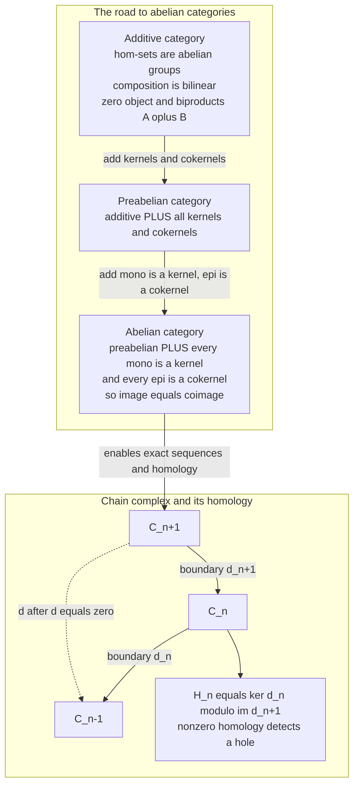

# 🕳️ Abelian Categories and Homological Algebra

> [!abstract] TL;DR
> An **abelian category** is the abstract distillation of "categories that behave like vector spaces or abelian groups": it has a **zero object**, **biproducts** `A ⊕ B` (simultaneously product *and* coproduct), **kernels** and **cokernels** for every map, and the decisive axiom that **every monomorphism is a kernel and every epimorphism is a cokernel** — so *image = coimage* and the isomorphism theorems hold. This is exactly the machinery needed to talk about **exact sequences** and **homology**. **Homological algebra** is what you *do* inside such a category: you build **chain complexes** `… → C₊₁ → Cₙ → C₋₁ → …` with `∂∘∂ = 0`, and measure the **failure of exactness** by **homology** `Hₙ = ker ∂ₙ / im ∂₊₁`. Nonzero homology detects "holes." This one framework unifies singular, simplicial, de Rham, sheaf, and group cohomology, gives **derived functors** `Ext` and `Tor` as the "corrections" to non-exact `Hom` and `⊗`, and — via **persistent homology** — turns the shape of a point cloud into a computable, robust invariant for data analysis.

---

## Intuition

**Analogy — the census that counts holes.** Suppose you are handed a shape and asked, without touching it, *"how many holes does it have, and of what dimension?"* A solid ball has none. A loop of wire has one. A hollow sphere encloses one cavity. A donut has two independent loops. You cannot answer by staring; you need a *procedure*.

Homology is that procedure, and it works by a trick that feels almost like cheating: **turn the geometry into algebra**. Chop the shape into simple building blocks — points, edges, triangles, tetrahedra. Record, at each dimension, the space of "closed things you could draw" (loops, closed surfaces) — the **cycles**. Then subtract off the ones that are boring because they are merely the **boundary** of a filled-in piece one dimension up. What survives — *cycles that are not boundaries* — are the genuine holes. Count them, and you get the **Betti numbers**. The single algebraic miracle that makes the count well-defined is `∂∘∂ = 0`: **the boundary of a boundary is empty** (the edge-loop around a filled triangle has no endpoints), so "boundaries" always sit inside "cycles" and the quotient makes sense.

**Where abelian categories come in.** That whole machine — *kernels, images, "cycles mod boundaries," exact sequences* — only needs a handful of features: you must be able to add maps, form direct sums, take kernels and cokernels, and factor any map cleanly as *onto-then-into* its image. An **abelian category** is precisely the axiomatic list of those features, extracted from the two motivating examples — **abelian groups** and **vector spaces** — so that the *same* homology machine runs unchanged over groups, modules, sheaves, and complexes themselves. You write the isomorphism theorems and the diagram lemmas *once*, in the abstract, and they hold everywhere at once. This is one of category theory's most consequential organizing achievements: it took a pile of look-alike computations scattered across topology and algebra and revealed them as one theory.

---

## How It Works

### The road to "abelian": three axiom layers

Abelian categories are not defined in one breath; they are built up in three stages, each adding exactly the structure the next needs. (See `[[Terminal_Initial_and_Zero_Objects]]` for the zero object, `[[Limits_and_Colimits]]` for kernels/cokernels as limits/colimits, and `[[Universal_Properties]]` for what "the" kernel means.)

1. **Additive category (Ab-enriched).** Every hom-set `Hom(A, B)` is not merely a set but an **abelian group** — you can *add* two parallel morphisms — and composition is **bilinear** (`f∘(g+h) = f∘g + f∘h` on both sides). This is "enrichment over `Ab`" (a preview of `[[Diagrams_and_Commutativity]]`-style structured hom-objects; the general theory lives in the forthcoming sibling *Enriched and Higher Categories*). An additive category also has a **zero object** and **biproducts** `A ⊕ B` that are *simultaneously* the product and the coproduct — the fact that finite products and coproducts **coincide** is the categorical fingerprint of linearity.

2. **Preabelian category.** An additive category in which **every morphism has a kernel and a cokernel**. Now `ker f` (the universal "stuff that maps to zero") and `coker f` (the universal quotient killing the image) always exist. This is *almost* enough — but not quite, because the natural map from the **coimage** `coker(ker f)` to the **image** `ker(coker f)` need not be an isomorphism.

3. **Abelian category.** A preabelian category satisfying the decisive extra axiom: **every monomorphism is a kernel, and every epimorphism is a cokernel** (equivalently, the canonical *coimage → image* map is always an isomorphism). This forces every morphism to factor cleanly as **epi-then-mono through its image**, `A ↠ im f ↪ B`, and it is exactly what makes the **first isomorphism theorem** and **exact sequences** work uniformly.

### Kernels, images, and exactness — the central concept

In an abelian category every map `f : A → B` has a canonical factorization `A ↠ im(f) ↪ B`. A composable pair `A --i--> B --j--> C` is **exact at B** when `im(i) = ker(j)` as subobjects of `B` — everything that comes *in* is exactly everything that goes *to zero* on the way *out*. Special cases are the whole vocabulary of algebra:

- `0 → A --i--> B` exact ⟺ `i` is **mono** (injective): nothing but zero dies.
- `B --j--> C → 0` exact ⟺ `j` is **epi** (surjective): everything is hit.
- A **short exact sequence** `0 → A --i--> B --j--> C → 0` packages "**B is built from a sub-object A and the quotient C**" — `A` sits inside `B` as `ker j`, and `C ≅ B/A`. Short exact sequences are the atoms of homological algebra; every long computation is a way of splicing and comparing them.

### Chain complexes and homology — measuring the failure of exactness

A **chain complex** is a sequence of objects and maps

`… → C₊₁ --∂₊₁--> Cₙ --∂ₙ--> C₋₁ → …`   with   `∂ₙ ∘ ∂₊₁ = 0`.

The law `∂∘∂ = 0` says `im(∂₊₁) ⊆ ker(∂ₙ)` — every boundary is a cycle. **Homology** measures how badly the reverse inclusion fails:

`Hₙ = ker(∂ₙ) / im(∂₊₁)`   =   **cycles modulo boundaries**.

If the complex is **exact** at `Cₙ`, then `Hₙ = 0` — exactness is precisely *homology vanishing*. So **nonzero homology is a certificate of a hole**: `H₀` counts connected components, `H₁` independent loops, `H₂` enclosed voids. The dimensions `bₙ = dim Hₙ` are the **Betti numbers**, and their alternating sum is the **Euler characteristic** `χ = Σ (-1)ⁿ bₙ`, which equals the alternating count of building blocks — a striking bridge between raw combinatorics and topological invariants.

### Flow / architecture



### The diagram lemmas and derived functors

Because the axioms guarantee kernels, images, and exact factorizations, one can prove the workhorse **diagram lemmas** purely by **diagram chasing** — the **five lemma** (a map of exact rows that is iso on the outer four terms is iso in the middle), the **snake lemma** (a map of short exact sequences yields a **connecting map** `δ` splicing their kernels and cokernels into one long exact sequence), and the **nine lemma**. The snake lemma is what produces the **long exact sequence in homology** from a short exact sequence of complexes — the engine that turns a local relationship into a computable chain of Betti-number constraints.

When a functor like `Hom(A, -)` or `A ⊗ -` **fails to be exact** (it preserves *part* of a short exact sequence but breaks it), homological algebra measures the failure with **derived functors**: the right-derived `Extⁿ(A, B)` correct `Hom`, and the left-derived `Torₙ(A, B)` correct `⊗`. You compute them by replacing an object with a **resolution** (a chain complex of **projectives** or **injectives** that is exact except at the object), applying the functor, and taking homology. `Ext¹` classifies extensions `0 → B → ? → A → 0` (how objects can be glued); `Tor` detects torsion obstructions to flatness. The modern successors — **derived categories**, **triangulated categories**, and the **stable ∞-category** upgrade (the forthcoming sibling *Enriched and Higher Categories* territory) — repackage "resolutions up to homotopy" as first-class objects, which is the language of contemporary algebraic geometry and topology.

---

## Key Concepts

**Secondary (intuition first).**
- **Homology counts holes** by turning a shape into a stack of algebra: cycles (closed things) minus boundaries (filled-in things).
- `∂∘∂ = 0` — the **boundary of a boundary is empty** — is why "boundaries ⊆ cycles," making `Hₙ = cycles / boundaries` well-defined.
- An **abelian category** is "a category that acts like vector spaces": you can add maps, take kernels/images, and split any map into onto-then-into.
- **Betti numbers** `b₀, b₁, b₂` = number of components, loops, voids.

**Undergraduate (working definitions).**
- **Additive → preabelian → abelian:** hom-sets are abelian groups with biproducts → add all kernels/cokernels → add "mono = kernel, epi = cokernel" so **image = coimage**.
- A sequence `A → B → C` is **exact at B** when `im(in) = ker(out)`; a **short exact sequence** `0 → A → B → C → 0` says `B` is an extension of `C` by `A`.
- A **chain complex** is objects `Cₙ` with `∂ₙ : Cₙ → C₋₁` and `∂∘∂ = 0`; its **homology** is `Hₙ = ker ∂ₙ / im ∂₊₁`.
- Over a field, `dim Hₙ = dim Cₙ − rank ∂ₙ − rank ∂₊₁` (rank–nullity) — this is **directly computable** from boundary matrices.
- Canonical examples: **`Ab`** (abelian groups), **`Vect_k`** (vector spaces), **`R-Mod`** (modules), **sheaves of abelian groups**, and **chain complexes themselves**. **Non-examples:** `Set` and `Grp` are *not* abelian (no additive structure / non-abelian hom).

**Graduate (structural view).**
- **Freyd–Mitchell embedding:** every *small* abelian category embeds fully, faithfully, and exactly into `R-Mod` for some ring `R` — which is *why* element-wise diagram chasing is rigorous even in an abstract abelian category with no "elements."
- **Derived functors** `Extⁿ = Rⁿ Hom` and `Torₙ = Lₙ (⊗)` are computed via **projective/injective resolutions**; the choice of resolution is irrelevant up to canonical isomorphism (a homotopy-invariance statement).
- The **long exact sequence** in (co)homology is the snake lemma applied to a short exact sequence of complexes; the **connecting homomorphism** `δ` is the boundary of a chosen lift.
- **Cohomology theories unify:** singular, simplicial, de Rham (`Ω• `, `d`), sheaf (`Rⁿ Γ`), and group cohomology (`Extⁿ_{ZG}(Z, M)`) are all `Hₙ`/`Hⁿ` of an appropriate complex in an abelian category — the categorical payoff.
- **Successors:** the **derived category** `D(A)` inverts quasi-isomorphisms; it is **triangulated**, and its `∞`-categorical / **stable-`∞`** refinement (spectra, `t`-structures) is the setting for modern K-theory, motives, and derived algebraic geometry (see `[[Algebraic_Geometry]]`).

---

## Python Demo

We make the abstract machine concrete by **computing homology of two small simplicial complexes**: a **hollow triangle** (the boundary of a triangle — topologically a circle `S¹`) and a **filled triangle** (a solid disk `D²`). We build the boundary maps `∂ₙ` as integer matrices, **verify the defining law `∂∘∂ = 0`**, and read off the **Betti numbers** `bₙ = dim Hₙ = dim Cₙ − rank ∂ₙ − rank ∂₊₁`. The hollow triangle has `b₀=1, b₁=1` (one loop), while filling the face kills the loop: `b₀=1, b₁=0`. We then illustrate an **exact sequence** `0 → A → B → C → 0` on tiny vector spaces (the snake-lemma essence: **image = kernel**), and finally **visualize** both complexes and their Betti numbers with matplotlib.

```python
# Homology of two simplicial complexes + a short exact sequence, from scratch.
# numpy for ranks over the rationals; matplotlib for the pictures.
import numpy as np
import matplotlib.pyplot as plt


def rank(M):
    """Numerical rank of a small integer matrix (rational entries here)."""
    if M.size == 0:
        return 0
    return int(np.linalg.matrix_rank(M))


def boundary_matrices(vertices, edges, faces):
    """Build d1 : C1 -> C0 and d2 : C2 -> C1 for an ordered simplicial complex.
    d1 column for edge [i,j]      = (+vertex j) + (-vertex i)   -> signed incidence
    d2 column for face [i,j,k]    = [j,k] - [i,k] + [i,j]       -> alternating faces
    """
    v_idx = {v: r for r, v in enumerate(vertices)}
    e_idx = {e: r for r, e in enumerate(edges)}

    d1 = np.zeros((len(vertices), len(edges)), dtype=int)
    for c, (i, j) in enumerate(edges):
        d1[v_idx[i], c] += -1   # tail
        d1[v_idx[j], c] += +1   # head

    d2 = np.zeros((len(edges), len(faces)), dtype=int)
    for c, (i, j, k) in enumerate(faces):
        d2[e_idx[(j, k)], c] += +1   # [j,k]
        d2[e_idx[(i, k)], c] += -1   # -[i,k]
        d2[e_idx[(i, j)], c] += +1   # [i,j]
    return d1, d2


def betti_numbers(n0, n1, n2, d1, d2):
    """Betti_n = dim C_n - rank d_n - rank d_{n+1}  (rank-nullity on ker/im)."""
    r1, r2 = rank(d1), rank(d2)
    b0 = n0 - 0 - r1          # d_0 = 0
    b1 = n1 - r1 - r2
    b2 = n2 - r2 - 0          # d_3 = 0
    return b0, b1, b2, r1, r2


# ---------- the two complexes (same vertices/edges, faces differ) ----------
vertices = [0, 1, 2]
edges = [(0, 1), (0, 2), (1, 2)]          # ordered i<j
faces_hollow = []                          # no 2-cell -> boundary of triangle = circle
faces_filled = [(0, 1, 2)]                 # one 2-cell -> filled disk

for name, faces in [("HOLLOW triangle  (a circle S^1)", faces_hollow),
                    ("FILLED triangle  (a disk D^2)", faces_filled)]:
    d1, d2 = boundary_matrices(vertices, edges, faces)

    # THE defining chain-complex law: d1 . d2 = 0  (boundary of a boundary vanishes)
    dd = d1 @ d2
    assert not dd.any(), "d o d != 0 -- not a chain complex!"

    b0, b1, b2, r1, r2 = betti_numbers(len(vertices), len(edges), len(faces),
                                       d1, d2)
    euler_cells = len(vertices) - len(edges) + len(faces)   # V - E + F
    euler_betti = b0 - b1 + b2
    print(f"{name}")
    print(f"  boundary d1 =\n{d1}")
    print(f"  d1 @ d2 = 0 verified (shape {dd.shape}); ranks: r1={r1}, r2={r2}")
    print(f"  Betti numbers:  b0={b0} (components)  "
          f"b1={b1} (loops)  b2={b2} (voids)")
    print(f"  Euler char:  V-E+F={euler_cells}  ==  b0-b1+b2={euler_betti}\n")

# ---------- an EXACT SEQUENCE  0 -> A -> B -> C -> 0  (snake-lemma essence) ----
# A = R^1  --i-->  B = R^2  --p-->  C = R^1 ,   i(x)=(x,0),  p(x,y)=y
i = np.array([[1], [0]])        # inclusion of the x-axis
p = np.array([[0, 1]])          # projection onto y
assert not (p @ i).any(), "p . i must be 0 for a chain complex"
img_i = rank(i)                 # dim image(i)  = 1  (the x-axis)
ker_p = 2 - rank(p)             # dim ker(p)    = 1  (the x-axis)  -> EXACT at B
print("SHORT EXACT SEQUENCE  0 -> R -> R^2 -> R -> 0")
print(f"  i mono?  rank(i)={rank(i)}==dim A=1  ->  {rank(i)==1}")
print(f"  p epi?   rank(p)={rank(p)}==dim C=1  ->  {rank(p)==1}")
print(f"  exact at B?  dim im(i)={img_i} == dim ker(p)={ker_p}  ->  "
      f"{img_i==ker_p}   (image = kernel)\n")

# ============================ VISUALIZE ============================
fig, axes = plt.subplots(1, 3, figsize=(14, 4.6))
tri = {0: (0.0, 0.0), 1: (1.0, 0.0), 2: (0.5, 0.87)}   # vertex coordinates


def draw_complex(ax, filled, title):
    xs = [tri[v][0] for v in (0, 1, 2, 0)]
    ys = [tri[v][1] for v in (0, 1, 2, 0)]
    if filled:
        ax.fill(xs, ys, color="#ffd9a8", zorder=1)
    ax.plot(xs, ys, color="tab:blue", lw=3, zorder=2)
    for v, (x, y) in tri.items():
        ax.scatter([x], [y], s=420, color="white", edgecolors="black", zorder=3)
        ax.text(x, y, str(v), ha="center", va="center", zorder=4)
    ax.set_title(title, fontsize=11)
    ax.set_xlim(-0.25, 1.25)
    ax.set_ylim(-0.25, 1.15)
    ax.set_aspect("equal")
    ax.axis("off")


draw_complex(axes[0], False, "HOLLOW: boundary of triangle\nH0=1, H1=1  (one loop)")
draw_complex(axes[1], True, "FILLED: solid disk\nH0=1, H1=0  (loop bounded)")

# Betti bar chart comparing the two
labels = ["b0", "b1", "b2"]
hollow = [1, 1, 0]
filled = [1, 0, 0]
x = np.arange(3)
axes[2].bar(x - 0.18, hollow, width=0.36, label="hollow (S^1)", color="tab:blue")
axes[2].bar(x + 0.18, filled, width=0.36, label="filled (D^2)", color="tab:orange")
axes[2].set_xticks(x)
axes[2].set_xticklabels(labels)
axes[2].set_ylabel("Betti number = dim H_n")
axes[2].set_title("Homology detects the hole\n(b1 drops 1 -> 0 when filled)")
axes[2].set_ylim(0, 1.5)
axes[2].legend()

fig.suptitle("Chain complexes and homology: filling the face kills the loop")
fig.tight_layout()
fig.savefig("abelian_homology_demo.png", dpi=120)
print("saved abelian_homology_demo.png")
```

Expected console output:

```
HOLLOW triangle  (a circle S^1)
  boundary d1 =
[[-1 -1  0]
 [ 1  0 -1]
 [ 0  1  1]]
  d1 @ d2 = 0 verified (shape (3, 0)); ranks: r1=2, r2=0
  Betti numbers:  b0=1 (components)  b1=1 (loops)  b2=0 (voids)
  Euler char:  V-E+F=0  ==  b0-b1+b2=0

FILLED triangle  (a disk D^2)
  boundary d1 =
[[-1 -1  0]
 [ 1  0 -1]
 [ 0  1  1]]
  d1 @ d2 = 0 verified (shape (3, 1)); ranks: r1=2, r2=1
  Betti numbers:  b0=1 (components)  b1=0 (loops)  b2=0 (voids)
  Euler char:  V-E+F=1  ==  b0-b1+b2=1

SHORT EXACT SEQUENCE  0 -> R -> R^2 -> R -> 0
  i mono?  rank(i)=1==dim A=1  ->  True
  p epi?   rank(p)=1==dim C=1  ->  True
  exact at B?  dim im(i)=1 == dim ker(p)=1  ->  True   (image = kernel)

saved abelian_homology_demo.png
```

The heart of the demo is the two `assert`s. `∂₁∂₂ = 0` is the *definition* of a chain complex made literal; `dim im(i) = dim ker(p)` is *exactness* made literal. Everything else — the Betti numbers, the Euler-characteristic identity — falls out of rank–nullity, which is *only* available because `Vect` is an abelian category where kernels, images, and the rank theorem exist. Filling the single 2-cell raises `rank ∂₂` from `0` to `1`, and `b₁ = 3 − 2 − rank ∂₂` drops from `1` to `0`: the loop is now the boundary of the face, so it is no longer a genuine hole.

---

## Real-World Applications

> **Example — persistent homology in topological data analysis (TDA).** Given a noisy point cloud (sensor readings, molecular conformations, neural population activity, pixel patches), you cannot ask "what is its homology?" directly — a finite set of points has none. Instead you grow a ball of radius `ε` around each point and build the **Vietoris–Rips complex** as `ε` increases, producing a *filtration* of simplicial complexes. **Persistent homology** runs the exact boundary-matrix reduction of this demo across *all* scales at once and records **when each hole is born and when it dies** as a **persistence diagram / barcode**. Long-lived bars are robust "shape" features — clusters (`H₀`), loops (`H₁`), voids (`H₂`) — while short bars are noise. The core computation is the same `∂∘∂ = 0` chain complex, just column-reduced over `F₂`; libraries like **Ripser**, **GUDHI**, and **Giotto-TDA** ship it, and it has found cavities in protein structures, cycles in sensor-network coverage, and topological features fed as inputs to ML pipelines (see `[[UMAP]]`, whose fuzzy-simplicial-set foundation is the same topological-data machinery).

- **Algebraic geometry & sheaf cohomology.** `Hⁿ(X, F)` of a sheaf on a variety is derived-functor cohomology `Rⁿ Γ` in the abelian category of sheaves — it counts obstructions to extending local sections globally, and underlies Riemann–Roch, Hodge theory, and the entire cohomological toolkit (see `[[Algebraic_Geometry]]`).
- **Group cohomology & extensions.** `H²(G, M) = Ext²` classifies group extensions and appears in Galois cohomology, class field theory, and the obstruction theory behind anomalies in physics.
- **Coding theory & distributed computing.** Chain-complex / homological methods describe **quantum error-correcting codes** (surface codes are literally the `H₁` of a lattice), and the **cohomology of protocol complexes** proves impossibility results (e.g. no wait-free consensus) in the topological theory of distributed computing.
- **De Rham cohomology in physics & engineering.** "Curl-free but not gradient" fields are exactly nonzero `H¹` of de Rham cohomology; this diagnoses when a conservative-looking field has a hidden loop (Aharonov–Bohm, magnetostatics on multiply-connected domains).

---

## Common Pitfalls

- **Thinking `Set` or `Grp` is abelian.** Neither is: `Set` has no additive structure on its hom-sets, and in `Grp` the hom-monoid is non-abelian and the coproduct (free product) is nothing like the product. Abelian-ness is a *strong* condition — it is the "linear" world of `Ab`, `Vect`, `R-Mod`, and sheaves, not general algebra.
- **Confusing "`∂∘∂ = 0`" with "exact."** `∂∘∂ = 0` only gives `im ⊆ ker` (boundaries are cycles). Exactness is the *reverse* inclusion too. Homology `= ker/im` is precisely the gap between them; a complex can satisfy `∂∘∂ = 0` and still have huge homology.
- **Coimage vs image, and skipping the abelian axiom.** In a merely *preabelian* category the canonical map `coimage → image` need not be iso, so the first isomorphism theorem fails. The abelian axiom ("mono = kernel, epi = cokernel") is exactly what repairs this — do not assume clean factorizations without it.
- **Forgetting `Hom` and `⊗` are only half-exact.** `Hom(A, -)` is left exact and `− ⊗ A` is right exact; applying them to a short exact sequence *breaks* it at one end. The broken piece is not an error to ignore — it *is* `Ext`/`Tor`, and pretending exactness holds gives wrong answers (e.g. `Tor₁(Z/2, Z/2) = Z/2 ≠ 0`).
- **Choosing the wrong resolution — or thinking the choice matters.** Derived functors need projective/injective resolutions; beginners either fear the choice (it is canonical up to homotopy, so any resolution works) or forget the objects must genuinely be projective/injective (a random exact complex is not a resolution).
- **Reading Betti numbers off floating-point ranks carelessly.** Homology over `Z` has *torsion* (e.g. `H₁(RP²) = Z/2`) that Betti numbers over a field cannot see. Rank–nullity gives the *rational* Betti numbers only; integer/`F_p` homology can differ, and the choice of coefficient field changes what TDA detects.

---

## Related Concepts

- [[Limits_and_Colimits]] — kernels and cokernels are the equalizer-with-zero limit and coequalizer-with-zero colimit; biproducts are a product and coproduct that coincide, so the abelian axioms are limit/colimit statements in disguise.
- [[Terminal_Initial_and_Zero_Objects]] — the **zero object** (terminal = initial) is the very first requirement of an additive category and the target of every kernel's "maps to zero."
- [[Universal_Properties]] — kernel, cokernel, image, and coimage are all defined by universal properties; "image = coimage" is a universal-property equation.
- [[Diagrams_and_Commutativity]] — the five/snake/nine lemmas are proved by **diagram chasing** on commutative diagrams, which the abelian axioms (via Freyd–Mitchell) make rigorous.
- [[Examples_of_Categories]] — supplies the canonical abelian categories (`Ab`, `Vect_k`, `R-Mod`) and the crucial non-examples (`Set`, `Grp`).
- [[Duality_and_the_Opposite_Category]] — abelian categories are **self-dual**: `A^op` is abelian, so every theorem about kernels/mono dualizes to cokernels/epi and homology to cohomology.
- [[Monads_Categorically]] — resolutions and (co)simplicial objects behind derived functors are organized by (co)monads; the algebra-flavored side of homological constructions.
- [[Homology_and_Cohomology]] — the topology-vault sibling: the concrete `Hₙ = Zₙ/Bₙ` picture, singular vs simplicial vs de Rham, and Betti numbers of spheres, tori, and projective spaces.
- [[Topological_Spaces]] — the geometric substrate whose "holes" homology is designed to count.
- [[Fundamental_Group]] — the non-abelian `π₁`; its abelianization *is* `H₁`, tying homotopy to homology.
- [[Vectors_and_Vector_Spaces]] — `Vect_k` is the archetypal abelian category; direct sums are biproducts and every subspace is a kernel.
- [[Linear_Transformations]] — rank–nullity in `Vect` is exactly the exactness/`dim ker + dim im` bookkeeping the homology demo relies on.
- [[Matrices_and_Determinants]] — boundary operators `∂ₙ` are concrete integer matrices; homology reduces to their ranks and Smith normal form (for torsion).
- [[Rings_and_Ideals]] — `R-Mod` is abelian for any ring `R`; `Tor` and `Ext` over `R` detect flatness and extension data of ideals and modules.
- [[Groups_and_Subgroups]] — `Ab` (abelian groups) is *the* motivating abelian category; group cohomology `Hⁿ(G, M)` is `Ext` in a module category.
- [[Algebraic_Geometry]] — sheaf cohomology `Rⁿ Γ` and derived categories are homological algebra's flagship application.
- [[UMAP]] — its fuzzy-simplicial-set / topological-data foundation is the same simplicial-complex machinery that persistent homology reduces.

*Referenced in prose but not yet written in this vault: **Enriched and Higher Categories** (Ab-enrichment, stable ∞-categories, triangulated/derived categories) and **Applied Category Theory** (TDA, categorical databases, sheaf-theoretic program analysis).*

---

## Review Questions

1. **Conceptual.** Explain, *without* invoking elements, why the axiom "every monomorphism is a kernel and every epimorphism is a cokernel" is the precise ingredient that makes homology `Hₙ = ker ∂ₙ / im ∂₊₁` a sensible object. In particular, what could go wrong in a merely *preabelian* category where the canonical `coimage → image` map is not an isomorphism, and how would that break the first isomorphism theorem?
2. **Scenario.** You are handed a point cloud sampled from an unknown surface and asked whether it is a sphere, a torus, or a disk. Describe how you would use the **filtration → boundary matrices → `∂∘∂ = 0` → homology** pipeline (persistent homology) to decide, which **Betti numbers** distinguish the three, and why *persistence* (birth/death across scales) is essential rather than computing homology at a single radius. What does a long `H₁` bar tell you, and how could an unlucky choice of coefficient field mislead you?
3. **Trade-off / structural.** The functor `Hom(A, −)` is only *left* exact and `− ⊗ A` only *right* exact. Explain what "half-exact" means on a short exact sequence `0 → M′ → M → M″ → 0`, why this failure is *not* a defect to be patched away but the birthplace of `Ext` and `Tor`, and how a **projective (resp. injective) resolution** converts the measurement of that failure into a homology computation. Illustrate with why `Tor₁(Z/2, Z/2) = Z/2` even though the naive "tensor is exact" intuition predicts `0`.

---

## Sources

- Charles A. Weibel, *An Introduction to Homological Algebra* (Cambridge University Press, 1994) — the standard graduate text: abelian categories, derived functors, `Ext`/`Tor`, spectral sequences, derived categories.
- Saunders Mac Lane, *Categories for the Working Mathematician*, 2nd ed. (Springer, 1998) — Chapter VIII: additive and abelian categories, the diagram lemmas, and the categorical axioms.
- Peter Freyd, *Abelian Categories: An Introduction to the Theory of Functors* (Harper & Row, 1964; TAC Reprint) — the Freyd–Mitchell embedding theorem justifying diagram chasing.
- Allen Hatcher, *Algebraic Topology* (Cambridge University Press, 2002; free from the author's site) — Chapter 2: simplicial/singular homology, boundary maps, Betti numbers, the long exact sequence.
- Gunnar Carlsson, "Topology and Data," *Bulletin of the AMS* 46(2), 2009 — the foundational survey of persistent homology and the boundary-matrix reduction for topological data analysis.
- nLab, "abelian category," "chain complex," and "derived functor" entries (ncatlab.org) — the axiom hierarchy additive → preabelian → abelian and the modern derived/∞-categorical viewpoint.

---

#category-theory #abelian-categories #homological-algebra #chain-complexes #homology
