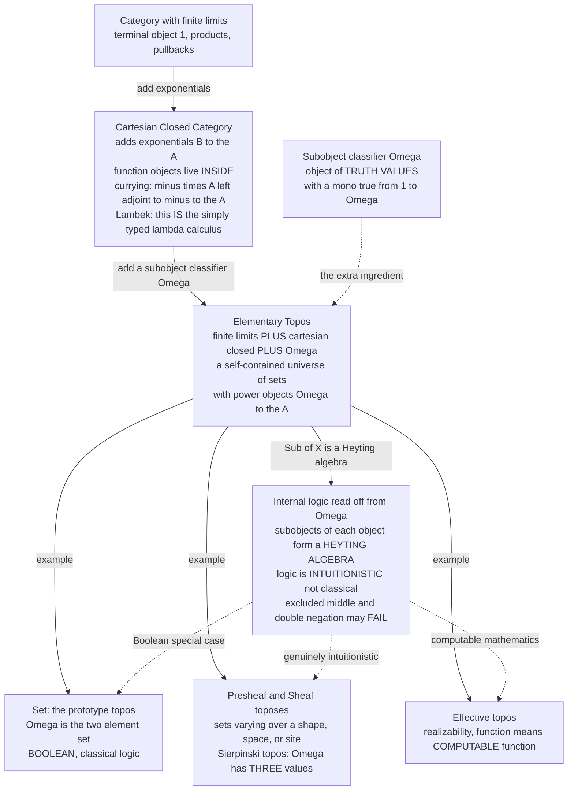

# 🌌 Cartesian Closed Categories and Topos Theory

> [!abstract] TL;DR
> A **cartesian closed category (CCC)** has finite **products** and **exponentials** `B^A` — so "function objects" live *inside* the category, pinned down by the currying adjunction `(− × A) ⊣ (−)^A`; by **Lambek's theorem** a CCC *is* a model of the **simply typed lambda calculus** (types = objects, terms = morphisms, function types = exponentials). Climb one rung higher — add **all finite limits** and a **subobject classifier** `Ω` (an "object of truth values" with a map `true : 1 → Ω` such that every **subobject** of `X` is the *pullback of `true`* along a unique **characteristic map** `χ : X → Ω`) — and you reach an **elementary topos**: a self-contained **universe of sets** with power objects, an object of propositions, and set-like constructions. `Set` is the prototype, but there are *many* toposes, each with its own **internal logic** read off from `Ω`. That logic is generally **intuitionistic**, not classical: the subobjects of each object form a **Heyting algebra**, so excluded middle and double-negation can *fail*. **Presheaf** and **sheaf** toposes model sets-varying-over-a-shape, time, or space (the Sierpinski topos has a *three-valued* `Ω`); the **effective topos** is a universe where "function" means *computable* function. Toposes unify **logic, geometry, and computation** and — via **Lawvere's** vision (ETCS) — offer a *structural* foundation for mathematics in which **structure, not `∈`-membership, is fundamental**. This is the summit of the categorical-logic bridge.

---

## Intuition

**Analogy — a topos is a *possible world* for mathematics, not *the* world.** We usually do mathematics inside one fixed universe: "the sets," with their familiar rules — every element either is or is not in a given subset, every statement is true or false. A **topos** is an alternative, self-contained mathematical universe that still has all the *furniture* you expect — a notion of **element**, of **function**, of **subset**, and of **truth** — but need not obey the familiar rules. Some toposes have a **fuzzy, many-valued logic** where a proposition can be "half true." Some are universes where sets **vary over time**, or over the points of a **space**, or where the only functions that exist are the **computable** ones. Category theory lets you *build* these alternate universes and then do **honest mathematics inside each one** — proving theorems, defining structures, reasoning with an internal language — exactly as you would in ordinary set theory, but with whatever logic that world happens to carry.

The pivot that turns a mere category into such a universe is one object: `Ω`, the **object of truth values**. In ordinary set theory the truth values are just `{true, false}` and "a subset of `X`" is the same data as "a predicate on `X`" — a function `X → {true, false}` that says, of each element, whether it belongs. A **subobject classifier** makes that identification the *definition* of a topos: subsets *are* predicates, predicates *are* maps into `Ω`, and the shape of `Ω` **is** the shape of the world's logic. Change `Ω` from a two-element set to a three-element chain, and the ambient logic quietly stops being Boolean and becomes intuitionistic — without you changing a single other rule.

---

## How It Works

### The ladder: from products to a topos

Topos theory is best read as a short ladder of increasingly rich categories, each rung adding one structure.

1. **Finite limits.** Start with a category that has a **terminal object** `1` ([[Terminal_Initial_and_Zero_Objects]]), all **binary products** `A × B`, and all **pullbacks** — equivalently, all finite limits ([[Limits_and_Colimits]]). Pullbacks are essential: they are how "the subset of `X` where a predicate holds" gets *carved out*.
2. **Cartesian closure.** Add **exponentials** `B^A` — the object of all morphisms `A → B`, the **internal hom** ([[Exponentials_and_Cartesian_Closed_Categories]]). Now functions are first-class objects, and **currying** is a natural bijection `Hom(X × A, B) ≅ Hom(X, B^A)`, the adjunction `(− × A) ⊣ (−)^A`. This is a **CCC**. By **Lambek's theorem** a CCC is exactly a model of the **simply typed lambda calculus** ([[Simply_Typed_Lambda_Calculus]]): objects are types, morphisms are programs, `B^A` is the function type, `eval` is application, currying is `λ`-abstraction (the Curry–Howard–Lambek correspondence, developed in the forthcoming *Curry_Howard_Lambek_Correspondence* sibling).
3. **A subobject classifier `Ω`.** Add one more object `Ω` together with a mono `true : 1 → Ω`, subject to the *classifying* universal property below. A cartesian closed category with all finite limits **and** a subobject classifier is an **elementary topos** (the Lawvere–Tierney axioms).

That final rung is small in statement but enormous in consequence: a topos automatically has **power objects** `P(A) = Ω^A` (the "set of subsets" of `A`), image factorizations, an internal notion of function set, and a full **internal higher-order logic**.

### The subobject classifier `Ω` — the heart of a topos

A **subobject** of `X` is (an isomorphism class of) a **monomorphism** `m : A ↪ X` — a "subset" of `X`. The classifier makes subobjects *representable by maps into a single object*:

> `Ω` is an object with a monomorphism `true : 1 → Ω` such that **for every subobject** `m : A ↪ X` there is a **unique** morphism `χ_m : X → Ω`, the **characteristic map**, making the square below a **pullback**:
>
> ```
>        A ──────────▶ 1
>        │             │
>      m │             │ true
>        ▼             ▼
>        X ────────▶  Ω
>            χ_m
> ```

Read it as "`A` is exactly the part of `X` that `χ_m` sends to `true`." Because the square is a **pullback**, `A` is *recovered* from `χ_m` as the pullback of `true` along `χ_m` — no information is lost. So there is a **natural bijection**

```
{ subobjects of X }  ≅  Hom(X, Ω) ,
```

the categorical form of "**a subset is the same thing as a predicate**." `Ω` is therefore the **object of truth values** / the **type of propositions**. In `Set`, `Ω = {⊤, ⊥}` (a two-element set), `true` picks `⊤`, and `χ_m` is precisely the **indicator function** of the subset `A ⊆ X`. In a presheaf topos `Ω` is the presheaf of **sieves**, and it usually has *more than two* elements — which is where non-classical logic enters.

### The internal logic — why a topos reasons *intuitionistically*

Fix an object `X`. Its subobjects, ordered by inclusion, form a lattice `Sub(X)`. In any topos this lattice is a **Heyting algebra**: it has meets `∧` (intersection of subobjects, via pullback), joins `∨` (union, via images), a top `X` and bottom `0 ↪ X`, and — crucially — a **Heyting implication** `⇒` characterized by `c ≤ (a ⇒ b) ⟺ c ∧ a ≤ b`. Negation is *defined*, not primitive: `¬a := (a ⇒ 0)`.

A Heyting algebra is a **Boolean** algebra *only when* `a ∨ ¬a = ⊤` for all `a`. In a general topos this **fails**, and with it fail the two hallmarks of classical logic:

- **Excluded middle** `p ∨ ¬p = ⊤` need not hold;
- **Double-negation elimination** `¬¬p = p` need not hold — you only ever get `p ≤ ¬¬p`.

So the internal logic of a topos is **intuitionistic** (constructive) by default ([[Intuitionistic_Logic_and_Constructive_Proofs]]). You can literally *do mathematics inside the topos* using its **internal language** — the **Mitchell–Bénabou language**, interpreted by **Kripke–Joyal semantics** — writing quantifiers, function definitions, and proofs as if in set theory, with `Ω` supplying the truth values. `Set` is the special **Boolean** topos where this internal logic collapses back to the familiar classical one. This is the deep unification the forthcoming *Categorical_Logic_and_Type_Theory* sibling develops: **every topos is a model of higher-order intuitionistic type theory**.

### Flow / Architecture



*Each downward arrow adds structure. The dotted arrows show that the same internal logic specializes to classical logic in `Set`, to genuinely many-valued intuitionistic logic in presheaf/sheaf toposes, and to constructive/computable mathematics in the effective topos.*

### A gallery of toposes and their logics

- **`Set` — the classical, Boolean topos.** `Ω = {⊤, ⊥}`; the prototype and the world of ordinary mathematics.
- **Presheaf toposes `Set^(C^op)`** — "sets varying over a shape" ([[Presheaves_and_Representables]]). The simplest non-trivial case is the **Sierpinski / arrow topos**, presheaves on the poset `0 ≤ 1` ("sets through time"): its `Ω` has **three** truth values `false < half < true`, and its logic is a non-Boolean Heyting chain (worked out in the demo).
- **Sheaf toposes on a space or site** — the bridge to **geometry**; a topos is a "generalized space," and Grothendieck's *topos = generalized space* is the origin of the subject.
- **The effective topos** — Hyland's **realizability** topos, where the internal notion of "function" is **computable function**. Inside it, *every* function `ℕ → ℕ` is computable and Church's thesis is internally *true* — the topos-theoretic home of **constructive/computable mathematics**.

### Geometric morphisms, classifying toposes, and Lawvere's foundations

Maps between toposes are **geometric morphisms** — adjoint pairs `f^* ⊣ f_*` with `f^*` left-exact — the categorical analogue of continuous maps between spaces. A topos can also be a **classifying topos** for a geometric theory: it is the "generic model," and maps *into* it correspond to models of the theory elsewhere. This is Grothendieck's vision of toposes as **bridges** between different mathematical presentations of the same content. Finally, **Lawvere's** program (the **Elementary Theory of the Category of Sets**, ETCS) proposes topos theory as a **foundation for mathematics alternative to ZFC**: mathematics done *structurally* — in terms of objects, morphisms, and universal properties — rather than in terms of the membership relation `∈` ([[Mathematical_Logic_and_Set_Theory]]). Toposes are simultaneously **foundations, geometry, and logic**.

### Why it matters for computer science

CCCs are **the** semantics of typed functional languages — `STLC = CCC` is the load-bearing fact behind denotational semantics ([[Denotational_Semantics]]) and everyday **currying** ([[Functional_Programming_Foundations]]). The **effective topos** models realizability and computable mathematics; **presheaf/sheaf** toposes model **context-dependence**, **databases**, and **behavior over time**; and topos logic is the setting for **constructive type theory** and the precursors of **Homotopy Type Theory** ([[Homotopy_Type_Theory]]). The forthcoming *Category_Theory_in_Programming* sibling closes this loop.

---

## Key Concepts

**Secondary (explain to a curious beginner)**
- A **topos** is a *possible world* for mathematics — it has elements, functions, subsets, and truth, but its rules can differ from ordinary set theory.
- The star object is **`Ω`, the "type of truth values."** In ordinary maths `Ω = {true, false}`, and *a subset is just a predicate* — a function saying `true`/`false` for each element.
- Some toposes have **more than two truth values** (a proposition can be "half true"), and then the logic is no longer "either/or": `p or not-p` can fail.
- A **cartesian closed category** is a world where *functions are objects* and **currying** always works; it is exactly the typed lambda calculus in disguise.

**Undergraduate (a first category / logic course)**
- **CCC**: terminal object `1`, all binary products, all exponentials `B^A`; currying is the natural iso `Hom(X × A, B) ≅ Hom(X, B^A)`, i.e. `(− × A) ⊣ (−)^A`.
- **Subobject classifier**: `true : 1 → Ω` such that every mono `A ↪ X` is the **pullback of `true`** along a *unique* `χ : X → Ω`; hence `Sub(X) ≅ Hom(X, Ω)`.
- **Elementary topos** = finite limits + cartesian closed + subobject classifier; automatically has **power objects** `Ω^A`.
- **Internal logic**: `Sub(X)` is a **Heyting algebra**; `∧, ∨, ⇒, ¬` are categorical operations; the topos reasons **intuitionistically**.
- In **`Set`**, `Ω = {⊤, ⊥}` and `χ` is the indicator function — the Boolean special case.

**Graduate (foundational / semantic)**
- **Lawvere–Tierney axioms**; `Ω` classifies subobjects, `P(A) = Ω^A` is the power object, and the topos supports the full **Mitchell–Bénabou internal language** with **Kripke–Joyal** forcing semantics.
- **Heyting-valued semantics**: the internal higher-order logic is intuitionistic; Boolean toposes are exactly those where `¬¬ = id`; a **Lawvere–Tierney topology** `j` on `Ω` carves out **sheaf subtoposes** as `j`-closed subobjects.
- **Presheaf toposes** `Set^(C^op)`: `Ω(c) =` sieves on `c`; the Sierpinski topos over `0 ≤ 1` has a 3-element `Ω` (a Heyting chain).
- **Effective topos**: built from a partial combinatory algebra by realizability; internally validates Church's thesis and models computable mathematics.
- **Geometric morphisms** `f^* ⊣ f_*` (left-exact `f^*`); **classifying toposes** for geometric theories; **ETCS** as a structural foundation rivaling ZFC.

---

## Python Demo

```python
# ======================================================================
# THE SUBOBJECT CLASSIFIER Omega AND A TOPOS'S INTERNAL LOGIC.
#
# PART A -- FinSet (the finite Boolean topos Set).
#   * Omega = {0, 1} = {false, true};  true : 1 -> Omega  picks 1.
#   * Every SUBOBJECT (subset) A of X has a unique CHARACTERISTIC map
#         chi_A : X -> Omega,   chi_A(x) = 1  iff  x in A.
#   * "subobjects of X  <->  maps X -> Omega" is a BIJECTION (2^|X| each).
#   * Verify the PULLBACK universal property: A is exactly the pullback
#     of  true : 1 -> Omega  along  chi_A,  i.e. A = chi_A^{-1}(1).
#
# PART B -- the SIERPINSKI TOPOS: presheaves on the poset 0 <= 1
#   ("sets through time"). Its Omega has THREE truth values, and its
#   internal logic is a NON-BOOLEAN Heyting algebra (the 3-chain), where
#   double negation FAILS:   NOT NOT (half) = true  !=  half.
#
# VISUALIZE: (left) the subobject-classifier pullback square;
#            (right) the 3-valued Heyting truth lattice with negations.
# Pure standard library + matplotlib. numpy NOT required.
# ======================================================================
import sys
from itertools import combinations
import matplotlib.pyplot as plt

try:                                   # print unicode safely on any console
    sys.stdout.reconfigure(encoding="utf-8")
except Exception:
    pass


# ======================================================================
# PART A -- FinSet: Omega = {0,1}, subobjects <-> characteristic maps,
#           and the pullback-of-true universal property.
# ======================================================================
def powerset(s):
    s = list(s)
    return [frozenset(c) for r in range(len(s) + 1) for c in combinations(s, r)]

X = ("a", "b", "c")          # a small object of FinSet
OMEGA = (0, 1)               # 0 = false, 1 = true
TRUE = 1                     # the point picked by  true : 1 -> Omega

def char_map(A):
    """chi_A : X -> Omega,  x |-> 1 if x in A else 0  (the indicator function)."""
    return {x: (1 if x in A else 0) for x in X}

def pullback_of_true(chi):
    """The pullback of  true : 1 -> Omega  along chi is  {x : chi(x) = TRUE}."""
    return frozenset(x for x in X if chi[x] == TRUE)

subobjects = powerset(X)                       # every subset (mono) of X
chis = {A: char_map(A) for A in subobjects}    # each has a characteristic map

# (1) subobjects <-> maps X -> Omega is a BIJECTION: 2^|X| on each side,
#     and distinct subobjects give distinct chi.
distinct_chis = {tuple(sorted(c.items())) for c in chis.values()}
assert len(subobjects) == 2 ** len(X)
assert len(distinct_chis) == len(subobjects)   # injective (hence bijective)

# (2) the PULLBACK universal property recovers every subobject exactly.
assert all(pullback_of_true(chis[A]) == A for A in subobjects)

print("=== PART A: FinSet, the Boolean topos ===")
print(f"  X = {set(X)},  Omega = {set(OMEGA)},  true picks {TRUE}")
print(f"  subobjects of X : {len(subobjects)}   maps X -> Omega : "
      f"{2 ** len(X)}   -> BIJECTION")
demo_A = frozenset({"a", "c"})
print(f"  example subobject A = {set(demo_A)}")
print(f"    chi_A            = {char_map(demo_A)}")
print(f"    pullback of true = {set(pullback_of_true(char_map(demo_A)))}"
      "   (recovers A)")

# Boolean sanity: in FinSet the internal logic is classical.
def b_not(p):  return 1 - p
assert all((p or b_not(p)) == 1 for p in OMEGA)          # excluded middle holds
assert all(b_not(b_not(p)) == p for p in OMEGA)          # NOT NOT p = p
print("  internal logic: excluded middle holds, NOT NOT p = p  -> CLASSICAL\n")


# ======================================================================
# PART B -- the Sierpinski topos: presheaves on  0 <= 1.
# First, confirm Omega really has THREE truth values by computing the
# subobjects of the terminal presheaf (= global truth values).
# A truth value = a subpresheaf of 1: a bit at stage 1 and a bit at
# stage 0 with the restriction constraint  present-at-1  =>  present-at-0.
# ======================================================================
truth_values = [(s1, s0) for s1 in (0, 1) for s0 in (0, 1) if s1 <= s0]
#   (0,0) = false  |  (0,1) = half (present only at stage 0)  |  (1,1) = true
name = {(0, 0): "false", (0, 1): "half", (1, 1): "true"}
print("=== PART B: Sierpinski topos (sets through time on 0 <= 1) ===")
print(f"  Omega has {len(truth_values)} truth values: "
      f"{[name[t] for t in truth_values]}   -> NON-Boolean")

# The Heyting algebra on the 3-chain  0 < 1/2 < 1.
VALS = [0.0, 0.5, 1.0]
labels = {0.0: "false", 0.5: "half", 1.0: "true"}
def meet(a, b):    return min(a, b)                 # conjunction
def join(a, b):    return max(a, b)                 # disjunction
def implies(a, b): return 1.0 if a <= b else b      # Heyting implication
def hneg(a):       return implies(a, 0.0)           # negation = (a => false)

print("  negation table (NOT a = a => false):")
for a in VALS:
    print(f"    NOT {labels[a]:>5} = {labels[hneg(a)]}")

# The punchline: double negation and excluded middle FAIL on 'half'.
half = 0.5
nn_half = hneg(hneg(half))
lem_half = join(half, hneg(half))
print(f"  NOT NOT half = {labels[nn_half]}   !=   half        "
      "-> double negation FAILS")
print(f"  half OR NOT half = {labels[lem_half]}   !=   true   "
      "-> excluded middle FAILS")
assert nn_half != half and lem_half != 1.0        # intuitionistic, not Boolean
# ...but the outer values still behave classically:
assert hneg(hneg(0.0)) == 0.0 and hneg(hneg(1.0)) == 1.0
print("  (yet NOT NOT false = false and NOT NOT true = true)  "
      "-> INTUITIONISTIC\n")


# ======================================================================
# VISUALIZE.
# Left : the subobject-classifier pullback square (A, 1, X, Omega).
# Right: the Sierpinski Omega as a 3-chain Heyting lattice with negations.
# ======================================================================
fig, (axL, axR) = plt.subplots(1, 2, figsize=(14, 6.2))

# ---- Left: the pullback square -------------------------------------
box = dict(boxstyle="round,pad=0.35", fc="#e3f2fd", ec="#1565c0", lw=1.8)
box_t = dict(boxstyle="round,pad=0.35", fc="#fff3e0", ec="#e65100", lw=1.8)
corners = {
    "A":  (0.16, 0.82, "A  =  chi to the -1 of true\nthe subobject", box),
    "1":  (0.82, 0.82, "1\nterminal", box_t),
    "X":  (0.16, 0.18, "X", box),
    "Om": (0.82, 0.18, "Omega\ntruth values", box_t),
}
for key, (x, y, txt, style) in corners.items():
    axL.text(x, y, txt, ha="center", va="center", fontsize=11,
             fontweight="bold", bbox=style, zorder=3)

def arrow(ax, p, q, label, dx=0.0, dy=0.0, color="#37474f"):
    ax.annotate("", xy=q, xytext=p,
                arrowprops=dict(arrowstyle="-|>", color=color, lw=2,
                                shrinkA=22, shrinkB=22), zorder=2)
    ax.text((p[0] + q[0]) / 2 + dx, (p[1] + q[1]) / 2 + dy, label,
            ha="center", va="center", fontsize=10, color=color,
            fontstyle="italic")

pA, p1, pX, pOm = (0.16, 0.82), (0.82, 0.82), (0.16, 0.18), (0.82, 0.18)
arrow(axL, pA, p1, "!  unique", dy=0.05)                      # A -> 1
arrow(axL, pA, pX, "m   mono\n(subobject)", dx=-0.075)        # A -> X
arrow(axL, pX, pOm, "chi   characteristic", dy=-0.05)         # X -> Omega
arrow(axL, p1, pOm, "true", dx=0.055, color="#e65100")       # 1 -> Omega
# pullback-corner marker at A
axL.plot([0.235, 0.235, 0.28], [0.72, 0.765, 0.765], color="#b71c1c", lw=1.6)
axL.text(0.49, 0.52, "PULLBACK", ha="center", color="#b71c1c",
         fontsize=12, fontweight="bold")
axL.text(0.49, 0.02, "subobjects of X   <->   maps  X -> Omega",
         ha="center", fontsize=11, color="#1565c0", fontweight="bold")
axL.set_xlim(0, 1); axL.set_ylim(-0.05, 1.0); axL.axis("off")
axL.set_title("Subobject classifier: A is the pullback of true along chi",
              fontsize=11.5)

# ---- Right: the Sierpinski Omega as a Heyting 3-chain ---------------
ys = {0.0: 0.15, 0.5: 0.5, 1.0: 0.85}
face = {0.0: "#ffcdd2", 0.5: "#fff9c4", 1.0: "#c8e6c9"}
axR.plot([0.42, 0.42], [ys[0.0], ys[1.0]], color="#90a4ae", lw=2, zorder=1)
for v in VALS:
    axR.scatter([0.42], [ys[v]], s=2900, color=face[v],
                edgecolors="#455a64", linewidths=1.8, zorder=2)
    axR.text(0.42, ys[v], f"{labels[v]}\n({v})", ha="center", va="center",
             fontsize=11, fontweight="bold", zorder=3)
    axR.text(0.70, ys[v], f"NOT {labels[v]} = {labels[hneg(v)]}",
             ha="left", va="center", fontsize=10, color="#c62828")
# highlight the failure of double negation on 'half'
axR.annotate("NOT NOT half = true  !=  half\ndouble negation FAILS",
             xy=(0.42, ys[0.5]), xytext=(0.10, 0.72),
             fontsize=10, color="#6a1b9a", fontweight="bold",
             arrowprops=dict(arrowstyle="-|>", color="#6a1b9a", lw=1.6))
axR.set_xlim(0, 1.1); axR.set_ylim(0, 1.0); axR.axis("off")
axR.set_title("Sierpinski topos Omega: intuitionistic 3-chain\n"
              "excluded middle and double negation fail", fontsize=11.5)

fig.suptitle("The subobject classifier Omega and a topos's internal logic",
             fontsize=13)
fig.tight_layout()
plt.savefig("topos_subobject_classifier.png", dpi=130)
print("Saved figure to topos_subobject_classifier.png")
```

Running it verifies every claim in code. **Part A** builds the finite Boolean topos: the eight subsets of `X` are in exact bijection with the eight maps `X → Ω = {0,1}`, each subobject's **characteristic map** is its indicator function, and the assertion `pullback_of_true(χ_A) == A` confirms the **universal property** — `A` is literally the pullback of `true` along `χ_A`. It also checks that `Set`'s internal logic is **classical** (excluded middle holds, `¬¬p = p`). **Part B** computes the **Sierpinski topos** `Ω` by counting subobjects of the terminal presheaf and finds **three** truth values `false < half < true`, then equips that chain with its **Heyting algebra** structure. The punchline prints and asserts that `¬¬half = true ≠ half` and `half ∨ ¬half = half ≠ true` — **double negation and excluded middle fail** — while `¬¬` still fixes the endpoints, so the logic is genuinely **intuitionistic**, not Boolean. The figure draws the classifying **pullback square** on the left and the **three-valued Heyting lattice** with its negation table on the right.

---

## Real-World Applications

> **Example — Haskell/ML type systems are CCCs, and their compilers reason categorically.** In a typed functional language the **types are objects**, **functions are morphisms**, the **tuple type is the product**, `()` is the **terminal object**, and the **function type `a -> b` is the exponential `b^a`** — so `curry`/`uncurry` are the *literal* currying isomorphism and application is `eval`. This is Lambek's theorem in production: Conal Elliott's **"Compiling to Categories"** reinterprets a lambda term as a morphism in *any* CCC the user supplies, retargeting the same source to circuits, derivatives, or interval analysis. Denotational semantics ([[Denotational_Semantics]]) interprets programs as morphisms in a CCC of domains so that program equality *is* morphism equality.

Beyond language cores:

- **Constructive / computable mathematics.** The **effective topos** is a universe where every function is computable and Church's thesis holds internally — the natural home for **realizability** interpretations of constructive proofs and for extracting programs from proofs.
- **Databases and data-over-context.** A schema is a small category and a database instance is a **presheaf** into `Set`; queries and constraints are morphisms, and the presheaf **topos** supplies a logic for consistency and data migration.
- **Behavior over time / concurrency.** The **Sierpinski** and more general presheaf toposes model **sets that vary over stages** — protocol states, monotone knowledge, Kripke models of modal and intuitionistic logic — with `Ω` encoding *when* a proposition becomes true.
- **Geometry and cohomology.** **Sheaf toposes** are "generalized spaces"; sheaf cohomology, étale cohomology, and Grothendieck's reformulation of geometry all live in topos-theoretic language.
- **Foundations of mathematics.** **ETCS** and the univalent/HoTT program ([[Homotopy_Type_Theory]]) pursue *structural* foundations where equivalent structures are interchangeable — a direct descendant of topos-theoretic thinking.

---

## Common Pitfalls

- **Thinking "topos = weird set theory you can ignore."** A topos is a *bona fide* universe with its own consistent mathematics; theorems proved with only intuitionistically valid reasoning **transfer to every topos**. Dismissing it misses that many independence and constructivity results are exactly "true in one topos, false in another."
- **Assuming the logic is classical.** A topos is intuitionistic by **default**; `p ∨ ¬p` and `¬¬p = p` can fail. Only **Boolean toposes** (like `Set`) validate them. Importing classical shortcuts — proof by contradiction of a positive statement, choice, trichotomy — into internal-language reasoning is the most common error.
- **Confusing `Ω` with a two-element set.** `Ω = {⊤, ⊥}` **only** in Boolean toposes. In presheaf toposes `Ω` is the object of **sieves** and typically has many elements (three in the Sierpinski topos). The number and structure of `Ω`'s "points" *is* the topos's logic.
- **Forgetting the *uniqueness* of the characteristic map.** The classifier property requires that each subobject `A ↪ X` have a **unique** `χ` making the square a **pullback**. Existence alone is not enough; uniqueness is what makes `Sub(X) ≅ Hom(X, Ω)` a genuine bijection and pins down `Ω`.
- **Mistaking a CCC for a topos.** Cartesian closed is necessary but **not** sufficient. A topos additionally needs **all finite limits** and a **subobject classifier**. There are CCCs (e.g. many domains-for-recursion categories) that are *not* toposes.
- **Reading the pullback square backwards.** The mono `m : A ↪ X` is *classified by* `χ : X → Ω`; the arrow whose pullback gives `A` is `true : 1 → Ω`, not the other way around. `A = χ^{-1}(true)`, the fiber of `true`.
- **Confusing geometric morphisms with plain functors.** A **geometric morphism** is an adjoint pair `f^* ⊣ f_*` with `f^*` *left-exact* (preserving finite limits). Treating any old functor between toposes as a geometric morphism breaks the space-like intuition and the logic-preservation guarantees.

---

## Related Concepts

- [[Exponentials_and_Cartesian_Closed_Categories]] — the rung below: CCCs, currying, and Lambek's theorem; a topos *is* a CCC with finite limits and `Ω`.
- [[Presheaves_and_Representables]] — presheaf categories `Set^(C^op)` are the leading examples of toposes; `Ω` is the presheaf of sieves (the Sierpinski topos lives here).
- [[Universal_Properties]] — the subobject classifier is defined by a universal (pullback) property; `Ω` *represents* the subobject functor `Sub(−)`.
- [[Terminal_Initial_and_Zero_Objects]] — `true : 1 → Ω` starts at the terminal object `1`; `1` is the domain of "global elements" and truth values.
- [[Limits_and_Colimits]] — a topos has **all finite limits** (pullbacks carve out subobjects) and, in fact, all finite colimits too.
- [[Products_and_Coproducts]] — products give `× ` (conjunction of contexts) and coproducts give `+` (disjunction) in the internal logic.
- [[The_Yoneda_Lemma]] — `Sub(X) ≅ Hom(X, Ω)` is a representability statement: `Ω` represents the subobject functor, à la Yoneda.
- [[Natural_Transformations]] — morphisms of presheaves (hence of internal structures) are natural transformations; the classifier bijection is natural in `X`.
- [[Functors]] — the power-object operation `A ↦ Ω^A` and geometric morphisms are functorial constructions on toposes.
- [[Diagrams_and_Commutativity]] — the classifier axiom is a *commuting pullback square*; internal logic is diagram-chasing.
- [[Monads_Categorically]] — sheafification is a (left-exact) localization built from a monad; monads organize the modalities `j` on `Ω`.
- [[Simply_Typed_Lambda_Calculus]] — Lambek's theorem: a CCC is a model of the STLC; a topos's internal language extends this to higher-order type theory.
- [[Intuitionistic_Logic_and_Constructive_Proofs]] — the *default* logic of any topos; `Sub(X)` is a Heyting algebra, so excluded middle and `¬¬`-elimination may fail.
- [[The_Curry_Howard_Correspondence]] — the logic/types/categories bridge whose categorical leg culminates in topos-valued (higher-order intuitionistic) semantics.
- [[Homotopy_Type_Theory]] — `∞`-toposes and univalence are the modern extension of topos logic; presheaves on `Δ` (simplicial sets) are its models.
- [[Denotational_Semantics]] — programs as morphisms in a CCC/topos of domains; the semantic payoff of cartesian closure and internal logic.
- [[Functional_Programming_Foundations]] — `curry`/`uncurry`, closures, and higher-order functions *are* the exponential structure a topos carries.
- [[Linear_Logic_and_Resource_Types]] — the *monoidal* (non-cartesian) cousin, where the internal hom models linear implication `⊸`; toposes sit at the cartesian extreme.
- [[Mathematical_Logic_and_Set_Theory]] — topos theory (ETCS) as a *structural* foundation alternative to `∈`-based ZFC; Boolean toposes recover classical set theory.
- [[Category_Theory]] — the umbrella framework; this note is the categorical-logic summit where structure becomes a universe.

*Forthcoming Category Theory siblings referenced in prose — to be wikilinked once written — are **Adjunctions**, **Curry_Howard_Lambek_Correspondence**, **Categorical_Logic_and_Type_Theory**, and **Category_Theory_in_Programming**.*

---

## Review Questions

**Secondary.**
1. In the "possible worlds" picture, what four pieces of "furniture" does every topos provide, and what does the object `Ω` stand for? Give one example of a topos whose logic is *not* the familiar "either true or false."
2. In `Set`, if `A = {a, c}` is a subset of `X = {a, b, c}`, write down the characteristic map `χ_A : X → {true, false}` and explain in one sentence how it "classifies" the subset.

**Undergraduate.**
3. State the universal property of the subobject classifier as a **pullback** square, and explain why the *uniqueness* of `χ` is what makes `Sub(X) ≅ Hom(X, Ω)` a bijection.
4. Define the Heyting operations `∧, ∨, ⇒, ¬` on `Sub(X)` conceptually. On the 3-chain `false < half < true`, compute `¬half`, `¬¬half`, and `half ∨ ¬half`, and explain which classical laws fail.
5. Give the definition of an **elementary topos** as three ingredients, and give one example of a cartesian closed category that is *not* a topos, saying which ingredient it lacks.

**Graduate.**
6. Compute the subobject classifier `Ω` of the Sierpinski topos (presheaves on `0 ≤ 1`) as sieves, showing `|Ω(0)| = 2` and `|Ω(1)| = 3`, and identify the three *global* truth values with subobjects of the terminal presheaf.
7. Explain, using the internal language, why a general topos validates only intuitionistic logic. What extra condition on `Ω` (or on the Lawvere–Tierney topology) makes a topos **Boolean**, and why does that recover classical reasoning?
8. Sketch Lawvere's case that topos theory (ETCS) can serve as a *structural* foundation for mathematics rivaling ZFC. What does "structure, not membership, is fundamental" mean operationally, and where do geometric morphisms and classifying toposes fit into the picture?

---

## Sources

- Mac Lane, S. and Moerdijk, I. *Sheaves in Geometry and Logic: A First Introduction to Topos Theory*. Springer, 1992 — the standard modern introduction; subobject classifier, internal logic, sheaf and presheaf toposes, geometric morphisms.
- Johnstone, P. T. *Sketches of an Elephant: A Topos Theory Compendium*. Oxford University Press, 2002 — the encyclopedic reference on elementary and Grothendieck toposes.
- Lambek, J. and Scott, P. J. *Introduction to Higher-Order Categorical Logic*. Cambridge University Press, 1986 — CCCs, the internal language, and the CCC ↔ typed lambda calculus (Lambek) correspondence leading into topos logic.
- Goldblatt, R. *Topoi: The Categorial Analysis of Logic*. North-Holland, 1984 (Dover reprint) — an accessible logic-first account of toposes, `Ω`, and intuitionistic internal logic.
- Lawvere, F. W. "An Elementary Theory of the Category of Sets." *Proc. Natl. Acad. Sci. USA*, 1964 — the founding paper for a structural, categorical foundation of set theory (ETCS).
- nLab, "topos", "subobject classifier", and "internal logic" — https://ncatlab.org/nlab/show/topos , https://ncatlab.org/nlab/show/subobject+classifier , https://ncatlab.org/nlab/show/internal+logic.

---

#category-theory #topos-theory #cartesian-closed #subobject-classifier #internal-logic
