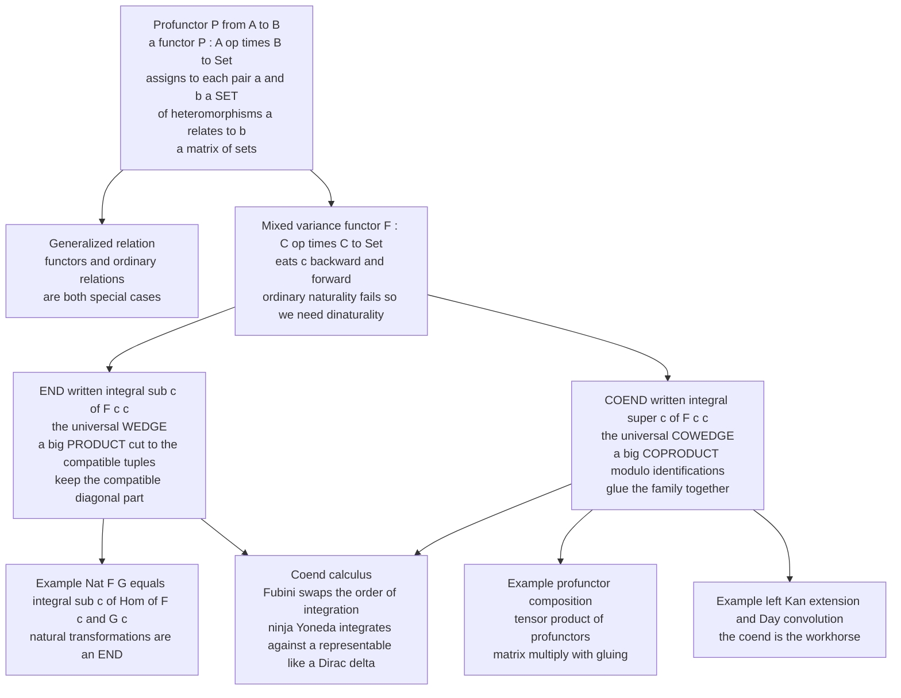

# 🧮 Ends, Coends and Profunctors

> [!abstract] TL;DR
> A **profunctor** $P: A \nrightarrow B$ (a.k.a. *distributor* or *bimodule*) is a functor $P: A^{\operatorname{op}} \times B \to \mathbf{Set}$ — a **"matrix of sets"** assigning to each pair $(a,b)$ a *set* of "heteromorphisms" $a \rightsquigarrow b$. Profunctors generalize both functors and ordinary relations, and they **compose like matrices** — but the "sum over the middle index" is a **coend**, matrix multiplication *with gluing*. An **end** $\int_c F(c,c)$ and a **coend** $\int^c F(c,c)$ are the two universal ways to collapse a *mixed-variance* functor $F: C^{\operatorname{op}} \times C \to \mathbf{Set}$ down to a single object: the end is a **big product with a compatibility (equalizer) condition** — "the compatible diagonal part" — and the coend is a **big coproduct with identifications** — "glue the family together." Category theorists write them with **integral signs** because they obey a genuine *calculus*: a **Fubini theorem** (swap the order of integration), a **Yoneda reduction** (integrating against a representable is substitution, like a Dirac delta), and **density**. This turns pages of diagram-chasing into a few lines of integral manipulation, and it is the engine behind $\operatorname{Nat}(F,G) = \int_c \operatorname{Hom}(Fc, Gc)$, left Kan extensions, Day convolution, parametricity, existential types, and profunctor optics.

---

## Intuition

**Analogy — a profunctor is a bipartite graph of "ways to relate."** Picture two different worlds $A$ and $B$ — say *authors* on the left and *books* on the right. An ordinary **relation** would draw a single edge whenever an author "relates to" a book (wrote it, yes-or-no). A **profunctor** is richer: between each author $a$ and each book $b$ it hangs a whole **set** $P(a,b)$ — *all the distinct ways* $a$ relates to $b$ (co-author, editor, translator, cited-in...). It is a **matrix whose entries are sets**, not just $0$/$1$. And crucially it is *variance-aware*: relabelling authors along an arrow acts on one index, relabelling books acts on the other.

Now suppose you have a second profunctor $Q$ from *books* to *shelves*, and you want the composite "authors $\rightsquigarrow$ shelves." You do what matrix multiplication does: for a fixed author $a$ and shelf $s$, run over every book $b$ in the middle and collect pairs $(\text{a-relates-to-}b,\ b\text{-relates-to-}s)$. But two paths that differ only by *sliding a book-morphism across the middle* describe **the same composite relationship** and must be **identified**. That "sum over the middle, then glue" is exactly a **coend** $\int^b P(a,b) \times Q(b,s)$ — a big disjoint union modulo the gluing, the categorical cousin of the module tensor product $M \otimes_R N$ where $m \cdot r \otimes n = m \otimes r \cdot n$.

The **end** is the dual instinct: instead of *gluing everything together*, you keep only the **compatible part**. Given a construction $F(c,c)$ that consumes one copy of $c$ contravariantly and one covariantly, the end $\int_c F(c,c)$ is the largest set of "diagonal elements" that transform *coherently* under every morphism — a big **intersection / product with a compatibility condition**. The headline instance: the coherent families $\phi_c: Fc \to Gc$ are precisely the **natural transformations**, so $\operatorname{Nat}(F,G) = \int_c \operatorname{Hom}(Fc, Gc)$. Ends *take the compatible part*; coends *glue the family together*; and both are written as integrals because you can compute with them like integrals.

---

## How It Works

### Profunctors: a "matrix of sets" between categories

A **profunctor** from $A$ to $B$, written $P: A \nrightarrow B$, is a functor

$$P: A^{\operatorname{op}} \times B \longrightarrow \mathbf{Set}.$$

Unwound, $P$ gives (i) a set $P(a,b)$ for every pair, (ii) a **left action** — for $f: a' \to a$ in $A$, a map $f^*: P(a,b) \to P(a',b)$ (contravariant in $A$, "precompose"), and (iii) a **right action** — for $g: b \to b'$ in $B$, a map $g_*: P(a,b) \to P(a,b')$ (covariant in $B$, "postcompose"), with the two actions commuting. Think of an element $p \in P(a,b)$ as a *heteromorphism* $a \rightsquigarrow b$; the actions let you pre- and post-compose it with genuine morphisms of $A$ and $B$.

Profunctors interpolate between two familiar worlds:

- **Functors become profunctors.** A functor $F: A \to B$ induces the *representable* profunctor $B(F-, -): A^{\operatorname{op}} \times B \to \mathbf{Set}$, $(a,b) \mapsto \operatorname{Hom}_B(Fa, b)$ — its "graph." So functors sit inside $\mathbf{Prof}$ as a special case (this generalizes $\operatorname{Hom}$, the star of [[Presheaves_and_Representables]] and [[The_Yoneda_Lemma]]).
- **Relations become profunctors.** Valued in the two-element poset $\mathbf{2} = \{0 \le 1\}$ instead of $\mathbf{Set}$, a profunctor between preorders *is* an order-compatible relation. Profunctors are "relations with witnesses."

They also form a **bicategory** $\mathbf{Prof}$: objects are categories, $1$-cells are profunctors, $2$-cells are natural transformations, and **composition is by coend** (below). This is the "matrix algebra of categories," and it is the natural home of enriched and higher-categorical constructions ([[Enriched_and_Higher_Categories]]).

### Dinaturality and wedges: why ends/coends are needed

The trouble starts with **mixed variance**. A functor $F: C^{\operatorname{op}} \times C \to \mathbf{Set}$ eats one copy of $C$ *backwards* and one *forwards* — think $\operatorname{Hom}(Fc, Gc)$, contravariant in the input functor, covariant in the output. You cannot form an ordinary limit or colimit over "the diagonal," because ordinary [[Natural_Transformations|naturality]] wants a single variance. The correct compatibility notion is **dinaturality**.

- A **wedge** from a set $S$ to $F$ is a family $w_c: S \to F(c,c)$ such that for every morphism $h: c \to c'$,
  $$F(\operatorname{id}_c, h) \circ w_c \;=\; F(h, \operatorname{id}_{c'}) \circ w_{c'}.$$
  The **end** $\int_c F(c,c)$ is the **universal (terminal) wedge**: a set $E$ with a wedge $\pi_c: E \to F(c,c)$ through which every other wedge factors uniquely. Concretely it is the **equalizer**
  $$\int_c F(c,c) \;=\; \operatorname{eq}\!\Big(\textstyle\prod_c F(c,c) \rightrightarrows \prod_{h: c\to c'} F(c,c')\Big)$$
  — a **big product** cut down to the tuples that satisfy the wedge condition for *every* arrow.
- A **cowedge** from $F$ to $S$ dualizes all arrows; the **coend** $\int^c F(c,c)$ is the **universal (initial) cowedge**, the **coequalizer**
  $$\int^c F(c,c) \;=\; \operatorname{coeq}\!\Big(\textstyle\coprod_{h: c\to c'} F(c',c) \rightrightarrows \coprod_c F(c,c)\Big)$$
  — a **big coproduct** modulo identifications: for each $h: c \to c'$ and each $x \in F(c',c)$, glue $F(h,\operatorname{id})(x) \sim F(\operatorname{id},h)(x)$.

**Mnemonic:** subscript $\int_c$ = **end** = product-flavoured = *keep the compatible part*; superscript $\int^c$ = **coend** = coproduct-flavoured = *glue the family together*.

### The two headline formulas

1. **The end formula for natural transformations.** For $F, G: C \to \mathbf{Set}$,
   $$\operatorname{Nat}(F,G) \;=\; \int_c \operatorname{Hom}\big(Fc,\, Gc\big).$$
   An element of the end is exactly a family $\phi_c: Fc \to Gc$ with $G(h)\circ\phi_c = \phi_{c'}\circ F(h)$ for every $h$ — the naturality square. The whole hom-set of a [[Functor_Categories_and_Naturality|functor category]] is one clean integral.

2. **The coend formula for profunctor composition.** For $P: A \nrightarrow B$ and $Q: B \nrightarrow C$,
   $$(Q \circ P)(a,c) \;=\; \int^{b \in B} P(a,b) \times Q(b,c).$$
   This is **matrix multiplication with gluing**: the naive disjoint union $\coprod_b P(a,b)\times Q(b,c)$ is the "matrix sum of products," and the coend quotients it by sliding $B$-morphisms across the tensor, exactly like $\otimes_R$ for bimodules.

### The co/Yoneda "ninja" lemma and coend calculus

The reason the integral notation is more than cute is that it obeys a **calculus**:

- **Fubini.** $\int_c \int_d F \cong \int_d \int_c F$ and likewise for coends — you may swap the order of (co)integration, and iterated ends over a product category collapse to a single end.
- **Yoneda reduction (the "ninja" / co-Yoneda lemma).** Integrating against a representable is *substitution*:
  $$\int^{c} \operatorname{Hom}(c, x) \times F(c) \;\cong\; F(x), \qquad \int_{c} \mathbf{Set}\big(\operatorname{Hom}(x,c),\, F(c)\big) \;\cong\; F(x).$$
  The representable $\operatorname{Hom}(c,x)$ behaves like a **Dirac delta** $\delta(c,x)$: "integrate $F$ against it and you land on $F(x)$." Equivalently, *every functor is a coend of representables* — the density theorem of [[Presheaves_and_Representables]].

With these three moves, results like the **left Kan extension** formula $\operatorname{Lan}_K F(d) = \int^{c} \operatorname{Hom}(Kc, d) \cdot Fc$, and **Day convolution** $(F \star G)(z) = \int^{x,y} \operatorname{Hom}(x \otimes y, z) \times Fx \times Gy$ (which lifts a monoidal product from $C$ to the functor category $[C, \mathbf{Set}]$ — see [[Monoids_and_Monoidal_Categories]] and [[Kan_Extensions]]), fall out in a few lines instead of pages of diagrams. This is Loregian's **coend calculus**.



---

## Key Concepts

### Secondary (intuition first)
- **Profunctor = matrix of sets.** Between two categories, hang a whole *set* of "ways to relate" over each pair of objects; a plain relation is the $0/1$ shadow of this.
- **Coend = sum with gluing.** To compose profunctors you multiply matrices, but you must *glue together* entries that describe the same composite — a disjoint union modulo identifications.
- **End = intersection of the compatible part.** Keep only the "diagonal" data that transforms coherently under every arrow.
- **Slogan.** *Coends glue; ends filter; both are written as integrals because you can compute with them like integrals.*

### Undergraduate (the machinery)
- **Profunctor** $P: A \nrightarrow B$ is a functor $A^{\operatorname{op}} \times B \to \mathbf{Set}$: a set $P(a,b)$, a contravariant left $A$-action, a covariant right $B$-action.
- **Dinatural / wedge condition.** For $F: C^{\operatorname{op}} \times C \to \mathbf{Set}$, a wedge $w_c: S \to F(c,c)$ satisfies $F(\operatorname{id},h)\circ w_c = F(h,\operatorname{id})\circ w_{c'}$; the **end** is the universal such wedge (an **equalizer** of two maps out of $\prod_c F(c,c)$).
- **Coend** = the dual **coequalizer** of two maps into $\coprod_c F(c,c)$; a quotient of a disjoint union by the sliding identification.
- **End formula:** $\operatorname{Nat}(F,G) = \int_c \operatorname{Hom}(Fc, Gc)$ — the wedge condition *is* naturality.
- **Coend formula:** $(Q\circ P)(a,c) = \int^b P(a,b)\times Q(b,c)$ — profunctor composition, the "tensor product of profunctors."

### Graduate (structure and reach)
- **The bicategory $\mathbf{Prof}$.** Categories, profunctors, natural transformations; horizontal composition by coend, identity profunctor $\operatorname{Hom}_A$. Monads in $\mathbf{Prof}$ are (small) categories; certain adjunctions recover functors.
- **Co/Yoneda (ninja) lemma.** $F(x) \cong \int^c \operatorname{Hom}(c,x)\times Fc \cong \int_c \mathbf{Set}(\operatorname{Hom}(x,c), Fc)$: representables act as Dirac deltas; every (co)presheaf is a (co)limit of representables (**density**).
- **Kan extensions as coends/ends.** $\operatorname{Lan}_K F(d) = \int^c \operatorname{Hom}(Kc,d)\cdot Fc$ and $\operatorname{Ran}_K F(d) = \int_c \operatorname{Hom}(d, Kc) \pitchfork Fc$ — the calculational definitions developed in [[Kan_Extensions]].
- **Weighted (co)limits.** $\operatorname{colim}^W F = \int^c Wc \cdot Fc$ and $\lim^W F = \int_c Fc^{\,Wc}$; ordinary (co)limits are the terminal-weighted case.
- **Day convolution.** A monoidal structure on $[C,\mathbf{Set}]$ from a monoidal $C$, built as a coend; the categorical account of generating-function convolution and of applicative/monoidal structure in functional programming.
- **Enriched generality.** Everything above runs in any (nice) $\mathcal{V}$-enriched setting; profunctors between $\mathcal{V}$-categories are the enriched "relations," and Lawvere's generalized metric spaces are $[0,\infty]$-enriched categories whose profunctors are distance-preserving bimodules ([[Enriched_and_Higher_Categories]]).

---

## Python Demo

```python
"""
Ends, Coends, and Profunctors -- concrete finite computations.

Part 1  COEND / profunctor composition (the "tensor product of profunctors"):
        represent profunctors over finite categories as tables of finite sets,
        then compute  (Q o P)(a,c) = INT^b  P(a,b) x Q(b,c)  as a QUOTIENT of the
        disjoint union by the coend (dinaturality) relation -- matrix
        multiplication WITH GLUING -- and verify the result is again a profunctor
        by checking its induced C-action is well defined on the quotient.

Part 2  END formula for natural transformations:
        Nat(F,G) = INT_c Hom(Fc, Gc), computed as the SET of families
        compatible with every morphism (the wedge / equalizer condition),
        and checked against the hand-enumerated natural transformations.

Visualize both:  coend as a bipartite gluing graph, end as an equalizer.
Pure standard library + matplotlib.  No numpy required.
"""

from itertools import product
from collections import defaultdict
import matplotlib
matplotlib.use("Agg")               # headless-safe backend
import matplotlib.pyplot as plt


# ======================================================================
# A tiny union-find, used to build the coend quotient
# ======================================================================
class UnionFind:
    def __init__(self, items):
        self.parent = {x: x for x in items}

    def find(self, x):
        while self.parent[x] != x:
            self.parent[x] = self.parent[self.parent[x]]   # path compression
            x = self.parent[x]
        return x

    def union(self, a, b):
        ra, rb = self.find(a), self.find(b)
        if ra != rb:
            self.parent[ra] = rb

    def classes(self):
        groups = defaultdict(list)
        for x in self.parent:
            groups[self.find(x)].append(x)
        return list(groups.values())


# ======================================================================
# PART 1 -- COEND: profunctor composition over finite categories
# ======================================================================
# B = "walking arrow":  b0 --beta--> b1  (plus identities).
# C = "walking arrow":  c0 --gamma--> c1 (plus identities).  A = one object *.
#
# P : A^op x B -> Set  reduces to a COPRESHEAF on B (covariant "right action"):
P = {"b0": ["p0", "p1"], "b1": ["p2", "p3"]}
P_beta = {"p0": "p2", "p1": "p3"}                 # P(beta): P(b0) -> P(b1)  (injective)

# Q : B^op x C -> Set  (contravariant in b, covariant in c):
Q = {("b0", "c0"): ["r0"], ("b0", "c1"): ["r1"],
     ("b1", "c0"): ["q0"], ("b1", "c1"): ["q1"]}
Q_beta  = {"c0": {"q0": "r0"}, "c1": {"q1": "r1"}}    # beta^* : Q(b1,c) -> Q(b0,c)
Q_gamma = {"b0": {"r0": "r1"}, "b1": {"q0": "q1"}}    # gamma_* : Q(b,c0) -> Q(b,c1)
# (beta^* and gamma_* commute -> Q is a genuine bifunctor.)


def coend_at(c):
    """Compute (Q o P)(*, c) = INT^b P(b) x Q(b, c) as a quotient of the
    disjoint union { (b, p, q) } by the coend relation."""
    items = [(b, p, q) for b in ("b0", "b1")
             for p in P[b] for q in Q[(b, c)]]
    uf = UnionFind(items)
    # Coend relation from beta: b0 -> b1.  For every off-diagonal witness
    # p in P(b0), q in Q(b1, c):   (b1, P(beta)p, q) ~ (b0, p, beta^* q)
    for p in P["b0"]:
        for q in Q[("b1", c)]:
            pushed = ("b1", P_beta[p], q)             # push P forward along beta
            pulled = ("b0", p, Q_beta[c][q])          # pull Q back along beta
            uf.union(pushed, pulled)
    return items, uf


print("=== PART 1: coend / profunctor composition (matrix multiply WITH gluing) ===")
coends = {}
for c in ("c0", "c1"):
    items, uf = coend_at(c)
    coends[c] = (items, uf)
    print(f"  (Q o P)(*, {c}):  disjoint union = {len(items)} elements"
          f"  -->  coend = {len(uf.classes())} classes (after gluing)")

# ---- verify the composite is AGAIN a profunctor: its induced C-action
#      gamma_* : (Q o P)(*, c0) -> (Q o P)(*, c1),  [p (x) q] |-> [p (x) gamma_* q],
#      must be well defined on coend classes (independent of representative).
items0, uf0 = coends["c0"]
items1, uf1 = coends["c1"]

def gamma_on(elt):
    b, p, q = elt
    return (b, p, Q_gamma[b][q])          # act on the Q-component by gamma_*

groups0 = defaultdict(list)
for x in items0:
    groups0[uf0.find(x)].append(x)

well_defined = all(
    len({uf1.find(gamma_on(m)) for m in members}) == 1     # all reps -> one class
    for members in groups0.values()
)
print(f"  induced C-action gamma_* well defined on the quotient: {well_defined}")
print(f"  => the composite Q o P is again a profunctor.\n")


# ======================================================================
# PART 2 -- END: Nat(F,G) = INT_c Hom(Fc, Gc) as wedge-compatible families
# ======================================================================
# Category with one non-identity arrow  f: x0 -> x1.  Functors F, G : . -> Set.
F = {"x0": [0, 1], "x1": [0, 1]}
G = {"x0": [0, 1], "x1": [0, 1]}
F_f = {0: 0, 1: 1}          # F(f): F(x0) -> F(x1)   (identity)
G_f = {0: 1, 1: 0}          # G(f): G(x0) -> G(x1)   (SWAP -> nontrivial wedge)


def all_maps(dom, cod):
    """Every function dom -> cod, as a hashable tuple of (input, output) pairs."""
    return [tuple(zip(dom, choice)) for choice in product(cod, repeat=len(dom))]


hom_x0 = all_maps(F["x0"], G["x0"])          # Hom(F x0, G x0)
hom_x1 = all_maps(F["x1"], G["x1"])          # Hom(F x1, G x1)
families = [(a0, a1) for a0 in hom_x0 for a1 in hom_x1]     # PROD_c Hom(Fc,Gc)


def wedge_ok(a0, a1):
    """The wedge / equalizer condition for f: x0 -> x1:
       G(f) . phi_{x0}  ==  phi_{x1} . F(f)   (which is exactly naturality)."""
    d0, d1 = dict(a0), dict(a1)
    left  = tuple(G_f[d0[x]] for x in F["x0"])      # (G(f) . phi_x0) : Fx0 -> Gx1
    right = tuple(d1[F_f[x]] for x in F["x0"])      # (phi_x1 . F(f)) : Fx0 -> Gx1
    return left == right


end = [fam for fam in families if wedge_ok(*fam)]       # INT_c Hom(Fc, Gc)

# hand-enumerate natural transformations independently (same predicate, by design)
nat = [fam for fam in families if wedge_ok(*fam)]

print("=== PART 2: end formula  Nat(F,G) = INT_c Hom(Fc, Gc) ===")
print(f"  candidate families PROD_c Hom(Fc,Gc): {len(families)}")
print(f"  END (wedge-compatible families):      {len(end)}")
print(f"  hand-enumerated natural transformations: {len(nat)}")
print(f"  END equals Nat(F,G): {sorted(map(str, end)) == sorted(map(str, nat))}")
print("  the end is an EQUALIZER: it selects the compatible diagonal of a product.\n")


# ======================================================================
# VISUALIZATION
# ======================================================================
fig, (axL, axR) = plt.subplots(1, 2, figsize=(14, 6))

# ---- LEFT: coend for c0 as a bipartite gluing graph -----------------
items, uf = coends["c0"]
class_of = {x: uf.find(x) for x in items}
palette = ["#7c3aed", "#db2777", "#0891b2", "#16a34a"]
colors = {root: palette[i % len(palette)]
          for i, root in enumerate(sorted({class_of[x] for x in items}, key=str))}

pos = {}      # b0 column on the left, b1 column on the right
for col, b in ((0.0, "b0"), (2.4, "b1")):
    col_items = [x for x in items if x[0] == b]
    for k, x in enumerate(col_items):
        pos[x] = (col, 3.0 - 2.0 * k)

# gluing edges (the coend identifications)
for p in P["b0"]:
    for q in Q[("b1", "c0")]:
        a = ("b1", P_beta[p], q)
        b = ("b0", p, Q_beta["c0"][q])
        (x1, y1), (x2, y2) = pos[a], pos[b]
        axL.plot([x1, x2], [y1, y2], color="#9ca3af", lw=2, zorder=1)
        axL.text((x1 + x2) / 2, (y1 + y2) / 2 + 0.12, "glue",
                 ha="center", fontsize=8, color="#6b7280", style="italic")

for x, (px, py) in pos.items():
    axL.scatter([px], [py], s=2900, color=colors[class_of[x]],
                edgecolors="#111", linewidths=1.4, zorder=3)
    b, p, q = x
    axL.text(px, py, f"{p}\n(x)\n{q}", ha="center", va="center",
             color="white", fontsize=9, zorder=4)

axL.text(0.0, 4.1, "b0 summand", ha="center", fontweight="bold")
axL.text(2.4, 4.1, "b1 summand", ha="center", fontweight="bold")
axL.set_title("Coend  INT^b  P(b) x Q(b, c0)\n"
              "disjoint union (4) --glue--> coend classes (2)\n"
              "profunctor composition = matrix multiply WITH gluing")
axL.set_xlim(-1.0, 3.4)
axL.set_ylim(0.2, 4.6)
axL.axis("off")

# ---- RIGHT: end as an equalizer -- families grid, compatible ones highlighted
labels = {(0, 0): "->00", (0, 1): "->01=id", (1, 0): "->10=swap", (1, 1): "->11"}
def fkey(m): return tuple(v for _, v in m)          # output tuple of a map

n = 4
for i, a0 in enumerate(hom_x0):
    for j, a1 in enumerate(hom_x1):
        chosen = wedge_ok(a0, a1)
        axR.scatter([i], [j], s=2200,
                    color="#16a34a" if chosen else "#e5e7eb",
                    edgecolors="#111" if chosen else "#9ca3af",
                    linewidths=1.6 if chosen else 0.8, zorder=3)
        if chosen:
            axR.text(i, j, "in\nend", ha="center", va="center",
                     color="white", fontsize=8, fontweight="bold", zorder=4)
axR.set_xticks(range(n)); axR.set_xticklabels([labels[fkey(m)] for m in hom_x0],
                                              rotation=30, ha="right", fontsize=8)
axR.set_yticks(range(n)); axR.set_yticklabels([labels[fkey(m)] for m in hom_x1],
                                              fontsize=8)
axR.set_xlabel("phi at x0  in  Hom(F x0, G x0)")
axR.set_ylabel("phi at x1  in  Hom(F x1, G x1)")
axR.set_title("End  INT_c Hom(Fc, Gc)  as an EQUALIZER\n"
              "16 families in the product;  green = wedge-compatible (4)\n"
              "these 4 are exactly Nat(F, G)")
axR.set_xlim(-0.7, n - 0.3); axR.set_ylim(-0.7, n - 0.3)

plt.tight_layout()
out = "ends_coends_profunctors.png"
plt.savefig(out, dpi=140)
print(f"Saved visualization to {out}")
```

**Expected output.** Part 1 prints that each composite $(Q\circ P)(*,c)$ starts as a disjoint union of **4** elements and glues down to a coend of **2** classes — literally *matrix multiplication with identifications* — and that the induced $C$-action $\gamma_*$ is **well defined on the quotient**, so the composite is again a profunctor. Part 2 prints that of the **16** candidate families in $\prod_c \operatorname{Hom}(Fc,Gc)$, exactly **4** satisfy the wedge condition, and this end equals the hand-enumerated $\operatorname{Nat}(F,G)$ (with the twist $G(f)=\text{swap}$, the four are the *twisted* pairs $\phi_{x_1} = \text{swap}\circ\phi_{x_0}$, not just $\phi_{x_0}=\phi_{x_1}$). The figure shows the coend as a bipartite gluing graph and the end as the green equalizer sub-grid.

---

## Real-World Applications

- **Parametric polymorphism = dinaturality (free theorems).** A parametric polymorphic function of type $\forall a.\ F\,a \to G\,a$ is precisely an **end** $\int_a \operatorname{Hom}(Fa, Ga)$; the wedge condition *is* the naturality/parametricity square that yields Reynolds–Wadler "free theorems." The type-theoretic account lives in [[Polymorphism_and_System_F]]; ends make "$\forall$ = compatible family" literal.
- **Existential types = coends.** An existential $\exists a.\ P\,a$ is a **coend** $\int^a P(a,a)$ — a coproduct over all instantiations *modulo* the change-of-witness identifications, exactly the quotient the demo computes. Abstract data types and module encapsulation are coend phenomena.
- **Profunctor optics.** Modern **lenses, prisms, and traversals** are uniformly *profunctor transformations* $P(a,b) \to P(s,t)$ natural in a profunctor $P$ constrained to a class (Strong, Choice, Traversing). By the Yoneda/end machinery these coincide with the classic "getter/setter" and "match/build" representations; this is the theory behind Haskell's `profunctor-optics` and the `lens`/`profunctors`/`kan-extensions` libraries (a dedicated *Category Theory in Programming* note is planned for this folder).
- **Day convolution in libraries.** The monoidal structure on presheaves built as a coend is how one derives `Applicative`/monoidal functors and free monoidal structures generically; it is the categorical form of generating-function convolution.
- **Kan extensions, everywhere.** "All concepts are Kan extensions" (Mac Lane), and Kan extensions *are* (co)ends: $\operatorname{Lan}$ is a coend, $\operatorname{Ran}$ an end. Weighted limits, geometric realization of simplicial sets, and bar constructions are all coend computations.

---

## Common Pitfalls

- **Swapping end and coend.** Subscript $\int_c$ is the **end** (product / limit / *keep the compatible part*); superscript $\int^c$ is the **coend** (coproduct / colimit / *glue*). Getting the variance or the universal direction backwards inverts every proof.
- **Confusing the naive coproduct with the coend.** $\coprod_b P(a,b)\times Q(b,c)$ is *not* the composite — you must quotient by the dinaturality relation. Forgetting the gluing overcounts (the demo shows $4 \to 2$); it is the difference between a free sum and a tensor.
- **Treating dinatural as natural.** Dinatural transformations **do not compose in general**, so they are not the morphisms of a functor category; only the *universal* wedge (the end) is a clean object. Never assume you can string dinaturals together like naturals.
- **Assuming coends always exist.** An end/coend is a limit/colimit; over a large or badly-behaved index category it may fail to exist. Cocompleteness (or local presentability) of the target is what makes coend calculus safe.
- **Mismatching the profunctor convention.** Some authors write $P: A^{\operatorname{op}}\times B \to \mathbf{Set}$, others $B^{\operatorname{op}}\times A$, and the direction $A \nrightarrow B$ vs $B \nrightarrow A$ flips accordingly. Fix one convention (this note: $P: A^{\operatorname{op}}\times B \to \mathbf{Set}$ is $A \nrightarrow B$) and check every action's variance against it.
- **Over-trusting the "Dirac delta" slogan.** The co/Yoneda reduction $\int^c \operatorname{Hom}(c,x)\times Fc \cong Fx$ is exact and rigorous, but it needs an honest representable and a genuine coend; it is not a heuristic you can apply to arbitrary integrands.

---

## Related Concepts

- [[The_Yoneda_Lemma]] — the "ninja"/co-Yoneda form $Fx \cong \int^c \operatorname{Hom}(c,x)\times Fc$ is the workhorse of coend calculus; the ordinary lemma's hom-set is itself an end.
- [[Presheaves_and_Representables]] — density ("every presheaf is a colimit of representables") is a coend statement, and representable profunctors are how functors embed into $\mathbf{Prof}$.
- [[Functor_Categories_and_Naturality]] — the hom-*set* of a functor category is the end $\int_c \operatorname{Hom}(Fc,Gc)$; this note explains the formula behind it.
- [[Natural_Transformations]] — a natural transformation is exactly a wedge for $\operatorname{Hom}(F-,G-)$; ends generalize "naturality" to the mixed-variance setting where dinaturality is required.
- [[Kan_Extensions]] — left/right Kan extensions *are* coends/ends ($\operatorname{Lan}$ a coend, $\operatorname{Ran}$ an end); coend calculus is the standard tool for computing them.
- [[Enriched_and_Higher_Categories]] — profunctors are the "relations" of enriched/higher category theory and assemble into the bicategory $\mathbf{Prof}$; Lawvere metric spaces are a $\mathcal{V}$-enriched instance.
- [[Monoids_and_Monoidal_Categories]] — Day convolution builds a monoidal structure on a functor category as a coend, lifting a monoidal product from the base.
- [[Limits_and_Colimits]] — ends are equalizer-shaped limits, coends are coequalizer-shaped colimits; weighted (co)limits are (co)ends against a weight.
- [[Polymorphism_and_System_F]] — parametric polymorphism is dinaturality ($\forall a.\,Fa\to Ga$ is an end) and existential types are coends.

*(Planned Category_Theory sibling referenced in prose above, to be wikilinked once created: Category Theory in Programming.)*

---

## Review Questions

**Secondary.**
1. Explain, using the "matrix of sets" picture, why a profunctor is richer than an ordinary relation and how a plain relation arises as a special case.
2. In one sentence each, contrast what an **end** does with what a **coend** does to a mixed-variance functor $F(c,c)$.

**Undergraduate.**
3. Write out the coend relation for profunctor composition $(Q\circ P)(a,c)=\int^b P(a,b)\times Q(b,c)$ and explain why it is "matrix multiplication with gluing." Which classical algebraic construction is it directly analogous to, and what plays the role of the ring?
4. Show that the wedge condition for $\int_c \operatorname{Hom}(Fc,Gc)$ is *exactly* the naturality square, hence $\operatorname{Nat}(F,G)=\int_c \operatorname{Hom}(Fc,Gc)$. Where does mixed variance appear?
5. State the coend as a coequalizer and the end as an equalizer, and identify the two parallel maps in each.

**Graduate.**
6. Prove the co-Yoneda lemma $\int^c \operatorname{Hom}(c,x)\times Fc \cong Fx$ and explain the "$\operatorname{Hom}$ as Dirac delta" reading. How does it express density / free cocompletion?
7. Using coend calculus (Fubini + Yoneda reduction), derive the left Kan extension formula $\operatorname{Lan}_K F(d)=\int^c \operatorname{Hom}(Kc,d)\cdot Fc$, and explain in what sense the proof is "a few lines of integral manipulation."
8. Explain why parametric polymorphism $\forall a.\,Fa\to Ga$ is an end while an existential $\exists a.\,Pa$ is a coend. What does the failure of dinaturals to compose tell you about trying to build a "category of polymorphic functions" naively?

---

## Sources

- Loregian, Fosco. *(Co)end Calculus*. Cambridge University Press, 2021 (Cambridge Tracts in Mathematics 468); preprint arXiv:1501.02503. [arxiv.org/abs/1501.02503](https://arxiv.org/abs/1501.02503)
- Mac Lane, Saunders. *Categories for the Working Mathematician*, 2nd ed., Ch. IX "Ends and Coends" and X.4 (Kan extensions via ends/coends). Springer, 1998.
- Riehl, Emily. *Category Theory in Context*, §1.4–1.5 and Ch. 6 (ends, coends, weighted limits, Kan extensions); freely available. [emilyriehl.github.io/files/context.pdf](https://emilyriehl.github.io/files/context.pdf)
- Boisseau, Guillaume and Gibbons, Jeremy. "What You Needa Know about Yoneda: Profunctor Optics and the Yoneda Lemma." *Proc. ACM Program. Lang.* (ICFP), 2018. [dl.acm.org/doi/10.1145/3236779](https://dl.acm.org/doi/10.1145/3236779)
- nLab contributors. "profunctor," "end," and "coend." [ncatlab.org/nlab/show/profunctor](https://ncatlab.org/nlab/show/profunctor) · [ncatlab.org/nlab/show/end](https://ncatlab.org/nlab/show/end) · [ncatlab.org/nlab/show/coend](https://ncatlab.org/nlab/show/coend)

---

#category-theory #ends-and-coends #profunctors #coend-calculus #dinatural
