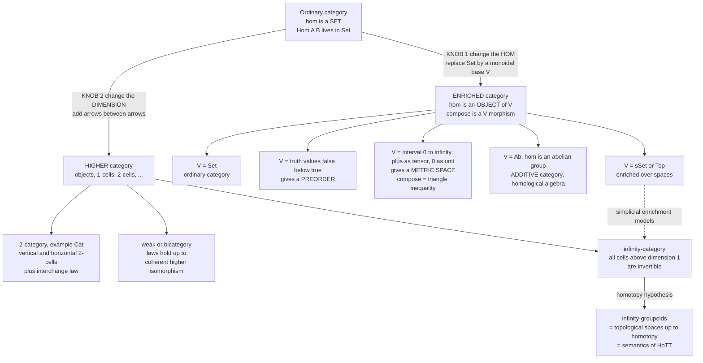

# 🪜 Enriched and Higher Categories

> [!abstract] TL;DR
> Ordinary category theory hard-codes one assumption: *between two objects there is a **SET** of arrows*. **Enriched** and **higher** categories are the two ways to loosen it. An **enriched category** (a **`V`-category**) replaces each hom-**set** `Hom(A,B)` by a hom-**object** living in some monoidal category `V` — with composition a `V`-morphism `Hom(B,C) ⊗ Hom(A,B) → Hom(A,C)` and identities `I → Hom(A,A)`. The base `V` is the "coefficients" of the theory: `V = Set` gives ordinary categories, `V = {false ≤ true}` gives **preorders**, `V = ([0,∞], ≥, +, 0)` gives **metric spaces** (Lawvere's insight: the enriched composition law *is* the triangle inequality, and identities are `d(x,x)=0`), `V = Ab` gives **additive categories** (the home of homological algebra), and `V = sSet`/`Top` gives the simplicially-enriched categories that model **∞-categories**. A **higher category** goes the other way: keep hom-sets but add **2-morphisms** (arrows between arrows), then 3-morphisms, up to **∞**. The canonical **2-category** is **Cat** — categories, functors, natural transformations — with *vertical* and *horizontal* 2-cell composition tied together by the **interchange law**. In **weak** higher categories the composition laws hold only *up to coherent higher isomorphism* (bicategories, tricategories), and in **(∞,1)-categories** everything above dimension 1 is **invertible**. Grothendieck's **homotopy hypothesis** — ∞-**groupoids** *are* topological **spaces** up to homotopy — makes higher category theory into homotopy theory, and supplies the semantics of **Homotopy Type Theory**. Together the two generalizations are the slogan of 21st-century category theory: *enrichment reveals order, metric, linear, and homotopical mathematics as "category theory with different coefficients," and higher structure replaces rigid **equality** with flexible **equivalence**.*

---

## Intuition

**Analogy — how much do you know about the "space between" two things?** Ordinary category theory takes a minimalist view of the gap between two objects `A` and `B`: it records only a **bare set of arrows** `Hom(A,B)` — a list of ways to get from `A` to `B`, with no further texture. But in real mathematics that gap is often *far richer than a set*. Between two cities there is not just "is there a road" but a **distance**. Between two events there is a **probability**. Between two program states there is a **cost**. Between two proofs there is a **space of ways to deform one into the other**. **Enriched categories** are what you get when you honour that richness: you throw away the demand that `Hom(A,B)` be a mere set and let it be a *hom-object* of whatever kind carries the extra structure — a number, a truth value, a group, a topological space. The "coefficients" you choose (call them `V`) decide which branch of mathematics you are secretly doing.

The **other** kind of richness lives *above* the arrows rather than between the objects. Sometimes two different arrows `f, g : A → B` should not just sit side by side as unrelated set-elements — there is a **way to turn `f` into `g`**, a *morphism between morphisms*. That is a **2-morphism**, and once you admit them you can ask for morphisms between *those* (3-morphisms), and so on up a ladder. **Higher categories** climb that ladder. The punchline of the modern subject is that at the top of the ladder — the **∞-category** world — you stop insisting two arrows are *equal* at all and replace it with a whole *space of equivalences*, which is exactly how topology and Homotopy Type Theory think about "sameness."

---

## How It Works

### Two ways to generalize an ordinary category

Fix the definition of an ordinary category: objects, hom-**sets**, an associative composition, and identities. There are two orthogonal knobs you can turn.

**Knob 1 — change what a hom-object *is* (enrichment).** Pick a **monoidal category** `(V, ⊗, I)` — a category with a tensor product `⊗` and a unit object `I`, obeying coherent associativity/unit laws (the setting developed in the forthcoming *Monoids and Monoidal Categories* sibling; the monoidal structure on endofunctors is exactly what makes [[Monads_Categorically|a monad a monoid]]). A **category enriched over `V`** — a **`V`-category** `C` — consists of:

1. a collection of **objects**;
2. for each ordered pair `(A,B)`, a **hom-object** `C(A,B) ∈ V` — *an object of `V`, not a set*;
3. a **composition morphism** in `V`, `∘ : C(B,C) ⊗ C(A,B) → C(A,C)`;
4. an **identity morphism** in `V`, `j_A : I → C(A,A)`;

subject to **associativity** and **unit** diagrams drawn *inside `V`* (using `⊗` and `I`). Notice what vanished: there is no longer any notion of "an element of `C(A,B)`," so you cannot talk about "a single arrow" — only about the hom-object as a whole and the structural morphisms between hom-objects. Ordinary categories are recovered exactly when `V = Set`, `⊗ = ×` (cartesian product), `I = {*}`: then `C(B,C) × C(A,B) → C(A,C)` is the usual composition function.

**Knob 2 — add higher morphisms (dimension).** Keep the hom-sets, but let each hom be *itself a category* of arrows-and-2-arrows, then a 2-category of 2-arrows-and-3-arrows, and so on. A **2-category** has **objects**, **1-morphisms** between objects, and **2-morphisms** between parallel 1-morphisms, with *two* compositions: **vertical** (compose 2-cells sharing a 1-cell boundary) and **horizontal** (compose 2-cells along objects), linked by the **interchange law** `(β' ∘ᵥ β) ∘ₕ (α' ∘ᵥ α) = (β' ∘ₕ α') ∘ᵥ (β ∘ₕ α)`. Iterate to **n-categories**, and in the limit **ω-/∞-categories**.

### The striking examples of enrichment

The power of Knob 1 is that a single definition, re-based over different `V`, *becomes* different fields of mathematics:

| Base `V` (with `⊗`, `I`) | A `V`-category *is*... | Hom-object means | Composition law becomes |
|---|---|---|---|
| `Set` `(×, {*})` | an ordinary **category** | a set of arrows | associative composition of arrows |
| Truth values `{false ≤ true}` `(∧, true)` | a **preorder** | "is there an arrow `A→B`?" | transitivity: `A≤B` and `B≤C` ⟹ `A≤C` |
| `([0,∞], ≥, +, 0)` | a **generalized metric space** (Lawvere) | the **distance** `d(A,B)` | **triangle inequality** `d(A,C) ≤ d(A,B)+d(B,C)` |
| `Ab` (abelian groups) `(⊗_ℤ, ℤ)` | a **preadditive / additive** category | a hom-**group** (you can *add* arrows) | bilinear composition — the setting for homological algebra |
| `Cat` `(×, 1)` | a (strict) **2-category** | a *category* of morphisms and 2-cells | composition is itself functorial |
| `sSet` / `Top` | a **simplicially / topologically enriched** category | a *space* of morphisms | homotopy-coherent composition → **∞-categories** |

The metric-space row is the jewel. In `V = ([0,∞], ≥, +, 0)` the "arrows of `V`" are the relations `x ≥ y`; the tensor `⊗` is **addition** and the unit `I` is **`0`**. Unwinding the enriched axioms:

- the **identity** `I → C(A,A)` becomes `0 ≥ d(A,A)`, i.e. `d(A,A) = 0` — *zero self-distance*;
- the **composition** `C(B,C) ⊗ C(A,B) → C(A,C)` becomes `d(B,C) + d(A,B) ≥ d(A,C)`, i.e. the **triangle inequality**.

So a metric space is *literally* a category enriched over `[0,∞]`, and the triangle inequality is *literally* the enriched composition law. (Lawvere's version is more permissive than the textbook one — distances may be **asymmetric**, may be `∞`, and `d(x,y)=0` need not force `x=y` — precisely because the categorical axioms demand no more.) The same move over `Ab` gives the additive/abelian categories where cohomology lives (the forthcoming *Abelian Categories and Homological Algebra* sibling); over `Cat` it gives 2-categories; over `sSet` it opens the door to ∞-categories. **Enriched functors**, **enriched natural transformations**, and **enriched (co)limits** generalize the whole apparatus — including [[Functor_Categories_and_Naturality|functor categories]] and weighted limits, the natural home of **Kan extensions** (forthcoming sibling).

### Higher categories: strict, weak, and ∞

Climbing Knob 2 exposes a subtlety that does not exist in dimension 1. In a **strict** 2-category (like **Cat** itself) the composition laws hold *on the nose*. But most naturally occurring higher structures only satisfy them **up to a coherent higher isomorphism** — a **bicategory** has an associator 2-cell `(h·g)·f ≅ h·(g·f)` instead of an equation. Push to tricategories and beyond and the coherence data explodes combinatorially; managing it (the coherence problem) is why **"weak" is the honest notion** and why the field needed new machinery. The resolution at the top is the **(∞,1)-category**: a category with morphisms at every level where *everything above dimension 1 is **invertible*** (an **equivalence**). The Joyal–Lurie model realizes these as **quasi-categories** — simplicial sets in which every inner horn has a (non-unique) filler — turning "compose these arrows" into "choose a filler, unique up to contractible choice." This is the setting of homotopy-coherent mathematics: derived algebraic geometry, stable homotopy theory, and the semantics of dependent type theory.

### The homotopy hypothesis and categorification

Two big-picture principles tie it together:

- **Homotopy hypothesis (Grothendieck).** An **∞-groupoid** — a higher category in which *all* morphisms at every level are invertible — is "the same thing as" a **topological space up to homotopy**. Higher-groupoid theory *is* homotopy theory; the tower of `k`-morphisms is the tower of `k`-dimensional paths/homotopies. This is exactly the worldview of [[Homotopy_Type_Theory]]: *a type is a space, a proof of `a = b` is a **path**, and "equality" is a whole space of paths* — the [[Fundamental_Group|fundamental groupoid]] made into a foundation.
- **Categorification.** Systematically *replace sets by categories, equations by isomorphisms, and isomorphisms by higher equivalences.* Climbing the `n`-category ladder reveals hidden structure invisible one level down — the Baez–Dolan program, whose cobordism-hypothesis payoff organizes topological quantum field theory as a functor out of a higher category of manifolds.

### Diagram: the two generalizations of Cat



---

## Key Concepts

### Secondary (intuition-level)
- Ordinary category theory only remembers *how many* ways there are from `A` to `B` — a bare set. **Enrichment** remembers *more*: a distance, a probability, a cost, a whole space.
- Choosing the "coefficients" `V` chooses the subject: truth values → **order theory**, `[0,∞]` → **metric geometry**, abelian groups → **linear algebra**, spaces → **homotopy**.
- **Higher categories** add *arrows between arrows*. At the very top you stop insisting two arrows are *equal* and instead track *how* they are the same — the same idea as "two paths that can be deformed into each other."

### Undergraduate (formal core)
- A **`V`-category** has hom-objects `C(A,B) ∈ V`, composition `C(B,C) ⊗ C(A,B) → C(A,C)`, and identities `I → C(A,A)`, with associativity/unit diagrams drawn in the monoidal category `(V, ⊗, I)`. `V = Set` recovers ordinary categories.
- **Lawvere:** a metric space is a category enriched over `([0,∞], ≥, +, 0)`; identity = `d(x,x)=0`, composition = triangle inequality; the enrichment is genuinely more permissive (asymmetric, `∞` allowed).
- A **2-category** has objects, 1-cells, 2-cells with **vertical** (`∘ᵥ`) and **horizontal** (`∘ₕ`) composition satisfying the **interchange law**; the archetype is **Cat** (categories, functors, [[Natural_Transformations|natural transformations]]).
- **Strict vs weak:** strict laws hold as equations; **weak** (bi-)categories satisfy them only up to coherent invertible 2-cells.

### Graduate (structural / research-level)
- **Enriched category theory** (Kelly): enriched functors, enriched natural transformations, **weighted (co)limits**, the enriched Yoneda lemma, and tensored/cotensored `V`-categories generalize the entire ordinary theory; **Kan extensions** become weighted (co)limits.
- **Change of base:** a lax monoidal functor `V → W` transports `V`-categories to `W`-categories; the "underlying ordinary category" functor is change of base along `V(I, -) : V → Set`.
- **Models of ∞-categories:** quasi-categories (Joyal–Lurie), complete Segal spaces, simplicially/topologically enriched categories, and relative categories are all Quillen-equivalent; `(∞,1)`-categories = "categories weakly enriched over ∞-groupoids/spaces."
- **Homotopy hypothesis & categorification:** ∞-groupoids ≃ spaces up to homotopy (Grothendieck); the cobordism hypothesis (Baez–Dolan, proved by Lurie) frames fully-extended TQFTs as symmetric-monoidal functors out of a higher bordism category.
- **Interaction of the knobs:** a strict 2-category is a `Cat`-enriched category; `(∞,1)`-categories are `sSet`-enriched (up to homotopy) — enrichment and dimension meet.

---

## Python Demo

Two runnable pieces. **Part 1** makes *enrichment* concrete via Lawvere: it treats a finite point-set as a category **enriched over `([0,∞], +, 0)`** and machine-verifies the two enriched axioms — `d(x,x)=0` (identity `I → Hom(x,x)`) and `d(x,z) ≤ d(x,y)+d(y,z)` (enriched composition = **triangle inequality**, with tensor `⊗ = +` and unit `I = 0`) — contrasting it with an ordinary `Set`-enriched category whose homs are *sets of arrows*. **Part 2** sketches the **2-category Cat** numerically — categories as objects, functors as 1-cells, natural transformations as 2-cells — and computes both **vertical** and **horizontal** 2-cell composition, verifying the interchange/naturality of the horizontal composite. Finally we **visualize** the metric triangle inequality and the globular/pasting picture of 2-cell composition. Pure standard library plus matplotlib.

```python
"""
ENRICHED and HIGHER categories, made concrete.

PART 1 - ENRICHMENT over the monoidal poset  V = ([0, inf], >=, +, 0):
    a V-category IS a GENERALIZED METRIC SPACE (Lawvere 1973).
       objects        = points
       hom-object     d(x, y)  in  [0, inf]       -- a NUMBER, not a set
       identity   I -> Hom(x,x)  :   d(x, x) = 0
       compose Hom(y,z) tensor Hom(x,y) -> Hom(x,z) :  d(x,z) <= d(x,y) + d(y,z)
    The enriched COMPOSITION law IS the triangle inequality;
    the tensor of V is  +  and its unit I is  0.
    Contrast: an ordinary category is enriched over V = Set (hom = a SET of arrows).

PART 2 - the 2-CATEGORY Cat: categories as objects, functors as 1-cells,
    natural transformations as 2-cells; VERTICAL and HORIZONTAL composition.
"""
from math import hypot, sin, pi
import matplotlib.pyplot as plt
import matplotlib.patches as mpatches

# =====================================================================
# PART 1.  A category ENRICHED over V = ([0, inf], +, 0): a metric space
# =====================================================================
points = {"a": (0.0, 0.0), "b": (3.0, 0.0), "c": (3.0, 4.0), "e": (0.0, 4.0)}

def d(x, y):                       # the hom-OBJECT: a single non-negative number
    (x1, y1), (x2, y2) = points[x], points[y]
    return hypot(x2 - x1, y2 - y1)

names = list(points)

# identity law:  I -> Hom(x,x)   unwinds to   0 >= d(x,x),  i.e.  d(x,x) = 0
id_ok = all(d(x, x) == 0.0 for x in names)

# composition law:  d(y,z) + d(x,y) >= d(x,z)   -- the ENRICHED composition
#   Hom(y,z) tensor Hom(x,y) -> Hom(x,z)   with  tensor = +   and   arrow = >=
triples = [(x, y, z) for x in names for y in names for z in names]
comp_ok = all(d(x, z) <= d(x, y) + d(y, z) + 1e-9 for (x, y, z) in triples)

print("== PART 1: a metric space AS a category enriched over [0, inf] ==")
print(f"  objects (points)                        : {names}")
print(f"  identity     d(x,x) = 0                  : {id_ok}")
print(f"  composition  d(x,z) <= d(x,y)+d(y,z)     : {comp_ok}   (triangle inequality)")
x, y, z = "a", "b", "c"            # ONE enriched composite, explicitly
print(f"  e.g.  d(a,c) = {d(x,z):.2f}  <=  d(a,b)+d(b,c) = {d(x,y)+d(y,z):.2f}"
      f"   (tensor +, unit 0)")

# --- contrast: the SAME 'shape' as an ordinary Set-enriched category -----------
#     now the hom-OBJECT is a SET of arrows and composition is a FUNCTION.
homset = {                                    # hom-SETS (not numbers)
    ("A", "B"): {"f", "f2"},                  # a SET with TWO parallel arrows
    ("B", "C"): {"g"},
    ("A", "C"): {"gf", "gf2"},
}
compose_fn = {("g", "f"): "gf", ("g", "f2"): "gf2"}   # Hom(B,C) x Hom(A,B) -> Hom(A,C)
print("\n  contrast with V = Set (an ordinary category):")
print(f"    Hom(A,B) = {homset[('A','B')]}  is a SET, cardinality {len(homset[('A','B')])}")
print(f"    compose  g o f = {compose_fn[('g','f')]}   (composition is a FUNCTION of arrow-sets)")
print( "    over [0,inf] the hom is ONE number and 'compose' is the inequality  <= .")

# =====================================================================
# PART 2.  The 2-category Cat: VERTICAL vs HORIZONTAL 2-cell composition.
#   objects     = small categories
#   1-morphisms = functors                    (drawn horizontally)
#   2-morphisms = natural transformations      (drawn as double arrows)
# We model finite functions as dicts; for a discrete source category
# naturality is automatic, so 2-cells are free families of functions.
# =====================================================================

# --- 2a. VERTICAL composition:  alpha: F=>G  then  beta: G=>H  gives  F=>H ------
#     component-wise composition of the natural transformations in the target.
alpha = {"p": {0: 0, 1: 1},         # alpha_p : F(p) -> G(p)
         "q": {0: 0, 1: 0}}         # alpha_q : F(q) -> G(q)
beta  = {"p": {0: 2, 1: 0},         # beta_p  : G(p) -> H(p)
         "q": {0: 5}}               # beta_q  : G(q) -> H(q)

def vcompose(b, a):                 # (b . a)_c = b_c after a_c , at every object c
    return {c: {x: b[c][a[c][x]] for x in a[c]} for c in a}

bva = vcompose(beta, alpha)
print("\n== PART 2a: VERTICAL composition of 2-cells (component-wise) ==")
print(f"  alpha_p          = {alpha['p']}")
print(f"  beta_p           = {beta['p']}")
print(f"  (beta o alpha)_p = {bva['p']}   (= beta_p after alpha_p)")
print(f"  (beta o alpha)_q = {bva['q']}")

# --- 2b. HORIZONTAL composition (Godement):  C -F,G-> D -F',G'-> E -------------
#     alpha: F=>G  and  gamma: F'=>G'  give  gamma * alpha : F'F => G'G.
#     Take F' = the 'double' functor  X |-> X x X  (on maps f |-> f x f),
#     G' = identity functor, and gamma = first projection pi1 : X x X -> X.
A0 = [0, 1]                          # F(*) , the source set
A1 = [0, 1, 2]                       # G(*) , the target set
alpha_star = {0: 0, 1: 2}            # the single component alpha_* : A0 -> A1

def Fprime_on_map(f):                # F'(f) = f x f  applied to a function f
    return lambda uv: (f[uv[0]], f[uv[1]])
def pi1(uv):                         # gamma_X : X x X -> X ,  first projection
    return uv[0]

domain = [(u, v) for u in A0 for v in A0]                     # (F'F)(*) = A0 x A0
route1 = {uv: pi1(Fprime_on_map(alpha_star)(uv)) for uv in domain}  # gamma . F'(alpha)
route2 = {uv: alpha_star[pi1(uv)]                for uv in domain}  # G'(alpha) . gamma
interchange_ok = route1 == route2
print("\n== PART 2b: HORIZONTAL composition of 2-cells (Godement product) ==")
print(f"  (gamma * alpha)_* via  gamma o F'(alpha) : {route1}")
print(f"  (gamma * alpha)_* via  G'(alpha) o gamma : {route2}")
print(f"  the two routes agree (naturality/interchange): {interchange_ok}")

# =====================================================================
# VISUALIZE:  (A) metric triangle inequality,  (B) vertical 2-cell stack,
#             (C) horizontal 2-cell pasting.
# =====================================================================
fig, axes = plt.subplots(1, 3, figsize=(19, 6.3))

# ---- Panel A: enrichment over [0, inf] = the triangle inequality --------------
ax = axes[0]
tri = ("a", "b", "c")
for k in tri:
    px, py = points[k]
    ax.plot(px, py, "o", ms=13, color="#2c3e6b", zorder=3)
    ax.annotate(k, (px, py), textcoords="offset points", xytext=(9, 7),
                fontsize=14, fontweight="bold")
def edge(k1, k2, color, off):
    (x1, y1), (x2, y2) = points[k1], points[k2]
    ax.plot([x1, x2], [y1, y2], color=color, lw=2.6, zorder=2)
    ax.annotate(f"d({k1},{k2})={d(k1,k2):.1f}", ((x1+x2)/2, (y1+y2)/2),
                textcoords="offset points", xytext=off, color=color,
                fontsize=10, fontweight="bold")
edge("a", "b", "#1f8a4c", (-6, -16))
edge("b", "c", "#1f8a4c", (8, 0))
edge("a", "c", "#c0392b", (-96, 2))
ax.set_title("Enriched over [0, inf]:\ncomposition IS the triangle inequality",
             fontweight="bold")
ax.text(-1.1, 4.85,
        f"d(a,c)={d('a','c'):.1f}  <=  d(a,b)+d(b,c)={d('a','b')+d('b','c'):.1f}",
        color="#c0392b", fontsize=10, fontweight="bold")
ax.set_xlim(-1.3, 4.5); ax.set_ylim(-1.1, 5.3); ax.set_aspect("equal")
ax.grid(alpha=0.25)

# ---- Panel B: VERTICAL 2-cell composition (globular stack) --------------------
ax = axes[1]; ax.axis("off")
ax.set_title("2-cells in Cat: VERTICAL composition\nalpha: F=>G  then  beta: G=>H  gives  F=>H",
             fontweight="bold")
xC, xD = 0.12, 0.88
for xx, lab in ((xC, "C"), (xD, "D")):
    ax.text(xx, 0.5, lab, ha="center", va="center", fontsize=15, fontweight="bold",
            bbox=dict(boxstyle="circle,pad=0.36", fc="#eef3fb", ec="#2c3e6b", lw=2))
levels = {"F": 0.80, "G": 0.50, "H": 0.20}
for lab, yy in levels.items():
    ax.add_patch(mpatches.FancyArrowPatch((xC+0.07, yy), (xD-0.07, yy),
                 arrowstyle="-|>", mutation_scale=16, color="#33475b", lw=2.2))
    ax.text(xC+0.02, yy+0.045, lab, fontsize=12, fontweight="bold", color="#33475b")
def dcell(y1, y2, lab, color):      # a downward double arrow = a 2-cell
    xm = 0.5
    for dxx in (-0.010, 0.010):
        ax.add_patch(mpatches.FancyArrowPatch((xm+dxx, y1-0.03), (xm+dxx, y2+0.03),
                     arrowstyle="-|>", mutation_scale=12, color=color, lw=2))
    ax.text(xm+0.055, (y1+y2)/2, lab, color=color, fontsize=13, fontweight="bold")
dcell(0.80, 0.50, "alpha", "#c0392b")
dcell(0.50, 0.20, "beta", "#1f8a4c")
ax.text(0.5, 0.05, "stack the double arrows -> (beta o alpha): F => H",
        ha="center", fontsize=10, fontweight="bold", color="#2c3e6b")

# ---- Panel C: HORIZONTAL 2-cell composition (pasting) -------------------------
ax = axes[2]; ax.axis("off")
ax.set_title("2-cells in Cat: HORIZONTAL composition\nalpha beside gamma  gives  gamma * alpha : F'F => G'G",
             fontweight="bold")
xs3 = {"C": 0.12, "D": 0.5, "E": 0.88}
for lab, xx in xs3.items():
    ax.text(xx, 0.5, lab, ha="center", va="center", fontsize=15, fontweight="bold",
            bbox=dict(boxstyle="circle,pad=0.36", fc="#eef3fb", ec="#2c3e6b", lw=2))
def arc(xa, xb, amp):               # a bowed 1-cell (functor) between two objects
    return ([xa + (xb-xa)*i/60 for i in range(61)],
            [0.5 + amp*sin(pi*i/60) for i in range(61)])
def bigon(xa, xb, upper, lower, cell, color):
    ax.plot(*arc(xa, xb,  0.13), color="#33475b", lw=2.2)   # upper functor
    ax.plot(*arc(xa, xb, -0.13), color="#33475b", lw=2.2)   # lower functor
    ax.text((xa+xb)/2, 0.5+0.22, upper, ha="center", fontsize=12, fontweight="bold")
    ax.text((xa+xb)/2, 0.5-0.26, lower, ha="center", fontsize=12, fontweight="bold")
    ax.add_patch(mpatches.FancyArrowPatch(((xa+xb)/2, 0.5+0.10), ((xa+xb)/2, 0.5-0.10),
                 arrowstyle="-|>", mutation_scale=13, color=color, lw=2.4))
    ax.text((xa+xb)/2+0.035, 0.5, cell, color=color, fontsize=13, fontweight="bold")
bigon(0.17, 0.45, "F", "G", "alpha", "#c0392b")
bigon(0.55, 0.83, "F'", "G'", "gamma", "#1f8a4c")
ax.text(0.5, 0.05, "paste along D -> (gamma * alpha): F'F => G'G",
        ha="center", fontsize=10, fontweight="bold", color="#2c3e6b")

fig.suptitle("Two generalizations of Cat: ENRICHMENT (hom = object of V) and HIGHER (2-cells)",
             fontsize=15, fontweight="bold")
fig.tight_layout(rect=[0, 0, 1, 0.94])
plt.show()   # or: fig.savefig("enriched_and_higher_categories.png", dpi=120)
```

**What the run shows.** Part 1 prints `True` for both enriched axioms over every triple of the four points, and prints one composite explicitly — `d(a,c)=5.00 ≤ d(a,b)+d(b,c)=7.00` — demonstrating that *the triangle inequality is nothing but the enriched-composition law with tensor `+` and unit `0`*; the contrast block shows the ordinary `Set`-enriched hom as a two-element *set* of arrows with composition a *function*, making vivid what enrichment replaces. Part 2 computes the vertical composite `(β∘α)` component-by-component and the horizontal composite two different ways, both yielding `{(0,0):0, (0,1):0, (1,0):2, (1,1):2}` so that `interchange_ok` prints `True` — the naturality square that makes the Godement product well-defined. The figure renders the metric triangle, the *vertical* stacking of 2-cells (a globular tower `F ⇒ G ⇒ H`), and the *horizontal* pasting of 2-cells along a shared object (`gamma * alpha`), the two composition directions whose compatibility is the interchange law.

---

## Real-World Applications

> **Homotopy Type Theory & proof assistants.** ∞-groupoids/`(∞,1)`-categories are the *intended semantics* of [[Homotopy_Type_Theory]]: identity types are path objects, and the univalence axiom ("equivalence is equality") is only sensible because "equality" is a *space*, i.e. higher-categorical. Cubical Agda and the HoTT libraries in Coq/Lean rest on this. It is the most direct route by which higher category theory reaches working computer science.

- **Quantitative / metric semantics (enrichment over `[0,∞]`).** Lawvere metric spaces are the categorical backbone of program-distance and approximation: **bisimulation metrics** for probabilistic systems, the **Kantorovich/Wasserstein** distance on distributions, differential-privacy "sensitivity," and metric/graded type systems all present a hom-object as a *cost/distance* and composition as an *additive triangle bound*.
- **Probabilistic and weighted computation (other bases).** Enrichment over `([0,1], ×)` or a semiring underlies **weighted automata**, shortest-path and reachability algorithms (the `(min,+)` tropical semiring is enrichment made algorithmic), and probabilistic transition systems — one enriched framework, many "quantitative" models.
- **Homological algebra (`Ab`-enrichment).** Every derived category, chain complex, `Ext`/`Tor` computation, and spectral sequence lives in an **additive/abelian** category — an `Ab`-enriched category where you can *add* morphisms (the forthcoming *Abelian Categories and Homological Algebra* sibling).
- **Rewriting and program transformation (2-categories).** In a 2-category, 1-cells are terms/programs and **2-cells are rewrites**; term rewriting, `λ`-calculus reduction, and optimizing-compiler transformations are 2-categorical, with the interchange law governing when independent rewrites commute.
- **String diagrams, quantum, and ML (monoidal/higher CT).** Monoidal and higher categories give the **string-diagram** calculus behind categorical quantum mechanics (ZX-calculus), tensor networks, and diagrammatic accounts of neural nets — the applied-CT frontier (the forthcoming *Applied Category Theory* sibling).
- **Topological quantum field theory & derived geometry.** The **cobordism hypothesis** (Baez–Dolan, Lurie) organizes fully-extended TQFTs as functors out of a higher bordism category; Lurie's `∞`-categories are the standard language of modern derived algebraic geometry.

---

## Common Pitfalls

- **Getting the metric base's *order* backwards.** For Lawvere metric spaces `V = ([0,∞], ≥, +, 0)` uses the **reverse** order: the "arrows of `V`" are `x ≥ y`, so composition `d(B,C)+d(A,B) ≥ d(A,C)` reads as the triangle inequality. Use the *forward* order and the inequality flips and the analogy breaks. The direction of the enriching order is load-bearing.
- **Assuming a hom-object still has "elements."** In a general `V`-category there is *no* notion of "an individual arrow `A→B`" — only the hom-object and the structural `V`-morphisms. Reasoning element-by-element is exactly the `Set`-enriched habit that enrichment abandons; you must argue with the composition/identity morphisms instead.
- **Forcing classical metric axioms.** Lawvere metrics are deliberately *asymmetric*, allow distance `∞`, and do **not** require `d(x,y)=0 ⟹ x=y`. Demanding symmetry and separation throws away the categorical content (e.g. asymmetry is what lets directed/quasi-metrics model one-way costs).
- **Confusing "∞-category" with "∞-groupoid."** An **∞-groupoid** has *all* higher morphisms invertible (≈ a space); a general **(∞,1)-category** only makes cells *above dimension 1* invertible — its 1-morphisms need not be. Mixing these up is the most common conceptual slip when reading Lurie.
- **Believing strict = weak.** Most naturally-occurring higher categories are **weak**: associativity/unit hold only *up to coherent isomorphism*, not on the nose. Assuming strictness ignores the coherence data (associators, pentagon/hexagon axioms) that is the whole difficulty above dimension 2.
- **Dropping the interchange law.** With *two* compositions (vertical and horizontal) you cannot compose 2-cells however you like — the **middle-four interchange** must hold. It is precisely the compatibility our demo verifies; forget it and horizontal composition is ill-defined.
- **Treating categorification as "just adding decoration."** Replacing equations by isomorphisms *forces new coherence conditions* and often reveals structure (e.g. braidings) with no shadow one level down. It is a disciplined lifting, not cosmetic.

---

## Related Concepts

- [[Functors]] — the carrier of enrichment is a functor-like assignment of hom-objects; **enriched functors** and, in a 2-category, functors-as-1-cells are the direct generalizations.
- [[Functor_Categories_and_Naturality]] — its aliases already include *"Cat as a 2-category"* and the *interchange law*: this note supplies the enriched and higher-dimensional context for exactly that structure.
- [[Natural_Transformations]] — natural transformations are the **2-cells** of the archetypal 2-category **Cat**; vertical/horizontal composition of 2-cells is composition of natural transformations.
- [[Monads_Categorically]] — "a monad is a monoid in the monoidal category of endofunctors" is the same *monoidal-base* idea that enrichment generalizes; monads also live in any 2-category.
- [[Equivalence_of_Categories]] — the move from strict **equality** to **equivalence** is the seed that, iterated up the `n`-category ladder, becomes the `(∞,1)`-categorical worldview.
- [[Homotopy_Type_Theory]] — the **homotopy hypothesis** and ∞-groupoids are the semantics of HoTT: "a proof of `a=b` is a path," equality as a space of higher morphisms.
- [[Fundamental_Group]] — the fundamental groupoid is the low-dimensional shadow of the ∞-groupoid a space carries; the bridge between homotopy theory and higher categories.
- [[Topological_Spaces]] — metric spaces (which *are* `[0,∞]`-enriched categories) and, via the homotopy hypothesis, spaces-up-to-homotopy sit on both sides of this note.
- [[Categories_Objects_and_Morphisms]] — the ordinary (`Set`-enriched, 1-dimensional) starting point that both generalizations depart from.
- [[Category_Theory_Overview]] — the vault's map of the whole subject, of which enriched/higher category theory is the modern frontier.

*Forthcoming Category_Theory siblings this note anchors to (referenced in prose, to be linked once written):* **Monoids and Monoidal Categories** (the base `V` and its `⊗`, `I`), **Abelian Categories and Homological Algebra** (`Ab`-enrichment), **Kan Extensions** (enriched/weighted (co)limits), and **Applied Category Theory** (string diagrams, quantum, ML, and 2-categorical rewriting).

---

## Review Questions

1. **(Conceptual)** Explain, without symbols at first, why "a metric space is a category enriched over `[0,∞]`." Then make it precise: what plays the role of the hom-object, the tensor `⊗`, the monoidal unit `I`, the identity morphism `I → Hom(x,x)`, and the composition `Hom(y,z) ⊗ Hom(x,y) → Hom(x,z)`? Which axiom becomes `d(x,x)=0` and which becomes the triangle inequality, and why does the order on `[0,∞]` have to be `≥` rather than `≤`?

2. **(Scenario)** You are handed the 2-category **Cat** and a `2 × 2` grid of natural transformations: between functors `C → D` you have `α : F ⇒ G` and `β : G ⇒ H`, and between functors `D → E` you have `α' : F' ⇒ G'` and `β' : G' ⇒ H'`. (a) Define vertical composition (`β ∘ᵥ α`) and horizontal composition (`α' ∘ₕ α`) of 2-cells concretely on components. (b) State the interchange law relating the two ways of composing the whole grid, and explain — in the language of our demo — which computation the horizontal composite corresponds to. (c) Give one reason horizontal composition would be *ill-defined* if the underlying naturality condition failed.

3. **(Trade-off / structural)** Both **enrichment** and **higher structure** generalize ordinary categories, and they eventually meet (a strict 2-category is a `Cat`-enriched category; `(∞,1)`-categories are enriched over spaces). (a) Contrast what each generalization *buys* you and what it *costs* (elements vs no-elements; strictness vs coherence). (b) Explain how the **homotopy hypothesis** turns a purely categorical object (an ∞-groupoid) into a topological one, and why that makes higher category theory the right semantics for Homotopy Type Theory. (c) When would you reach for enrichment over `[0,∞]` versus a genuinely 2-categorical model in a computer-science problem?

---

## Sources

- [Kelly, G. M., *Basic Concepts of Enriched Category Theory* (1982; TAC Reprint 10, 2005)](http://www.tac.mta.ca/tac/reprints/articles/10/tr10abs.html) — the standard reference for `V`-categories, enriched functors/natural transformations, and weighted limits.
- [Lawvere, F. W., "Metric Spaces, Generalized Logic, and Closed Categories" (1973; TAC Reprint 1, 2002)](http://www.tac.mta.ca/tac/reprints/articles/1/tr1abs.html) — the founding paper identifying metric spaces with `[0,∞]`-enriched categories.
- [Lurie, J., *Higher Topos Theory* (2009)](https://www.math.ias.edu/~lurie/papers/HTT.pdf) — the definitive development of `(∞,1)`-categories via quasi-categories.
- [Riehl, E., *Category Theory in Context* (2016)](https://math.jhu.edu/~eriehl/context.pdf) — accessible modern treatment including 2-categorical and enriched perspectives.
- [Baez, J. & Dolan, J., "Higher-Dimensional Algebra and Topological Quantum Field Theory", *J. Math. Phys.* 36 (1995)](https://arxiv.org/abs/q-alg/9503002) — the homotopy hypothesis, categorification, and the cobordism hypothesis.
- [nLab, "enriched category" and "homotopy hypothesis"](https://ncatlab.org/nlab/show/enriched+category) — reference articles with the change-of-base and higher-categorical context.

---

#category-theory #enriched-categories #higher-categories #2-categories #infinity-categories
