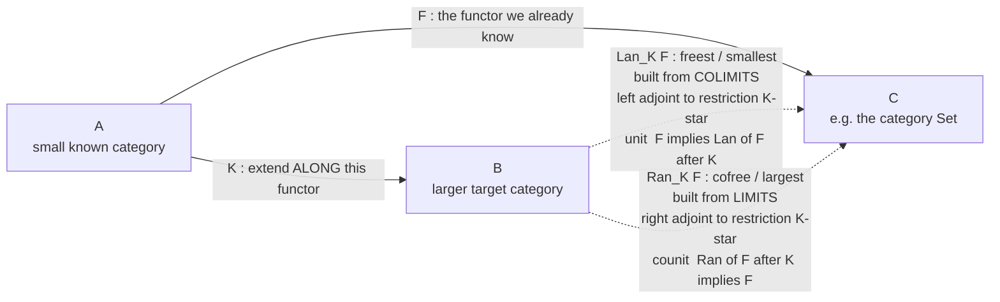

# 🪄 Kan Extensions

> [!abstract] TL;DR
> A **Kan extension** is the **best approximate extension of a functor along another functor**. Given a functor `F : A → C` that you already understand and a functor `K : A → B` that carries `A` into a bigger world `B`, you want to "spread `F` out over all of `B`." Since `K` need be neither injective nor surjective on objects, an *exact* extension almost never exists — so you settle for the **universal** one. There are two, dual, best answers: the **left Kan extension** `Lan_K F` is the *freest / smallest / most economical* extension, built from **colimits** and characterised as the **left adjoint** to restriction-along-`K`; the **right Kan extension** `Ran_K F` is the *cofree / largest / most generous*, built from **limits** and the **right adjoint** to restriction. When `C` has enough (co)limits they are computed **pointwise** by a (co)limit over a **comma category**: `(Lan_K F)(b) = colim` over `(K ↓ b)` of `F`. This one construction *subsumes the rest of the subject* — limits, colimits, adjoints, and the Yoneda lemma are all special cases — which is why Mac Lane closes *Categories for the Working Mathematician* with the slogan **"all concepts are Kan extensions."**

---

## Intuition

**Analogy — extrapolating a pattern you only know on part of the picture.** You are handed a rule that works on a **small domain** — say the value of a function at a handful of points, or the behaviour of a process on a few known inputs — and you are asked to **extend it to a much bigger domain** in the most sensible way. There is rarely a *forced* answer for the new inputs, so you commit to a **principled best guess**. You can extrapolate **from below** — assume *nothing beyond what the known data forces*, gluing together exactly the evidence you have and no more (the **most economical, least-committal** extension). Or you can extrapolate **from above** — assume *everything compatible with the known data*, keeping every possibility the evidence does not rule out (the **most generous, maximally-committal** extension). Fill in missing pixels of an image either by the tightest interpolation that the neighbours demand, or by the loosest one still consistent with them, and you have met both flavours already.

A **Kan extension** is exactly this "best extension" made precise for **functors**. `Lan_K F` is the extrapolation-from-below: it *builds* each new value by **gluing** the known values of `F` that map toward it — a **colimit**. `Ran_K F` is the extrapolation-from-above: it *carves out* each new value by **intersecting** the constraints the known values impose — a **limit**. Neither is arbitrary: each is **universal**, meaning *every other candidate extension factors uniquely through it*. "Best" is not a metaphor here; it is a one-arrow-only theorem.

---

## How It Works

### The problem Kan extensions solve

Start with two functors sharing a source: `F : A → C` (the thing you know) and `K : A → B` (the map along which you want to extend). You would love a functor `E : B → C` with `E ∘ K = F` **on the nose**. But `K` may **identify** distinct objects of `A` (not injective), leaving `E` over-determined at their shared image, or **miss** objects of `B` entirely (not surjective), leaving `E` under-determined there. An exact factorisation is a rare luxury.

The categorical move is to **weaken equality to a universal natural transformation** and take the *best* such weakening. Restriction along `K` is a functor between functor categories,
`K* : [B, C] → [A, C]`, sending `E ↦ E ∘ K`. A Kan extension is an object of `[B, C]` that is optimal with respect to `K*`:

- **Left Kan extension** `Lan_K F` — equipped with a **unit** natural transformation `η : F ⇒ (Lan_K F) ∘ K`, it is **initial** among all pairs `(E, F ⇒ E∘K)`. Equivalently, `Lan_K ⊣ K*`: it is the **left adjoint** to restriction, so `[B,C](Lan_K F, E) ≅ [A,C](F, E∘K)` naturally. Freest, smallest, colimit-built.
- **Right Kan extension** `Ran_K F` — equipped with a **counit** `ε : (Ran_K F) ∘ K ⇒ F`, it is **terminal** among all pairs `(E, E∘K ⇒ F)`. Equivalently, `K* ⊣ Ran_K`: the **right adjoint** to restriction, `[A,C](E∘K, F) ≅ [B,C](E, Ran_K F)`. Cofree, largest, limit-built.

The two are perfect duals: `Ran_K F = (Lan_{K^{op}} F^{op})^{op}`, so proving anything about one gives the other for free (see [[Duality_and_the_Opposite_Category]]).

### The pointwise (co)limit formula — why they are computable

Adjointness *characterises* Kan extensions but does not *build* them. When `C` has enough colimits, `Lan_K F` is assembled **object-by-object** by a colimit over a **comma category**. Recall the comma category `(K ↓ b)`: its objects are pairs `(a, h)` with `a ∈ A` and `h : K(a) → b` a morphism of `B`; its morphisms `(a, h) → (a', h')` are maps `u : a → a'` in `A` with `h' ∘ K(u) = h`. It collects *every way an object of `A` maps toward `b` through `K`*. Then:

$$(\mathrm{Lan}_K F)(b) \;=\; \operatorname*{colim}_{(a,\,h)\,\in\,(K\downarrow b)} F(a), \qquad\qquad (\mathrm{Ran}_K F)(b) \;=\; \lim_{(a,\,h)\,\in\,(b\downarrow K)} F(a).$$

In **Set**, that colimit is concrete: take the **disjoint union** of `F(a)` over all comma objects `(a,h)`, then **quotient** by the equivalence forced by the comma morphisms — identify `x ∈ F(a)` with `F(u)(x) ∈ F(a')` whenever `u` is a comma morphism. That is a coproduct-then-glue, i.e. a **coend**; the slick one-liner is the **coend / weighted-colimit formula** `Lan_K F = ∫^{a} B(K a, -) · F a`, the general shape behind the density theorem and the "nerve–realization" adjunctions (the dedicated *Ends, Coends and Profunctors* note for this folder is planned). A Kan extension computed this way is called **pointwise**, and pointwise Kan extensions are the ones that behave well.

### "All concepts are Kan extensions"

Mac Lane's slogan is a precise theorem, not a boast. Specialise the two functors and everything falls out:

| Take `K : A → B` to be… | …and `Lan_K` / `Ran_K` become… |
| --- | --- |
| the unique functor `A → 1` (terminal category) | `colim F` / `lim F` — **colimits and limits are Kan extensions** along the collapse to a point |
| a functor with an adjoint | **adjoints are Kan extensions of identities**: `K` has a left adjoint iff `Lan_K(id_A)` exists and is preserved by `K` |
| the Yoneda embedding `y : A → [A^op, Set]` | `Lan_y(id)` gives **free cocompletion**; the density theorem "every presheaf is a colimit of representables" is a Kan extension |
| `Δ⁰ → Δ` then take presheaves | **geometric realization** (a `Lan`) and the **singular / nerve** functor (a `Ran`) — the archetypal realization/nerve adjoint pair |
| a subgroup inclusion `H ↪ G` (as one-object categories) | **induced** representation (`Lan`, extension of scalars) and **coinduced** representation (`Ran`, restriction's other adjoint) |

So the universal-construction hierarchy has a single apex: products, coproducts, limits, colimits (see [[Limits_and_Colimits]], [[Products_and_Coproducts]]), free objects, adjoints, and the Yoneda lemma (see [[The_Yoneda_Lemma]]) are all **shadows of one construction** (see [[Universal_Properties]]).

### The extension triangle



Read the triangle as: the outer path `F : A → C` is the data; `K` bends `A` into `B`; the dashed functors `B → C` are the **two best fillers** of the triangle, each certified by a **universal natural transformation** (the unit `η` for `Lan`, the counit `ε` for `Ran`) through which *every rival filler factors uniquely*.

---

## Key Concepts

### Secondary (intuition first)
- You **know a rule on a small domain** and want the **best extension to a bigger domain**; the honest answer is universal, not arbitrary.
- **Two flavours:** extrapolate **from below** by *gluing only the known evidence* (left, `Lan`, colimit-built, "freest") or **from above** by *keeping every compatible possibility* (right, `Ran`, limit-built, "cofree").
- **Slogan (Mac Lane):** *all concepts are Kan extensions* — limits, colimits, adjoints, and Yoneda are all special cases of this one idea.

### Undergraduate (the machinery)
- **Set-up:** functors `F : A → C` and `K : A → B`; **restriction** `K* : [B,C] → [A,C]`, `E ↦ E∘K`.
- **Left Kan extension** `Lan_K F`: **left adjoint** to `K*`, with **unit** `η : F ⇒ (Lan_K F)∘K`; **initial** candidate extension. Built from **colimits**.
- **Right Kan extension** `Ran_K F`: **right adjoint** to `K*`, with **counit** `ε : (Ran_K F)∘K ⇒ F`; **terminal** candidate extension. Built from **limits**.
- **Comma category** `(K ↓ b)`: objects `(a, h : K a → b)`, morphisms `u : a → a'` with `h' ∘ K u = h`. The index over which the pointwise (co)limit runs.
- **Pointwise formula:** `(Lan_K F)(b) = colim_{(K↓b)} F`; dually `Ran` via a limit over `(b ↓ K)`.

### Graduate (structure and reach)
- **Coend / weighted formula:** `Lan_K F = ∫^{a} B(Ka, -) · F a` and `Ran_K F = ∫_{a} F a^{B(-, Ka)}`; pointwise Kan extensions are exactly those computed by these (co)ends, and *not every* Kan extension is pointwise.
- **Fully faithful `K` ⟹ unit/counit are isomorphisms:** if `K` is an embedding, `Lan_K F` genuinely **extends** `F` (agrees with it on the image), so `Lan` and `Ran` interpolate/extrapolate *without disturbing the known data* — the comma category `(K↓Ka)` then has `(a, id)` terminal, collapsing the colimit to `F(a)`.
- **Adjoints as Kan extensions:** `G ⊣ H` iff `H = Ran_G(id)` (pointwise) iff `G = Lan_H(id)` (pointwise); the **codensity monad** `Ran_G G` is the "closest monad to having a left adjoint."
- **Kan extensions preserve/create structure:** left Kan extensions along dense functors reconstruct functors (Yoneda density), underpinning **free cocompletion**, **left-Kan-extension = colimit-of-representables**, and the general **nerve/realization** paradigm (see [[Presheaves_and_Representables]]).
- **Enriched and higher settings:** the whole story runs in any well-behaved enriched or `∞`-categorical context, where **homotopy (co)limits** are Kan extensions (the *Enriched and Higher Categories* note for this folder is planned).

---

## Python Demo

We compute a **left Kan extension pointwise** on genuinely finite categories, in **FinSet**, straight from the colimit formula `(Lan_K F)(b) = colim_{(K↓b)} F`. The setup is a tiny worked example engineered so the extension has real content:

- `A` is a **span** `a ← c → b` (arrows `s : c → a`, `t : c → b`).
- `F : A → Set` is the data we know: `F(a) = {a0, a1}`, `F(b) = {b0, b1}`, `F(c) = {c0}`, with `F(s): c0 ↦ a0` and `F(t): c0 ↦ b0`.
- `B` is a bigger category with a **new object `m`** (a commuting square with apex `w`, cocone tip `m`).
- `K : A → B` is the **fully faithful embedding** `a↦x, b↦y, c↦w`.

On the image of `K` the extension **reproduces `F`** (unit is a bijection, because `K` is fully faithful). On the **new object `m`** — not hit by `K` — the colimit formula **fills in a value** as the **pushout that glues `F(a)`, `F(b)`, `F(c)` along `c`**. We build the comma category, take the colimit in FinSet as *disjoint-union-then-quotient* (union-find), verify the **unit** and the **universal property** (any competing cocone factors through the colimit **uniquely**), and visualize the gluing and the extension triangle with matplotlib.

```python
"""
Left Kan extension, computed POINTWISE from the colimit formula
    (Lan_K F)(b) = colim over the comma category (K down b) of F.

Everything is finite, so the colimit in FinSet is a disjoint-union-then-quotient
that we realize with a union-find. Pure standard library for the mathematics;
matplotlib only for the picture.
"""
from itertools import product

# ---------------------------------------------------------------- categories
# A category = objects, morphisms (name -> (src, tgt)), identities, and the
# non-identity composite table. comp() handles identity laws automatically.
def comp(cat, g, f):
    """g after f, i.e. (g . f). Requires tgt(f) == src(g)."""
    mor, ident = cat["mor"], cat["id"]
    assert mor[f][1] == mor[g][0], "not composable"
    if f == ident[mor[f][0]]:          # f is an identity -> g . id = g
        return g
    if g == ident[mor[g][1]]:          # g is an identity -> id . f = f
        return f
    return cat["table"][(g, f)]         # genuine non-identity composite

# A : the span   a <--s-- c --t--> b   (no non-identity composites)
A = {
    "obj": ["a", "b", "c"],
    "mor": {"id_a": ("a", "a"), "id_b": ("b", "b"), "id_c": ("c", "c"),
            "s": ("c", "a"), "t": ("c", "b")},
    "id":  {"a": "id_a", "b": "id_b", "c": "id_c"},
    "table": {},
}

# B : a commuting square  w --sx--> x --p--> m  ,  w --ty--> y --q--> m
#     with  p . sx = r = q . ty .  Object m is NEW (outside the image of K).
B = {
    "obj": ["x", "y", "w", "m"],
    "mor": {"id_x": ("x", "x"), "id_y": ("y", "y"), "id_w": ("w", "w"),
            "id_m": ("m", "m"),
            "sx": ("w", "x"), "ty": ("w", "y"),
            "p": ("x", "m"), "q": ("y", "m"), "r": ("w", "m")},
    "id":  {"x": "id_x", "y": "id_y", "w": "id_w", "m": "id_m"},
    "table": {("p", "sx"): "r", ("q", "ty"): "r"},
}

# K : A -> B  is the fully faithful embedding.
K_obj = {"a": "x", "b": "y", "c": "w"}
K_mor = {"id_a": "id_x", "id_b": "id_y", "id_c": "id_w", "s": "sx", "t": "ty"}

# F : A -> Set  is the data we already know.
F_obj = {"a": ["a0", "a1"], "b": ["b0", "b1"], "c": ["c0"]}
F_mor = {"id_a": {"a0": "a0", "a1": "a1"}, "id_b": {"b0": "b0", "b1": "b1"},
         "id_c": {"c0": "c0"}, "s": {"c0": "a0"}, "t": {"c0": "b0"}}

# ------------------------------------------------------- the comma category
def comma_objects(b):
    """Objects (a, h) of (K down b): h : K(a) -> b in B."""
    return [(o, hn) for o in A["obj"]
            for hn, (hs, ht) in B["mor"].items()
            if hs == K_obj[o] and ht == b]

def comma_morphisms(b):
    """Morphisms (a,h) -> (a',h'): u:a->a' in A with h' . K(u) == h."""
    objs = comma_objects(b)
    return [((o, h), (o2, h2), un)
            for (o, h) in objs for (o2, h2) in objs
            for un, (us, ut) in A["mor"].items()
            if us == o and ut == o2 and comp(B, h2, K_mor[un]) == h]

# -------------------------------------------- the colimit in FinSet (glue)
class UF:
    def __init__(self, items): self.p = {i: i for i in items}
    def find(self, i):
        while self.p[i] != i:
            self.p[i] = self.p[self.p[i]]; i = self.p[i]
        return i
    def union(self, i, j):
        ri, rj = self.find(i), self.find(j)
        if ri != rj:
            lo, hi = sorted([ri, rj]); self.p[hi] = lo   # deterministic rep

def lan_at(b):
    """(Lan_K F)(b) as the colimit: disjoint union of F(a) over (K down b),
    quotiented by the comma morphisms. Returns (classes, coproj)."""
    objs, mors = comma_objects(b), comma_morphisms(b)
    elems = [((o, h), x) for (o, h) in objs for x in F_obj[o]]
    uf = UF(elems)
    for (o, h), (o2, h2), un in mors:            # glue x ~ F(u)(x)
        for x in F_obj[o]:
            uf.union(((o, h), x), ((o2, h2), F_mor[un][x]))
    classes = {}
    for e in elems:
        classes.setdefault(uf.find(e), []).append(e)
    return classes, (lambda o, h, x: uf.find(((o, h), x)))

# the unit  eta_o : F(o) -> (Lan_K F)(K o)  is the coprojection at (o, id).
def unit(o):
    Ko = K_obj[o]
    _, coproj = lan_at(Ko)
    return {x: coproj(o, B["id"][Ko], x) for x in F_obj[o]}

# ----------------------------------------------------------------- run it
if __name__ == "__main__":
    print("Pointwise (Lan_K F)(b) over every object b of B:")
    for b in B["obj"]:
        classes, _ = lan_at(b)
        new = "  <-- NEW object, value FILLED IN" if b == "m" else ""
        print(f"  b = {b}: |Lan(b)| = {len(classes)}{new}")

    print("\nComma category (K down m):")
    print("  objects   :", comma_objects("m"))
    print("  morphisms :", [(j, jp, u) for j, jp, u in comma_morphisms("m")
                            if u not in ("id_a", "id_b", "id_c")])

    print("\nThe gluing at m (a PUSHOUT of F(a), F(b), F(c) along c):")
    classes_m, _ = lan_at("m")
    glued = [sorted(x for (_, x) in members) for members in classes_m.values()]
    for cls in sorted(glued):
        print("  class:", cls)

    print("\nUnit is a bijection on the image of K (K is fully faithful):")
    for o in A["obj"]:
        eta = unit(o)
        classes, _ = lan_at(K_obj[o])
        bij = len(set(eta.values())) == len(F_obj[o]) == len(classes)
        print(f"  eta_{o}: F({o}) -> Lan({K_obj[o]}) is a bijection: {bij}")

    # -------- universal property at m: any cocone factors UNIQUELY ---------
    # A cocone into T assigns c_j : F(a) -> T, compatible with comma morphisms.
    T = ["G0", "G1", "G2"]
    cocone = {("a", "p"): {"a0": "G0", "a1": "G1"},
              ("b", "q"): {"b0": "G0", "b1": "G2"},
              ("c", "r"): {"c0": "G0"}}
    classes_m, coproj_m = lan_at("m")
    sigma = {}                                   # the mediating map colim -> T
    for rep, members in classes_m.items():
        vals = {cocone[(o, h)][x] for ((o, h), x) in members}
        assert len(vals) == 1, "incompatible cocone: no well-defined mediator"
        sigma[rep] = vals.pop()
    factors = all(sigma[coproj_m(o, h, x)] == cocone[(o, h)][x]
                  for (o, h) in comma_objects("m") for x in F_obj[o])
    # uniqueness: coprojections are jointly surjective, so sigma is forced.
    unique = all(len(members) >= 1 for members in classes_m.values())
    print("\nUniversal property at m:")
    print(f"  mediating sigma factors the cocone : {factors}")
    print(f"  sigma is forced (hence UNIQUE)     : {unique}")
    print(f"  sigma (class-value -> T)           : {sorted(set(sigma.values()))}")

    # --------------------------------- visualization ----------------------
    import matplotlib
    matplotlib.use("Agg")
    import matplotlib.pyplot as plt

    fig, (axL, axR) = plt.subplots(1, 2, figsize=(13, 5.5))

    # LEFT: the extension triangle  A -> B, A -> C, and Lan filling B -> C
    pos = {"A": (0.1, 0.85), "B": (0.9, 0.85), "C": (0.5, 0.1)}
    def node(ax, key, label, fc):
        x, y = pos[key]
        ax.scatter([x], [y], s=4200, color=fc, edgecolors="black", zorder=3)
        ax.text(x, y, label, ha="center", va="center", fontsize=11, zorder=4)
    def edge(ax, s, t, label, color, dashed=False, off=(0, 0)):
        x0, y0 = pos[s]; x1, y1 = pos[t]
        ax.annotate("", xy=(x1, y1), xytext=(x0, y0),
                    arrowprops=dict(arrowstyle="-|>", color=color, lw=2.2,
                                    ls="--" if dashed else "-",
                                    shrinkA=26, shrinkB=26))
        ax.text((x0 + x1) / 2 + off[0], (y0 + y1) / 2 + off[1], label,
                color=color, fontsize=9.5, ha="center", va="center",
                bbox=dict(boxstyle="round,pad=0.2", fc="white", ec="none"))
    node(axL, "A", "A\nspan", "#c7d2fe")
    node(axL, "B", "B\nhas new m", "#bbf7d0")
    node(axL, "C", "C = Set", "#fde68a")
    edge(axL, "A", "B", "K  (embed)", "#334155", off=(0, 0.05))
    edge(axL, "A", "C", "F  (known)", "#1d4ed8", off=(-0.1, 0))
    edge(axL, "B", "C", "Lan_K F\n(colimit-built)", "crimson",
         dashed=True, off=(0.12, 0))
    axL.text(0.5, 0.98, "The extension triangle:\nLan_K F is the BEST filler of B -> C",
             ha="center", va="top", fontsize=10)
    axL.set_xlim(0, 1); axL.set_ylim(0, 1.02); axL.axis("off")

    # RIGHT: the pushout at m -- comma span glues F(a),F(b),F(c) along c0
    axR.set_title("(Lan_K F)(m) = colim over (K down m)\n"
                  "= pushout gluing a0 ~ c0 ~ b0", fontsize=10)
    src = {"(a,p): F(a)={a0,a1}": (0.05, 0.75),
           "(c,r): F(c)={c0}":    (0.05, 0.45),
           "(b,q): F(b)={b0,b1}": (0.05, 0.15)}
    for lab, (x, y) in src.items():
        axR.text(x, y, lab, fontsize=9.5, va="center",
                 bbox=dict(boxstyle="round,pad=0.3", fc="#e0e7ff", ec="#6366f1"))
    result = ["{a0, b0, c0}   (glued)", "{a1}", "{b1}"]
    for i, cls in enumerate(result):
        axR.text(0.72, 0.72 - 0.22 * i, cls, fontsize=10, va="center",
                 bbox=dict(boxstyle="round,pad=0.3", fc="#fecaca", ec="#dc2626"))
    for y in (0.75, 0.45, 0.15):
        axR.annotate("", xy=(0.68, 0.62), xytext=(0.42, y),
                     arrowprops=dict(arrowstyle="-|>", color="#334155", lw=1.6))
    axR.text(0.55, 0.03, "3 elements filled in on the NEW object m",
             ha="center", fontsize=9, color="#dc2626")
    axR.set_xlim(0, 1); axR.set_ylim(0, 0.95); axR.axis("off")

    fig.suptitle("Left Kan extension, pointwise via the colimit formula",
                 fontsize=13)
    fig.tight_layout()
    fig.savefig("kan_extension_lan.png", dpi=130)
    print("\nsaved kan_extension_lan.png")
```

Expected console output:

```
Pointwise (Lan_K F)(b) over every object b of B:
  b = x: |Lan(b)| = 2
  b = y: |Lan(b)| = 2
  b = w: |Lan(b)| = 1
  b = m: |Lan(b)| = 3  <-- NEW object, value FILLED IN

Comma category (K down m):
  objects   : [('a', 'p'), ('b', 'q'), ('c', 'r')]
  morphisms : [(('c', 'r'), ('a', 'p'), 's'), (('c', 'r'), ('b', 'q'), 't')]

The gluing at m (a PUSHOUT of F(a), F(b), F(c) along c):
  class: ['a0', 'b0', 'c0']
  class: ['a1']
  class: ['b1']

Unit is a bijection on the image of K (K is fully faithful):
  eta_a: F(a) -> Lan(x) is a bijection: True
  eta_b: F(b) -> Lan(y) is a bijection: True
  eta_c: F(c) -> Lan(w) is a bijection: True

Universal property at m:
  mediating sigma factors the cocone : True
  sigma is forced (hence UNIQUE)     : True
  sigma (class-value -> T)           : ['G0', 'G1', 'G2']
```

The reproduction of `F` on `x, y, w` (via the bijective unit) shows the extension **respects the data it already has**; the value **filled in** at the new object `m` is the **pushout** `{a0, c0, b0}`, `{a1}`, `{b1}` — three elements *glued from the known values along `c`* — and the **unique** mediator `sigma` for an arbitrary competing cocone is the colimit universal property, i.e. `Lan_K F` really is the **best extension**.

---

## Real-World Applications

> **Example — the codensity monad speeds up Haskell programs.** A right Kan extension of a functor along **itself**, `Ran_G G`, is a monad — the **codensity monad** `Codensity m`. Wrapping a computation in it performs the classic "difference-list / continuation" trick at the level of *any* monad: it turns left-nested binds (which are quadratic for free monads and for list concatenation) into right-nested ones, giving an **asymptotic `O(n²) → O(n)` improvement**. This is not folklore dressed up in jargon — Voigtländer's "asymptotic improvement of computations over free monads" and Hinze's "Kan extensions for program optimisation" *derive* the speed-up from the Kan-extension adjunction, and Kmett's `kan-extensions` library ships `Codensity`, `Lan`, `Ran`, and **Day convolution** for exactly this use (see [[Monads_and_Effects]] for the free-monad background and the dedicated *Category Theory in Programming* note planned for this folder).

- **Representation theory.** For a subgroup inclusion `H ↪ G`, the left Kan extension is the **induced representation** `Ind_H^G` (extension of scalars) and the right Kan extension is the **coinduced representation** `Coind_H^G`; Frobenius reciprocity *is* the Lan/Ran adjunction. The same pattern is **extension/restriction of scalars** for modules over a ring homomorphism.
- **Algebraic topology and homotopy theory.** **Geometric realization** of a simplicial set is a left Kan extension along `Δ ↪ Top`, and its right adjoint, the **singular complex**, is the matching right Kan extension — the archetypal **nerve/realization** pair. **Homotopy limits and colimits** are (derived) Kan extensions, the correct "up-to-homotopy" (co)limits.
- **Sheaf theory and geometry.** **Sheafification** and the direct/inverse image adjunctions `f_* ⊣ f^*`, `f_! ⊣ f^!` on (pre)sheaves are Kan extensions along the map of sites; the **functor-of-points** reconstruction of a space from representables is `Lan` along Yoneda (see [[Presheaves_and_Representables]], [[The_Yoneda_Lemma]]).
- **Data and databases.** In the functorial-data-model view, a schema is a category and an instance is a functor to **Set**; **data migration** along a schema map `K` uses `Lan_K` (the left-pushforward `Σ`) and `Ran_K` (the right-pushforward `Π`) to translate instances — literally "extend the data along the schema functor."

---

## Common Pitfalls

- **Expecting an *exact* extension `E∘K = F`.** Because `K` may merge or miss objects, on-the-nose factorisation almost never exists; the Kan extension only satisfies it **up to the universal natural transformation** (`η` or `ε`), and only *is* an honest extension when `K` is fully faithful (then unit/counit are isos).
- **Swapping the two flavours.** `Lan` is the **left** adjoint, built from **colimits**, the **freest** extension with a **unit** `F ⇒ Lan∘K`; `Ran` is the **right** adjoint, built from **limits**, the **cofree** extension with a **counit** `Ran∘K ⇒ F`. Mixing "left/colimit/free" with "right/limit/cofree" inverts every arrow. Mnemonic: **L**eft–co**L**imit; **R**ight–limit (`Lan` glues, `Ran` intersects).
- **Assuming Kan extensions always exist.** The pointwise formula needs `C` to have the relevant (co)limits over the (possibly large) comma categories; without cocompleteness, `Lan_K F` can fail to exist even when the definition is well-posed.
- **Assuming every Kan extension is pointwise.** Pointwise means "given by the comma-category (co)limit." There exist genuine, non-pointwise Kan extensions; only pointwise ones enjoy the coend formula and the good preservation properties — always check which kind you have.
- **Getting the comma category direction wrong.** `Lan` uses `(K ↓ b)` — objects `K a → b`, arrows *into* `b`; `Ran` uses `(b ↓ K)` — arrows *out of* `b`. Reverse them and you compute the wrong extension.
- **Confusing "the extension is the best" with "the extension is unique data."** Like all universal constructions it is unique only **up to unique isomorphism** (see [[Universal_Properties]]); two constructions of `Lan_K F` are canonically iso, not literally equal.

---

## Related Concepts

- [[Universal_Properties]] — Kan extensions are the **master universal construction**; each is an initial/terminal object in a category of candidate extensions, so the "unique factoring arrow" pattern is exactly this note at full generality.
- [[Limits_and_Colimits]] — the raw material of the pointwise formula: `Lan` is a **colimit** over `(K↓b)`, `Ran` a **limit** over `(b↓K)`; conversely limits and colimits *are* Kan extensions along the functor to the terminal category.
- [[The_Yoneda_Lemma]] — the **density theorem** ("every presheaf is a colimit of representables") and free cocompletion are Kan extensions along the Yoneda embedding; Yoneda underwrites the universal property that pins each extension down.
- [[Presheaves_and_Representables]] — nerve/realization and functor-of-points reconstructions are `Lan`/`Ran` pairs on presheaf categories.
- [[Functors]] — the objects being extended; `F` and `K` are functors and the extension `Lan_K F` is again a functor.
- [[Natural_Transformations]] — the **unit** `η` and **counit** `ε` are the universal natural transformations that certify the extension; the adjunction lives in a functor category of these.
- [[Functor_Categories_and_Naturality]] — restriction `K* : [B,C] → [A,C]` and its adjoints `Lan_K ⊣ K* ⊣ Ran_K` are functors *between functor categories*.
- [[Duality_and_the_Opposite_Category]] — `Ran_K F = (Lan_{K^op} F^op)^op`; left and right Kan extensions are exact duals.
- [[Products_and_Coproducts]] — the pushout in the demo is a colimit; coproducts and products are the simplest Kan extensions (along `A → 1`).
- [[Monads_Categorically]] — the **codensity monad** `Ran_G G` is a Kan extension that is a monad, and the monad `T` of an adjunction is built from Kan-extension data.
- [[Monads_and_Effects]] — the CS payoff: `Codensity` (a right Kan extension) gives asymptotic speed-ups for free monads and list building in real Haskell code.

*Referenced in prose but not yet written in this folder: Adjunctions; Ends, Coends and Profunctors; Enriched and Higher Categories; Category Theory in Programming.*

---

## Review Questions

1. **Undergraduate.** State precisely what data a **left Kan extension** `Lan_K F` consists of (the functor *and* its unit) and give its universal property as an initiality statement. Then write down the **pointwise colimit formula** and explain, in words, what the comma category `(K ↓ b)` is collecting.
2. **Graduate / structural.** Explain the claim "**all concepts are Kan extensions**" by deriving *three* of the following as Kan extensions: (a) the colimit of a diagram, (b) an adjoint functor, (c) the density/co-Yoneda theorem, (d) the induced representation `Ind_H^G`. For each, say what `K` and `F` are, and whether the relevant extension is a `Lan` or a `Ran`.
3. **Applied / scenario.** You have a functor `F : A → Set` known on a small category `A`, and an embedding `K : A → B` into a larger `B` with objects `K` does not reach. You need to extend `F` to all of `B`. When would you choose `Lan_K F` versus `Ran_K F`, and what qualitative difference would you see on a *new* object `b` (think: coproduct-like gluing versus product-like intersection)? Separately, explain concretely why wrapping a free-monad computation in the **codensity monad** (`Ran`) can change its running time from quadratic to linear.

---

## Sources

- Saunders Mac Lane, *Categories for the Working Mathematician*, 2nd ed. (Springer, 1998), Ch. X — "Kan Extensions," including the closing section "All Concepts Are Kan Extensions."
- Emily Riehl, *Category Theory in Context* (Dover, 2016; free PDF), Ch. 6 — Kan extensions, pointwise formulas via comma categories, and the (co)end perspective.
- Fosco Loregian, *(Co)end Calculus* (Cambridge University Press, 2021; arXiv:1501.02503) — the coend formula for Kan extensions and their weighted-(co)limit derivations.
- Ralf Hinze, "Kan Extensions for Program Optimisation — Or: Art and Dan Explain an Old Trick," *Mathematics of Program Construction* (MPC 2012), LNCS 7342 — the codensity speed-up derived from Kan extensions.
- nLab contributors, "Kan extension." [ncatlab.org/nlab/show/Kan+extension](https://ncatlab.org/nlab/show/Kan+extension)

---

#category-theory #kan-extensions #universal-constructions #colimit-formula #adjoints
