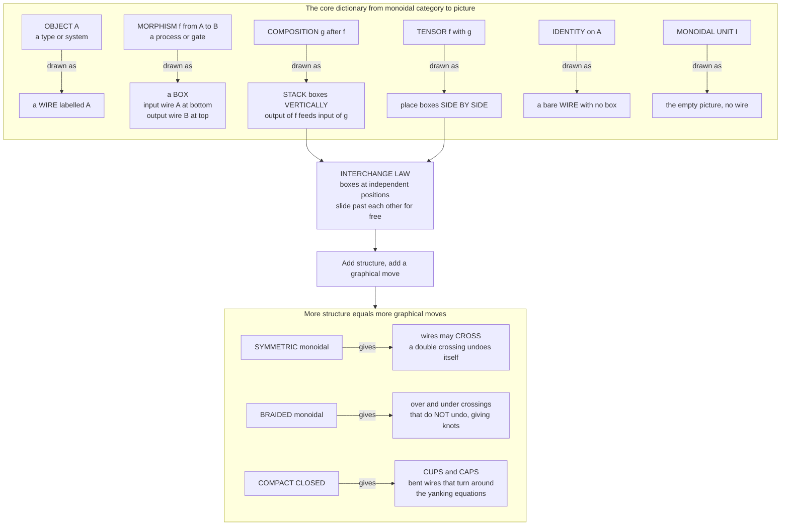

# 🧵 String Diagrams and Graphical Calculus

> [!abstract] TL;DR
> A **string diagram** is a rigorous **two-dimensional graphical language** for a **monoidal category**: objects become **wires**, morphisms become **boxes** with input wires entering at the bottom and output wires leaving at the top, **composition** `g ∘ f` is **stacking boxes vertically**, and the **monoidal tensor** `f ⊗ g` is **placing boxes side by side**. The identity is a bare wire; the monoidal unit is *no wire at all*. The magic is the **Joyal–Street theorem**: two morphisms of a free monoidal category are **equal if and only if** their diagrams are related by **planar isotopy** — continuous deformation that never cuts a wire or drags it through a box. So *algebraic equations become topological deformations*: the notorious **interchange law** `(g ∘ f) ⊗ (k ∘ h) = (g ⊗ k) ∘ (f ⊗ h)` is **trivially true** because it just says boxes at independent positions slide past each other. Adding categorical structure enriches the pictures — **symmetric** monoidal lets wires **cross**, **braided** gives over/under **knot** crossings, **compact closed** adds **cups and caps** (bent wires that turn around). This calculus is category theory's most practical export: it is the working notation of **applied category theory**, the **ZX-calculus** and **categorical quantum mechanics**, **tensor networks**, signal-flow graphs, Petri nets, Bayesian/Markov categories, and compositional linguistics — everywhere "proofs are pictures and structure is topology."

---

## Intuition

**Analogy — a plumbing schematic that you are allowed to bend.** Picture an engineering schematic: **components** are boxes (a pump, a filter, a mixer), and **pipes** run between them carrying water. There are exactly **two ways to combine components**. You can wire them **in series** — the output pipe of the pump feeds the input of the filter, one after another (this is *composition*). Or you can install two independent subsystems **in parallel**, side by side on the same rack, neither touching the other (this is *tensor*). Now here is the crucial engineering fact: if you slide the filter a little higher on the wall while the parallel subsystem stays put, **the plant still does exactly the same thing**. The *layout* changed; the *function* did not. Bending, sliding, and stretching the pipes — as long as you never cut one or thread it through a component — leaves the behaviour identical.

String diagrams make that intuition into **mathematics**. The boxes are **morphisms** (processes, functions, quantum gates, matrices); the wires are **objects** (types, systems, vector spaces); wiring in series is **categorical composition** and wiring in parallel is the **monoidal product**. The payoff is that the fiddly bookkeeping of an equation like "map first then transform equals transform first then map" — a wall of nested `∘` and `⊗` symbols with easy-to-lose brackets — turns into an obvious picture where you literally **slide a box along a wire** and read off the equality. **Topology does the algebra for you.** This is the same "an equation you can *see* is an equation you can reason about" philosophy behind [[Diagrams_and_Commutativity]], pushed one dimension further: commutative diagrams are the *Poincaré dual* of string diagrams, and where commutative squares still make you *chase* arrows, string diagrams make many coherence laws **vanish into thin air**.

---

## How It Works

### The core dictionary

A **monoidal category** `(C, ⊗, I)` has, on top of ordinary composition, a **tensor product** `⊗` that combines two objects into one and two morphisms into one, together with a **unit object** `I`, all satisfying coherence axioms. String diagrams are the graphical *syntax* of exactly this structure. Read a diagram **bottom to top** (the physicists' convention; some authors read top to bottom or left to right — pick one and stay consistent):

| Categorical notion | Graphical element |
|---|---|
| Object `A` | a **wire** labelled `A` |
| Morphism `f : A → B` | a **box** with input wire `A` at the bottom, output wire `B` at the top |
| Composition `g ∘ f` (`f : A → B`, `g : B → C`) | **stack** the box for `g` **on top of** the box for `f`; the shared `B` wire connects them |
| Tensor `f ⊗ g` | place the two boxes **side by side** horizontally |
| Identity `id_A` | a **bare wire** `A` with no box |
| Monoidal unit `I` | **nothing** — the empty region of the page |
| Morphism `A → I` (a "state costate"/effect) | a box with wires coming in and **no** wire leaving |
| Morphism `I → A` (a "state"/preparation) | a box with **no** input wire and a wire leaving |

The unit being *the absence of a wire* is the single most important convention: a scalar `I → I` is a **floating box with no wires at all**, which is why in quantum diagrams "scalars" (amplitudes, probabilities) are little bubbles that can slide anywhere. See the forthcoming *Monoids and Monoidal Categories* sibling for the algebraic backbone; the endofunctor category `[C, C]` whose monoid objects are monads is itself a monoidal category ([[Functor_Categories_and_Naturality]], [[Monads_Categorically]]).

### Why it is sound: Joyal–Street and planar isotopy

The reason this is a **theorem** and not just a pretty notation is the **Joyal–Street coherence theorem** (*The Geometry of Tensor Calculus*, 1991). It says string diagrams are a **sound and complete** calculus for monoidal categories:

- **Sound.** Any equation you can prove by *deforming* one diagram into another (without crossing wires, without pulling a wire through a box) is a **true equation** of every monoidal category.
- **Complete.** Conversely, two morphisms built in the **free** monoidal category are **equal if and only if** their diagrams are **planar-isotopic** — you can slide, stretch, and bend one into the other continuously in the plane.

Concretely, the many **coherence conditions** that make `⊗` associative and unital "on the nose enough" (the pentagon and triangle equations, the endless re-bracketing of `((A ⊗ B) ⊗ C) ⊗ D`) become **automatic**: in a diagram there are simply no brackets, because horizontally adjacent wires do not *need* a grouping. The bureaucracy that would otherwise demand pages of equational bookkeeping (compare the coherence machinery lurking behind cartesian-closed structure and topos theory) is absorbed by the geometry. **Topology does the algebra.**

### The interchange law, made obvious

The one axiom that *ties composition and tensor together* is the **interchange (or bifunctoriality) law**:

`(g ∘ f) ⊗ (k ∘ h) = (g ⊗ k) ∘ (f ⊗ h)`.

In symbols it looks like a nontrivial identity you must *verify*. As a picture it is **content-free**. The left side says: build the `f`-then-`g` tower on the left, build the `h`-then-`k` tower on the right, then stand them side by side. The right side says: first put `f` next to `h` (a wide bottom layer), then put `g` next to `k` on top (a wide top layer). **Both produce the identical picture**: a 2×2 arrangement with `f, h` on the bottom row and `g, k` on the top row. The equation merely records that **boxes at independent horizontal positions can slide vertically past each other**, because their heights were never physically linked. This is the archetype of "a hard-looking coherence law is a trivial graphical move," and it is exactly what the Python demo below draws.

### The ladder of graphical structure

Each extra piece of categorical structure unlocks a new **graphical move**. Climbing the ladder:

1. **Plain monoidal** — boxes and wires, stacking and juxtaposition. Wires **cannot cross**; the diagrams are strictly planar.
2. **Symmetric monoidal** — a natural **symmetry** `σ_{A,B} : A ⊗ B → B ⊗ A` lets **wires cross**, and crucially `σ ∘ σ = id`, so a **double crossing undoes itself** (you can yank the two strands straight). Most everyday categories (sets and functions, vector spaces with `⊗`, relations, probability) are symmetric.
3. **Braided monoidal** — crossings exist but `σ ∘ σ ≠ id`: you must track which strand goes **over** and which goes **under**. Now the diagrams are genuine **knots and braids** — the home of the Yang–Baxter equation, quantum groups, and **anyons** in topological quantum computing.
4. **Compact closed** — every object `A` has a **dual** `A*`, drawn with a **cup** (a bent wire `I → A* ⊗ A`) and a **cap** (a bent wire `A ⊗ A* → I`) satisfying the **yanking / zig-zag equations**: a wire bent into an S and pulled taut straightens out. Cups and caps let wires **turn around and travel backwards**, which is how you model **transposition, trace, dual maps, and quantum entanglement**.
5. **Special nodes (Frobenius / bialgebra)** — commutative Frobenius algebras add **spiders**: nodes that merge and split wires and obey the rule that *any connected spider network with the same number of legs is equal*. These are the algebraic heart of the ZX-calculus (green and red spiders) and of the "copy and delete" structure of cartesian categories ([[Products_and_Coproducts]]).

Each rung is a categorical property *and* a topological affordance. What you are allowed to *draw* is exactly what you are allowed to *prove*.



---

## Key Concepts

### Secondary (intuition-level)
- A string diagram is a **wiring picture**: **boxes** are components, **wires** carry things between them.
- **Two ways to combine**: stack boxes **top to bottom** (one after another) or set them **side by side** (in parallel).
- The big idea: **bending and sliding the wires without cutting them keeps the meaning the same** — a deformed picture is an equal formula.

### Undergraduate (working definitions)
- **Monoidal category** `(C, ⊗, I)`: composition `∘` *plus* a tensor `⊗` on objects and morphisms *plus* a unit `I`, with coherence (associator, unitors) satisfying pentagon and triangle.
- **Dictionary:** object = wire, morphism = box, `∘` = vertical stack, `⊗` = horizontal juxtaposition, `id` = bare wire, `I` = empty page.
- **Interchange law** `(g ∘ f) ⊗ (k ∘ h) = (g ⊗ k) ∘ (f ⊗ h)` is the *bifunctoriality* of `⊗`; diagrammatically it is free.
- **Symmetry** `σ_{A,B}` = a wire crossing with `σ ∘ σ = id`; **states** are boxes with no input, **effects** are boxes with no output, **scalars** are boxes with neither.
- **Soundness/completeness (Joyal–Street):** equal morphisms ⇔ planar-isotopic diagrams (in the free case).

### Graduate (structural / research-level)
- **Free monoidal categories** are (strict) 2-categories/PROPs; string diagrams are **Poincaré-dual** to pasting diagrams of 2-cells. Coherence (Mac Lane) is *why* strictification is legitimate and *why* the calculus is well-defined up to isotopy.
- **The zoo of graphical languages** (Selinger's survey): monoidal, braided, symmetric, ribbon, **compact closed**, **traced monoidal** (partial trace = feedback loop), **dagger-compact** (a `†` that reflects diagrams vertically, modelling adjoints/conjugates) — each with its own coherence theorem fixing the allowed deformations.
- **Compact closed ⇒ the map-state duality:** `Hom(A ⊗ B, C) ≅ Hom(B, A* ⊗ C)` is "bend the `A` wire around a cup," giving process = state via cups/caps; **trace** is a cap-and-cup feedback loop.
- **Frobenius / bialgebra spiders** presented by generators-and-relations give **complete** rewrite systems (the ZX-calculus is complete for Clifford+T qubit computation); string-diagram rewriting is confluent-modulo-isotopy and is the object computed by tools like Quantomatic and PyZX.
- **Enrichment and higher structure:** string diagrams generalise to **monoidal 2-categories** (surface diagrams), to **enriched** settings, and to profunctorial/optics presentations — see the forthcoming *Enriched and Higher Categories* and *Ends, Coends and Profunctors* siblings.

---

## Python Demo

We build a **tiny string-diagram data structure** in pure Python — morphisms are **boxes with typed input/output wires** — implement **sequential composition** `then` (type-checked, stacks vertically) and **parallel composition** `tensor` (places boxes side by side, padding heights with identity wires), and **render** diagrams with matplotlib as **boxes and wires**. We then **verify the interchange law graphically**: we build `(g ∘ f) ⊗ (k ∘ h)` and `(g ⊗ k) ∘ (f ⊗ h)` **two different ways** and confirm they normalise to the **same layered picture** — a data-structure equality that *is* a planar isotopy. Finally we show a **symmetry crossing** and a **double crossing** (which a symmetric monoidal category yanks straight to the identity). matplotlib only draws; the diagram structure is pure standard library.

```python
"""
String diagrams as a tiny data structure, rendered with matplotlib.

Dictionary:
  object A          -> a WIRE labelled A
  morphism f: A->B  -> a BOX, input wire A at the bottom, output wire B at the top
  composition g.f   -> STACK boxes vertically (f's outputs feed g's inputs)
  tensor  f (x) g   -> place boxes SIDE BY SIDE horizontally
  identity on A     -> a bare wire
  monoidal unit I   -> the empty picture

We verify the INTERCHANGE LAW graphically:
    (g . f) (x) (k . h)  ==  (g (x) k) . (f (x) h)
by BUILDING both sides two different ways and confirming they normalise to the
SAME layered picture -- a topological equality (planar isotopy) we can draw.
"""
import matplotlib.pyplot as plt

WIRECOLOR = "#33475b"
BOXFACE = "#dfe9f7"
BOXEDGE = "#2c3e6b"


class Box:
    """A generator: a named process with typed input and output wires.

    dom = tuple of input wire types  (read at the BOTTOM of the box)
    cod = tuple of output wire types (read at the TOP of the box)
    name == ""      -> an identity wire (drawn as a bare line, no rectangle)
    name == "swap"  -> a wire crossing (the symmetry of a symmetric monoidal cat)
    """
    def __init__(self, name, dom, cod):
        self.name = name
        self.dom = tuple(dom)
        self.cod = tuple(cod)

    def __eq__(self, other):
        return (isinstance(other, Box) and self.name == other.name
                and self.dom == other.dom and self.cod == other.cod)

    def __repr__(self):
        return f"{self.name or 'id'}:{','.join(self.dom)}->{','.join(self.cod)}"


def wire(t):
    return Box("", (t,), (t,))            # the identity morphism on a single wire


def _row_cod(row):
    return tuple(t for box in row for t in box.cod)


class Diagram:
    """A vertical stack of LAYERS, read bottom to top.

    Each layer is a tuple of Boxes placed side by side (a tensor of boxes).
    Invariant: the concatenated cod-types of layer i equal the concatenated
    dom-types of layer i+1 -- wires must line up where boxes stack.
    """
    def __init__(self, layers):
        self.layers = [tuple(l) for l in layers]

    @staticmethod
    def gen(box):
        return Diagram([[box]])

    @property
    def dom(self):
        return _dom_of_row(self.layers[0]) if self.layers else ()

    @property
    def cod(self):
        return _row_cod(self.layers[-1]) if self.layers else ()

    def then(self, other):
        """Sequential composition read bottom-to-top: SELF first, THEN other.
        In the usual notation this builds  other o self.  Types must match."""
        if self.cod != other.dom:
            raise TypeError(f"cannot stack: cod {self.cod} != dom {other.dom}")
        return Diagram(self.layers + other.layers)

    def tensor(self, other):
        """Parallel composition: place SELF and OTHER side by side.
        Pad the shorter tower with identity layers so the heights match,
        then concatenate the box-tuples layer by layer."""
        a, b = list(self.layers), list(other.layers)
        while len(a) < len(b):
            a.append(tuple(wire(t) for t in _row_cod(a[-1])))
        while len(b) < len(a):
            b.append(tuple(wire(t) for t in _row_cod(b[-1])))
        return Diagram([ra + rb for ra, rb in zip(a, b)])

    def __eq__(self, other):
        return isinstance(other, Diagram) and self.layers == other.layers


def _dom_of_row(row):
    return tuple(t for box in row for t in box.dom)


# --------------------------------------------------------------------------
# Rendering: draw a Diagram as boxes and wires on a matplotlib axis.
# All generators here are width-preserving (len(dom) == len(cod)), which keeps
# the wire count constant per column and makes the picture a clean grid.
# --------------------------------------------------------------------------
def draw_diagram(ax, diag, title):
    ax.set_title(title, fontsize=11, fontweight="bold")
    ax.axis("off")
    width = max(len(_dom_of_row(row)) for row in diag.layers)
    n = len(diag.layers)
    ax.set_xlim(-0.8, width - 1 + 0.8)
    ax.set_ylim(-0.6, n + 0.5)

    for li, row in enumerate(diag.layers):
        y0, y1, mid = li, li + 1, li + 0.5
        cursor = 0
        for box in row:
            w = len(box.dom)                       # width-preserving generators
            slots = [cursor + j for j in range(w)]
            if box.name == "":                     # identity wire: a bare line
                x = slots[0]
                ax.plot([x, x], [y0, y1], color=WIRECOLOR, lw=1.6, zorder=1)
            elif box.name == "swap":               # symmetry: two crossing wires
                x0, x1 = slots[0], slots[1]
                ax.plot([x0, x1], [y0, y1], color="#c0392b", lw=1.8, zorder=1)
                ax.plot([x1, x0], [y0, y1], color="#1f8a4c", lw=1.8, zorder=2)
            else:                                  # a real box: rectangle + stubs
                xl, xr = slots[0] - 0.34, slots[-1] + 0.34
                for x in slots:                    # input stubs (bottom) + output stubs (top)
                    ax.plot([x, x], [y0, mid - 0.2], color=WIRECOLOR, lw=1.6, zorder=1)
                    ax.plot([x, x], [mid + 0.2, y1], color=WIRECOLOR, lw=1.6, zorder=1)
                ax.add_patch(plt.Rectangle((xl, mid - 0.2), xr - xl, 0.4,
                             facecolor=BOXFACE, edgecolor=BOXEDGE, lw=2, zorder=3))
                ax.text((xl + xr) / 2, mid, box.name, ha="center", va="center",
                        fontsize=12, fontweight="bold", color=BOXEDGE, zorder=4)
            cursor += w

    for i, t in enumerate(diag.dom):               # label the bottom boundary (dom)
        ax.text(i, -0.42, t, ha="center", va="center", fontsize=9, color="#666")
    for i, t in enumerate(diag.cod):               # label the top boundary (cod)
        ax.text(i, n + 0.28, t, ha="center", va="center", fontsize=9, color="#666")


if __name__ == "__main__":
    a, b, c, p, q, r = "a", "b", "c", "p", "q", "r"
    f = Diagram.gen(Box("f", (a,), (b,)))
    g = Diagram.gen(Box("g", (b,), (c,)))
    h = Diagram.gen(Box("h", (p,), (q,)))
    k = Diagram.gen(Box("k", (q,), (r,)))

    # LEFT-HAND SIDE:  (g o f) (x) (k o h)  -- compose each column, THEN juxtapose
    lhs = (f.then(g)).tensor(h.then(k))

    # RIGHT-HAND SIDE: (g (x) k) o (f (x) h) -- juxtapose each row, THEN compose
    rhs = (f.tensor(h)).then(g.tensor(k))

    print("== Interchange law ==")
    print("  LHS layers:", [[bx.name or 'id' for bx in row] for row in lhs.layers])
    print("  RHS layers:", [[bx.name or 'id' for bx in row] for row in rhs.layers])
    print("  (g o f) (x) (k o h)  ==  (g (x) k) o (f (x) h) :", lhs == rhs)

    # SYMMETRY: a crossing, and a DOUBLE crossing (yanks straight to identity).
    swap_ab = Diagram.gen(Box("swap", (a, b), (b, a)))
    swap_ba = Diagram.gen(Box("swap", (b, a), (a, b)))
    double = swap_ab.then(swap_ba)
    print("\n== Symmetry ==")
    print("  double crossing boundary:", double.dom, "->", double.cod,
          " (isotopic to id on (a,b): pull the strands straight)")

    fig, axes = plt.subplots(1, 3, figsize=(15, 5))
    draw_diagram(axes[0], lhs, "(g o f) (x) (k o h)")
    draw_diagram(axes[1], rhs, "(g (x) k) o (f (x) h)")
    draw_diagram(axes[2], double, "swap then swap = double crossing")
    fig.suptitle("Interchange law: both towers are the SAME picture (planar isotopy)",
                 fontsize=13, fontweight="bold")
    fig.tight_layout(rect=[0, 0, 1, 0.94])
    plt.show()   # or: fig.savefig("string_diagrams.png", dpi=120)
```

**What the run shows.** Both constructions of the interchange law normalise to the *identical* list of layers `[[f, h], [g, k]]`, so `lhs == rhs` prints `True` and the first two panels render the **same 2×2 grid of boxes** — the equation is literally "the same picture drawn two ways," i.e. a planar isotopy. The type checker in `then` refuses to stack boxes whose wires do not line up, exactly as a monoidal category requires. The third panel draws a **wire crossing** and a **double crossing**; the double crossing has the same boundary `(a, b) → (a, b)` as the identity, and in a *symmetric* monoidal category the yanking move pulls the two strands straight, realising `σ ∘ σ = id` — an algebraic law that is, once again, a purely topological deformation.

---

## Real-World Applications

> **Example — the ZX-calculus for quantum computing.** Categorical quantum mechanics (Abramsky and Coecke, 2004) recast quantum processes as string diagrams in a **dagger-compact category**: qubit wires, quantum gates as boxes, and **entanglement as cups and caps** (a Bell state is literally a cup, and the "map–state duality" that turns a process into an entangled state is bending a wire around it). The **ZX-calculus** refines this into green and red **spiders** with a small set of graphical rewrite rules that is **complete** — any true equation between qubit maps can be proved by rewriting pictures. Compilers like **PyZX** and **Quantomatic** *optimise real quantum circuits* by diagrammatic rewriting: T-gate count reduction, circuit resynthesis, and error-correction lattice surgery are all done as string-diagram transformations rather than matrix algebra. This connects directly to [[Quantum_Gates_and_Circuits]] and to entanglement structure in [[Entanglement_and_Bell_States]].

- **Tensor networks (Penrose notation).** Physicists' tensor-network diagrams — MPS, PEPS, MERA in condensed matter, and tensor contractions in machine learning — are string diagrams in the compact-closed category of vector spaces: a tensor is a box, an index is a wire, contraction is joining wires. Penrose invented the notation in the 1970s precisely to make index gymnastics into topology.
- **Signal-flow graphs and control theory.** Linear dynamical systems, feedback controllers, and signal-flow graphs are string diagrams in a category of linear relations; the **feedback loop is a trace** (a cup-and-cap), and controllability/observability arguments become diagram rewrites.
- **Network theory (Baez and collaborators).** Electrical circuits, Petri nets, chemical reaction networks, and open Markov processes are all presented as string diagrams of "open systems" that compose by gluing boundary wires — the mathematics of **compositional modelling** of physical and biological networks.
- **Probabilistic and Bayesian models.** In a **Markov category**, string diagrams model probability: wires are random variables, boxes are stochastic channels (Markov kernels), **copy and discard** are special nodes, and Bayesian inversion, conditional independence, and d-separation become graphical facts.
- **Databases and relations.** The calculus of relations, conjunctive queries, and data migration have diagrammatic forms in the category of relations; a database query is a string diagram whose wires are attributes — a theme of the forthcoming *Categorical Databases and Systems* sibling.
- **Compositional linguistics (DisCoCat).** The **DisCoCat** model (Coecke, Sadrzadeh, Clark) fuses **grammar and meaning** as string diagrams: pregroup grammar supplies cups that "wire up" word-meaning vectors, so sentence meaning is a tensor contraction — the basis of experiments in quantum natural language processing.

---

## Common Pitfalls

- **Forgetting to fix a reading direction.** Bottom-to-top, top-to-bottom, and left-to-right are all in use; a diagram is meaningless until you commit. Mixing conventions silently transposes every morphism.
- **Crossing wires in a plain monoidal category.** You may only draw a crossing if the category is **symmetric or braided**. In a generic monoidal category `A ⊗ B` and `B ⊗ A` are *different* objects with *no* canonical map between them — a drawn crossing is then an illegal move, not a free one.
- **Confusing braided with symmetric.** In a **braided** category over/under matters and `σ ∘ σ ≠ id`; you may **not** yank a double crossing straight. Treating a braiding as a symmetry collapses knot theory to triviality and is simply false for anyons and quantum groups.
- **Pulling a wire through a box.** Planar isotopy allows sliding, bending, and stretching but **never** dragging a strand through a box or across another strand (in the planar case). Doing so asserts a naturality/commutativity that need not hold.
- **Thinking the empty diagram is "nothing."** The empty region is the **monoidal unit** `I`, and a wireless box is a **scalar** `I → I`. Scalars multiply and slide freely, but they are data, not absence — dropping them loses amplitudes/probabilities in quantum diagrams.
- **Assuming cups and caps exist.** Only **compact closed** (or rigid) categories have duals; you cannot bend a wire backwards in `Set` or in a plain cartesian category. The yanking equations are an *extra* axiom, not a universal freedom.
- **Overusing spiders.** Frobenius/bialgebra spider rules hold only for the specific **(co)commutative Frobenius or bialgebra** structures they present (e.g. the ZX green/red nodes). Fusing arbitrary nodes because they "look like spiders" produces false equations.

---

## Related Concepts

- [[Diagrams_and_Commutativity]] — commutative diagrams are the **Poincaré dual** of string diagrams; where commuting squares make you *chase* arrows, string diagrams make coherence laws vanish into planar isotopy.
- [[Monads_Categorically]] — a monad is a **monoid in the monoidal category of endofunctors**; monoidal structure is exactly what string diagrams draw, and monad laws have a spider/graphical form.
- [[Functor_Categories_and_Naturality]] — `[C, C]` with composition as tensor is the monoidal category behind monads; string diagrams are the graphical syntax of any such monoidal category.
- [[Duality_and_the_Opposite_Category]] — the **dagger** and **compact-closed dual** `A*` reflect and bend diagrams; cups/caps and transposition are duality made graphical.
- [[Quantum_Gates_and_Circuits]] — the ZX-calculus is a complete string-diagram language for qubit circuits; gates are boxes/spiders and circuit optimisation is diagrammatic rewriting.
- [[Entanglement_and_Bell_States]] — a Bell state is a **cup**; the yanking equation is the categorical face of entanglement and of quantum teleportation.
- [[Products_and_Coproducts]] — cartesian ("copy and delete") structure appears as special spider nodes, the boundary between general monoidal and cartesian string diagrams.
- [[Category_Theory]] — the parent overview of objects, morphisms, functors, and the monoidal structures this calculus renders.

*Forthcoming Category_Theory siblings this note anchors to (referenced in prose, to be linked once written):* **Monoids and Monoidal Categories** (the algebraic backbone — tensor, unit, coherence), **Applied Category Theory** (the compositional-systems program that runs on string diagrams), **Enriched and Higher Categories** (2-categorical surface diagrams and enriched calculi), **Ends, Coends and Profunctors** (profunctor optics and their diagrammatic forms), **Categorical Databases and Systems** (queries and open systems as diagrams), and **Category Theory in Programming** (string diagrams as dataflow/wiring programs, DisCoPy).

---

## Review Questions

1. **(Conceptual)** State the four core dictionary entries (object, morphism, composition, tensor) and explain *why* the interchange law `(g ∘ f) ⊗ (k ∘ h) = (g ⊗ k) ∘ (f ⊗ h)` is "trivially true" in string diagrams. What geometric fact about the two towers makes the equation content-free, and what does that say about the cost of coherence in the graphical calculus versus the symbolic one?

2. **(Scenario)** You are handed a diagram in which two wires **cross** and are told only that it lives in "some monoidal category." (a) What extra structure must the category have for the crossing to be legal, and how do you draw the difference between a *symmetric* and a *braided* crossing? (b) A colleague simplifies a *double* crossing to a bare pair of wires. Under what hypothesis is that valid, and give a concrete category (relevant to quantum computing) where it is **not**.

3. **(Trade-off / structural)** The Joyal–Street theorem says diagrams are **sound and complete** up to planar isotopy for free monoidal categories. (a) Explain what "sound" and "complete" each buy you when you use diagrams to *prove* an equation. (b) Compact-closed categories add cups and caps satisfying the yanking equations; describe the **map–state duality** they induce and why it makes "a process is the same data as an entangled state." (c) When would you *still* prefer a symbolic or matrix proof over a diagrammatic one, and what does a tool like PyZX or Quantomatic actually compute?

---

## Sources

- [Joyal, A. and Street, R., "The Geometry of Tensor Calculus, I", *Advances in Mathematics* 88(1), 1991](https://www.sciencedirect.com/science/article/pii/000187089190003P) — the founding soundness/completeness theorem for string diagrams and planar isotopy.
- [Selinger, P., "A Survey of Graphical Languages for Monoidal Categories", 2010 (arXiv:0908.3347)](https://arxiv.org/abs/0908.3347) — the definitive catalogue of monoidal, braided, symmetric, compact-closed, traced, and dagger diagram calculi with their coherence theorems.
- [Coecke, B. and Kissinger, A., *Picturing Quantum Processes* (Cambridge University Press, 2017)](https://www.cambridge.org/core/books/picturing-quantum-processes/1119568B3101F3A685BE832FEEC53E52) — categorical quantum mechanics and the ZX-calculus built entirely from string diagrams.
- [Baez, J. and Stay, M., "Physics, Topology, Logic and Computation: A Rosetta Stone", 2011 (arXiv:0903.0340)](https://arxiv.org/abs/0903.0340) — how string diagrams unify quantum physics, topology, logic, and computation.
- [Fong, B. and Spivak, D., *Seven Sketches in Compositionality: An Invitation to Applied Category Theory*, 2019 (arXiv:1803.05316)](https://arxiv.org/abs/1803.05316) — string diagrams as the working language of applied category theory and compositional systems.
- [nLab, "string diagram"](https://ncatlab.org/nlab/show/string+diagram) — reference article: the dictionary, coherence, and the ladder of monoidal structure.

---

#category-theory #string-diagrams #graphical-calculus #monoidal-categories #applied-category-theory
