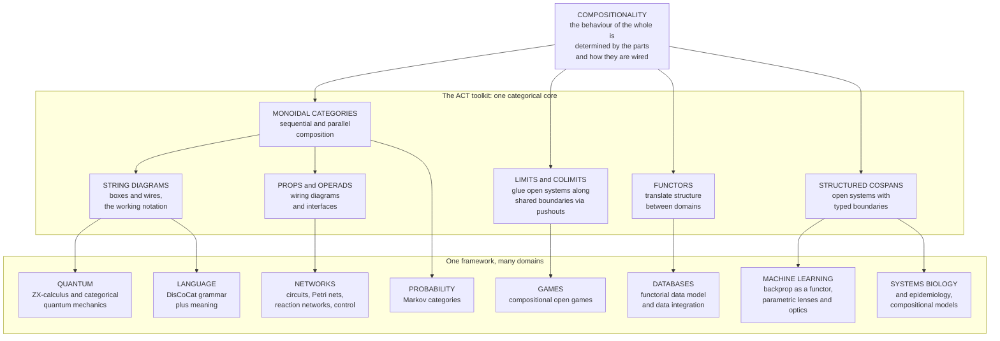

# 🔌 Applied Category Theory

> [!abstract] TL;DR
> **Applied category theory (ACT)** is the fast-growing movement that uses category theory — especially **monoidal categories** and **[[String_Diagrams_and_Graphical_Calculus|string diagrams]]** — as a *practical, unifying language for compositional systems* across science and engineering. Its core thesis is **compositionality**: complex systems are built by **connecting simpler ones**, and *the behaviour of the whole is determined by the behaviours of the parts and how they are wired*. The recurring toolkit is small — monoidal categories for sequential-and-parallel composition, **PROPs / operads** for wiring diagrams and interfaces, **[[Limits_and_Colimits|(co)limits]] (pushouts)** for gluing open systems along shared boundaries, **[[Functors]]** for translating between domains, **Markov categories** for probability, and **structured cospans** for open systems — yet it fans out onto a striking breadth of applications: **quantum computing** (ZX-calculus), **network theory** (circuits, Petri nets, chemical reaction networks, control), **databases** (the functorial data model), **natural language** (DisCoCat), **machine learning** (backprop as a functor, lenses/optics for gradient learning), **game theory** (open games), **probability**, **systems biology**, and **epidemiology**. ACT is the strongest evidence that category theory is *not just for pure mathematicians* — it is becoming the working mathematics of interconnection for engineered and scientific systems, with genuine successes (ZX quantum compilation, CQL data integration, DisCoPy) alongside areas that are still more unifying-vocabulary than new-results.

---

## Intuition

**Analogy — one wiring picture describes everything.** Draw a few **boxes connected by wires**. What did you just draw? It could be an **electrical circuit** (boxes are resistors and op-amps, wires carry current). It could be a **chemical reaction network** (boxes are reactions, wires are chemical species). It could be a **supply chain** (boxes are factories, wires are shipments), a **neural network** (boxes are layers, wires are activations), a **Bayesian model** (boxes are conditional distributions, wires are random variables), or a **quantum process** (boxes are gates, wires are qubits). The engineer's eye sees the *same shape* every time: **components with typed ports, connected up, running in sequence and in parallel.**

Applied category theory is the discovery that this coincidence is **not a coincidence**. The way parts connect and combine — **compositionality** — has *one* mathematics underneath all these domains. That mathematics is category theory: wires are **objects (types)**, boxes are **morphisms (processes)**, plugging outputs into inputs is **composition**, and running two subsystems side by side is the **monoidal product** ([[String_Diagrams_and_Graphical_Calculus]], and the forthcoming *Monoids and Monoidal Categories* sibling). The promise is a **shared, rigorous language** for "systems made of interacting parts," so that a theorem or a software tool built for circuits can be *transported* to reaction networks, or to Markov processes, or to machine-learning pipelines, because underneath they are the **same categorical structure wearing different labels**. Compositionality is the antidote to complexity: instead of reasoning about a monolith, you reason about small parts and about *how they are wired*, and the whole follows.

---

## How It Works

### The core thesis: compositionality

A system is **compositional** when *the behaviour of the whole is a function of the behaviours of the parts and of the wiring* — nothing else. Formally, this is exactly what a **functor** guarantees: a structure-preserving map from a category of **syntax** (how boxes are wired) to a category of **semantics** (what each box does) sends *composite wiring to composite behaviour*, `F(g ∘ f) = F(g) ∘ F(f)` and `F(f ⊗ g) = F(f) ⊗ F(g)`. Because the semantics functor respects both **sequential** composition `∘` and **parallel** composition `⊗`, you can compute the meaning of a large diagram by computing the meaning of each box and combining — the categorical restatement of "no emergent surprises beyond the wiring." Non-compositional systems (where the whole depends on hidden global state the wiring does not capture) are precisely the systems this machinery *cannot* tame, and recognising that boundary is half the skill.

### The ACT toolkit

The remarkable feature of ACT is how *few* mathematical tools recur across wildly different domains:

1. **Monoidal categories `(C, ⊗, I)`** — the home of two composition operations: `∘` (do this, **then** that) and `⊗` (do this **beside** that). This is the minimum structure for "systems with parts running in sequence and in parallel."
2. **String diagrams** — the graphical syntax of monoidal categories: boxes and wires you can *slide and bend* without changing meaning ([[String_Diagrams_and_Graphical_Calculus]]). ACT's working notation.
3. **PROPs and operads** — algebraic structures whose elements *are* wiring diagrams. A **PROP** packages boxes with `n` inputs and `m` outputs; an **operad** packages "ways of nesting a whole inside a boundary." They formalise **interfaces**: what it means to have a port you can plug into.
4. **(Co)limits, especially pushouts** — to build an **open system** you expose a **boundary/interface**, and to glue two open systems you take a **pushout** that identifies their shared boundary ([[Limits_and_Colimits]]). Colimits are the categorical "glue along the overlap" operation ([[Products_and_Coproducts]] are the simplest case).
5. **Functors as translations** — a functor `F : Circuits → LinearRelations` sends each circuit to its behaviour; a functor between two application categories *transports* results from one domain to another ([[Functors]]).
6. **Markov categories** — symmetric monoidal categories with **copy** and **discard** maps, axiomatising **probability** diagrammatically: wires are random variables, boxes are stochastic channels (Markov kernels), and conditional independence becomes a picture (Fritz).
7. **Decorated / structured cospans** — the Baez–Fong–Courser recipe for **open systems**: an object plus a *boundary* it can be glued along, assembled into a category where composition *is* gluing. This is the general engine behind compositional circuits, Petri nets, and epidemiological models.

### Open systems and gluing

The technical heart of ACT is turning **closed** models (a fixed circuit, a fixed reaction network) into **open** ones with **interfaces** so they can be composed. An open system is a **cospan** `Boundary_L → System ← Boundary_R`: a system together with left and right boundaries where it can be plugged in. Composing two open systems means gluing them along their **shared** boundary — a **pushout** in the category of systems ([[Limits_and_Colimits]]). The payoff is that a big model is *literally assembled* from small labelled pieces, and its overall behaviour is computed by a functor applied piece by piece. This is the general pattern the Python demo makes concrete with stochastic channels.

### The application fan-out — one core, many domains



---

## Key Concepts

### Secondary (intuition-level)
- **Compositionality**: build big systems by connecting small ones; the whole does exactly what the parts and the wiring say.
- **Two ways to combine**: **in series** (output feeds input) and **in parallel** (side by side, independent).
- **One picture, many meanings**: the same boxes-and-wires diagram can describe a circuit, a reaction, a probability model, or a quantum process.
- **Open system**: a piece with **ports/interfaces** you can plug into other pieces.

### Undergraduate (working definitions)
- **Monoidal category `(C, ⊗, I)`**: composition `∘` plus a parallel product `⊗` with unit `I`; the setting for sequential-and-parallel systems.
- **Semantics functor**: a structure-preserving map `F` from *wiring diagrams* to *behaviours* with `F(g ∘ f) = F(g) ∘ F(f)` and `F(f ⊗ g) = F(f) ⊗ F(g)` — this equation *is* compositionality.
- **PROP / operad**: algebraic gadgets whose elements are wiring diagrams with typed inputs and outputs; they formalise interfaces.
- **Cospan / pushout**: an open system is a cospan `L → S ← R`; gluing two open systems along a shared boundary is a **pushout** ([[Limits_and_Colimits]]).
- **Markov category**: a symmetric monoidal category with **copy** and **discard**; stochastic channels compose in series by matrix product and in parallel by tensor.

### Graduate (structural / research-level)
- **Structured and decorated cospans (Baez–Fong–Courser)**: functors that *decorate* boundaries with structure (a circuit, a Petri net, an epidemic model) yield symmetric monoidal (double) categories of open systems whose composition is pushout-along-boundary; the black-boxing functor sends an open system to its externally observable behaviour.
- **Functorial semantics** (Lawvere): a **PROP / Lawvere-theory morphism** into a semantic category is exactly a compositional model; signal-flow graphs, for instance, are the free PROP on a few generators, and their behaviour is a functor into the category of **linear relations**.
- **Categorical probability**: Markov categories (Fritz) axiomatise probability *without* measure-theoretic scaffolding — the CD-calculus makes conditional independence, sufficient statistics, and de Finetti-style theorems into diagrammatic derivations; **conditioning** is Bayesian inversion of a channel.
- **Optics and lenses for learning**: the **parametric lens / optic** captures a forward pass paired with a backward pass; "**backprop is a functor**" (Fong–Spivak–Tuyéras) and its successors (Categorical Foundations of Gradient-Based Learning) present supervised learning, backprop, and Bayesian updating as *one* categorical structure ([[Backpropagation]]).
- **Compositional (open) game theory** (Ghani–Hedges–Winschel–Zahn): games are morphisms in a monoidal category with a **lens-like** structure carrying strategy *forward* and payoff/utility *backward*; Nash equilibria of a composite game are computed compositionally from subgames ([[Algorithmic_Game_Theory]]).
- **Categorical quantum mechanics** (Abramsky–Coecke): a **dagger-compact category** models quantum processes; the **ZX-calculus** is a *complete* string-diagram rewrite system for qubit computation ([[Quantum_Gates_and_Circuits]], [[Entanglement_and_Bell_States]]).

---

## Python Demo

We make **compositionality** concrete on one applied example: **open stochastic processes** (Markov kernels) composed along **shared interfaces**. Each *process* is a **typed box** — input wire types in, output wire types out — carrying a **stochastic matrix** (rows sum to 1). We implement **sequential composition** `then` (type-checked; the shared wire is the interface, and composition is matrix multiplication) and **parallel composition** `tensor` (a Kronecker product of channels). We then compute a **whole-system channel from its parts** and *verify compositionality*: the composite is fully determined by the parts and stays a valid channel (closure under composition = the category axioms hold). Everything is pure standard library; matplotlib only visualises the wiring and the emergent whole-from-parts. `numpy` is optional and not used.

```python
"""
Applied category theory: COMPOSITIONALITY of open stochastic processes.

A process is a typed box in a Markov category:
    dom  = tuple of input wire state-spaces    (the input interface)
    cod  = tuple of output wire state-spaces    (the output interface)
    mat  = stochastic matrix, mat[i][j] = P(output j | input i), rows sum to 1

  sequential composition  f.then(g)  -> matrix product   (glue along shared wire)
  parallel   composition  f.tensor(g)-> Kronecker product (side-by-side systems)

We build a small sensor -> classifier pipeline, compute the WHOLE-system channel
from the PARTS, and verify compositionality: the composite is determined by the
parts and remains a valid stochastic channel.  Pure stdlib + matplotlib.
"""
import matplotlib.pyplot as plt


def matmul(P, Q):
    """Sequential composition of stochastic maps: (P then Q)[i][k] = sum_j P[i][j] Q[j][k]."""
    n, m, k = len(P), len(Q), len(Q[0])
    return [[sum(P[i][j] * Q[j][k] for j in range(m)) for k in range(k)] for i in range(n)]


def kron(P, Q):
    """Parallel composition (monoidal tensor): Kronecker product of two channels."""
    nP, mP, nQ, mQ = len(P), len(P[0]), len(Q), len(Q[0])
    R = [[0.0] * (mP * mQ) for _ in range(nP * nQ)]
    for i in range(nP):
        for ip in range(nQ):
            for j in range(mP):
                for jp in range(mQ):
                    R[i * nQ + ip][j * mQ + jp] = P[i][j] * Q[ip][jp]
    return R


def rows_stochastic(M, tol=1e-9):
    return all(abs(sum(row) - 1.0) < tol and all(x >= -tol for x in row) for row in M)


class Process:
    """A morphism in a Markov category: a typed box carrying a stochastic matrix."""
    def __init__(self, name, dom, cod, mat):
        self.name, self.dom, self.cod, self.mat = name, tuple(dom), tuple(cod), mat
        assert len(mat) == self._size(self.dom), "row count must match input interface"
        assert len(mat[0]) == self._size(self.cod), "col count must match output interface"
        assert rows_stochastic(mat), f"{name} is not a valid channel (rows must sum to 1)"

    @staticmethod
    def _size(wires):
        n = 1
        for w in wires:
            n *= len(w)
        return n

    def then(self, other):
        """Sequential: SELF first, THEN other. The shared wire is the interface."""
        if self.cod != other.dom:
            raise TypeError(f"interface mismatch: {self.cod} != {other.dom}")
        return Process(f"({self.name};{other.name})", self.dom, other.cod,
                       matmul(self.mat, other.mat))

    def tensor(self, other):
        """Parallel: SELF beside OTHER, an independent side-by-side system."""
        return Process(f"({self.name} x {other.name})",
                       self.dom + other.dom, self.cod + other.cod,
                       kron(self.mat, other.mat))


if __name__ == "__main__":
    TRUE = ("Hot", "Cold")        # hidden true state
    READ = ("hi", "lo")           # sensor reading  (shared interface wire)
    DEC  = ("On", "Off")          # controller decision

    # PART 1: a noisy sensor,  P(reading | true state)
    sensor = Process("S", (TRUE,), (READ,),
                     [[0.9, 0.1],    # Hot  -> mostly reads hi
                      [0.2, 0.8]])   # Cold -> mostly reads lo
    # PART 2: a classifier,    P(decision | reading)
    classify = Process("C", (READ,), (DEC,),
                       [[0.7, 0.3],  # hi -> mostly On
                        [0.1, 0.9]]) # lo -> mostly Off

    # WHOLE from PARTS: glue along the shared READ interface (sequential composition)
    pipeline = sensor.then(classify)      # P(decision | true state)

    print("== Compositionality: whole computed from parts ==")
    print("  sensor   P(read|true):   ", sensor.mat)
    print("  classify P(dec|read):    ", classify.mat)
    print("  pipeline P(dec|true):    ", [[round(x, 3) for x in r] for r in pipeline.mat])
    print("  composite still a valid channel (rows sum to 1):", rows_stochastic(pipeline.mat))

    # PARALLEL composition: run two independent sensors side by side (tensor).
    joint = sensor.tensor(sensor)         # P(read1, read2 | true1, true2)
    print("\n== Parallel (monoidal tensor) ==")
    print("  joint interface:", [len(w) for w in joint.dom], "->", [len(w) for w in joint.cod],
          " (4x4 Kronecker channel, still stochastic:", rows_stochastic(joint.mat), ")")

    # -------- Visualise: the wiring (compositional structure) + emergent whole --------
    fig, axes = plt.subplots(1, 4, figsize=(16, 4.2))

    ax = axes[0]                          # the wiring diagram (string-diagram style)
    ax.set_title("Wiring: two open boxes\nglued along the shared 'read' wire",
                 fontsize=10, fontweight="bold")
    ax.axis("off"); ax.set_xlim(0, 4); ax.set_ylim(0, 3)
    for x, name in ((1, "S"), (2.6, "C")):
        ax.add_patch(plt.Rectangle((x - 0.32, 1.2), 0.64, 0.6,
                     facecolor="#dfe9f7", edgecolor="#2c3e6b", lw=2))
        ax.text(x, 1.5, name, ha="center", va="center", fontsize=14, fontweight="bold",
                color="#2c3e6b")
    ax.plot([0.3, 0.68], [1.5, 1.5], color="#33475b", lw=2)   # true -> S
    ax.plot([1.32, 2.28], [1.5, 1.5], color="#c0392b", lw=2.4) # shared interface wire
    ax.plot([2.92, 3.6], [1.5, 1.5], color="#33475b", lw=2)   # C -> decision
    ax.text(0.3, 1.75, "true", ha="left", fontsize=9, color="#666")
    ax.text(1.8, 1.72, "read\n(interface)", ha="center", fontsize=8, color="#c0392b")
    ax.text(3.55, 1.75, "decision", ha="right", fontsize=9, color="#666")

    def heat(ax, P, rows, cols, title):
        ax.imshow(P, cmap="Blues", vmin=0, vmax=1, aspect="auto")
        ax.set_title(title, fontsize=10, fontweight="bold")
        ax.set_xticks(range(len(cols))); ax.set_xticklabels(cols, fontsize=9)
        ax.set_yticks(range(len(rows))); ax.set_yticklabels(rows, fontsize=9)
        for i in range(len(P)):
            for j in range(len(P[0])):
                ax.text(j, i, f"{P[i][j]:.2f}", ha="center", va="center",
                        color="#111" if P[i][j] < 0.6 else "#fff", fontsize=10)

    heat(axes[1], sensor.mat,   TRUE, READ, "PART: P(read | true)")
    heat(axes[2], classify.mat, READ, DEC,  "PART: P(dec | read)")
    heat(axes[3], pipeline.mat, TRUE, DEC,  "WHOLE = PART ; PART\nP(dec | true)")

    fig.suptitle("Compositionality: the whole channel is DETERMINED by the parts and the wiring",
                 fontsize=12, fontweight="bold")
    fig.tight_layout(rect=[0, 0, 1, 0.90])
    plt.show()   # or: fig.savefig("applied_ct_compositionality.png", dpi=120)
```

**What the run shows.** The pipeline channel `P(decision | true state)` is computed *entirely* from the two part-channels by matrix multiplication — glue the sensor and classifier along their **shared `read` interface** and the composite is fixed; nothing about the whole exceeds the parts and the wiring. Crucially the composite **remains a valid stochastic channel** (rows still sum to 1): channels are *closed under composition*, which is precisely the statement that these processes form a **category** (a Markov category). The `tensor` example runs two sensors **in parallel** via a Kronecker product, giving a `4x4` joint channel that is again stochastic — the monoidal product of two systems is a system. The heatmaps make the emergent whole-from-parts visible, and the type check in `then` refuses to connect boxes whose interfaces do not match, exactly as the categorical composition law demands.

---

## Real-World Applications

> **Example — ZX-calculus for quantum circuit compilation.** The single most-cited ACT success. Categorical quantum mechanics recasts quantum processes as string diagrams in a dagger-compact category, and the **ZX-calculus** refines this into red/green **spiders** with a *complete* set of graphical rewrite rules. Compilers such as **PyZX** and **tket** optimise *real* quantum circuits — cutting T-gate counts, resynthesising, and doing lattice-surgery for error correction — by rewriting diagrams rather than multiplying matrices. This is engineering, shipping in quantum toolchains, and it connects directly to [[Quantum_Gates_and_Circuits]] and the entanglement structure in [[Entanglement_and_Bell_States]].

- **Network theory (Baez school).** Electrical circuits, **signal-flow graphs**, control systems, **Petri nets**, **chemical reaction networks**, and open Markov processes are all presented as composable open systems (structured cospans). One framework yields black-boxing functors that compute a network's external behaviour from its parts — the mathematics of compositional modelling for physical and biological networks.
- **Databases and data integration.** Spivak's **functorial data model** treats a schema as a category and a database instance as a functor into `Set`; data migration is functor composition. The **CQL / AQL** tools (Categorical Query Language) use this for provably correct **data integration** across heterogeneous schemas — a real, deployed engineering use.
- **Machine learning foundations.** "**Backprop as functor**" (Fong–Spivak–Tuyéras) and *Categorical Foundations of Gradient-Based Learning* present supervised learning, **backpropagation**, and even Bayesian updating as one **parametric-lens / optic** structure, clarifying why the chain rule composes ([[Backpropagation]]). Libraries and the GATs/AlgebraicJulia ecosystem build on this.
- **Natural language (DisCoCat).** The **compositional distributional** model (Coecke–Sadrzadeh–Clark) wires **grammar** (pregroup cups) to **meaning** (word vectors) as one string diagram, so sentence meaning is a tensor contraction — the seed of **quantum NLP** experiments and the **DisCoPy** library.
- **Compositional game theory.** **Open games** (Hedges and collaborators) make games morphisms with a lens-like forward-strategy / backward-payoff structure, so equilibria of composite economic and multi-agent systems assemble from subgames ([[Algorithmic_Game_Theory]]).
- **Categorical probability.** **Markov categories** (Fritz) give a synthetic, diagram-first probability theory in which conditional independence and sufficient-statistic theorems are graphical derivations — used to formalise causal inference and probabilistic programming semantics.
- **Systems biology and epidemiology.** Compositional model builders (AlgebraicJulia's `AlgebraicDynamics`, `AlgebraicPetri`) let epidemiologists **assemble** SIR-style and reaction models from reusable open pieces, an approach exercised during real disease-modelling efforts.

---

## Common Pitfalls

- **Assuming everything is compositional.** ACT works when the whole is a function of the parts and the wiring. Systems with hidden global coupling (shared mutable state, long-range side effects, strategic behaviour the interface does not expose) are *not* compositional, and forcing a categorical model onto them hides the very coupling that matters. Recognising the boundary is a skill, not a failure.
- **Vocabulary mistaken for results.** ACT's greatest strength — that quantum, databases, circuits, and ML share a language — is also its trap. A tidy diagram is a *reformulation*, not automatically a new theorem or a faster algorithm. Ask what the categorical framing *computes* or *proves* that the domain-native formulation did not.
- **Interface mismatch treated as detail.** Composition is only defined when output types meet input types. In open-systems modelling the boundary *is* the model; sloppy interfaces silently glue the wrong wires. The demo's type check exists precisely to catch this.
- **Confusing monoidal flavours.** Cartesian (copy-and-discard, as in [[Products_and_Coproducts]]), symmetric, compact-closed, and dagger structures license *different* diagrammatic moves. Probability needs copy but **not** discard-for-free faithfully; quantum forbids copying (no-cloning). Using the wrong structure yields false equations ([[String_Diagrams_and_Graphical_Calculus]]).
- **Pushout as naive union.** Gluing open systems is a **pushout along a shared boundary** ([[Limits_and_Colimits]]), not a set-union: the identification of the overlap is the whole point, and getting the boundary map wrong double-counts or drops shared components.
- **Underestimating the learning curve.** The abstraction that makes ACT unifying also makes it steep. *Seven Sketches in Compositionality* exists as an on-ramp for exactly this reason; skipping the concrete examples (circuits, resource theories, databases) and starting from generality is the usual way to bounce off.
- **Maturity overclaim.** Some sub-areas are production engineering (ZX, CQL, DisCoPy); others are still aspirational unifications. Cite the mature ones as evidence and be honest that the frontier is uneven — the credible pitch is "a powerful organising language with a growing set of real wins," not "a finished revolution."

---

## Related Concepts

- [[String_Diagrams_and_Graphical_Calculus]] — the working notation of ACT: monoidal categories drawn as boxes and wires, sequential and parallel composition made topological.
- [[Limits_and_Colimits]] — **pushouts** are the "glue open systems along a shared boundary" operation at the heart of structured cospans.
- [[Functors]] — the **semantics functor** *is* compositionality: a structure-preserving map from wiring to behaviour, and the way results transport between domains.
- [[Monads_Categorically]] — a monad is a monoid in a monoidal category; effectful and probabilistic ACT models (the Giry monad, Markov categories) sit atop this monoidal backbone.
- [[Products_and_Coproducts]] — the cartesian copy/discard structure that separates deterministic categories from Markov and quantum ones.
- [[Diagrams_and_Commutativity]] — commuting diagrams and string diagrams are dual pictures; both encode "the composite depends only on the wiring."
- [[Algorithmic_Game_Theory]] — compositional/open games realise game theory as morphisms with lens structure, an ACT application area.
- [[Backpropagation]] — "backprop as a functor" and parametric lenses/optics give gradient learning a categorical, compositional foundation.
- [[Quantum_Gates_and_Circuits]] — the ZX-calculus, ACT's flagship success, is a complete string-diagram language for qubit circuits.
- [[Entanglement_and_Bell_States]] — entanglement as cups/caps is the categorical-quantum-mechanics primitive underlying ZX.
- [[Category_Theory_Overview]] — the parent overview of objects, morphisms, functors, and the monoidal structures ACT deploys.

*Forthcoming Category_Theory siblings this note anchors to (referenced in prose, to be linked once written):* **Monoids and Monoidal Categories** (the algebraic backbone of `⊗` and `I`), **Categorical Databases and Systems** (the functorial data model and CQL), **Ends, Coends and Profunctors** (the optics/profunctor machinery behind lenses for learning), **Category Theory in Programming** (wiring-diagram / dataflow programming, DisCoPy, Catlab.jl), and **The Reach and Future of Category Theory** (where ACT sits on the pure-to-applied spectrum).

---

## Review Questions

1. **(Conceptual)** State the compositionality thesis precisely, and explain *why a functor is exactly the right formal object* to express it. What do the equations `F(g ∘ f) = F(g) ∘ F(f)` and `F(f ⊗ g) = F(f) ⊗ F(g)` guarantee about computing the behaviour of a large diagram, and what kind of real system *violates* compositionality?

2. **(Scenario)** You must model a plant as many open subsystems that plug together at shared boundaries. (a) Describe an open subsystem as a **cospan** and explain how composing two of them uses a **pushout** ([[Limits_and_Colimits]]). (b) In the stochastic version from the demo, which operation gives *series* composition and which gives *parallel* composition, and why does the composite remain a valid channel? (c) Give one concrete guarantee ACT buys you here that an ad-hoc simulation script does not.

3. **(Trade-off / structural)** ACT is praised as a unifying language and criticised as "vocabulary, not results." (a) Name two application areas where ACT delivers *deployed engineering* and say what the categorical framing actually computes in each. (b) Name one area where ACT is currently more re-description than new theorem, and explain how you would tell the difference. (c) When would you *decline* to use a categorical model for a system, and what feature of the system drives that decision?

---

## Sources

- [Fong, B. and Spivak, D., *Seven Sketches in Compositionality: An Invitation to Applied Category Theory*, 2019 (arXiv:1803.05316)](https://arxiv.org/abs/1803.05316) — the standard on-ramp to ACT, organised entirely around compositionality and string diagrams.
- [Baez, J. and Stay, M., "Physics, Topology, Logic and Computation: A Rosetta Stone", 2011 (arXiv:0903.0340)](https://arxiv.org/abs/0903.0340) — the manifesto that one categorical language unifies quantum physics, topology, logic, and computation.
- [Fritz, T., "A synthetic approach to Markov kernels, conditional independence and theorems on sufficient statistics", *Advances in Mathematics*, 2020 (arXiv:1908.07021)](https://arxiv.org/abs/1908.07021) — the definitive account of **Markov categories** and categorical probability.
- [Fong, B., Spivak, D. and Tuyéras, R., "Backprop as Functor: A Compositional Perspective on Supervised Learning", 2019 (arXiv:1711.10455)](https://arxiv.org/abs/1711.10455) — the categorical foundation of gradient-based learning as a functor / parametric lens.
- [Ghani, N., Hedges, J., Winschel, V. and Zahn, P., "Compositional Game Theory", 2018 (arXiv:1603.04641)](https://arxiv.org/abs/1603.04641) — **open games**: games as composable morphisms with lens structure.
- [Coecke, B. and Kissinger, A., *Picturing Quantum Processes* (Cambridge University Press, 2017)](https://www.cambridge.org/core/books/picturing-quantum-processes/1119568B3101F3A685BE832FEEC53E52) — categorical quantum mechanics and the ZX-calculus, ACT's flagship application.

---

#category-theory #applied-category-theory #compositionality #string-diagrams #systems
