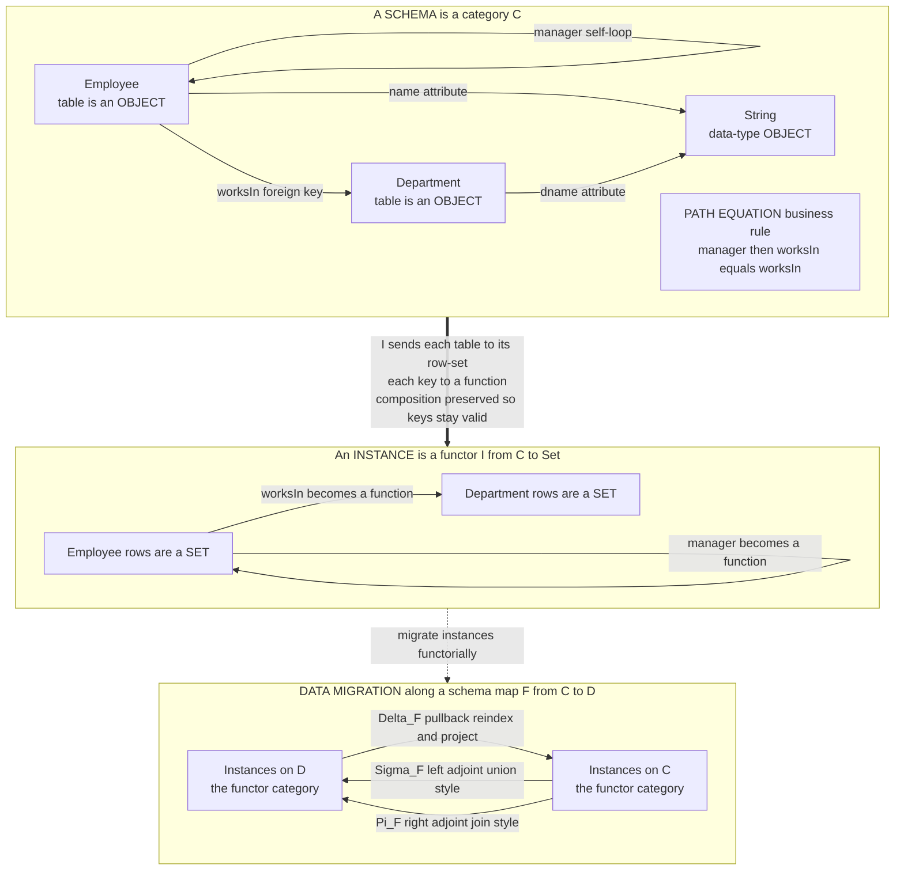

# 🗄️ Categorical Databases and Systems

> [!abstract] TL;DR
> **A database schema is literally a category, and this is not an analogy.** In David Spivak's **functorial data model**, a **schema is a finitely-presented category `C`**: each **table/entity is an object**, each **foreign key is a morphism**, each **attribute is a morphism into a data-type object**, and each **business rule / referential-integrity constraint is a path equation** — a commuting diagram. A **database instance** (a filled-in state) is then a **functor `I : C → Set`**: every table maps to its *set of rows* and every foreign key to a *function* between row-sets, and because functors preserve composition, **foreign-key integrity holds automatically**. The category of all instances on `C` is the functor category `[C, Set]`, a presheaf-style topos. Best of all, **data migration becomes adjoint functors**: a schema mapping `F : C → D` (itself a functor) induces a **pullback** `Δ_F` (reindex/project) with a **left adjoint** `Σ_F` (union-style) and a **right adjoint** `Π_F` (join-style) — so ETL, schema evolution, and data integration become *provably correct* operations rather than ad-hoc scripts. This is the flagship success story of **applied category theory** — schemas are categories, instances are functors, migration is adjoints — realised in the **CQL / Conexus** tooling and generalising to compositional modelling of **open systems**, Petri nets, and knowledge graphs.

---

## Intuition

**Analogy — a database schema is already a diagram, so treat it as one.** Open any database design tool and you will draw *boxes for tables* and *arrows for foreign keys*: an `Employee` box with an arrow to a `Department` box labelled "works in," an arrow looping back on `Employee` labelled "manager." That picture — boxes and arrows that compose, plus rules like "your manager works in *the same department* you do" (follow the `manager` arrow then the `worksIn` arrow, and you land where `worksIn` alone would send you) — **is a category.** The boxes are **objects**, the arrows are **morphisms**, and the "these two paths must agree" rules are **commuting diagrams**. You have been drawing categories all along without the name.

Once you see the *schema* as a category, everything else snaps into place. A **database instance** — the actual rows sitting in the tables today — is nothing more than a way of *filling that diagram with sets*: replace the `Employee` box with the *set* of employee rows, replace each foreign-key arrow with an *actual function* sending each employee to their department. A structure-preserving fill of a category's diagram with sets and functions is exactly a **functor `C → Set`**. And **migrating data** from one schema to another — the daily grind of ETL and schema evolution — becomes *composing and adjointing functors*, an operation with mathematical guarantees that a hand-written `INSERT ... SELECT` script simply cannot promise.

---

## How It Works

### Core mechanics — the three-line dictionary

The functorial data model rests on a translation so tight that Spivak calls it a definition, not a metaphor:

1. **A schema is a category `C`.** Objects are **tables/entities**. A morphism `f : A → B` is a **foreign key** column: it names, for every row of `A`, a *unique* row of `B` it points to. **Attributes** (name, salary, date) are morphisms `A → String`, `A → Int`, etc., into fixed **data-type objects**. Business rules and referential-integrity constraints are **path equations**: assertions that two composite paths of foreign keys are *equal* — i.e. that a diagram **commutes** (see [[Diagrams_and_Commutativity]]). The schema is a **finitely-presented category**: finitely many generating objects and morphisms, subject to finitely many path equations, exactly as a group is given by generators and relations.

2. **An instance is a functor `I : C → Set`.** It sends each object (table) `A` to a **set `I(A)`** — its rows — and each morphism (foreign key) `f : A → B` to a **function `I(f) : I(A) → I(B)`**. The **functor laws do the referential-integrity work for free**: because `I` preserves composition, `I(g ∘ f) = I(g) ∘ I(f)`, every foreign key necessarily lands on a *real, existing* row of the target table (no dangling pointers), and every path equation of the schema is *automatically respected by any legal instance*. Integrity is not enforced by triggers; it is baked into what "functor" means. See [[Functors]].

3. **The category of instances is `[C, Set]`.** All instances on `C`, with natural transformations between them as the structure-preserving maps, form the **functor category `[C, Set]`** — a **presheaf-like topos** (see [[Presheaves_and_Representables]], [[Cartesian_Closed_and_Topos_Theory]]). This topos has all **limits and colimits**, which is exactly where *queries* live: a **join is a pullback/product**, a **union is a coproduct**, selection and projection are further (co)limit constructions (see [[Limits_and_Colimits]], [[Products_and_Coproducts]]). Relational algebra reappears as the (co)limit structure of `Set`.

### Data migration as an adjoint triple

The payoff is **data migration**. A **schema mapping is a functor `F : C → D`** — a translation of one schema's tables/keys into another's that respects the rules. Precomposition with `F` gives the **pullback (or "delta") functor**

`Δ_F : [D, Set] → [C, Set],  Δ_F(J) = J ∘ F`,

which **reindexes / projects** a `D`-instance onto `C` — the workhorse of *view definitions* and *forgetting columns*. Crucially, `Δ_F` sits in an **adjoint triple** `Σ_F ⊣ Δ_F ⊣ Π_F`:

- **`Σ_F` (left adjoint, "sigma / pushforward"):** a **union/quotient-style** migration built from **colimits**. It *glues* rows together along `F` — think `UNION`, merging tables, or freely inventing new rows demanded by the target schema.
- **`Π_F` (right adjoint, "pi / pushforward"):** a **join/product-style** migration built from **limits**. It *matches* rows compatibly across `F` — think `JOIN`, forming tuples that satisfy all the target's constraints at once.

These are the **only three canonical migrations**, and their adjointness gives *free correctness theorems*: `Δ` has both a best under-approximation (`Σ`) and best over-approximation (`Π`), so **ETL and data exchange become principled functorial operations with adjoint guarantees** rather than brittle scripts. This is exactly the Kan-extension machinery (`Σ_F = Lan_F`, `Π_F = Ran_F` along `F`) specialised to `Set`-valued functors (see [[Kan_Extensions]], [[Adjunctions]]); it is one of the headline case studies of [[Applied_Category_Theory]].



---

## Key Concepts

### Secondary (intuition first)
- The **schema you already draw** — boxes for tables, arrows for foreign keys, rules like "manager works in the same department" — *is a category*. Boxes are objects, arrows are morphisms, rules are commuting paths.
- The **data currently in the tables** is a way of *filling that diagram with sets and functions*; that fill is a **functor** into the world of sets.
- **Moving data between schemas** is *composing and adjointing functors* — a mathematical operation, so it comes with correctness guarantees ordinary scripts lack.

### Undergraduate (the machinery)
- **Schema = finitely-presented category `C`:** generating objects (tables), generating morphisms (foreign keys and attributes into type objects), and **path equations** (referential-integrity/business rules as commuting diagrams).
- **Instance = functor `I : C → Set`:** objects to row-sets, morphisms to functions; **functoriality gives foreign-key integrity and satisfies all path equations for free.**
- **Instances form `[C, Set]`,** the functor category — a topos with all limits and colimits; **joins are pullbacks/products, unions are coproducts**, tying the model to relational algebra ([[Relational_Model]], [[Joins]], [[Set_Operations]]).
- **Schema mapping = functor `F : C → D`.** The **pullback** `Δ_F(J) = J ∘ F` reindexes/projects instances; it is a *view* mechanism and is trivially computable.

### Graduate (structure and reach)
- **The adjoint triple `Σ_F ⊣ Δ_F ⊣ Π_F`:** `Σ_F` is the **left Kan extension** `Lan_F` (colimit-built, union/quotient migration), `Π_F` is the **right Kan extension** `Ran_F` (limit-built, join/product migration). This is [[Kan_Extensions]] and [[Adjunctions]] specialised to `[−, Set]`.
- **Categorical semantics of data exchange:** the composites `Δ ; Σ` and `Δ ; Π` express the standard "chase" of source-to-target dependencies; provably-correct schema evolution is functor composition.
- **Algebraic databases (Schultz–Spivak–Vasilakopoulou–Wisnesky):** upgrade `Set` to a category enriched over an *algebraic theory* so that attributes carry equational structure (`String`, `Int` with their operations), unifying the functorial data model with the entity-attribute view — the theory behind **CQL/AQL**.
- **Ologs (ontology logs):** finitely-presented categories used directly as **knowledge representation** — objects are concept types, morphisms are relationships, commuting diagrams are facts; a categorical alternative to RDF/OWL that ports to instances and migration.
- **Beyond databases — compositional systems:** open systems glued along shared interfaces via **pushouts/colimits**, **Petri nets** and dynamical systems as (operadic) categorical structures, and **string / wiring diagrams** for architecture — the "build big systems from small ones with guarantees" thesis (see [[String_Diagrams_and_Graphical_Calculus]]).

---

## Python Demo

This implements the **functorial data model** on the classic tiny example. We define a **schema as a small category** (`Employee` with a `worksIn` foreign key to `Department` and a `manager` self-loop, plus the path equation `manager ; worksIn = worksIn`), represent an **instance as a functor to `Set`**, and **check the instance satisfies the path equation** (the diagram commutes). Then we build a **schema mapping `F : C → D`** into a richer schema and perform **data migration via the pullback `Δ_F`** (reindexing/projection). Finally we **exhibit the adjoints** `Σ_F` (union-style, a colimit) and `Π_F` (join-style, a limit) for the collapse `C → 1`, and visualise the schema category, the instance, and the migration functors.

```python
"""
The FUNCTORIAL DATA MODEL (Spivak) on a tiny example.

  PART 1  A SCHEMA is a small category C:
            objects   = tables            Employee, Department
            morphisms = foreign keys      worksIn : Employee -> Department
                                          manager : Employee -> Employee (self-loop)
            a PATH EQUATION (a commuting diagram) encodes a business rule:
                       manager then worksIn  ==  worksIn
            "your manager works in the SAME department as you."
          An INSTANCE is a FUNCTOR I : C -> Set:
            each table       -> its set of rows,
            each foreign key -> a function between row-sets.
          We CHECK the instance satisfies the path equation (commutativity).

  PART 2  A schema map F : C -> D (inclusion into a richer schema with a
          Company table). DATA MIGRATION by the PULLBACK functor Delta_F,
          Delta_F(J) = J . F : reindex/project a D-instance back onto C.
          The migrated instance still satisfies C's equations -- functorial
          migration cannot silently break referential integrity.

  PART 3  The ADJOINTS of Delta for the collapse G : C -> 1 (one object):
            Sigma_G(I) = colimit of I = connected components   (UNION-style)
            Pi_G(I)    = limit  of I  = compatible global tuples (JOIN-style)
          Sigma_G is LEFT adjoint to Delta_G, Pi_G is RIGHT adjoint.

  Pure standard library for the mathematics; matplotlib only for the picture.
"""
import matplotlib
matplotlib.use("Agg")
import matplotlib.pyplot as plt

# =====================================================================
# PART 1  Schema C and an instance as a functor to Set
# =====================================================================
C_objects = ["Employee", "Department"]
C_gens = {                                  # foreign key : (source, target)
    "worksIn": ("Employee", "Department"),
    "manager": ("Employee", "Employee"),
}
# Path equations: (left_path, right_path); each path read first-to-last.
#   manager then worksIn  ==  worksIn
C_equations = [(["manager", "worksIn"], ["worksIn"])]


def apply_path(inst, path, x):
    """Follow a path of foreign keys starting from row x."""
    for gen in path:
        x = inst["morphisms"][gen][x]
    return x


def path_source(gens, path):
    return gens[path[0]][0]


def satisfies(inst, gens, equations):
    """Does the instance (a functor to Set) make every equation commute?"""
    violations = []
    for left, right in equations:
        src = path_source(gens, left)
        for x in inst["objects"][src]:
            if apply_path(inst, left, x) != apply_path(inst, right, x):
                violations.append((x, apply_path(inst, left, x),
                                   apply_path(inst, right, x)))
    return (len(violations) == 0), violations


# A VALID instance I : C -> Set (managers stay inside their own department).
I = {
    "objects": {
        "Employee": ["Alice", "Bob", "Carol"],
        "Department": ["Sales", "Eng"],
    },
    "morphisms": {
        "worksIn": {"Alice": "Sales", "Bob": "Eng", "Carol": "Eng"},
        "manager": {"Alice": "Alice", "Bob": "Carol", "Carol": "Carol"},
    },
}

# A BROKEN instance: Bob's manager Alice sits in a DIFFERENT department.
I_bad = {
    "objects": I["objects"],
    "morphisms": {
        "worksIn": dict(I["morphisms"]["worksIn"]),
        "manager": {"Alice": "Alice", "Bob": "Alice", "Carol": "Carol"},
    },
}

print("=== PART 1: schema as category, instance as functor to Set ===")
ok, _ = satisfies(I, C_gens, C_equations)
print(f"  valid  instance  satisfies 'manager;worksIn = worksIn' : {ok}")
ok_bad, viol_bad = satisfies(I_bad, C_gens, C_equations)
print(f"  broken instance  satisfies the same equation           : {ok_bad}")
for x, a, b in viol_bad:
    print(f"      violation at {x}: worksIn(manager) = {a}  !=  worksIn = {b}")

# =====================================================================
# PART 2  A schema map F : C -> D, migration by the pullback Delta_F
# =====================================================================
# D extends C with a Company table and a belongsTo foreign key.
D_gens = {
    "worksIn": ("Employee", "Department"),
    "manager": ("Employee", "Employee"),
    "belongsTo": ("Department", "Company"),
}
# F : C -> D is the inclusion (identity on the shared objects/morphisms).
F_obj = {"Employee": "Employee", "Department": "Department"}
F_mor = {"worksIn": "worksIn", "manager": "manager"}

# A D-instance J -- it carries Company data C's schema never mentions.
J = {
    "objects": {
        "Employee": ["Alice", "Bob", "Carol"],
        "Department": ["Sales", "Eng"],
        "Company": ["Acme"],
    },
    "morphisms": {
        "worksIn": {"Alice": "Sales", "Bob": "Eng", "Carol": "Eng"},
        "manager": {"Alice": "Alice", "Bob": "Carol", "Carol": "Carol"},
        "belongsTo": {"Sales": "Acme", "Eng": "Acme"},
    },
}


def delta(F_obj, F_mor, J, tgt_objects, tgt_gens):
    """Pullback: Delta_F(J) = J . F -- precompose the instance with F."""
    return {
        "objects": {c: J["objects"][F_obj[c]] for c in tgt_objects},
        "morphisms": {g: J["morphisms"][F_mor[g]] for g in tgt_gens},
    }


DJ = delta(F_obj, F_mor, J, C_objects, C_gens)
ok_dj, _ = satisfies(DJ, C_gens, C_equations)
print("\n=== PART 2: migration by the pullback Delta_F (project along F) ===")
print(f"  Delta_F(J) keeps objects            : {list(DJ['objects'])}")
print(f"  the Company table was projected OUT : {'Company' not in DJ['objects']}")
print(f"  migrated instance still satisfies C : {ok_dj}")

# =====================================================================
# PART 3  The adjoints of Delta for the collapse  G : C -> 1
#   Sigma_G(I) = colimit = connected components    (LEFT adjoint, union)
#   Pi_G(I)    = limit    = compatible global tuples (RIGHT adjoint, join)
# =====================================================================
class UnionFind:
    def __init__(self, items):
        self.p = {i: i for i in items}

    def find(self, i):
        while self.p[i] != i:
            self.p[i] = self.p[self.p[i]]
            i = self.p[i]
        return i

    def union(self, i, j):
        ri, rj = self.find(i), self.find(j)
        if ri != rj:
            self.p[max(ri, rj)] = min(ri, rj)


# Sigma_G(I): glue rows along EVERY foreign key -> connected components.
elems = [("Employee", e) for e in I["objects"]["Employee"]] + \
        [("Department", d) for d in I["objects"]["Department"]]
uf = UnionFind(elems)
for e in I["objects"]["Employee"]:
    uf.union(("Employee", e), ("Department", I["morphisms"]["worksIn"][e]))
    uf.union(("Employee", e), ("Employee", I["morphisms"]["manager"][e]))
components = {}
for x in elems:
    components.setdefault(uf.find(x), []).append(x)
sigma = sorted(sorted(name for _, name in members) for members in components.values())

# Pi_G(I): global sections = pick x_E, x_D with worksIn(x_E)=x_D, manager(x_E)=x_E.
pi = [(e, I["morphisms"]["worksIn"][e])
      for e in I["objects"]["Employee"]
      if I["morphisms"]["manager"][e] == e]

print("\n=== PART 3: the adjoints Sigma (union-style) and Pi (join-style) ===")
print(f"  Sigma_G(I) = colimit = {len(sigma)} components (union)   : {sigma}")
print(f"  Pi_G(I)    = limit    = {len(pi)} global tuples (join)    : {pi}")

# =====================================================================
# PART 4  Visualize schema, instance, and the migration functors
# =====================================================================
fig, (axS, axI, axM) = plt.subplots(1, 3, figsize=(16, 5.2))

# --- Panel S: the schema category C ---
posC = {"Employee": (0.28, 0.62), "Department": (0.78, 0.62)}
for name, (x, y) in posC.items():
    axS.scatter([x], [y], s=5600, color="#c7d2fe", edgecolors="black", zorder=3)
    axS.text(x, y, name, ha="center", va="center", fontsize=9.5, zorder=4)
axS.annotate("", xy=posC["Department"], xytext=posC["Employee"],
             arrowprops=dict(arrowstyle="-|>", color="#1d4ed8", lw=2.2,
                             shrinkA=36, shrinkB=36))
axS.text(0.53, 0.68, "worksIn", ha="center", color="#1d4ed8", fontsize=10)
axS.annotate("", xy=(0.20, 0.74), xytext=(0.20, 0.50),
             arrowprops=dict(arrowstyle="-|>", color="#059669", lw=2,
                             connectionstyle="arc3,rad=1.7"))
axS.text(0.03, 0.62, "manager", ha="center", color="#059669", fontsize=9.5,
         rotation=90)
axS.text(0.5, 0.24,
         "path equation:\nmanager then worksIn = worksIn\n"
         "a COMMUTING diagram",
         ha="center", va="center", fontsize=9,
         bbox=dict(boxstyle="round,pad=0.4", fc="#fef9c3", ec="#ca8a04"))
axS.set_title("A SCHEMA is a category C\ntables = objects, keys = morphisms",
              fontsize=10)
axS.set_xlim(0, 1); axS.set_ylim(0.05, 0.95); axS.axis("off")

# --- Panel I: the instance as a functor to Set ---
emp_y = {"Alice": 0.80, "Bob": 0.50, "Carol": 0.20}
dep_y = {"Sales": 0.70, "Eng": 0.32}
for e, y in emp_y.items():
    axI.text(0.14, y, e, ha="center", va="center", fontsize=9.5,
             bbox=dict(boxstyle="round,pad=0.3", fc="#dbeafe", ec="#2563eb"))
for d, y in dep_y.items():
    axI.text(0.82, y, d, ha="center", va="center", fontsize=9.5,
             bbox=dict(boxstyle="round,pad=0.3", fc="#dcfce7", ec="#16a34a"))
for e, y in emp_y.items():
    d = I["morphisms"]["worksIn"][e]
    axI.annotate("", xy=(0.72, dep_y[d]), xytext=(0.25, y),
                 arrowprops=dict(arrowstyle="-|>", color="#1d4ed8", lw=1.6))
axI.text(0.14, 0.94, "Employee rows", ha="center", fontsize=9, color="#2563eb")
axI.text(0.82, 0.94, "Department rows", ha="center", fontsize=9, color="#16a34a")
axI.text(0.5, 0.04, "worksIn as a FUNCTION between row-sets",
         ha="center", fontsize=9, color="#1d4ed8")
axI.set_title("An INSTANCE is a functor I : C -> Set", fontsize=10)
axI.set_xlim(0, 1); axI.set_ylim(0, 1); axI.axis("off")

# --- Panel M: the migration functors between instance categories ---
axM.text(0.22, 0.72, "Instances\non C", ha="center", va="center", fontsize=9.5,
         bbox=dict(boxstyle="round,pad=0.5", fc="#ede9fe", ec="#7c3aed"))
axM.text(0.78, 0.72, "Instances\non D", ha="center", va="center", fontsize=9.5,
         bbox=dict(boxstyle="round,pad=0.5", fc="#ede9fe", ec="#7c3aed"))
axM.annotate("", xy=(0.36, 0.80), xytext=(0.64, 0.80),
             arrowprops=dict(arrowstyle="-|>", color="#dc2626", lw=2))
axM.text(0.5, 0.85, "Delta_F  pullback / project", ha="center",
         color="#dc2626", fontsize=8.5)
axM.annotate("", xy=(0.64, 0.68), xytext=(0.36, 0.68),
             arrowprops=dict(arrowstyle="-|>", color="#2563eb", lw=2))
axM.text(0.5, 0.62, "Sigma_F  left adjoint  union", ha="center",
         color="#2563eb", fontsize=8.5)
axM.annotate("", xy=(0.64, 0.56), xytext=(0.36, 0.56),
             arrowprops=dict(arrowstyle="-|>", color="#16a34a", lw=2))
axM.text(0.5, 0.50, "Pi_F  right adjoint  join", ha="center",
         color="#16a34a", fontsize=8.5)
axM.text(0.5, 0.24,
         f"collapse C -> 1 on instance I:\n"
         f"Sigma = {len(sigma)} components  union\n"
         f"Pi = {len(pi)} global tuples  join",
         ha="center", va="center", fontsize=8.5,
         bbox=dict(boxstyle="round,pad=0.4", fc="#f1f5f9", ec="#64748b"))
axM.set_title("DATA MIGRATION = adjoint functors\n"
              "Sigma_F  -|  Delta_F  -|  Pi_F", fontsize=10)
axM.set_xlim(0, 1); axM.set_ylim(0.1, 0.95); axM.axis("off")

fig.suptitle("The functorial data model: schemas are categories, "
             "instances are functors, migration is adjoint functors",
             fontsize=12)
fig.tight_layout()
fig.savefig("categorical_databases.png", dpi=130)
print("\nsaved categorical_databases.png")
```

Expected console output:

```
=== PART 1: schema as category, instance as functor to Set ===
  valid  instance  satisfies 'manager;worksIn = worksIn' : True
  broken instance  satisfies the same equation           : False
      violation at Bob: worksIn(manager) = Sales  !=  worksIn = Eng

=== PART 2: migration by the pullback Delta_F (project along F) ===
  Delta_F(J) keeps objects            : ['Employee', 'Department']
  the Company table was projected OUT : True
  migrated instance still satisfies C : True

=== PART 3: the adjoints Sigma (union-style) and Pi (join-style) ===
  Sigma_G(I) = colimit = 2 components (union)   : [['Alice', 'Sales'], ['Bob', 'Carol', 'Eng']]
  Pi_G(I)    = limit    = 2 global tuples (join)    : [('Alice', 'Sales'), ('Carol', 'Eng')]

saved categorical_databases.png
```

The **valid** instance passes the path equation (every manager sits in the employee's own department) while the **broken** one is caught at exactly the offending row — the checker is the functorial-integrity guarantee made executable. `Δ_F` **projects** the richer `D`-instance back onto `C`, dropping the `Company` table yet preserving all of `C`'s constraints. And the collapse's **adjoints** compute two genuinely different migrations from the *same* data: `Σ` (colimit) **glues** rows into connected components — union-style — while `Π` (limit) **selects** globally consistent tuples — join-style — concretely exhibiting `Σ ⊣ Δ ⊣ Π`.

---

## Real-World Applications

> **Example — CQL / Conexus and enterprise data integration.** The **Categorical Query Language (CQL/AQL)**, built by Spivak, Ryan Wisnesky, and the team at **Conexus AI**, is a production system implementing the functorial data model end to end: users declare **schemas as finitely-presented categories**, describe source-to-target relationships as **schema mappings (functors)**, and run **`Δ`/`Σ`/`Π` migrations** whose correctness is *checked by an automated theorem prover* against the path equations. Because migration is functorial, CQL can *guarantee* that integrated data respects every declared constraint — no silent duplication, no orphaned foreign keys — which is precisely the failure mode that plagues hand-written ETL (see [[Data_Integration_and_ETL]], [[Schema_Migrations]]). It has been deployed for **master-data management and data warehousing** where merging dozens of overlapping schemas correctly is business-critical.

- **Schema evolution and versioned migrations.** Recasting each migration step as a functor `F : C_old → C_new` with its adjoint triple turns "migration scripts" into *composable, invertible-where-possible* mathematical objects — a rigorous alternative to the ad-hoc `ALTER TABLE` diff tooling covered in [[Schema_Migrations]].
- **Knowledge representation with ologs.** Spivak and Robert Kent's **ontology logs (ologs)** use finitely-presented categories directly as knowledge graphs: types are objects, aspects/relationships are morphisms, and facts are commuting diagrams. This gives **RDF/OWL-style ontologies** a semantics that ports seamlessly to *instances* (functors) and *reasoning-as-migration*, and underlies categorical treatments of **data provenance and lineage**.
- **Compositional system design.** The same `Set`-valued-functor toolkit generalises to **open systems**: subsystems are glued along shared interfaces via **pushouts/colimits**, **Petri nets** and **dynamical systems** are modelled as (operadic) categorical structures, and **string / wiring diagrams** describe architecture (see [[String_Diagrams_and_Graphical_Calculus]]) — the compositionality thesis behind Fong and Spivak's *Seven Sketches* and applications to cyber-physical systems and process modelling ([[Applied_Category_Theory]]).
- **The relational bridge.** Every relational concept has a categorical shadow: **foreign keys are morphisms** ([[Keys_and_Relationships]]), a **normalized schema** is a category whose equations encode functional dependencies ([[Normalization]]), a **join is a pullback/product** and a **union is a coproduct** ([[Joins]], [[Set_Operations]]) — so the categorical model is a *conservative, guarantee-adding* re-reading of the [[Relational_Model]], not a replacement.

---

## Common Pitfalls

- **Thinking foreign keys are "just" relations, not functions.** The functorial data model insists a foreign key is a **total function** — each row of `A` points to *exactly one* row of `B`. Nullable or many-valued keys must be modelled explicitly (add an intermediate table, or map into `B + 1` for optionality); pretending a partial or multivalued relation is a morphism breaks functoriality and voids every guarantee.
- **Forgetting the path equations.** A schema is *not* just objects and arrows — the **commuting-diagram constraints are the semantics**. Omit "manager works in the same department" and the category is free, so instances that violate the intended rule become "legal." The equations are what make the finitely-presented category the *right* one (see [[Diagrams_and_Commutativity]]).
- **Swapping the two pushforwards `Σ` and `Π`.** `Σ_F` is the **left adjoint / colimit / union-style** migration (it *glues and can invent* rows); `Π_F` is the **right adjoint / limit / join-style** migration (it *matches* rows into consistent tuples). Reaching for one when you need the other produces the wrong data — the mnemonic is **left–coLimit–union, right–Limit–join** (mirroring [[Kan_Extensions]]).
- **Expecting `Δ ; Σ` or `Δ ; Π` to round-trip losslessly.** Migration is adjoint, not inverse: composing a pullback with a pushforward gives a *best approximation* (via the unit/counit), not the original instance. Assuming `Σ_F(Δ_F(J)) = J` is the categorical version of expecting a lossy ETL to be reversible.
- **Confusing the instance topos `[C, Set]` with `C` itself.** The **schema** `C` is a *small* category (finitely presented); the **instances** live in the *large* functor category `[C, Set]`. Queries, limits, and colimits happen in the instance topos, not in the schema — mixing the two levels is the most common conceptual slip.
- **Over-selling it as a drop-in RDBMS.** Categorical databases are a *semantics and integration* layer with correctness guarantees; they are not (yet) a high-throughput OLTP engine. The right framing is "provably-correct data integration and migration," not "replace Postgres."

---

## Related Concepts

- [[Functors]] — the load-bearing idea: a **database instance is a functor `C → Set`**, and *functoriality is what enforces referential integrity*; this note is the flagship applied payoff of that concept.
- [[Categories_Objects_and_Morphisms]] — a **schema is a finitely-presented category**: tables are objects, foreign keys are morphisms, so the whole model rests on this foundation.
- [[Diagrams_and_Commutativity]] — **business rules and integrity constraints are commuting diagrams (path equations)**; the diagram-commutes machinery *is* the schema's semantics.
- [[Adjunctions]] — **data migration is an adjoint triple `Σ_F ⊣ Δ_F ⊣ Π_F`**; the union-style and join-style migrations are the left and right adjoints to the pullback.
- [[Kan_Extensions]] — the migration adjoints are Kan extensions: **`Σ_F = Lan_F`** (left, colimit) and **`Π_F = Ran_F`** (right, limit) along the schema map `F`.
- [[Limits_and_Colimits]] — queries live in the instance topos: **joins are pullbacks/products, unions are coproducts**, and the pushforward migrations `Σ`/`Π` are colimit/limit constructions.
- [[Products_and_Coproducts]] — the simplest query operations: **product/coproduct of row-sets** underlie join- and union-style migration.
- [[Presheaves_and_Representables]] — the category of instances `[C, Set]` is a **presheaf-style topos**; representable instances and the functor-of-points view come straight from here.
- [[Cartesian_Closed_and_Topos_Theory]] — `[C, Set]` is a **topos**, giving instances an internal logic and all (co)limits for querying.
- [[Applied_Category_Theory]] — categorical databases are the *flagship* applied case study: concrete engineering value, not metaphor.
- [[String_Diagrams_and_Graphical_Calculus]] — the graphical calculus for the "systems" half of this note: wiring diagrams for composing open systems and processes.
- [[Relational_Model]] — the classical foundation this re-reads: **relations, tuples, and referential integrity** recast as objects, functors, and functor laws.
- [[Keys_and_Relationships]] — **primary/foreign keys** are exactly the morphisms of the schema category; entity relationships become arrows.
- [[Normalization]] — a **normalized schema** is a category whose path equations encode functional dependencies; decomposition is a schema mapping.
- [[Joins]] — a **join is a pullback/product** in the instance topos, and `Π_F` is the general join-style migration.
- [[Data_Integration_and_ETL]] — **ETL becomes functorial `Δ`/`Σ`/`Π` migration** with adjoint correctness guarantees; the practical target CQL/Conexus addresses.
- [[Schema_Migrations]] — **schema evolution as functor composition**: a rigorous, composable alternative to ad-hoc migration scripts.

---

## Review Questions

1. **(Secondary / intuition)** Explain, using the "boxes and arrows you already draw" picture, why a database schema *is* a category and a current database state *is* a functor into `Set`. What does the functor's "preserves composition" law correspond to in everyday database terms, and why does it mean you never get a dangling foreign key?
2. **(Undergraduate / machinery)** Given the schema `Employee --worksIn--> Department`, `Employee --manager--> Employee` with the path equation `manager ; worksIn = worksIn`: (a) write down a *valid* instance `I : C → Set` and verify the equation commutes on every row; (b) write down an instance that violates the equation and identify the offending row; (c) describe what the pullback `Δ_F` does when `F : C → D` embeds this schema into one with an added `Company` table, and argue why the migrated instance must still satisfy `C`'s equation.
3. **(Graduate / structural)** A schema mapping `F : C → D` induces the adjoint triple `Σ_F ⊣ Δ_F ⊣ Π_F`. (a) Identify each functor with a Kan extension and say whether it is built from limits or colimits. (b) For the collapse `G : C → 1`, explain concretely why `Σ_G(I)` computes connected components (a "union-style" migration) while `Π_G(I)` computes globally consistent tuples (a "join-style" migration). (c) Why is it *wrong* to expect `Σ_F(Δ_F(J)) = J`, and what universal-property object does the round-trip give you instead?

---

## Sources

- David I. Spivak, "Functorial Data Migration," *Information and Computation* 217 (2012): 31–51 (arXiv:1009.1166) — the foundational paper defining schemas as categories, instances as `Set`-valued functors, and the `Δ`/`Σ`/`Π` migration functors.
- David I. Spivak, *Category Theory for the Sciences* (MIT Press, 2014) — book-length development of ologs, the functorial data model, and categorical modelling of scientific data.
- David I. Spivak and Robert E. Kent, "Ologs: A Categorical Framework for Knowledge Representation," *PLoS ONE* 7(1): e24274 (2012) — categorical knowledge representation with concepts as objects and relationships as morphisms.
- Patrick Schultz, David I. Spivak, Christina Vasilakopoulou, and Ryan Wisnesky, "Algebraic Databases," *Theory and Applications of Categories* 32(16) (2017): 547–619 (arXiv:1602.03501) — the enriched theory behind CQL/AQL unifying attributes and the functorial data model.
- Brendan Fong and David I. Spivak, *An Invitation to Applied Category Theory: Seven Sketches in Compositionality* (Cambridge University Press, 2019) — databases, adjunctions, and compositional systems for a general audience; CQL tooling at [categoricaldata.net](https://www.categoricaldata.net/).

---

#category-theory #categorical-databases #functorial-data-model #data-migration #applied-category-theory
