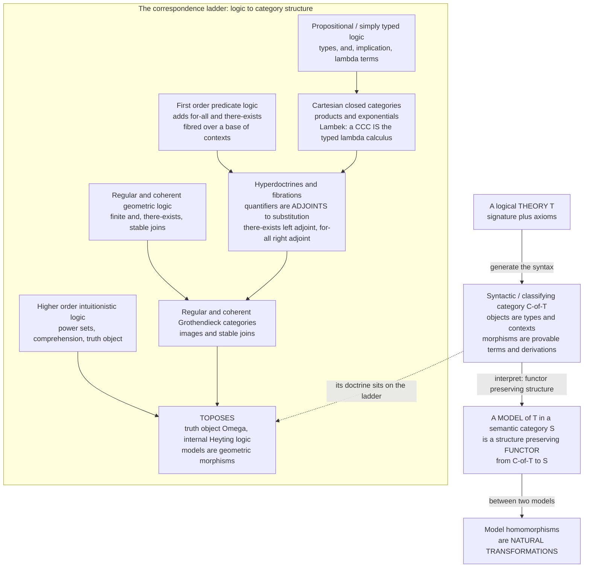

# 🧩 Categorical Logic and Type Theory

> [!abstract] TL;DR
> **Categorical logic** is the systematic dictionary **"logics and type theories ↔ kinds of categories"** — and its two load-bearing slogans are *"syntax is a category"* and *"models are functors."* Every logical **theory** `T` (a signature plus axioms) generates a **syntactic / classifying category** `𝒞_T` whose **objects are the types and contexts** and whose **morphisms are the provable terms / derivations**; the theory's connectives become *categorical structure* (conjunction = product, implication = exponential, truth = terminal object, and so on). A **model** of `T` in a semantic category `𝒮` (usually `Set`, or another topos) is then just a **structure-preserving functor** `M : 𝒞_T → 𝒮`, and a **homomorphism of models** is a **natural transformation** — the *functorial semantics* paradigm of **Lawvere**. His thesis pins it down for algebra: an **algebraic theory** (monoids, groups, rings) *is* a category with **finite products**, its **models are finite-product-preserving functors to `Set`**, and — generalising — **Lawvere theories correspond to finitary monads** ([[Monads_Categorically]]). Climb the **ladder of expressiveness** and each layer of logic gets its matching *categorical doctrine*: propositional / simply-typed logic ↔ **cartesian closed categories** ([[Cartesian_Closed_and_Topos_Theory]]); predicate logic ↔ **hyperdoctrines / fibrations** where **quantifiers are adjoints** to substitution (`∃` is the **left** adjoint, `∀` the **right** adjoint to pullback along a term); regular and coherent/geometric logic ↔ **regular** and **coherent / Grothendieck** categories; full higher-order intuitionistic logic ↔ **toposes** (with truth-object `Ω` and internal Heyting logic). **Dependent type theory** is modelled by **categories with families / locally cartesian closed / display-map categories**, with `Σ` and `Π` again **adjoints** — the rigorous foundation under **Coq/Agda/Lean** and the bridge to **HoTT**, where types are objects of an `(∞,1)`-topos. Each doctrine even has an **internal language** (Mitchell–Bénabou, Kripke–Joyal) letting you reason *inside* a category as if its objects were sets, yielding **soundness and completeness**. Categorical logic is thus the mature machine behind the **Curry–Howard–Lambek** slogan ([[Curry_Howard_Lambek_Correspondence]]): it *classifies* type theories by categorical structure and turns "proofs = programs = morphisms" into a working mathematical theory.

---

## Intuition

**Analogy — a logic is a grammar, and every grammar has a natural habitat.** A logic (or a type theory) is like the **grammar** of a language: a fixed set of rules for *forming valid statements* and *building valid proofs*. Now imagine that for each such grammar there is a bespoke **world** — a small mathematical universe — engineered so that the grammar's rules are not merely *allowed* but are *automatically true*, baked into the furniture of the place. That world is a **category**: its objects are the grammar's types, its arrows are the grammar's proofs, and its structural operations (making pairs, forming function-objects, carving out subsets) *are* the grammar's connectives (`∧`, `⇒`, `∃`). Build the category and you have built a universe where the logic is simply **valid by construction**. The syntactic category `𝒞_T` is the **generic model** — the "free" habitat that assumes nothing beyond the axioms.

Then the punchline. A **model** of the theory — a concrete set-theoretic interpretation that makes every axiom come out true — is nothing more than a **structure-preserving map out of that habitat** into another world, i.e. a **functor** `𝒞_T → Set` that respects the relevant structure. Interpret the generic types as actual sets, the generic proofs as actual functions, and the equations take care of themselves because they were *already equalities in `𝒞_T`*. So **logic becomes geometry**: theories are *spaces of proofs*, models are *maps between spaces*, and "this structure satisfies these axioms" becomes "this functor preserves this structure." Two theories with the *same* habitat are secretly the *same theory* — different grammars for one universe. That single reframing — **syntax as a category, semantics as functors out of it** — is the whole subject.

---

## How It Works

### The central mechanism: syntactic categories and functorial semantics

Fix a logical theory `T`. Its **syntactic category** (a.k.a. **classifying category**) `𝒞_T` is manufactured directly from the syntax:

1. **Objects are contexts / types.** An object is a context `Γ = (x₁ : A₁, …, xₙ : Aₙ)`, equivalently a finite product of types. In an algebraic theory the objects are just the finite powers `[0], [1], [2], …` of a single generic sort. The **empty context** is the **terminal object** `1` ([[Terminal_Initial_and_Zero_Objects]]); context concatenation is **product** ([[Products_and_Coproducts]]).
2. **Morphisms are provable terms / derivations.** A morphism `Γ → Δ` is a tuple of terms (up to provable equality) that, in context `Γ`, produce something of type `Δ`. **Composition is substitution**; the **identity** is the tuple of variables. Because morphisms are equivalence classes *modulo the theory's equations*, the axioms are **built into the identities of `𝒞_T`** — they are literal equalities of arrows.
3. **Connectives become universal structure.** Conjunction/pairing is the **product**, `True` is the terminal object, implication is the **exponential** `Bᴬ` ([[Exponentials_and_Cartesian_Closed_Categories]]), disjunction is a (well-behaved) coproduct, and quantifiers become **adjoints** (below). Each connective is characterised by a **universal property** ([[Universal_Properties]]).

A **model** of `T` in a semantic category `𝒮` is a functor `M : 𝒞_T → 𝒮` that **preserves exactly the structure the doctrine specifies** (finite products for algebra; products *and* exponentials for simply-typed logic; all finite limits *and* `Ω` for higher-order logic). A **homomorphism of models** `M ⇒ N` is a **natural transformation** ([[Natural_Transformations]]). Hence the *category of models* of `T` in `𝒮` is a full subcategory of the functor category `[𝒞_T, 𝒮]` ([[Functor_Categories_and_Naturality]]) — this is **functorial semantics**: *"models are functors, model homomorphisms are natural transformations."* Soundness is trivial (a functor preserves what it preserves); a **completeness theorem** says the *syntactic model* `𝒞_T → 𝒞_T` is *generic* — anything true in every model is provable ([[The_Yoneda_Lemma]] underwrites the representable/generic viewpoint).

### Lawvere theories: algebra is finite-product categories

**Lawvere's 1963 thesis** made the paradigm concrete for **universal algebra**. An **algebraic theory** (monoids, groups, rings, lattices, …) *is* a small category `𝕃` with **finite products**, whose objects are `[0], [1], [2], …` with `[n] = [1]ⁿ`, and whose morphisms `[n] → [1]` are the `n`-ary **derived operations** of the theory (built from the generators by composition and projection, quotiented by the equations). Then:

- A **model** (an *algebra*) is a **finite-product-preserving functor** `M : 𝕃 → Set`. It sends `[1]` to a **carrier set** `M`, forces `[n] ↦ Mⁿ` (products preserved), and sends each operation-morphism to an actual function `Mⁿ → M`. The equations hold automatically because they are equalities of arrows in `𝕃`.
- The **category of models** `Mod(𝕃) = FP(𝕃, Set)` (product-preserving functors and natural transformations) is the usual category of `𝕃`-algebras; **free algebras** arise from the **left adjoint** to the forgetful functor ([[Adjunctions]]).
- **Lawvere theories ↔ finitary monads on `Set`.** Every Lawvere theory induces a finitary monad whose **Eilenberg–Moore algebras** are exactly its models, and vice versa — the algebraic content of "notions of computation as monads" ([[Monads_Categorically]], [[Monads_and_Effects]]). The Kleisli/Eilenberg–Moore machinery is developed in [[Kleisli_Categories_and_Algebras]]; the signature-and-operations viewpoint connects to [[Monoids_and_Monoidal_Categories]].

### The ladder: each logic has a matching categorical doctrine

Categorical logic is organised as a **ladder** — as you add expressive power to the logic, you add structure to the category.

| Logic / type theory | Categorical doctrine | New structure |
|---|---|---|
| Algebraic (equational) | **Finite-product** (Lawvere) categories | products |
| Propositional / **simply-typed** | **Cartesian closed** categories | + exponentials (Lambek) |
| **Regular** logic (`∧, ∃, =`) | **Regular** categories | + images, stable `∃` |
| **Coherent / geometric** logic | **Coherent / Grothendieck** categories | + stable finite/infinite joins |
| **First-order** predicate logic | **Hyperdoctrines / fibrations** | + `∃ ⊣ subst ⊣ ∀` |
| **Higher-order intuitionistic** | **Elementary toposes** | + subobject classifier `Ω` |
| **Dependent** type theory | **LCCC / CwF / display maps** | + dependent `Σ`, `Π` as adjoints |

The base rung — **`STLC = CCC`** (Lambek's theorem) — is the categorical heart of typed functional programming ([[Simply_Typed_Lambda_Calculus]]). The top rung — **toposes** — is a universe of **higher-order intuitionistic type theory** whose internal logic is read off from `Ω` ([[Cartesian_Closed_and_Topos_Theory]], [[Intuitionistic_Logic_and_Constructive_Proofs]]).

### Flow / Architecture



*Left column: as the logic gains connectives, the matching category gains structure. Right: any theory generates a syntactic category, models are structure-preserving functors out of it, and model homomorphisms are natural transformations — functorial semantics.*

### Quantifiers as adjoints (Lawvere's hyperdoctrines)

To model **predicate logic** you fibre a "logic of predicates" over a base of contexts: to each context `X` assign the poset (or category) `P(X)` of **predicates on `X`**, and to each term/substitution `f : X → Y` a **reindexing / substitution** map `f* : P(Y) → P(X)` (pull a predicate back along `f`). **Lawvere's insight (1969):** the **quantifiers are the adjoints of substitution**:

- **`∃_f ⊣ f*`** — existential quantification is the **left adjoint** to substitution (the **direct image** along `f`);
- **`f* ⊣ ∀_f`** — universal quantification is the **right adjoint** (the **dual image** along `f`).

Written as the adjoint triple `∃_f ⊣ f* ⊣ ∀_f` ([[Adjunctions]]), the adjunctions unfold to the natural bijections
`∃_f(A) ≤ B ⟺ A ≤ f*(B)` and `f*(B) ≤ A ⟺ B ≤ ∀_f(A)`,
which are *exactly* the introduction/elimination rules of `∃` and `∀`. Substitution being a *pullback* forces the **Beck–Chevalley condition** (quantifiers commute with substitution across pullback squares), and **Frobenius reciprocity** `∃_f(A ∧ f*B) = ∃_f(A) ∧ B` reflects the interaction of `∃` with `∧`. This is the **hyperdoctrine** (a functor `𝒞ᵒᵖ → Poset`/`Cat` with adjoints) — the categorical account of first-order logic and of **comprehension**. The Python demo verifies the whole triple on a finite example.

### Dependent type theory categorically

Move from *predicates over contexts* to **types that depend on values** and the doctrine becomes a **locally cartesian closed category (LCCC)** — or, keeping the syntax honest about substitution, a **category with families (CwF)** or a **display-map category**. Contexts are objects, a **dependent type** `Γ ⊢ A` is a **display map / fibration** `Γ.A → Γ`, and the two dependent binders are again **adjoints to substitution (pullback)**: the **dependent sum `Σ` is the left adjoint** and the **dependent product `Π` is the right adjoint** to the reindexing functor `f*` between slice categories. This is the semantics that makes **Martin-Löf dependent type theory** and proof assistants **Coq/Agda/Lean** rigorous ([[Dependent_Types_and_Advanced_Type_Systems]], [[Proof_Assistants_and_Dependent_Type_Theory]]). Push identity types to be genuinely *proof-relevant* and types behave like **∞-groupoids** — objects of an **`(∞,1)`-topos** — which is the categorical semantics of **Homotopy Type Theory** ([[Homotopy_Type_Theory]], [[Enriched_and_Higher_Categories]]).

### Classifying toposes, internal languages, and "bridges"

Two further pillars complete the picture:

- **Classifying toposes and bridges.** A **geometric theory** `T` has a **classifying topos** `Set[T]` such that **models of `T` in any topos `ℰ` = geometric morphisms `ℰ → Set[T]`**. Because the *same* topos can be presented by *different* theories, an equivalence of classifying toposes reveals hidden connections between seemingly unrelated theories — **Grothendieck's "toposes as bridges,"** systematised in **Caramello's program**.
- **Internal language and completeness.** Every doctrine has an **internal language**: for a topos it is the **Mitchell–Bénabou language** interpreted by **Kripke–Joyal (forcing) semantics**, letting you *do constructive mathematics inside the category* as if its objects were sets. Syntactic categories deliver **completeness theorems** (truth-in-all-models = provability), and reasoning in the internal (intuitionistic) logic **transfers to every model** ([[Intuitionistic_Logic_and_Constructive_Proofs]]).

### Why it matters for computer science

Categorical logic is the **semantic foundation of type systems and proof assistants** ([[Type_Systems_Fundamentals]]). It justifies **dependent type theory** (Coq/Agda/Lean), guides the **design of new type theories**, and — via **monads and Lawvere theories** — gives the semantics of **computational effects** ([[Denotational_Semantics]], [[Monads_and_Effects]]). Program logics and **predicate transformers** are hyperdoctrines, **abstract interpretation** is a family of **Galois connections** (adjunctions between concrete and abstract predicate lattices, [[Axiomatic_Semantics_and_Hoare_Logic]]), **database schemas** are small theories/categories with instances as `Set`-valued functors ([[Categorical_Databases_and_Systems]]), and **substructural** logics (linear, resource) match **monoidal** rather than cartesian doctrines ([[Linear_Logic_and_Resource_Types]], [[Polymorphism_and_System_F]]). The programming-facing synthesis lives in [[Category_Theory_in_Programming]].

---

## Key Concepts

### Secondary (intuition-level)
- A **theory** is a grammar: rules for forming statements and proofs. Categorical logic says each grammar has a **home category** where its rules are automatically true.
- **Syntax is a category:** *types are objects, proofs/terms are arrows, and composing arrows is plugging one proof into another (substitution)*.
- **Models are functors:** to *interpret* a theory in ordinary sets is just to draw a **structure-preserving map** out of the home category into `Set` — types become sets, proofs become functions.
- **Bigger logic → richer category:** adding "and", "implies", "for-all", "there-exists", and "power set" each adds one specific structural gadget to the category.

### Undergraduate (formal core)
- **Syntactic / classifying category `𝒞_T`:** objects = contexts, morphisms = provable terms mod the theory's equations; composition = substitution; axioms = equalities of arrows.
- **Functorial semantics:** a model in `𝒮` is a structure-preserving functor `𝒞_T → 𝒮`; a model homomorphism is a natural transformation; `Mod_𝒮(T) ⊆ [𝒞_T, 𝒮]`.
- **Lawvere theory:** a category with finite products, objects `[n] = [1]ⁿ`; **models = finite-product-preserving functors to `Set`**; the 2-element carrier of a monoid theory yields exactly the monoids on that set (demo).
- **Lambek's theorem:** simply typed lambda calculus ≅ cartesian closed categories — the base rung of the ladder.
- **Quantifiers as adjoints:** for `f : X → Y`, `∃_f ⊣ f* ⊣ ∀_f`; unfolding gives the intro/elim rules; `∃`/`∀` are the image/dual-image.

### Graduate (structural / research-level)
- **Lawvere theories ≃ finitary monads on `Set`**; models = Eilenberg–Moore algebras; free models via left adjoints; the algebraic root of effect semantics.
- **The doctrine ladder:** regular categories (regular logic), coherent/Grothendieck categories (coherent/geometric logic), pretoposes, elementary toposes (higher-order intuitionistic logic with `Ω`).
- **Hyperdoctrines & fibrations:** indexed posets/categories with adjoints; **Beck–Chevalley** and **Frobenius reciprocity**; comprehension categories; the fibrational account of first- and higher-order logic and of System F (`∀` over types).
- **Dependent type theory:** LCCC / **categories with families** / display-map categories; `Σ ⊣ f* ⊣ Π` between slices; coherence problems (splitting, Hofmann's construction); identity types → weak factorisation systems → **`(∞,1)`-toposes** for HoTT.
- **Classifying toposes:** `Mod(T, ℰ) ≃ Topos(ℰ, Set[T])`; toposes-as-bridges (Caramello); **internal language** (Mitchell–Bénabou / Kripke–Joyal) with soundness and **completeness** via syntactic categories.

---

## Python Demo

```python
# ============================================================================
# CATEGORICAL LOGIC IN CODE:
#   PART A -- "MODELS ARE FUNCTORS"  (Lawvere / functorial semantics)
#   PART B -- "QUANTIFIERS ARE ADJOINTS"  (Lawvere hyperdoctrines)
#
# PART A. The theory of a MONOID is the Lawvere theory L with one generating
# object [1], powers [n] = [1]^n, and generating operations
#       mult : [2] -> [1]   (a binary op)
#       e    : [0] -> [1]   (a constant / nullary op)
# subject to EQUATIONS that are EQUALITIES OF MORPHISMS in L:
#       associativity : mult.(mult x id) == mult.(id x mult)  : [3] -> [1]
#       left  unit    : mult.(e x id)    == id                 : [1] -> [1]
#       right unit    : mult.(id x e)    == id                 : [1] -> [1]
# A MODEL of L in Set is a PRODUCT-PRESERVING FUNCTOR  F : L -> Set:
#       F[1] = a carrier M,   F[n] = M^n   (products preserved),
#       F(mult) : M^2 -> M,   F(e) : M^0=1 -> M   (a chosen element).
# Because the equations are equalities OF MORPHISMS, a functor MUST send both
# sides to the SAME function -- so "functor" == "monoid". We ENUMERATE every
# such functor on a fixed carrier, confirm each is a monoid, and confirm that
# model homomorphisms are exactly NATURAL TRANSFORMATIONS.
#
# PART B. For a function f : X -> Y, substitution / reindexing is PREIMAGE
#       f* : P(Y) -> P(X),   f*(B) = { x : f(x) in B }.
# It has a LEFT adjoint (existential) and a RIGHT adjoint (universal):
#       exists_f(A) = { y : SOME  x with f(x)=y lies in A }   (direct image)
#       forall_f(A) = { y : EVERY x with f(x)=y lies in A }   (dual image)
# giving the adjoint triple  exists_f -| f* -| forall_f, verified as Galois
# connections exhaustively, plus Frobenius reciprocity.
#
# VISUALIZE both correspondences with matplotlib. Pure stdlib; numpy not used.
# ============================================================================
from itertools import product, combinations
import matplotlib.pyplot as plt

# ----------------------------------------------------------------------------
# PART A. Functorial semantics: models of the monoid theory ARE functors.
# ----------------------------------------------------------------------------
CARRIER = (0, 1)              # F[1] = M, a 2-element carrier set

def extends_to_functor(mult, unit):
    """A candidate assignment of the generators (mult : M^2 -> M as a dict,
    unit in M) extends to a PRODUCT-PRESERVING FUNCTOR L -> Set iff it respects
    L's equations -- i.e. iff it is a monoid. It returns True exactly when the
    equalities-of-morphisms of the theory become equal functions."""
    M = CARRIER
    # unit laws: the chosen unit is a two-sided identity
    if any(mult[(unit, x)] != x or mult[(x, unit)] != x for x in M):
        return False
    # associativity: the two morphisms [3]->[1] agree as functions M^3 -> M
    for x, y, z in product(M, repeat=3):
        if mult[(mult[(x, y)], z)] != mult[(x, mult[(y, z)])]:
            return False
    return True

# ENUMERATE every candidate functor: all binary tables x all unit choices.
inputs = list(product(CARRIER, CARRIER))                     # the 4 inputs of M^2
all_tables = [dict(zip(inputs, vals))                        # 2^4 = 16 binary ops
              for vals in product(CARRIER, repeat=len(inputs))]
models = [(mult, u) for mult in all_tables for u in CARRIER
          if extends_to_functor(mult, u)]

print("=== PART A: models of the MONOID theory are product-preserving functors ===")
print(f"  carrier F[1] = M = {set(CARRIER)}")
print(f"  candidate assignments of the generators : {len(all_tables) * len(CARRIER)}")
print(f"  VALID FUNCTORS = MONOIDS on this carrier : {len(models)}")

# Functoriality made concrete: the syntactic terms (x*y)*z and x*(y*z) are the
# SAME morphism [3]->[1] in L, so EVERY model sends them to the SAME function.
mult0, unit0 = models[0]
lhs = {(x, y, z): mult0[(mult0[(x, y)], z)] for x, y, z in product(CARRIER, repeat=3)}
rhs = {(x, y, z): mult0[(x, mult0[(y, z)])] for x, y, z in product(CARRIER, repeat=3)}
assert lhs == rhs
print(f"  example model: unit e = {unit0}, table = {dict(mult0)}")
print("  equal L-morphisms (x*y)*z and x*(y*z) map to the SAME function -> functorial")

# Model HOMOMORPHISMS are NATURAL TRANSFORMATIONS: h : M -> N with
# h(mult(x,y)) = mult(h x, h y) and h(unit_M) = unit_N -- naturality at the
# generating morphisms. Count endomorphisms of one model (always includes id).
def is_natural(h, m1, m2):
    (mA, uA), (mB, uB) = m1, m2
    if h[uA] != uB:
        return False
    return all(h[mA[(x, y)]] == mB[(h[x], h[y])] for x, y in product(CARRIER, repeat=2))

M0 = models[0]
homs = [dict(zip(CARRIER, hv)) for hv in product(CARRIER, repeat=len(CARRIER))
        if is_natural(dict(zip(CARRIER, hv)), M0, M0)]
print(f"  natural transformations (= model homomorphisms) of a model to itself : {len(homs)}\n")

# ----------------------------------------------------------------------------
# PART B. Quantifiers as adjoints along a function f : X -> Y.
# ----------------------------------------------------------------------------
X = (0, 1, 2, 3)
Y = ("a", "b")
f = {0: "a", 1: "a", 2: "b", 3: "b"}       # fibers:  a <- {0,1},  b <- {2,3}

def subsets(s):
    s = list(s)
    return [frozenset(c) for r in range(len(s) + 1) for c in combinations(s, r)]

def subst(B):                              # f* : P(Y) -> P(X)   (preimage)
    return frozenset(x for x in X if f[x] in B)

def exists_f(A):                           # LEFT adjoint: direct image
    return frozenset(f[x] for x in A)

def forall_f(A):                           # RIGHT adjoint: dual image
    return frozenset(y for y in Y if all((f[x] != y) or (x in A) for x in X))

PX, PY = subsets(X), subsets(Y)

# Verify the adjoint triple  exists_f -| f* -| forall_f  exhaustively.
left_adj  = all((exists_f(A) <= B) == (A <= subst(B)) for A in PX for B in PY)
right_adj = all((subst(B) <= A) == (B <= forall_f(A)) for A in PX for B in PY)
frobenius = all(exists_f(A & subst(B)) == (exists_f(A) & B) for A in PX for B in PY)

print("=== PART B: quantifiers as adjoints   exists_f -| f* -| forall_f ===")
print(f"  f : X -> Y  with fibers  a <- {{0,1}},  b <- {{2,3}}")
print(f"  LEFT  adjunction  exists_f(A) <= B  iff  A <= f*(B)  : {left_adj}")
print(f"  RIGHT adjunction  f*(B) <= A  iff  B <= forall_f(A)  : {right_adj}")
print(f"  Frobenius reciprocity  exists_f(A & f*B) = exists_f(A) & B : {frobenius}")
A_demo = frozenset({0, 2, 3})
print(f"  example A = {set(A_demo)}:  exists_f(A) = {set(exists_f(A_demo))},  "
      f"forall_f(A) = {set(forall_f(A_demo))}\n")
assert left_adj and right_adj and frobenius

# ----------------------------------------------------------------------------
# VISUALIZE.
#   Left  : "models = functors" -- the syntactic category L mapped to Set.
#   Right : the adjoint triple  exists_f -| f* -| forall_f  between P(X), P(Y).
# ----------------------------------------------------------------------------
fig, (axA, axB) = plt.subplots(1, 2, figsize=(15, 6.5))

# ---- Panel A: models are functors ------------------------------------------
axA.axis("off")
axA.set_title("Functorial semantics: a MODEL is a product-preserving FUNCTOR",
              fontsize=11.5, fontweight="bold")
syn_box = dict(boxstyle="round,pad=0.3", fc="#e3f2fd", ec="#1565c0", lw=1.6)
set_box = dict(boxstyle="round,pad=0.3", fc="#fff3e0", ec="#e65100", lw=1.6)
axA.text(0.20, 0.95, "Syntactic category  L\ntheory of a MONOID",
         ha="center", fontsize=10, fontweight="bold", color="#1565c0")
axA.text(0.80, 0.95, "Set\nthe semantic world",
         ha="center", fontsize=10, fontweight="bold", color="#e65100")

Lnodes = {"[0]": (0.20, 0.74), "[1]": (0.20, 0.55), "[2]": (0.20, 0.36), "[3]": (0.20, 0.17)}
Snodes = {"M^0 = 1": (0.80, 0.74), "M": (0.80, 0.55), "M^2": (0.80, 0.36), "M^3": (0.80, 0.17)}
for name, (x, y) in Lnodes.items():
    axA.text(x, y, name, ha="center", va="center", fontsize=11, fontweight="bold", bbox=syn_box)
for name, (x, y) in Snodes.items():
    axA.text(x, y, name, ha="center", va="center", fontsize=10, fontweight="bold", bbox=set_box)

# generating morphisms inside L (curved arrows on the left)
axA.annotate("", xy=Lnodes["[1]"], xytext=Lnodes["[0]"],
             arrowprops=dict(arrowstyle="-|>", color="#1565c0", lw=1.5,
                             shrinkA=15, shrinkB=15, connectionstyle="arc3,rad=0.45"))
axA.text(0.05, 0.645, "e : [0]->[1]", fontsize=8, color="#1565c0", rotation=90, va="center")
axA.annotate("", xy=Lnodes["[1]"], xytext=Lnodes["[2]"],
             arrowprops=dict(arrowstyle="-|>", color="#1565c0", lw=1.5,
                             shrinkA=15, shrinkB=15, connectionstyle="arc3,rad=-0.45"))
axA.text(0.05, 0.455, "mult : [2]->[1]", fontsize=8, color="#1565c0", rotation=90, va="center")

# functor arrows F : L -> Set (horizontal, dashed)
for lp, sp in zip(Lnodes.values(), Snodes.values()):
    axA.annotate("", xy=(sp[0] - 0.11, sp[1]), xytext=(lp[0] + 0.07, lp[1]),
                 arrowprops=dict(arrowstyle="-|>", color="#455a64", lw=1.2,
                                 linestyle="--", shrinkA=2, shrinkB=2))
axA.text(0.50, 0.87, "F   (preserves products)", ha="center", fontsize=9.5,
         color="#455a64", fontweight="bold")
axA.text(0.50, 0.03,
         f"F[1]=M,  F[n]=M^n,  F(mult):M^2->M,  F(e):1->M\n"
         f"valid functors on the {len(CARRIER)}-element carrier  =  {len(models)} MONOIDS",
         ha="center", fontsize=9, color="#33475b",
         bbox=dict(boxstyle="round,pad=0.35", fc="#f1f8e9", ec="#558b2f", lw=1.2))
axA.set_xlim(0, 1); axA.set_ylim(0, 1)

# ---- Panel B: the adjoint triple exists -| subst -| forall -----------------
axB.axis("off")
axB.set_title("Quantifiers as adjoints:  exists_f  -|  f*  -|  forall_f",
              fontsize=11.5, fontweight="bold")
pbox = dict(boxstyle="round,pad=0.6", fc="#ede7f6", ec="#4527a0", lw=1.8)
axB.text(0.15, 0.5, "P(X)\npredicates\nover X\n16 subsets", ha="center", va="center",
         fontsize=10, fontweight="bold", bbox=pbox)
axB.text(0.85, 0.5, "P(Y)\npredicates\nover Y\n4 subsets", ha="center", va="center",
         fontsize=10, fontweight="bold", bbox=pbox)

def triple_arrow(y, text, color, rad, reverse=False):
    a, b = (0.71, 0.29) if reverse else (0.29, 0.71)
    axB.annotate("", xy=(b, y), xytext=(a, y),
                 arrowprops=dict(arrowstyle="-|>", color=color, lw=2.2,
                                 connectionstyle=f"arc3,rad={rad}"))
    axB.text(0.5, y + (0.055 if rad >= 0 else -0.055), text, ha="center",
             fontsize=9, color=color, fontweight="bold")

triple_arrow(0.78, "exists_f   there-exists / image   LEFT adjoint", "#2e7d32", 0.28)
triple_arrow(0.50, "f*   substitution / preimage", "#c62828", 0.0, reverse=True)
triple_arrow(0.22, "forall_f   for-all / dual image   RIGHT adjoint", "#1565c0", -0.28)
axB.text(0.5, 0.03,
         "exists_f(A) <= B  iff  A <= f*(B)         f*(B) <= A  iff  B <= forall_f(A)",
         ha="center", fontsize=8.5, color="#33475b",
         bbox=dict(boxstyle="round,pad=0.35", fc="#fffde7", ec="#f9a825", lw=1.1))
axB.set_xlim(0, 1); axB.set_ylim(0, 1)

fig.suptitle("Categorical logic: models are functors, quantifiers are adjoints",
             fontsize=13, fontweight="bold")
fig.tight_layout(rect=[0, 0, 1, 0.95])
plt.savefig("categorical_logic_demo.png", dpi=130)
print("Saved figure to categorical_logic_demo.png")
```

**What the run shows.** **Part A** enumerates all `16 × 2 = 32` ways to assign the monoid theory's generators on the 2-element carrier and finds that **exactly 4** extend to genuine functors — precisely the monoid structures on that set (both `ℤ/2` and the idempotent semilattice, for each choice of identity). The key line `assert lhs == rhs` makes *functoriality* concrete: `(x*y)*z` and `x*(y*z)` are the **same morphism** in the syntactic category, so every model is forced to send them to the **same function** — that is why "product-preserving functor" and "monoid" are literally the same data. It also counts the model **homomorphisms** and confirms they are the **naturality-square-satisfying** maps. **Part B** verifies the full adjoint triple `∃_f ⊣ f* ⊣ ∀_f` exhaustively over all `16 × 4` predicate pairs: both Galois-connection biconditionals hold, and **Frobenius reciprocity** `∃_f(A ∧ f*B) = ∃_f(A) ∧ B` checks out. The figure draws the **"models = functors"** picture on the left (the syntactic category `L` and its product-preserving image in `Set`) and the **`∃ ⊣ subst ⊣ ∀`** triple on the right.

---

## Real-World Applications

> **Example — Coq, Agda, and Lean rest on categorical semantics of dependent type theory.** These proof assistants implement Martin-Löf / Calculus-of-Constructions type theory, and their *meaning* is given by **categories with families / locally cartesian closed categories**: contexts are objects, dependent types are display maps, and `Σ`/`Π` are the **left/right adjoints to substitution**. This semantics is what proves the systems **sound** (you cannot derive `False`) and guides extensions — from **universe hierarchies** to **HoTT's univalence**, whose consistency was first established via the **simplicial-set (∞-groupoid) model**, an `(∞,1)`-topos.

Beyond proof assistants:

- **Effect semantics in real compilers/languages.** Moggi's **monads** and **Lawvere theories** give partiality, state, exceptions, nondeterminism, and probability a uniform meaning; **algebraic effects and handlers** (Koka, Eff, OCaml 5, Unison) are Lawvere theories with chosen interpretations ([[Monads_and_Effects]], [[Denotational_Semantics]]).
- **Abstract interpretation & program logics.** Static analysers formalise soundness as a **Galois connection** (an adjunction) between concrete and abstract predicate lattices; **predicate transformers** (weakest preconditions) and Hoare logic are hyperdoctrine structure ([[Axiomatic_Semantics_and_Hoare_Logic]]).
- **Categorical databases.** A schema is a small **theory/category** and an instance is a `Set`-valued **functor**; queries, migrations, and integrity constraints become functorial data-migration operations — the basis of the **CQL / algebraic databases** approach ([[Categorical_Databases_and_Systems]]).
- **Design of new type systems & DSLs.** Language designers use the ladder to know *exactly* which categorical structure a feature needs — linear/session types need **monoidal** (not cartesian) categories ([[Linear_Logic_and_Resource_Types]], [[Monoids_and_Monoidal_Categories]]); polymorphism needs **fibrations**/PL-categories ([[Polymorphism_and_System_F]]).
- **Constructive & synthetic mathematics.** Doing analysis, geometry, or computability *internally* to a topos (synthetic differential geometry, the effective topos, sheaf models) gives independence and constructivity results as "true in one topos, false in another."

---

## Common Pitfalls

- **Reading "models are functors" as a slogan rather than a theorem.** It is a precise equivalence: `Mod_𝒮(T)` *is* the category of structure-preserving functors `𝒞_T → 𝒮` with natural transformations. Forgetting the qualifier *structure-preserving* (finite products, or exponentials, or `Ω`) breaks the correspondence — an arbitrary functor is **not** a model.
- **Confusing the *variance* / direction of the quantifier adjoints.** `∃_f` is the **left** adjoint and `∀_f` the **right** adjoint to substitution `f*`. Swapping them inverts the intro/elim rules. Mnemonic: `∃` is a *join-like* (colimit) operation → left adjoint; `∀` is a *meet-like* (limit) operation → right adjoint.
- **Ignoring Beck–Chevalley.** Quantifiers must **commute with substitution** across pullback squares. A "logic" that defines `∃`/`∀` fibrewise but violates Beck–Chevalley is unsound — substitution and quantification no longer agree, and completeness fails.
- **Assuming the internal logic is classical.** Syntactic categories and general toposes validate only **intuitionistic** logic; excluded middle and `¬¬`-elimination can fail. Importing classical shortcuts (proof by contradiction of positive statements, choice, `∀`↔`¬∃¬`) into internal reasoning is the most common error ([[Intuitionistic_Logic_and_Constructive_Proofs]]).
- **Overlooking the coherence problem in dependent-type semantics.** Substitution in syntax is strictly functorial, but pullback in a category is only functorial *up to iso*. Naively "types = display maps" is unsound until you **split** the fibration (Hofmann/Lumsdaine–Warren) — a real subtlety behind CwFs.
- **Treating a CCC as a topos, or a Lawvere theory as first-order.** Cartesian closed models only *simply-typed / propositional* logic; you need finite limits and `Ω` for higher-order logic. Lawvere theories model only *equational* logic — no genuine `∃`/`∀`; those require hyperdoctrines.
- **Forgetting that geometric-logic models must live in a topos.** "Classifying topos" classifies **geometric** theories, and models = **geometric morphisms**; using arbitrary functors instead of geometric (finite-limit-preserving, colimit-continuous) morphisms loses the theory–topos correspondence.

---

## Related Concepts

- [[Cartesian_Closed_and_Topos_Theory]] — the top rungs of the ladder: CCCs model simply-typed logic (Lambek), toposes model higher-order intuitionistic logic with truth-object `Ω`.
- [[Curry_Howard_Lambek_Correspondence]] — the three-way proofs = programs = morphisms bridge; this note is its mature, doctrine-by-doctrine theory across the whole ladder.
- [[Functors]] — the central object: a **model is a structure-preserving functor** out of the syntactic category.
- [[Natural_Transformations]] — **model homomorphisms are natural transformations**; the category of models is a functor category.
- [[Functor_Categories_and_Naturality]] — `Mod_𝒮(T) ⊆ [𝒞_T, 𝒮]`; functorial semantics lives inside a functor category.
- [[Adjunctions]] — the unifying tool: quantifiers (`∃`/`∀`), dependent `Σ`/`Π`, free models, and Galois connections are all adjunctions.
- [[Monads_Categorically]] — **Lawvere theories ≃ finitary monads**; models = Eilenberg–Moore algebras; the algebraic backbone of effect semantics.
- [[Kleisli_Categories_and_Algebras]] — Eilenberg–Moore algebras are exactly the models of a Lawvere theory / finitary monad.
- [[Monoids_and_Monoidal_Categories]] — the monoid-object / monoidal doctrine; substructural (linear) logics live in monoidal, not cartesian, categories.
- [[Presheaves_and_Representables]] — `Set`-valued functors are models/presheaves; presheaf toposes are leading semantic categories; representables underlie the generic model.
- [[The_Yoneda_Lemma]] — the syntactic model `𝒞_T → 𝒞_T` is generic; representability drives completeness.
- [[Universal_Properties]] — each connective (`∧, ⇒, ∃, ∀, Ω`) is a universal construction; syntactic categories are characterised universally.
- [[Products_and_Coproducts]] — contexts are finite **products**; product-preservation is the defining condition of an algebraic model.
- [[Terminal_Initial_and_Zero_Objects]] — the **empty context** is the terminal object; nullary operations are morphisms `1 → M` (`[0] → [1]`).
- [[Limits_and_Colimits]] — regular/coherent categories add images and stable joins to interpret `∃` and `∨`.
- [[Exponentials_and_Cartesian_Closed_Categories]] — exponentials interpret **implication / function types**; the CCC rung of the ladder.
- [[Diagrams_and_Commutativity]] — a theory's **equations are commuting diagrams** that every model-functor must preserve.
- [[Duality_and_the_Opposite_Category]] — Lawvere theories use `[n] = [1]ⁿ` with careful op-conventions; classifying-category constructions exploit duality.
- [[Enriched_and_Higher_Categories]] — dependent/HoTT semantics lives in **`(∞,1)`-toposes**; enriched and fibred generalisations of hyperdoctrines.
- [[The_Curry_Howard_Correspondence]] — the logic↔types leg that categorical logic completes into Curry–Howard–Lambek.
- [[Dependent_Types_and_Advanced_Type_Systems]] — modelled by **CwF / LCCC / display maps**; `Σ`/`Π` as adjoints to substitution.
- [[Proof_Assistants_and_Dependent_Type_Theory]] — Coq/Agda/Lean are made rigorous (and sound) by this categorical semantics.
- [[Homotopy_Type_Theory]] — types as ∞-groupoids / objects of an `(∞,1)`-topos; the modern frontier of the correspondence.
- [[Simply_Typed_Lambda_Calculus]] — **Lambek's theorem**: STLC ≅ cartesian closed categories, the base rung.
- [[Intuitionistic_Logic_and_Constructive_Proofs]] — the **default** internal logic of syntactic categories and toposes.
- [[Type_Systems_Fundamentals]] — categorical logic is the semantic foundation that gives type systems their meaning.
- [[Denotational_Semantics]] — programs as morphisms; effects modelled by monads/Lawvere theories.
- [[Monads_and_Effects]] — the applied face of Lawvere-theory semantics: `return`/`bind`, algebraic effects and handlers.
- [[Axiomatic_Semantics_and_Hoare_Logic]] — predicate transformers and program logics are hyperdoctrines; abstract interpretation is a **Galois connection** (adjunction).
- [[Categorical_Databases_and_Systems]] — schemas as theories/categories, instances as `Set`-valued functors: functorial semantics applied to data.
- [[Category_Theory_in_Programming]] — the CS payoff: type systems, effects, and proof assistants justified by these semantics.
- [[Linear_Logic_and_Resource_Types]] — substructural logics match **monoidal** (non-cartesian) doctrines.
- [[Polymorphism_and_System_F]] — impredicative `∀` over types modelled via fibrations / PL-categories, a higher hyperdoctrine.
- [[Category_Theory_Overview]] — the umbrella framework this note applies to logic and type theory.

---

## Review Questions

**Secondary.**
1. In the "grammar has a natural habitat" picture, what are the *objects* and the *morphisms* of a theory's syntactic category, and what does it mean — in one sentence — to say that a **model is a functor out of it**?
2. The theory of a monoid has one binary operation and one constant. On the 2-element carrier `{0, 1}` the demo finds exactly **four** valid functors. Explain, without computing, why "valid functor" and "monoid structure on `{0,1}`" describe the *same* thing.

**Undergraduate.**
3. State Lawvere's characterisation of an **algebraic theory** as a category with finite products, and explain why a **model is a finite-product-preserving functor to `Set`**. Why does product-preservation force `F[n] = Mⁿ`, and why do the theory's equations then hold automatically?
4. For a function `f : X → Y`, define `f*`, `∃_f`, and `∀_f` on predicates, and state the two adjunctions `∃_f ⊣ f* ⊣ ∀_f` as biconditionals. Unfold each biconditional into the corresponding introduction/elimination rule of `∃` and `∀`.
5. Place four systems on the **ladder** — equational algebra, simply-typed lambda calculus, first-order predicate logic, higher-order intuitionistic logic — and name the categorical doctrine each corresponds to, saying what *one* extra structure distinguishes consecutive rungs.

**Graduate.**
6. Sketch the categorical semantics of **dependent type theory**: what are contexts, dependent types, and substitution as categorical data (CwF / LCCC / display maps), and why are `Σ` and `Π` the **left and right adjoints** to reindexing between slice categories? What is the *coherence problem* and why does it matter for soundness?
7. Explain **Lawvere theories ↔ finitary monads**: given a Lawvere theory, how do you obtain a monad whose Eilenberg–Moore algebras are its models, and what does this equivalence tell you about the semantics of **algebraic effects**?
8. State the defining property of a **classifying topos** `Set[T]` for a geometric theory `T` (`Mod(T, ℰ) ≃ Topos(ℰ, Set[T])`). Explain **Beck–Chevalley** and **Frobenius reciprocity** for the quantifier adjoints, and describe how "toposes as bridges" (Caramello) uses a shared classifying topos to transfer results between different presentations of a theory.

---

## Sources

- Lawvere, F. W. "Functorial Semantics of Algebraic Theories." *Proc. Natl. Acad. Sci. USA* 50 (1963) — the founding paper: algebraic theories as finite-product categories, models as product-preserving functors.
- Lawvere, F. W. "Adjointness in Foundations." *Dialectica* 23 (1969) — quantifiers as adjoints to substitution; hyperdoctrines and comprehension.
- Lambek, J. and Scott, P. J. *Introduction to Higher-Order Categorical Logic*. Cambridge University Press, 1986 — CCC ↔ typed lambda calculus, toposes, and the internal language.
- Jacobs, B. *Categorical Logic and Type Theory*. North-Holland, 1999 — the comprehensive fibrational account of predicate and dependent type theory.
- Johnstone, P. T. *Sketches of an Elephant: A Topos Theory Compendium*. Oxford University Press, 2002 — classifying toposes, geometric logic, internal language, completeness.
- nLab, "categorical semantics", "Lawvere theory", "hyperdoctrine", "internal logic" — https://ncatlab.org/nlab/show/categorical+semantics , https://ncatlab.org/nlab/show/Lawvere+theory , https://ncatlab.org/nlab/show/hyperdoctrine .

---

#category-theory #categorical-logic #type-theory #lawvere-theories #topos-semantics
