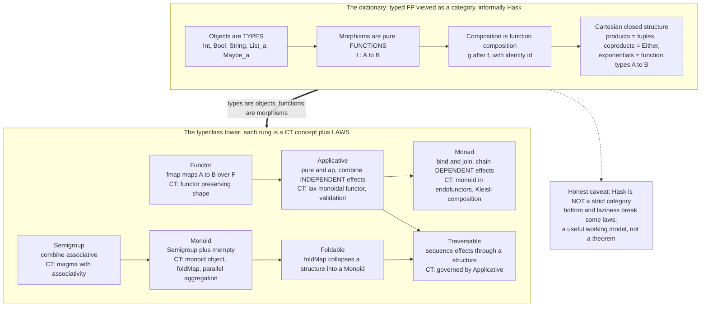

# 🧩 Category Theory in Programming

> [!abstract] TL;DR
> This is where the whole vault **pays off in code**. Ask why Haskell and Scala programmers say *"Functor"*, *"Monad"*, *"Semigroup"*, *"Monoid"*, *"Traversable"* — the answer is that **category theory is the design language of typed functional programming**. In typed FP, **types are objects and pure functions are morphisms**; function composition is categorical composition; product types, sum types, and function types make this the structure of a **cartesian closed category** ([[Products_and_Coproducts]], [[Exponentials_and_Cartesian_Closed_Categories]]). On top of that dictionary sits the **typeclass tower** — `Semigroup → Monoid → Functor → Applicative → Monad`, with `Foldable`/`Traversable` alongside — where each rung is a genuine category-theoretic concept ([[Functors]], [[Applicative_and_Lax_Monoidal_Functors]], [[Monads_Categorically]]) shipped with **laws** that guarantee refactoring safety, fusion, and composition. Beyond the tower, **recursion schemes** are folds and unfolds from `(co)algebras`, **optics** (lenses/prisms) are profunctor gadgets, **free monads** build embedded DSLs from the free–forgetful adjunction, and **parametricity** ("theorems for free") is naturality made practical ([[The_Yoneda_Lemma]], [[Polymorphism_and_System_F]]). Category theory is the single most successful pipeline from abstract mathematics into everyday software — functors, monads, monoids, optics, and recursion schemes are CT concepts that millions of programmers use *by name*.

---

## Intuition

**Analogy — CT is what design patterns wanted to be, but with proofs.** In the object-oriented world, "design patterns" tried to catalog reusable shapes of code — *Iterator*, *Strategy*, *Visitor* — as prose recipes you recognize by feel. They named the shapes but could not *guarantee* anything: two "Strategy" implementations need not behave alike, and nothing stops a refactor from quietly breaking one. Category theory does the same cataloguing job for the shapes of **composition** — *mapping over a container*, *chaining effects*, *combining values*, *folding a structure* — except each shape comes with **algebraic laws** that a compiler-checkable interface must satisfy. Because the shape is pinned down by equations, you can *reason* about code the way you reason about arithmetic: substitute equals for equals, refactor without fear, and fuse two passes into one because the law says the result is identical.

Translated into the technical domain: a **Functor** is the precise, law-bound version of "this thing is mappable"; a **Monad** is the precise version of "these steps chain with a programmable semicolon"; a **Monoid** is the precise version of "these values combine and there is a neutral element." The everyday FP vocabulary — `fmap`, `pure`, `flatMap`, `foldMap`, `traverse` — is not jargon for its own sake. It is category theory made **executable**, and the reason libraries like Haskell's `base`, Scala's Cats/ZIO, and PureScript feel so composable is that they are CT with a type checker.

---

## How It Works

### The dictionary: types are objects, functions are morphisms

Fix a typed functional language and read off a category. The **objects** are the **types** (`Int`, `Bool`, `String`, `[a]`, `Maybe a`). The **morphisms** are the **pure functions** `f : A -> B`. **Composition** is ordinary function composition `g . f`, and each type has an **identity** morphism `id`. The category laws — associativity of composition and identity units — are exactly the equations `h . (g . f) = (h . g) . f` and `id . f = f = f . id`, which hold for pure functions on the nose. This informal "category of types and functions" is nicknamed **Hask** (after Haskell).

That category is not merely a category; it is **cartesian closed** ([[Exponentials_and_Cartesian_Closed_Categories]]):

- **Products** are **tuples** `(A, B)` with projections `fst`/`snd` — the categorical product ([[Products_and_Coproducts]]).
- **Coproducts** are **sum types** `Either A B` with injections `Left`/`Right` — the categorical coproduct.
- **Exponentials** are **function types** `A -> B`, with `curry`/`uncurry` realizing the adjunction `Hom(C x A, B) ≅ Hom(C, A -> B)`. This is the computational face of the **Curry–Howard–Lambek** trinity, tying CCCs, typed lambda calculus, and intuitionistic logic together ([[The_Curry_Howard_Correspondence]], [[Polymorphism_and_System_F]]).

**The honest caveat.** Hask is *not* a strict category. Because of `bottom` (non-termination, `undefined`) and laziness, some equations fail — for example `seq` can distinguish `undefined` from `\x -> undefined`, breaking naive extensionality, and `fmap id = id` can fail for carelessly-defined instances. Hask is therefore best treated as a **useful working model**, not a theorem: the categorical reasoning is *morally* correct and enormously productive, but the precise statements need a cleaner setting (a domain-theoretic or total-language semantics). Keep the model; remember the asterisk.

### The typeclass tower

On top of the dictionary sits a hierarchy every FP programmer eventually learns. Each rung is a category-theoretic concept, and each adds power while demanding more laws:

- **Semigroup** — a type with an associative `combine : A -> A -> A` (written `<>`). CT: a *magma* with associativity. Examples: integers under `+`, lists under `++`, `max`/`min`.
- **Monoid** — a `Semigroup` with a neutral `mempty`, so `x <> mempty = x = mempty <> x` ([[Products_and_Coproducts]] and the forthcoming *Monoids and Monoidal Categories* sibling develop the monoid-object framing). This is what powers **`foldMap`** and **parallel aggregation**: because `<>` is associative, a fold can be re-bracketed and split across cores; because `mempty` exists, empty chunks are free.
- **Functor** — a type constructor `F` with `fmap : (A -> B) -> F A -> F B` obeying `fmap id = id` and `fmap (g . f) = fmap g . fmap f`. CT: a **functor** on the type category preserving shape ([[Functors]]). "Map over a structure, changing contents, keeping shape."
- **Applicative** — a `Functor` with `pure : A -> F A` and `ap : F (A -> B) -> F A -> F B` (equivalently `zip`/`liftA2`). CT: a **lax monoidal functor** ([[Applicative_and_Lax_Monoidal_Functors]]). Combines **independent** effects — the sweet spot for validation that accumulates *all* errors and for parallelizable effects.
- **Monad** — an `Applicative` with `bind : F A -> (A -> F B) -> F B` (`>>=`), or equivalently `join : F (F A) -> F A`. CT: a **monoid in the category of endofunctors** ([[Monads_Categorically]]). Chains **dependent** effects — each step may depend on the previous result. This is the **programmable semicolon**.
- **Foldable / Traversable** — `Foldable` collapses a structure into a `Monoid` via `foldMap`; `Traversable` **sequences effects through** a structure via `traverse : (A -> F B) -> T A -> F (T B)`, using an `Applicative` `F`. CT: traversals are natural transformations governed by applicative coherence.

Every layer's **laws** are what make refactoring safe: they license the compiler and the programmer to substitute equals for equals, fuse passes, and swap implementations.

### Flow / Architecture



### Beyond the tower

The tower is the everyday part; the frontier is where CT keeps giving.

- **Functors in the wild.** Real `Functor` instances include `Maybe`, `[]`, `Either e`, `Reader r` (functions `r -> _`), `State s`, and `IO`. Richer variance shows up too: **bifunctors** (`Either`, tuples — map over *two* slots), **contravariant functors** (`fmap` reversed, as in comparators and serializers), and **profunctors** (`A -> B` generalized — contravariant in input, covariant in output), the substrate of optics.
- **Monads in the wild.** `Maybe`/`Either` for errors, `[]` for nondeterminism, `State`/`Reader`/`Writer` for pure effects, `IO` for the world, **parser combinators** (`bind` = "parse this, then depending on the result parse that"), and `Future`/async (`await` is `bind` desugaring; chained async steps are **Kleisli composition**). `do`-notation and `for`-comprehensions are surface syntax for `>>=`. Because **monads do not compose in general**, real stacks use **monad transformers** or **algebraic effects** ([[Monads_and_Effects]]).
- **Recursion schemes.** Instead of hand-rolled recursion, factor a datatype as the fixed point of a functor `F` and get **catamorphisms** (folds, from `F`-algebras `F A -> A`) and **anamorphisms** (unfolds, from `F`-coalgebras `A -> F A`). The `recursion-schemes` library uses this to fold ASTs and data structures with a single generic combinator — the initial-algebra / coinduction machinery (forthcoming *F-Algebras and Initial Algebras* and *F-Coalgebras and Coinduction* siblings).
- **Optics.** **Lenses** (composable getter/setter for a product field), **prisms** (for a sum case), and **traversals** (for many foci) are **profunctor / van Laarhoven optics** — first-class, composable accessors for immutable data, grounded in ends/coends and profunctor theory (forthcoming *Ends, Coends and Profunctors* sibling). `lens . lens` is just function composition of optics.
- **Free structures.** A **free monoid** is exactly a **list**; a **free monad** turns any effect *signature* into a monad, letting you **describe** a program as data and **interpret** it separately (the free–forgetful adjunction in practice; forthcoming *Adjunctions* sibling). This is the standard way to build embedded DSLs and swap interpreters (test vs production).
- **Parametricity — "theorems for free."** A parametrically polymorphic type *constrains* its inhabitants: from the type `forall a. [a] -> [a]` alone you can prove `map f . g = g . map f` for the function `g`, with no code inspection. This is **naturality/dinaturality** in disguise, and it is why "follow the types" works — a **Yoneda-flavored** discipline ([[The_Yoneda_Lemma]], [[Polymorphism_and_System_F]]).

---

## Key Concepts

### Secondary (intuition-level)
- **Types are the nouns, functions are the arrows**; composing arrows is the whole game.
- The **typeclass tower** is a ladder of "how much power do I need": `Monoid` to combine, `Functor` to map, `Applicative` to run independent effects, `Monad` to chain dependent ones.
- The words `Functor`, `Monad`, `Monoid` are *precise* — each comes with **laws** a good instance must obey, which is why FP code refactors safely.

### Undergraduate (working core)
- **Hask as a CCC:** objects = types, morphisms = functions, products = tuples, coproducts = `Either`, exponentials = function types; `curry`/`uncurry` is the exponential adjunction.
- **Functor laws:** `fmap id = id`, `fmap (g . f) = fmap g . fmap f`. **Monad laws:** left identity `pure a >>= f = f a`, right identity `m >>= pure = m`, associativity `(m >>= f) >>= g = m >>= (\x -> f x >>= g)`. **Monoid laws:** associativity + two-sided identity.
- **`bind = join . fmap f`:** the Kleisli-triple form; `do`-notation desugars to `>>=`; `for`-comprehensions are the same.
- **"Constraints liberate":** pick the *weakest* rung that does the job — `Applicative` over `Monad` when effects are independent — to gain parallelism, error accumulation, and composition.

### Graduate (structural / research-level)
- **Kleisli category** of a monad: objects are types, morphisms `A -> T B`; `do`-code lives here, and `<=<` is Kleisli composition (forthcoming *Kleisli Categories and Algebras* sibling).
- **Recursion schemes** as (co)algebra universal properties: catamorphism = unique `F`-algebra map out of the initial algebra; anamorphism = unique map into the terminal coalgebra.
- **Profunctor optics:** lenses/prisms/traversals unified as `forall p. C p => p A B -> p S T`, with composition = ordinary composition; grounded in ends/coends.
- **Free–forgetful adjunctions:** free monoid ⊣ underlying set; free monad ⊣ forgetful; the left adjoint "builds syntax," the right adjoint "reads structure."
- **Parametricity = (di)naturality:** Reynolds/Wadler's abstraction theorem; polymorphic types are relations preserved by all instantiations — the semantic reason "theorems for free" hold ([[Polymorphism_and_System_F]]).

---

## Python Demo

We build the **categorical typeclass tower** in Python — `Functor` (`fmap`), `Applicative` (`pure`/`ap`), `Monad` (`bind`/`join`), and `Monoid` (`mappend`/`mempty`) — give **instances** for `Maybe`, `List`, and a `Writer` monad (which carries a `Monoid` log), and **machine-verify the laws** with assertions. We then run a **composed `Maybe` pipeline** and a **`foldMap` over a monoid**, and finally **visualize** the tower and the monad **associativity** law with matplotlib. Pure standard library plus matplotlib (no numpy needed).

```python
"""
The CATEGORICAL TYPECLASS TOWER in Python, with LAWS verified.

Functor      fmap : (A -> B) -> F A -> F B          map, preserve shape
Applicative  pure : A -> F A ;  ap : F(A->B) -> F A -> F B     independent effects
Monad        bind : F A -> (A -> F B) -> F B ;  join : F(F A) -> F A   dependent effects
Monoid       mempty : M ;  mappend : M -> M -> M     combine values

Instances: Maybe, List, and Writer (a Monoid-log-carrying Monad).
We verify functor, monad, and monoid laws, run a Maybe pipeline and a foldMap,
then VISUALIZE the tower and the monad associativity law with matplotlib.

Encoding:  Maybe:  ("Just", x) | ("Nothing",)     List: a Python list
           Writer: (value, log)  with log a free monoid (list)
"""
import matplotlib.pyplot as plt
import matplotlib.patches as mpatches

# ===========================================================================
# 1. TYPECLASS INSTANCES  (each supplies fmap / pure / ap / bind / join)
# ===========================================================================
class MaybeF:
    @staticmethod
    def fmap(f, m):  return ("Just", f(m[1])) if m[0] == "Just" else ("Nothing",)
    @staticmethod
    def pure(x):     return ("Just", x)
    @staticmethod
    def ap(mf, mx):
        if mf[0] == "Just" and mx[0] == "Just":
            return ("Just", mf[1](mx[1]))
        return ("Nothing",)
    @staticmethod
    def bind(m, f):  return f(m[1]) if m[0] == "Just" else ("Nothing",)
    @staticmethod
    def join(mm):    return mm[1] if mm[0] == "Just" else ("Nothing",)

class ListF:
    @staticmethod
    def fmap(f, xs): return [f(x) for x in xs]
    @staticmethod
    def pure(x):     return [x]
    @staticmethod
    def ap(fs, xs):  return [f(x) for f in fs for x in xs]
    @staticmethod
    def bind(xs, f): return [y for x in xs for y in f(x)]
    @staticmethod
    def join(xss):   return [x for xs in xss for x in xs]

class WriterF:
    """Writer monad over the FREE MONOID (list) log -- ties Monoid into Monad."""
    @staticmethod
    def fmap(f, m):  a, w = m; return (f(a), w)
    @staticmethod
    def pure(x):     return (x, [])                       # value, mempty log
    @staticmethod
    def ap(mf, mx):  f, w1 = mf; x, w2 = mx; return (f(x), w1 + w2)
    @staticmethod
    def bind(m, f):  a, w = m; b, w2 = f(a); return (b, w + w2)
    @staticmethod
    def join(mm):    inner, w = mm; a, w2 = inner; return (a, w + w2)
    @staticmethod
    def tell(msg):   return (None, [msg])                 # append to the log

# ---- Monoid instances -----------------------------------------------------
class SumMonoid:
    mempty = 0
    @staticmethod
    def mappend(a, b): return a + b
class ListMonoid:
    mempty = []
    @staticmethod
    def mappend(a, b): return a + b
class StringMonoid:
    mempty = ""
    @staticmethod
    def mappend(a, b): return a + b

# ===========================================================================
# 2. LAW CHECKERS  (assertions over sample data)
# ===========================================================================
def check_functor_laws(F, samples, f, g):
    ident = lambda x: x
    for x in samples:
        assert F.fmap(ident, x) == x, "functor identity"
        assert F.fmap(lambda z: g(f(z)), x) == F.fmap(g, F.fmap(f, x)), "functor composition"

def check_monad_laws(M, samples, values, f, g):
    for a in values:                                   # left identity
        assert M.bind(M.pure(a), f) == f(a), "monad left identity"
    for m in samples:                                  # right identity
        assert M.bind(m, M.pure) == m, "monad right identity"
    for m in samples:                                  # associativity
        lhs = M.bind(M.bind(m, f), g)
        rhs = M.bind(m, lambda x: M.bind(f(x), g))
        assert lhs == rhs, "monad associativity"

def check_monoid_laws(Mo, samples):
    for a in samples:
        assert Mo.mappend(Mo.mempty, a) == a, "monoid left identity"
        assert Mo.mappend(a, Mo.mempty) == a, "monoid right identity"
    for a in samples:
        for b in samples:
            for c in samples:
                assert (Mo.mappend(Mo.mappend(a, b), c)
                        == Mo.mappend(a, Mo.mappend(b, c))), "monoid associativity"

# ---- run the checks -------------------------------------------------------
f_int, g_int = (lambda x: x + 1), (lambda x: x * 3)

maybe_samples = [("Just", 3), ("Just", 0), ("Nothing",), ("Just", 7)]
list_samples  = [[], [1], [1, 2, 3], [2, 4]]
writer_samples = [(0, []), (3, ["init"]), (5, ["a", "b"])]

mf = lambda x: ("Just", x + 1)
mg = lambda x: ("Just", x * 2) if x < 100 else ("Nothing",)
lf = lambda x: [x, x + 1]
lg = lambda x: [x * 10] if x % 2 == 0 else []
wf = lambda x: (x + 1, ["inc"])
wg = lambda x: (x * 2, ["dbl"])

check_functor_laws(MaybeF,  maybe_samples,  f_int, g_int)
check_functor_laws(ListF,   list_samples,   f_int, g_int)
check_functor_laws(WriterF, writer_samples, f_int, g_int)

check_monad_laws(MaybeF,  maybe_samples,  [0, 3, 7, 50], mf, mg)
check_monad_laws(ListF,   list_samples,   [0, 1, 2, 3],  lf, lg)
check_monad_laws(WriterF, writer_samples, [0, 3, 5],     wf, wg)

check_monoid_laws(SumMonoid,    [0, 1, 2, 5])
check_monoid_laws(ListMonoid,   [[], [1], [2, 3]])
check_monoid_laws(StringMonoid, ["", "a", "bc"])

print("== all functor, monad, and monoid laws PASS ==")

# ===========================================================================
# 3. A COMPOSED PIPELINE:  Maybe-monad computation + foldMap over a Monoid
# ===========================================================================
def safe_div(a, b):  return ("Just", a / b) if b != 0 else ("Nothing",)
def safe_sqrt(x):    return ("Just", x ** 0.5) if x >= 0 else ("Nothing",)

def pipeline(n):
    # sqrt(100 / n), short-circuiting on division-by-zero or negatives
    return MaybeF.bind(safe_div(100, n), safe_sqrt)

print("\n== Maybe-monad pipeline  sqrt(100/n) ==")
for n in (4, 25, 0, -5):
    print(f"  n={n:>3} -> {pipeline(n)}")

def foldMap(f, xs, M):                       # collapse a structure into a Monoid
    acc = M.mempty
    for x in xs:
        acc = M.mappend(acc, f(x))
    return acc

words = ["alpha", "be", "gamma"]
print("\n== foldMap over monoids ==")
print(f"  total length (Sum)    = {foldMap(len, words, SumMonoid)}")
print(f"  joined      (String)  = '{foldMap(lambda w: w + ' ', words, StringMonoid)}'")

# a Writer computation whose log is accumulated by the (free) monoid
def logged_inc(x):
    return WriterF.bind((x, [f"start {x}"]), lambda y: (y + 1, [f"inc to {y+1}"]))
print("\n== Writer monad accumulates a Monoid log ==")
print(f"  logged_inc(41) = {logged_inc(41)}")

# ===========================================================================
# 4. VISUALIZE:  (A) the typeclass tower,  (B) the monad associativity law
# ===========================================================================
fig, (axA, axB) = plt.subplots(1, 2, figsize=(16, 7))

# ---- Panel A: the tower ----------------------------------------------------
axA.axis("off"); axA.set_xlim(0, 1); axA.set_ylim(0, 1)
axA.set_title("The typeclass tower: each rung is a CT concept + laws", fontweight="bold")
P = {"SG": (0.16, 0.82), "MO": (0.16, 0.57), "FO": (0.16, 0.30),
     "FU": (0.52, 0.85), "AP": (0.52, 0.58), "MN": (0.52, 0.31),
     "TR": (0.85, 0.58)}
labels = {"SG": "Semigroup\ncombine", "MO": "Monoid\n+ mempty", "FO": "Foldable\nfoldMap",
          "FU": "Functor\nfmap", "AP": "Applicative\npure, ap", "MN": "Monad\nbind, join",
          "TR": "Traversable\ntraverse"}
colors = {"SG": "#f4d9a6", "MO": "#f0c26b", "FO": "#e8b04b",
          "FU": "#a9d5c4", "AP": "#7cc0a5", "MN": "#4fa885", "TR": "#8ecae6"}
def box(ax, key):
    x, y = P[key]
    ax.add_patch(mpatches.FancyBboxPatch((x - 0.11, y - 0.06), 0.22, 0.12,
                 boxstyle="round,pad=0.01", fc=colors[key], ec="#333", lw=1.6))
    ax.text(x, y, labels[key], ha="center", va="center", fontsize=10, fontweight="bold")
def edge(ax, a, b, lab, style="-", color="#444"):
    pa, pb = P[a], P[b]
    ax.add_patch(mpatches.FancyArrowPatch(pa, pb, arrowstyle="-|>", mutation_scale=16,
                 shrinkA=26, shrinkB=26, color=color, lw=1.6, linestyle=style))
    ax.text((pa[0] + pb[0]) / 2, (pa[1] + pb[1]) / 2, lab, fontsize=8.5,
            color=color, style="italic", ha="center",
            bbox=dict(fc="white", ec="none", pad=0.5))
for k in P: box(axA, k)
edge(axA, "SG", "MO", "+ mempty")
edge(axA, "MO", "FO", "collapse", style="--", color="#a06a00")
edge(axA, "FU", "AP", "+ pure/ap")
edge(axA, "AP", "MN", "+ bind/join")
edge(axA, "AP", "TR", "sequence", style="--", color="#2a7fa0")
axA.text(0.52, 0.06, "power grows downward; more power => more laws",
         ha="center", fontsize=9, style="italic", color="#555")

# ---- Panel B: monad associativity  (List monad, concrete) ------------------
axB.axis("off"); axB.set_xlim(0, 1); axB.set_ylim(0, 1)
axB.set_title("Monad associativity:  (m >>= f) >>= g  ==  m >>= (x -> f x >>= g)",
              fontweight="bold")
m = [1, 2]
path1 = ListF.bind(ListF.bind(m, lf), lg)                       # bind f, then bind g
path2 = ListF.bind(m, lambda x: ListF.bind(lf(x), lg))          # single bind, Kleisli f>=>g
Q = {"top": (0.5, 0.86), "left": (0.20, 0.30), "right": (0.80, 0.30)}
def qbox(pos, txt, fc):
    x, y = Q[pos]
    axB.add_patch(mpatches.FancyBboxPatch((x - 0.17, y - 0.09), 0.34, 0.18,
                  boxstyle="round,pad=0.01", fc=fc, ec="#333", lw=1.6))
    axB.text(x, y, txt, ha="center", va="center", fontsize=10, fontweight="bold")
qbox("top",  f"m = {m}", "#eef3fb")
qbox("left", f"(m >>= f) >>= g\n= {path1}", "#cfe8dd")
qbox("right", f"m >>= (f then g)\n= {path2}", "#cfe8dd")
for pos, lab, dx in (("left", "bind f, then bind g", -0.02), ("right", "single bind, f >=> g", 0.02)):
    pa, pb = Q["top"], Q[pos]
    axB.add_patch(mpatches.FancyArrowPatch(pa, pb, arrowstyle="-|>", mutation_scale=16,
                  shrinkA=34, shrinkB=34, color="#444", lw=1.7))
    axB.text((pa[0] + pb[0]) / 2 + dx, (pa[1] + pb[1]) / 2, lab, fontsize=9,
             style="italic", ha="center", bbox=dict(fc="white", ec="none", pad=0.6))
axB.add_patch(mpatches.FancyArrowPatch(Q["left"], Q["right"], arrowstyle="<|-|>",
              mutation_scale=16, shrinkA=44, shrinkB=44, color="#c0392b", lw=2.0))
axB.text(0.5, 0.24, "EQUAL  (associativity law)  =>  reassociate a >>= chain freely",
         ha="center", fontsize=9.5, color="#c0392b", fontweight="bold")

fig.suptitle("Category theory in programming: the typeclass tower and its laws",
             fontsize=15, fontweight="bold")
fig.tight_layout(rect=[0, 0, 1, 0.95])
plt.show()   # or: fig.savefig("category_theory_in_programming.png", dpi=120)
```

**What the run shows.** Every functor, monad, and monoid law passes for all three instances, so the tower is not decorative — the instances genuinely *are* the categorical structures. The `Maybe` pipeline short-circuits cleanly (`sqrt(100/0)` and `sqrt(100/-5)` both yield `("Nothing",)`) because `bind` propagates failure; `foldMap` collapses a list into two different monoids by swapping only the `Monoid` argument; and the `Writer` computation threads a log that is combined by the free-monoid `mappend`. The figure renders the tower as a power-ladder (more power downward, more laws) and makes **associativity concrete**: both bracketings of a `>>=` chain over `[1, 2]` land on the *same* `[20, 20]`, which is exactly why a compiler may reassociate effectful pipelines and fuse passes.

---

## Real-World Applications

> **Haskell `base` + `do`-notation.** The `Functor`/`Applicative`/`Monad` classes *are* the categorical concepts surfaced as interfaces: `fmap`, `pure`/`<*>`, and `>>=`/`join`. `IO`, `Maybe`, `[]`, `State`, and `Reader` are the monads of this note made executable, and every `do`-block desugars to `>>=` — sound precisely because the monad laws hold. This is the single most visible case of category theory shaping a mainstream language.

- **Scala Cats / ZIO.** `Semigroup`, `Monoid`, `Functor`, `Applicative`, `Monad`, `Traverse`, and `Foldable` ship as law-checked typeclasses; `for`-comprehensions are `do`-notation; `Validated` is the accumulating `Applicative`; Cats Effect `IO` and ZIO are production monads ([[Cats_and_ZIO_Overview]], [[Scala_Typeclasses]]).
- **Optics libraries.** Haskell `lens`, Scala `Monocle`, and PureScript `profunctor-lenses` give composable getters/setters/traversals for deeply-nested immutable data; `.^` / `.~` compose because optics compose like functions.
- **Recursion-schemes and compilers.** Folding and rewriting ASTs via catamorphisms/anamorphisms (the `recursion-schemes` library) gives one generic traversal instead of ad-hoc recursion, decoupling the tree shape from the algebra that consumes it.
- **Free monads as DSLs.** `free`/`freer` build embedded languages whose programs are *data*, interpreted by swappable handlers — test interpreter vs production interpreter from the same description; the effect-systems successor to monad transformers ([[Monads_and_Effects]]).
- **Parametricity in optimizers.** GHC's `map`/`build`–`foldr` **fusion** and rewrite rules exploit "theorems for free" ([[Polymorphism_and_System_F]]): the polymorphic type guarantees the transformation preserves meaning, so two passes fuse into one with no runtime cost.
- **Validation and aggregation.** Accumulating form validation (collect *all* errors) and parallel data aggregation (map-reduce) are `Applicative` and `Monoid` respectively — `foldMap` over a commutative monoid is embarrassingly parallel.

---

## Common Pitfalls

- **The "monad tutorial" curse.** Reaching for an exotic analogy (burritos, spacesuits) instead of the interface `pure`/`bind` + laws. The analogy leaks (`State`/`IO`/`Reader` are *functions*, not boxes); learn the laws, keep intuition as scaffolding.
- **Premature abstraction.** Introducing a `Monad`/`Traversable` layer where a plain loop would do. CT earns its keep when a **law** buys you refactoring safety, fusion, or genuine reuse — not because the abstraction sounds sophisticated. "Follow the types" is a tool, not a mandate.
- **Using a `Monad` where an `Applicative` suffices.** Monadic `bind` forces sequential, dependent effects and *forbids* parallelism and error accumulation. If steps are independent, use `Applicative` — "constraints liberate" ([[Applicative_and_Lax_Monoidal_Functors]]).
- **Assuming monads compose.** `Maybe . State` is not automatically a monad; you need **transformers** or **algebraic effects**. Newcomers expecting free composition get stuck at the first two-effect stack.
- **Unlawful instances.** A `Functor` whose `fmap id != id`, or a `Monoid` with a non-associative `<>`, silently breaks fusion and equational reasoning. Always property-test the laws (QuickCheck / ScalaCheck / Hedgehog).
- **Forgetting Hask is not a strict category.** `bottom`, `seq`, and laziness make some categorical equalities only *morally* true. The reasoning is productive but the theorems need a cleaner semantic model — do not over-claim mathematical rigor for the Haskell instance itself.
- **Treating CT as required to program.** You can write excellent functional code knowing the *laws* without the categorical vocabulary. CT gives the vocabulary and the guarantees; it is a lens for *understanding and unifying*, not a prerequisite for shipping.

---

## Related Concepts

- [[Functors]] — the `Functor` typeclass and `fmap` are this concept in code; every rung above it is a functor with extra structure.
- [[Applicative_and_Lax_Monoidal_Functors]] — `Applicative` = lax monoidal functor; the middle rung for **independent** effects, validation, and parallelism.
- [[Monads_Categorically]] — `Monad` = monoid in endofunctors; `bind = join . fmap f`; the categorical skeleton of `>>=` and `do`-notation.
- [[Products_and_Coproducts]] — tuples and `Either` are the categorical product and coproduct that make Hask (co)cartesian; the basis of algebraic data types.
- [[Exponentials_and_Cartesian_Closed_Categories]] — function types as exponentials; `curry`/`uncurry` is the CCC adjunction, the categorical home of higher-order functions.
- [[The_Yoneda_Lemma]] — the reasoning behind parametricity and "follow the types"; representability underlies CPS, Codensity, and the Yoneda embedding trick used in libraries.
- [[The_Curry_Howard_Correspondence]] — types-as-propositions / programs-as-proofs; extends to Curry–Howard–Lambek, linking CCCs, lambda calculus, and logic.
- [[Polymorphism_and_System_F]] — parametric polymorphism = naturality; Wadler's "theorems for free" and fusion rest on it.
- [[Functional_Programming_Foundations]] — the paradigm (purity, immutability, higher-order functions) that CT organizes and gives laws to.
- [[Monads_and_Effects]] — the applied/PLT view: `return`/`bind`, transformers, and effect systems; this note supplies its categorical vocabulary.
- [[Cats_and_ZIO_Overview]] — production Scala typeclasses (`Monoid`, `Functor`, `Monad`, `Traverse`) with law-checked instances.
- [[Scala_Typeclasses]] — how `given`/`using` encodes ad-hoc polymorphism, the mechanism that makes the tower expressible in Scala.

*Forthcoming Category_Theory siblings this note anchors to (referenced in prose, to be linked once written):* **Monoids and Monoidal Categories** (the monoid-object framing of `Monoid`/`Monad`), **Kleisli Categories and Algebras** (where `do`-code lives), **Adjunctions** (free monoid/free monad), **F-Algebras and Initial Algebras** and **F-Coalgebras and Coinduction** (recursion schemes), and **Ends, Coends and Profunctors** (optics).

---

## Review Questions

1. **(Conceptual)** Explain the "types are objects, functions are morphisms" dictionary and identify what plays the role of products, coproducts, and exponentials in a typed functional language. Then state the *honest caveat*: why is Hask **not** a strict category, and what does that mean for how much rigor you should claim for categorical reasoning about Haskell code?

2. **(Scenario)** You are validating a web form with three independent fields, and you want to collect *all* the errors, not stop at the first. (a) Which rung of the tower — `Functor`, `Applicative`, or `Monad` — is the right tool, and why is the *stronger* one actually *wrong* here? (b) Show the shape of the combining operation you would use. (c) State the slogan "constraints liberate" and explain the two concrete capabilities you gain by choosing the weaker structure.

3. **(Trade-off / structural)** A colleague wants to refactor an effectful pipeline `(m >>= f) >>= g` into `m >>= (\x -> f x >>= g)` and asks whether it is safe. (a) Which specific law licenses this rewrite, and what is the analogous law for `Monoid`? (b) Explain how the same family of laws enables `map`/`foldr` **fusion** and why parametricity ("theorems for free") guarantees such rewrites preserve meaning. (c) Give one situation where reaching for these abstractions is *premature* — where the law buys you nothing and a plain loop is better.

---

## Sources

- [Milewski, B., *Category Theory for Programmers* (2014–2019)](https://bartoszmilewski.com/2014/10/28/category-theory-for-programmers-the-preface/) — the standard programmer-facing development of Hask, functors, monoids, monads, and optics.
- [Wadler, P., "Theorems for Free!", *FPCA* 1989](https://homepages.inf.ed.ac.uk/wadler/topics/parametricity.html) — parametricity as naturality; the semantic basis of "follow the types" and fusion.
- [McBride, C. & Paterson, R., "Applicative Programming with Effects", *JFP* 18(1), 2008](https://www.staff.city.ac.uk/~ross/papers/Applicative.html) — the applicative functor / lax monoidal functor as the rung between `Functor` and `Monad`.
- [Meijer, E., Fokkinga, M. & Paterson, R., "Functional Programming with Bananas, Lenses, Envelopes and Barbed Wire", *FPCA* 1991](https://maartenfokkinga.github.io/utwente/mmf91m.pdf) — catamorphisms/anamorphisms and the recursion-schemes discipline.
- [Pickering, M., Gibbons, J. & Wu, N., "Profunctor Optics: Modular Data Accessors", 2017](https://www.cs.ox.ac.uk/people/jeremy.gibbons/publications/poptics.pdf) — the categorical account of composable lenses, prisms, and traversals.

---

#category-theory #functional-programming #functor-monad #typeclasses #haskell-scala
