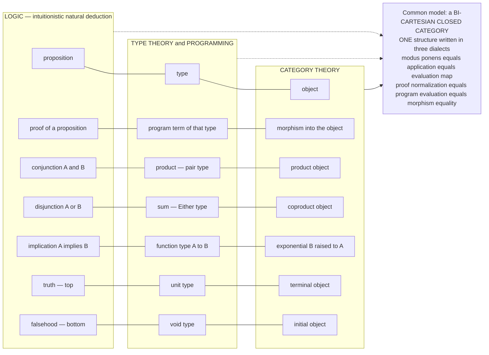

# 🔺 The Curry-Howard-Lambek Correspondence

> [!abstract] TL;DR
> The **Curry-Howard-Lambek correspondence** is the exact three-way isomorphism that a **logician's proof**, a **programmer's function**, and a **category-theorist's morphism** are *the same object written in three different alphabets*. Its slogans are **"proposition = type = object"** and **"proof = program = morphism."** The **Curry-Howard** half (propositions-as-types) matches logic to typed programming: a proposition `A implies B` is the **function type** `A -> B`, a proof is a **program/term**, conjunction is the **product/pair** type, disjunction is the **sum/Either** type, truth is the **unit** type, falsehood is the **empty/void** type, and normalizing a proof is **evaluating** the program — and it lands on *intuitionistic* logic precisely because programs are **constructive**. The **Lambek** half supplies the third leg: the **simply typed lambda calculus is the internal language of cartesian closed categories** (types are objects, terms are morphisms, product types are categorical products, function types are **exponentials**, and `beta`/`eta` equality is equality of morphisms) — an *equivalence*, not an analogy. Extended by **Lawvere** (the quantifiers `exists` and `forall` are **left and right adjoints** to substitution) and by **homotopy type theory** (equality-as-paths, `infinity`-groupoid semantics), it becomes the **"Rosetta Stone"** (Baez-Stay) reaching even into physics via monoidal categories. This is not a curiosity: it is *why category theory matters for programming*, why **total functional programs are proofs**, and the mathematical foundation under every modern **proof assistant** — Coq, Agda, Lean, Idris — where to type-check a program **is** to check a proof.

---

## Intuition

**Analogy — three guilds discover they wrote the same book in three secret alphabets.** Imagine a logician, a programmer, and a category theorist, each locked in a separate tower, each certain they study a different subject. The logician spends her life *proving theorems*: given premises, she derives conclusions. The programmer spends his life *writing functions*: given inputs of one type, he produces outputs of another. The category theorist draws *arrows between objects* and composes them. One day their notebooks are laid side by side, and a shock runs through all three: **every page matches, line for line.** Where the logician wrote "a proof that `A` implies `B`," the programmer had written "a function from type `A` to type `B`," and the category theorist had drawn "a morphism from object `A` to object `B`." Where the logician *simplified a proof*, the programmer *ran his program* and the category theorist *composed and normalized arrows* — and they all reached the same endpoint. They were never studying three subjects. They were studying **one structure**, and each guild had merely invented its own dialect for it.

Read technically, the dictionary is exact: **prove a theorem and you have already written a program; run that program and you have checked the proof; and both live, natively, as an arrow in a category.** A *proposition* is a *type* is an *object*. A *proof* is a *program* is a *morphism*. "And" is the pair type is the product; "or" is `Either` is the coproduct; "implies" is the function type is the exponential. This triple identity — logic, computation, category — is one of the most beautiful unifications in all of science, and it is the reason the entire machinery of category theory in this vault turns out to be *the same subject* as programming-language theory and constructive logic.

---

## How It Works

### The two halves and one triangle

The correspondence is assembled from two historical discoveries that turned out to be two sides of one coin.

**Curry-Howard (logic <-> computation).** Haskell Curry (1934, for combinatory logic) and William Howard (1969, for natural deduction) noticed that the *typing rules* of the lambda calculus are, symbol for symbol, the *inference rules* of intuitionistic natural deduction. The dictionary (see [[The_Curry_Howard_Correspondence]]):

- A **proposition** `A` corresponds to a **type** `A`; a **proof** of `A` corresponds to a **term** (program) of type `A`. A proposition is *true* exactly when its type is *inhabited* — when some program has that type.
- **Conjunction** `A and B` is the **product / pair** type `A * B`: to prove a conjunction is to supply a proof of each side, i.e. a pair ([[Products_and_Coproducts]]).
- **Disjunction** `A or B` is the **sum / Either** type `A + B`: a proof is a *tagged* choice of one side — the constructive content that makes the logic intuitionistic.
- **Implication** `A implies B` is the **function type** `A -> B`: a proof is a *procedure* transforming any proof of `A` into a proof of `B`. **Modus ponens** is **function application**; **implication introduction** (the deduction theorem) is **lambda abstraction**.
- **Truth** `top` is the **unit** type (one trivial inhabitant); **falsehood** `bottom` is the **empty / void** type (no inhabitant). "From falsehood, anything" (*ex falso*) is the unique function *out of* the empty type.
- **Universal quantification** `forall x. P(x)` is the **dependent product** `Pi`; **existential** `exists x. P(x)` is the **dependent sum** `Sigma`.
- **Proof normalization** (cut-elimination) is **program evaluation** (`beta`-reduction). Simplifying a proof and running a program are *the same operation*.

Because a program must *constructively produce* its output, the logic that matches is **intuitionistic**, not classical: there is no closed program of type `((A -> B) -> A) -> A` (Peirce's law) or `not not A -> A` (double-negation elimination), exactly mirroring the fact that these are *not* intuitionistically provable ([[Homotopy_Type_Theory]] and constructive logic).

**Lambek (computation <-> category).** Joachim Lambek (1970s) closed the triangle: the **simply typed lambda calculus is the internal language of cartesian closed categories (CCCs)** ([[Simply_Typed_Lambda_Calculus]], [[Cartesian_Closed_and_Topos_Theory]]). Types become **objects**, terms-in-context become **morphisms**, product types become categorical **products**, the unit type becomes the **terminal object** ([[Terminal_Initial_and_Zero_Objects]]), and — the crucial leg — function types become **exponentials** `B^A`, with application as the evaluation map and lambda abstraction as **currying** ([[Exponentials_and_Cartesian_Closed_Categories]]). *Lambek's theorem* upgrades this to an **equivalence of categories** between typed lambda theories and CCCs: `beta`/`eta`-equality of terms is exactly *equality of morphisms*. Composing Lambek with Curry-Howard fuses all three, so a **bi-cartesian closed category** (products, coproducts, terminal, initial, exponentials) is simultaneously a model of intuitionistic propositional logic *and* of the typed lambda calculus.

### The three-way dictionary



*Each horizontal chain is one row of the Rosetta Stone: the same construct in three languages. The common model below is the cartesian closed category, where composition is cut is sequencing, and where the equations that hold are simultaneously the laws of proof normalization, of program evaluation, and of a CCC.*

### Beyond propositions: quantifiers as adjoints, and dependent types

Propositional Curry-Howard-Lambek covers `and`, `or`, `implies`, `top`, `bottom`. **Predicate logic** adds quantifiers, and here **F. W. Lawvere** (1969) supplied the categorical punchline: the **existential and universal quantifiers are, respectively, the left and right adjoints to substitution** (pullback/weakening) along a projection. Writing `x` for the substitution functor, `exists` is left adjoint (`exists -| x`) and `forall` is right adjoint (`x -| forall`) — the categorical logic of predicate calculus, formalized via **hyperdoctrines**. Quantifiers are therefore not primitive symbols but *adjoints*, deepening the correspondence beyond the propositional fragment.

On the type-theory side, quantifiers over *types* are **dependent types**: `forall` becomes the **dependent product** `Pi(x:A).B(x)` and `exists` becomes the **dependent sum** `Sigma(x:A).B(x)`. Categorically these live in **locally cartesian closed categories**. The modern apex is **homotopy type theory (HoTT)** ([[Homotopy_Type_Theory]]): the identity type `Id_A(x, y)` is read as the *type of paths* from `x` to `y`, propositions become a special layer of types (mere propositions), and the semantics moves from ordinary categories to `infinity`-groupoids and higher toposes. Under **univalent foundations**, logic, computation, and *higher* category theory fully merge — the frontier where Curry-Howard-Lambek becomes a statement about homotopy.

### The Rosetta Stone and a fourth column

John Baez and Mike Stay (2011) extended the triangle into a **four-column "Rosetta Stone"** by adding **physics**: the shared skeleton of all four is a **(symmetric) monoidal category**, whose morphisms compose in sequence *and* in parallel. Then a **process in physics**, a **proof in linear logic**, a **program with resources**, and a **morphism in a monoidal category** are one thing, and **string diagrams** are their common graphical calculus. When the monoidal product is *not* cartesian — resources cannot be freely copied or discarded — the logic becomes **linear logic** and the types become **resource types**, tying the structural rules of logic (contraction, weakening) to the computational notion of *resource usage*. Cartesian closure is the special case where duplication and deletion are free.

### Why the equations line up

The correspondence is exact because the *dynamics* agree, not just the vocabulary. **Cut** in a sequent proof is **composition** of morphisms is **function composition / sequencing** of programs. **Cut-elimination** — the theorem that every proof can be normalized to a cut-free form — is **strong normalization** of the typed lambda calculus is the fact that **morphisms in the free CCC have canonical normal forms**. A term of a type *is* a constructive proof; reducing it never changes *which* theorem it proves, only *how* the proof is presented. That shared operational semantics is what makes this an *isomorphism* rather than a suggestive metaphor.

---

## Key Concepts

**Secondary (explain to a curious beginner)**
- Three fields — logic, programming, category theory — are secretly the **same subject**. A *statement you can prove* = a *type you can write a program for* = an *object you can draw an arrow to*.
- **Proof = program.** If you can write a function that turns any input of type `A` into an output of type `B`, you have *proved* "A implies B." No function of that type means the implication is *not provable*.
- "**And**" = a pair, "**or**" = a tagged choice (`Either`), "**implies**" = a function, "**true**" = a one-value type, "**false**" = a type with *no* values.
- **Running a program is simplifying a proof** — the same act seen from two sides.

**Undergraduate (a first types / category-theory course)**
- **Curry-Howard dictionary**: proposition/type, proof/term, `and`/product, `or`/sum, `implies`/function, `top`/unit, `bottom`/void, `forall`/`Pi`, `exists`/`Sigma`; modus ponens/application, `->`-introduction/abstraction, normalization/`beta`-reduction.
- **Intuitionistic, not classical**: no term inhabits Peirce's law or double-negation elimination; excluded middle `A or not A` is not constructively provable because you would need to *decide* which side.
- **Lambek's theorem**: the STLC is the *internal language* of cartesian closed categories; types = objects, function types = exponentials, `beta`/`eta` = equality of morphisms; an *equivalence* between typed lambda theories and CCCs.
- **Bi-CCC**: a CCC with coproducts and initial object models the full `{and, or, implies, top, bottom}` fragment of intuitionistic propositional logic.

**Graduate (foundational / semantic)**
- **Quantifiers as adjoints (Lawvere)**: `exists -| x -| forall` along substitution; predicate logic as a **hyperdoctrine**; the Beck-Chevalley condition ensures substitution commutes with quantification.
- **Dependent types**: `Pi`/`Sigma` in **locally cartesian closed categories**; propositions-as-types with proof-relevance; identity types.
- **Homotopy type theory / univalent foundations**: identity types as path spaces, `n`-truncation levels (mere propositions vs sets vs groupoids), `infinity`-groupoid and higher-topos semantics; univalence as "equivalent types are equal."
- **Rosetta Stone (Baez-Stay)**: monoidal categories as the common skeleton of logic, computation, and physics; **linear logic** and resource types when the tensor is non-cartesian; string diagrams as graphical proofs.
- **Cut-elimination = strong normalization = canonical form in the free CCC**: the shared operational core that makes the correspondence an isomorphism.

---

## Python Demo

```python
# ======================================================================
# THE CURRY-HOWARD-LAMBEK DICTIONARY, MADE EXECUTABLE.
#   Encode propositional connectives as Python type CONSTRUCTIONS:
#       AND(A, B)  = a PAIR (tuple)          -- product / conjunction
#       OR(A, B)   = an Either tag           -- coproduct / disjunction
#       A -> B     = a Python FUNCTION        -- exponential / implication
#       TOP        = the Unit value           -- terminal / truth
#       BOTTOM     = the Void type (no value) -- initial / falsehood
#   Then, for several TAUTOLOGIES, WRITE THE PROGRAM THAT IS ITS PROOF:
#       *  A and B  =>  A            (projection)
#       *  A  =>  (B => A)          (constant / weakening)
#       *  (A and B => C)  <=>  (A => (B => C))   (curry / uncurry)
#   A TERM OF A TYPE *IS* A CONSTRUCTIVE PROOF of the proposition.
#   We also exhibit a NON-THEOREM: a type with NO total inhabitant
#   (A => B for unrelated atoms, and BOTTOM itself) = an unprovable prop.
#   Finally we TABULATE and VISUALIZE the three-column correspondence.
# Pure standard library + matplotlib (no numpy needed).
# ======================================================================
import sys
import matplotlib.pyplot as plt

try:                                     # print unicode safely on any console
    sys.stdout.reconfigure(encoding="utf-8")
except Exception:
    pass

# ----------------------------------------------------------------------
# TYPE CONSTRUCTIONS  (the "type theory" column of the dictionary).
#   A "proof" of a proposition is literally a VALUE of the encoded type;
#   a proposition is TRUE iff we can construct such a value (inhabitance).
# ----------------------------------------------------------------------
UNIT = ()                                # the sole inhabitant of TOP (unit)

def AND(a, b):                           # conjunction  =  product / pair
    return (a, b)

def INL(a):                              # left  injection of a disjunction
    return ("inl", a)

def INR(b):                              # right injection of a disjunction
    return ("inr", b)

# BOTTOM (void) has NO constructor at all -> it is UNINHABITED by design.
# ex falso: the unique map OUT of BOTTOM. It can never actually be called,
# because no value of BOTTOM can ever be produced -- that IS falsehood.
def absurd(_void):
    raise RuntimeError("ex falso: BOTTOM has no inhabitant, unreachable")

# ----------------------------------------------------------------------
# PROOFS-AS-PROGRAMS.  Each function below is a closed lambda term whose
# TYPE is a tautology; the term itself is the CONSTRUCTIVE PROOF.
# ----------------------------------------------------------------------
def proof_and_elim_left(p):              #  A and B  =>  A     (projection)
    a, b = p
    return a

def proof_weakening(a):                  #  A  =>  (B => A)    (K combinator)
    return lambda b: a                   #  ignore B, keep the proof of A

def proof_curry(f):                      #  (A and B => C)  =>  (A => B => C)
    return lambda a: lambda b: f(AND(a, b))

def proof_uncurry(g):                    #  (A => B => C)  =>  (A and B => C)
    return lambda p: g(p[0])(p[1])

def proof_or_elim(handle_a, handle_b):   #  (A=>C) and (B=>C)  =>  (A or B => C)
    def run(either):
        tag, val = either
        return handle_a(val) if tag == "inl" else handle_b(val)
    return run

# ----------------------------------------------------------------------
# RUN THE PROOFS on sample "atomic proofs" (opaque witness tokens) to show
# the programs actually compute -- i.e. the proofs actually check.
# ----------------------------------------------------------------------
a_tok, b_tok, c_tok = "proof_of_A", "proof_of_B", "proof_of_C"

print("=== Tautologies proved by writing their programs ===")
print("  A and B => A          :", proof_and_elim_left(AND(a_tok, b_tok)))
print("  A => (B => A)         :", proof_weakening(a_tok)(b_tok))

# curry / uncurry witness the ISOMORPHISM (A and B => C) ~= (A => B => C),
# the Lambek/exponential law  C^(A x B) = (C^B)^A  as executable code.
def f_pair(p):                           # some proof of  A and B => C
    return c_tok
g = proof_curry(f_pair)
assert g(a_tok)(b_tok) == c_tok                      # curried form still works
assert proof_uncurry(g)(AND(a_tok, b_tok)) == c_tok  # round-trip = identity
print("  (A and B => C) <=> (A => B => C)  via curry/uncurry: [verified]")

# disjunction elimination: prove  A or B => C  from  A=>C and B=>C
to_c_from_a = lambda a: ("C_from_" + a)
to_c_from_b = lambda b: ("C_from_" + b)
decide = proof_or_elim(to_c_from_a, to_c_from_b)
print("  A or B => C  on INL:", decide(INL(a_tok)),
      "| on INR:", decide(INR(b_tok)))

# ----------------------------------------------------------------------
# A NON-THEOREM.  For UNRELATED atoms A, B there is no closed program of
# type  A => B : you cannot manufacture a proof of B out of thin A. The
# ONLY total functions we can write are the ones we could already justify.
# We model "proof search over the constructors" and find it fails.
# ----------------------------------------------------------------------
def can_derive_B_from_A(assumptions):
    """Is BOTTOM/B derivable using only what we are GIVEN? With just a
       proof of A and no rule A->B, the atom B is NOT reachable."""
    return "B" in assumptions            # B is provable only if assumed

print("\n=== A non-theorem: A => B for unrelated atoms A, B ===")
print("  given only {A}, is B derivable? ->", can_derive_B_from_A({"A"}),
      "  (type A => B is UNINHABITED -> the proposition is NOT provable)")
print("  BOTTOM (void) has zero inhabitants -> 'false' is never provable")
try:
    absurd("cannot-exist")               # we can only *pretend* to have void
except RuntimeError as e:
    print("  attempting to use a void proof:", e)

# ----------------------------------------------------------------------
# TABULATE the three-column Curry-Howard-Lambek dictionary.
# ----------------------------------------------------------------------
ROWS = [
    ("proposition",       "type",                 "object"),
    ("proof of A",        "term of type A",       "morphism 1 -> A"),
    ("A and B",           "product  A * B",       "product  A x B"),
    ("A or B",            "sum  Either[A,B]",     "coproduct  A + B"),
    ("A implies B",       "function  A -> B",     "exponential  B^A"),
    ("truth  top",        "Unit type",            "terminal object 1"),
    ("false  bottom",     "Void type",            "initial object 0"),
    ("modus ponens",      "application f(x)",     "evaluation map"),
    ("normalization",     "beta-reduction",       "equal morphisms"),
]
w = max(len(r[0]) for r in ROWS)
print("\n=== The Curry-Howard-Lambek dictionary ===")
print(f"  {'LOGIC':<{w}} | {'TYPE / PROGRAM':<20} | CATEGORY")
print("  " + "-" * (w + 44))
for lg, ty, ct in ROWS:
    print(f"  {lg:<{w}} | {ty:<20} | {ct}")

# ----------------------------------------------------------------------
# VISUALIZE the dictionary as a THREE-COLUMN mapping: each row is one
# construct drawn simultaneously in Logic, Type theory, and Category theory,
# with connecting lines showing "these three are literally the same thing."
# ----------------------------------------------------------------------
fig, ax = plt.subplots(figsize=(12.5, 7.4))
cols = ["LOGIC\n(intuitionistic)", "TYPE THEORY\n(programming)", "CATEGORY\n(CCC)"]
xcol = [0.14, 0.5, 0.86]
colcolor = ["#c62828", "#1565c0", "#2e7d32"]
n = len(ROWS)
ytop, ybot = 0.90, 0.08
ys = [ytop - (ytop - ybot) * i / (n - 1) for i in range(n)]

for x, title, col in zip(xcol, cols, colcolor):     # column headers
    ax.text(x, 0.975, title, ha="center", va="center", fontsize=12,
            fontweight="bold", color=col)

for y, (lg, ty, ct) in zip(ys, ROWS):               # one row = one construct
    cells = [lg, ty, ct]
    for x, txt, col in zip(xcol, cells, colcolor):
        ax.text(x, y, txt, ha="center", va="center", fontsize=9.5,
                bbox=dict(boxstyle="round,pad=0.32", facecolor="white",
                          edgecolor=col, linewidth=1.5))
    # connecting lines: "same thing, three dialects"
    ax.annotate("", xy=(xcol[1] - 0.115, y), xytext=(xcol[0] + 0.115, y),
                arrowprops=dict(arrowstyle="-", color="#9e9e9e", lw=1.0))
    ax.annotate("", xy=(xcol[2] - 0.115, y), xytext=(xcol[1] + 0.115, y),
                arrowprops=dict(arrowstyle="-", color="#9e9e9e", lw=1.0))

ax.text(0.5, 0.028,
        "proposition  =  type  =  object        proof  =  program  =  morphism",
        ha="center", va="center", fontsize=11, style="italic", color="#37474f")
ax.set_title("The Curry-Howard-Lambek Correspondence: one structure, three languages",
             fontsize=13, fontweight="bold")
ax.set_xlim(0, 1); ax.set_ylim(0, 1); ax.axis("off")
fig.tight_layout()
plt.savefig("curry_howard_lambek.png", dpi=130)
print("\nSaved figure to curry_howard_lambek.png")
```

Running it makes the trinity concrete. Each `proof_*` function is a closed lambda term whose *type* is a tautology, so the term **is** the proof: `proof_and_elim_left` inhabits `A and B => A`, `proof_weakening` inhabits `A => (B => A)`, and `proof_curry`/`proof_uncurry` are mutually inverse witnesses of `(A and B => C) <=> (A => B => C)` — the executable face of the exponential law `C^(A*B) = (C^B)^A` and hence of currying in a CCC. The code then shows the *negative* side of the dictionary: for unrelated atoms `A, B` no closed program of type `A -> B` can be built (proof search over the available constructors fails), and the void type has no inhabitant at all — so those propositions are simply **not provable**. Inhabitation is provability. The printed table and the three-column figure lay the same nine constructs side by side in logic, in types, and in category theory, with connecting lines making the point visually: these are not three analogies but one structure in three alphabets.

---

## Real-World Applications

> **Example — a proof assistant like Coq, Agda, Lean, or Idris *is* this correspondence compiled into a tool.** In these systems you do not "write a proof" in some separate proof language and "write a program" in another — you write a **term**, and its **type is the theorem**. The type checker verifies the term inhabits the type, which by Curry-Howard *is* verifying the proof. Lean's `mathlib`, the four-color theorem in Coq, and the Feit-Thompson odd-order theorem in Coq are all *programs whose types are the statements*. The categorical (Lambek) leg is what lets the same systems have clean **denotational semantics** and be reasoned about with equational (CCC) laws.

Where the trinity does concrete work:

- **Certified software and program extraction.** From a constructive proof that "for all inputs there exists a correct output," a proof assistant can **extract** an executable program that is correct *by construction* — the proof and the program are the same object. **CompCert** (a C compiler proved correct in Coq) and **seL4** (a formally verified OS microkernel) are landmark examples: the guarantee is not "tested a lot" but "the type is the specification and the term inhabits it."
- **Dependently typed programming and type-driven development.** In Idris, Agda, or Lean, types can *depend on values* (`Vector n`, "sorted list," "balanced tree"), so specifications live in the type. Programming becomes *filling in a proof*, and the compiler's "hole-driven" development is proof search. The `Pi`/`Sigma` correspondence to `forall`/`exists` is what makes this possible.
- **Compiling to categories.** Conal Elliott's "Compiling to Categories" reinterprets an ordinary lambda term as a **morphism in any cartesian closed category** the user supplies — the same source then targets hardware circuits, automatic derivatives, or interval analysis. That translation is *Lambek's theorem executed as a compiler pass*.
- **Total functional programming guarantees.** The correspondence explains *why* a **total** (terminating, exception-free) functional program can be read as a proof, and why partiality breaks it (below). It is the theoretical justification for typed functional programming and for "if it type-checks, it's structurally correct"-flavored guarantees.
- **Linear logic and resource-aware languages.** The resource reading (Rust-style ownership, session types, quantum programming) descends from the *monoidal/linear* extension of the Rosetta Stone, where structural rules of logic become rules about *using each value exactly once*.

---

## Common Pitfalls

- **Treating it as a loose analogy instead of an isomorphism.** Curry-Howard-Lambek is an *exact* correspondence: an equivalence of categories (Lambek), a bijection of proofs and terms (Curry-Howard), with matching *dynamics* (cut-elimination = normalization = canonical CCC form). Saying "logic is *like* programming" undersells it — they are the *same* mathematics.
- **Assuming it gives you classical logic.** The pure correspondence lands on **intuitionistic** logic. There is *no* closed program of type `((A -> B) -> A) -> A` (Peirce) or `not not A -> A` (double-negation elimination), and no term for excluded middle `A or not A`. Recovering classical logic requires extra computational structure — control operators like `call/cc` (the Griffin correspondence) or double-negation/CPS translations — not a plain lambda calculus or CCC.
- **Forgetting that only *total* programs are proofs.** General recursion, non-termination, exceptions, and `null` all inhabit *every* type (e.g. `def loop(): return loop()` "has" type `A -> B` for any `A, B`), which would "prove" everything and make the logic *inconsistent*. That is precisely why proof assistants demand **totality and termination checking**. A partial function is not a proof.
- **Confusing "propositions as types" (naive) with proof-relevance.** In plain type theory *every* type is a proposition and every term a proof, but two proofs of the same proposition may be genuinely different terms. In **HoTT** this matters: a "proposition" is a *mere proposition* (all its proofs are equal, a `-1`-type), while general types carry higher structure (paths, homotopies). Flattening this distinction leads to errors about equality and univalence.
- **Getting the exponential direction / adjoint side backwards.** Implication `A -> B` is the exponential `B^A` (base is the *codomain* `B`), and the quantifiers are adjoints in a fixed order: `exists` is the *left* adjoint and `forall` the *right* adjoint to substitution. Swapping these inverts the whole categorical semantics.
- **Believing the correspondence stops at propositional logic.** Without Lawvere's quantifiers-as-adjoints and the dependent-type (`Pi`/`Sigma`) extension, the picture looks limited to `and`/`or`/`implies`. The full power — and the connection to predicate logic, dependent types, and HoTT — only appears once quantifiers enter as adjoints and toposes model higher-order logic.

---

## Related Concepts

- [[The_Curry_Howard_Correspondence]] — the logic-computation half in full: propositions-as-types, proofs-as-programs, normalization-as-evaluation; this note adds the categorical (Lambek) leg.
- [[Simply_Typed_Lambda_Calculus]] — the computational middle term; **Lambek's theorem** says it is the *internal language* of cartesian closed categories.
- [[Exponentials_and_Cartesian_Closed_Categories]] — the exponential `B^A` *is* implication `A -> B`; currying is `->`-introduction, `eval` is modus ponens; the CCC is the shared model.
- [[Products_and_Coproducts]] — product = conjunction = pair type; coproduct = disjunction = sum/`Either` type; the algebra of the connectives.
- [[Terminal_Initial_and_Zero_Objects]] — terminal object = truth `top` = unit type; initial object = falsehood `bottom` = void type, with *ex falso* as the unique map out of the initial object.
- [[Cartesian_Closed_and_Topos_Theory]] — a bi-CCC models intuitionistic propositional logic; adding a subobject classifier gives a **topos** whose internal language is higher-order intuitionistic type theory.
- [[Homotopy_Type_Theory]] — the modern upgrade: equality-as-paths, propositions as a layer of types, `infinity`-groupoid / higher-topos semantics, univalent foundations.
- [[Cartesian_Closed_and_Topos_Theory]] — also the gateway to Lawvere's categorical logic where quantifiers appear as adjoints.

*Category Theory siblings referenced in prose but not yet written (link once they exist): **Adjunctions** (quantifiers-as-adjoints, the product-exponential adjunction), **Categorical_Logic_and_Type_Theory** (hyperdoctrines, dependent types, toposes), **Category_Theory_in_Programming** (the CS payoff), and **String_Diagrams_and_Graphical_Calculus** (the monoidal Rosetta Stone).*

---

## Review Questions

1. **(Conceptual)** State the two slogans of the correspondence ("proposition = type = object" and "proof = program = morphism") and, for the connectives `and`, `or`, `implies`, `top`, `bottom`, give the matching type-theoretic construct *and* the matching categorical object. Then explain in one sentence why "a proposition is true" corresponds to "a type is inhabited."
2. **(Scenario)** You write, in a total functional language, a function `f : (A, B) -> C` and later refactor it to `g : A -> (B -> C)`. (a) Which tautology of intuitionistic logic have you *proved* by exhibiting `f`, and which by exhibiting `g`? (b) Which categorical law guarantees these carry the same information, and which adjunction is it an instance of? (c) If instead your function used unbounded recursion and might not terminate, why would it *fail* to be a valid proof, and what feature of proof assistants prevents this?
3. **(Trade-off / significance)** Curry-Howard-Lambek lands on *intuitionistic*, not classical, logic. (a) Name one classically valid proposition (with its type) that has **no** closed inhabiting program, and say what that means computationally. (b) What must be added — logically and computationally — to recover classical reasoning? (c) Extend the picture: state Lawvere's characterization of the quantifiers `exists` and `forall`, and describe what HoTT changes about the meaning of "equality" in the correspondence.

---

## Sources

- Howard, W. A. "The Formulae-as-Types Notion of Construction." In *To H. B. Curry: Essays on Combinatory Logic, Lambda Calculus and Formalism*, Academic Press, 1980 (written 1969) — the founding statement of proofs-as-programs.
- Lambek, J. and Scott, P. J. *Introduction to Higher-Order Categorical Logic*. Cambridge University Press, 1986 — the definitive treatment of the CCC leg and the equivalence between typed lambda calculi and cartesian closed categories.
- Wadler, P. "Propositions as Types." *Communications of the ACM* 58(12), 2015 — the accessible modern survey of the correspondence and its history.
- Sorensen, M. H. and Urzyczyn, P. *Lectures on the Curry-Howard Isomorphism*. Elsevier, 2006 — a thorough technical account across logics and calculi.
- Baez, J. and Stay, M. "Physics, Topology, Logic and Computation: A Rosetta Stone." In *New Structures for Physics*, Springer, 2011 — the monoidal-category extension linking logic, computation, and physics.
- Lawvere, F. W. "Adjointness in Foundations." *Dialectica* 23, 1969 — quantifiers as adjoints; the categorical logic of predicate calculus.
- The Univalent Foundations Program. *Homotopy Type Theory: Univalent Foundations of Mathematics*. IAS, 2013 — the HoTT upgrade of propositions-as-types.

---

#category-theory #curry-howard-lambek #propositions-as-types #proofs-as-programs #cartesian-closed
