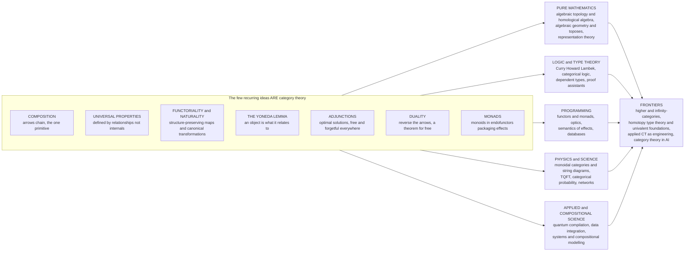

# 🧭 The Reach and Future of Category Theory

> [!abstract] TL;DR
> This is the **capstone** of the vault: a synthesis of what category theory *is*, why it **unifies** mathematics and computation, and where it is **going**. The whole subject rests on a handful of ideas that recur endlessly — **composition** as the primitive act, **universal properties** ("defined by relationships, not internals"), **functoriality and naturality** (structure-preserving maps and their canonical transformations), the **Yoneda lemma** ("an object *is* what it relates to"), **adjunctions** ("optimal solutions and free–forgetful pairs everywhere"), **duality** ("reverse the arrows and get a second theorem for free"), and **monads** ("monoids in endofunctors" that package effects). These few deep patterns turn out to be the *same* structure wearing many costumes across **algebra, geometry, logic, physics, and computation** — which is why category theory is often called "the mathematics of mathematics." Born in 1945 as bookkeeping for algebraic topology (Eilenberg–Mac Lane), dismissed as "abstract nonsense," it reshaped **algebraic geometry** (Grothendieck), became the theoretical spine of **typed functional programming** and **proof assistants** (Curry–Howard–Lambek), and now drives frontiers in **higher / ∞-categories** (Lurie), **homotopy type theory** as a new foundation of mathematics, and **applied category theory** maturing into engineering. The vault's payoff is not new hard theorems but a portable **pair of glasses**: once you wear them, connections between distant fields become visible.

---

## Intuition

**Analogy — category theory is a pair of glasses, not a subject.** Most mathematical fields are *places*: number theory is a country, topology is a country, and you visit each to learn its local customs. Category theory is not another country — it is a **pair of glasses you put on before travelling anywhere**. Through ordinary eyes, the Cartesian product of two sets, the direct product of two groups, the product of two topological spaces, the greatest lower bound of two numbers, the tuple type in a programming language, and the "logical AND" of two propositions all look like *unrelated local customs* in six different countries. Put the glasses on and they snap into a single silhouette: each is the **same universal shape** — a "product" — defined by exactly the same relationship to everything around it. The glasses do not tell you new facts about any one country; they let you *see that you have been in this country before*, so a hard-won insight in algebra suddenly illuminates a problem in logic.

That is the whole trick, and it explains category theory's strange origin story. It started life in 1945 as **"abstract nonsense"** — Eilenberg and Mac Lane's tongue-in-cheek phrase for a bureaucratic language invented merely to *state precisely* how homology groups vary with continuous maps in algebraic topology. It was bookkeeping. But the bookkeeping turned out to be **the same bookkeeping everywhere**: the way homology varies with maps is the way vector spaces vary with linear maps is the way types vary with programs. Category theory trades the question *"what is this thing made of?"* for *"how does this thing relate and compose?"* — and that single shift of attention is what makes it the closest thing mathematics has to a **universal language**. This capstone puts the glasses back on one last time to survey how far the view reaches. It begins where the vault began, at [[Category_Theory_Overview]].

---

## How It Works

### The recurring core: seven ideas that ARE category theory

If you strip the vault down to its skeleton, the entire subject is a small number of ideas, each reused in dozens of disguises. Everything else is *examples*.

1. **Composition is primary.** A category is objects, arrows, an **associative composition**, and identities — nothing more. The content is never "what an object is" but "how arrows chain." Every later idea is built from composition alone. This is the founding move of [[Category_Theory_Overview]].
2. **Universal properties: defined by relationships, not internals.** A product, a coproduct, a limit, a colimit, a free group, a tensor product — none is defined by *what it contains*. Each is defined by a **unique-factorization property**: it is the object through which all relevant arrows factor *uniquely*. "The best solution to a mapping problem" is the recurring template; see [[Universal_Properties]], [[Limits_and_Colimits]], and [[Products_and_Coproducts]].
3. **Functoriality and naturality: structure-preserving maps, and canonical transformations between them.** A **functor** transports whole categories while preserving composition; a **natural transformation** is a map *between functors* that commutes with every arrow — the precise meaning of "canonical, no arbitrary choices." See [[Functors]] and [[Natural_Transformations]].
4. **The Yoneda lemma: an object is what it relates to.** The vault's deepest single theorem says an object is **completely determined, up to unique isomorphism, by the pattern of arrows into (or out of) it** — its "relationship profile." "You are the sum of your relationships" is not a slogan but a proof. See [[The_Yoneda_Lemma]].
5. **Adjunctions: optimal solutions and free–forgetful pairs, everywhere.** An **adjunction** `F ⊣ G` pairs a "free / most-efficient construction" with a "forgetful / structure-dropping" one, and is arguably the single most pervasive pattern in mathematics — free groups, free monoids, currying, quantifiers as adjoints, syntax–semantics. (Adjunctions recur throughout the vault; a dedicated *Adjunctions* sibling collects them.)
6. **Duality: reverse the arrows, get a theorem for free.** Every construction has an **opposite** obtained by flipping every arrow: product/coproduct, limit/colimit, mono/epi, terminal/initial. Prove a theorem once and its dual comes *free of charge*. See [[Duality_and_the_Opposite_Category]].
7. **Monads: monoids in endofunctors, packaging effects.** A **monad** is "a monoid in the category of endofunctors" — a single structure that packages sequencing, context, and side effects, and that reappears as algebraic theories, as computational effects, and as the Kleisli notion of "extended" morphism. See [[Monads_Categorically]] and [[Kleisli_Categories_and_Algebras]].

These seven, endlessly recombined, **are** category theory. The rest of this note traces how far they reach.

### The reach across mathematics

Category theory was **born inside mathematics as a unifier** and never stopped. Its birthplace, **algebraic topology and homological algebra** (Eilenberg–Mac Lane, 1945), needed a precise language for "how algebraic invariants vary functorially with continuous maps" — functors and natural transformations were invented for exactly this. In **algebraic geometry**, Grothendieck rebuilt the field on categorical foundations: **schemes**, the **functor-of-points** perspective ("a space *is* the functor of its probes"), and **toposes** as generalized spaces — a program that solved concrete number-theoretic problems by categorical means. In **representation theory, logic, and foundations**, categories organize modules and their transformations ([[Abelian_Categories_and_Homological_Algebra]]), while **toposes** and **categorical logic** ([[Cartesian_Closed_and_Topos_Theory]]) reveal that a "universe of sets," an "intuitionistic logic," and a "geometry" can be *the same object* viewed three ways. The through-line: a theorem proved in one field, once phrased categorically, **illuminates another** — the sense in which category theory is "the mathematics of mathematics."

### The reach into computation

The computer-science payoff is what makes category theory unusually *practical* for an engineer. **Typed functional programming** runs on categorical scaffolding: `Functor`, `Applicative`, and `Monad` are literally the categorical concepts; **optics** (lenses, prisms) are profunctor constructions; effect systems are Kleisli categories. The **Curry–Howard–Lambek correspondence** is a three-way isomorphism — *proofs = programs = arrows in a cartesian closed category* — turning logic, computation, and category theory into one subject (a dedicated *Curry–Howard–Lambek* sibling develops this, anchored to [[Cartesian_Closed_and_Topos_Theory]]). **Proof assistants and dependent type theory** (Coq, Agda, Lean) rest on categorical semantics; the **denotational semantics of effects**, database schemas as categories and data migration as functors, and **compositional** system design all draw directly on the vault's machinery. Increasingly the same ideas surface in **machine learning** (backprop as a functor; lenses/optics for differentiable programming) and **quantum computing** (see below). Start from [[Monads_Categorically]] and a forthcoming *Category Theory in Programming* sibling for the code-level view.

### The reach into physics and science

**Monoidal categories** and their **string diagrams** ([[String_Diagrams_and_Graphical_Calculus]]) turned out to be the native language of *processes that compose in sequence and in parallel* — which is to say, of physics. **Topological quantum field theory** is literally a monoidal functor (Atiyah–Segal; Baez–Dolan's cobordism hypothesis), and **categorical quantum mechanics** (Abramsky–Coecke) recasts quantum protocols as diagram rewrites. Baez and Stay's **"Rosetta Stone"** shows that physics, topology, logic, and computation are **four dialects of one monoidal grammar**. Beyond physics, **categorical probability** (Markov categories), **systems biology, chemical reaction networks**, and **network theory** are being rebuilt compositionally — the "**applied category theory**" program of modelling open systems that glue along their boundaries.

### The frontiers: where it is going

Three frontiers are actively expanding the reach. **Higher and ∞-categories** (Lurie's *Higher Topos Theory*) add morphisms-between-morphisms up to infinite dimension, and have become the working language of modern homotopy theory and derived geometry ([[Enriched_and_Higher_Categories]]). **Homotopy Type Theory / Univalent Foundations** (Voevodsky) fuses logic, computation, and homotopy into a *new foundation of mathematics* where "equality" is a path and proofs are *checkable by computer* — see [[Homotopy_Type_Theory]]. And **applied category theory** is maturing from theory into **engineering**: quantum-circuit compilation, database and data-integration tooling, categorical accounts of deep learning, and knowledge representation for AI — the long-held dream of category theory as a *widely used scientific lingua franca*, developed in a forthcoming *Applied Category Theory* sibling.



---

## Key Concepts

### Secondary (intuition-level)
- Category theory studies **how things relate and compose**, not what they are made of. It is a **pair of glasses**, not another topic.
- A **small set of ideas** — composition, "best solution" (universal property), structure-preserving maps (functors), "you are your relationships" (Yoneda), free-vs-forgetful pairs (adjunction), arrow-reversal (duality), effect-packaging (monad) — recurs *everywhere*.
- The same shape (a "product," a "sum") shows up in sets, groups, spaces, logic, and code. Seeing this is the whole point.

### Undergraduate (working definitions)
- **Universal property:** an object characterized by a *unique-factorization* condition, so it is unique up to a *unique* isomorphism — internals are irrelevant.
- **Functor / natural transformation:** a composition-preserving map of categories, and a canonical (arrow-commuting) map between two such functors.
- **Yoneda lemma:** `Nat(Hom(A, -), F) ≅ F(A)`; consequently the functor `Hom(A, -)` determines `A` up to isomorphism — objects are known by their morphisms.
- **Adjunction `F ⊣ G`:** a natural bijection `Hom(F X, Y) ≅ Hom(X, G Y)`; the archetype of "free construction ⊣ forgetful functor."
- **Duality:** the opposite category `C^op` reverses every arrow; each theorem yields a dual by mechanical arrow-flipping.
- **Monad:** an endofunctor `T` with `unit : Id ⇒ T` and `join : T∘T ⇒ T` obeying monoid-like laws — "a monoid in `[C, C]`."

### Graduate (structural / research-level)
- **Toposes** as simultaneously generalized spaces, models of intuitionistic higher-order logic, and universes of "variable sets"; **categorical logic** as the syntax–semantics adjunction between theories and their models.
- **Curry–Howard–Lambek:** the equivalence of intuitionistic logic, simply typed lambda calculus, and cartesian closed categories — one object, three faces.
- **∞-categories / quasicategories** (Joyal, Lurie): weak composition up to coherent higher homotopy; the setting for derived algebraic geometry and modern homotopy theory ([[Enriched_and_Higher_Categories]]).
- **Univalent foundations / HoTT:** the univalence axiom "equivalent types are equal," making `(∞,1)`-topos semantics into a computer-checkable foundation ([[Homotopy_Type_Theory]]).
- **Applied CT / compositionality:** symmetric monoidal (and hypergraph) categories, decorated cospans, and structured cospans as the algebra of "open systems"; Kan extensions as the universal recipe behind data migration and "the best approximate answer" ([[Kan_Extensions]]).

---

## Python Demo

This demo makes the vault's thesis **computational**: *one categorical idea casts many concrete shadows*. Part A implements a single generic `Monoid` abstraction and instantiates it across **five different categories** — numbers under addition, strings under concatenation, booleans under AND, a set under union, and (the key one) **endofunctions under composition**, which is the finite shadow of "a monad is a monoid in endofunctors." The *same* law-checker verifies all five. Part B demonstrates the **Yoneda principle** — "an object is what it relates to" — on the divisibility poset: each object is fingerprinted purely by *which objects it maps to*, and we confirm every object is uniquely recovered from that relationship profile alone (a finite, hand-computable Yoneda). Part C draws three matplotlib panels: the **unifying web** of core ideas radiating to their reaches, the **Yoneda hom-matrix** (distinct rows = distinguishable objects), and the **monoid-across-guises** law table. Pure standard library plus matplotlib; no numpy required.

```python
"""
Capstone synthesis demo: ONE categorical idea, MANY concrete shadows.

  Part A -- a single generic Monoid abstraction instantiated across five
            categories, incl. endofunctions-under-composition (the finite
            shadow of "a monad is a monoid in endofunctors").
  Part B -- Yoneda in miniature: on the divisibility poset, each object is
            determined by WHICH objects it relates to (its hom-profile).
  Part C -- matplotlib: the unifying web, the Yoneda hom-matrix, the law table.
"""
import math
from itertools import product
import matplotlib.pyplot as plt
from matplotlib.patches import FancyArrowPatch

# ----------------------------------------------------------------------
# PART A -- One structure (Monoid), many guises.
# A monoid is a set with an associative binary op and a two-sided identity.
# The SAME law-checker validates every instance -> "same structure, many shadows".
# ----------------------------------------------------------------------
class Monoid:
    def __init__(self, name, op, identity, samples):
        self.name = name
        self.op = op                 # binary operation: op(x, y)
        self.identity = identity     # the unit element e
        self.samples = samples       # finite witnesses to test the laws on

    def identity_holds(self):
        e = self.identity
        return all(self.op(e, x) == x and self.op(x, e) == x
                   for x in self.samples)

    def associative_holds(self):
        return all(self.op(self.op(a, b), c) == self.op(a, self.op(b, c))
                   for a, b, c in product(self.samples, repeat=3))

    def is_monoid(self):
        return self.identity_holds() and self.associative_holds()


def compose(f, g):
    """Composition of endofunctions represented as dict maps: (f after g)."""
    return {x: f[g[x]] for x in g}


# --- Five guises of the SAME structure -------------------------------------
S = (0, 1, 2)                                   # a tiny carrier set for the last two
endos = [dict(zip(S, p)) for p in product(S, repeat=len(S))]  # all endofunctions on S
id_endo = {x: x for x in S}

guises = [
    Monoid("Numbers, plus",        lambda a, b: a + b,        0,          [-1, 0, 2, 5]),
    Monoid("Strings, concat",      lambda a, b: a + b,        "",         ["", "a", "bc"]),
    Monoid("Booleans, AND",        lambda a, b: a and b,      True,       [True, False]),
    Monoid("Subsets, union",       lambda a, b: a | b,        frozenset(),
            [frozenset(), frozenset({1}), frozenset({1, 2})]),
    # THE KEY ONE: endofunctions under composition -- a one-object category whose
    # arrows form a monoid. This is the finite shadow of "monoid in endofunctors".
    Monoid("Endofunctions, compose", compose, id_endo, endos[:6]),
]

print("PART A -- one Monoid abstraction, five concrete shadows")
law_rows = []
for m in guises:
    ok = m.is_monoid()
    law_rows.append((m.name, m.identity_holds(), m.associative_holds(), ok))
    print(f"  {m.name:24s} identity={m.identity_holds()!s:5s} "
          f"assoc={m.associative_holds()!s:5s} monoid={ok}")

# ----------------------------------------------------------------------
# PART B -- Yoneda in miniature on the divisibility poset (a thin category).
# In a poset there is exactly one arrow a -> b iff a divides b. Yoneda says an
# object is determined by Hom(-, a): here, by the SET of objects that map to it.
# We show every object's relationship-profile is UNIQUE -> objects are recovered
# from relationships alone ("an object is what it relates to").
# ----------------------------------------------------------------------
OBJ = [1, 2, 3, 4, 6, 12]
def arrow(a, b):                      # unique morphism a -> b exists iff a | b
    return b % a == 0

# Representable profile of b = { a : there is an arrow a -> b } (its Hom(-, b)).
profile = {b: frozenset(a for a in OBJ if arrow(a, b)) for b in OBJ}
recovered = {prof: b for b, prof in profile.items()}   # invert: profile -> object

print("\nPART B -- Yoneda: each object recovered from its relationship profile")
all_unique = len(recovered) == len(OBJ)
for b in OBJ:
    print(f"  object {b:2d}  Hom(-, {b:2d}) = {sorted(profile[b])}"
          f"   recovered={recovered[profile[b]]}")
print(f"  all profiles distinct (object determined by relationships): {all_unique}")

# hom-matrix for the heatmap: rows = source, cols = target, 1 iff arrow exists
hom = [[1 if arrow(a, b) else 0 for b in OBJ] for a in OBJ]

# ----------------------------------------------------------------------
# PART C -- Visualize the unifying idea.
# ----------------------------------------------------------------------
fig = plt.figure(figsize=(16, 5.5))
ax1 = fig.add_subplot(1, 3, 1)
ax2 = fig.add_subplot(1, 3, 2)
ax3 = fig.add_subplot(1, 3, 3)

# (1) The unifying web: core ideas (inner ring) -> reaches (outer ring).
ax1.set_title("One lens, many reaches", fontweight="bold")
ax1.axis("off")
ax1.set_xlim(-1.35, 1.35); ax1.set_ylim(-1.35, 1.35)
core = ["Composition", "Universal\nProperties", "Functors /\nNaturality",
        "Yoneda", "Adjunctions", "Duality", "Monads"]
reach = ["Pure\nMath", "Logic /\nTypes", "Programming",
         "Physics", "Applied CT", "Frontiers"]
ax1.scatter([0], [0], s=1400, c="#2c3e6b", zorder=3)
ax1.text(0, 0, "CT\ncore", color="white", ha="center", va="center",
         fontsize=9, fontweight="bold", zorder=4)
for i, name in enumerate(core):                      # inner ring
    ang = 2 * math.pi * i / len(core) + math.pi / 2
    x, y = 0.62 * math.cos(ang), 0.62 * math.sin(ang)
    ax1.plot([0, x], [0, y], color="#8aa0c8", lw=1.2, zorder=1)
    ax1.scatter([x], [y], s=520, c="#dfe9f7", edgecolors="#2c3e6b", zorder=2)
    ax1.text(x, y, name, ha="center", va="center", fontsize=6.5, zorder=3)
for i, name in enumerate(reach):                     # outer ring (the reaches)
    ang = 2 * math.pi * i / len(reach) + math.pi / 2
    x, y = 1.16 * math.cos(ang), 1.16 * math.sin(ang)
    ax1.plot([0.30 * math.cos(ang), x], [0.30 * math.sin(ang), y],
             color="#c0392b", lw=1.0, ls=":", zorder=1)
    ax1.scatter([x], [y], s=680, c="#fbe4d5", edgecolors="#c0392b", zorder=2)
    ax1.text(x, y, name, ha="center", va="center", fontsize=7,
             fontweight="bold", zorder=3)

# (2) Yoneda hom-matrix: distinct rows -> objects distinguishable by relationships.
ax2.set_title("Yoneda: objects known by relationships", fontweight="bold")
ax2.imshow(hom, cmap="Blues", aspect="equal")
ax2.set_xticks(range(len(OBJ))); ax2.set_xticklabels(OBJ)
ax2.set_yticks(range(len(OBJ))); ax2.set_yticklabels(OBJ)
ax2.set_xlabel("target b  (arrow a divides b)")
ax2.set_ylabel("source a")
for i in range(len(OBJ)):
    for j in range(len(OBJ)):
        if hom[i][j]:
            ax2.text(j, i, "1", ha="center", va="center",
                     color="white", fontsize=8)

# (3) Monoid-across-guises law table: the SAME laws hold in every shadow.
ax3.set_title("One Monoid, five shadows: laws hold", fontweight="bold")
ax3.axis("off")
col_labels = ["guise", "identity", "assoc", "monoid?"]
table_data = [[n, str(a), str(b), str(c)] for (n, a, b, c) in law_rows]
tbl = ax3.table(cellText=table_data, colLabels=col_labels,
                loc="center", cellLoc="center")
tbl.auto_set_font_size(False); tbl.set_fontsize(8); tbl.scale(1, 1.6)
for j in range(len(col_labels)):
    tbl[(0, j)].set_facecolor("#2c3e6b")
    tbl[(0, j)].set_text_props(color="white", fontweight="bold")

fig.suptitle("Same structure, many guises: the unifying thesis of category theory",
             fontsize=13, fontweight="bold")
fig.tight_layout(rect=[0, 0, 1, 0.93])
plt.show()   # or: fig.savefig("ct_capstone.png", dpi=120)
```

**What the run shows.** Part A prints `monoid=True` for all five guises — a plain numeric monoid, a string monoid, a boolean monoid, a subset monoid, *and* the endofunctions-under-composition monoid — proving that the **single generic law-checker** validates the *same* structure across radically different carriers; the last case is the finite fingerprint of "a monad is a monoid in endofunctors." Part B prints each object's `Hom(-, b)` profile on the divisibility poset and confirms `all profiles distinct: True`: every object is **recovered from its web of relationships alone**, a hand-sized Yoneda lemma and a direct echo of the vault's universal-property theme. Part C renders the unifying web (core ideas radiating to their reaches), the Yoneda hom-matrix (every row distinct, so objects are distinguishable by relationships), and the law table (the recurring pattern made visible). The point is not any single computation but the *shape* of all of them: **one categorical concept, several concrete shadows.**

---

## Real-World Applications

> **Example — the same monad in three industries.** The exact categorical object called a *monad* ships in production three ways at once. In **Haskell and Scala** it is the `IO` / `Future` / `Option` type that sequences effects and null-handling; in **compilers and PLT** it is the semantics of exceptions, state, and non-determinism; in **applied category theory** the *same* monoid-in-endofunctors structure models algebraic theories and probability (the Giry monad). One definition, three deployments — the reach in miniature.

- **Typed functional programming.** `Functor`, `Applicative`, `Monad`, `Traversable`, and **optics** (lenses/prisms as profunctors) are the categorical vocabulary that structures large codebases in Haskell, Scala, PureScript, and Rust; monad transformers and free monads are direct applications of the vault's constructions.
- **Proof assistants and verified software.** Lean, Coq, and Agda rest on **Curry–Howard–Lambek** and categorical type-theoretic semantics; industrial verification (CompCert, seL4, cryptographic proofs) is category theory cashed out as trustworthy software.
- **Quantum computing.** The **ZX-calculus** and categorical quantum mechanics compile and optimize real circuits by string-diagram rewriting (PyZX, Quantomatic) — monoidal categories as an engineering tool ([[String_Diagrams_and_Graphical_Calculus]]).
- **Databases and data integration.** Schemas-as-categories and functorial data migration (the CQL tool, Spivak/Wisnesky) treat ETL and schema mapping as **functors and Kan extensions** ([[Kan_Extensions]]).
- **Machine learning.** "Backprop as a functor" and lens/optic formulations of differentiable and probabilistic programming give a compositional account of gradient-based learning; categorical probability underpins principled inference.
- **Compositional science and engineering.** Petri nets, chemical reaction networks, electrical circuits, and control systems modelled as monoidal categories of open systems (Baez and collaborators) — the applied-CT program turning systems modelling into algebra.

---

## Common Pitfalls

- **"Generalized abstract nonsense" overreach.** Category theory's strength is **unification and clarity**, not usually proving new hard theorems by itself. Reaching for a categorical framing when a direct argument is shorter adds abstraction tax without payoff. Use the glasses to *see structure*, not to obscure a two-line proof.
- **Confusing the map for the territory.** Knowing that products, limits, and adjunctions are "the same shape everywhere" does *not* substitute for the local expertise of the field you are applying it to. Category theory organizes knowledge; it does not replace it.
- **Abstraction before examples.** The subject is nearly incomprehensible without a stock of concrete instances (Set, Grp, Top, Vect, Hask). Learners who chase definitions before internalizing examples stall; always anchor a categorical idea in three concrete shadows first (exactly what the demo does).
- **Assuming structure that is not there.** Not every category is cartesian closed; not every monoidal category is symmetric or compact closed; not every functor has an adjoint. Reasoning "as if in Set" (elements, points, choice) silently imports structure the ambient category may lack.
- **Treating the frontiers as finished.** ∞-categories, HoTT, and applied CT are *active, unsettled* areas with steep prerequisites and evolving tooling; citing them as turnkey solutions overstates maturity. Distinguish the stable core from the moving frontier.
- **Under-selling it, too.** The opposite error: dismissing category theory as "just notation." Yoneda, adjunctions, and Curry–Howard–Lambek are genuine theorems that *change what you can see and prove* — the balanced verdict is "a powerful lens with a real, non-trivial payoff."

---

## Related Concepts

- [[Category_Theory_Overview]] — the vault's entry point; this capstone closes the loop the Overview opened, from "the map before the territory" to "the reach beyond it."
- [[Universal_Properties]] — the "defined by relationships, not internals" idea that recurs in every reach; the conceptual heart of the synthesis.
- [[The_Yoneda_Lemma]] — "an object is what it relates to," demonstrated computationally in Part B of the demo.
- [[Duality_and_the_Opposite_Category]] — arrow-reversal as the mechanism that gives "a second theorem for free," one of the seven throughlines.
- [[Monads_Categorically]] — "monoid in endofunctors," the bridge from pure category theory to programming, physics, and probability; the finite shadow appears in the demo.
- [[Kleisli_Categories_and_Algebras]] — how monads become the "extended morphisms" of effectful computation, a key CS reach.
- [[Cartesian_Closed_and_Topos_Theory]] — the categorical semantics behind Curry–Howard–Lambek, categorical logic, and toposes-as-generalized-spaces.
- [[Abelian_Categories_and_Homological_Algebra]] — category theory's homological birthplace and its reach into algebra and geometry.
- [[Enriched_and_Higher_Categories]] — the higher / ∞-categorical frontier reshaping modern topology and geometry.
- [[String_Diagrams_and_Graphical_Calculus]] — the monoidal-category language powering the physics and applied-CT reach.
- [[Kan_Extensions]] — "the universal best approximation," behind data migration and the slogan "all concepts are Kan extensions."
- [[Homotopy_Type_Theory]] — the univalent-foundations frontier fusing logic, computation, and homotopy into a new foundation (PLT vault).
- [[Systems_Thinking_Overview]] — the polymath cousin: category theory is the *rigorous* algebra of "structure and relationship" that systems thinking pursues informally (Systems Thinking vault).

*Forthcoming Category_Theory siblings referenced in prose (to be linked once written):* **Adjunctions**, **Category Theory in Programming**, **Curry–Howard–Lambek Correspondence**, **Categorical Logic and Type Theory**, and **Applied Category Theory**.

---

## Review Questions

1. **(Conceptual)** The note claims category theory is "less a subject than a pair of glasses." Pick *three* of the seven recurring core ideas (composition, universal properties, functoriality/naturality, Yoneda, adjunctions, duality, monads) and, for each, name one concrete instance from **pure mathematics**, one from **programming**, and one from **physics or applied science**. What does the exercise reveal about *why* category theory unifies rather than merely relabels?

2. **(Scenario)** A colleague proposes rewriting a working data-migration pipeline "categorically, using functors and Kan extensions," and separately proposes proving a short combinatorial identity "categorically, via a universal property." Using the Common Pitfalls, argue *when* the categorical reframing is likely to pay off and *when* it is overkill. What specific signals tell you a problem is "genuinely compositional" versus "better handled directly"?

3. **(Trade-off / forward-looking)** Category theory's honest verdict is that its power is "unification and clarity, not usually new hard theorems by itself," yet Grothendieck's categorical rebuilding of algebraic geometry, Curry–Howard–Lambek, and HoTT are enormously consequential. Reconcile these. Then assess *one* frontier — ∞-categories, homotopy type theory, or applied category theory — on: (a) what problem it is trying to solve, (b) how mature its tooling is today, and (c) what would have to happen for it to become the "widely used scientific lingua franca" the note describes.

---

## Sources

- [Mac Lane, S., *Categories for the Working Mathematician* (2nd ed., Springer, 1998)](https://link.springer.com/book/10.1007/978-1-4757-4721-8) — the canonical graduate text; the definitive statement of the core ideas this capstone synthesizes.
- [Riehl, E., *Category Theory in Context* (Dover, 2016)](https://emilyriehl.github.io/files/context.pdf) — modern, freely available treatment emphasizing universal properties, Yoneda, adjunctions, and Kan extensions.
- [Fong, B. and Spivak, D., *Seven Sketches in Compositionality: An Invitation to Applied Category Theory* (2019, arXiv:1803.05316)](https://arxiv.org/abs/1803.05316) — the applied-CT reach and the compositional-science program.
- [Baez, J. and Stay, M., "Physics, Topology, Logic and Computation: A Rosetta Stone" (2011, arXiv:0903.0340)](https://arxiv.org/abs/0903.0340) — the unification of physics, logic, and computation through monoidal categories.
- [The Univalent Foundations Program, *Homotopy Type Theory: Univalent Foundations of Mathematics* (IAS, 2013)](https://homotopytypetheory.org/book/) — the HoTT frontier as a new, computer-checkable foundation of mathematics.
- [nLab, "category theory"](https://ncatlab.org/nlab/show/category+theory) — living reference for the ideas, applications, and frontiers surveyed here.

---

#category-theory #synthesis #mathematical-unification #frontiers #capstone
