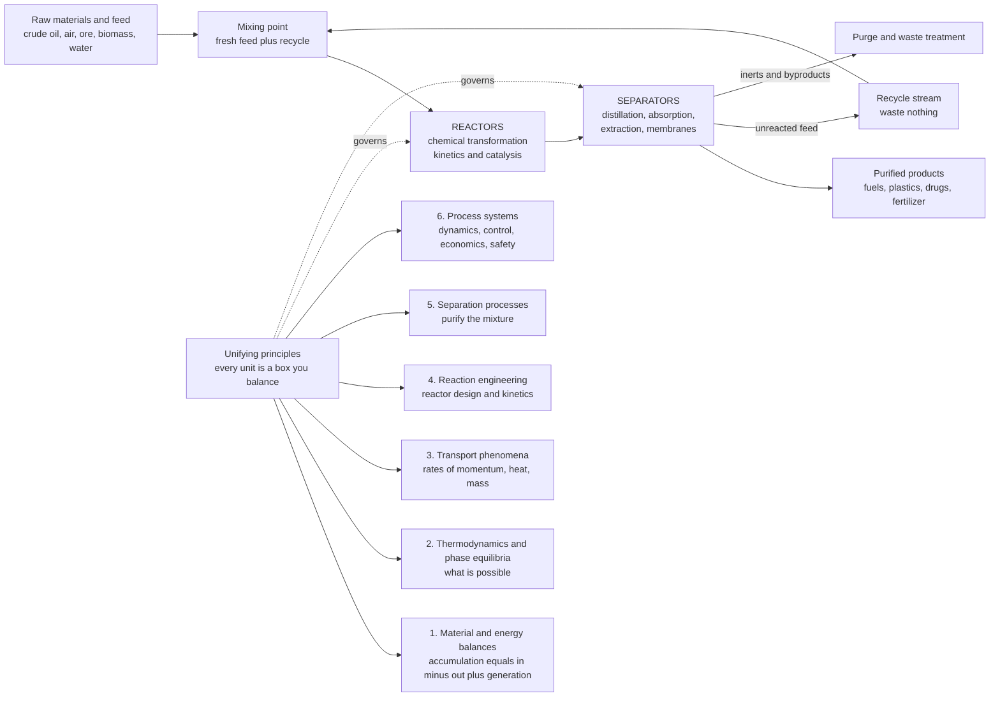

# ⚗️ Chemical Engineering: From Molecules to Megatons

> [!abstract] TL;DR
> **Chemical engineering** is the discipline of taking a chemical, physical, or biological transformation that works in a beaker and making it work **at industrial scale** — safely, economically, and continuously — turning raw materials such as crude oil, air, ore, and biomass into the fuels, plastics, drugs, fertilizers, foods, and clean-energy materials that underpin modern civilization. Its intellectual backbone is a single accounting habit: **draw a boundary around any piece of equipment and balance what crosses it** — *accumulation = in − out + generation* for both **mass** and **energy**. On top of that backbone sit the classic building blocks of the field, the **unit operations** (reaction, distillation, heat exchange, absorption, extraction, filtration, drying) wired together into a **process** — a flowsheet of reactors that transform, separators that purify, and **recycle** loops that stretch every gram of feed. This note is the **hub** of the vault; it maps the whole landscape and the six unifying principles it rests on: (1) **material and energy balances** (the conservation accounting), (2) **thermodynamics and phase equilibria** (what is possible), (3) **transport phenomena** (the rates — momentum, heat, and mass transfer), (4) **reaction engineering** (designing reactors from kinetics and catalysis), (5) **separation processes** (distillation, absorption, extraction, membranes), and (6) **process systems** (dynamics, control, design, economics, safety, and the field's frontier). Chemical engineering is the "make it at scale" discipline — the bridge from chemistry and biology to a football-field factory of pipes, tanks, and columns.

## Intuition

**Analogy:** A chemist, in a test tube, discovers that two substances react to give something useful. Wonderful — but a spoonful is not a business. Chemical engineering is the discipline that stands up next and asks the harder question: *"Now make ten thousand tons of it per year — safely, cheaply, continuously, and without blowing up the plant."* That single change of scale changes **everything**. Heat that vanished harmlessly from a beaker now threatens to run a reactor away; a stir bar becomes a giant impeller in a vessel where the middle never mixes with the edge; a pipette becomes a river of feed that must never stop. Chemical engineering is the engineering of **scale** — the art and science of turning a beaker reaction into a factory of reactors, tanks, columns, and pipes that runs around the clock.

And the way a chemical engineer *thinks* about that factory is the key to the whole field: not as a mysterious tangle, but as **flows and boxes**. Every unit — a reactor here, a distillation column there, a heat exchanger, a pump — is a **box you can account for**. You draw a boundary around it and insist that what goes in must come out or pile up inside: *accumulation = in − out + generation*. Energy is tracked the same way, like money in a ledger. Master that one habit and a bewildering plant of thousands of components becomes a readable network of balanced boxes. Chemical engineering is the bridge from molecules to megatons — and the balance is the plank you walk across on.

---

## How It Works

### Core Mechanics

Chemical engineering is best understood as **one accounting backbone** (material and energy balances) feeding **five capability areas**, all deployed to turn feed into product through a network of reusable **unit operations**.

1. **The mindset — draw a boundary and balance.** Pick any region of a plant — a single reactor, a whole column, or the entire site — and call it a *system*. Conservation says that for any quantity (total mass, an individual species, energy): **accumulation = in − out + generation**. At **steady state**, the workhorse condition of continuous plants, accumulation is zero, so *in + generation = out*. This single equation, applied unit by unit, is how chemical engineers size equipment, close recycle loops, and audit whether a process even can work. It is grounded in the same conservation logic as the [[Conservation_Laws_and_Control_Volumes|control-volume analysis]] of fluid mechanics — the sibling note *Material_and_Mass_Balances* develops it fully.

2. **Principle 1 — Material and energy balances (the accounting backbone).** Species balances track where every atom goes; the energy balance (the first law, from the Physics vault's [[Laws_of_Thermodynamics|laws of thermodynamics]]) tracks every joule of reaction heat, heating, and cooling. Together they turn a flowsheet into a solvable set of equations — the foundation everything else is built on, and the subject of this opening section of the vault.

3. **Principle 2 — Thermodynamics and phase equilibria (what is possible).** Before you design anything, thermodynamics tells you the limits: how much a reaction *can* convert at equilibrium, at what temperature and pressure a mixture splits into vapour and liquid, and how much energy a separation must cost. Vapour-liquid equilibrium (the *y-x* diagram) is what makes distillation possible at all. This scales up the science of the Chemistry vault's [[Chemical_Thermodynamics|chemical thermodynamics]], [[Chemical_Equilibrium|equilibrium]], and [[Phase_Equilibria_and_Colligative_Properties|phase equilibria]] — the sibling *Chemical_Process_Thermodynamics*.

4. **Principle 3 — Transport phenomena (the rates).** Thermodynamics says *whether*; transport says *how fast*. The three transports are deeply analogous: **momentum** transfer (fluid flow and pressure drop, shared with the [[Fluid_Dynamics_Overview|Fluid Dynamics]] vault), **heat** transfer (conduction, convection, radiation — sizing every heat exchanger), and **mass** transfer (diffusion across an interface — the rate that governs every separation). The sibling *Transport_Phenomena_Overview* treats all three under one mathematical roof.

5. **Principle 4 — Reaction engineering (the transformation).** The reactor is the heart of the plant, where feed becomes product. Reaction engineering marries **kinetics** (from the Chemistry vault's [[Chemical_Kinetics|chemical kinetics]]) with reactor *type* — batch, continuous stirred-tank (CSTR), or plug-flow (PFR) — plus **catalysis** and the coupled heat effects that can make an exothermic reactor run away. The sibling *Chemical_Reaction_Engineering_Overview* designs these vessels.

6. **Principle 5 — Separation processes (the purification).** Reactions are almost never complete or clean, so the product must be pulled out of a mixture. **Distillation** (by boiling point), **absorption** and **stripping** (into or out of a gas), **liquid-liquid extraction** (by solubility), **membranes**, adsorption, and crystallization are the great separations. They are typically the largest energy consumers in a plant — the sibling *Separation_Processes_Overview*.

7. **Principle 6 — Process systems (running it as a whole).** A collection of good units is not yet a good plant. **Process dynamics and control** keep temperatures, pressures, and levels on setpoint despite disturbances; **design and economics** decide what is worth building; **process safety** guards against the ways scale amplifies hazard. The sibling *Process_Dynamics_and_Control* opens this systems view, and *The_Reach_and_Future_of_Chemical_Engineering* surveys where the field is heading — batteries, carbon capture, green hydrogen, and biomanufacturing.

8. **The building blocks — unit operations and the flowsheet.** The genius of the field, formalized around 1915, is that a plant making sulfuric acid and a plant making a vaccine share the *same* toolkit of **unit operations**: reusable steps — a heat exchanger, a distillation column, a pump, a filter — each governed by the same physics wherever it appears. Wire them together and you get a **process**: raw materials enter, reactors transform them, separators purify, product leaves, and **recycle** streams return unreacted feed so nothing is wasted. Learn the units once; you can read any flowsheet.

### Flow / Architecture



---

## Key Concepts

### Secondary Level

- **Chemistry finds it; chemical engineering makes it — by the ton.** A reaction that works in a test tube is only the idea. Chemical engineers design the factory that produces it continuously and cheaply. They built the plants behind gasoline, plastics, medicines, and fertilizer.
- **What goes in must come out or pile up.** The one rule under everything: if you feed material into a tank and less comes out, the difference is building up inside. Track it and nothing surprises you. Track energy the same way, like money.
- **A plant is a set of standard building blocks.** Almost every factory is made of the same reusable steps — a reactor to react, a column to separate, a heat exchanger to heat or cool, a pump to move fluid. These are the **unit operations**.
- **Recycle so you waste nothing.** Reactions rarely finish in one pass, so the leftover raw material is separated out and sent back to try again. Recycling turns a mediocre reactor into an efficient plant.

### Undergraduate Level

- **The general balance.** For any species or for energy over a chosen system: $\text{Accumulation} = \text{In} - \text{Out} + \text{Generation}$. At **steady state** accumulation $= 0$, giving $\text{In} + \text{Generation} = \text{Out}$ — the equation you write for every stream, splitter, mixer, reactor, and separator on a flowsheet.
- **Composition bookkeeping.** Streams are described by total flow $\dot{m}$ (or molar flow $\dot{n}$) and **mass or mole fractions** $x_i$ with $\sum_i x_i = 1$; degree-of-freedom analysis checks that the number of independent balance equations matches the unknowns before you try to solve.
- **Conversion, yield, selectivity.** For $A \to B$, single-pass **conversion** $X = (\dot{n}_{A,in}-\dot{n}_{A,out})/\dot{n}_{A,in}$; **yield** and **selectivity** quantify how much desired product you actually get versus side products.
- **The recycle payoff.** With single-pass conversion $x_{sp}$ and a separator that returns a fraction $f_R$ of unreacted feed, the *overall* conversion is $X = x_{sp}/[1 - f_R(1-x_{sp})] \to 1$ as $f_R \to 1$ — the demo below. Recycle is why a 30 % reactor can anchor a 99 %-efficient process.
- **Energy balance with reaction.** $\dot{Q} - \dot{W}_s = \Delta \dot{H}$, where the enthalpy change includes both sensible heating/cooling and the **heat of reaction** $\Delta H_{rxn}$ — the term that sizes cooling systems and hides the runaway hazard.
- **The three transport rates.** Pressure drop from friction (momentum, via the [[Fluid_Dynamics_Overview|Reynolds number]]); heat duty $\dot{Q}=UA\Delta T_{lm}$ across an exchanger; and mass transfer $N_A = k_c(c_A - c_{A}^{*})$ across an interface — the rate laws that turn "possible" into "how big and how fast."
- **Reactor design equations.** Batch ($\int dX / (-r_A)$), CSTR ($V = F_{A0}X/(-r_A)$), and PFR ($V = F_{A0}\int dX/(-r_A)$) — three canonical vessels chosen from the reaction kinetics.

### Graduate Level

- **Coupled transport-reaction.** Real reactors are not lumped boxes: concentration and temperature vary in space, so design solves convection-diffusion-reaction PDEs, often with a **Damköhler number** (reaction rate vs transport rate) and **effectiveness factors** for diffusion into porous catalyst pellets (the Thiele modulus).
- **Nonideal thermodynamics.** Real mixtures deviate from ideality; **activity coefficients** (Wilson, NRTL, UNIQUAC) and cubic **equations of state** (Peng-Robinson, SRK) drive the vapour-liquid and liquid-liquid equilibria that every rigorous distillation and extraction column depends on.
- **Rigorous separations.** Multicomponent distillation solves the MESH equations (Material balances, Equilibrium, Summation, entHalpy) stage by stage; heat integration via **pinch analysis** minimizes utility consumption across the whole plant.
- **Process dynamics and control.** Units are dynamical systems: transfer functions, PID tuning, cascade and feedforward control, and plantwide control structures keep a coupled network stable against disturbances — the systems layer of the field.
- **Flowsheet simulation and optimization.** Steady-state and dynamic simulators (Aspen Plus, gPROMS) solve thousands of coupled balance and equilibrium equations simultaneously; superstructure optimization and **process synthesis** search for the best flowsheet, not just the best unit.
- **Scale-up and safety.** The surface-to-volume ratio falls as size grows, so heat removal, mixing time, and residence-time distribution all change with scale; **process safety** (HAZOP, relief-system design, runaway-reaction analysis) exists because the same amplification that makes production economical also amplifies hazard.

---

## Python Demo

```python
# Two views of the single idea that unifies chemical engineering: the BALANCE.
#
#   (a) A PROCESS FLOWSHEET at steady state -- reactor + separator + RECYCLE --
#       solved by material balance (mass in = mass out). We show how the
#       recycle fraction turns a poor single-pass reactor into a near-complete
#       overall process, and verify that atoms are conserved.
#
#   (b) The UNIFYING CONCEPT itself: accumulation = in - out + generation,
#       watched over time in a well-mixed tank until accumulation -> 0
#       (steady state), the condition every continuous plant runs at.
#
# Requires: numpy, matplotlib
import numpy as np
import matplotlib.pyplot as plt

# =====================================================================
# (a) FLOWSHEET MATERIAL BALANCE:  A -> B in a reactor, with recycle.
#     Fresh feed F is pure A (normalize F = 1).
#     Single-pass conversion x_sp; separator recycles fraction f_R of the
#     unreacted A, purges the rest.  Closing the balance:
#         reactor feed        = F + R
#         A converted / pass  = x_sp * (F + R)          (-> B)
#         unreacted A         = (1 - x_sp) * (F + R)
#         recycle             R = f_R * (1 - x_sp) * (F + R)
#     Solve for R and the overall conversion X = B_out / F:
#         R = F * f_R*(1-x_sp) / (1 - f_R*(1-x_sp))
#         X = x_sp / (1 - f_R*(1-x_sp))
# =====================================================================
F = 1.0                                    # fresh feed of A (normalized)
fR = np.linspace(0.0, 0.98, 300)           # recycle fraction of unreacted A

def solve_loop(x_sp, fR):
    denom = 1.0 - fR * (1.0 - x_sp)
    R    = F * fR * (1.0 - x_sp) / denom   # recycle flow
    feed = F + R                           # reactor throughput
    X    = x_sp / denom                    # OVERALL conversion
    return R, feed, X

print("=== (a) Recycle drives OVERALL conversion toward 100% ===")
for x_sp in (0.20, 0.40, 0.60):
    R90, feed90, X90 = solve_loop(x_sp, 0.90)
    print(f"  single-pass x={x_sp:.2f}: at 90% recycle -> "
          f"overall X={X90*100:5.1f}%, reactor throughput={feed90:4.2f} x feed")

# Verify conservation at one operating point: A_in must equal A_purge + B_out
x_sp, fR0 = 0.40, 0.90
R0, feed0, X0 = solve_loop(x_sp, fR0)
B_out     = x_sp * feed0                         # B leaving in product
A_purge   = (1 - fR0) * (1 - x_sp) * feed0       # unrecycled A leaving
print(f"  balance check @ x_sp={x_sp}, fR={fR0}:  A_in={F:.3f}  vs  "
      f"A_purge + B_out = {A_purge + B_out:.3f}  (closes)")

# =====================================================================
# (b) THE UNIFYING IDEA:  accumulation = in - out + generation
#     Well-mixed tank (CSTR) with first-order reaction A -> products:
#         dC/dt = (q/V)*(C_in - C)  -  k*C
#                 \___in___/ \_out_/   \gen/   (generation < 0: A consumed)
#     Integrate with explicit Euler; watch accumulation collapse to zero.
# =====================================================================
qoV, k, C_in = 0.5, 0.3, 1.0               # 1/residence-time, rate const, inlet conc
dt, T   = 0.01, 20.0
steps   = int(T / dt)
t   = np.zeros(steps); Cs  = np.zeros(steps)
inp = np.zeros(steps); out = np.zeros(steps)
gen = np.zeros(steps); acc = np.zeros(steps)
C = 0.0
for i in range(steps):
    in_term, out_term, gen_term = qoV * C_in, qoV * C, -k * C
    dCdt = in_term - out_term + gen_term            # = accumulation
    t[i], Cs[i] = i * dt, C
    inp[i], out[i], gen[i], acc[i] = in_term, out_term, gen_term, dCdt
    C += dCdt * dt
C_ss = qoV * C_in / (qoV + k)                        # steady state (accumulation -> 0)
print("\n=== (b) accumulation = in - out + generation ===")
print(f"  steady-state C = {C_ss:.3f}  (accumulation -> 0: in = out + consumption)")

# ------------------------------ plotting ------------------------------
fig, ax = plt.subplots(2, 2, figsize=(13, 9))
fig.suptitle("The Balance: The One Idea Beneath All of Chemical Engineering",
             fontsize=15, fontweight="bold")

# A: overall conversion vs recycle fraction, family of single-pass conversions
axA = ax[0, 0]
for x_sp, col in zip((0.2, 0.4, 0.6), ("#d62728", "#ff7f0e", "#2ca02c")):
    _, _, X = solve_loop(x_sp, fR)
    axA.plot(fR * 100, X * 100, lw=2.5, color=col,
             label=f"single-pass = {int(x_sp*100)}%")
axA.axhline(100, ls=":", color="k", lw=1)
axA.set_xlabel("recycle fraction of unreacted feed  [%]")
axA.set_ylabel("OVERALL conversion  [%]")
axA.set_title("A. Recycle turns a poor reactor into a great plant")
axA.legend(loc="lower right", fontsize=8)
axA.grid(alpha=0.3); axA.set_ylim(0, 105)

# B: the price of recycle -- reactor throughput and recycle flow climb
axB = ax[0, 1]
R, feed, X = solve_loop(0.40, fR)
axB.plot(fR * 100, feed, lw=2.5, color="#1f77b4", label="reactor throughput (F+R)/F")
axB.plot(fR * 100, R,    lw=2.5, color="#9467bd", label="recycle flow R/F")
axB.set_xlabel("recycle fraction  [%]")
axB.set_ylabel("flow relative to fresh feed")
axB.set_title("B. The cost: throughput swells as recycle rises\n(single-pass = 40%)")
axB.legend(loc="upper left", fontsize=8); axB.grid(alpha=0.3)

# C: the tank filling to steady state
axC = ax[1, 0]
axC.plot(t, Cs, lw=2.5, color="#1f77b4")
axC.axhline(C_ss, ls="--", color="k", lw=1.2)
axC.text(12, C_ss + 0.02, f"steady state  C = {C_ss:.2f}", fontsize=9)
axC.set_xlabel("time"); axC.set_ylabel("concentration in tank  C(t)")
axC.set_title("C. A tank approaching steady state")
axC.grid(alpha=0.3)

# D: the balance terms -- accumulation collapses to zero
axD = ax[1, 1]
axD.plot(t, inp,  lw=2, color="#2ca02c", label="IN  = (q/V) C_in")
axD.plot(t, out,  lw=2, color="#ff7f0e", label="OUT = (q/V) C")
axD.plot(t, gen,  lw=2, color="#d62728", label="GENERATION = -k C")
axD.plot(t, acc,  lw=2.5, color="#1f77b4", ls="--",
         label="ACCUMULATION = in - out + gen")
axD.axhline(0, color="k", lw=0.8)
axD.set_xlabel("time"); axD.set_ylabel("rate contribution")
axD.set_title("D. accumulation = in - out + generation -> 0")
axD.legend(loc="upper right", fontsize=8); axD.grid(alpha=0.3)

plt.tight_layout(rect=[0, 0, 1, 0.95])
plt.show()
```

Running this prints the recycle table and the conservation check, then draws four panels. Panel **A** is the headline lesson of the field: a reactor that converts only 20–60 % of its feed in a single pass can still anchor a process approaching **100 % overall conversion** once you recycle the leftovers — which is exactly why real plants recycle. Panel **B** shows the price: as the recycle fraction rises, the **reactor throughput** and the **recycle flow** swell, so bigger equipment and more pumping trade off against feed savings. Panels **C** and **D** make the unifying idea concrete: a well-mixed tank fills until the concentration levels off, and at that steady state the **accumulation** term (in − out + generation) collapses to zero — the balance that closes for every unit in every plant, at every scale.

---

## Real-World Applications

> **Example:** The **Haber-Bosch process** for ammonia is chemical engineering distilled into one flowsheet, and arguably the most consequential industrial process ever built — the synthetic nitrogen fertilizer it makes feeds roughly half of humanity. Nitrogen from **air** and hydrogen from **natural gas** are compressed and fed to a catalytic **reactor** where $N_2 + 3H_2 \rightleftharpoons 2NH_3$. But thermodynamics (equilibrium) limits single-pass conversion to only ~15 %, so the reactor outlet is cooled to **condense out** the ammonia (a separation by phase change), and the huge stream of unreacted N₂ and H₂ is **recycled** straight back to the reactor — precisely the recycle loop of the demo, pushing overall conversion toward completion. Every one of the vault's six principles is present: **balances** on N and H, **thermodynamics** setting the equilibrium, **reaction engineering** and **catalysis** in the converter, **heat transfer** to condense the product, **separation** to pull it out, and **process control** to hold the high-pressure loop stable. One process, the whole discipline.

- **Petroleum refining and petrochemicals.** Crude oil is separated by an enormous **distillation** column into fractions, then cracked, reformed, and treated into gasoline, diesel, jet fuel, and the feedstocks for plastics — a continent-spanning network of reactors, separators, and heat integration.
- **Pharmaceuticals and fine chemicals.** Drug manufacture scales delicate multi-step syntheses from bench to reactor, adding crystallization, filtration, and drying, all under strict purity and safety control; increasingly done in continuous flow rather than batch.
- **Fertilizers and agriculture.** Beyond ammonia, the nitric-acid and urea processes turn air and hydrocarbons into the nutrients that sustain global food production.
- **Semiconductors and materials.** Chemical vapour deposition, etching, and ultra-pure gas handling — chemical engineering underlies the fabrication of every microchip.
- **Water and environment.** Municipal and industrial water treatment, desalination by reverse-osmosis **membranes**, and emissions scrubbing are separation and transport problems at civic scale.
- **Energy transition.** Lithium-ion **battery** electrode manufacturing, **carbon capture** by absorption, green **hydrogen** by electrolysis, and biofuels/biomanufacturing are the fast-growing frontier where the field's toolkit is being redeployed for decarbonization.

---

## Common Pitfalls

- **Confusing "it reacts" with "it's a process."** A working lab reaction is the *beginning*, not the answer. Yield, rate, heat removal, separation, recycle, safety, and cost all have to be engineered before a beaker becomes a plant. Beginners underestimate how much of chemical engineering happens *after* the chemistry is settled.
- **Forgetting to define the system boundary.** Every balance is meaningless until you draw the box. Choosing a poor boundary — cutting through a recycle loop, or lumping units that should be separate — produces equations that are unsolvable or, worse, subtly wrong. Always state the system, then list what crosses it.
- **Dropping the generation term.** Total mass is always conserved (no generation), but an *individual species* can be created or destroyed by reaction. Writing a component balance as "in = out" inside a reactor omits the generation term and gives nonsense. Mass is conserved; moles of a species are not.
- **Mixing up single-pass and overall conversion.** These differ enormously in any recycle process (15 % vs ~98 % in Haber-Bosch). Quoting the wrong one over- or under-sizes every downstream unit. Know which basis you are on.
- **Assuming scale is just "bigger."** Doubling a reactor's linear size multiplies its volume (and heat generation) by eight but its surface area (and heat *removal*) by only four. Mixing slows, hot spots appear, and residence-time distributions widen. Many pilot successes die at full scale precisely because the surface-to-volume ratio betrayed them — scale-up is its own science.
- **Ignoring the energy balance.** Material balances tell you *what*; energy balances tell you whether you can *afford* it and whether it is *safe*. An exothermic reaction whose heat is not removed fast enough will run away — the mechanism behind real industrial disasters. Track joules as carefully as you track kilograms.
- **Treating equilibrium as a rate.** Thermodynamics says how far a reaction or separation *can* go; kinetics and transport say how *fast*. A process can be thermodynamically favorable yet uselessly slow, or fast yet limited to low conversion — you need both analyses, never just one.

---

## Related Concepts

**The vault's six principles (siblings in this vault)** — this hub opens threads developed in *Material_and_Mass_Balances* (the accounting backbone), *Chemical_Process_Thermodynamics* (what is possible), *Transport_Phenomena_Overview* (momentum, heat, and mass rates), *Chemical_Reaction_Engineering_Overview* (reactor design), *Separation_Processes_Overview* (distillation, absorption, extraction, membranes), and *Process_Dynamics_and_Control* with *The_Reach_and_Future_of_Chemical_Engineering* (running the plant and the field's frontier).

**The science being scaled up (Chemistry vault)**
- [[Stoichiometry_and_the_Mole]] — the mole accounting that every material balance is built on
- [[Chemical_Thermodynamics]] — enthalpy, entropy, and free energy, scaled into process energy balances
- [[Chemical_Equilibrium]] — the equilibrium limits that cap single-pass conversion and drive recycle
- [[Chemical_Kinetics]] — the rate laws that reaction engineering turns into reactor sizes
- [[Phase_Equilibria_and_Colligative_Properties]] — the vapour-liquid equilibrium that makes distillation possible

**Shared engineering foundations (sister vaults)**
- [[Laws_of_Thermodynamics]] — the first and second laws underneath every energy balance and separation cost
- [[Engineering_Thermodynamics]] — power and refrigeration cycles, the mechanical-engineering face of process thermodynamics
- [[Conservation_Laws_and_Control_Volumes]] — the same accumulation-equals-in-minus-out logic, from fluid mechanics
- [[Fluid_Dynamics_Overview]] — the physics of flow behind pressure drop, pumping, and momentum transport
- [[Engineering_Fluid_Mechanics]] — pumps, pipes, and compressors that move every process stream
- [[Conduction_Heat_Transfer]] — the heat-transfer rate laws that size every exchanger and reactor jacket
- [[Heat_Exchangers_and_HVAC]] — the equipment that performs the heat duty computed in an energy balance

---

## Review Questions

**Secondary**
1. A chemist shows that mixing two liquids in a flask produces a valuable new compound. List three completely different problems a chemical engineer must solve to turn that flask reaction into a factory making thousands of tons per year. Why is chemical engineering sometimes called the discipline of "scale"?

**Undergraduate**
2. A reactor converts only 40 % of its feed A to product B in a single pass. Using the balance *accumulation = in − out + generation* at steady state, explain qualitatively why adding a separator-and-recycle loop can push the *overall* conversion above 95 %, even though the reactor itself never improves. What does the plant pay (in equipment and energy) for that gain, and why does the reactor throughput rise as more is recycled?

**Graduate**
3. A process that works beautifully in a 5-litre pilot reactor overheats and produces off-spec product when scaled to a 50,000-litre industrial vessel. Using the ideas of surface-to-volume ratio, heat generation versus heat removal, mixing time, and residence-time distribution, explain three distinct mechanisms by which scale-up can fail. Then describe how a coupled **material and energy balance** plus a process-safety analysis would let you anticipate the runaway before building the large reactor.

---

## Sources

- R. M. Felder, R. W. Rousseau & L. G. Bullard — *Elementary Principles of Chemical Processes*, 4th ed. (Wiley, 2015)
- D. M. Himmelblau & J. B. Riggs — *Basic Principles and Calculations in Chemical Engineering*, 8th ed. (Prentice Hall, 2012)
- W. L. McCabe, J. C. Smith & P. Harriott — *Unit Operations of Chemical Engineering*, 7th ed. (McGraw-Hill, 2005)
- Don W. Green & Marylee Z. Southard (eds.) — *Perry's Chemical Engineers' Handbook*, 9th ed. (McGraw-Hill, 2018)
- R. B. Bird, W. E. Stewart & E. N. Lightfoot — *Transport Phenomena*, 2nd ed. (Wiley, 2007)

---

#chemical-engineering #process-engineering #material-balances #unit-operations #scale-up
