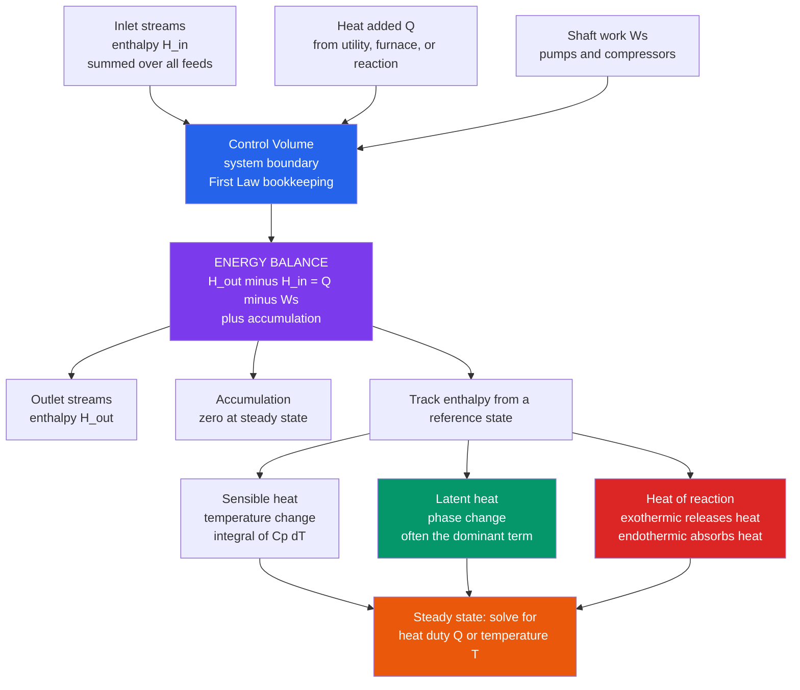

# 🔥 Energy Balances in Processes

> [!abstract] TL;DR
> An **energy balance** is the **first law of thermodynamics applied to a process unit** — the exact partner to a material balance. Where material balances count atoms, energy balances count joules: *energy in equals energy out plus accumulation*. For an **open (flow) system at steady state** with negligible kinetic and potential energy, it collapses to $\sum H_{out} - \sum H_{in} = Q - W_s$ — the change in stream **enthalpy** equals the **heat added** minus the **shaft work**. The trick is that energy wears disguises: it hides in temperature (**sensible heat**, $C_p\,dT$), in phase change (**latent heat** — enormous, often the biggest term), and in chemical bonds (**heat of reaction** — exothermic releases, endothermic devours). A chemical engineer builds hypothetical paths through these terms to compute $Q$ or an unknown temperature $T$, because energy is money (steam, cooling water, and fuel all cost) and because **unmanaged reaction heat is how reactors run away and explode**.

## Intuition

**Analogy:** If material balances track atoms like money moving through a company's accounts, **energy balances track heat and work the same way** — every joule entering a unit must leave it or pile up inside: *in = out + accumulation*. But energy is a far sneakier accountant than cash. Money sits still and is easy to count; energy keeps changing costume. It hides in **temperature** (a hot stream carries "sensible" energy), it hides in **phase** (the same water at 100 °C holds vastly more energy as steam than as liquid — that is "latent" heat), and it hides in **chemical bonds** (a reaction can pour out heat or silently swallow it). To close the books, the engineer must follow energy through every disguise — heating a feed, boiling it in a reboiler, the fire of combustion, the chill of an endothermic reaction.

Two things make this bookkeeping non-negotiable. First, **energy is money**: the steam that heats a column, the cooling water that condenses its overhead, and the fuel that fires a furnace are the largest operating costs in most plants. Second, it is **safety-critical**: the heat released by an exothermic reaction, if not removed fast enough, raises the temperature, which speeds the reaction (via the Arrhenius law in [[Chemical_Kinetics]]), which releases still more heat — a self-amplifying loop called **thermal runaway** that is a leading cause of industrial explosions. The energy balance is the ledger that catches this before it happens.

---

## How It Works

### Core Mechanics

1. **Draw a boundary and write the general balance.** Around any unit — a heater, a reboiler, a reactor — draw a **control volume**. The universal statement is $\text{Accumulation} = \text{In} - \text{Out} + \text{Generation}$, but energy is conserved (the first law), so there is no true generation; chemical "generation" of heat is bookkept *inside* the enthalpy terms via the heat of reaction. For a flow system: rate of energy in with streams, plus heat $\dot Q$ added, minus shaft work $\dot W_s$ done by the system, equals rate of energy out plus accumulation.

2. **Simplify for steady-state flow.** At **steady state** accumulation is zero. Dropping kinetic and potential energy (almost always negligible for process streams — a valid assumption unless you have high-velocity nozzles or large elevation changes), the balance becomes the workhorse equation:
$$\sum_{out} \dot n_i H_i - \sum_{in} \dot n_i H_i = \dot Q - \dot W_s$$
**Enthalpy** $H = U + PV$ is the correct working variable for flow systems because it automatically bundles the internal energy $U$ with the **flow work** $PV$ needed to push each stream across the boundary. In most process units there is no shaft work ($\dot W_s = 0$), so $\dot Q = \Delta \dot H$ — the heat duty *is* the enthalpy change.

3. **Choose reference states.** Enthalpy has no absolute value — only *changes* are physical. Pick a **reference state** (a temperature, pressure, and phase, e.g. liquid water at 25 °C, 1 atm) at which $H \equiv 0$, and compute every stream's enthalpy *relative* to it. As long as every stream uses the same reference, the references cancel in the balance.

4. **Build a hypothetical path and sum the pieces.** Because enthalpy is a **state function** (path-independent), you may compute $\Delta H$ along any convenient imaginary route from reference to actual state, adding up:
   - **Sensible heat** — energy of a temperature change at constant phase: $\Delta H = \int_{T_1}^{T_2} C_p\,dT$ (often just $C_p\,\Delta T$).
   - **Latent heat** — energy of a phase change at constant temperature: $\Delta H_{vap}$ to boil, $\Delta H_{fus}$ to melt. This term is *huge* — boiling water costs about seven times more than heating it from freezing to boiling.
   - **Heat of mixing** — energy released or absorbed when species dissolve or combine (large for acids in water, negligible for ideal mixtures).
   - **Heat of reaction** — the enthalpy change of the chemical change itself, $\Delta H_{rxn}$, computed from **heats of formation** or **combustion** and combined by **Hess's law** (see [[Chemical_Thermodynamics]]). Exothermic reactions have $\Delta H_{rxn} < 0$ (release heat); endothermic have $\Delta H_{rxn} > 0$ (absorb heat).

5. **Solve for the unknown.** With the path assembled, the balance has one unknown — typically the **heat duty** $\dot Q$ (to size a heater, cooler, reboiler, or condenser) or an **outlet temperature** $T$ (e.g. the adiabatic flame or reaction temperature when $\dot Q = 0$). When physical properties depend on temperature or composition, the material and energy balances become **coupled** and are solved simultaneously.

### Flow / Architecture



---

## Key Concepts

### Secondary Level

**Energy is conserved; you just have to find where it went.** The first law says energy is neither created nor destroyed. In a process it can only be *carried in and out by streams* or *transferred as heat and work* across the boundary. If a stream leaves hotter, colder, or in a different phase than it entered, energy moved — and the balance tells you exactly how much heat $Q$ that took.

**Sensible vs. latent heat — the two ways to store thermal energy.** Raising a substance's *temperature* stores **sensible heat** ($Q = m\,C_p\,\Delta T$); you can sense it with a thermometer. Changing its *phase* at constant temperature stores **latent heat** (the thermometer does not move while ice melts or water boils). Latent heat is dramatically larger: melting ice needs about 334 kJ/kg and boiling water about 2257 kJ/kg, versus only 4.18 kJ/kg per degree to warm liquid water. This is why **most of a heater's energy usually goes into boiling, not warming**.

**Heat capacity $C_p$.** The energy to raise one unit of mass (or mole) by one degree, at constant pressure. Water's exceptionally high $C_p$ (4.18 kJ/kg·K) is why it is the universal coolant and heating fluid.

### Undergraduate Level

**The open-system energy balance.** For a control volume with streams flowing through it at steady state, neglecting kinetic and potential energy:
$$\dot Q - \dot W_s = \sum_{out}\dot n_i H_i - \sum_{in}\dot n_i H_i = \Delta \dot H$$
Enthalpy $H = U + PV$ is used (not internal energy $U$) precisely because flowing streams do **flow work** $PV$ crossing the boundary, and enthalpy folds that in automatically. Most reactors, heaters, coolers, and heat exchangers have $\dot W_s = 0$, giving the everyday form $\dot Q = \Delta \dot H$.

**Reference states and hypothetical paths.** Because $H$ is a state function, compute $\Delta H$ along a convenient fabricated route. A classic three-leg path to send liquid feed at $T_1$ to superheated vapor product at $T_2$: (1) sensible-heat the liquid to its boiling point, (2) vaporize it at constant $T$ (latent heat), (3) sensible-heat the vapor to $T_2$. Sum the legs. The same trick handles reactions: bring reactants to the reference $T$, react at reference $T$ (add $\Delta H_{rxn}$), then bring products to their outlet $T$ — the **"heat of reaction method."**

**Standard heat of reaction and Hess's law.** $\Delta H_{rxn}^\circ = \sum \nu_i \Delta H_{f,i}^\circ$ (products minus reactants, weighted by stoichiometric coefficients $\nu_i$ from the balanced equation — see [[Stoichiometry_and_the_Mole]]). **Hess's law** lets you add reaction enthalpies like vectors, and heats of formation or combustion are the tabulated building blocks. The *sign convention*: $\Delta H_{rxn} < 0$ is **exothermic** (heat out), $> 0$ is **endothermic** (heat in).

**Adiabatic flame and reaction temperature.** Set $\dot Q = 0$ (perfectly insulated). Now all reaction heat has nowhere to go but into the product mixture's temperature. The **adiabatic temperature** is found from $\Delta H = 0$: reaction enthalpy plus sensible-heat rise of products equals zero. For combustion this is the **adiabatic flame temperature**; for a reactor it is the ceiling temperature the mixture reaches with no cooling — the number that decides whether materials survive.

### Graduate Level

**Coupled material–energy balances.** When $C_p$, phase split, or equilibrium conversion depends on temperature and composition, the mass and energy balances are **simultaneous nonlinear equations** solved together (e.g. an adiabatic flash, or a reactor where conversion sets the heat release which sets the temperature which sets the rate). Process simulators (Aspen Plus, HYSYS) solve these by Newton or sequential-modular methods over rigorous property models.

**Reactor energy balance and thermal stability.** A cooled CSTR balances heat *generated* by reaction, $\dot Q_{gen} = (-\Delta H_{rxn})\,r\,V$, against heat *removed* by the jacket, $\dot Q_{rem} = UA(T - T_c)$. Generation rises **exponentially** with $T$ (Arrhenius), removal only **linearly**. Where the exponential outruns the line, no stable operating point exists and the reactor undergoes **thermal runaway** — the Semenov / van Heerden analysis of these intersecting curves is the mathematical heart of reactor safety.

**Enthalpy from equations of state.** Beyond ideal gases and constant $C_p$, rigorous $H(T,P)$ comes from **departure functions**: $H = H^{ig}(T) + (H - H^{ig})$, where the residual enthalpy is computed from a cubic equation of state (Peng–Robinson, SRK) via $\left(\frac{\partial H}{\partial P}\right)_T = V - T\left(\frac{\partial V}{\partial T}\right)_P$. This is where energy balances meet full process thermodynamics.

**Energy integration and pinch analysis (preview).** Rather than heat and cool each stream with utilities, **heat-exchanger networks** recover energy by matching hot streams that need cooling against cold streams that need heating. **Pinch analysis** finds, from composite enthalpy–temperature curves, the thermodynamic minimum hot- and cold-utility demand and the "pinch" temperature that no feasible design can cross — turning energy balances into plant-wide efficiency targets.

---

## Python Demo

```python
# Energy accounting for two canonical process problems:
#   (a) HEAT DUTY / heating curve: how much heat to take 1 kg of water
#       through liquid heating -> boiling -> steam superheat, showing that
#       LATENT heat (phase change) dwarfs the sensible-heat legs.
#   (b) ADIABATIC REACTION: how far an exothermic reactor's temperature
#       climbs with conversion when there is no cooling, and how INERT
#       DILUTION tames that rise -- the essence of reaction-heat management.
import numpy as np
import matplotlib.pyplot as plt

# =====================================================================
# PART (a): HEATING CURVE / HEAT DUTY of a 1 kg water stream, 25 -> 200 C
# Energy hides in sensible heat (Cp*dT) and latent heat (phase change).
# =====================================================================
m       = 1.0        # kg processed
Cp_liq  = 4.18       # kJ/(kg.K)  liquid water
Cp_vap  = 2.01       # kJ/(kg.K)  steam (superheated vapor)
Lv      = 2257.0     # kJ/kg      latent heat of vaporization at 100 C
T_in, T_boil, T_out = 25.0, 100.0, 200.0   # deg C

# Stage 1: sensible heating of liquid, 25 -> 100 C
T1 = np.linspace(T_in, T_boil, 100)
Q1 = m * Cp_liq * (T1 - T_in)                       # kJ

# Stage 2: latent heat, ISOTHERMAL at 100 C (temperature stays flat)
Q2 = Q1[-1] + np.linspace(0.0, m * Lv, 100)         # kJ
T2 = np.full_like(Q2, T_boil)

# Stage 3: sensible heating (superheat) of vapor, 100 -> 200 C
T3 = np.linspace(T_boil, T_out, 100)
Q3 = Q2[-1] + m * Cp_vap * (T3 - T_boil)            # kJ

Q_curve = np.concatenate([Q1, Q2, Q3])
T_curve = np.concatenate([T1, T2, T3])

# Segment totals
q_sens_liq = m * Cp_liq * (T_boil - T_in)
q_latent   = m * Lv
q_sens_vap = m * Cp_vap * (T_out - T_boil)
q_total    = q_sens_liq + q_latent + q_sens_vap

print("Heat duty to take 1 kg of water from 25 C to 200 C superheated steam")
print(f"  Sensible (liquid 25->100) : {q_sens_liq:7.1f} kJ  ({100*q_sens_liq/q_total:4.1f} percent)")
print(f"  Latent   (boil at 100)    : {q_latent:7.1f} kJ  ({100*q_latent/q_total:4.1f} percent)")
print(f"  Sensible (vapor 100->200) : {q_sens_vap:7.1f} kJ  ({100*q_sens_vap/q_total:4.1f} percent)")
print(f"  TOTAL heat duty           : {q_total:7.1f} kJ")

# =====================================================================
# PART (b): ADIABATIC REACTION TEMPERATURE vs CONVERSION
# Exothermic A -> B. With no cooling, released enthalpy has nowhere to
# go but heat the mixture. Energy balance (heat-of-reaction method):
#     T = T0 + (-dH_rxn) * X / (Cp_A + theta_I * Cp_I)
# theta_I = moles inert fed per mole A fed. More inert = smaller rise.
# =====================================================================
dH_rxn = -80.0       # kJ/mol A   (negative => exothermic, releases heat)
T0     = 350.0       # K feed temperature
Cp_A   = 100e-3      # kJ/(mol.K) reacting species (product ~ reactant)
Cp_I   = 40e-3       # kJ/(mol.K) inert diluent

X = np.linspace(0.0, 1.0, 100)                 # fractional conversion
theta_list = [0, 2, 5, 10]                     # inert-to-A feed ratios

# =====================================================================
# PLOTS
# =====================================================================
fig, (ax1, ax2) = plt.subplots(1, 2, figsize=(13, 5))

# --- (a) heating curve ---
ax1.plot(Q_curve, T_curve, color="#2563eb", lw=2.5)
ax1.axvspan(0, Q1[-1], color="#93c5fd", alpha=0.35, label="sensible: liquid")
ax1.axvspan(Q1[-1], Q2[-1], color="#059669", alpha=0.30, label="latent: boiling")
ax1.axvspan(Q2[-1], Q3[-1], color="#f59e0b", alpha=0.30, label="sensible: vapor")
ax1.annotate(f"latent heat\n{100*q_latent/q_total:.0f} percent of duty",
             xy=(0.5*(Q1[-1]+Q2[-1]), T_boil), xytext=(0.5*(Q1[-1]+Q2[-1]), 150),
             ha="center", fontsize=9,
             arrowprops=dict(arrowstyle="->", color="#059669"))
ax1.set_xlabel("Cumulative heat added  Q  (kJ per kg)")
ax1.set_ylabel("Temperature  (deg C)")
ax1.set_title("(a) Heating curve: latent heat dominates the duty")
ax1.legend(loc="lower right", fontsize=8)
ax1.grid(alpha=0.3)

# --- (b) adiabatic temperature rise vs conversion ---
colors = ["#dc2626", "#ea580c", "#7c3aed", "#2563eb"]
for theta_I, c in zip(theta_list, colors):
    Cp_mix = Cp_A + theta_I * Cp_I             # kJ/(mol A).K
    T_ad = T0 + (-dH_rxn) * X / Cp_mix         # K
    ax2.plot(X, T_ad, color=c, lw=2.2,
             label=f"inert ratio = {theta_I}  (Tmax rise {(-dH_rxn)/Cp_mix:.0f} K)")
ax2.axhline(T0, color="gray", ls="--", lw=1, label=f"feed T0 = {T0:.0f} K")
ax2.set_xlabel("Fractional conversion  X")
ax2.set_ylabel("Adiabatic temperature  T  (K)")
ax2.set_title("(b) Exothermic reactor: no cooling -> runaway risk\ninert dilution tames the rise")
ax2.legend(loc="upper left", fontsize=8)
ax2.grid(alpha=0.3)

plt.tight_layout()
plt.savefig("energy_balances_demo.png", dpi=120)
plt.show()
```

Running this prints the duty breakdown — for 1 kg of water the **latent heat of boiling is roughly 81 percent** of the total, despite being only one of three stages — and produces two panels. Panel (a) is the classic **heating curve**: two sloped sensible-heat legs bracketing a **flat isothermal plateau** where all the energy goes into the phase change. Panel (b) shows the **adiabatic temperature climbing linearly with conversion**; with no inert the mixture would rise 800 K (screaming toward runaway), while adding 10 moles of inert per mole of reactant cuts the rise to 160 K — a visual of why engineers dilute, stage, or actively cool exothermic reactors.

---

## Real-World Applications

- **Distillation column reboilers and condensers.** The energy balance sizes the **reboiler duty** (heat added to boil up vapor) and **condenser duty** (heat removed to condense overhead). Because both are dominated by *latent* heat, distillation is one of the most energy-intensive operations in the chemical industry — roughly 40 percent of a refinery's energy. Small duty errors mean grossly mis-sized exchangers and utility bills.
- **Fired heaters and furnaces.** A crude furnace's fuel firing rate comes straight from the energy balance: sensible heat to warm the feed plus latent heat to vaporize it equals the heat the burners must supply, adjusted for stack losses. This sets fuel cost and CO₂ emissions.
- **Exothermic reactor cooling — safety-critical.** Ammonia synthesis, ethylene oxidation, nitration, and polymerizations release large $-\Delta H_{rxn}$. The energy balance sets the **cooling duty** and the coolant temperature needed to keep the reactor on a stable branch. The 1976 Seveso and many batch-reactor incidents trace to heat generation outrunning heat removal — the runaway condition the reactor energy balance is written to prevent (see the process-safety and hazard-analysis note).
- **Steam and utility systems.** Every plant's steam header, cooling-water loop, and refrigeration package is sized by summing the energy balances of all units it serves. Steam, cooling water, and refrigeration are the dominant *variable* operating costs, so energy balances feed directly into economics.
- **Heat integration / pinch analysis.** By coupling many unit energy balances, engineers design heat-exchanger networks that recover waste heat between streams, cutting utility demand by 20 to 40 percent — the single largest lever for plant energy efficiency and decarbonization.

---

## Common Pitfalls

- **Forgetting latent heat (or double-counting it).** The most common student error is heating a stream "sensibly" straight through its boiling point without adding the vaporization enthalpy — the latent term is usually the *biggest* number in the balance. Conversely, adding sensible heat across a phase boundary using the wrong-phase $C_p$ mis-sizes the whole duty.
- **Inconsistent reference states.** Enthalpies are meaningless in absolute terms; if inlet and outlet streams (or the heat-of-reaction data) use different reference temperatures, pressures, or phases, the references fail to cancel and the balance is silently wrong. Fix one reference and use it everywhere.
- **Sign-convention confusion on $Q$ and $W$.** Chemistry, physics, and engineering texts differ on whether work is done *by* or *on* the system (compare [[Chemical_Thermodynamics]] and [[Laws_of_Thermodynamics]]). A flipped sign turns a cooler into a heater. State your convention explicitly and check that exothermic reactions *release* heat.
- **Assuming $C_p$ is constant over a large temperature span.** Heat capacities vary with $T$ (and with composition). Using a room-temperature $C_p$ for a furnace at 800 °C can be 20 to 40 percent off; integrate $C_p(T)$ or use a mean value over the actual range.
- **Ignoring the material–energy coupling.** Treating the material balance as "solved first, energy second" fails when conversion, phase split, or properties depend on temperature. Adiabatic reactors, flash drums, and equilibrium-limited reactions require the two balances solved **simultaneously**.
- **Neglecting the heat of mixing for non-ideal solutions.** Diluting concentrated sulfuric acid or absorbing HCl releases substantial heat; omitting the heat of mixing underpredicts cooling needs and has caused boil-over accidents.

---

## Related Concepts

- [[Chemical_Thermodynamics]] — supplies the state-function machinery, Hess's law, and heats of formation that make enthalpy tracking and heats of reaction computable.
- [[Engineering_Thermodynamics]] — the mechanical-engineering companion; develops the same open-system (control-volume) first law for turbines, compressors, and cycles.
- [[Laws_of_Thermodynamics]] — the physics foundation: the first law (energy conservation) that the process energy balance *is*, plus the sign conventions for $Q$ and $W$.
- [[Entropy_and_Second_Law]] — the second law that limits how much of the tracked energy can become useful work and underlies pinch/exergy analysis.
- [[Chemical_Kinetics]] — supplies the Arrhenius rate whose exponential temperature dependence, fed by reaction heat, produces thermal runaway in the reactor energy balance.
- [[Stoichiometry_and_the_Mole]] — the balanced-equation coefficients used to combine heats of formation into a heat of reaction.

Within this section, energy balances build directly on **Material and Mass Balances** (their conservation-law twin), feed into **Chemical Process Thermodynamics** (rigorous enthalpy from equations of state), open the **Chemical Engineering Overview**'s accounting framework, hand results to **Heat Transfer in Process Equipment** (which sizes the exchangers whose duties they compute), and are the analytical core of **Process Safety and Hazard Analysis** (runaway prevention).

---

## Review Questions

1. **(Secondary)** A pot of water is heated steadily on a stove. Sketch the temperature versus time and explain why there is a flat plateau even though the burner keeps adding energy. Which is larger for water: the energy to warm it from 20 °C to 100 °C, or the energy to boil it away at 100 °C?
2. **(Undergraduate)** Liquid methanol at 25 °C is fed to a vaporizer and leaves as superheated vapor at 120 °C. Describe the three-leg hypothetical path you would construct to compute the heater duty, name the property (sensible or latent) associated with each leg, and state why enthalpy — not internal energy — is the right variable for this flow unit.
3. **(Undergraduate/Graduate)** An exothermic reaction runs adiabatically. Given the standard heat of reaction, the feed temperature, the conversion, and the mixture heat capacity, write the energy balance that yields the outlet temperature. What single feed-side change would you make to *halve* the adiabatic temperature rise, and why?
4. **(Graduate)** In a cooled CSTR, heat generation grows exponentially with temperature while heat removal grows linearly. Explain, using the intersection of these two curves, how a small rise in coolant temperature can eliminate the stable operating point and trigger thermal runaway. What does this imply for how tightly the reactor energy balance must be controlled?

---

## Sources

- Felder, R. M., Rousseau, R. W., & Bullard, L. G. — *Elementary Principles of Chemical Processes* (4th ed.), Wiley. Chapters 7–9 on energy balances, non-reactive and reactive.
- Himmelblau, D. M., & Riggs, J. B. — *Basic Principles and Calculations in Chemical Engineering* (8th ed.), Prentice Hall. Energy balance chapters and the heat-of-reaction method.
- Smith, J. M., Van Ness, H. C., & Abbott, M. M. — *Introduction to Chemical Engineering Thermodynamics* (7th ed.), McGraw-Hill. First law for open systems, enthalpy, and property evaluation.
- Reklaitis, G. V. — *Introduction to Material and Energy Balances*, Wiley. Combined material and energy balance formulation and solution.

---

#chemical-engineering #energy-balance #enthalpy #heat-of-reaction #first-law
