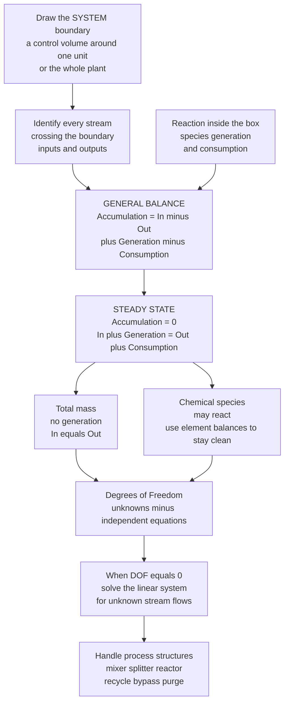

# ⚖️ Material and Mass Balances

> [!abstract] TL;DR
> A **material balance** is cosmic bookkeeping: atoms are neither created nor destroyed, so for any tank, reactor, or whole factory, **what flows in must either flow out or pile up inside**. Draw an imaginary box around any piece of a process, tally every stream crossing the boundary, and the books *must* close. The single iron law is **Accumulation = In − Out + Generation − Consumption**; at **steady state** accumulation is zero, so *in + generation = out + consumption*. Total mass is never generated (it is conserved), but a chemical *species* can be produced or consumed by reaction — atoms are still conserved, so element balances always close. This one law lets an engineer compute flows they never measured from the ones they did, and it is the **first thing done** when analyzing or designing any process — the skeleton every downstream calculation (energy, sizing, cost, emissions) hangs on.

---

## Intuition

**Analogy:** A material balance is exactly like tracking money in a bank account. **Deposits minus withdrawals equals the change in your balance.** Nothing else can move the balance — money does not appear from nowhere or vanish. Now swap dollars for kilograms of matter: draw a boundary around any piece of a process (a mixing tank, a reactor, the entire plant), treat every inlet stream as a deposit and every outlet as a withdrawal, and whatever is left over *must* be piling up (or draining) inside. The books cannot lie.

The technical version keeps the same accounting but adds one twist for chemistry: unlike money, a *chemical species* can be "minted" or "spent" by a reaction (its atoms merely rearrange into new molecules). So the ledger grows two extra columns — **generation** and **consumption** — while *total mass* and *individual atoms* keep the clean deposits-minus-withdrawals form. Pick a smart boundary so the messy unknowns stay inside and only measurable streams cross it, and arithmetic on the boundary hands you an exact flow you never measured.

---

## How It Works

### Core Mechanics

**1. Choose the system (the control volume).** Draw a boundary — a dashed box — around whatever you want to analyze: one unit, several units, or the whole plant. Everything crossing that box is a *stream*; everything inside is the *system*. The choice of box is the single most powerful decision in the whole method.

**2. Write the general balance for a conserved quantity.** For the chosen system and any conserved quantity $Q$ (total mass, a chemical species, or an atomic element), over a time interval:

$$\underbrace{\text{Accumulation}}_{\text{change stored inside}} = \underbrace{\text{In}}_{\text{enters}} - \underbrace{\text{Out}}_{\text{leaves}} + \underbrace{\text{Generation}}_{\text{made by reaction}} - \underbrace{\text{Consumption}}_{\text{eaten by reaction}}$$

**3. Kill the terms that vanish.** Two simplifications do most of the work:

- **Steady state** ⇒ nothing accumulates: *Accumulation = 0*, so **In + Generation = Out + Consumption**. Continuous plants run this way for the vast majority of their life.
- **Conserved species** ⇒ no reaction terms. **Total mass** has no generation or consumption (mass is conserved), so *In = Out* at steady state. An **atomic element** (C, H, O, …) is likewise never created — so **element balances always drop the reaction terms**, even when molecules react. This is why element balances are the reliable fallback for reacting systems.

**4. A chemical species is the only thing that reacts.** Moles of a molecular species *can* be generated or consumed. If you insist on a species balance for a reactor, you must supply the generation/consumption from the reaction stoichiometry via the **extent of reaction** $\xi$: for species $i$, generation-minus-consumption $= \nu_i\,\xi$, where $\nu_i$ is the (signed) stoichiometric coefficient. Or sidestep it entirely by balancing atoms.

**5. Pick a basis.** Every balance needs an anchor: "100 kg/h of feed" or "1 batch." All flows scale linearly with the basis, so choose the one that makes the arithmetic cleanest (usually a round number tied to the stream you know most about).

**6. Count degrees of freedom (DOF), then solve.** The problem is solvable exactly when

$$\text{DOF} = (\text{number of unknowns}) - (\text{number of independent balance equations} + \text{given relations}) = 0$$

DOF $> 0$ means missing information; DOF $< 0$ means over-specified (redundant or contradictory data — useful for *checking* measurements). With DOF $= 0$ the balances form a **system of linear equations**; solve it with linear algebra for the unknown flows and compositions.

**7. Overall vs. unit balances, and tie components.** For a multi-unit flowsheet you can balance each unit *or* draw one box around everything (the **overall balance**, in which internal recycle streams cancel). A **tie component** — a species that passes through untouched (an inert, or an element that enters in only one stream) — often pins down a flow in a single step without solving the full system.

**8. The three configurations that define chemical engineering.**

- **Recycle** — send unconverted reactant back to the reactor inlet. It *boosts overall conversion* far above the single-pass value and recovers valuable material, at the cost of a larger reactor throughput and separation duty.
- **Bypass** — route part of a stream *around* a unit and remix downstream, used to trim a product to a target spec.
- **Purge** — bleed off a small stream from a recycle loop to **prevent the buildup of inerts or impurities** that would otherwise accumulate without bound (mass balance guarantees anything with no other exit *must* accumulate).

### Flow / Architecture



---

## Key Concepts

### Secondary Level

- **Nothing disappears.** Mass in equals mass out plus what builds up inside. Draw a box, add up the streams, and the leftover is accumulation — exactly like deposits minus withdrawals in a bank account.
- **Steady state.** When a process runs at a constant condition, nothing piles up inside: total mass **in = out**. If 100 kg/h enters a tank and 90 kg/h leaves, the tank is filling at 10 kg/h — it is *not* at steady state.
- **A splitter keeps composition; a mixer averages it.** Splitting one stream into two does not change what the material *is*, only how much goes each way. Mixing two streams blends their compositions by mass.
- **Reactions rearrange, they do not destroy.** In $\text{CH}_4 + 2\,\text{O}_2 \rightarrow \text{CO}_2 + 2\,\text{H}_2\text{O}$ the methane molecule is *consumed*, but every carbon, hydrogen, and oxygen atom is still there in the products.

### Undergraduate Level

- **The general balance and its two switches.** $\text{Acc} = \text{In} - \text{Out} + \text{Gen} - \text{Cons}$. Switch off Acc for steady state; switch off Gen and Cons for a non-reactive species or *any* atomic element.
- **Extent of reaction.** For a single reaction, every species flow change is tied to one number $\xi$: $\dot n_{i,\text{out}} = \dot n_{i,\text{in}} + \nu_i\,\xi$. Balancing atoms avoids $\xi$ entirely — a lifesaver when the reaction network is unknown.
- **Reactor performance metrics.** **Conversion** $X = \dfrac{\text{reactant consumed}}{\text{reactant fed}}$; **yield** $= \dfrac{\text{desired product formed}}{\text{max possible from feed}}$; **selectivity** $= \dfrac{\text{desired product}}{\text{undesired product}}$. **Limiting reactant** runs out first; others are in **excess** (quantified by **percent excess**).
- **Degrees-of-freedom discipline.** Before touching algebra, count unknowns and independent equations. DOF $= 0$ is the green light. This single habit prevents most "stuck" or "over-solved" balance problems.
- **Recycle raises overall conversion.** Even a reactor with a poor **single-pass** conversion achieves near-total **overall** conversion when unconverted reactant is separated and recycled — the workhorse trick of continuous processing.
- **Tie components.** A species passing through a unit unchanged (or an inert entering in one stream only) links inlet and outlet flows directly, collapsing a big system to one equation.

### Graduate Level

- **Independence of balance equations.** For a system with $S$ species you can write $S$ species balances *plus* the total-mass balance, but only $S$ of these are independent (total mass is their sum). For reacting systems, the count of independent **atomic-element** balances equals the rank of the atom matrix — which can be *less* than the number of elements when elements always appear together. Getting this rank right is the crux of a correct DOF count.
- **Extent-of-reaction / stoichiometric matrix form.** For $R$ independent reactions and $S$ species, outlet flows are $\dot{\mathbf n}_{\text{out}} = \dot{\mathbf n}_{\text{in}} + \mathbf{N}^{\mathsf T}\boldsymbol{\xi}$, where $\mathbf N$ is the $R\times S$ stoichiometric matrix. Element conservation is the statement $\mathbf N\,\mathbf A = \mathbf 0$ (rows of the reaction matrix lie in the null space of the atom matrix $\mathbf A$).
- **Recycle, purge, and the inert steady state.** A purge exists precisely because a species with an inlet but no reactive sink and no other outlet would accumulate without bound — an unstable steady state. The purge fraction sets the steady-state inert concentration in the loop; sizing it trades reactant loss against recycle-loop inert buildup.
- **Combustion with excess air.** Balances close on C, H, O, N, S atoms plus the **theoretical (stoichiometric) air** and the specified **percent excess air**; the **Orsat / dry basis** flue-gas analysis and the presence of CO (incomplete combustion) make the atom bookkeeping the only reliable route.
- **Data reconciliation.** With DOF $< 0$ (more measurements than needed), real plant data will not close the balances exactly because of measurement error. **Reconciliation** adjusts measured values by weighted least squares subject to the balance constraints — turning redundancy into error detection and improved estimates. This is the industrial descendant of the humble mass balance.
- **Dynamic (unsteady) balances.** When accumulation is retained, each balance becomes an ODE, $\dfrac{d(\rho V x_i)}{dt} = \dot m_{\text{in}}x_{i,\text{in}} - \dot m_{\text{out}}x_{i,\text{out}} + r_iV$ — the foundation of process dynamics and control.

---

## Python Demo

```python
# Material balances two ways:
#   (a) STEADY-STATE SOLVE  -- a multi-unit flowsheet (mixer + separator)
#       written as a LINEAR SYSTEM of overall + component balances and
#       solved with linear algebra: measured streams pin down the
#       unmeasured ones (the engineer's core superpower).
#   (b) RECYCLE effect      -- a reactor with low single-pass conversion
#       + separator + recycle (+ purge): how recycle lifts OVERALL
#       conversion and how much recycle flow that costs.
import numpy as np
import matplotlib.pyplot as plt

# =====================================================================
# (a) STEADY-STATE MULTI-UNIT BALANCE  (ethanol/water, kg per hour)
#     Fresh feed F1 = 100 kg/h, 40% ethanol
#     Fresh feed F2 =  50 kg/h, 80% ethanol
#       -> MIXER combines them into stream M
#       -> SEPARATOR splits M into Top T (90% ethanol) and Bottom B (10%)
#     Unknowns: total flows M, T, B  (compositions are given/derived).
#     Ethanol into the separator = ethanol into the mixer (tie via mixer).
# =====================================================================
F1, xE1 = 100.0, 0.40
F2, xE2 =  50.0, 0.80
xT, xB  =  0.90, 0.10          # given separator product compositions

EtOH_in = xE1 * F1 + xE2 * F2  # ethanol fed to the whole system [kg/h]

# Unknown vector u = [M, T, B]. Three independent balance equations:
#   Mixer total mass:        M            = F1 + F2
#   Separator total mass:    M - T - B    = 0
#   Separator ethanol mass:      xT*T + xB*B = EtOH_in
A = np.array([[1.0,  0.0,  0.0],
              [1.0, -1.0, -1.0],
              [0.0,  xT,   xB ]])
b = np.array([F1 + F2, 0.0, EtOH_in])

M, T, B = np.linalg.solve(A, b)          # linear-algebra solve
xM = EtOH_in / M                          # mixer outlet composition

streams = ["F1", "F2", "M", "T", "B"]
flows   = np.array([F1, F2, M, T, B])
etoh_x  = np.array([xE1, xE2, xM, xT, xB])

print("=== (a) Solved stream table (steady state) ===")
print(f"{'Stream':<8}{'Flow kg/h':>12}{'EtOH frac':>12}{'EtOH kg/h':>12}")
for s, f, x in zip(streams, flows, etoh_x):
    print(f"{s:<8}{f:>12.2f}{x:>12.2f}{f*x:>12.2f}")
print(f"CHECK total mass  in {F1+F2:.1f}  out {T+B:.1f} kg/h")
print(f"CHECK ethanol     in {EtOH_in:.1f}  out {xT*T + xB*B:.1f} kg/h")

# =====================================================================
# (b) RECYCLE + PURGE around a reactor with single-pass conversion Xsp
#     Fresh reactant feed F0 = 100 mol/h (pure A).
#     Separator recovers unreacted A; a fraction (1-g) is recycled and
#     g is purged (g = 0 means perfect recycle, g = 1 means no recycle).
#     Steady-state overall conversion of fresh A into product:
#         X_overall = Xsp / (1 - (1-g)*(1-Xsp))
#     Recycle molar flow (mol/h), with reactor-inlet A = F0/denominator:
#         R = (1-g)*(1-Xsp) * F0 / (1 - (1-g)*(1-Xsp))
# =====================================================================
F0  = 100.0
Xsp = np.linspace(0.05, 0.95, 200)       # single-pass conversion

def overall_and_recycle(Xsp, g):
    denom = 1.0 - (1.0 - g) * (1.0 - Xsp)
    Xov   = Xsp / denom
    R     = (1.0 - g) * (1.0 - Xsp) * F0 / denom
    return Xov, R

Xov_perfect, R_perfect = overall_and_recycle(Xsp, g=0.0)   # perfect recycle
Xov_purge,   R_purge   = overall_and_recycle(Xsp, g=0.10)  # 10% purge
Xov_none                = Xsp                                # no recycle (g=1)

print("\n=== (b) Recycle boost at Xsp = 0.20 single-pass ===")
xo0, r0 = overall_and_recycle(np.array([0.20]), g=0.0)
print(f"No recycle    : overall conversion = {0.20:.2f}")
print(f"Perfect recycle: overall conversion = {xo0[0]:.2f}, recycle = {r0[0]:.0f} mol/h")

# =====================================================================
# Plots
# =====================================================================
fig, ax = plt.subplots(2, 2, figsize=(13, 10))

# (a1) Solved stream flows
c = ["#2563eb", "#2563eb", "#7c3aed", "#059669", "#d97706"]
ax[0, 0].bar(streams, flows, color=c)
ax[0, 0].set_title("(a) Solved stream table: flows [kg/h]")
ax[0, 0].set_ylabel("mass flow [kg/h]")
for i, f in enumerate(flows):
    ax[0, 0].text(i, f + 1, f"{f:.1f}", ha="center", fontsize=9)
ax[0, 0].grid(alpha=0.3, axis="y")

# (a2) Ethanol composition of each stream
ax[0, 1].bar(streams, etoh_x * 100, color=c)
ax[0, 1].set_title("(a) Ethanol content of each stream")
ax[0, 1].set_ylabel("ethanol [mass %]")
ax[0, 1].set_ylim(0, 100)
ax[0, 1].grid(alpha=0.3, axis="y")

# (b1) Overall conversion vs single-pass conversion
ax[1, 0].plot(Xsp, Xov_none,    "k--", lw=2, label="no recycle (overall = single-pass)")
ax[1, 0].plot(Xsp, Xov_purge,   color="#d97706", lw=2, label="recycle + 10% purge")
ax[1, 0].plot(Xsp, Xov_perfect, color="#059669", lw=2, label="perfect recycle")
ax[1, 0].set_title("(b) Recycle RAISES overall conversion")
ax[1, 0].set_xlabel("single-pass conversion  Xsp")
ax[1, 0].set_ylabel("overall conversion  X_overall")
ax[1, 0].set_ylim(0, 1.02)
ax[1, 0].legend(); ax[1, 0].grid(alpha=0.3)

# (b2) Recycle flow needed vs single-pass conversion
ax[1, 1].plot(Xsp, R_perfect, color="#059669", lw=2, label="perfect recycle")
ax[1, 1].plot(Xsp, R_purge,   color="#d97706", lw=2, label="recycle + 10% purge")
ax[1, 1].set_title("(b) Recycle flow explodes at low single-pass conversion")
ax[1, 1].set_xlabel("single-pass conversion  Xsp")
ax[1, 1].set_ylabel("recycle flow R [mol/h]")
ax[1, 1].set_ylim(0, 400)
ax[1, 1].legend(); ax[1, 1].grid(alpha=0.3)

plt.tight_layout()
plt.savefig("material_balances.png", dpi=110)
print("\nSaved material_balances.png")
```

**What it shows.** Part (a) sets up a mixer-plus-separator flowsheet as three linear balance equations and solves them with `np.linalg.solve`: the two measured feeds and three known compositions **pin down the three unmeasured flows** (M = 150, T = 81.25, B = 68.75 kg/h), and both the total-mass and ethanol checks close exactly — the everyday miracle of material balances. Part (b) shows why recycle dominates process design: a reactor with only 20% single-pass conversion reaches ~100% **overall** conversion once unreacted feed is separated and recycled — but the required recycle flow blows up as single-pass conversion drops (the reactor and separator must handle far more throughput), and a small purge caps the overall conversion just below 100% while preventing inert buildup.

---

## Real-World Applications

> **Example — Haber–Bosch ammonia synthesis.** The reactor converts only ~15–25% of the N₂/H₂ feed per pass (equilibrium-limited; see the ceiling that recycle works *around*). A condenser separates liquid ammonia product and **recycles the huge unreacted gas stream** back to the reactor, lifting overall conversion above 97%. A small **purge** bleeds argon and methane inerts (which enter with the feed and have no other exit) to keep them from accumulating without bound. The entire loop is sized by material balances before any reactor kinetics are considered.

- **Refinery and petrochemical flowsheets** — every distillation train, reactor, and recycle loop is first mass-balanced to find internal flows, product rates, and losses; the balance is the flowsheet's arithmetic backbone.
- **Environmental and emissions accounting** — pollutant load = in − out across a treatment plant or stack; regulatory emission inventories are literally element/species balances (e.g., a carbon balance on a boiler).
- **Combustion and furnace design** — theoretical air, percent excess air, and flue-gas (Orsat) composition are all fixed by atom balances on C, H, O, N; incomplete combustion (CO present) is caught by the oxygen balance failing to close.
- **Metallurgy and mineral processing** — grade/recovery of ore concentrators is a two-component (mineral + gangue) balance; the **tie-component** trick (an inert species) sizes tailings and concentrate streams directly.
- **Bioprocessing and pharma** — cell-culture and fermentation yields, media consumption, and step-by-step synthesis yields are tracked by mass balance to quantify losses and cost; a 10-step route at 90% per step yields only ~35% overall.
- **Data reconciliation in operating plants** — redundant flow/composition sensors feed a least-squares reconciliation constrained by the mass balances, correcting drifting instruments and detecting leaks.

---

## Common Pitfalls

- **Forgetting the accumulation term when the process is not steady.** Filling/emptying tanks, batch operations, and startups all accumulate. Assuming *in = out* on an unsteady system silently loses (or invents) mass.
- **Writing a molecular-species balance across a reactor without the reaction term.** A species that reacts is generated/consumed; you must add $\nu_i\,\xi$ — or, more safely, **balance atoms instead**, since elements never react away.
- **Counting more independent equations than exist.** The total-mass balance is the *sum* of the species balances — using both as if independent over-specifies the system. For $S$ species there are only $S$ independent balances.
- **Mixing mass and mole bases.** Total-mass balances close in kg; mole balances need not (moles can change in a reaction). Pick one basis per equation and convert with molar masses — see [[Stoichiometry_and_the_Mole]].
- **Omitting the purge and wondering why a recycle "won't converge."** Any inert or impurity with an inlet but no sink and no purge *must* accumulate — the steady state literally does not exist without a bleed.
- **Choosing the limiting reactant by mass or raw moles.** Compare moles divided by stoichiometric coefficient; percent excess is defined relative to the *stoichiometric* requirement, not the raw amounts.
- **Skipping the degrees-of-freedom check.** Diving into algebra before confirming DOF = 0 is the top cause of "stuck" balances. Count unknowns and independent equations first; the analysis tells you exactly what is missing.

---

## Related Concepts

- [[Stoichiometry_and_the_Mole]] — supplies the mole ratios, extent of reaction $\xi$, and limiting/excess-reactant logic that species and element balances are built on.
- [[Conservation_Laws_and_Control_Volumes]] — the fluid-mechanics twin of this note: the same *accumulation = in − out* accounting, framed via the Reynolds Transport Theorem over a control volume.
- [[Systems_of_Linear_Equations]] — a degrees-of-freedom-zero balance is a linear system; this is the matrix algebra ($A\mathbf{x}=\mathbf{b}$) that solves for unknown stream flows.
- [[Chemical_Equilibrium]] — sets the ceiling on *single-pass* conversion that recycle is designed to work around; explains why reactors run far from complete conversion.
- [[Fluid_Dynamics_Overview]] — the stream flow rates that balances shuffle are ultimately carried by pipe and pump hydraulics analyzed there.

Within this Chemical Engineering vault, material balances are the foundation that the sibling notes build on: the *Chemical_Engineering_Overview* frames the discipline, *Process_Variables_and_Flowsheets* defines the streams and units being balanced, *Energy_Balances_in_Processes* applies the identical accounting to enthalpy once the flows are known, *Reactive_Systems_and_Combustion_Balances* extends element balances to reactors and excess-air combustion, and *Chemical_Reaction_Engineering_Overview* couples the reactor's conversion to kinetics and residence time.

---

## Review Questions

1. **Secondary:** A tank receives 120 kg/h of brine and discharges 95 kg/h. Is the tank at steady state? If not, at what rate is mass accumulating inside, and what everyday accounting statement does your calculation mirror?
2. **Undergraduate:** Two feeds are mixed then separated: F1 = 200 kg/h at 30% ethanol and F2 = 100 kg/h at 90% ethanol combine and split into a top product at 95% ethanol and a bottom at 15% ethanol. Set up the overall and ethanol balances, perform a degrees-of-freedom check, and solve for the two unknown product flows. Which single balance would you write *first*, and why?
3. **Graduate:** A reactor achieves 25% single-pass conversion of reactant A; unconverted A is separated and recycled, and the feed carries 4 mol% inert that must be purged. (a) Derive the overall conversion as a function of the purge fraction. (b) Explain, from a mass-balance standpoint, why a purge is unavoidable, and describe the trade-off that sets its size. (c) If you had redundant flow measurements around the loop that did not quite close, what technique would you use to reconcile them and why does the redundancy help?

---

## Sources

- Felder, R. M. & Rousseau, R. W. — *Elementary Principles of Chemical Processes*, 4th ed. (the standard text on material and energy balances; DOF analysis, recycle/bypass/purge). Wiley.
- Himmelblau, D. M. & Riggs, J. B. — *Basic Principles and Calculations in Chemical Engineering*, 8th ed. Prentice Hall.
- Reklaitis, G. V. — *Introduction to Material and Energy Balances*. Wiley.
- Murphy, R. M. — *Introduction to Chemical Processes: Principles, Analysis, Synthesis*. McGraw-Hill.

---

#chemical-engineering #material-balance #mass-conservation #recycle #process-analysis
